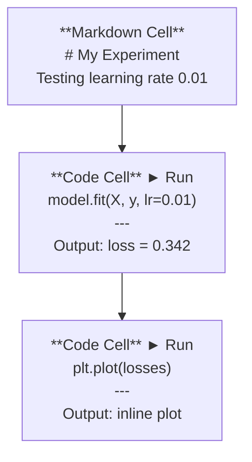
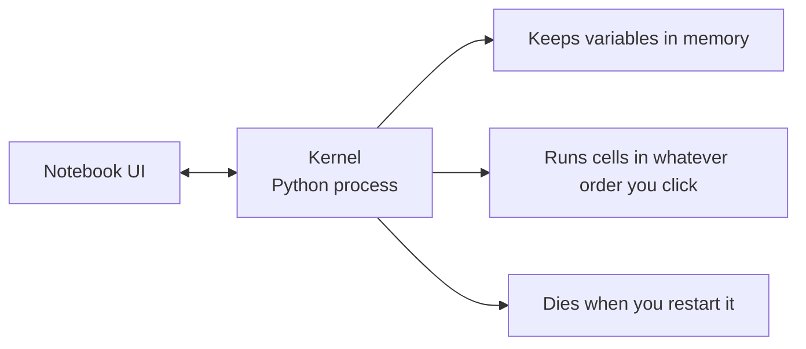

# Jupyter Notebooks

> Notebook 是 AI 工程的实验台。你在这里做原型，然后把有效的部分迁移到生产代码中。

**类型：** 构建
**语言：** Python
**先修要求：** Phase 0, Lesson 01
**时间：** ~30 分钟

## 学习目标

- 安装并启动 JupyterLab、Jupyter Notebook，或带 Jupyter 扩展的 VS Code
- 使用 magic commands（`%timeit`、`%%time`、`%matplotlib inline`）进行基准测试并内联可视化
- 区分什么时候使用 notebook，什么时候使用脚本，并应用“在 notebook 中探索，在脚本中交付”的工作流
- 识别并避免常见 notebook 陷阱：乱序执行、隐藏状态和内存泄漏

## 问题

几乎所有 AI 论文、教程和 Kaggle 竞赛都会使用 Jupyter notebooks。它们让你可以分块运行代码、内联查看输出、把代码和解释混在一起，并快速迭代。如果你不使用 notebook 来学习 AI，就像做数学作业却没有草稿纸。

但 notebook 也有真实的陷阱。很多人把它用于所有事情，包括那些 notebook 非常不擅长的事情。知道什么时候该用 notebook、什么时候该用脚本，会让你以后少掉很多调试噩梦。

## 概念

notebook 是一组 cell 的列表。每个 cell 要么是代码，要么是文本。



kernel 是在后台运行的 Python 进程。当你运行一个 cell 时，它会把代码发送给 kernel，kernel 执行代码并返回结果。所有 cell 共享同一个 kernel，所以变量会在 cell 之间持续存在。



这个“按你点击的任意顺序运行”的特性，既是超能力，也是容易误伤自己的地方。

## 构建它

### Step 1: 选择你的界面

三种选择，同一种格式：

| Interface | Install | Best for |
|-----------|---------|----------|
| JupyterLab | `pip install jupyterlab` then `jupyter lab` | 完整 IDE 体验、多个标签页、文件浏览器、终端 |
| Jupyter Notebook | `pip install notebook` then `jupyter notebook` | 简单、轻量、一次处理一个 notebook |
| VS Code | Install "Jupyter" extension | 已在你的编辑器中、git 集成、调试 |

这三者都读写同一种 `.ipynb` 文件。选择你喜欢的即可。JupyterLab 是 AI 工作中最常见的选择。

```bash
pip install jupyterlab
jupyter lab
```

### Step 2: 重要的键盘快捷键

你会在两种模式中操作。按 `Escape` 进入命令模式（左侧蓝条），按 `Enter` 进入编辑模式（绿条）。

**命令模式（最常用）：**

| Key | Action |
|-----|--------|
| `Shift+Enter` | 运行 cell，并移动到下一个 |
| `A` | 在上方插入 cell |
| `B` | 在下方插入 cell |
| `DD` | 删除 cell |
| `M` | 转换为 markdown |
| `Y` | 转换为 code |
| `Z` | 撤销 cell 操作 |
| `Ctrl+Shift+H` | 显示所有快捷键 |

**编辑模式：**

| Key | Action |
|-----|--------|
| `Tab` | 自动补全 |
| `Shift+Tab` | 显示函数签名 |
| `Ctrl+/` | 切换注释 |

`Shift+Enter` 是你每天会用上千次的快捷键。先学会它。

### Step 3: Cell 类型

**Code cells** 运行 Python 并显示输出：

```python
import numpy as np
data = np.random.randn(1000)
data.mean(), data.std()
```

Output: `(0.0032, 0.9987)`

**Markdown cells** 渲染格式化文本。用它们记录你正在做什么以及为什么这样做。支持标题、粗体、斜体、LaTeX 数学公式（`$E = mc^2$`）、表格和图片。

### Step 4: Magic commands

这些不是 Python。它们是 Jupyter 专用命令，以 `%`（line magic）或 `%%`（cell magic）开头。

**测量代码耗时：**

```python
%timeit np.random.randn(10000)
```

Output: `45.2 us +/- 1.3 us per loop`

```python
%%time
model.fit(X_train, y_train, epochs=10)
```

Output: `Wall time: 2.34 s`

`%timeit` 会多次运行代码并取平均值。`%%time` 只运行一次。用 `%timeit` 做微基准测试，用 `%%time` 测量训练运行。

**启用内联图表：**

```python
%matplotlib inline
```

之后每个 `plt.plot()` 或 `plt.show()` 都会直接在 notebook 中渲染。

**无需离开 notebook 即可安装包：**

```python
!pip install scikit-learn
```

`!` 前缀会运行任意 shell 命令。

**检查环境变量：**

```python
%env CUDA_VISIBLE_DEVICES
```

### Step 5: 内联显示丰富输出

notebook 会自动显示 cell 中最后一个表达式的结果。但你也可以控制它：

```python
import pandas as pd

df = pd.DataFrame({
    "model": ["Linear", "Random Forest", "Neural Net"],
    "accuracy": [0.72, 0.89, 0.94],
    "training_time": [0.1, 2.3, 45.6]
})
df
```

这会渲染为格式化 HTML 表格，而不是文本转储。图表也是一样：

```python
import matplotlib.pyplot as plt

plt.figure(figsize=(8, 4))
plt.plot([1, 2, 3, 4], [1, 4, 2, 3])
plt.title("Inline Plot")
plt.show()
```

图表会出现在 cell 正下方。这就是 notebook 主导 AI 工作的原因。你可以同时看到数据、图表和代码。

对于图片：

```python
from IPython.display import Image, display
display(Image(filename="architecture.png"))
```

### Step 6: Google Colab

Colab 是云端免费的 Jupyter notebook。它提供 GPU、预安装库和 Google Drive 集成。不需要本地设置。

1. Go to [colab.research.google.com](https://colab.research.google.com)
2. Upload any `.ipynb` file from this course
3. Runtime > Change runtime type > T4 GPU (free)

Colab 与本地 Jupyter 的区别：
- 文件不会在会话之间持久保存（保存到 Drive 或下载）
- 预安装：numpy、pandas、matplotlib、torch、tensorflow、sklearn
- 使用 `from google.colab import files` 上传/下载文件
- 使用 `from google.colab import drive; drive.mount('/content/drive')` 获得持久存储
- 免费层会话在 90 分钟无活动后超时

## 使用它

### Notebooks vs Scripts: 什么时候用哪个

| Use notebooks for | Use scripts for |
|-------------------|-----------------|
| 探索数据集 | 训练流水线 |
| 原型化模型 | 可复用工具 |
| 可视化结果 | 任何带有 `if __name__` 的代码 |
| 解释你的工作 | 按计划运行的代码 |
| 快速实验 | 生产代码 |
| 课程练习 | 包和库 |

规则：**在 notebook 中探索，在脚本中交付**。

AI 中常见的工作流：
1. 在 notebook 中探索数据
2. 在 notebook 中原型化模型
3. 一旦可行，把代码迁移到 `.py` 文件
4. 再把这些 `.py` 文件导入 notebook，用于后续实验

### 常见陷阱

**乱序执行。** 你先运行 cell 5，再运行 cell 2，然后运行 cell 7。notebook 在你的机器上能工作，但别人从上到下运行时会崩。修复：共享前执行 Kernel > Restart & Run All。

**隐藏状态。** 你删除了一个 cell，但它创建的变量仍在内存中。notebook 看起来很干净，却依赖一个幽灵 cell。修复：定期重启 kernel。

**内存泄漏。** 加载一个 4GB 数据集、训练一个模型、再加载另一个数据集。没有任何东西被释放。修复：`del variable_name` 和 `gc.collect()`，或者重启 kernel。

## 交付它

本课会产出：
- `outputs/prompt-notebook-helper.md`，用于调试 notebook 问题

## 练习

1. 打开 JupyterLab，创建一个 notebook，并使用 `%timeit` 比较 list comprehension 和 numpy 创建 100,000 个随机数数组的速度
2. 创建一个同时包含 markdown 和 code cells 的 notebook，加载一个 CSV、显示 dataframe，并绘制图表。然后运行 Kernel > Restart & Run All，验证它可以从上到下正常运行
3. 把 `code/notebook_tips.py` 中的代码粘贴到 Colab notebook 中，并使用免费 GPU 运行

## 关键术语

| Term | What people say | What it actually means |
|------|----------------|----------------------|
| Kernel | “运行我代码的东西” | 一个独立的 Python 进程，执行 cells 并把变量保存在内存中 |
| Cell | “代码块” | notebook 中可独立运行的单元，可以是代码或 markdown |
| Magic command | “Jupyter 技巧” | 以 `%` 或 `%%` 为前缀、用于控制 notebook 环境的特殊命令 |
| `.ipynb` | “Notebook 文件” | 一个包含 cells、输出和元数据的 JSON 文件。代表 IPython Notebook |

## 延伸阅读

- [JupyterLab Docs](https://jupyterlab.readthedocs.io/)：了解完整功能集
- [Google Colab FAQ](https://research.google.com/colaboratory/faq.html)：了解 Colab 特有的限制和功能
- [28 Jupyter Notebook Tips](https://www.dataquest.io/blog/jupyter-notebook-tips-tricks-shortcuts/)：了解高级用户快捷键
