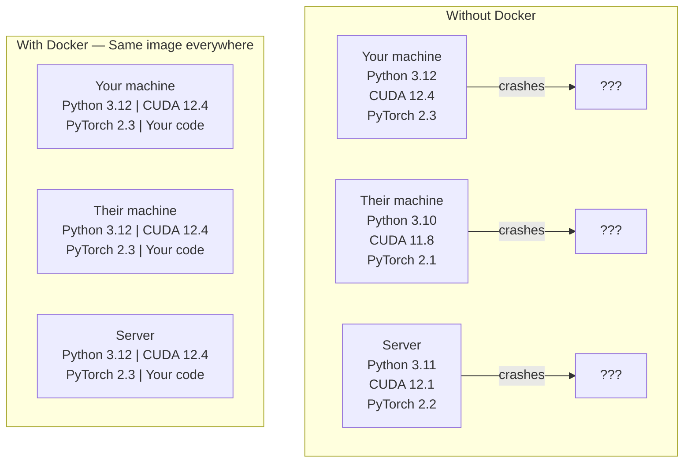

# 面向 AI 的 Docker

> 容器让“在我机器上能跑”成为过去式。

**类型：** 构建
**语言：** Python
**前置要求：** 阶段 0，第 01 课和第 03 课
**时间：** ~60 分钟

## 学习目标

- 使用 Dockerfile 构建启用 GPU 的 Docker 镜像，内含 CUDA、PyTorch 和 AI 库
- 将主机目录挂载为卷，让模型、数据集和代码在容器重建后依然保留
- 配置 NVIDIA Container Toolkit，让容器内部可以访问 GPU
- 使用 Docker Compose 编排多服务 AI 应用（推理服务器 + 向量数据库）

## 问题

你在自己的笔记本上用 PyTorch 2.3、CUDA 12.4 和 Python 3.12 训练了一个模型。你的同事用的是 PyTorch 2.1、CUDA 11.8 和 Python 3.10。你的模型在他们机器上崩溃。你的 Dockerfile 在两边都能运行。

AI 项目是依赖地狱。一个典型栈包含 Python、PyTorch、CUDA 驱动、cuDNN、系统级 C 库，以及像 flash-attn 这种需要精确编译器版本的专用包。Docker 会把这些全部打包进一个镜像，让它在任何地方都以同样方式运行。

## 概念

Docker 会把你的代码、运行时、库和系统工具包进一个叫容器的隔离单元。你可以把它理解成轻量虚拟机，只是它共享宿主机 OS 内核，而不是运行自己的内核，所以启动用秒计，而不是分钟。



### 为什么 AI 项目比多数项目更需要 Docker

1. **GPU 驱动很脆弱。** CUDA 12.4 代码不能在 CUDA 11.8 上运行。Docker 会在容器内隔离 CUDA toolkit，同时通过 NVIDIA Container Toolkit 共享宿主机 GPU 驱动。

2. **模型权重很大。** 一个 7B 参数模型用 fp16 就有 14 GB。你不想每次重建容器都重新下载。Docker 卷可以把宿主机上的 models 目录挂进容器。

3. **多服务架构很常见。** 真正的 AI 应用不只是一个 Python 脚本。它是一个推理服务器、一个用于 RAG 的向量数据库，也许还有一个 Web 前端。Docker Compose 可以用一条命令编排所有服务。

### 关键词汇

| 术语 | 含义 |
|------|---------------|
| Image | 只读模板。你的配方。由 Dockerfile 构建。 |
| Container | 镜像的运行实例。你的厨房。 |
| Dockerfile | 构建镜像的指令。逐层构建。 |
| Volume | 容器重启后仍然存在的持久化存储。 |
| docker-compose | 用 YAML 定义多容器应用的工具。 |

### AI 中常见的容器模式

```
Dev Container
  Full toolkit. Editor support. Jupyter. Debugging tools.
  Used during development and experimentation.

Training Container
  Minimal. Just the training script and dependencies.
  Runs on GPU clusters. No editor, no Jupyter.

Inference Container
  Optimized for serving. Small image. Fast cold start.
  Runs behind a load balancer in production.
```

## 构建它

### 第 1 步：安装 Docker

```bash
# macOS
brew install --cask docker
open /Applications/Docker.app

# Ubuntu
curl -fsSL https://get.docker.com | sh
sudo usermod -aG docker $USER
# Log out and back in for group change to take effect
```

验证：

```bash
docker --version
docker run hello-world
```

### 第 2 步：安装 NVIDIA Container Toolkit（带 NVIDIA GPU 的 Linux）

这会让 Docker 容器访问你的 GPU。macOS 和 Windows（WSL2）用户可以跳过这一步；Docker Desktop 在这些平台上用不同方式处理 GPU 透传。

```bash
distribution=$(. /etc/os-release;echo $ID$VERSION_ID)
curl -fsSL https://nvidia.github.io/libnvidia-container/gpgkey | sudo gpg --dearmor -o /usr/share/keyrings/nvidia-container-toolkit-keyring.gpg
curl -s -L https://nvidia.github.io/libnvidia-container/$distribution/libnvidia-container.list | \
    sed 's#deb https://#deb [signed-by=/usr/share/keyrings/nvidia-container-toolkit-keyring.gpg] https://#g' | \
    sudo tee /etc/apt/sources.list.d/nvidia-container-toolkit.list

sudo apt-get update
sudo apt-get install -y nvidia-container-toolkit
sudo nvidia-ctk runtime configure --runtime=docker
sudo systemctl restart docker
```

在容器内测试 GPU 访问：

```bash
docker run --rm --gpus all nvidia/cuda:12.4.1-base-ubuntu22.04 nvidia-smi
```

如果你能看到 GPU 信息，toolkit 就工作正常。

### 第 3 步：理解基础镜像

选对基础镜像可以省下好几个小时的调试。

```
nvidia/cuda:12.4.1-devel-ubuntu22.04
  Full CUDA toolkit. Compilers included.
  Use for: building packages that need nvcc (flash-attn, bitsandbytes)
  Size: ~4 GB

nvidia/cuda:12.4.1-runtime-ubuntu22.04
  CUDA runtime only. No compilers.
  Use for: running pre-built code
  Size: ~1.5 GB

pytorch/pytorch:2.3.1-cuda12.4-cudnn9-runtime
  PyTorch pre-installed on top of CUDA.
  Use for: skipping the PyTorch install step
  Size: ~6 GB

python:3.12-slim
  No CUDA. CPU only.
  Use for: inference on CPU, lightweight tools
  Size: ~150 MB
```

### 第 4 步：为 AI 开发写 Dockerfile

这是本课 `code/Dockerfile` 里的 Dockerfile。我们逐段看它：

```dockerfile
FROM nvidia/cuda:12.4.1-devel-ubuntu22.04

ENV DEBIAN_FRONTEND=noninteractive
ENV PYTHONUNBUFFERED=1

RUN apt-get update && apt-get install -y --no-install-recommends \
    python3.12 \
    python3.12-venv \
    python3.12-dev \
    python3-pip \
    git \
    curl \
    build-essential \
    && rm -rf /var/lib/apt/lists/*

RUN update-alternatives --install /usr/bin/python python /usr/bin/python3.12 1

RUN python -m pip install --no-cache-dir --upgrade pip setuptools wheel

RUN python -m pip install --no-cache-dir \
    torch==2.3.1 \
    torchvision==0.18.1 \
    torchaudio==2.3.1 \
    --index-url https://download.pytorch.org/whl/cu124

RUN python -m pip install --no-cache-dir \
    numpy \
    pandas \
    scikit-learn \
    matplotlib \
    jupyter \
    transformers \
    datasets \
    accelerate \
    safetensors

WORKDIR /workspace

VOLUME ["/workspace", "/models"]

EXPOSE 8888

CMD ["python"]
```

构建它：

```bash
docker build -t ai-dev -f phases/00-setup-and-tooling/07-docker-for-ai/code/Dockerfile .
```

第一次会花一些时间（下载 CUDA 基础镜像 + PyTorch）。后续构建会使用缓存层。

运行它：

```bash
docker run --rm -it --gpus all \
    -v $(pwd):/workspace \
    -v ~/models:/models \
    ai-dev python -c "import torch; print(f'PyTorch {torch.__version__}, CUDA: {torch.cuda.is_available()}')"
```

在容器内运行 Jupyter：

```bash
docker run --rm -it --gpus all \
    -v $(pwd):/workspace \
    -v ~/models:/models \
    -p 8888:8888 \
    ai-dev jupyter notebook --ip=0.0.0.0 --port=8888 --no-browser --allow-root
```

### 第 5 步：为数据和模型挂载卷

卷挂载对 AI 工作很关键。没有它们，你 14 GB 的模型下载会在容器停止时消失。

```bash
# Mount your code
-v $(pwd):/workspace

# Mount a shared models directory
-v ~/models:/models

# Mount datasets
-v ~/datasets:/data
```

在训练脚本里，从挂载路径加载：

```python
from transformers import AutoModel

model = AutoModel.from_pretrained("/models/llama-7b")
```

模型存在宿主机文件系统上。你可以随便重建容器，不用重新下载。

### 第 6 步：为多服务 AI 应用使用 Docker Compose

真正的 RAG 应用需要一个推理服务器和一个向量数据库。Docker Compose 用一条命令运行两者。

见 `code/docker-compose.yml`：

```yaml
services:
  ai-dev:
    build:
      context: .
      dockerfile: Dockerfile
    deploy:
      resources:
        reservations:
          devices:
            - driver: nvidia
              count: all
              capabilities: [gpu]
    volumes:
      - ../../../:/workspace
      - ~/models:/models
      - ~/datasets:/data
    ports:
      - "8888:8888"
    stdin_open: true
    tty: true
    command: jupyter notebook --ip=0.0.0.0 --port=8888 --no-browser --allow-root

  qdrant:
    image: qdrant/qdrant:v1.12.5
    ports:
      - "6333:6333"
      - "6334:6334"
    volumes:
      - qdrant_data:/qdrant/storage

volumes:
  qdrant_data:
```

启动所有服务：

```bash
cd phases/00-setup-and-tooling/07-docker-for-ai/code
docker compose up -d
```

现在你的 AI dev 容器可以通过服务名访问向量数据库：`http://qdrant:6333`。Docker Compose 会自动创建共享网络。

从 AI 容器内测试连接：

```python
from qdrant_client import QdrantClient

client = QdrantClient(host="qdrant", port=6333)
print(client.get_collections())
```

停止所有服务：

```bash
docker compose down
```

加上 `-v` 会同时删除 qdrant 卷：

```bash
docker compose down -v
```

### 第 7 步：AI 工作中常用的 Docker 命令

```bash
# List running containers
docker ps

# List all images and their sizes
docker images

# Remove unused images (reclaim disk space)
docker system prune -a

# Check GPU usage inside a running container
docker exec -it <container_id> nvidia-smi

# Copy a file from container to host
docker cp <container_id>:/workspace/results.csv ./results.csv

# View container logs
docker logs -f <container_id>
```

## 使用它

你现在有了可复现的 AI 开发环境。在本课程剩下的部分：

- 使用 `docker compose up` 同时启动开发环境和向量数据库
- 把代码、模型和数据挂载为卷，确保重建之间不会丢东西
- 当某节课需要新的 Python 包时，把它加到 Dockerfile，然后重建
- 把 Dockerfile 分享给队友。他们会得到完全相同的环境。

### 没有 GPU？

移除 `--gpus all` 标志和 NVIDIA deploy 块。容器仍然可以用于基于 CPU 的课程。PyTorch 会检测到没有 CUDA，并自动回退到 CPU。

## 练习

1. 构建 Dockerfile，并在容器内运行 `python -c "import torch; print(torch.__version__)"`
2. 启动 docker-compose 栈，并验证 AI 容器可以访问 `http://qdrant:6333/collections`
3. 把 `flask` 加到 Dockerfile，重建，并在端口 5000 上运行一个简单 API 服务器。用 `-p 5000:5000` 映射端口
4. 用 `docker images` 测量镜像大小。尝试把基础镜像从 `devel` 换成 `runtime`，并比较大小

## 关键术语

| 术语 | 人们常说 | 实际含义 |
|------|----------------|----------------------|
| Container | “轻量 VM” | 使用宿主机内核的隔离进程，有自己的文件系统和网络 |
| Image layer | “缓存步骤” | 每条 Dockerfile 指令都会创建一层。未变化的层会被缓存，所以重建很快。 |
| NVIDIA Container Toolkit | “Docker 里的 GPU” | 通过 `--gpus` 标志把宿主机 GPU 暴露给容器的运行时 hook |
| Volume mount | “共享文件夹” | 宿主机上的目录映射到容器内。容器停止后改动仍会保留。 |
| Base image | “起点” | Dockerfile 所基于的 `FROM` 镜像。它决定预装了什么。 |
