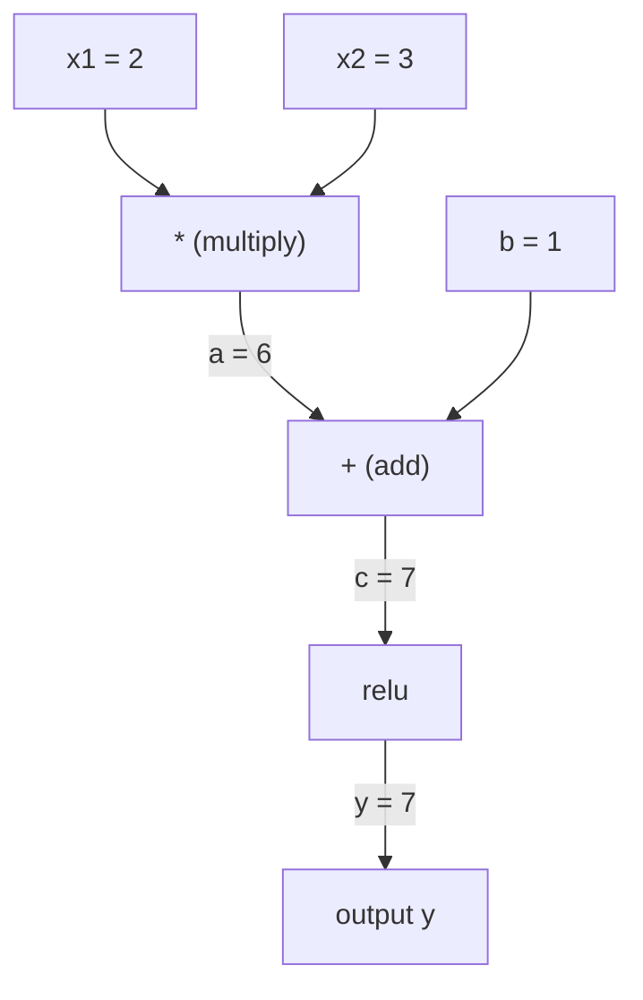
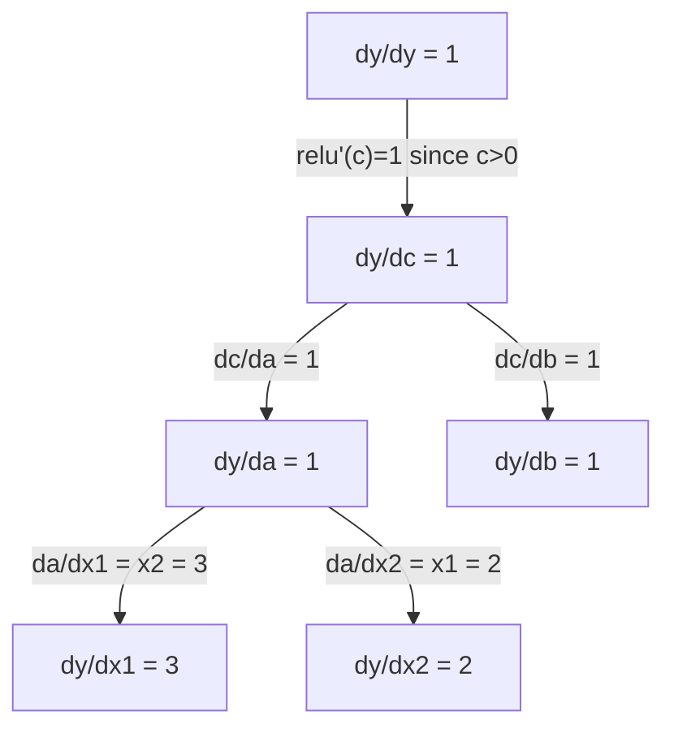

# 链式法则与自动微分

> 链式法则是每个会学习的神经网络背后的引擎。

**类型：** 构建
**语言：** Python
**前置要求：** 阶段 1，第 04 课（导数与 Gradients）
**时间：** ~90 分钟

## 学习目标

- 构建一个最小 autograd engine（Value 类），记录操作并通过 reverse-mode autodiff 计算 gradients
- 使用拓扑排序，在计算图上实现 forward 和 backward pass
- 只使用从零构建的 autograd engine，在 XOR 上构造并训练一个 multi-layer perceptron
- 通过与数值有限差分进行 gradient checking，验证 autodiff 的正确性

## 问题

你可以计算简单函数的导数。但神经网络不是简单函数。它是几百个函数组合在一起：矩阵乘法、加 bias、应用 activation、再做矩阵乘法、softmax、cross-entropy loss。输出是函数的函数的函数。

为了训练网络，你需要 loss 对每一个权重的 gradient。对数百万参数手算，这是不可能的。用数值方法（finite differences）算，又太慢。

链式法则给你数学。Automatic differentiation 给你算法。它们合在一起，让你能以与一次 forward pass 成比例的时间，计算任意函数组合的精确 gradients。

这就是 PyTorch、TensorFlow 和 JAX 的工作方式。你会从零构建一个微型版本。

## 概念

### 链式法则

如果 `y = f(g(x))`，那么 `y` 对 `x` 的导数是：

```
dy/dx = dy/dg * dg/dx = f'(g(x)) * g'(x)
```

沿着链条把导数相乘。每一环都贡献自己的局部导数。

例子：`y = sin(x^2)`

```
g(x) = x^2       g'(x) = 2x
f(g) = sin(g)     f'(g) = cos(g)

dy/dx = cos(x^2) * 2x
```

对更深的组合，链条会继续延伸：

```
y = f(g(h(x)))

dy/dx = f'(g(h(x))) * g'(h(x)) * h'(x)
```

神经网络中的每一层都是这条链中的一环。

### 计算图

计算图让链式法则变得可视化。每个操作都变成一个节点。数据沿图向前流动。Gradients 沿图向后流动。

**Forward pass（计算值）：**



**Backward pass（计算 gradients）：**



Backward pass 在每个节点应用链式法则，把 gradients 从输出传播回输入。

### Forward Mode vs Reverse Mode

在图上应用链式法则有两种方式。

**Forward mode** 从输入开始，把导数向前推。它计算 `dx/dx = 1`，并通过每个操作传播。适合输入少、输出多的场景。

```
Forward mode: seed dx/dx = 1, propagate forward

  x = 2       (dx/dx = 1)
  a = x^2     (da/dx = 2x = 4)
  y = sin(a)  (dy/dx = cos(a) * da/dx = cos(4) * 4 = -2.615)
```

**Reverse mode** 从输出开始，把 gradients 往回拉。它计算 `dy/dy = 1`，并按相反顺序通过每个操作传播。适合输入多、输出少的场景。

```
Reverse mode: seed dy/dy = 1, propagate backward

  y = sin(a)  (dy/dy = 1)
  a = x^2     (dy/da = cos(a) = cos(4) = -0.654)
  x = 2       (dy/dx = dy/da * da/dx = -0.654 * 4 = -2.615)
```

神经网络有数百万输入（权重）和一个输出（loss）。Reverse mode 会在一次 backward pass 中计算所有 gradients。这就是 backpropagation 使用 reverse mode 的原因。

| 模式 | Seed | 方向 | 最适合 |
|------|------|-----------|-----------|
| Forward | `dx_i/dx_i = 1` | 输入到输出 | 输入少、输出多 |
| Reverse | `dy/dy = 1` | 输出到输入 | 输入多、输出少（神经网络） |

### 用 Dual Numbers 实现 Forward Mode

Forward mode 可以用 dual numbers 优雅地实现。Dual number 的形式是 `a + b*epsilon`，其中 `epsilon^2 = 0`。

```
Dual number: (value, derivative)

(2, 1) means: value is 2, derivative w.r.t. x is 1

Arithmetic rules:
  (a, a') + (b, b') = (a+b, a'+b')
  (a, a') * (b, b') = (a*b, a'*b + a*b')
  sin(a, a')         = (sin(a), cos(a)*a')
```

把输入变量的导数 seed 为 1。导数就会自动穿过每个操作传播。

### 构建 Autograd Engine

一个 autograd engine 需要三件事：

1. **Value 包装。** 把每个数字包装进一个对象，存储它的值和 gradient。
2. **图记录。** 每个操作都记录它的输入和局部 gradient 函数。
3. **Backward pass。** 对图做拓扑排序，然后反向遍历，在每个节点应用链式法则。

这正是 PyTorch 的 `autograd` 做的事。`torch.Tensor` 类包装值，在 `requires_grad=True` 时记录操作，并在你调用 `.backward()` 时计算 gradients。

### PyTorch Autograd 底层如何工作

当你写 PyTorch 代码：

```python
x = torch.tensor(2.0, requires_grad=True)
y = x ** 2 + 3 * x + 1
y.backward()
print(x.grad)  # 7.0 = 2*x + 3 = 2*2 + 3
```

PyTorch 内部会：

1. 为 `x` 创建一个 `Tensor` 节点，并设置 `requires_grad=True`
2. 每个操作（`**`、`*`、`+`）都会创建新节点，并记录 backward function
3. `y.backward()` 会触发对已记录图的 reverse-mode autodiff
4. 每个节点的 `grad_fn` 计算局部 gradients，并传给父节点
5. Gradients 会通过加法累积到 `.grad` 属性中（不是替换）

这张图是动态的（define-by-run）。每次 forward pass 都会构建一张新图。这就是为什么 PyTorch 支持在模型里写控制流（if/else、loops）。

## 构建它

### 第 1 步：Value 类

```python
class Value:
    def __init__(self, data, children=(), op=''):
        self.data = data
        self.grad = 0.0
        self._backward = lambda: None
        self._prev = set(children)
        self._op = op

    def __repr__(self):
        return f"Value(data={self.data:.4f}, grad={self.grad:.4f})"
```

每个 `Value` 都存储它的数值数据、gradient（初始为零）、一个 backward 函数，以及指向产生它的子节点的指针。

### 第 2 步：带 gradient tracking 的算术运算

```python
    def __add__(self, other):
        other = other if isinstance(other, Value) else Value(other)
        out = Value(self.data + other.data, (self, other), '+')
        def _backward():
            self.grad += out.grad
            other.grad += out.grad
        out._backward = _backward
        return out

    def __mul__(self, other):
        other = other if isinstance(other, Value) else Value(other)
        out = Value(self.data * other.data, (self, other), '*')
        def _backward():
            self.grad += other.data * out.grad
            other.grad += self.data * out.grad
        out._backward = _backward
        return out

    def relu(self):
        out = Value(max(0, self.data), (self,), 'relu')
        def _backward():
            self.grad += (1.0 if out.data > 0 else 0.0) * out.grad
        out._backward = _backward
        return out
```

每个操作都会创建一个 closure，知道如何计算局部 gradients 并乘以上游 gradient（`out.grad`）。`+=` 处理的是一个值被多个操作使用的情况。

### 第 3 步：Backward pass

```python
    def backward(self):
        topo = []
        visited = set()
        def build_topo(v):
            if v not in visited:
                visited.add(v)
                for child in v._prev:
                    build_topo(child)
                topo.append(v)
        build_topo(self)

        self.grad = 1.0
        for v in reversed(topo):
            v._backward()
```

拓扑排序确保每个节点的 gradient 完全计算好之后，才会传播给它的子节点。Seed gradient 是 1.0（dy/dy = 1）。

### 第 4 步：让 engine 完整所需的更多操作

基础 Value 类支持加法、乘法和 relu。真正的 autograd engine 还需要更多操作。下面这些操作足以构建神经网络：

```python
    def __neg__(self):
        return self * -1

    def __sub__(self, other):
        return self + (-other)

    def __radd__(self, other):
        return self + other

    def __rmul__(self, other):
        return self * other

    def __rsub__(self, other):
        return other + (-self)

    def __pow__(self, n):
        out = Value(self.data ** n, (self,), f'**{n}')
        def _backward():
            self.grad += n * (self.data ** (n - 1)) * out.grad
        out._backward = _backward
        return out

    def __truediv__(self, other):
        return self * (other ** -1) if isinstance(other, Value) else self * (Value(other) ** -1)

    def exp(self):
        import math
        e = math.exp(self.data)
        out = Value(e, (self,), 'exp')
        def _backward():
            self.grad += e * out.grad
        out._backward = _backward
        return out

    def log(self):
        import math
        out = Value(math.log(self.data), (self,), 'log')
        def _backward():
            self.grad += (1.0 / self.data) * out.grad
        out._backward = _backward
        return out

    def tanh(self):
        import math
        t = math.tanh(self.data)
        out = Value(t, (self,), 'tanh')
        def _backward():
            self.grad += (1 - t ** 2) * out.grad
        out._backward = _backward
        return out
```

**为什么每个操作都重要：**

| Operation | Backward rule | Used in |
|-----------|--------------|---------|
| `__sub__` | 复用 add + neg | Loss computation（pred - target） |
| `__pow__` | n * x^(n-1) | Polynomial activations、MSE（error^2） |
| `__truediv__` | 复用 mul + pow(-1) | Normalization、learning rate scaling |
| `exp` | exp(x) * upstream | Softmax、log-likelihood |
| `log` | (1/x) * upstream | Cross-entropy loss、log probabilities |
| `tanh` | (1 - tanh^2) * upstream | 经典 activation function |

聪明之处在于：`__sub__` 和 `__truediv__` 是用已有操作定义的。它们会免费获得正确 gradients，因为链式法则会穿过底层 add/mul/pow 操作组合起来。

### 第 5 步：从零构建 Mini MLP

有了完整的 Value 类，你就可以构建神经网络。不用 PyTorch。不用 NumPy。只有 Values 和链式法则。

```python
import random

class Neuron:
    def __init__(self, n_inputs):
        self.w = [Value(random.uniform(-1, 1)) for _ in range(n_inputs)]
        self.b = Value(0.0)

    def __call__(self, x):
        act = sum((wi * xi for wi, xi in zip(self.w, x)), self.b)
        return act.tanh()

    def parameters(self):
        return self.w + [self.b]

class Layer:
    def __init__(self, n_inputs, n_outputs):
        self.neurons = [Neuron(n_inputs) for _ in range(n_outputs)]

    def __call__(self, x):
        return [n(x) for n in self.neurons]

    def parameters(self):
        return [p for n in self.neurons for p in n.parameters()]

class MLP:
    def __init__(self, sizes):
        self.layers = [Layer(sizes[i], sizes[i+1]) for i in range(len(sizes)-1)]

    def __call__(self, x):
        for layer in self.layers:
            x = layer(x)
        return x[0] if len(x) == 1 else x

    def parameters(self):
        return [p for layer in self.layers for p in layer.parameters()]
```

一个 `Neuron` 计算 `tanh(w1*x1 + w2*x2 + ... + b)`。一个 `Layer` 是一组 neurons。一个 `MLP` 会把 layers 堆叠起来。每个权重都是 `Value`，所以调用 `loss.backward()` 会把 gradients 传播到每个参数。

**在 XOR 上训练：**

```python
random.seed(42)
model = MLP([2, 4, 1])  # 2 inputs, 4 hidden neurons, 1 output

xs = [[0, 0], [0, 1], [1, 0], [1, 1]]
ys = [-1, 1, 1, -1]  # XOR pattern (using -1/1 for tanh)

for step in range(100):
    preds = [model(x) for x in xs]
    loss = sum((p - y) ** 2 for p, y in zip(preds, ys))

    for p in model.parameters():
        p.grad = 0.0
    loss.backward()

    lr = 0.05
    for p in model.parameters():
        p.data -= lr * p.grad

    if step % 20 == 0:
        print(f"step {step:3d}  loss = {loss.data:.4f}")

print("\nPredictions after training:")
for x, y in zip(xs, ys):
    print(f"  input={x}  target={y:2d}  pred={model(x).data:6.3f}")
```

这就是 micrograd。一个用纯 Python 和 automatic differentiation 写出来的完整神经网络训练循环。每个商业深度学习框架都在巨大规模上做同样的事。

### 第 6 步：Gradient checking

你怎么知道自己的 autodiff 是正确的？把它与数值导数比较。这就是 gradient checking。

```python
def gradient_check(build_expr, x_val, h=1e-7):
    x = Value(x_val)
    y = build_expr(x)
    y.backward()
    autodiff_grad = x.grad

    y_plus = build_expr(Value(x_val + h)).data
    y_minus = build_expr(Value(x_val - h)).data
    numerical_grad = (y_plus - y_minus) / (2 * h)

    diff = abs(autodiff_grad - numerical_grad)
    return autodiff_grad, numerical_grad, diff
```

用复杂表达式测试它：

```python
def expr(x):
    return (x ** 3 + x * 2 + 1).tanh()

ad, num, diff = gradient_check(expr, 0.5)
print(f"Autodiff:  {ad:.8f}")
print(f"Numerical: {num:.8f}")
print(f"Difference: {diff:.2e}")
# Difference should be < 1e-5
```

实现新操作时，gradient checking 是必不可少的。如果你的 backward pass 有 bug，数值检查会抓到它。每个严肃的深度学习实现都会在开发期间运行 gradient checks。

**什么时候用 gradient checking：**

| 情况 | 是否做 gradient check？ |
|-----------|-------------------|
| 给 autograd 添加新操作 | 是，永远要做 |
| 调试无法收敛的训练循环 | 是，先检查 gradients |
| 生产训练 | 否，太慢（每个参数需要 2 次 forward pass） |
| autograd 代码的单元测试 | 是，把它自动化 |

### 第 7 步：对照手算验证

```python
x1 = Value(2.0)
x2 = Value(3.0)
a = x1 * x2          # a = 6.0
b = a + Value(1.0)    # b = 7.0
y = b.relu()          # y = 7.0

y.backward()

print(f"y = {y.data}")          # 7.0
print(f"dy/dx1 = {x1.grad}")   # 3.0 (= x2)
print(f"dy/dx2 = {x2.grad}")   # 2.0 (= x1)
```

手算检查：`y = relu(x1*x2 + 1)`。由于 `x1*x2 + 1 = 7 > 0`，relu 是恒等函数。
`dy/dx1 = x2 = 3`。`dy/dx2 = x1 = 2`。Engine 匹配。

## 使用它

### 与 PyTorch 验证

```python
import torch

x1 = torch.tensor(2.0, requires_grad=True)
x2 = torch.tensor(3.0, requires_grad=True)
a = x1 * x2
b = a + 1.0
y = torch.relu(b)
y.backward()

print(f"PyTorch dy/dx1 = {x1.grad.item()}")  # 3.0
print(f"PyTorch dy/dx2 = {x2.grad.item()}")  # 2.0
```

Gradients 相同。你的 engine 计算出的结果和 PyTorch 相同，因为数学相同：通过链式法则做 reverse-mode autodiff。

### 更复杂的表达式

```python
a = Value(2.0)
b = Value(-3.0)
c = Value(10.0)
f = (a * b + c).relu()  # relu(2*(-3) + 10) = relu(4) = 4

f.backward()
print(f"df/da = {a.grad}")  # -3.0 (= b)
print(f"df/db = {b.grad}")  #  2.0 (= a)
print(f"df/dc = {c.grad}")  #  1.0
```

## 交付它

本课会产出：
- `outputs/skill-autodiff.md`：用于构建和调试 autograd 系统的 skill
- `code/autodiff.py`：一个可以扩展的最小 autograd engine

这里构建的 Value 类，是阶段 3 神经网络训练循环的基础。

## 练习

1. 给 Value 类添加 `__pow__`，这样你就能计算 `x ** n`。验证 `x=2` 时 `d/dx(x^3)` 等于 `12.0`。

2. 添加 `tanh` 作为 activation function。验证 `tanh'(0) = 1`，且 `tanh'(2) = 0.0707`（近似）。

3. 为单个 neuron 构建计算图：`y = relu(w1*x1 + w2*x2 + b)`。计算全部五个 gradients，并与 PyTorch 验证。

4. 使用 dual numbers 实现 forward-mode autodiff。创建一个 `Dual` 类，并验证它给出的导数与你的 reverse-mode engine 相同。

## 关键术语

| 术语 | 人们常说 | 它实际意味着什么 |
|------|----------------|----------------------|
| 链式法则 | “导数相乘” | 复合函数的导数等于每个函数局部导数的乘积，并且要在正确位置求值 |
| 计算图 | “网络图” | 有向无环图，其中节点是操作，边携带值（forward）或 gradients（backward） |
| Forward mode | “向前推导数” | 从输入到输出传播导数的 autodiff。每个输入变量需要一次 pass。 |
| Reverse mode | “Backpropagation” | 从输出到输入传播 gradients 的 autodiff。每个输出变量需要一次 pass。 |
| Autograd | “自动 gradients” | 一个记录值上的操作、构建图，并通过链式法则计算精确 gradients 的系统 |
| Dual numbers | “值加导数” | 形如 a + b*epsilon（epsilon^2 = 0）的数，会在算术运算中携带导数信息 |
| 拓扑排序 | “依赖顺序” | 对图节点排序，使每个节点都排在它所有依赖之后。正确传播 gradient 必需。 |
| Gradient accumulation | “相加，不替换” | 当一个值流入多个操作时，它的 gradient 是所有传入 gradient 贡献之和 |
| Dynamic graph | “Define by run” | 每次 forward pass 都重建的计算图，允许在模型中使用 Python 控制流（PyTorch 风格） |
| Gradient checking | “数值验证” | 把 autodiff gradients 与数值 finite-difference gradients 比较以验证正确性。调试必需。 |
| MLP | “Multi-layer perceptron” | 有一层或多层隐藏 neurons 的神经网络。每个 neuron 计算加权和加 bias，然后应用 activation function。 |
| Neuron | “加权和 + activation” | 基本单元：output = activation(w1*x1 + w2*x2 + ... + b)。权重和 bias 是可学习参数。 |

## 延伸阅读

- [3Blue1Brown: Backpropagation calculus](https://www.youtube.com/watch?v=tIeHLnjs5U8) -- 神经网络中链式法则的视觉解释
- [PyTorch Autograd mechanics](https://pytorch.org/docs/stable/notes/autograd.html) -- 真实系统如何工作
- [Baydin et al., Automatic Differentiation in Machine Learning: a Survey](https://arxiv.org/abs/1502.05767) -- 综合参考
