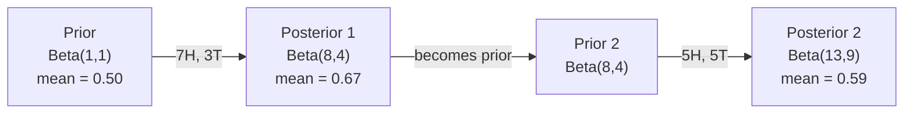

# 贝叶斯定理

> 概率关乎你预期什么。贝叶斯定理关乎你学到了什么。

**类型：** 构建
**语言：** Python
**前置要求：** 阶段 1，第 06 课（概率基础）
**时间：** ~75 分钟

## 学习目标

- 应用 Bayes' theorem，从 prior、likelihood 和 evidence 计算 posterior probability
- 从零构建一个 Naive Bayes 文本分类器，使用 Laplace smoothing 和 log-space 计算
- 比较 MLE 与 MAP estimation，并解释 MAP 如何对应 L2 regularization
- 使用 Beta-Binomial conjugate priors，为 A/B testing 实现 sequential Bayesian updating

## 问题

一个医学检测有 99% 的准确率。你的检测结果为阳性。你真的患病的概率是多少？

大多数人会说 99%。真实答案取决于这种病有多罕见。如果 10,000 人中只有 1 人患病，那么阳性结果只意味着你大约有 1% 的概率患病。其余 99% 的阳性结果，都是健康人得到的误报。

这不是脑筋急转弯。这就是 Bayes' theorem。每个垃圾邮件过滤器、每个医学诊断系统、每个量化不确定性的机器学习模型，都在使用完全相同的推理。你从一个信念开始。你看到证据。你更新信念。

如果你在不理解这一点的情况下构建 ML 系统，你会误读模型输出，设置糟糕的阈值，并发布过度自信的预测。

## 概念

### 从联合概率到 Bayes

你已经从第 06 课知道，条件概率是：

```
P(A|B) = P(A and B) / P(B)
```

对称地：

```
P(B|A) = P(A and B) / P(A)
```

两个表达式有相同的分子：P(A and B)。令它们相等并整理：

```
P(A and B) = P(A|B) * P(B) = P(B|A) * P(A)

Therefore:

P(A|B) = P(B|A) * P(A) / P(B)
```

这就是 Bayes' theorem。四个量，一个方程。

### 四个部分

| 部分 | 名称 | 含义 |
|------|------|---------------|
| P(A\|B) | Posterior | 看到证据 B 之后，你对 A 的更新后信念 |
| P(B\|A) | Likelihood | 如果 A 为真，证据 B 有多可能出现 |
| P(A) | Prior | 在看到任何证据之前，你对 A 的信念 |
| P(B) | Evidence | 在所有可能性下看到 B 的总概率 |

Evidence 项 P(B) 充当归一化因子。你可以用全概率公式展开它：

```
P(B) = P(B|A) * P(A) + P(B|not A) * P(not A)
```

### 医学检测例子

一种疾病影响 10,000 人中的 1 人。检测准确率 99%（能检测出 99% 的病人，误报率为 1%）。

```
P(sick)          = 0.0001     (prior: disease is rare)
P(positive|sick) = 0.99       (likelihood: test catches it)
P(positive|healthy) = 0.01    (false positive rate)

P(positive) = P(positive|sick) * P(sick) + P(positive|healthy) * P(healthy)
            = 0.99 * 0.0001 + 0.01 * 0.9999
            = 0.000099 + 0.009999
            = 0.010098

P(sick|positive) = P(positive|sick) * P(sick) / P(positive)
                 = 0.99 * 0.0001 / 0.010098
                 = 0.0098
                 = 0.98%
```

低于 1%。Prior 占主导。当某种情况很罕见时，即便是准确的检测，也会产生大量误报。这就是医生会要求复检的原因。

### 垃圾邮件过滤例子

你收到一封包含单词 "lottery" 的邮件。它是垃圾邮件吗？

```
P(spam)                = 0.3      (30% of email is spam)
P("lottery"|spam)      = 0.05     (5% of spam emails contain "lottery")
P("lottery"|not spam)  = 0.001    (0.1% of legitimate emails contain "lottery")

P("lottery") = 0.05 * 0.3 + 0.001 * 0.7
             = 0.015 + 0.0007
             = 0.0157

P(spam|"lottery") = 0.05 * 0.3 / 0.0157
                  = 0.955
                  = 95.5%
```

一个词就把概率从 30% 推到了 95.5%。真正的垃圾邮件过滤器会同时对数百个词应用 Bayes。

### Naive Bayes：独立性假设

Naive Bayes 通过假设在给定类别的条件下，所有特征都是条件独立的，把这个思想扩展到多个特征：

```
P(class | feature_1, feature_2, ..., feature_n)
  = P(class) * P(feature_1|class) * P(feature_2|class) * ... * P(feature_n|class)
    / P(feature_1, feature_2, ..., feature_n)
```

"naive" 指的是独立性假设。在文本中，词的出现并不独立（"New" 和 "York" 是相关的）。但这个假设在实践中效果出奇地好，因为分类器只需要给类别排序，而不是产生校准良好的概率。

由于分母对所有类别都相同，你可以跳过它，只比较分子：

```
score(class) = P(class) * product of P(feature_i | class)
```

选择分数最高的类别。

### Maximum likelihood estimation（MLE）

如何从训练数据得到 P(feature|class)？计数。

```
P("free"|spam) = (number of spam emails containing "free") / (total spam emails)
```

这就是 MLE：选择让观测数据最可能出现的参数值。你在最大化 likelihood function；对离散计数来说，它会化简成相对频率。

问题：如果某个词在训练时从未出现在 spam 中，MLE 会给它概率零。一个没见过的词会让整个乘积归零。用 Laplace smoothing 修复：

```
P(word|class) = (count(word, class) + 1) / (total_words_in_class + vocabulary_size)
```

给每个计数加 1，确保概率永远不会为零。

### Maximum a posteriori（MAP）

MLE 问的是：哪些参数最大化 P(data|parameters)？

MAP 问的是：哪些参数最大化 P(parameters|data)？

根据 Bayes' theorem：

```
P(parameters|data) proportional to P(data|parameters) * P(parameters)
```

MAP 会给参数本身加入 prior。如果你相信参数应该较小，就把它编码成一个惩罚大值的 prior。这与 ML 中的 L2 regularization 完全相同。Ridge regression 中的 "ridge" 惩罚，字面上就是权重上的 Gaussian prior。

| 估计 | 优化目标 | ML 等价物 |
|------------|-----------|---------------|
| MLE | P(data\|params) | 未正则化训练 |
| MAP | P(data\|params) * P(params) | L2 / L1 regularization |

### Bayesian vs frequentist：实践差异

Frequentists 把参数看作固定但未知的量。他们问：“如果我重复这个实验很多次，会发生什么？”

Bayesians 把参数看作分布。他们问：“基于我已经观察到的东西，我对参数相信什么？”

对构建 ML 系统来说，实践差异是：

| 方面 | Frequentist | Bayesian |
|--------|-------------|----------|
| 输出 | 点估计 | 值上的分布 |
| 不确定性 | Confidence intervals（关于过程） | Credible intervals（关于参数） |
| 小数据 | 可能过拟合 | Prior 充当 regularization |
| 计算 | 通常更快 | 通常需要 sampling（MCMC） |

大多数生产 ML 是 frequentist（SGD、点估计）。当你需要校准良好的不确定性（医学决策、安全关键系统），或数据稀缺（few-shot learning、cold start）时，Bayesian 方法会发光。

### 为什么 Bayesian thinking 对 ML 重要

这种连接比类比更深：

**Priors 是 regularization。** 权重上的 Gaussian prior 就是 L2 regularization。Laplace prior 就是 L1。每当你添加 regularization term，本质上都在声明一个关于参数值预期的 Bayesian 观点。

**Posteriors 是不确定性。** 单个预测概率并不能告诉你模型对这个估计有多自信。Bayesian 方法会给出一个分布：“我认为 P(spam) 在 0.8 到 0.95 之间。”

**Bayes 更新是 online learning。** 今天的 posterior 会成为明天的 prior。当模型看到新数据时，它会增量更新信念，而不是从零重新训练。

**模型比较是 Bayesian 的。** Bayesian information criterion（BIC）、marginal likelihood 和 Bayes factors 都使用 Bayesian reasoning，在不过拟合的情况下选择模型。

## 构建它

### 第 1 步：Bayes theorem 函数

```python
def bayes(prior, likelihood, false_positive_rate):
    evidence = likelihood * prior + false_positive_rate * (1 - prior)
    posterior = likelihood * prior / evidence
    return posterior

result = bayes(prior=0.0001, likelihood=0.99, false_positive_rate=0.01)
print(f"P(sick|positive) = {result:.4f}")
```

### 第 2 步：Naive Bayes 分类器

```python
import math
from collections import defaultdict

class NaiveBayes:
    def __init__(self, smoothing=1.0):
        self.smoothing = smoothing
        self.class_counts = defaultdict(int)
        self.word_counts = defaultdict(lambda: defaultdict(int))
        self.class_word_totals = defaultdict(int)
        self.vocab = set()

    def train(self, documents, labels):
        for doc, label in zip(documents, labels):
            self.class_counts[label] += 1
            words = doc.lower().split()
            for word in words:
                self.word_counts[label][word] += 1
                self.class_word_totals[label] += 1
                self.vocab.add(word)

    def predict(self, document):
        words = document.lower().split()
        total_docs = sum(self.class_counts.values())
        vocab_size = len(self.vocab)
        best_class = None
        best_score = float("-inf")
        for cls in self.class_counts:
            score = math.log(self.class_counts[cls] / total_docs)
            for word in words:
                count = self.word_counts[cls].get(word, 0)
                total = self.class_word_totals[cls]
                score += math.log((count + self.smoothing) / (total + self.smoothing * vocab_size))
            if score > best_score:
                best_score = score
                best_class = cls
        return best_class
```

Log probabilities 可以防止下溢。许多小概率相乘，会产生浮点数无法表示的极小数字。对 log-probabilities 求和在数值上稳定，并且在数学上等价。

### 第 3 步：在垃圾邮件数据上训练

```python
train_docs = [
    "win free money now",
    "free lottery ticket winner",
    "claim your prize today free",
    "urgent offer free cash",
    "congratulations you won free",
    "meeting tomorrow at noon",
    "project update attached",
    "can we schedule a call",
    "quarterly report review",
    "lunch on thursday sounds good",
    "team standup notes attached",
    "please review the pull request",
]

train_labels = [
    "spam", "spam", "spam", "spam", "spam",
    "ham", "ham", "ham", "ham", "ham", "ham", "ham",
]

classifier = NaiveBayes()
classifier.train(train_docs, train_labels)

test_messages = [
    "free money waiting for you",
    "meeting rescheduled to friday",
    "you won a free prize",
    "please review the attached report",
]

for msg in test_messages:
    print(f"  '{msg}' -> {classifier.predict(msg)}")
```

### 第 4 步：检查学到的概率

```python
def show_top_words(classifier, cls, n=5):
    vocab_size = len(classifier.vocab)
    total = classifier.class_word_totals[cls]
    probs = {}
    for word in classifier.vocab:
        count = classifier.word_counts[cls].get(word, 0)
        probs[word] = (count + classifier.smoothing) / (total + classifier.smoothing * vocab_size)
    sorted_words = sorted(probs.items(), key=lambda x: x[1], reverse=True)
    for word, prob in sorted_words[:n]:
        print(f"    {word}: {prob:.4f}")

print("\nTop spam words:")
show_top_words(classifier, "spam")
print("\nTop ham words:")
show_top_words(classifier, "ham")
```

## 使用它

Scikit-learn 提供生产可用的 naive Bayes 实现：

```python
from sklearn.feature_extraction.text import CountVectorizer
from sklearn.naive_bayes import MultinomialNB
from sklearn.metrics import classification_report

vectorizer = CountVectorizer()
X_train = vectorizer.fit_transform(train_docs)
clf = MultinomialNB()
clf.fit(X_train, train_labels)

X_test = vectorizer.transform(test_messages)
predictions = clf.predict(X_test)
for msg, pred in zip(test_messages, predictions):
    print(f"  '{msg}' -> {pred}")
```

同一个算法。CountVectorizer 处理 tokenization 和 vocabulary building。MultinomialNB 在内部处理 smoothing 和 log-probabilities。你从零写的版本用 40 行代码做了同样的事。

## 交付它

这里构建的 NaiveBayes 类展示了完整流水线：tokenization、使用 Laplace smoothing 估计概率、log-space prediction。`code/bayes.py` 中的代码可以端到端运行，除了 Python 标准库没有其他依赖。

### Conjugate Priors

当 prior 和 posterior 属于同一分布族时，这个 prior 称为“conjugate”。这会让 Bayesian updating 在代数上很干净：不需要数值积分，就能得到闭式 posterior。

| Likelihood | Conjugate Prior | Posterior | Example |
|-----------|----------------|-----------|---------|
| Bernoulli | Beta(a, b) | Beta(a + successes, b + failures) | 估计硬币偏置 |
| Normal（已知方差） | Normal(mu_0, sigma_0) | Normal(weighted mean, smaller variance) | 传感器校准 |
| Poisson | Gamma(a, b) | Gamma(a + sum of counts, b + n) | 建模到达率 |
| Multinomial | Dirichlet(alpha) | Dirichlet(alpha + counts) | Topic modeling、language models |

为什么这重要：没有 conjugate priors，你需要 Monte Carlo sampling 或 variational inference 来近似 posterior。有了 conjugate priors，你只需要更新两个数字。

Beta 分布是实践中最常见的 conjugate prior。Beta(a, b) 表示你对某个概率参数的信念。均值是 a/(a+b)。a+b 越大，分布越集中（越自信）。

Beta prior 的特殊情况：
- Beta(1, 1) = uniform。你对参数没有意见。
- Beta(10, 10) = 在 0.5 附近尖峰。你强烈相信参数接近 0.5。
- Beta(1, 10) = 向 0 偏斜。你相信参数很小。

更新规则极其简单：

```
Prior:     Beta(a, b)
Data:      s successes, f failures
Posterior: Beta(a + s, b + f)
```

没有积分。没有采样。只有加法。

### Sequential Bayesian Updating

Bayesian inference 天然是序贯的。今天的 posterior 会成为明天的 prior。这就是真实系统如何增量学习，而不重新处理所有历史数据。

具体例子：估计一枚硬币是否公平。

**第 1 天：还没有数据。**
从 Beta(1, 1) 开始：uniform prior。你没有意见。
- Prior mean: 0.5
- Prior 在 [0, 1] 上是平的

**第 2 天：观察到 7 次正面、3 次反面。**
Posterior = Beta(1 + 7, 1 + 3) = Beta(8, 4)
- Posterior mean: 8/12 = 0.667
- 证据表明硬币偏向正面

**第 3 天：再观察到 5 次正面、5 次反面。**
把昨天的 posterior 当作今天的 prior。
Posterior = Beta(8 + 5, 4 + 5) = Beta(13, 9)
- Posterior mean: 13/22 = 0.591
- 新的均衡数据把估计拉回了 0.5



观察顺序不重要。Beta(1,1) 一次性用全部 12 次正面和 8 次反面更新，也会得到 Beta(13, 9)：同一个结果。Sequential updating 和 batch updating 在数学上等价。但 sequential updating 让你可以在每一步做决策，而无需存储原始数据。

这是生产 ML 系统中 online learning 的基础。Bandit 的 Thompson sampling、增量推荐系统和 streaming anomaly detector 都使用这个模式。

### 与 A/B Testing 的连接

A/B testing 是伪装成实验的 Bayesian inference。

设定：你在测试两种按钮颜色。Variant A（蓝色）和 variant B（绿色）。你想知道哪一个获得更多点击。

Bayesian A/B test：

1. **Prior。** 两个 variant 都从 Beta(1, 1) 开始。没有 prior preference。
2. **Data。** Variant A：1000 次展示中 50 次点击。Variant B：1000 次展示中 65 次点击。
3. **Posteriors。**
   - A: Beta(1 + 50, 1 + 950) = Beta(51, 951)。Mean = 0.051
   - B: Beta(1 + 65, 1 + 935) = Beta(66, 936)。Mean = 0.066
4. **Decision。** 计算 P(B > A)：B 的真实转化率高于 A 的概率。

解析地计算 P(B > A) 很难。但 Monte Carlo 让它非常简单：

```
1. Draw 100,000 samples from Beta(51, 951)  -> samples_A
2. Draw 100,000 samples from Beta(66, 936)  -> samples_B
3. P(B > A) = fraction of samples where B > A
```

如果 P(B > A) > 0.95，就发布 variant B。如果它在 0.05 和 0.95 之间，就继续收集数据。如果 P(B > A) < 0.05，就发布 variant A。

相比 frequentist A/B testing 的优势：
- 你得到的是直接概率陈述：“B 有 97% 的概率更好”
- 没有 p-value 困惑。没有“无法拒绝原假设”的含糊表达。
- 你可以随时检查结果，而不会抬高假阳性率（没有 “peeking problem”）
- 你可以纳入 prior knowledge（例如之前测试表明转化率通常是 3-8%）

| 方面 | Frequentist A/B | Bayesian A/B |
|--------|----------------|--------------|
| 输出 | p-value | P(B > A) |
| 解释 | “如果 A=B，这些数据有多意外？” | “B 比 A 更好的可能性有多大？” |
| 提前停止 | 会抬高 false positives | 任意时间点都安全（前提是 prior 选得好且模型设定正确） |
| Prior knowledge | 不使用 | 编码成 Beta prior |
| 决策规则 | p < 0.05 | P(B > A) > threshold |

## 练习

1. **多次检测。** 一个病人连续两次独立检测为阳性（两次检测都 99% 准确，疾病患病率为 1/10,000）。两次检测后 P(sick) 是多少？把第一次检测的 posterior 当作第二次检测的 prior。

2. **Smoothing 影响。** 用 smoothing 值 0.01、0.1、1.0 和 10.0 运行垃圾邮件分类器。Top word probabilities 如何变化？当 smoothing=0 且某个词只出现在 ham 中时会发生什么？

3. **添加特征。** 扩展 NaiveBayes 类，除了 word counts，也使用消息长度（short/long）作为特征。从训练数据估计 P(short|spam) 和 P(short|ham)，并把它加入 prediction score。

4. **手算 MAP。** 给定观测数据（10 次抛硬币中 7 次正面），使用 Beta(2,2) prior 计算 bias 的 MAP estimate。把它与 MLE estimate（7/10）比较。

## 关键术语

| 术语 | 人们常说 | 它实际意味着什么 |
|------|----------------|----------------------|
| Prior | “我的初始猜测” | 观察证据之前的 P(hypothesis)。在 ML 中：regularization term。 |
| Likelihood | “数据有多符合” | P(evidence\|hypothesis)。在某个具体 hypothesis 下，观测数据有多可能。 |
| Posterior | “我的更新后信念” | P(hypothesis\|evidence)。Prior 乘以 likelihood，再归一化。 |
| Evidence | “归一化常数” | 所有 hypotheses 下的 P(data)。确保 posterior 求和为 1。 |
| Naive Bayes | “那个简单文本分类器” | 假设给定类别后特征独立的分类器。虽然假设不真实，但效果很好。 |
| Laplace smoothing | “加一平滑” | 给每个特征加一个小计数，防止未见数据产生零概率。 |
| MLE | “直接用频率” | 选择最大化 P(data\|parameters) 的参数。没有 prior。小数据时可能过拟合。 |
| MAP | “带 prior 的 MLE” | 选择最大化 P(data\|parameters) * P(parameters) 的参数。等价于正则化 MLE。 |
| Log-probability | “在 log 空间工作” | 使用 log(P) 而不是 P，避免许多小数相乘时发生浮点下溢。 |
| False positive | “错误警报” | 测试显示阳性，但真实状态为阴性。它驱动 base rate fallacy。 |

## 延伸阅读

- [3Blue1Brown: Bayes' theorem](https://www.youtube.com/watch?v=HZGCoVF3YvM) - 用医学检测例子做视觉解释
- [Stanford CS229: Generative Learning Algorithms](https://cs229.stanford.edu/notes2022fall/cs229-notes2.pdf) - naive Bayes 及其与 discriminative models 的连接
- [Think Bayes](https://greenteapress.com/wp/think-bayes/) - 免费书，用 Python 讲 Bayesian statistics
- [scikit-learn Naive Bayes](https://scikit-learn.org/stable/modules/naive_bayes.html) - 生产实现，以及何时使用哪个变体
