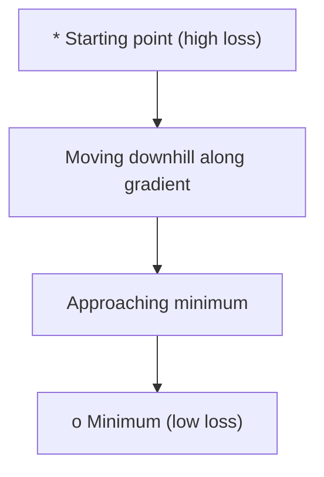
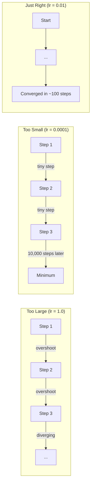
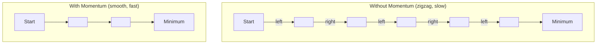
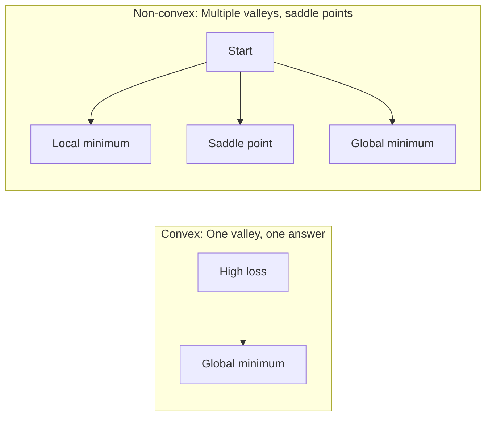
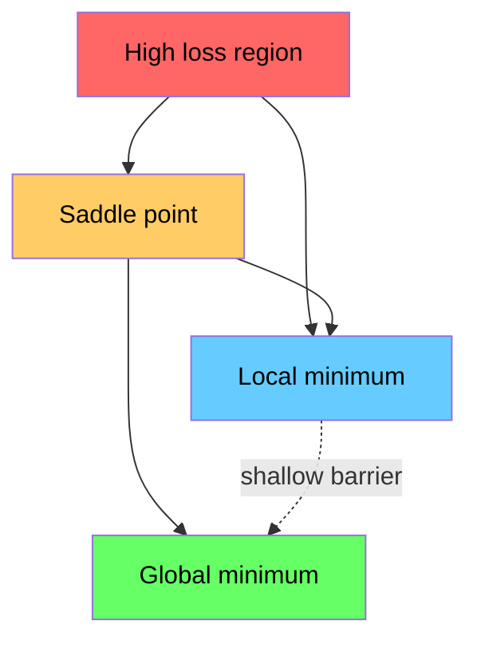

# 优化

> 训练神经网络，不过是在山谷里寻找最低点。

**类型：** 构建
**语言：** Python
**前置要求：** 阶段 1，第 04-05 课（导数、Gradients）
**时间：** ~75 分钟

## 学习目标

- 从零实现 vanilla gradient descent、带 momentum 的 SGD 和 Adam
- 比较 optimizer 在 Rosenbrock 函数上的收敛情况，并解释为什么 Adam 会为每个权重自适应 learning rate
- 区分 convex 和 non-convex loss landscape，并解释 saddle points 在高维中的作用
- 配置 learning rate schedules（step decay、cosine annealing、warmup），提升训练稳定性

## 问题

你有一个 loss function。它告诉你模型错得多厉害。你有 gradients。它们告诉你哪个方向会让 loss 变糟。现在你需要一个沿下坡走的策略。

最朴素的方法很简单：朝 gradient 的反方向移动。用一个叫 learning rate 的数字缩放步长。重复。这就是 gradient descent，而且它有效。但“有效”有很多附加条件。Learning rate 太大，你会直接越过山谷，在两侧来回弹跳。太小，你会用成千上万步慢慢爬向答案。遇到 saddle point，你会停止移动，虽然你还没有找到最小值。

深度学习中的每个 optimizer 都在回答同一个问题：如何更快、更可靠地到达山谷底部？

## 概念

### 优化是什么意思

优化就是找到让函数最小（或最大）的输入值。在机器学习中，这个函数是 loss。输入是模型权重。训练就是优化。

```
minimize L(w) where:
  L = loss function
  w = model weights (could be millions of parameters)
```

### Gradient descent（vanilla）

最简单的 optimizer。计算 loss 对每个权重的 gradient。让每个权重沿自己的 gradient 反方向移动。用 learning rate 缩放步长。

```
w = w - lr * gradient
```

这就是完整算法。一行。



### Learning rate：最重要的超参数

Learning rate 控制步长。它决定了收敛的一切。



正确的 learning rate 没有公式。你通过实验找到它。常见起点：Adam 用 0.001，带 momentum 的 SGD 用 0.01。

### SGD vs batch vs mini-batch

Vanilla gradient descent 会在整个数据集上计算 gradient，然后才走一步。这叫 batch gradient descent。它稳定，但慢。

Stochastic gradient descent（SGD）在单个随机样本上计算 gradient，并立即走一步。它噪声大，但快。

Mini-batch gradient descent 介于两者之间。在一个小 batch（32、64、128、256 个样本）上计算 gradient，然后走一步。这是大家实际使用的方式。

| 变体 | Batch size | Gradient 质量 | 每步速度 | 噪声 |
|---------|-----------|-----------------|---------------|-------|
| Batch GD | 整个数据集 | 精确 | 慢 | 无 |
| SGD | 1 个样本 | 非常 noisy | 快 | 高 |
| Mini-batch | 32-256 | 良好估计 | 平衡 | 中等 |

SGD 和 mini-batch 中的噪声不是 bug。它有助于逃离浅的局部最小值和 saddle points。

### Momentum：沿下坡滚动的球

Vanilla gradient descent 只看当前 gradient。如果 gradient 左右来回 zigzag（在狭窄山谷中很常见），进展会很慢。Momentum 通过把过去的 gradients 累积进一个 velocity 项来解决这个问题。

```
v = beta * v + gradient
w = w - lr * v
```

类比：一个沿下坡滚动的球。它不会在每个小坑处停下再重新启动。它会在一致方向上积累速度，并抑制振荡。



`beta`（通常 0.9）控制保留多少历史。beta 越高，momentum 越强，路径越平滑，但对方向变化的响应也越慢。

### Adam：自适应 learning rates

不同权重需要不同的 learning rate。很少得到大 gradients 的权重，在终于得到时应该走大一些。总是得到巨大 gradients 的权重，应该走小一些。

Adam（Adaptive Moment Estimation）为每个权重跟踪两件事：

1. First moment（m）：gradients 的运行平均（类似 momentum）
2. Second moment（v）：平方 gradients 的运行平均（gradient magnitude）

```
m = beta1 * m + (1 - beta1) * gradient
v = beta2 * v + (1 - beta2) * gradient^2

m_hat = m / (1 - beta1^t)    bias correction
v_hat = v / (1 - beta2^t)    bias correction

w = w - lr * m_hat / (sqrt(v_hat) + epsilon)
```

除以 `sqrt(v_hat)` 是关键洞见。Gradient 大的权重会除以大数字（有效步长小）。Gradient 小的权重会除以小数字（有效步长大）。每个权重都有自己的自适应 learning rate。

默认超参数：`lr=0.001, beta1=0.9, beta2=0.999, epsilon=1e-8`。这些默认值对大多数问题都有效。

### Learning rate schedules

固定 learning rate 是一种折中。训练早期，你想用大步快速推进。训练后期，你想在最小值附近用小步精调。

常见 schedule：

| Schedule | 公式 | 使用场景 |
|----------|---------|----------|
| Step decay | lr = lr * factor every N epochs | 简单，手动控制 |
| Exponential decay | lr = lr_0 * decay^t | 平滑降低 |
| Cosine annealing | lr = lr_min + 0.5 * (lr_max - lr_min) * (1 + cos(pi * t / T)) | Transformers、现代训练 |
| Warmup + decay | 线性升高，然后衰减 | 大模型，防止早期不稳定 |

### Convex vs non-convex

Convex function 只有一个最小值。Gradient descent 总能找到它。像 `f(x) = x^2` 这样的二次函数是 convex 的。

神经网络 loss functions 是 non-convex 的。它们有很多局部最小值、saddle points 和平坦区域。



实践中，高维神经网络里的局部最小值很少是问题。大多数局部最小值的 loss 接近全局最小值。Saddle points（某些方向平坦，另一些方向弯曲）才是真正障碍。Momentum 和 mini-batch 的噪声有助于逃离它们。

### Loss landscape 可视化

Loss 是所有权重的函数。对一个有 100 万权重的模型，loss landscape 位于 1,000,001 维空间。我们通过在权重空间中选两个随机方向，并沿这些方向绘制 loss，得到一个 2D 曲面来可视化它。



Sharp minima 泛化差。Flat minima 泛化好。这也是 SGD with momentum 在最终测试准确率上常常超过 Adam 的一个原因：它的噪声会避免停在 sharp minima。

## 构建它

### 第 1 步：定义测试函数

Rosenbrock 函数是经典优化 benchmark。它的最小值在 (1, 1)，位于一条狭窄弯曲山谷中；容易找到山谷，但很难沿着它走。

```
f(x, y) = (1 - x)^2 + 100 * (y - x^2)^2
```

```python
def rosenbrock(params):
    x, y = params
    return (1 - x) ** 2 + 100 * (y - x ** 2) ** 2

def rosenbrock_gradient(params):
    x, y = params
    df_dx = -2 * (1 - x) + 200 * (y - x ** 2) * (-2 * x)
    df_dy = 200 * (y - x ** 2)
    return [df_dx, df_dy]
```

### 第 2 步：Vanilla gradient descent

```python
class GradientDescent:
    def __init__(self, lr=0.001):
        self.lr = lr

    def step(self, params, grads):
        return [p - self.lr * g for p, g in zip(params, grads)]
```

### 第 3 步：带 momentum 的 SGD

```python
class SGDMomentum:
    def __init__(self, lr=0.001, momentum=0.9):
        self.lr = lr
        self.momentum = momentum
        self.velocity = None

    def step(self, params, grads):
        if self.velocity is None:
            self.velocity = [0.0] * len(params)
        self.velocity = [
            self.momentum * v + g
            for v, g in zip(self.velocity, grads)
        ]
        return [p - self.lr * v for p, v in zip(params, self.velocity)]
```

### 第 4 步：Adam

```python
class Adam:
    def __init__(self, lr=0.001, beta1=0.9, beta2=0.999, epsilon=1e-8):
        self.lr = lr
        self.beta1 = beta1
        self.beta2 = beta2
        self.epsilon = epsilon
        self.m = None
        self.v = None
        self.t = 0

    def step(self, params, grads):
        if self.m is None:
            self.m = [0.0] * len(params)
            self.v = [0.0] * len(params)

        self.t += 1

        self.m = [
            self.beta1 * m + (1 - self.beta1) * g
            for m, g in zip(self.m, grads)
        ]
        self.v = [
            self.beta2 * v + (1 - self.beta2) * g ** 2
            for v, g in zip(self.v, grads)
        ]

        m_hat = [m / (1 - self.beta1 ** self.t) for m in self.m]
        v_hat = [v / (1 - self.beta2 ** self.t) for v in self.v]

        return [
            p - self.lr * mh / (vh ** 0.5 + self.epsilon)
            for p, mh, vh in zip(params, m_hat, v_hat)
        ]
```

### 第 5 步：运行并比较

```python
def optimize(optimizer, func, grad_func, start, steps=5000):
    params = list(start)
    history = [params[:]]
    for _ in range(steps):
        grads = grad_func(params)
        params = optimizer.step(params, grads)
        history.append(params[:])
    return history

start = [-1.0, 1.0]

gd_history = optimize(GradientDescent(lr=0.0005), rosenbrock, rosenbrock_gradient, start)
sgd_history = optimize(SGDMomentum(lr=0.0001, momentum=0.9), rosenbrock, rosenbrock_gradient, start)
adam_history = optimize(Adam(lr=0.01), rosenbrock, rosenbrock_gradient, start)

for name, history in [("GD", gd_history), ("SGD+M", sgd_history), ("Adam", adam_history)]:
    final = history[-1]
    loss = rosenbrock(final)
    print(f"{name:6s} -> x={final[0]:.6f}, y={final[1]:.6f}, loss={loss:.8f}")
```

预期输出：Adam 收敛最快。SGD with momentum 的路径更平滑。Vanilla GD 在狭窄山谷里推进缓慢。

## 使用它

实践中，使用 PyTorch 或 JAX optimizers。它们会处理 parameter groups、weight decay、gradient clipping 和 GPU acceleration。

```python
import torch

model = torch.nn.Linear(784, 10)

sgd = torch.optim.SGD(model.parameters(), lr=0.01, momentum=0.9)
adam = torch.optim.Adam(model.parameters(), lr=0.001)
adamw = torch.optim.AdamW(model.parameters(), lr=0.001, weight_decay=0.01)

scheduler = torch.optim.lr_scheduler.CosineAnnealingLR(adam, T_max=100)
```

经验法则：

- 从 Adam（lr=0.001）开始。它对大多数问题都无需调参即可工作。
- 当你需要最佳最终准确率，并且能承受更多调参时，切换到 SGD with momentum（lr=0.01, momentum=0.9）。
- 对 transformers 使用 AdamW（带 decoupled weight decay 的 Adam）。
- 对训练超过几个 epoch 的运行，始终使用 learning rate schedule。
- 如果训练不稳定，降低 learning rate。如果训练太慢，提高它。

## 交付它

本课会产出一个用于选择正确 optimizer 的 prompt。见 `outputs/prompt-optimizer-guide.md`。

这里构建的 optimizer 类会在阶段 3 训练从零实现的神经网络时再次出现。

## 练习

1. **Learning rate sweep。** 在 Rosenbrock 函数上运行 vanilla gradient descent，learning rates 为 [0.0001, 0.0005, 0.001, 0.005, 0.01]。打印或绘制每个在 5000 步后的最终 loss。找到仍能收敛的最大 learning rate。

2. **Momentum comparison。** 在 Rosenbrock 函数上运行 momentum 值为 [0.0, 0.5, 0.9, 0.99] 的 SGD。跟踪每一步的 loss。哪个 momentum 值收敛最快？哪个会 overshoot？

3. **Saddle point escape。** 定义函数 `f(x, y) = x^2 - y^2`（原点是 saddle point）。从 (0.01, 0.01) 开始。比较 vanilla GD、SGD with momentum 和 Adam 的行为。哪个会逃离 saddle point？

4. **实现 learning rate decay。** 给 GradientDescent 类添加 exponential decay schedule：`lr = lr_0 * 0.999^step`。在 Rosenbrock 函数上比较有无 decay 的收敛情况。

## 关键术语

| 术语 | 人们常说 | 它实际意味着什么 |
|------|----------------|----------------------|
| Gradient descent | “往下坡走” | 用 learning rate 缩放 gradient，然后从权重中减去它。最基本的 optimizer。 |
| Learning rate | “步长” | 控制每次更新让权重移动多远的标量。太大会发散。太小浪费计算。 |
| Momentum | “持续滚动” | 把过去的 gradients 累积进 velocity 向量。抑制振荡，并沿一致方向加速。 |
| SGD | “随机采样” | Stochastic gradient descent。用随机子集而非完整数据集计算 gradient。实践中几乎总是指 mini-batch SGD。 |
| Mini-batch | “一块数据” | 用来估计 gradient 的一小部分训练数据（32-256 个样本）。平衡速度和 gradient 准确度。 |
| Adam | “默认 optimizer” | Adaptive Moment Estimation。跟踪每个权重 gradients 和 squared gradients 的运行平均，让每个权重有自己的 learning rate。 |
| Bias correction | “修正冷启动” | Adam 的一阶和二阶矩初始化为零。Bias correction 通过除以 (1 - beta^t) 补偿早期步骤。 |
| Learning rate schedule | “随时间改变 lr” | 训练中调整 learning rate 的函数。早期大步，后期小步。 |
| Convex function | “一个山谷” | 任意局部最小值都是全局最小值的函数。Gradient descent 总能找到它。神经网络 loss 不是 convex。 |
| Saddle point | “平，但不是最小值” | Gradient 为零，但在某些方向是最小值、另一些方向是最大值的点。高维中常见。 |
| Loss landscape | “地形” | Loss function 在权重空间上的图。通常沿两个随机方向切片可视化。 |
| Convergence | “到达那里” | Optimizer 到达一个点，后续步骤不再显著降低 loss。 |

## 延伸阅读

- [Sebastian Ruder: An overview of gradient descent optimization algorithms](https://ruder.io/optimizing-gradient-descent/) - 所有主要 optimizers 的综合综述
- [Why Momentum Really Works (Distill)](https://distill.pub/2017/momentum/) - momentum dynamics 的交互式可视化
- [Adam: A Method for Stochastic Optimization (Kingma & Ba, 2014)](https://arxiv.org/abs/1412.6980) - 原始 Adam 论文，短且可读
- [Visualizing the Loss Landscape of Neural Nets (Li et al., 2018)](https://arxiv.org/abs/1712.09913) - 展示 sharp vs flat minima 的论文
