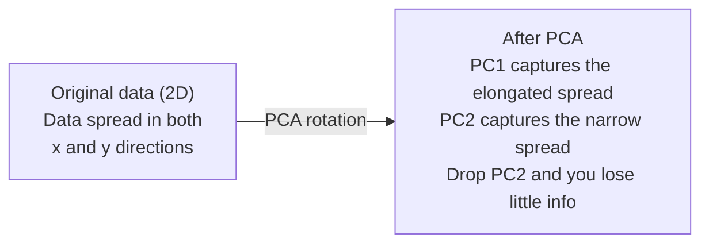

# 降维

> 高维数据有结构。你要从正确角度看，才能找到它。

**类型：** 构建
**语言：** Python
**前置要求：** 阶段 1，第 01 课（线性代数直觉）、第 02 课（向量、矩阵与运算）、第 03 课（特征值与特征向量）、第 06 课（概率与分布）
**时间：** ~90 分钟

## 学习目标

- 从零实现 PCA：数据中心化、计算 covariance matrix、eigendecompose，并投影
- 使用 explained variance ratio 和 elbow method 选择 principal components 的数量
- 比较 PCA、t-SNE 和 UMAP 在 2D 中可视化 MNIST 数字的效果，并解释它们的取舍
- 使用 RBF kernel 的 kernel PCA，分离标准 PCA 无法处理的 nonlinear data structures

## 问题

你有一个每个样本 784 个 features 的数据集。也许它是手写数字的像素值。也许是基因表达水平。也许是用户行为信号。你无法可视化 784 维。你无法画出来。甚至很难在脑中想象。

但这 784 个 features 中大多数都是冗余的。真正的信息存在于一个小得多的曲面上。一个手写的“7”不需要 784 个相互独立的数字来描述。它只需要几个量：笔画角度、横杠长度、倾斜程度。剩下的是噪声。

降维会找到那个更小的曲面。它把你的 784 维数据压缩到 2、10 或 50 维，同时保留重要结构。

## 概念

### 维度灾难

高维空间不符合直觉。随着维度增长，有三件事会失效。

**距离变得没有意义。** 在高维中，任意两个随机点之间的距离会收敛到同一个值。如果每个点到其他点的距离都差不多，nearest-neighbor search 就失效了。

```
Dimension    Avg distance ratio (max/min between random points)
2            ~5.0
10           ~1.8
100          ~1.2
1000         ~1.02
```

**体积集中到角落。** d 维单位超立方体有 2^d 个角。在 100 维中，几乎所有体积都位于角落，远离中心。数据点散到边缘，模型在内部区域得不到足够数据。

**你需要指数级更多数据。** 为了在空间中保持相同样本密度，从 2D 到 20D 意味着你需要 10^18 倍更多数据。你永远不够。降低维度会把数据密度带回可用范围。

### PCA：找到重要方向

Principal Component Analysis（PCA）会找到数据变化最大的轴。它旋转你的坐标系，让第一根轴捕获最大方差，第二根轴捕获次大方差，以此类推。

算法：

```
1. Center the data        (subtract the mean from each feature)
2. Compute covariance     (how features move together)
3. Eigendecomposition     (find the principal directions)
4. Sort by eigenvalue     (biggest variance first)
5. Project               (keep top k eigenvectors, drop the rest)
```

为什么用 eigendecomposition？Covariance matrix 是对称且半正定的。它的 eigenvectors 是 feature space 中的正交方向。Eigenvalues 告诉你每个方向捕获多少方差。最大 eigenvalue 对应的 eigenvector 指向最大方差方向。



- **PCA 前：** 数据云沿对角线分布，跨越 x 和 y 两个轴
- **PCA 后：** 坐标系被旋转，使 PC1 对齐最大方差方向（拉长的 spread），PC2 对齐最小方差方向（狭窄的 spread）
- **降维：** 丢弃 PC2 会把数据投影到 PC1 上，只损失很少信息

### Explained variance ratio

每个 principal component 捕获总方差的一部分。Explained variance ratio 告诉你捕获了多少。

```
Component    Eigenvalue    Explained ratio    Cumulative
PC1          4.73          0.473              0.473
PC2          2.51          0.251              0.724
PC3          1.12          0.112              0.836
PC4          0.89          0.089              0.925
...
```

当 cumulative explained variance 达到 0.95 时，你就知道这些 components 捕获了 95% 的信息。后面的基本都是噪声。

### 选择 components 数量

三种策略：

1. **Threshold。** 保留足够多的 components，以解释 90-95% 的方差。
2. **Elbow method。** 绘制每个 component 的 explained variance。寻找明显下坠点。
3. **Downstream performance。** 把 PCA 作为预处理。遍历 k 并测量模型准确率。最佳 k 是准确率进入平台期的位置。

### t-SNE：保留邻域

t-Distributed Stochastic Neighbor Embedding（t-SNE）是为可视化设计的。它把高维数据映射到 2D（或 3D），同时尽量保留哪些点彼此相近。

直觉：在原始空间中，根据点之间距离计算一个点对概率分布。近的点概率高。远的点概率低。然后寻找一个 2D 排列，让同样的概率分布成立。在 784 维中相邻的点，在 2D 中仍然相邻。

t-SNE 的关键性质：
- 非线性。它可以展开 PCA 无法处理的复杂 manifold。
- 随机。不同运行会产生不同布局。
- Perplexity 参数控制考虑多少 neighbors（典型范围：5-50）。
- 输出中 clusters 之间的距离没有意义。只有 clusters 本身有意义。
- 大数据集上慢。默认 O(n^2)。

### UMAP：更快，更好的全局结构

Uniform Manifold Approximation and Projection（UMAP）与 t-SNE 类似，但有两个优势：
- 更快。它使用 approximate nearest-neighbor graphs，而不是计算所有 pairwise distances。
- 更好的全局结构。输出中 clusters 的相对位置通常比 t-SNE 更有意义。

UMAP 在高维空间中构建一个 weighted graph（“fuzzy topological representation”），然后寻找一个低维布局，尽可能保留这张图。

关键参数：
- `n_neighbors`：定义局部结构需要多少 neighbors（类似 perplexity）。值越高，保留更多全局结构。
- `min_dist`：输出中点聚得多紧。值越低，clusters 越密。

### 什么时候用哪个

| 方法 | 使用场景 | 保留什么 | 速度 |
|--------|----------|-----------|-------|
| PCA | 训练前预处理 | 全局方差 | 快（精确），适用于百万级样本 |
| PCA | 快速探索性可视化 | 线性结构 | 快 |
| t-SNE | 发表级 2D 图 | 局部邻域 | 慢（< 10k 样本较理想） |
| UMAP | 大规模 2D 可视化 | 局部 + 部分全局结构 | 中等（可处理百万级） |
| PCA | 模型 feature reduction | 按方差排序的 features | 快 |
| t-SNE / UMAP | 理解 cluster structure | Cluster separation | 中到慢 |

经验法则：用 PCA 做预处理和数据压缩。当你需要在 2D 中可视化结构时，用 t-SNE 或 UMAP。

### Kernel PCA

标准 PCA 寻找线性子空间。它旋转坐标系并丢弃轴。但如果数据位于 nonlinear manifold 上呢？2D 中的一个圆无法被任何直线分开。标准 PCA 帮不上忙。

Kernel PCA 会在由 kernel function 诱导出的高维 feature space 中做 PCA，而不显式计算那个空间里的坐标。这就是 kernel trick：与 SVM 背后的思想相同。

算法：
1. 计算 kernel matrix K，其中 K_ij = k(x_i, x_j)
2. 在 feature space 中中心化 kernel matrix
3. 对中心化后的 kernel matrix 做 eigendecompose
4. 顶部 eigenvectors（按 1/sqrt(eigenvalue) 缩放）就是 projections

常见 kernel functions：

| Kernel | 公式 | 适合 |
|--------|---------|----------|
| RBF (Gaussian) | exp(-gamma * \|\|x - y\|\|^2) | 大多数 nonlinear data、smooth manifolds |
| Polynomial | (x . y + c)^d | 多项式关系 |
| Sigmoid | tanh(alpha * x . y + c) | 类神经网络映射 |

什么时候用 kernel PCA vs standard PCA：

| 标准 | Standard PCA | Kernel PCA |
|-----------|-------------|------------|
| 数据结构 | 线性子空间 | Nonlinear manifold |
| 速度 | O(min(n^2 d, d^2 n)) | O(n^2 d + n^3) |
| 可解释性 | Components 是 features 的线性组合 | Components 缺少直接 feature interpretation |
| 可扩展性 | 可处理百万级样本 | Kernel matrix 是 n x n，受内存限制 |
| 重构 | 直接 inverse transform | 需要 pre-image approximation |

经典例子：2D 中的同心圆。两圈点，一个在内，一个在外。标准 PCA 会把两者投影到同一条线上：对分类没用。带 RBF kernel 的 kernel PCA 会把内圈和外圈映射到不同区域，使它们线性可分。

### Reconstruction Error

你的降维做得有多好？你把 784 维压缩到 50 维。损失了什么？

测量 reconstruction error：
1. 投影到 k 维：X_reduced = X @ W_k
2. 重构：X_hat = X_reduced @ W_k^T
3. 计算 MSE：mean((X - X_hat)^2)

对 PCA 来说，reconstruction error 与 explained variance 有清晰关系：

```
Reconstruction error = sum of eigenvalues NOT included
Total variance = sum of ALL eigenvalues
Fraction lost = (sum of dropped eigenvalues) / (sum of all eigenvalues)
```

每个 component 的 explained variance ratio 是：

```
explained_ratio_k = eigenvalue_k / sum(all eigenvalues)
```

把 cumulative explained variance 对 component 数量作图，就得到 “elbow” 曲线。合适的 component 数量在这里：
- 曲线变平（收益递减）
- Cumulative variance 穿过你的阈值（通常 0.90 或 0.95）
- Downstream task performance 进入平台期

Reconstruction error 不只用于选择 k。你还可以用它做 anomaly detection：reconstruction error 高的样本，是不符合已学子空间的 outliers。这是生产系统中基于 PCA 的 anomaly detection 的基础。

## 构建它

### 第 1 步：从零实现 PCA

```python
import numpy as np

class PCA:
    def __init__(self, n_components):
        self.n_components = n_components
        self.components = None
        self.mean = None
        self.eigenvalues = None
        self.explained_variance_ratio_ = None

    def fit(self, X):
        self.mean = np.mean(X, axis=0)
        X_centered = X - self.mean

        cov_matrix = np.cov(X_centered, rowvar=False)

        eigenvalues, eigenvectors = np.linalg.eigh(cov_matrix)

        sorted_idx = np.argsort(eigenvalues)[::-1]
        eigenvalues = eigenvalues[sorted_idx]
        eigenvectors = eigenvectors[:, sorted_idx]

        self.components = eigenvectors[:, :self.n_components].T
        self.eigenvalues = eigenvalues[:self.n_components]
        total_var = np.sum(eigenvalues)
        self.explained_variance_ratio_ = self.eigenvalues / total_var

        return self

    def transform(self, X):
        X_centered = X - self.mean
        return X_centered @ self.components.T

    def fit_transform(self, X):
        self.fit(X)
        return self.transform(X)
```

### 第 2 步：在合成数据上测试

```python
np.random.seed(42)
n_samples = 500

t = np.random.uniform(0, 2 * np.pi, n_samples)
x1 = 3 * np.cos(t) + np.random.normal(0, 0.2, n_samples)
x2 = 3 * np.sin(t) + np.random.normal(0, 0.2, n_samples)
x3 = 0.5 * x1 + 0.3 * x2 + np.random.normal(0, 0.1, n_samples)

X_synthetic = np.column_stack([x1, x2, x3])

pca = PCA(n_components=2)
X_reduced = pca.fit_transform(X_synthetic)

print(f"Original shape: {X_synthetic.shape}")
print(f"Reduced shape:  {X_reduced.shape}")
print(f"Explained variance ratios: {pca.explained_variance_ratio_}")
print(f"Total variance captured: {sum(pca.explained_variance_ratio_):.4f}")
```

### 第 3 步：2D 中的 MNIST 数字

```python
from sklearn.datasets import fetch_openml

mnist = fetch_openml("mnist_784", version=1, as_frame=False, parser="auto")
X_mnist = mnist.data[:5000].astype(float)
y_mnist = mnist.target[:5000].astype(int)

pca_mnist = PCA(n_components=50)
X_pca50 = pca_mnist.fit_transform(X_mnist)
print(f"50 components capture {sum(pca_mnist.explained_variance_ratio_):.2%} of variance")

pca_2d = PCA(n_components=2)
X_pca2d = pca_2d.fit_transform(X_mnist)
print(f"2 components capture {sum(pca_2d.explained_variance_ratio_):.2%} of variance")
```

### 第 4 步：与 sklearn 比较

```python
from sklearn.decomposition import PCA as SklearnPCA
from sklearn.manifold import TSNE

sklearn_pca = SklearnPCA(n_components=2)
X_sklearn_pca = sklearn_pca.fit_transform(X_mnist)

print(f"\nOur PCA explained variance:     {pca_2d.explained_variance_ratio_}")
print(f"Sklearn PCA explained variance: {sklearn_pca.explained_variance_ratio_}")

diff = np.abs(np.abs(X_pca2d) - np.abs(X_sklearn_pca))
print(f"Max absolute difference: {diff.max():.10f}")

tsne = TSNE(n_components=2, perplexity=30, random_state=42)
X_tsne = tsne.fit_transform(X_mnist)
print(f"\nt-SNE output shape: {X_tsne.shape}")
```

### 第 5 步：UMAP 比较

```python
try:
    from umap import UMAP

    reducer = UMAP(n_components=2, n_neighbors=15, min_dist=0.1, random_state=42)
    X_umap = reducer.fit_transform(X_mnist)
    print(f"UMAP output shape: {X_umap.shape}")
except ImportError:
    print("Install umap-learn: pip install umap-learn")
```

## 使用它

把 PCA 作为分类器前的预处理：

```python
from sklearn.decomposition import PCA as SklearnPCA
from sklearn.linear_model import LogisticRegression
from sklearn.model_selection import train_test_split
from sklearn.metrics import accuracy_score

X_train, X_test, y_train, y_test = train_test_split(
    X_mnist, y_mnist, test_size=0.2, random_state=42
)

results = {}
for k in [10, 30, 50, 100, 200]:
    pca_k = SklearnPCA(n_components=k)
    X_tr = pca_k.fit_transform(X_train)
    X_te = pca_k.transform(X_test)

    clf = LogisticRegression(max_iter=1000, random_state=42)
    clf.fit(X_tr, y_train)
    acc = accuracy_score(y_test, clf.predict(X_te))
    var_captured = sum(pca_k.explained_variance_ratio_)
    results[k] = (acc, var_captured)
    print(f"k={k:>3d}  accuracy={acc:.4f}  variance={var_captured:.4f}")
```

Performance 会远早于 784 维进入平台期。那个平台期就是你的 operating point。

## 交付它

本课会产出：
- `outputs/skill-dimensionality-reduction.md`：一个用于为给定任务选择合适降维技术的 skill

## 练习

1. 修改 PCA 类以支持 `inverse_transform`。分别用 10、50 和 200 个 components 重构 MNIST 数字。打印每种的 reconstruction error（相对原始图像的 mean squared difference）。

2. 在同一个 MNIST 子集上运行 t-SNE，perplexity 值分别为 5、30 和 100。描述输出如何变化。为什么 perplexity 会影响 cluster tightness？

3. 取一个有 50 个 features、其中只有 5 个 informative 的数据集（用 `sklearn.datasets.make_classification` 生成）。应用 PCA，检查 explained variance curve 是否正确识别出数据实际上是 5 维的。

## 关键术语

| 术语 | 人们常说 | 它实际意味着什么 |
|------|----------------|----------------------|
| 维度灾难 | “太多 features” | 随着维度增长，距离、体积和数据密度都会表现得反直觉。模型需要指数级更多数据来补偿。 |
| PCA | “降低维度” | 旋转坐标系，让轴与最大方差方向对齐，然后丢弃低方差轴。 |
| Principal component | “重要方向” | Covariance matrix 的 eigenvector。Feature space 中数据变化最多的方向。 |
| Explained variance ratio | “这个 component 有多少信息” | 一个 principal component 捕获的总方差比例。把前 k 个比例相加，就能看出 k 个 components 保留多少信息。 |
| Covariance matrix | “Features 如何相关” | 一个对称矩阵，其 (i,j) 项衡量 feature i 和 feature j 如何一起变化。对角线项是各自方差。 |
| t-SNE | “那个 cluster plot” | 一种 nonlinear 方法，通过保留 pairwise neighborhood probabilities，把高维数据映射到 2D。适合可视化，不适合预处理。 |
| UMAP | “更快的 t-SNE” | 基于 topological data analysis 的 nonlinear 方法。既保留局部结构，也保留部分全局结构。比 t-SNE 更可扩展。 |
| Perplexity | “t-SNE 旋钮” | 控制每个点考虑的有效 neighbors 数。低 perplexity 关注非常局部的结构。高 perplexity 捕获更宽泛模式。 |
| Manifold | “数据所在的曲面” | 嵌入在高维空间中的低维曲面。揉皱在 3D 中的一张纸仍是 2D manifold。 |

## 延伸阅读

- [A Tutorial on Principal Component Analysis](https://arxiv.org/abs/1404.1100) (Shlens) - 从基础清晰推导 PCA
- [How to Use t-SNE Effectively](https://distill.pub/2016/misread-tsne/) (Wattenberg et al.) - t-SNE 陷阱和参数选择的交互式指南
- [UMAP documentation](https://umap-learn.readthedocs.io/) - UMAP 作者提供的理论与实践指导
