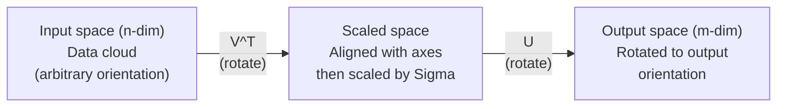
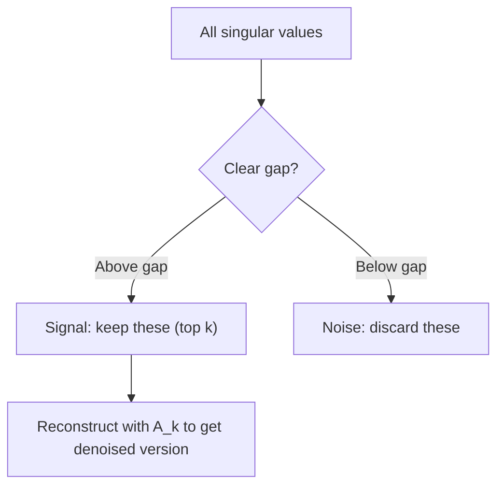

# 奇异值分解

> SVD 是线性代数的瑞士军刀。每个矩阵都有一个。每个数据科学家都需要一个。

**类型：** 构建
**语言：** Python, Julia
**前置要求：** 阶段 1，第 01 课（线性代数直觉）、第 02 课（向量与矩阵运算）、第 03 课（矩阵变换）
**时间：** ~120 分钟

## 学习目标

- 通过 power iteration 实现 SVD，并解释 U、Sigma 和 V^T 的几何意义
- 使用 truncated SVD 做图像压缩，并测量 compression ratio 与 reconstruction error
- 通过 SVD 计算 Moore-Penrose pseudoinverse，求解 overdetermined least-squares systems
- 将 SVD 连接到 PCA、推荐系统（latent factors）和 NLP 中的 Latent Semantic Analysis

## 问题

你有一个 1000x2000 矩阵。也许它是用户-电影评分。也许是文档-词频表。也许是一张图像的像素值。你需要压缩它、去噪它、找出其中隐藏结构，或者用它求解 least-squares system。Eigendecomposition 只适用于方阵。即便如此，它还要求矩阵有一整组线性无关的 eigenvectors。

SVD 适用于任何矩阵。任何形状。任何秩。没有条件。它把矩阵分解成三个因子，揭示这个矩阵对空间做了什么几何操作。它是所有线性代数中最通用、最有用的 factorization。

## 概念

### SVD 的几何作用

每个矩阵，不管形状如何，都会依次执行三个操作：旋转、缩放、旋转。SVD 把这个分解显式写出来。

```
A = U * Sigma * V^T

      m x n     m x m    m x n    n x n
     (any)    (rotate)  (scale)  (rotate)
```

给定任意矩阵 A，SVD 把它分解为：
- V^T 在输入空间（n 维）中旋转向量
- Sigma 沿每个轴缩放（拉伸或压缩）
- U 把结果旋转到输出空间（m 维）



这样理解：你把一个矩阵交给 SVD。它告诉你：“这个矩阵会把输入球体先用 V^T 旋转，然后用 Sigma 拉伸成椭球体，再用 U 旋转这个椭球体。”奇异值就是这个椭球体各条轴的长度。

### 完整分解

对形状为 m x n 的矩阵 A：

```
A = U * Sigma * V^T

where:
  U     is m x m, orthogonal (U^T U = I)
  Sigma is m x n, diagonal (singular values on the diagonal)
  V     is n x n, orthogonal (V^T V = I)

The singular values sigma_1 >= sigma_2 >= ... >= sigma_r > 0
where r = rank(A)
```

U 的列叫 left singular vectors。V 的列叫 right singular vectors。Sigma 的对角项叫 singular values。它们总是非负，并按惯例从大到小排序。

### Left singular vectors、singular values、right singular vectors

SVD 的每个组成部分都有不同的几何意义。

**Right singular vectors（V 的列）：** 它们构成输入空间（R^n）的一组标准正交基。它们是输入空间中会被矩阵映射到输出空间正交方向的方向。可以把它们看作 domain 的自然坐标系。

**Singular values（Sigma 的对角）：** 它们是缩放因子。第 i 个 singular value 告诉你矩阵沿第 i 个 right singular vector 方向把向量拉伸多少。为零的 singular value 表示矩阵完全压扁了那个方向。

**Left singular vectors（U 的列）：** 它们构成输出空间（R^m）的一组标准正交基。第 i 个 left singular vector 是第 i 个 right singular vector 被缩放后落到输出空间中的方向。

它们的关系：

```
A * v_i = sigma_i * u_i

The matrix A takes the i-th right singular vector v_i,
scales it by sigma_i, and maps it to the i-th left singular vector u_i.
```

这给了你一个逐坐标理解任意矩阵作用的方式。

### Outer product form

SVD 可以写成 rank-1 矩阵之和：

```
A = sigma_1 * u_1 * v_1^T + sigma_2 * u_2 * v_2^T + ... + sigma_r * u_r * v_r^T

Each term sigma_i * u_i * v_i^T is a rank-1 matrix (an outer product).
The full matrix is the sum of r such matrices, where r is the rank.
```

这个形式是 low-rank approximation 的基础。每一项添加一层结构。第一项捕获最重要的单个模式。第二项捕获次重要模式。以此类推。截断这个和，就能在任意给定 rank 下得到最佳近似。

```
Rank-1 approx:    A_1 = sigma_1 * u_1 * v_1^T
                  (captures the dominant pattern)

Rank-2 approx:    A_2 = sigma_1 * u_1 * v_1^T + sigma_2 * u_2 * v_2^T
                  (captures the two most important patterns)

Rank-k approx:    A_k = sum of top k terms
                  (optimal by the Eckart-Young theorem)
```

### 与 eigendecomposition 的关系

SVD 和 eigendecomposition 深度相连。A 的 singular values 和 vectors 直接来自 A^T A 与 A A^T 的 eigenvalues 和 eigenvectors。

```
A^T A = V * Sigma^T * U^T * U * Sigma * V^T
      = V * Sigma^T * Sigma * V^T
      = V * D * V^T

where D = Sigma^T * Sigma is a diagonal matrix with sigma_i^2 on the diagonal.

So:
- The right singular vectors (V) are eigenvectors of A^T A
- The singular values squared (sigma_i^2) are eigenvalues of A^T A

Similarly:
A A^T = U * Sigma * V^T * V * Sigma^T * U^T
      = U * Sigma * Sigma^T * U^T

So:
- The left singular vectors (U) are eigenvectors of A A^T
- The eigenvalues of A A^T are also sigma_i^2
```

这个连接告诉你三件事：
1. Singular values 总是实数且非负（它们是 positive semi-definite matrix 的 eigenvalues 的平方根）。
2. 你可以通过对 A^T A 做 eigendecomposition 来计算 SVD，但这会平方 condition number 并损失数值精度。专用 SVD 算法会避免这一点。
3. 当 A 是方阵且 symmetric positive semi-definite 时，SVD 和 eigendecomposition 是同一件事。

### Truncated SVD：低秩近似

Eckart-Young-Mirsky theorem 说明：A 的最佳 rank-k 近似（对 Frobenius norm 和 spectral norm 都成立）是只保留前 k 个 singular values 及其对应向量：

```
A_k = U_k * Sigma_k * V_k^T

where:
  U_k     is m x k  (first k columns of U)
  Sigma_k is k x k  (top-left k x k block of Sigma)
  V_k     is n x k  (first k columns of V)

Approximation error = sigma_{k+1}  (in spectral norm)
                    = sqrt(sigma_{k+1}^2 + ... + sigma_r^2)  (in Frobenius norm)
```

这不只是“一个不错的”近似。它是可证明的最佳 rank k 近似。没有其他 rank-k 矩阵能更接近 A。

| Component | 相对大小 | 在 rank-3 approx 中保留？ |
|-----------|-------------------|------------------------|
| sigma_1 | 最大 | 是 |
| sigma_2 | 大 | 是 |
| sigma_3 | 中大 | 是 |
| sigma_4 | 中 | 否（error） |
| sigma_5 | 中小 | 否（error） |
| sigma_6 | 小 | 否（error） |
| sigma_7 | 很小 | 否（error） |
| sigma_8 | 极小 | 否（error） |

保留前 3 个：A_3 捕获三个最大的 singular values。误差 = 剩余值（sigma_4 到 sigma_8）。

如果 singular values 衰减很快，小 k 就能捕获矩阵的大部分内容。如果衰减很慢，矩阵没有 low-rank structure。

### 使用 SVD 做图像压缩

灰度图像是一个像素强度矩阵。一张 800x600 图像有 480,000 个值。SVD 可以用少得多的值近似它。

```
Original image: 800 x 600 = 480,000 values

SVD with rank k:
  U_k:      800 x k values
  Sigma_k:  k values
  V_k:      600 x k values
  Total:    k * (800 + 600 + 1) = k * 1401 values

  k=10:   14,010 values   (2.9% of original)
  k=50:   70,050 values  (14.6% of original)
  k=100: 140,100 values  (29.2% of original)

  The compression ratio improves as k gets smaller,
  but visual quality degrades.
```

关键洞见：自然图像的 singular values 衰减很快。前几个 singular values 捕获宏观结构（形状、渐变）。后面的捕获细节和噪声。截断到 rank 50 时，通常能得到视觉上几乎等同于原图的图像，同时减少 85% 存储。

### 推荐系统中的 SVD

Netflix Prize 让这件事变得出名。你有一个用户-电影评分矩阵，其中大多数项缺失。

```
             Movie1  Movie2  Movie3  Movie4  Movie5
  User1      [  5      ?       3       ?       1  ]
  User2      [  ?      4       ?       2       ?  ]
  User3      [  3      ?       5       ?       ?  ]
  User4      [  ?      ?       ?       4       3  ]

  ? = unknown rating
```

思想：这个评分矩阵是 low rank 的。用户的品味不是完全独立的。有少数 latent factors（动作 vs. 剧情、旧 vs. 新、理性 vs. 感官）解释了大多数偏好。

对（填补过的）评分矩阵做 SVD，会把它分解为：
- U：latent factor space 中的用户画像
- Sigma：每个 latent factor 的重要性
- V^T：latent factor space 中的电影画像

用户对电影的预测评分，是用户画像与电影画像的点积（由 singular values 加权）。Low-rank approximation 会填补缺失项。

实践中，你会使用 Simon Funk 的 incremental SVD 或 ALS（alternating least squares）这样的变体，它们直接处理缺失数据。但核心思想相同：通过 SVD 做 latent factor decomposition。

### NLP 中的 SVD：Latent Semantic Analysis

Latent Semantic Analysis（LSA，也叫 Latent Semantic Indexing，LSI）把 SVD 应用到 term-document matrix。

```
             Doc1   Doc2   Doc3   Doc4
  "cat"      [  3      0      1      0  ]
  "dog"      [  2      0      0      1  ]
  "fish"     [  0      4      1      0  ]
  "pet"      [  1      1      1      1  ]
  "ocean"    [  0      3      0      0  ]

After SVD with rank k=2:

  Each document becomes a point in 2D "concept space."
  Each term becomes a point in the same 2D space.
  Documents about similar topics cluster together.
  Terms with similar meanings cluster together.

  "cat" and "dog" end up near each other (land pets).
  "fish" and "ocean" end up near each other (water concepts).
  Doc1 and Doc3 cluster if they share similar topics.
```

LSA 是最早从原始文本捕获语义相似度的成功方法之一。它有效，是因为同义词倾向于出现在相似文档中，所以 SVD 会把它们归入相同 latent dimensions。现代 word embeddings（Word2Vec、GloVe）可以看作这个思想的后代。

### 使用 SVD 做降噪

Noisy data 的信号集中在顶部 singular values 中，而噪声散布在所有 singular values 上。截断会移除 noise floor。

**干净信号的 singular values：**

| Component | Magnitude | 类型 |
|-----------|-----------|------|
| sigma_1 | 非常大 | Signal |
| sigma_2 | 大 | Signal |
| sigma_3 | 中等 | Signal |
| sigma_4 | 近零 | 可忽略 |
| sigma_5 | 近零 | 可忽略 |

**Noisy signal singular values（噪声添加到所有项）：**

| Component | Magnitude | 类型 |
|-----------|-----------|------|
| sigma_1 | 非常大 | Signal |
| sigma_2 | 大 | Signal |
| sigma_3 | 中等 | Signal |
| sigma_4 | 小 | Noise |
| sigma_5 | 小 | Noise |
| sigma_6 | 小 | Noise |
| sigma_7 | 小 | Noise |



这用于信号处理、科学测量和数据清洗。只要你的矩阵被 additive noise 污染，truncated SVD 都是一种有原则的方式，把信号和噪声分开。

### 通过 SVD 计算 Pseudoinverse

Moore-Penrose pseudoinverse A+ 把矩阵求逆推广到非方阵和奇异矩阵。SVD 让计算它变得很简单。

```
If A = U * Sigma * V^T, then:

A+ = V * Sigma+ * U^T

where Sigma+ is formed by:
  1. Transpose Sigma (swap rows and columns)
  2. Replace each non-zero diagonal entry sigma_i with 1/sigma_i
  3. Leave zeros as zeros

For A (m x n):      A+ is (n x m)
For Sigma (m x n):  Sigma+ is (n x m)
```

Pseudoinverse 可用于求解 least-squares problems。如果 Ax = b 没有精确解（overdetermined system），那么 x = A+ b 是 least-squares solution（最小化 ||Ax - b||）。

```
Overdetermined system (more equations than unknowns):

  [1  1]         [3]
  [2  1] x   =   [5]       No exact solution exists.
  [3  1]         [6]

  x_ls = A+ b = V * Sigma+ * U^T * b

  This gives the x that minimizes the sum of squared residuals.
  Same result as the normal equations (A^T A)^(-1) A^T b,
  but numerically more stable.
```

### 数值稳定性优势

计算 A^T A 的 eigendecomposition 会平方 singular values（A^T A 的 eigenvalues 是 sigma_i^2）。这会平方 condition number，放大数值误差。

```
Example:
  A has singular values [1000, 1, 0.001]
  Condition number of A: 1000 / 0.001 = 10^6

  A^T A has eigenvalues [10^6, 1, 10^{-6}]
  Condition number of A^T A: 10^6 / 10^{-6} = 10^{12}

  Computing SVD directly: works with condition number 10^6
  Computing via A^T A:     works with condition number 10^{12}
                           (6 extra digits of precision lost)
```

现代 SVD 算法（Golub-Kahan bidiagonalization）直接在 A 上工作，从不形成 A^T A。这就是为什么你应该始终优先使用 `np.linalg.svd(A)`，而不是 `np.linalg.eig(A.T @ A)`。

### 与 PCA 的连接

PCA 就是对 centered data 做 SVD。这不是类比。它字面上是同一个计算。

```
Given data matrix X (n_samples x n_features), centered (mean subtracted):

Covariance matrix: C = (1/(n-1)) * X^T X

PCA finds eigenvectors of C. But:

  X = U * Sigma * V^T    (SVD of X)

  X^T X = V * Sigma^2 * V^T

  C = (1/(n-1)) * V * Sigma^2 * V^T

So the principal components are exactly the right singular vectors V.
The explained variance for each component is sigma_i^2 / (n-1).

In sklearn, PCA is implemented using SVD, not eigendecomposition.
It is faster and more numerically stable.
```

这意味着你在第 10 课学到的降维，底层全是 SVD。PCA 是机器学习中最常见的 SVD 应用。

## 构建它

### 第 1 步：用 power iteration 从零实现 SVD

思想：要找到最大的 singular value 及其向量，可以在 A^T A（或 A A^T）上使用 power iteration。然后对矩阵做 deflate，重复寻找下一个 singular value。

```python
import numpy as np

def power_iteration(M, num_iters=100):
    n = M.shape[1]
    v = np.random.randn(n)
    v = v / np.linalg.norm(v)

    for _ in range(num_iters):
        Mv = M @ v
        v = Mv / np.linalg.norm(Mv)

    eigenvalue = v @ M @ v
    return eigenvalue, v

def svd_from_scratch(A, k=None):
    m, n = A.shape
    if k is None:
        k = min(m, n)

    sigmas = []
    us = []
    vs = []

    A_residual = A.copy().astype(float)

    for _ in range(k):
        AtA = A_residual.T @ A_residual
        eigenvalue, v = power_iteration(AtA, num_iters=200)

        if eigenvalue < 1e-10:
            break

        sigma = np.sqrt(eigenvalue)
        u = A_residual @ v / sigma

        sigmas.append(sigma)
        us.append(u)
        vs.append(v)

        A_residual = A_residual - sigma * np.outer(u, v)

    U = np.column_stack(us) if us else np.empty((m, 0))
    S = np.array(sigmas)
    V = np.column_stack(vs) if vs else np.empty((n, 0))

    return U, S, V
```

### 第 2 步：测试并与 NumPy 比较

```python
np.random.seed(42)
A = np.random.randn(5, 4)

U_ours, S_ours, V_ours = svd_from_scratch(A)
U_np, S_np, Vt_np = np.linalg.svd(A, full_matrices=False)

print("Our singular values:", np.round(S_ours, 4))
print("NumPy singular values:", np.round(S_np, 4))

A_reconstructed = U_ours @ np.diag(S_ours) @ V_ours.T
print(f"Reconstruction error: {np.linalg.norm(A - A_reconstructed):.8f}")
```

### 第 3 步：图像压缩 demo

```python
def compress_image_svd(image_matrix, k):
    U, S, Vt = np.linalg.svd(image_matrix, full_matrices=False)
    compressed = U[:, :k] @ np.diag(S[:k]) @ Vt[:k, :]
    return compressed

image = np.random.seed(42)
rows, cols = 200, 300
image = np.random.randn(rows, cols)

for k in [1, 5, 10, 20, 50]:
    compressed = compress_image_svd(image, k)
    error = np.linalg.norm(image - compressed) / np.linalg.norm(image)
    original_size = rows * cols
    compressed_size = k * (rows + cols + 1)
    ratio = compressed_size / original_size
    print(f"k={k:>3d}  error={error:.4f}  storage={ratio:.1%}")
```

### 第 4 步：降噪

```python
np.random.seed(42)
clean = np.outer(np.sin(np.linspace(0, 4*np.pi, 100)),
                 np.cos(np.linspace(0, 2*np.pi, 80)))
noise = 0.3 * np.random.randn(100, 80)
noisy = clean + noise

U, S, Vt = np.linalg.svd(noisy, full_matrices=False)
denoised = U[:, :5] @ np.diag(S[:5]) @ Vt[:5, :]

print(f"Noisy error:    {np.linalg.norm(noisy - clean):.4f}")
print(f"Denoised error: {np.linalg.norm(denoised - clean):.4f}")
print(f"Improvement:    {(1 - np.linalg.norm(denoised - clean) / np.linalg.norm(noisy - clean)):.1%}")
```

### 第 5 步：Pseudoinverse

```python
A = np.array([[1, 1], [2, 1], [3, 1]], dtype=float)
b = np.array([3, 5, 6], dtype=float)

U, S, Vt = np.linalg.svd(A, full_matrices=False)
S_inv = np.diag(1.0 / S)
A_pinv = Vt.T @ S_inv @ U.T

x_svd = A_pinv @ b
x_lstsq = np.linalg.lstsq(A, b, rcond=None)[0]
x_pinv = np.linalg.pinv(A) @ b

print(f"SVD pseudoinverse solution:  {x_svd}")
print(f"np.linalg.lstsq solution:   {x_lstsq}")
print(f"np.linalg.pinv solution:    {x_pinv}")
```

## 使用它

完整可运行 demo 在 `code/svd.py` 中。运行它可以看到 SVD 应用于图像压缩、推荐系统、latent semantic analysis 和降噪。

```bash
python svd.py
```

`code/svd.jl` 中的 Julia 版本使用 Julia 原生 `svd()` 函数和 `LinearAlgebra` 包演示相同概念。

```bash
julia svd.jl
```

## 交付它

本课会产出：
- `outputs/skill-svd.md`：一个用于知道何时以及如何在真实项目中应用 SVD 的 skill

## 练习

1. 不使用 power iteration，从零实现完整 SVD。改为计算 A^T A 的 eigendecomposition 来得到 V 和 singular values，然后计算 U = A V Sigma^{-1}。把数值精度与你的 power iteration 版本和 NumPy 比较。

2. 加载一张真实灰度图像（或把图像转换成灰度）。分别用 rank 1、5、10、25、50、100 压缩它。对每个 rank，计算 compression ratio 和 relative error。找到图像视觉上可接受的 rank。

3. 构建一个小型推荐系统。创建一个 10x8 user-movie ratings matrix，其中有一些已知项。用 row means 填补缺失项。计算 SVD 并重构一个 rank-3 approximation。使用重构矩阵预测缺失评分。验证预测是否合理。

4. 创建一个有 3 个合成 topics 的 100x50 document-term matrix。每个 topic 有 5 个关联 terms。加入噪声。应用 SVD，验证前 3 个 singular values 明显大于其余值。把 documents 投影到 3D latent space，并检查同一 topic 的 documents 是否聚在一起。

5. 生成一个干净的 low-rank matrix（rank 3，大小 50x40），并加入不同级别的 Gaussian noise（sigma = 0.1, 0.5, 1.0, 2.0）。对每个 noise level，把 k 从 1 扫到 40，用相对 clean matrix 的 reconstruction error 找到最佳 truncation rank。画出最佳 k 如何随 noise level 变化。

## 关键术语

| 术语 | 人们常说 | 它实际意味着什么 |
|------|----------------|----------------------|
| SVD | “分解任意矩阵” | 把 A 分解成 U Sigma V^T，其中 U 和 V 正交，Sigma 是非负对角项组成的对角矩阵。适用于任意形状的任意矩阵。 |
| Singular value | “这个 component 有多重要” | Sigma 的第 i 个对角项。衡量矩阵沿第 i 个 principal direction 拉伸多少。总是非负，并按降序排列。 |
| Left singular vector | “输出方向” | U 的一列。第 i 个 right singular vector（经 sigma_i 缩放后）映射到的输出空间方向。 |
| Right singular vector | “输入方向” | V 的一列。输入空间中的方向，会被矩阵映射到第 i 个 left singular vector（经 sigma_i 缩放后）。 |
| Truncated SVD | “Low-rank approximation” | 只保留前 k 个 singular values 及其向量。产生原矩阵可证明最佳的 rank-k 近似（Eckart-Young theorem）。 |
| Rank | “真实维度” | 非零 singular values 的数量。告诉你矩阵实际使用了多少独立方向。 |
| Pseudoinverse | “广义逆” | V Sigma+ U^T。反转非零 singular values，零保持为零。为非方阵或奇异矩阵求解 least-squares problems。 |
| Condition number | “对误差有多敏感” | sigma_max / sigma_min。大的 condition number 表示微小输入变化会造成大输出变化。SVD 直接揭示它。 |
| Latent factor | “隐藏变量” | SVD 发现的 low-rank space 中的维度。在推荐中，latent factor 可能对应类型偏好。在 NLP 中，可能对应 topic。 |
| Frobenius norm | “矩阵总大小” | 矩阵所有项平方和的平方根。等于 squared singular values 之和的平方根。用于衡量 approximation error。 |
| Eckart-Young theorem | “SVD 给出最佳压缩” | 对任意目标 rank k，truncated SVD 在所有可能 rank-k 矩阵中最小化 approximation error。 |
| Power iteration | “找到最大 eigenvector” | 反复用矩阵乘以随机向量并归一化。收敛到最大 eigenvalue 对应的 eigenvector。许多 SVD 算法的基础构件。 |

## 延伸阅读

- [Gilbert Strang: Linear Algebra and Its Applications, Chapter 7](https://math.mit.edu/~gs/linearalgebra/) - 对 SVD 及其应用的深入讲解
- [3Blue1Brown: But what is the SVD?](https://www.youtube.com/watch?v=vSczTbgc8Rc) - SVD 的几何直觉
- [We Recommend a Singular Value Decomposition](https://www.ams.org/publicoutreach/feature-column/fcarc-svd) - American Mathematical Society 的易懂概览
- [Netflix Prize and Matrix Factorization](https://sifter.org/~simon/journal/20061211.html) - Simon Funk 关于推荐系统 SVD 的原始博文
- [Latent Semantic Analysis](https://en.wikipedia.org/wiki/Latent_semantic_analysis) - SVD 在 NLP 中的原始应用
- [Numerical Linear Algebra by Trefethen and Bau](https://people.maths.ox.ac.uk/trefethen/text.html) - 理解 SVD 算法及其数值性质的黄金标准
