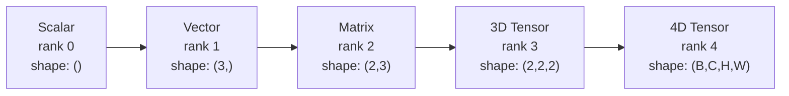
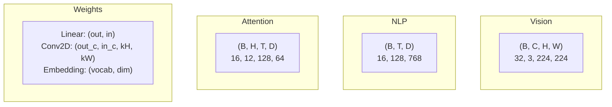
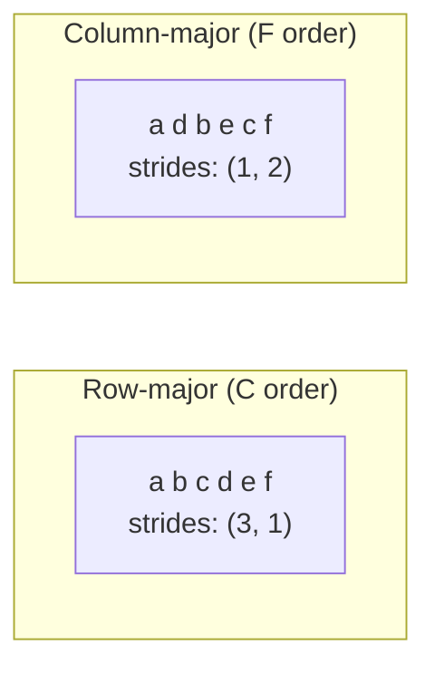
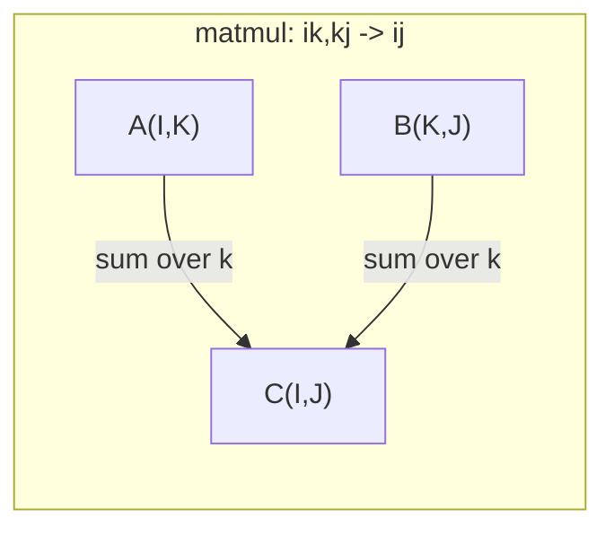

# Tensor 操作

> Tensors 是数据和深度学习之间的通用语言。每张图像、每个句子、每个 gradient 都流经它们。

**类型：** 构建
**语言：** Python
**前置要求：** 阶段 1，第 01 课（线性代数直觉）、第 02 课（向量、矩阵与运算）
**时间：** ~90 分钟

## 学习目标

- 从零实现一个 tensor 类，支持 shape、strides、reshape、transpose 和 element-wise operations
- 应用 broadcasting rules，在不复制数据的情况下对不同 shapes 的 tensors 做运算
- 为 dot products、matrix multiplications、outer products 和 batched operations 编写 einsum 表达式
- 跟踪 multi-head attention 每一步的精确 tensor shapes

## 问题

你构建一个 transformer。Forward pass 看起来很干净。你运行它，得到：`RuntimeError: mat1 and mat2 shapes cannot be multiplied (32x768 and 512x768)`。你盯着 shapes。你试着 transpose。现在它说 `Expected 4D input (got 3D input)`。你加了一个 unsqueeze。别的地方又坏了。

Shape errors 是深度学习代码中最常见的 bug。它们概念上不难：每个操作都有 shape contract，但它们增长得很快。一个 transformer 有几十个 reshape、transpose 和 broadcast 串在一起。一个轴错了，错误就会级联。更糟的是，有些 shape 错误根本不会抛异常。它们会沿错误维度 silently broadcast，或在错误轴上求和，产生垃圾结果。

矩阵处理两组事物之间的成对关系。真实数据不适合只放进二维。32 张 224x224 RGB 图像组成的 batch 是一个 4D tensor：`(32, 3, 224, 224)`。带 12 个 heads 的 self-attention 也是 4D：`(batch, heads, seq_len, head_dim)`。你需要一种可推广到任意维度的数据结构，以及能在这些维度上干净组合的操作。这个结构就是 tensor。掌握它的操作后，shape errors 就会变得很容易调试。

## 概念

### 什么是 tensor

Tensor 是一个由数字组成的多维数组，具有统一的数据类型。维度数量是 **rank**（或 **order**）。每个维度是一个 **axis**。**shape** 是一个 tuple，列出每个 axis 上的大小。



总元素数 = 所有大小的乘积。Shape `(2, 3, 4)` 包含 `2 * 3 * 4 = 24` 个元素。

### 深度学习中的 tensor shapes

不同数据类型按约定映射到特定 tensor shapes。



PyTorch 使用 NCHW（channels-first）。TensorFlow 默认 NHWC（channels-last）。布局不匹配会导致 silent slowdown 或错误。

### 内存布局如何工作

内存中的 2D array 是一维字节序列。**Strides** 告诉你沿每个 axis 前进一步时要跳过多少个元素。



Transpose 不移动数据。它交换 strides，使 tensor 变成 **non-contiguous**：一行里的元素在内存中不再相邻。

### Broadcasting rules

Broadcasting 允许你在不复制数据的情况下，对不同 shapes 的 tensors 做运算。从右侧对齐 shapes。当两个维度相等，或其中一个为 1 时，它们兼容。维度更少的一方会在左侧补 1。

```
Tensor A:     (8, 1, 6, 1)
Tensor B:        (7, 1, 5)
Padded B:     (1, 7, 1, 5)
Result:       (8, 7, 6, 5)
```

### Einsum：通用 tensor 操作

Einstein summation 用字母标记每个 axis。出现在输入中但不出现在输出中的 axes 会被求和。两边都出现的 axes 会保留。



关键模式：`i,i->`（dot product）、`i,j->ij`（outer product）、`ii->`（trace）、`ij->ji`（transpose）、`bij,bjk->bik`（batch matmul）、`bhtd,bhsd->bhts`（attention scores）。

## 构建它

代码位于 `code/tensors.py`。每一步都引用那里的实现。

### 第 1 步：Tensor storage 和 strides

Tensor 存储一个扁平数字列表和 shape metadata。Strides 告诉索引逻辑如何把多维索引映射到扁平位置。

```python
class Tensor:
    def __init__(self, data, shape=None):
        if isinstance(data, (list, tuple)):
            self._data, self._shape = self._flatten_nested(data)
        elif isinstance(data, np.ndarray):
            self._data = data.flatten().tolist()
            self._shape = tuple(data.shape)
        else:
            self._data = [data]
            self._shape = ()

        if shape is not None:
            total = reduce(lambda a, b: a * b, shape, 1)
            if total != len(self._data):
                raise ValueError(
                    f"Cannot reshape {len(self._data)} elements into shape {shape}"
                )
            self._shape = tuple(shape)

        self._strides = self._compute_strides(self._shape)

    @staticmethod
    def _compute_strides(shape):
        if len(shape) == 0:
            return ()
        strides = [1] * len(shape)
        for i in range(len(shape) - 2, -1, -1):
            strides[i] = strides[i + 1] * shape[i + 1]
        return tuple(strides)
```

对于 shape `(3, 4)`，strides 是 `(4, 1)`：前进一行跳过 4 个元素，前进一列跳过 1 个元素。

### 第 2 步：Reshape、squeeze、unsqueeze

Reshape 改变 shape，但不改变元素顺序。总元素数必须保持不变。用 `-1` 表示让某个维度自动推断大小。

```python
t = Tensor(list(range(12)), shape=(2, 6))
r = t.reshape((3, 4))
r = t.reshape((-1, 3))
```

Squeeze 会移除大小为 1 的 axes。Unsqueeze 会插入一个 axis。Unsqueeze 对 broadcasting 很关键：一个 bias vector `(D,)` 加到 batch `(B, T, D)` 上时，需要 unsqueeze 到 `(1, 1, D)`。

```python
t = Tensor(list(range(6)), shape=(1, 3, 1, 2))
s = t.squeeze()
v = Tensor([1, 2, 3])
u = v.unsqueeze(0)
```

### 第 3 步：Transpose 和 permute

Transpose 交换两个 axes。Permute 重新排列所有 axes。这就是在 NCHW 和 NHWC 之间转换的方式。

```python
mat = Tensor(list(range(6)), shape=(2, 3))
tr = mat.transpose(0, 1)

t4d = Tensor(list(range(24)), shape=(1, 2, 3, 4))
perm = t4d.permute((0, 2, 3, 1))
```

Transpose 或 permute 之后，tensor 在内存中是 non-contiguous 的。在 PyTorch 中，`view` 会在 non-contiguous tensors 上失败：使用 `reshape`，或先调用 `.contiguous()`。

### 第 4 步：Element-wise operations 和 reductions

Element-wise ops（add、multiply、subtract）独立作用到每个元素，并保持 shape。Reductions（sum、mean、max）会折叠一个或多个 axes。

```python
a = Tensor([[1, 2], [3, 4]])
b = Tensor([[10, 20], [30, 40]])
c = a + b
d = a * 2
s = a.sum(axis=0)
```

CNN 中的 global average pooling：`(B, C, H, W).mean(axis=[2, 3])` 产生 `(B, C)`。NLP 中的 sequence mean pooling：`(B, T, D).mean(axis=1)` 产生 `(B, D)`。

### 第 5 步：使用 NumPy 做 broadcasting

`tensors.py` 中的 `demo_broadcasting_numpy()` 函数展示了核心模式。

```python
activations = np.random.randn(4, 3)
bias = np.array([0.1, 0.2, 0.3])
result = activations + bias

images = np.random.randn(2, 3, 4, 4)
scale = np.array([0.5, 1.0, 1.5]).reshape(1, 3, 1, 1)
result = images * scale

a = np.array([1, 2, 3]).reshape(-1, 1)
b = np.array([10, 20, 30, 40]).reshape(1, -1)
outer = a * b
```

通过 broadcasting 计算 pairwise distance：把 `(M, 2)` reshape 成 `(M, 1, 2)`，把 `(N, 2)` reshape 成 `(1, N, 2)`，相减、平方、沿最后一轴求和、再开方。结果为 `(M, N)`。

### 第 6 步：Einsum operations

`demo_einsum()` 和 `demo_einsum_gallery()` 函数会遍历每个常见模式。

```python
a = np.array([1.0, 2.0, 3.0])
b = np.array([4.0, 5.0, 6.0])
dot = np.einsum("i,i->", a, b)

A = np.array([[1, 2], [3, 4], [5, 6]], dtype=float)
B = np.array([[7, 8, 9], [10, 11, 12]], dtype=float)
matmul = np.einsum("ik,kj->ij", A, B)

batch_A = np.random.randn(4, 3, 5)
batch_B = np.random.randn(4, 5, 2)
batch_mm = np.einsum("bij,bjk->bik", batch_A, batch_B)
```

Contraction 的计算成本是所有 index sizes（保留的和求和的）的乘积。对 `bij,bjk->bik`，若 B=32、I=128、J=64、K=128：`32 * 128 * 64 * 128 = 33,554,432` 次 multiply-add。

### 第 7 步：通过 einsum 实现 attention mechanism

`demo_attention_einsum()` 函数端到端实现 multi-head attention。

```python
B, H, T, D = 2, 4, 8, 16
E = H * D

X = np.random.randn(B, T, E)
W_q = np.random.randn(E, E) * 0.02

Q = np.einsum("bte,ek->btk", X, W_q)
Q = Q.reshape(B, T, H, D).transpose(0, 2, 1, 3)

scores = np.einsum("bhtd,bhsd->bhts", Q, K) / np.sqrt(D)
weights = softmax(scores, axis=-1)
attn_output = np.einsum("bhts,bhsd->bhtd", weights, V)

concat = attn_output.transpose(0, 2, 1, 3).reshape(B, T, E)
output = np.einsum("bte,ek->btk", concat, W_o)
```

每一步都是 tensor operation：projection（通过 einsum 做 matmul）、head splitting（reshape + transpose）、attention scores（通过 einsum 做 batch matmul）、weighted sum（通过 einsum 做 batch matmul）、head merging（transpose + reshape）、output projection（通过 einsum 做 matmul）。

## 使用它

### Scratch vs NumPy

| Operation | Scratch（Tensor class） | NumPy |
|---|---|---|
| Create | `Tensor([[1,2],[3,4]])` | `np.array([[1,2],[3,4]])` |
| Reshape | `t.reshape((3,4))` | `a.reshape(3,4)` |
| Transpose | `t.transpose(0,1)` | `a.T` or `a.transpose(0,1)` |
| Squeeze | `t.squeeze(0)` | `np.squeeze(a, 0)` |
| Sum | `t.sum(axis=0)` | `a.sum(axis=0)` |
| Einsum | N/A | `np.einsum("ij,jk->ik", a, b)` |

### Scratch vs PyTorch

```python
import torch

t = torch.tensor([[1, 2, 3], [4, 5, 6]], dtype=torch.float32)
t.shape
t.stride()
t.is_contiguous()

t.reshape(3, 2)
t.unsqueeze(0)
t.transpose(0, 1)
t.transpose(0, 1).contiguous()

torch.einsum("ik,kj->ij", A, B)
```

PyTorch 添加了 autograd、GPU support 和优化 BLAS kernels。Shape 语义是一样的。如果你理解 scratch 版本，PyTorch shape errors 会变得可读。

### 每个神经网络层都是 tensor operation

| Operation | Tensor Form | Einsum |
|---|---|---|
| Linear layer | `Y = X @ W.T + b` | `"bd,od->bo"` + bias |
| Attention QKV | `Q = X @ W_q` | `"btd,dh->bth"` |
| Attention scores | `Q @ K.T / sqrt(d)` | `"bhtd,bhsd->bhts"` |
| Attention output | `softmax(scores) @ V` | `"bhts,bhsd->bhtd"` |
| Batch norm | `(X - mu) / sigma * gamma` | element-wise + broadcast |
| Softmax | `exp(x) / sum(exp(x))` | element-wise + reduction |

## 交付它

本课会产出两个可复用 prompt：

1. **`outputs/prompt-tensor-shapes.md`**：用于调试 tensor shape mismatch 的系统化 prompt。包含每个常见操作（matmul、broadcast、cat、Linear、Conv2d、BatchNorm、softmax）的决策表和 fix lookup table。

2. **`outputs/prompt-tensor-debugger.md`**：当 shape error 阻塞你时，可以粘贴到任意 AI assistant 的逐步调试 prompt。把 error message 和 tensor shapes 给它，得到精确修复方式。

## 练习

1. **Easy：Reshape round-trip。** 取一个 shape 为 `(2, 3, 4)` 的 tensor。把它 reshape 为 `(6, 4)`，再 reshape 为 `(24,)`，最后回到 `(2, 3, 4)`。通过打印 flat data，验证每一步元素顺序都保持不变。

2. **Medium：实现 broadcasting。** 给 `Tensor` 类扩展一个 `broadcast_to(shape)` 方法，把大小为 1 的维度扩展到目标 shape。然后修改 `_elementwise_op`，让它在操作前自动 broadcast。用 shapes `(3, 1)` 和 `(1, 4)` 测试，结果应为 `(3, 4)`。

3. **Hard：从零构建 einsum。** 实现一个基础 `einsum(subscripts, *tensors)` 函数，至少支持：dot product（`i,i->`）、matrix multiply（`ij,jk->ik`）、outer product（`i,j->ij`）和 transpose（`ij->ji`）。解析 subscript string，识别 contracted indices，并遍历所有 index combinations。把结果与 `np.einsum` 比较。

4. **Hard：Attention shape tracker。** 写一个函数，输入 `batch_size`、`seq_len`、`embed_dim` 和 `num_heads`，打印 multi-head attention 每一步的精确 shape：input、Q/K/V projection、head split、attention scores、softmax weights、weighted sum、head merge、output projection。与 `demo_attention_einsum()` 输出验证。

## 关键术语

| 术语 | 人们常说 | 它实际意味着什么 |
|---|---|---|
| Tensor | “更高维的矩阵” | 一个具有统一类型、明确 shape、strides 和 operations 的多维数组 |
| Rank | “维度数量” | Axes 的数量。矩阵 rank 为 2，不是矩阵秩的那个 rank |
| Shape | “Tensor 的大小” | 列出每个 axis 大小的 tuple。`(2, 3)` 表示 2 行、3 列 |
| Stride | “内存如何排布” | 沿某个 axis 前进一个位置时要跳过的元素数量 |
| Broadcasting | “shape 不同时也能运行” | 一组严格规则：从右对齐，维度必须相等或其中一个为 1 |
| Contiguous | “Tensor 是正常的” | 元素按逻辑布局顺序连续存储在内存中，没有空隙或重排 |
| Einsum | “写 matmul 的 fancy 方式” | 一种通用记法，可以一行表达任意 tensor contraction、outer product、trace 或 transpose |
| View | “和 reshape 一样” | 与原 tensor 共享同一内存缓冲区，但 shape/stride metadata 不同的 tensor。对 non-contiguous data 会失败 |
| Contraction | “对某个 index 求和” | 一种通用操作：tensor 之间共享的 index 被相乘并求和，产生较低 rank 的结果 |
| NCHW / NHWC | “PyTorch vs TensorFlow 格式” | 图像 tensors 的内存布局约定。NCHW 把 channels 放在 spatial dims 前，NHWC 放在后 |

## 延伸阅读

- [NumPy Broadcasting](https://numpy.org/doc/stable/user/basics.broadcasting.html) -- 权威规则和可视化示例
- [PyTorch Tensor Views](https://pytorch.org/docs/stable/tensor_view.html) -- 什么时候 views 可用，什么时候会 copy
- [einops](https://github.com/arogozhnikov/einops) -- 让 tensor reshaping 变得可读且安全的库
- [The Illustrated Transformer](https://jalammar.github.io/illustrated-transformer/) -- 可视化 attention 中流动的 tensor shapes
- [Einstein Summation in NumPy](https://numpy.org/doc/stable/reference/generated/numpy.einsum.html) -- 完整 einsum 文档和示例
