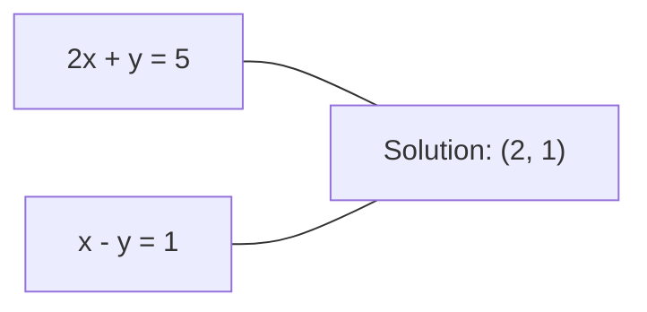
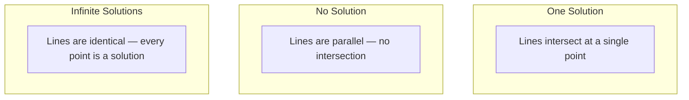

# 线性系统

> 求解 Ax = b 是数学中最古老的问题之一，而它今天仍在运行你的神经网络。

**类型：** 构建
**语言：** Python
**前置要求：** 阶段 1，第 01 课（线性代数直觉）、第 02 课（向量与矩阵）、第 03 课（矩阵变换）
**时间：** ~120 分钟

## 学习目标

- 使用带 partial pivoting 的 Gaussian elimination 和 back substitution 求解 Ax = b
- 用 LU、QR 和 Cholesky decompositions 分解矩阵，并解释各自适用场景
- 推导 least squares 的 normal equations，并连接到 linear 和 ridge regression
- 使用 condition number 诊断 ill-conditioned systems，并应用 regularization 稳定它们

## 问题

每次训练 linear regression，你都在求解 linear system。每次计算 least-squares fit，你都在求解 linear system。每次神经网络层计算 `y = Wx + b`，它都在计算 linear system 的一侧。添加 regularization 时，你会修改这个系统。使用 Gaussian processes 时，你会 factor 一个矩阵。为 Mahalanobis distance 反转 covariance matrix 时，你在求解 linear system。

方程 Ax = b 到处出现。A 是已知系数矩阵。b 是已知输出向量。x 是你想找到的未知向量。在 linear regression 中，A 是 data matrix，b 是 target vector，x 是 weight vector。整个模型化简为：找到 x，使 Ax 尽可能接近 b。

本课会从零构建求解这个方程的每种主要方法。你会理解为什么有些方法快，有些方法稳定，为什么有些只适用于 square systems，而另一些可以处理 overdetermined systems，以及为什么矩阵的 condition number 决定你的答案是否有意义。

## 概念

### Ax = b 的几何含义

线性方程组有几何解释。每个方程定义一个 hyperplane。解是所有 hyperplanes 相交的点（或点集）。

```
2x + y = 5          Two lines in 2D.
x - y  = 1          They intersect at x=2, y=1.
```



可能发生三种情况：



在矩阵形式中，“一个解”意味着 A 可逆。“无解”意味着系统 inconsistent。“无限多解”意味着 A 有 null space。大多数 ML 问题属于“无精确解”类别，因为方程（data points）比未知数（parameters）更多。这就是 least squares 出场的地方。

### Column picture vs row picture

读取 Ax = b 有两种方式。

**Row picture。** A 的每一行定义一个方程。每个方程是一个 hyperplane。解是它们全部相交的位置。

**Column picture。** A 的每一列是一个向量。问题变成：A 的列的什么线性组合会产生 b？

```
A = | 2  1 |    b = | 5 |
    | 1 -1 |        | 1 |

Row picture: solve 2x + y = 5 and x - y = 1 simultaneously.

Column picture: find x1, x2 such that:
  x1 * [2, 1] + x2 * [1, -1] = [5, 1]
  2 * [2, 1] + 1 * [1, -1] = [4+1, 2-1] = [5, 1]   check.
```

Column picture 更基础。如果 b 位于 A 的 column space 中，系统有解。如果 b 不在其中，你要找到 column space 中离 b 最近的点。这个最近点就是 least-squares solution。

### Gaussian elimination

Gaussian elimination 把 Ax = b 变成 upper triangular system Ux = c，然后用 back substitution 求解。它是最直接的方法。

算法：

```
1. For each column k (the pivot column):
   a. Find the largest entry in column k at or below row k (partial pivoting).
   b. Swap that row with row k.
   c. For each row i below k:
      - Compute multiplier m = A[i][k] / A[k][k]
      - Subtract m times row k from row i.
2. Back substitute: solve from the last equation upward.
```

例子：

```
Original:
| 2  1  1 | 8 |       R2 = R2 - (2)R1     | 2  1   1 |  8 |
| 4  3  3 |20 |  -->  R3 = R3 - (1)R1 --> | 0  1   1 |  4 |
| 2  3  1 |12 |                            | 0  2   0 |  4 |

                       R3 = R3 - (2)R2     | 2  1   1 |  8 |
                                       --> | 0  1   1 |  4 |
                                           | 0  0  -2 | -4 |

Back substitute:
  -2 * x3 = -4    -->  x3 = 2
  x2 + 2  = 4     -->  x2 = 2
  2*x1 + 2 + 2 = 8 --> x1 = 2
```

Gaussian elimination 成本是 O(n^3)。对 1000x1000 系统，大约是十亿次 floating-point operations。很快，但如果你需要用同一个 A 求解多个系统，还能做得更好。

### Partial pivoting：为什么重要

没有 pivoting，Gaussian elimination 可能失败或产生垃圾结果。如果 pivot element 为零，就会除以零。如果它很小，就会放大 rounding errors。

```
Bad pivot:                       With partial pivoting:
| 0.001  1 | 1.001 |            Swap rows first:
| 1      1 | 2     |            | 1      1 | 2     |
                                 | 0.001  1 | 1.001 |
m = 1/0.001 = 1000              m = 0.001/1 = 0.001
R2 = R2 - 1000*R1               R2 = R2 - 0.001*R1
| 0.001  1     | 1.001   |      | 1      1     | 2     |
| 0     -999   | -999.0  |      | 0      0.999 | 0.999 |

x2 = 1.000 (correct)            x2 = 1.000 (correct)
x1 = (1.001 - 1)/0.001          x1 = (2 - 1)/1 = 1.000 (correct)
   = 0.001/0.001 = 1.000        Stable because the multiplier is small.
```

在有限精度 floating-point arithmetic 中，未 pivot 的版本可能丢失有效数字。Partial pivoting 总是选择最大可用 pivot，以最小化误差放大。

### LU decomposition

LU decomposition 把 A 分解成 lower triangular matrix L 和 upper triangular matrix U：A = LU。L matrix 存储 Gaussian elimination 的 multipliers。U matrix 是 elimination 的结果。

```
A = L @ U

| 2  1  1 |   | 1  0  0 |   | 2  1   1 |
| 4  3  3 | = | 2  1  0 | @ | 0  1   1 |
| 2  3  1 |   | 1  2  1 |   | 0  0  -2 |
```

为什么 factor，而不是只做 elimination？因为一旦有 L 和 U，为任意新 b 求解 Ax = b 只需 O(n^2)：

```
Ax = b
LUx = b
Let y = Ux:
  Ly = b    (forward substitution, O(n^2))
  Ux = y    (back substitution, O(n^2))
```

O(n^3) 成本只在 factorization 时支付一次。之后每次 solve 是 O(n^2)。如果你需要用相同 A 但不同 b 向量求解 1000 个系统，LU 会节省总工作量约 1000/3 倍。

带 partial pivoting 时，你得到 PA = LU，其中 P 是记录 row swaps 的 permutation matrix。

### QR decomposition

QR decomposition 把 A 分解成 orthogonal matrix Q 和 upper triangular matrix R：A = QR。

Orthogonal matrix 满足 Q^T Q = I。它的列是 orthonormal vectors。乘以 Q 会保持长度和角度。

```
A = Q @ R

Q has orthonormal columns: Q^T Q = I
R is upper triangular

To solve Ax = b:
  QRx = b
  Rx = Q^T b    (just multiply by Q^T, no inversion needed)
  Back substitute to get x.
```

QR 在求解 least-squares problems 时比 LU 数值更稳定。Gram-Schmidt process 逐列构建 Q：

```
Given columns a1, a2, ... of A:

q1 = a1 / ||a1||

q2 = a2 - (a2 . q1) * q1        (subtract projection onto q1)
q2 = q2 / ||q2||                (normalize)

q3 = a3 - (a3 . q1) * q1 - (a3 . q2) * q2
q3 = q3 / ||q3||

R[i][j] = qi . aj    for i <= j
```

每一步都会移除沿所有先前 q vectors 的分量，只留下新的正交方向。

### Cholesky decomposition

当 A 是 symmetric（A = A^T）且 positive definite（所有 eigenvalues 为正）时，你可以把它分解为 A = L L^T，其中 L 是 lower triangular。这是 Cholesky decomposition。

```
A = L @ L^T

| 4  2 |   | 2  0 |   | 2  1 |
| 2  5 | = | 1  2 | @ | 0  2 |

L[i][i] = sqrt(A[i][i] - sum(L[i][k]^2 for k < i))
L[i][j] = (A[i][j] - sum(L[i][k]*L[j][k] for k < j)) / L[j][j]    for i > j
```

Cholesky 比 LU 快两倍，并且只需要一半存储。它只适用于 symmetric positive definite matrices，但这些矩阵非常常见：

- Covariance matrices 是 symmetric positive semi-definite（加 regularization 后 positive definite）。
- Gaussian processes 中的 kernel matrix 是 symmetric positive definite。
- Convex function 在 minimum 处的 Hessian 是 symmetric positive definite。
- A^T A 总是 symmetric positive semi-definite。

在 Gaussian processes 中，你用 Cholesky factor kernel matrix K，然后解 K alpha = y 得到 predictive mean。Cholesky factor 还给出 marginal likelihood 的 log-determinant：log det(K) = 2 * sum(log(diag(L)))。

### Least squares：当 Ax = b 没有精确解

如果 A 是 m x n 且 m > n（方程比未知数多），系统是 overdetermined。没有精确解。于是你最小化 squared error：

```
minimize ||Ax - b||^2

This is the sum of squared residuals:
  sum((A[i,:] @ x - b[i])^2 for i in range(m))
```

最小化点满足 normal equations：

```
A^T A x = A^T b
```

推导：展开 ||Ax - b||^2 = (Ax - b)^T (Ax - b) = x^T A^T A x - 2 x^T A^T b + b^T b。对 x 求 gradient，设为零：2 A^T A x - 2 A^T b = 0。

```
Original system (overdetermined, 4 equations, 2 unknowns):
| 1  1 |         | 3 |
| 1  2 | x     = | 5 |       No exact x satisfies all 4 equations.
| 1  3 |         | 6 |
| 1  4 |         | 8 |

Normal equations:
A^T A = | 4  10 |    A^T b = | 22 |
        | 10 30 |            | 63 |

Solve: x = [1.5, 1.7]

This is linear regression. x[0] is the intercept, x[1] is the slope.
```

### Normal equations = linear regression

这个连接是精确的。在线性回归中，data matrix X 每行一个 sample，每列一个 feature。Target vector y 每个 sample 一个值。Weight vector w 满足：

```
X^T X w = X^T y
w = (X^T X)^(-1) X^T y
```

这是 linear regression 的 closed-form solution。每次调用 `sklearn.linear_model.LinearRegression.fit()` 都在计算这个（或通过 QR/SVD 计算等价形式）。

给矩阵加 regularization term lambda * I，就得到 ridge regression：

```
(X^T X + lambda * I) w = X^T y
w = (X^T X + lambda * I)^(-1) X^T y
```

Regularization 让矩阵 condition 更好（更容易准确求逆），并通过把权重向零收缩来防止 overfitting。当 lambda > 0 时，矩阵 X^T X + lambda * I 总是 symmetric positive definite，因此可以用 Cholesky 求解。

### Pseudoinverse（Moore-Penrose）

Pseudoinverse A+ 把矩阵求逆推广到非方阵和奇异矩阵。对任意矩阵 A：

```
x = A+ b

where A+ = V Sigma+ U^T    (computed via SVD)
```

Sigma+ 的构造方式是：取每个非零 singular value 的倒数，并转置结果。如果 A = U Sigma V^T，则 A+ = V Sigma+ U^T。

```
A = U Sigma V^T        (SVD)

Sigma = | 5  0 |       Sigma+ = | 1/5  0  0 |
        | 0  2 |                | 0  1/2  0 |
        | 0  0 |

A+ = V Sigma+ U^T
```

Pseudoinverse 给出 minimum-norm least-squares solution。如果系统：
- 有唯一解：A+ b 给出它。
- 无解：A+ b 给出 least-squares solution。
- 无限多解：A+ b 给出 ||x|| 最小的那个。

NumPy 的 `np.linalg.lstsq` 和 `np.linalg.pinv` 内部都使用 SVD。

### Condition number

Condition number 衡量解对输入微小变化有多敏感。对矩阵 A，condition number 是：

```
kappa(A) = ||A|| * ||A^(-1)|| = sigma_max / sigma_min
```

其中 sigma_max 和 sigma_min 是最大和最小 singular values。

```
Well-conditioned (kappa ~ 1):        Ill-conditioned (kappa ~ 10^15):
Small change in b -->                Small change in b -->
small change in x                    huge change in x

| 2  0 |   kappa = 2/1 = 2          | 1   1          |   kappa ~ 10^15
| 0  1 |   safe to solve            | 1   1+10^(-15) |   solution is garbage
```

经验法则：
- kappa < 100：安全，解是准确的。
- kappa ~ 10^k：你会从 floating-point arithmetic 中损失约 k 位精度。
- kappa ~ 10^16（对 float64）：解没有意义。矩阵实际上是 singular。

在 ML 中，当 features 几乎 collinear 时会出现 ill-conditioning。Regularization（加 lambda * I）把 condition number 从 sigma_max / sigma_min 改善为 (sigma_max + lambda) / (sigma_min + lambda)。

### Iterative methods：conjugate gradient

对非常大的 sparse systems（数百万未知数），LU 或 Cholesky 这样的 direct methods 太昂贵。Iterative methods 通过多次迭代改进一个猜测来近似解。

Conjugate gradient（CG）在 A 是 symmetric positive definite 时求解 Ax = b。它在精确算术中最多 n 次迭代找到精确解，但如果 A 的 eigenvalues 聚集，通常收敛得快得多。

```
Algorithm sketch:
  x0 = initial guess (often zero)
  r0 = b - A x0           (residual)
  p0 = r0                 (search direction)

  For k = 0, 1, 2, ...:
    alpha = (rk . rk) / (pk . A pk)
    x_{k+1} = xk + alpha * pk
    r_{k+1} = rk - alpha * A pk
    beta = (r_{k+1} . r_{k+1}) / (rk . rk)
    p_{k+1} = r_{k+1} + beta * pk
    if ||r_{k+1}|| < tolerance: stop
```

CG 用于：
- 大规模优化（Newton-CG method）
- 求解 PDE discretizations
- Kernel matrix 太大无法 factor 的 kernel methods
- 其他 iterative solvers 的 preconditioning

收敛速度取决于 condition number。Condition 越好的系统收敛越快，这也是 regularization 有帮助的另一个原因。

### 完整图景：什么时候用哪个方法

| 方法 | 要求 | 成本 | 使用场景 |
|--------|-------------|------|----------|
| Gaussian elimination | Square, nonsingular A | O(n^3) | 一次性求解 square system |
| LU decomposition | Square, nonsingular A | O(n^3) factor + O(n^2) solve | 多次用同一个 A 求解 |
| QR decomposition | 任意 A（m >= n） | O(mn^2) | Least squares，数值稳定 |
| Cholesky | Symmetric positive definite A | O(n^3/3) | Covariance matrices、Gaussian processes、ridge regression |
| Normal equations | Overdetermined（m > n） | O(mn^2 + n^3) | Linear regression（小 n） |
| SVD / pseudoinverse | 任意 A | O(mn^2) | Rank-deficient systems、minimum-norm solutions |
| Conjugate gradient | Symmetric positive definite、sparse A | O(n * k * nnz) | 大型 sparse systems，k = iterations |

### 与 ML 的连接

本课中的每种方法都出现在生产 ML 中：

**Linear regression。** Closed-form solution 求解 normal equations X^T X w = X^T y。它通过 Cholesky（如果 n 小）、QR（如果数值稳定性重要）或 SVD（如果矩阵可能 rank-deficient）完成。

**Ridge regression。** 给 X^T X 加 lambda * I。Regularized system (X^T X + lambda * I) w = X^T y 总是可以通过 Cholesky 求解，因为当 lambda > 0 时 X^T X + lambda * I 是 symmetric positive definite。

**Gaussian processes。** Predictive mean 需要求解 K alpha = y，其中 K 是 kernel matrix。对 K 做 Cholesky factorization 是标准方法。Log marginal likelihood 使用 log det(K) = 2 sum(log(diag(L)))。

**Neural network initialization。** Orthogonal initialization 使用 QR decomposition 创建 columns orthonormal 的 weight matrices。这可以防止深网络中的 signal collapse。

**Preconditioning。** 大规模 optimizers 使用 incomplete Cholesky 或 incomplete LU 作为 conjugate gradient solvers 的 preconditioners。

**Feature engineering。** X^T X 的 condition number 告诉你 features 是否 collinear。如果 kappa 很大，删除 features 或添加 regularization。

## 构建它

### 第 1 步：带 partial pivoting 的 Gaussian elimination

```python
import numpy as np

def gaussian_elimination(A, b):
    n = len(b)
    Ab = np.hstack([A.astype(float), b.reshape(-1, 1).astype(float)])

    for k in range(n):
        max_row = k + np.argmax(np.abs(Ab[k:, k]))
        Ab[[k, max_row]] = Ab[[max_row, k]]

        if abs(Ab[k, k]) < 1e-12:
            raise ValueError(f"Matrix is singular or nearly singular at pivot {k}")

        for i in range(k + 1, n):
            m = Ab[i, k] / Ab[k, k]
            Ab[i, k:] -= m * Ab[k, k:]

    x = np.zeros(n)
    for i in range(n - 1, -1, -1):
        x[i] = (Ab[i, -1] - Ab[i, i+1:n] @ x[i+1:n]) / Ab[i, i]

    return x
```

### 第 2 步：LU decomposition

```python
def lu_decompose(A):
    n = A.shape[0]
    L = np.eye(n)
    U = A.astype(float).copy()
    P = np.eye(n)

    for k in range(n):
        max_row = k + np.argmax(np.abs(U[k:, k]))
        if max_row != k:
            U[[k, max_row]] = U[[max_row, k]]
            P[[k, max_row]] = P[[max_row, k]]
            if k > 0:
                L[[k, max_row], :k] = L[[max_row, k], :k]

        for i in range(k + 1, n):
            L[i, k] = U[i, k] / U[k, k]
            U[i, k:] -= L[i, k] * U[k, k:]

    return P, L, U

def lu_solve(P, L, U, b):
    n = len(b)
    Pb = P @ b.astype(float)

    y = np.zeros(n)
    for i in range(n):
        y[i] = Pb[i] - L[i, :i] @ y[:i]

    x = np.zeros(n)
    for i in range(n - 1, -1, -1):
        x[i] = (y[i] - U[i, i+1:] @ x[i+1:]) / U[i, i]

    return x
```

### 第 3 步：Cholesky decomposition

```python
def cholesky(A):
    n = A.shape[0]
    L = np.zeros_like(A, dtype=float)

    for i in range(n):
        for j in range(i + 1):
            s = A[i, j] - L[i, :j] @ L[j, :j]
            if i == j:
                if s <= 0:
                    raise ValueError("Matrix is not positive definite")
                L[i, j] = np.sqrt(s)
            else:
                L[i, j] = s / L[j, j]

    return L
```

### 第 4 步：通过 normal equations 做 least squares

```python
def least_squares_normal(A, b):
    AtA = A.T @ A
    Atb = A.T @ b
    return gaussian_elimination(AtA, Atb)

def ridge_regression(A, b, lam):
    n = A.shape[1]
    AtA = A.T @ A + lam * np.eye(n)
    Atb = A.T @ b
    L = cholesky(AtA)
    y = np.zeros(n)
    for i in range(n):
        y[i] = (Atb[i] - L[i, :i] @ y[:i]) / L[i, i]
    x = np.zeros(n)
    for i in range(n - 1, -1, -1):
        x[i] = (y[i] - L.T[i, i+1:] @ x[i+1:]) / L.T[i, i]
    return x
```

### 第 5 步：Condition number

```python
def condition_number(A):
    U, S, Vt = np.linalg.svd(A)
    return S[0] / S[-1]
```

## 使用它

把这些组合起来，在真实数据上做 linear regression 和 ridge regression：

```python
np.random.seed(42)
X_raw = np.random.randn(100, 3)
w_true = np.array([2.0, -1.0, 0.5])
y = X_raw @ w_true + np.random.randn(100) * 0.1

X = np.column_stack([np.ones(100), X_raw])

w_ols = least_squares_normal(X, y)
print(f"OLS weights (ours):    {w_ols}")

w_np = np.linalg.lstsq(X, y, rcond=None)[0]
print(f"OLS weights (numpy):   {w_np}")
print(f"Max difference: {np.max(np.abs(w_ols - w_np)):.2e}")

w_ridge = ridge_regression(X, y, lam=1.0)
print(f"Ridge weights (ours):  {w_ridge}")

from sklearn.linear_model import Ridge
ridge_sk = Ridge(alpha=1.0, fit_intercept=False)
ridge_sk.fit(X, y)
print(f"Ridge weights (sklearn): {ridge_sk.coef_}")
```

## 交付它

本课会产出：
- `code/linear_systems.py`，包含从零实现的 Gaussian elimination、LU decomposition、Cholesky decomposition、least squares 和 ridge regression
- 一个可运行 demo，展示 normal equations 与 sklearn 的 LinearRegression 会产生相同 weights

## 练习

1. 使用你的 Gaussian elimination、LU solver 和 `np.linalg.solve` 求解系统 `[[1,2,3],[4,5,6],[7,8,10]] x = [6, 15, 27]`。验证三者在 floating-point tolerance 内给出相同答案。

2. 生成一个 50x5 随机矩阵 X 和 target y = X @ w_true + noise。分别用 normal equations、QR（通过 `np.linalg.qr`）、SVD（通过 `np.linalg.svd`）和 `np.linalg.lstsq` 求 w。比较四个解。测量 X^T X 的 condition number，并解释它如何影响你信任哪个方法。

3. 通过让两列几乎相同来创建 nearly singular matrix（例如 column 2 = column 1 + 1e-10 * noise）。计算 condition number。分别在有无 regularization（加 0.01 * I）时求解 Ax = b。比较解和 residuals。解释为什么 regularization 有帮助。

4. 为 100x100 随机 symmetric positive definite matrix 实现 conjugate gradient algorithm。统计它达到 tolerance 1e-8 需要多少 iterations。与理论最大 n iterations 比较。

5. 在大小为 10、50、200、500 的 symmetric positive definite matrices 上，计时你的 Cholesky solver、LU solver 和 `np.linalg.solve`。绘制结果。验证 Cholesky 大约比 LU 快 2 倍。

## 关键术语

| 术语 | 人们常说 | 它实际意味着什么 |
|------|----------------|----------------------|
| Linear system | “解 x” | 一组线性方程 Ax = b。寻找 x 意味着找到在变换 A 下产生输出 b 的输入。 |
| Gaussian elimination | “Row reduce” | 系统地用 row operations 把对角线下方项清零，产生可用 back substitution 求解的 upper triangular system。O(n^3)。 |
| Partial pivoting | “换行以提高稳定性” | 在第 k 列 elimination 前，把该列绝对值最大的行换到 pivot position。防止除以小数。 |
| LU decomposition | “分解成三角矩阵” | 写成 A = LU，其中 L 是 lower triangular（存储 multipliers），U 是 upper triangular（eliminated matrix）。把 O(n^3) 成本摊销到多次 solves 上。 |
| QR decomposition | “正交分解” | 写成 A = QR，其中 Q 的列 orthonormal，R 是 upper triangular。对 least squares 比 LU 更稳定。 |
| Cholesky decomposition | “矩阵平方根” | 对 symmetric positive definite A，写成 A = LL^T。成本是 LU 的一半。用于 covariance matrices、kernel matrices 和 ridge regression。 |
| Least squares | “无法精确解时的最佳拟合” | 当系统 overdetermined（方程比未知数多）时，最小化 squared residuals 之和 ||Ax - b||^2。 |
| Normal equations | “微积分捷径” | A^T A x = A^T b。把 ||Ax - b||^2 的 gradient 设为零。这就是 linear regression 的 closed-form solution。 |
| Pseudoinverse | “非方阵求逆” | 通过 SVD 得到 A+ = V Sigma+ U^T。为任意矩阵（方阵或矩形、奇异或非奇异）给出 minimum-norm least-squares solution。 |
| Condition number | “这个答案有多可信” | kappa = sigma_max / sigma_min。衡量对输入扰动的敏感性。会损失约 log10(kappa) 位精度。 |
| Ridge regression | “Regularized least squares” | 求解 (X^T X + lambda I) w = X^T y。添加 lambda I 改善 conditioning，并把权重向零收缩。防止 overfitting。 |
| Conjugate gradient | “大矩阵 Ax=b 的迭代法” | 用于 symmetric positive definite systems 的 iterative solver。最多 n 步收敛。适合 factorization 太昂贵的大型 sparse systems。 |
| Overdetermined system | “数据比参数多” | m-by-n 系统中 m > n。没有精确解。Least squares 寻找最佳近似。这就是每个 regression problem。 |
| Back substitution | “从下往上解” | 给定 upper triangular system，先解最后一个方程，再向上代回。O(n^2)。 |
| Forward substitution | “从上往下解” | 给定 lower triangular system，先解第一个方程，再向下代入。O(n^2)。用于 LU solve 的 L 步。 |

## 延伸阅读

- [MIT 18.06: Linear Algebra](https://ocw.mit.edu/courses/18-06-linear-algebra-spring-2010/) (Gilbert Strang) -- 关于 linear systems 和 matrix factorizations 的权威课程
- [Numerical Linear Algebra](https://people.maths.ox.ac.uk/trefethen/text.html) (Trefethen & Bau) -- 理解数值稳定性、conditioning 和算法为什么失败的标准参考
- [Matrix Computations](https://www.cs.cornell.edu/cv/GolubVanLoan4/golubandvanloan.htm) (Golub & Van Loan) -- 每种矩阵算法的百科全书式参考
- [3Blue1Brown: Inverse Matrices](https://www.3blue1brown.com/lessons/inverse-matrices) -- 对求解 Ax = b 几何意义的视觉直觉
