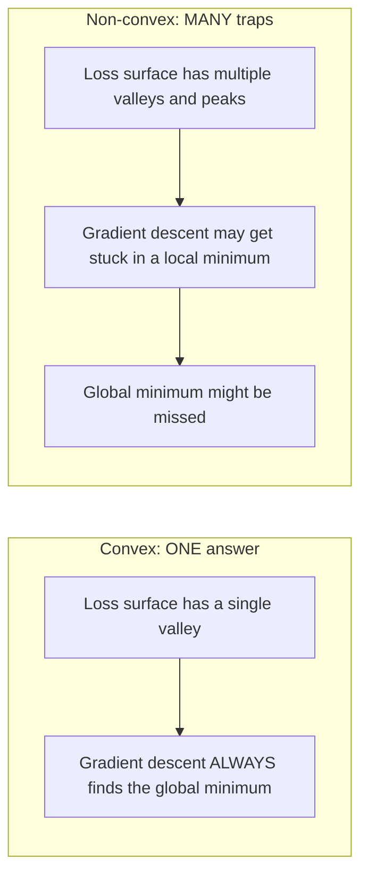
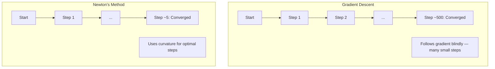
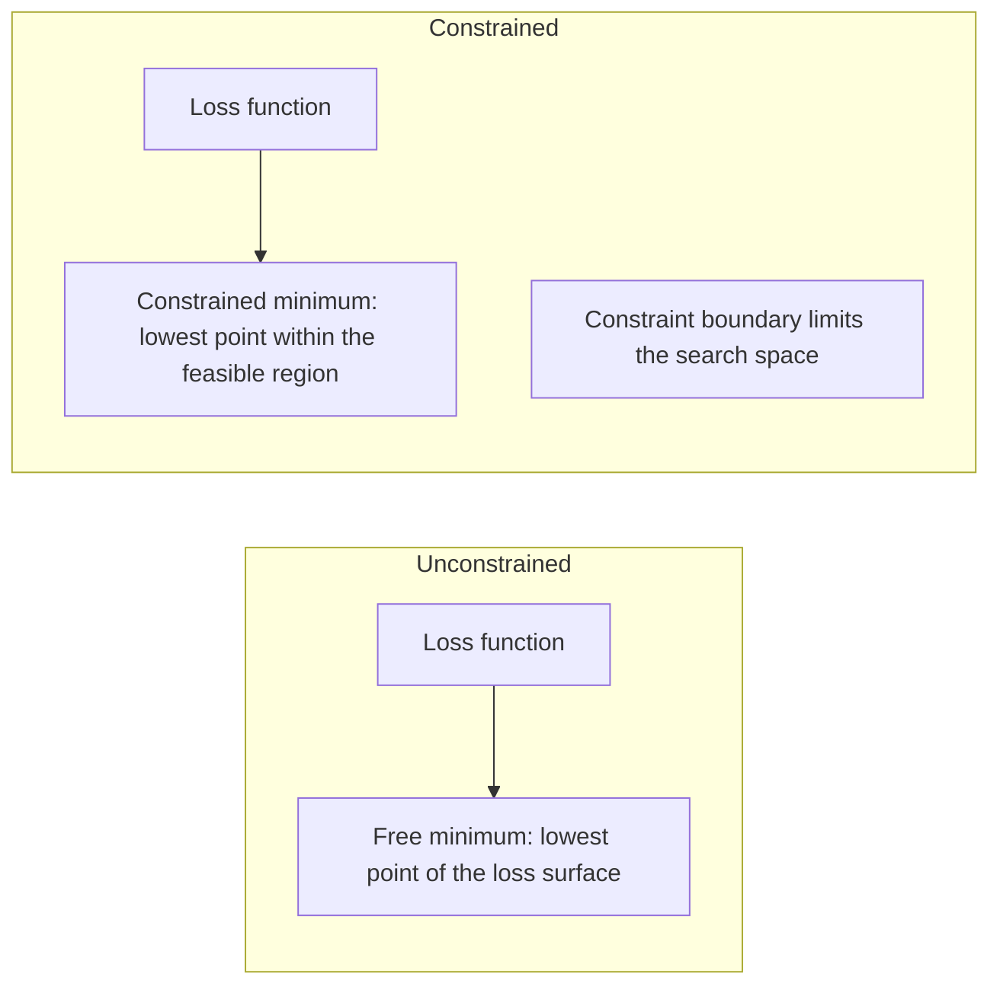
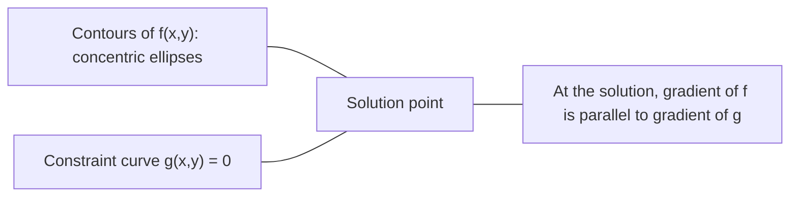

# 凸优化

> Convex problems 只有一个山谷。神经网络有几百万个。知道区别很重要。

**类型：** 构建
**语言：** Python
**前置要求：** 阶段 1，第 04 课（机器学习中的微积分）、第 08 课（优化）
**时间：** ~90 分钟

## 学习目标

- 使用定义、二阶导数和 Hessian criteria 测试函数是否 convex
- 实现 Newton's method，并将它的 quadratic convergence 与 gradient descent 比较
- 使用 Lagrange multipliers 求解 constrained optimization problems，并解释 KKT conditions
- 解释为什么神经网络 loss landscapes 是 non-convex，但 SGD 仍能找到好解

## 问题

第 08 课教了你 gradient descent、momentum 和 Adam。这些 optimizers 会在任意曲面上往下坡走。但它们没有保证。Gradient descent 在 non-convex landscape 上可能落入糟糕的局部最小值，卡在 saddle point，或永远振荡。你仍然使用它，因为神经网络是 non-convex，而且没有替代品。

但机器学习中很多问题是 convex 的。Linear regression、logistic regression、SVM、LASSO、ridge regression。对这些问题，有更强的东西：带数学保证的优化。Convex problem 只有一个山谷。任何往下坡走的算法都会到达 global minimum。不需要 restarts。不需要 learning rate schedules。不需要祈祷。

理解 convexity 有三件用处。第一，它告诉你问题是容易（convex）还是困难（non-convex）。第二，它给你 Newton's method 这样的更快工具，用于 convex problems。第三，它解释贯穿 ML 的概念：regularization 作为 constraint、SVM 中的 duality，以及为什么 deep learning 在违反 convexity 所有良好性质后仍然有效。

## 概念

### Convex sets

如果集合 S 中任意两点之间的线段也完全位于 S 内，则 S 是 convex 的。

| Convex sets | Not convex |
|---|---|
| **Rectangle**：内部任意两点都能用完全留在内部的线段连接 | **Star/crescent shape**：两个内部点之间的线可能经过集合外部 |
| **Triangle**：所有内部点都满足同样性质 | **Donut/annulus**：中间的洞会让某些线段离开集合 |
| 任意两点之间的线段都留在集合内 | 某些点对之间的线段会离开集合 |

形式化测试：对 S 中任意 x、y，以及任意 t in [0, 1]，点 tx + (1-t)y 也在 S 中。

Convex sets 的例子：
- 一条线、一个平面、整个 R^n
- 一个 ball（circle、sphere、hypersphere）
- 一个 halfspace：{x : a^T x <= b}
- 任意数量 convex sets 的交集

Non-convex sets 的例子：
- Donut（annulus）
- 两个不相交圆的并集
- 任何带“凹陷”或“洞”的集合

### Convex functions

如果函数 f 的 domain 是 convex set，并且对 domain 中任意两点 x、y 以及任意 t in [0, 1]：

```
f(tx + (1-t)y) <= t*f(x) + (1-t)*f(y)
```

则 f 是 convex 的。

几何上：图像上任意两点之间的线段都在图像上方或与图像重合。

| Property | Convex function | Non-convex function |
|---|---|---|
| **Line segment test** | 图像上任意两点之间的线在曲线**上方或重合** | 某些点之间的线会落到曲线**下方** |
| **Shape** | 单个向上弯曲的碗/山谷 | 多个峰谷，曲率混合 |
| **Local minima** | 每个 local minimum 都是 global minimum | 可能存在多个高度不同的 local minima |

常见 convex functions：
- f(x) = x^2（parabola）
- f(x) = |x|（absolute value）
- f(x) = e^x（exponential）
- f(x) = max(0, x)（ReLU，虽然是 piecewise linear）
- f(x) = -log(x) for x > 0（negative log）
- 任意 linear function f(x) = a^T x + b（既 convex 又 concave）

### 测试 convexity

三种实用测试，从最简单到最严格。

**测试 1：Second derivative test（1D）。** 如果所有 x 都有 f''(x) >= 0，则 f 是 convex。

- f(x) = x^2：f''(x) = 2 >= 0。Convex。
- f(x) = x^3：f''(x) = 6x。x < 0 时为负。Not convex。
- f(x) = e^x：f''(x) = e^x > 0。Convex。

**测试 2：Hessian test（多变量）。** 如果 Hessian matrix H(x) 对所有 x 都 positive semidefinite，则 f 是 convex。Hessian 是二阶偏导数组成的矩阵。

**测试 3：Definition test。** 直接检查不等式 f(tx + (1-t)y) <= t*f(x) + (1-t)*f(y)。适合 derivatives 难以计算的函数。

### 为什么 convexity 重要

Convex optimization 的中心定理：

**对 convex function，每个 local minimum 都是 global minimum。**

这意味着 gradient descent 不会被困住。任何下坡路径都会到同一个答案。算法保证收敛到最优解。



后果：
- 不需要 random restarts
- 不需要复杂 learning rate schedules
- 可以做 convergence proofs（速率取决于函数性质）
- 解是唯一的（除非有 flat regions）

### ML 中的 convex vs non-convex

| 问题 | Convex? | 为什么 |
|---------|---------|-----|
| Linear regression（MSE） | 是 | Loss 关于 weights 是 quadratic |
| Logistic regression | 是 | Log-loss 关于 weights 是 convex |
| SVM（hinge loss） | 是 | Linear functions 的 maximum |
| LASSO（L1 regression） | 是 | Convex functions 之和仍是 convex |
| Ridge regression（L2） | 是 | Quadratic + quadratic = convex |
| Neural network（任意 loss） | 否 | Nonlinear activations 产生 non-convex landscape |
| k-means clustering | 否 | Discrete assignment step |
| Matrix factorization | 否 | 未知量的乘积 |

带 convex losses 的线性模型是 convex。只要加入带 nonlinear activations 的隐藏层，convexity 就破坏了。

### Hessian matrix

函数 f: R^n -> R 的 Hessian H 是 n x n 的二阶偏导矩阵。

```
H[i][j] = d^2 f / (dx_i dx_j)
```

对 f(x, y) = x^2 + 3xy + y^2：

```
df/dx = 2x + 3y       d^2f/dx^2 = 2      d^2f/dxdy = 3
df/dy = 3x + 2y       d^2f/dydx = 3      d^2f/dy^2 = 2

H = [ 2  3 ]
    [ 3  2 ]
```

Hessian 告诉你曲率：
- Eigenvalues 全为正：函数在每个方向都向上弯（该点 convex）
- Eigenvalues 全为负：在每个方向都向下弯（concave，local max）
- 正负混合：saddle point（某些方向向上，另一些向下）
- 零 eigenvalue：该方向平坦（degenerate）

对 convexity 来说，Hessian 必须 everywhere positive semidefinite（所有 eigenvalues >= 0），而不是只在某一点。

### Newton's method

Gradient descent 使用一阶信息（gradient）。Newton's method 使用二阶信息（Hessian）。它在当前点拟合二次近似，并直接跳到该二次函数的最小值。

```
Update rule:
  x_new = x - H^(-1) * gradient

Compare to gradient descent:
  x_new = x - lr * gradient
```

Newton's method 用 inverse Hessian 替换标量 learning rate。它会根据局部曲率自动调整步长和方向。



优势：
- 靠近最小值时 quadratic convergence（每步误差平方）
- 不需要调 learning rate
- Scale-invariant（无论如何参数化问题都能工作）

劣势：
- 计算 Hessian 需要 O(n^2) 内存，反转需要 O(n^3)
- 对 100 万权重的神经网络，这是 10^12 个 entries 和 10^18 次 operations
- 不适合 deep learning

### Constrained optimization

Unconstrained optimization：在所有 x 上最小化 f(x)。
Constrained optimization：在满足 constraints 的条件下最小化 f(x)。

真实问题有 constraints。你想最小化成本，但预算有限。你想最小化 error，但 model complexity 有上限。



### Lagrange multipliers

Lagrange multipliers 方法把 constrained problem 转换成 unconstrained one。

问题：minimize f(x) subject to g(x) = 0。

解法：引入新变量（Lagrange multiplier lambda），求解 unconstrained problem：

```
L(x, lambda) = f(x) + lambda * g(x)
```

在解处，L 的 gradient 为零：

```
dL/dx = df/dx + lambda * dg/dx = 0
dL/dlambda = g(x) = 0
```

几何直觉：在 constrained minimum，f 的 gradient 必须与 constraint g 的 gradient 平行。如果不平行，你就可以沿 constraint surface 移动并进一步降低 f。



例子：minimize f(x,y) = x^2 + y^2 subject to x + y = 1。

```
L = x^2 + y^2 + lambda(x + y - 1)

dL/dx = 2x + lambda = 0  =>  x = -lambda/2
dL/dy = 2y + lambda = 0  =>  y = -lambda/2
dL/dlambda = x + y - 1 = 0

From first two: x = y
Substituting: 2x = 1, so x = y = 0.5, lambda = -1
```

直线 x + y = 1 上离原点最近的点是 (0.5, 0.5)。

### KKT conditions

Karush-Kuhn-Tucker conditions 把 Lagrange multipliers 扩展到 inequality constraints。

问题：minimize f(x) subject to g_i(x) <= 0 for i = 1, ..., m。

KKT conditions（optimality 的必要条件）：

```
1. Stationarity:    df/dx + sum(lambda_i * dg_i/dx) = 0
2. Primal feasibility:  g_i(x) <= 0  for all i
3. Dual feasibility:    lambda_i >= 0  for all i
4. Complementary slackness:  lambda_i * g_i(x) = 0  for all i
```

Complementary slackness 是关键洞见：constraint 要么 active（g_i = 0，解位于边界），要么 multiplier 为零（constraint 不重要）。不影响解的 constraint 有 lambda = 0。

KKT conditions 是 SVM 的核心。Support vectors 是 constraint active 的数据点（lambda > 0）。其他数据点 lambda = 0，不影响 decision boundary。

### Regularization as constrained optimization

L1 和 L2 regularization 不是随意技巧。它们是伪装过的 constrained optimization problems。

**L2 regularization（Ridge）：**

```
minimize  Loss(w)  subject to  ||w||^2 <= t

Equivalent unconstrained form:
minimize  Loss(w) + lambda * ||w||^2
```

Constraint ||w||^2 <= t 定义一个 ball（2D 中是 circle，3D 中是 sphere）。解是 loss contours 首次接触这个 ball 的位置。

**L1 regularization（LASSO）：**

```
minimize  Loss(w)  subject to  ||w||_1 <= t

Equivalent unconstrained form:
minimize  Loss(w) + lambda * ||w||_1
```

Constraint ||w||_1 <= t 定义一个 diamond（2D 中旋转的 square）。

| Property | L2 constraint（circle） | L1 constraint（diamond） |
|---|---|---|
| **Constraint shape** | Circle（高维中 sphere） | Diamond（2D 中旋转 square） |
| **Loss contour 接触位置** | Smooth boundary：circle 上任意点 | Corner：与某个 axis 对齐 |
| **Solution behavior** | 权重小但非零 | 某些权重精确为零（sparse） |
| **Result** | Weight shrinkage | Feature selection |

这解释了为什么 L1 产生 sparse models（feature selection），而 L2 只是收缩权重。Diamond 有与 axes 对齐的角。Loss contours 更可能接触角落，从而把一个或多个权重设为零。

### Duality

每个 constrained optimization problem（primal）都有一个 companion problem（dual）。对 convex problems，primal 和 dual 具有相同 optimal value。这是 strong duality。

Lagrangian dual function：

```
Primal: minimize f(x) subject to g(x) <= 0
Lagrangian: L(x, lambda) = f(x) + lambda * g(x)
Dual function: d(lambda) = min_x L(x, lambda)
Dual problem: maximize d(lambda) subject to lambda >= 0
```

为什么 duality 重要：
- Dual problem 有时比 primal 更容易求解
- SVM 在 dual form 中求解，此时问题依赖 data points 之间的 dot products（从而启用 kernel trick）
- Dual 为 primal optimum 提供 lower bound，有助于检查 solution quality

对 SVM 来说：

```
Primal: find w, b that maximize the margin 2/||w|| subject to
        y_i(w^T x_i + b) >= 1 for all i

Dual:   maximize sum(alpha_i) - 0.5 * sum_ij(alpha_i * alpha_j * y_i * y_j * x_i^T x_j)
        subject to alpha_i >= 0 and sum(alpha_i * y_i) = 0

The dual only involves dot products x_i^T x_j.
Replace x_i^T x_j with K(x_i, x_j) to get the kernel trick.
```

### 为什么 deep learning 在 non-convex 情况下仍然有效

神经网络 loss functions 极其 non-convex。按经典标准，优化它们本该失败。但 stochastic gradient descent 可靠地找到好解。有几个因素解释这一点。

**大多数 local minima 足够好。** 在高维空间中，随机 critical points（gradient 为零处）绝大多数是 saddle points，而不是 local minima。少数存在的 local minima 往往 loss 接近 global minimum。当 parameter space 有数百万维时，陷入糟糕 local minimum 的概率极低。

**真正障碍是 saddle points，而不是 local minima。** 对 n 参数函数，saddle point 在不同方向上有正负混合曲率。高维中随机 critical point 的所有 n 个 eigenvalues 都为正（local minimum）的概率约为 2^(-n)。几乎所有 critical points 都是 saddle points。SGD 的噪声有助于逃离它们。

**Overparameterization 平滑 landscape。** 参数数量超过训练样本数量的网络，有更平滑、更连通的 loss surfaces。更宽的网络有更少 bad local minima。这违反直觉，但与经验一致。

**Loss landscape structure：**

| Property | Low-dimensional space | High-dimensional space |
|---|---|---|
| **Landscape** | 许多孤立 peaks 和 valleys | 平滑连接的 valleys |
| **Minima** | 许多孤立 local minima | 很少 bad local minima；大多 near-optimal |
| **Navigation** | 难以找到 global minimum | 许多路径通向好解 |
| **Critical points** | Local minima 和 saddle points 混合 | 绝大多数是 saddle points，不是 local minima |

**Stochastic noise 充当 implicit regularization。** Mini-batch SGD 添加的噪声会防止落入 sharp minima。Sharp minima 容易 overfit；flat minima 泛化更好。噪声会把优化偏向 loss landscape 的平坦区域。

### 实践中的 second-order methods

纯 Newton's method 不适合大模型。几个近似方法让二阶信息可用。

**L-BFGS（Limited-memory BFGS）：** 使用最近 m 次 gradient differences 近似 inverse Hessian。内存从 O(n^2) 降为 O(mn)。对 ~10,000 参数以内问题效果好。用于 classical ML（logistic regression、CRFs），但不用于 deep learning。

**Natural gradient：** 使用 Fisher information matrix（log-likelihood 的 expected Hessian）而不是标准 Hessian。这考虑了 probability distributions 的几何。K-FAC（Kronecker-Factored Approximate Curvature）把 Fisher matrix 近似成 Kronecker product，使它在神经网络中可行。

**Hessian-free optimization：** 用 conjugate gradient 求解 Hx = g，而不显式形成 H。只需要 Hessian-vector products，而它们可以通过 automatic differentiation 在 O(n) 时间内计算。

**Diagonal approximations：** Adam 的 second moment 是 Hessian diagonal 的对角近似。AdaHessian 通过 Hutchinson's estimator 使用真实 Hessian diagonal elements 扩展这一点。

| Method | Memory | Per-step cost | When to use |
|--------|--------|--------------|-------------|
| Gradient descent | O(n) | O(n) | Baseline、大模型 |
| Newton's method | O(n^2) | O(n^3) | 小型 convex problems |
| L-BFGS | O(mn) | O(mn) | 中型 convex problems |
| Adam | O(n) | O(n) | Deep learning 默认 |
| K-FAC | O(n) | 每层 O(n) | Research、大 batch training |

## 构建它

### 第 1 步：Convexity checker

构建一个函数，通过采样 points 并检查定义，经验性测试 convexity。

```python
import random
import math

def check_convexity(f, dim, bounds=(-5, 5), samples=1000):
    violations = 0
    for _ in range(samples):
        x = [random.uniform(*bounds) for _ in range(dim)]
        y = [random.uniform(*bounds) for _ in range(dim)]
        t = random.uniform(0, 1)
        mid = [t * xi + (1 - t) * yi for xi, yi in zip(x, y)]
        lhs = f(mid)
        rhs = t * f(x) + (1 - t) * f(y)
        if lhs > rhs + 1e-10:
            violations += 1
    return violations == 0, violations
```

### 第 2 步：2D Newton's method

使用显式 Hessian 实现 Newton's method。与 gradient descent 比较收敛速度。

```python
def newtons_method(f, grad_f, hessian_f, x0, steps=50, tol=1e-12):
    x = list(x0)
    history = [x[:]]
    for _ in range(steps):
        g = grad_f(x)
        H = hessian_f(x)
        det = H[0][0] * H[1][1] - H[0][1] * H[1][0]
        if abs(det) < 1e-15:
            break
        H_inv = [
            [H[1][1] / det, -H[0][1] / det],
            [-H[1][0] / det, H[0][0] / det],
        ]
        dx = [
            H_inv[0][0] * g[0] + H_inv[0][1] * g[1],
            H_inv[1][0] * g[0] + H_inv[1][1] * g[1],
        ]
        x = [x[0] - dx[0], x[1] - dx[1]]
        history.append(x[:])
        if sum(gi ** 2 for gi in g) < tol:
            break
    return history
```

### 第 3 步：Lagrange multiplier solver

通过对 Lagrangian 做 gradient descent 求解 constrained optimization。

```python
def lagrange_solve(f_grad, g_val, g_grad, x0, lr=0.01,
                   lr_lambda=0.01, steps=5000):
    x = list(x0)
    lam = 0.0
    history = []
    for _ in range(steps):
        fg = f_grad(x)
        gv = g_val(x)
        gg = g_grad(x)
        x = [
            xi - lr * (fgi + lam * ggi)
            for xi, fgi, ggi in zip(x, fg, gg)
        ]
        lam = lam + lr_lambda * gv
        history.append((x[:], lam, gv))
    return history
```

### 第 4 步：比较 first-order 和 second-order

在同一个 quadratic function 上运行 gradient descent 和 Newton's method。统计收敛步数。

```python
def quadratic(x):
    return 5 * x[0] ** 2 + x[1] ** 2

def quadratic_grad(x):
    return [10 * x[0], 2 * x[1]]

def quadratic_hessian(x):
    return [[10, 0], [0, 2]]
```

Newton's method 会在 1 步内收敛（对 quadratics 它是精确的）。Gradient descent 会花几百步，因为 Hessian 的 eigenvalues 相差 5 倍，形成拉长的山谷。

## 使用它

Convexity analysis 会直接影响 ML models 和 solvers 的选择。

对 convex problems（logistic regression、SVM、LASSO）：
- 使用专用 solvers（liblinear、CVXPY、`scipy.optimize.minimize` with method='L-BFGS-B'）
- 期待唯一 global solution
- Second-order methods 实用且快速

对 non-convex problems（神经网络）：
- 使用 first-order methods（SGD、Adam）
- 接受 solution 依赖 initialization 和 randomness
- 使用 overparameterization、noise 和 learning rate schedules 作为 implicit regularization
- 不要浪费时间寻找 global minimum。好的 local minimum 足够了。

```python
from scipy.optimize import minimize

result = minimize(
    fun=lambda w: sum((y - X @ w) ** 2) + 0.1 * sum(w ** 2),
    x0=np.zeros(d),
    method='L-BFGS-B',
    jac=lambda w: -2 * X.T @ (y - X @ w) + 0.2 * w,
)
```

对 SVM，dual formulation 让你使用 kernel trick：

```python
from sklearn.svm import SVC

svm = SVC(kernel='rbf', C=1.0)
svm.fit(X_train, y_train)
print(f"Support vectors: {svm.n_support_}")
```

## 练习

1. **Convexity gallery。** 使用 checker 测试这些函数的 convexity：f(x) = x^4、f(x) = sin(x)、f(x,y) = x^2 + y^2、f(x,y) = x*y、f(x) = max(x, 0)。解释每个结果为什么合理。

2. **Newton vs gradient descent race。** 从起点 (10, 10) 在 f(x,y) = 50*x^2 + y^2 上运行两种方法。各自需要多少步达到 loss < 1e-10？当 condition number（Hessian 最大与最小 eigenvalue 之比）增加时，gradient descent 会发生什么？

3. **Lagrange multiplier geometry。** Minimize f(x,y) = (x-3)^2 + (y-3)^2 subject to x + 2y = 4。通过检查解处 f 的 gradient 与 g 的 gradient 平行来验证结果。

4. **Regularization constraint。** 实现 L1-constrained optimization：minimize (x-3)^2 + (y-2)^2 subject to |x| + |y| <= 1。展示解有一个坐标为零（diamond constraint 产生 sparsity）。

5. **Hessian eigenvalue analysis。** 计算 Rosenbrock function 在 (1,1) 和 (-1,1) 处的 Hessian。计算两个点的 eigenvalues。Eigenvalues 告诉你 minimum 处和远离 minimum 时的 curvature 有什么不同？

## 关键术语

| 术语 | 含义 |
|------|---------------|
| Convex set | 集合中任意两点之间的线段都留在集合内 |
| Convex function | 图像上任意两点之间的线段都位于图像上方或重合的函数。等价地，Hessian everywhere positive semidefinite |
| Local minimum | 低于所有附近点的点。对 convex functions，每个 local minimum 都是 global minimum |
| Global minimum | 函数在整个 domain 上的最低点 |
| Hessian matrix | 所有二阶偏导数组成的矩阵。编码曲率信息 |
| Positive semidefinite | Eigenvalues 全部非负的矩阵。“二阶导数 >= 0”的多维类比 |
| Condition number | Hessian 最大与最小 eigenvalue 之比。高 condition number 意味着拉长山谷和慢 gradient descent |
| Newton's method | 使用 inverse Hessian 决定步长和方向的 second-order optimizer。在 minimum 附近 quadratic convergence |
| Lagrange multiplier | 引入变量，把 constrained optimization problem 转换成 unconstrained problem |
| KKT conditions | 带 inequality constraints 的 optimality 必要条件。推广 Lagrange multipliers |
| Complementary slackness | 在解处，constraint 要么 active，要么其 multiplier 为零。两者不会同时非零 |
| Duality | 每个 constrained problem 都有 companion dual problem。对 convex problems，二者 optimal value 相同 |
| Strong duality | Primal 和 dual optimal values 相等。对满足 Slater's condition 的 convex problems 成立 |
| L-BFGS | 近似 second-order 方法，存储最近 m 个 gradient differences，而不是完整 Hessian |
| Saddle point | Gradient 为零，但某些方向是 minimum、另一些方向是 maximum 的点 |
| Overparameterization | 参数数量多于训练样本。会平滑 loss landscape 并减少 bad local minima |

## 延伸阅读

- [Boyd & Vandenberghe: Convex Optimization](https://web.stanford.edu/~boyd/cvxbook/) - 标准教材，可免费在线阅读
- [Bottou, Curtis, Nocedal: Optimization Methods for Large-Scale Machine Learning (2018)](https://arxiv.org/abs/1606.04838) - 连接 convex optimization theory 和 deep learning practice
- [Choromanska et al.: The Loss Surfaces of Multilayer Networks (2015)](https://arxiv.org/abs/1412.0233) - 为什么 non-convex neural network landscapes 没有看起来那么糟
- [Nocedal & Wright: Numerical Optimization](https://link.springer.com/book/10.1007/978-0-387-40065-5) - Newton's method、L-BFGS 和 constrained optimization 的综合参考
