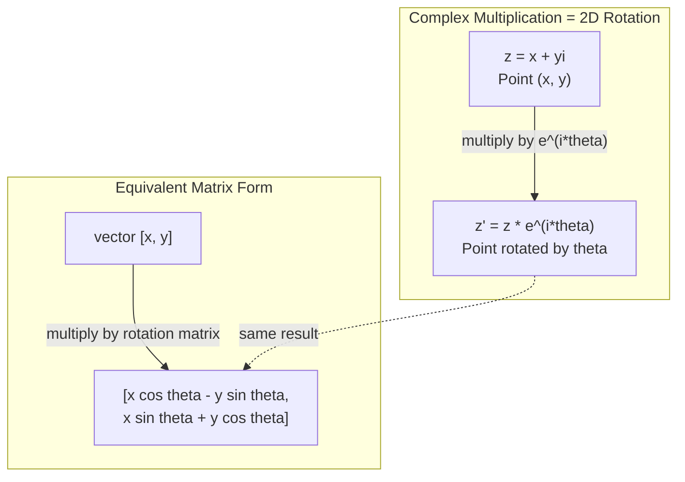
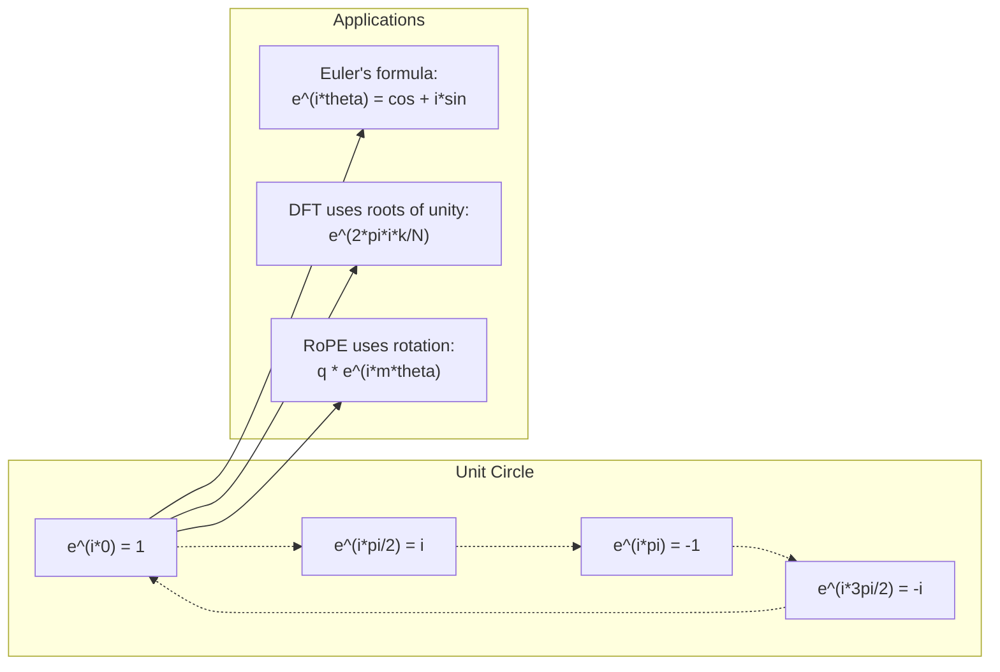

# 面向 AI 的复数

> -1 的平方根并不“虚”。它是旋转、频率和半个信号处理领域的钥匙。

**类型：** 学习
**语言：** Python
**前置要求：** 阶段 1，第 01-04 课（线性代数、微积分）
**时间：** ~60 分钟

## 学习目标

- 在 rectangular 和 polar form 中进行 complex arithmetic（加、乘、除、conjugate）
- 应用 Euler's formula，在 complex exponentials 和 trigonometric functions 之间转换
- 使用 complex roots of unity 实现 Discrete Fourier Transform
- 解释 complex rotations 如何支撑 transformers 中的 RoPE 和 sinusoidal positional encodings

## 问题

你打开一篇关于 Fourier transforms 的论文，到处都是 `i`。你看 transformer positional encodings，看到不同频率的 `sin` 和 `cos`：complex exponentials 的实部和虚部。你读 quantum computing，发现一切都用 complex vector spaces 表达。

Complex numbers 看起来抽象。一个建立在 -1 的平方根上的数字系统，像是数学把戏。但它不是把戏。它是旋转和振荡的自然语言。每当某个东西旋转、振动或振荡时，complex numbers 都是正确工具。

不理解 complex numbers，你就无法理解 Discrete Fourier Transform。无法理解 FFT。无法理解现代语言模型中的 RoPE（Rotary Position Embedding）如何工作。也无法理解原始 Transformer 论文中的 sinusoidal positional encodings 为什么使用那些频率。

本课会从零构建 complex arithmetic，把它连接到几何，并精确展示 complex numbers 在机器学习中出现在哪里。

## 概念

### 什么是 complex number？

Complex number 有两部分：real part 和 imaginary part。

```
z = a + bi

where:
  a is the real part
  b is the imaginary part
  i is the imaginary unit, defined by i^2 = -1
```

就这样。你把数轴扩展成一个平面。Real numbers 位于一个轴上。Imaginary numbers 位于另一个轴上。每个 complex number 都是这个平面上的一个点。

### Complex arithmetic

**加法。** Real parts 相加，imaginary parts 相加。

```
(a + bi) + (c + di) = (a + c) + (b + d)i

Example: (3 + 2i) + (1 + 4i) = 4 + 6i
```

**乘法。** 使用分配律，并记住 i^2 = -1。

```
(a + bi)(c + di) = ac + adi + bci + bdi^2
                 = ac + adi + bci - bd
                 = (ac - bd) + (ad + bc)i

Example: (3 + 2i)(1 + 4i) = 3 + 12i + 2i + 8i^2
                            = 3 + 14i - 8
                            = -5 + 14i
```

**Conjugate。** 翻转 imaginary part 的符号。

```
conjugate of (a + bi) = a - bi
```

Complex number 与它的 conjugate 的乘积总是 real：

```
(a + bi)(a - bi) = a^2 + b^2
```

**除法。** 分子和分母同时乘以分母的 conjugate。

```
(a + bi) / (c + di) = (a + bi)(c - di) / (c^2 + d^2)
```

这会消除分母中的 imaginary part，得到一个干净的 complex number。

### Complex plane

Complex plane 把每个 complex number 映射到 2D 点。水平轴是 real axis，垂直轴是 imaginary axis。

```
z = 3 + 2i  corresponds to the point (3, 2)
z = -1 + 0i corresponds to the point (-1, 0) on the real axis
z = 0 + 4i  corresponds to the point (0, 4) on the imaginary axis
```

Complex number 同时是一个点，也是从原点出发的向量。这个双重解释让 complex numbers 对几何很有用。

### Polar form

平面上的任意点都可以用它到原点的距离，以及相对正 real axis 的角度描述。

```
z = r * (cos(theta) + i*sin(theta))

where:
  r = |z| = sqrt(a^2 + b^2)     (magnitude, or modulus)
  theta = atan2(b, a)             (phase, or argument)
```

Rectangular form（a + bi）适合加法。Polar form（r, theta）适合乘法。

**Polar form 中的乘法。** Magnitudes 相乘，angles 相加。

```
z1 = r1 * e^(i*theta1)
z2 = r2 * e^(i*theta2)

z1 * z2 = (r1 * r2) * e^(i*(theta1 + theta2))
```

这就是为什么 complex numbers 非常适合旋转。乘以 magnitude 为 1 的 complex number，就是纯旋转。

### Euler's formula

Complex exponentials 和 trigonometry 之间的桥梁：

```
e^(i*theta) = cos(theta) + i*sin(theta)
```

这是本课最重要的公式。当 theta = pi：

```
e^(i*pi) = cos(pi) + i*sin(pi) = -1 + 0i = -1

Therefore: e^(i*pi) + 1 = 0
```

五个基本常数（e、i、pi、1、0）在一个方程中相连。

### 为什么 Euler's formula 对 ML 重要

Euler's formula 说，随着 theta 变化，`e^(i*theta)` 会描出单位圆。theta = 0 时，你在 (1, 0)。theta = pi/2 时，在 (0, 1)。theta = pi 时，在 (-1, 0)。theta = 3*pi/2 时，在 (0, -1)。完整一圈是 theta = 2*pi。

这意味着 complex exponentials 就是 rotations。而 rotations 在 signal processing 和 ML 中无处不在。

### 与 2D rotations 的连接

把 complex number (x + yi) 乘以 e^(i*theta)，会把点 (x, y) 绕原点旋转 theta。

```
Rotation via complex multiplication:
  (x + yi) * (cos(theta) + i*sin(theta))
  = (x*cos(theta) - y*sin(theta)) + (x*sin(theta) + y*cos(theta))i

Rotation via matrix multiplication:
  [cos(theta)  -sin(theta)] [x]   [x*cos(theta) - y*sin(theta)]
  [sin(theta)   cos(theta)] [y] = [x*sin(theta) + y*cos(theta)]
```

它们产生完全相同的结果。Complex multiplication 就是 2D rotation。Rotation matrix 只是用矩阵记法写出的 complex multiplication。



### Phasors 和 rotating signals

Complex exponential e^(i*omega*t) 是一个以 angular frequency omega 绕单位圆旋转的点。随着 t 增加，这个点描出圆。

这个旋转点的 real part 是 cos(omega*t)。Imaginary part 是 sin(omega*t)。Sinusoidal signal 是 rotating complex number 的影子。

```
e^(i*omega*t) = cos(omega*t) + i*sin(omega*t)

Real part:      cos(omega*t)    -- a cosine wave
Imaginary part: sin(omega*t)    -- a sine wave
```

这就是 phasor representation。你不再追踪上下摆动的 sine wave，而是追踪平滑旋转的箭头。Phase shifts 变成 angle offsets。Amplitude changes 变成 magnitude changes。Signals 相加变成 vector addition。

### Roots of unity

N-th roots of unity 是单位圆上等间隔的 N 个点：

```
w_k = e^(2*pi*i*k/N)    for k = 0, 1, 2, ..., N-1
```

N = 4 时，roots 是：1、i、-1、-i（四个罗盘方向）。
N = 8 时，你得到四个罗盘方向加四个对角方向。

Roots of unity 是 Discrete Fourier Transform 的基础。DFT 把 signal 分解到这些 N 个等间隔频率的 components 上。

### 与 DFT 的连接

Signal x[0], x[1], ..., x[N-1] 的 Discrete Fourier Transform 是：

```
X[k] = sum_{n=0}^{N-1} x[n] * e^(-2*pi*i*k*n/N)
```

每个 X[k] 衡量 signal 与第 k 个 root of unity（频率为 k 的 complex sinusoid）有多相关。DFT 把 signal 分解成 N 个 rotating phasors，并告诉你每个的 amplitude 和 phase。

### 为什么 i 并不 imaginary

"Imaginary" 这个词是历史偶然。Descartes 当初带有贬义地使用它。但 i 并不比负数更“虚”，就像负数刚出现时也曾被人拒绝。负数回答“从 3 中减去什么能得到 5？”Imaginary unit 回答“什么数平方后得到 -1？”

更有用的理解：i 是 90 度 rotation operator。一个 real number 乘以 i 一次，你旋转 90 度到 imaginary axis。再乘一次 i（i^2），你又旋转 90 度：现在指向 negative real direction。这就是为什么 i^2 = -1。它并不神秘。它是由两次 quarter-turn 组成的 half-turn。

这就是 complex numbers 在工程中无处不在的原因。任何会旋转的东西：电磁波、量子态、信号振荡、positional encodings，都天然用 complex numbers 描述。

### Complex exponentials vs trigonometric functions

在 Euler's formula 之前，工程师把信号写成 A*cos(omega*t + phi)：amplitude A、frequency omega、phase phi。这可行，但算术很痛苦。相加两个不同 phase 的 cosines 需要三角恒等式。

使用 complex exponentials，同一个信号是 A*e^(i*(omega*t + phi))。相加两个 signals 就是相加两个 complex numbers。相乘（modulating）就是 magnitudes 相乘、angles 相加。Phase shifts 变成 angle additions。Frequency shifts 变成乘以 phasors。

整个 signal processing 领域转向 complex exponential notation，因为数学更干净。“Real signal” 始终只是 complex representation 的 real part。Imaginary part 作为 bookkeeping 保留下来，让所有代数自然成立。

### 与 transformers 的连接

**Sinusoidal positional encodings**（原始 Transformer 论文）：

```
PE(pos, 2i) = sin(pos / 10000^(2i/d))
PE(pos, 2i+1) = cos(pos / 10000^(2i/d))
```

Sin 和 cos 成对出现，是不同频率 complex exponentials 的 real 和 imaginary parts。每个频率为 position encoding 提供不同“分辨率”。低频变化慢（粗位置）。高频变化快（细位置）。合在一起，它们给每个位置一个独特的 frequency fingerprint。

**RoPE（Rotary Position Embedding）** 更进一步。它显式地用 complex rotation matrices 乘以 query 和 key vectors。两个 tokens 之间的 relative position 变成 rotation angle。Attention 用这些 rotated vectors 计算，让模型通过 complex multiplication 感知 relative position。

| Operation | Algebraic Form | Geometric Meaning |
|-----------|---------------|-------------------|
| Addition | (a+c) + (b+d)i | Plane 中的 vector addition |
| Multiplication | (ac-bd) + (ad+bc)i | 旋转并缩放 |
| Conjugate | a - bi | 关于 real axis 反射 |
| Magnitude | sqrt(a^2 + b^2) | 到原点的距离 |
| Phase | atan2(b, a) | 相对正 real axis 的角度 |
| Division | multiply by conjugate | 反向旋转并重新缩放 |
| Power | r^n * e^(i*n*theta) | 旋转 n 次，按 r^n 缩放 |



## 构建它

### 第 1 步：Complex class

构建一个 Complex number class，支持 arithmetic、magnitude、phase，以及 rectangular 和 polar forms 之间转换。

```python
import math

class Complex:
    def __init__(self, real, imag=0.0):
        self.real = real
        self.imag = imag

    def __add__(self, other):
        return Complex(self.real + other.real, self.imag + other.imag)

    def __mul__(self, other):
        r = self.real * other.real - self.imag * other.imag
        i = self.real * other.imag + self.imag * other.real
        return Complex(r, i)

    def __truediv__(self, other):
        denom = other.real ** 2 + other.imag ** 2
        r = (self.real * other.real + self.imag * other.imag) / denom
        i = (self.imag * other.real - self.real * other.imag) / denom
        return Complex(r, i)

    def magnitude(self):
        return math.sqrt(self.real ** 2 + self.imag ** 2)

    def phase(self):
        return math.atan2(self.imag, self.real)

    def conjugate(self):
        return Complex(self.real, -self.imag)
```

### 第 2 步：Polar conversion 和 Euler's formula

```python
def to_polar(z):
    return z.magnitude(), z.phase()

def from_polar(r, theta):
    return Complex(r * math.cos(theta), r * math.sin(theta))

def euler(theta):
    return Complex(math.cos(theta), math.sin(theta))
```

验证：`euler(theta).magnitude()` 应始终为 1.0。`euler(0)` 应给出 (1, 0)。`euler(pi)` 应给出 (-1, 0)。

### 第 3 步：Rotation

把点 (x, y) 旋转 theta，就是一次 complex multiplication：

```python
point = Complex(3, 4)
rotated = point * euler(math.pi / 4)
```

Magnitude 保持不变。只有 angle 改变。

### 第 4 步：用 complex arithmetic 实现 DFT

```python
def dft(signal):
    N = len(signal)
    result = []
    for k in range(N):
        total = Complex(0, 0)
        for n in range(N):
            angle = -2 * math.pi * k * n / N
            total = total + Complex(signal[n], 0) * euler(angle)
        result.append(total)
    return result
```

这是 O(N^2) DFT。每个输出 X[k] 是 signal samples 乘以 roots of unity 后的和。

### 第 5 步：Inverse DFT

Inverse DFT 从 spectrum 重构原始 signal。与 forward DFT 的唯一区别：翻转 exponent 符号并除以 N。

```python
def idft(spectrum):
    N = len(spectrum)
    result = []
    for n in range(N):
        total = Complex(0, 0)
        for k in range(N):
            angle = 2 * math.pi * k * n / N
            total = total + spectrum[k] * euler(angle)
        result.append(Complex(total.real / N, total.imag / N))
    return result
```

这会给你完美重构。应用 DFT，再应用 IDFT，你会在 machine precision 内得到原始 signal。没有信息丢失。

### 第 6 步：Roots of unity

```python
def roots_of_unity(N):
    return [euler(2 * math.pi * k / N) for k in range(N)]
```

验证两个性质：
- 每个 root 的 magnitude 都精确为 1。
- 所有 N 个 roots 的和为零（它们因对称性相互抵消）。

这些性质让 DFT 可逆。Roots of unity 形成 frequency domain 的 orthogonal basis。

## 使用它

Python 内置 complex number 支持。Literal `j` 表示 imaginary unit。

```python
z = 3 + 2j
w = 1 + 4j

print(z + w)
print(z * w)
print(abs(z))

import cmath
print(cmath.phase(z))
print(cmath.exp(1j * cmath.pi))
```

对 arrays，numpy 原生处理 complex numbers：

```python
import numpy as np

z = np.array([1+2j, 3+4j, 5+6j])
print(np.abs(z))
print(np.angle(z))
print(np.conj(z))
print(np.real(z))
print(np.imag(z))

signal = np.sin(2 * np.pi * 5 * np.linspace(0, 1, 128))
spectrum = np.fft.fft(signal)
freqs = np.fft.fftfreq(128, d=1/128)
```

## 交付它

运行 `code/complex_numbers.py` 生成 `outputs/skill-complex-arithmetic.md`。

## 练习

1. **手算 complex arithmetic。** 计算 (2 + 3i) * (4 - i)，并用代码验证。然后计算 (5 + 2i) / (1 - 3i)。把两个结果画在 complex plane 上，并检查 multiplication 是否旋转并缩放了第一个数。

2. **Rotation sequence。** 从点 (1, 0) 开始。连续乘以 e^(i*pi/6) 十二次。验证 12 次乘法后回到 (1, 0)。打印每一步坐标，确认它们描出正 12 边形。

3. **已知 signal 的 DFT。** 创建一个由 sin(2*pi*3*t) 和 0.5*sin(2*pi*7*t) 相加得到的 signal，在 32 个点采样。运行你的 DFT。验证 magnitude spectrum 在频率 3 和 7 处有 peaks，且 7 处 peak 高度是 3 处的一半。

4. **Roots of unity visualization。** 计算 8th roots of unity。验证它们求和为零。验证任意 root 乘以 primitive root e^(2*pi*i/8) 会得到下一个 root。

5. **Rotation matrix equivalence。** 对 10 个随机角度和 10 个随机点，验证 complex multiplication 与使用 2x2 rotation matrix 做 matrix-vector multiplication 得到相同结果。打印最大 numerical difference。

## 关键术语

| 术语 | 含义 |
|------|---------------|
| Complex number | 形如 a + bi 的数，其中 a 是 real part，b 是 imaginary part，且 i^2 = -1 |
| Imaginary unit | 数 i，定义为 i^2 = -1。并非哲学意义上的虚，而是 rotation operator |
| Complex plane | x-axis 为 real、y-axis 为 imaginary 的 2D 平面。也叫 Argand plane |
| Magnitude（modulus） | 到原点的距离：sqrt(a^2 + b^2)。写作 \|z\| |
| Phase（argument） | 相对正 real axis 的角度：atan2(b, a)。写作 arg(z) |
| Conjugate | 关于 real axis 的镜像：a + bi 的 conjugate 是 a - bi |
| Polar form | 把 z 表示为 r * e^(i*theta)，而不是 a + bi。让 multiplication 变简单 |
| Euler's formula | e^(i*theta) = cos(theta) + i*sin(theta)。连接 exponentials 和 trigonometry |
| Phasor | 表示 sinusoidal signal 的 rotating complex number e^(i*omega*t) |
| Roots of unity | k = 0 到 N-1 的 N 个 complex numbers e^(2*pi*i*k/N)。单位圆上等间隔的 N 个点 |
| DFT | Discrete Fourier Transform。使用 roots of unity 把 signal 分解成 complex sinusoidal components |
| RoPE | Rotary Position Embedding。使用 complex multiplication 在 transformer attention 中编码 relative position |

## 延伸阅读

- [Visual Introduction to Euler's Formula](https://betterexplained.com/articles/intuitive-understanding-of-eulers-formula/) - 不用重符号建立几何直觉
- [Su et al.: RoFormer (2021)](https://arxiv.org/abs/2104.09864) - 使用 complex rotations 引入 Rotary Position Embedding 的论文
- [Vaswani et al.: Attention Is All You Need (2017)](https://arxiv.org/abs/1706.03762) - 带 sinusoidal positional encodings 的原始 Transformer 论文
- [3Blue1Brown: Euler's formula with introductory group theory](https://www.youtube.com/watch?v=mvmuCPvRoWQ) - 为什么 e^(i*pi) = -1 的视觉解释
- [Needham: Visual Complex Analysis](https://global.oup.com/academic/product/visual-complex-analysis-9780198534464) - 对 complex numbers 最好的视觉化处理，充满几何洞见
- [Strang: Introduction to Linear Algebra, Ch. 10](https://math.mit.edu/~gs/linearalgebra/) - 线性代数和 eigenvalues 语境下的 complex numbers
