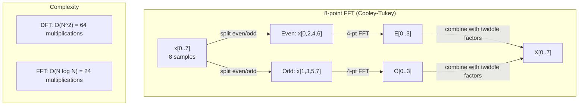
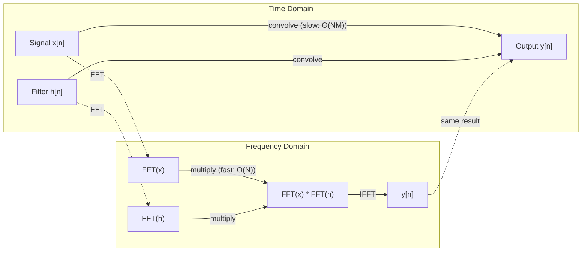

# 傅里叶变换

> 每个信号都是正弦波的叠加。傅里叶变换告诉你其中有哪些正弦波。

**类型：** 构建
**语言：** Python
**先修要求：** 第 1 阶段，第 01-04、19 课（复数）
**时间：** 约 90 分钟

## 学习目标

- 从零实现 DFT，并用 O(N log N) 的 Cooley-Tukey FFT 验证它
- 解释频率系数：从信号中提取 amplitude、phase 和 power spectrum
- 应用卷积定理，通过 FFT 乘法执行卷积
- 将傅里叶频率分解与 transformer 位置编码、CNN 卷积层联系起来

## 问题

一段音频录音是一串随时间变化的压力测量值。股票价格是一串按天记录的数值。图像是在空间上排列的像素强度网格。它们都是时域（或空间域）中的数据：你看到的是某个索引上的数值变化。

但许多模式在时域中是看不见的。这段音频是纯音还是和弦？这支股票是否有周周期？这张图像是否有重复纹理？这些问题关心的是频率内容，而时域会把它藏起来。

傅里叶变换把数据从时域转换到频域。它接收一个信号，并把它分解成不同频率的正弦波。每个正弦波都有 amplitude（强度）和 phase（起点）。傅里叶变换会同时告诉你这两者。

这对 ML 很重要，因为频域思维无处不在。卷积神经网络执行卷积，而卷积在频域中就是乘法。Transformer 位置编码使用频率分解来表示位置。音频模型（语音识别、音乐生成）处理 spectrogram，也就是声音的频率表示。时间序列模型寻找周期性模式。理解傅里叶变换，会给你处理这些问题的共同语言。

## 概念

### DFT 定义

给定 N 个样本 x[0], x[1], ..., x[N-1]，离散傅里叶变换会产生 N 个频率系数 X[0], X[1], ..., X[N-1]：

```
X[k] = sum_{n=0}^{N-1} x[n] * e^(-2*pi*i*k*n/N)

for k = 0, 1, ..., N-1
```

每个 X[k] 都是复数。它的大小 |X[k]| 表示频率 k 的 amplitude。它的相位 angle(X[k]) 表示该频率的 phase offset。

关键洞见：`e^(-2*pi*i*k*n/N)` 是频率为 k 的旋转 phasor。DFT 计算的是信号与 N 个等间隔频率之间的相关性。如果信号在频率 k 上有能量，相关性就大；如果没有，就接近 0。

### 每个系数表示什么

**X[0]：DC component。** 这是所有样本的总和，与均值成正比。它表示信号的常量（零频）偏移。

```
X[0] = sum_{n=0}^{N-1} x[n] * e^0 = sum of all samples
```

**1 <= k <= N/2 时的 X[k]：正频率。** X[k] 表示每 N 个样本中循环 k 次的频率。k 越大，频率越高（振荡越快）。

**X[N/2]：Nyquist frequency。** 这是 N 个样本能够表示的最高频率。超过它就会出现 aliasing，也就是高频伪装成低频。

**N/2 < k < N 时的 X[k]：负频率。** 对实值信号，X[N-k] = conj(X[k])。负频率是正频率的镜像。这就是为什么有用的信息位于前 N/2 + 1 个系数中。

### 逆 DFT

逆 DFT 从频率系数重建原始信号：

```
x[n] = (1/N) * sum_{k=0}^{N-1} X[k] * e^(2*pi*i*k*n/N)

for n = 0, 1, ..., N-1
```

它与正向 DFT 只有两个区别：指数里的符号是正号（不是负号），并且有一个 1/N 的归一化因子。

逆 DFT 是完美重建。没有信息丢失。你可以从时域到频域，再无误差地回到时域。DFT 是一次基变换，它是在另一个坐标系中重新表达同一份信息。

### FFT：让它变快

按上面的定义直接计算 DFT 是 O(N^2)：对 N 个输出系数中的每一个，都要对 N 个输入样本求和。N = 100 万时，就是 10^12 次运算。

快速傅里叶变换（FFT）用 O(N log N) 计算同样的结果。N = 100 万时，大约是 2000 万次运算，而不是一万亿次。这让频率分析真正可用。

Cooley-Tukey 算法（最常见的 FFT）使用分治法：

1. 把信号拆成偶数索引样本和奇数索引样本。
2. 递归计算两半的 DFT。
3. 用 "twiddle factors" e^(-2*pi*i*k/N) 合并两个半大小的 DFT。

```
X[k] = E[k] + e^(-2*pi*i*k/N) * O[k]          for k = 0, ..., N/2 - 1
X[k + N/2] = E[k] - e^(-2*pi*i*k/N) * O[k]    for k = 0, ..., N/2 - 1

where E = DFT of even-indexed samples
      O = DFT of odd-indexed samples
```

这种对称性意味着递归的每一层都做 O(N) 工作，而总共有 log2(N) 层。总计：O(N log N)。



FFT 要求信号长度是 2 的幂。实际中，信号通常会 zero-pad 到下一个 2 的幂。

### 频谱分析

**power spectrum** 是 |X[k]|^2，也就是每个频率系数大小的平方。它显示每个频率上有多少能量。

**phase spectrum** 是 angle(X[k])，也就是每个频率的 phase offset。对大多数分析任务，你关心 power spectrum，并忽略 phase。

```
Power at frequency k:  P[k] = |X[k]|^2 = X[k].real^2 + X[k].imag^2
Phase at frequency k:  phi[k] = atan2(X[k].imag, X[k].real)
```

### 频率分辨率

DFT 的频率分辨率取决于样本数 N 和采样率 fs。

```
Frequency of bin k:      f_k = k * fs / N
Frequency resolution:    delta_f = fs / N
Maximum frequency:       f_max = fs / 2  (Nyquist)
```

要分辨两个很接近的频率，你需要更多样本。要捕获高频，你需要更高的采样率。

### 卷积定理

这是信号处理中最重要的结果之一，也与 CNN 直接相关。

**时域中的卷积等于频域中的逐点乘法。**

```
x * h = IFFT(FFT(x) . FFT(h))

where * is convolution and . is element-wise multiplication
```

为什么这很重要：

- 长度为 N 和 M 的两个信号直接卷积需要 O(N*M) 次运算。
- 基于 FFT 的卷积需要 O(N log N)：二者都变换，乘起来，再变换回来。
- 对大 kernel，FFT 卷积会快很多。
- 这正是具有大 receptive field 的卷积层中发生的事。

注意：DFT 计算的是 circular convolution（信号会环绕）。若要做 linear convolution（不环绕），需要在计算前把两个信号 zero-pad 到长度 N + M - 1。



### Windowing

DFT 假设信号是周期性的，也就是把 N 个样本视为某个无限重复信号的一个周期。如果信号的起点和终点数值不同，边界处就会产生不连续，这会表现为虚假的高频内容。这叫 spectral leakage。

Windowing 会在计算 DFT 前，让信号两端逐渐衰减到 0，从而减少 leakage。

常见 window：

| Window | Shape | Main lobe width | Side lobe level | Use case |
|--------|-------|----------------|-----------------|----------|
| Rectangular | Flat (no window) | Narrowest | Highest (-13 dB) | When signal is exactly periodic in N samples |
| Hann | Raised cosine | Moderate | Low (-31 dB) | General purpose spectral analysis |
| Hamming | Modified cosine | Moderate | Lower (-42 dB) | Audio processing, speech analysis |
| Blackman | Triple cosine | Wide | Very low (-58 dB) | When side lobe suppression is critical |

```
Hann window:    w[n] = 0.5 * (1 - cos(2*pi*n / (N-1)))
Hamming window: w[n] = 0.54 - 0.46 * cos(2*pi*n / (N-1))
```

在 DFT 前，把 window 与信号逐元素相乘：`X = DFT(x * w)`。

### DFT 性质

| Property | Time Domain | Frequency Domain |
|----------|-------------|-----------------|
| Linearity | a*x + b*y | a*X + b*Y |
| Time shift | x[n - k] | X[f] * e^(-2*pi*i*f*k/N) |
| Frequency shift | x[n] * e^(2*pi*i*f0*n/N) | X[f - f0] |
| Convolution | x * h | X * H (pointwise) |
| Multiplication | x * h (pointwise) | X * H (circular convolution, scaled by 1/N) |
| Parseval's theorem | sum \|x[n]\|^2 | (1/N) * sum \|X[k]\|^2 |
| Conjugate symmetry (real input) | x[n] real | X[k] = conj(X[N-k]) |

Parseval 定理说，两个域中的总能量相同。能量在变换过程中守恒。

### 与位置编码的联系

原始 Transformer 使用正弦位置编码：

```
PE(pos, 2i)   = sin(pos / 10000^(2i/d_model))
PE(pos, 2i+1) = cos(pos / 10000^(2i/d_model))
```

每一对维度 (2i, 2i+1) 都以不同频率振荡。频率从高（维度 0、1）到低（最后的维度）按几何间隔排列。这让每个位置在所有频带上都有唯一模式，类似傅里叶系数如何唯一标识一个信号。

它提供的关键性质：

- **唯一性：** 没有两个位置有相同编码。
- **有界值：** sin 和 cos 始终在 [-1, 1] 内。
- **相对位置：** 位置 p+k 的编码可以表示为位置 p 编码的线性函数。模型可以学会关注相对位置。

### 与 CNN 的联系

卷积层把一个学到的 filter（kernel）滑过信号或图像并应用到输入上。数学上，这就是卷积操作。

根据卷积定理，这等价于：
1. 对输入做 FFT
2. 对 kernel 做 FFT
3. 在频域中相乘
4. 对结果做 IFFT

标准 CNN 实现使用直接卷积（对小的 3x3 kernel 更快）。但对大 kernel 或 global convolution，基于 FFT 的方法明显更快。一些架构（如 FNet）完全用 FFT 替代 attention，用 O(N log N) 而不是 O(N^2) 的复杂度达到有竞争力的准确率。

### Spectrogram 与短时傅里叶变换

单次 FFT 会告诉你整个信号的频率内容，但不会告诉你这些频率什么时候出现。一个 chirp（频率随时间上升的信号）和一个 chord（所有频率同时存在）可能有相同的 magnitude spectrum。

短时傅里叶变换（STFT）通过在信号的重叠窗口上计算 FFT 来解决这个问题。结果是 spectrogram：一个二维表示，一条轴是时间，另一条轴是频率。每个点的强度显示该时刻该频率上的能量。

```
STFT procedure:
1. Choose a window size (e.g., 1024 samples)
2. Choose a hop size (e.g., 256 samples -- 75% overlap)
3. For each window position:
   a. Extract the windowed segment
   b. Apply a Hann/Hamming window
   c. Compute FFT
   d. Store the magnitude spectrum as one column of the spectrogram
```

Spectrogram 是音频 ML 模型的标准输入表示。语音识别模型（Whisper、DeepSpeech）处理 mel-spectrogram，也就是把频率映射到 mel scale 的 spectrogram，它更符合人类对音高的感知。

### Aliasing

如果信号包含高于 fs/2（Nyquist frequency）的频率，以 fs 采样就会产生混叠副本。一个 90 Hz 信号用 100 Hz 采样，看起来会与 10 Hz 信号完全相同。仅凭样本无法区分它们。

```
Example:
  True signal: 90 Hz sine wave
  Sampling rate: 100 Hz
  Apparent frequency: 100 - 90 = 10 Hz

  The samples from the 90 Hz signal at 100 Hz sampling rate
  are identical to the samples from a 10 Hz signal.
  No amount of math can recover the original 90 Hz.
```

这就是为什么模数转换器会包含 anti-aliasing filter，在采样前移除 Nyquist 以上的频率。在 ML 中，当没有合适的低通滤波就下采样 feature map 时，也会出现 aliasing；一些架构用 anti-aliased pooling layer 处理这个问题。

### Zero-padding 不会提高分辨率

一个常见误解是：在 FFT 前对信号 zero-padding 可以提升频率分辨率。它不会。Zero-padding 只是在已有 frequency bin 之间插值，让频谱看起来更平滑。但它不能揭示原始样本中不存在的频率细节。

真正的频率分辨率只取决于观察时间 T = N / fs。要分辨相差 delta_f 的两个频率，你至少需要 T = 1 / delta_f 秒的数据。再多 zero-padding 也无法改变这个基本限制。

## 动手构建

### 第 1 步：从零实现 DFT

O(N^2) 的 DFT 直接来自定义。

```python
import math

class Complex:
    ...

def dft(x):
    N = len(x)
    result = []
    for k in range(N):
        total = Complex(0, 0)
        for n in range(N):
            angle = -2 * math.pi * k * n / N
            w = Complex(math.cos(angle), math.sin(angle))
            xn = x[n] if isinstance(x[n], Complex) else Complex(x[n])
            total = total + xn * w
        result.append(total)
    return result
```

### 第 2 步：逆 DFT

结构相同，指数为正，并除以 N。

```python
def idft(X):
    N = len(X)
    result = []
    for n in range(N):
        total = Complex(0, 0)
        for k in range(N):
            angle = 2 * math.pi * k * n / N
            w = Complex(math.cos(angle), math.sin(angle))
            total = total + X[k] * w
        result.append(Complex(total.real / N, total.imag / N))
    return result
```

### 第 3 步：FFT（Cooley-Tukey）

递归 FFT 要求长度是 2 的幂。拆成偶数项和奇数项，递归，然后用 twiddle factors 合并。

```python
def fft(x):
    N = len(x)
    if N <= 1:
        return [x[0] if isinstance(x[0], Complex) else Complex(x[0])]
    if N % 2 != 0:
        return dft(x)

    even = fft([x[i] for i in range(0, N, 2)])
    odd = fft([x[i] for i in range(1, N, 2)])

    result = [Complex(0)] * N
    for k in range(N // 2):
        angle = -2 * math.pi * k / N
        twiddle = Complex(math.cos(angle), math.sin(angle))
        t = twiddle * odd[k]
        result[k] = even[k] + t
        result[k + N // 2] = even[k] - t
    return result
```

### 第 4 步：频谱分析辅助函数

```python
def power_spectrum(X):
    return [xk.real ** 2 + xk.imag ** 2 for xk in X]

def convolve_fft(x, h):
    N = len(x) + len(h) - 1
    padded_N = 1
    while padded_N < N:
        padded_N *= 2

    x_padded = x + [0.0] * (padded_N - len(x))
    h_padded = h + [0.0] * (padded_N - len(h))

    X = fft(x_padded)
    H = fft(h_padded)

    Y = [xk * hk for xk, hk in zip(X, H)]

    y = idft(Y)
    return [y[n].real for n in range(N)]
```

## 使用它

实际工作中，使用 numpy 的 FFT，它背后是高度优化的 C 库。

```python
import numpy as np

signal = np.sin(2 * np.pi * 5 * np.arange(256) / 256)
spectrum = np.fft.fft(signal)
freqs = np.fft.fftfreq(256, d=1/256)

power = np.abs(spectrum) ** 2

positive_freqs = freqs[:len(freqs)//2]
positive_power = power[:len(power)//2]
```

用于 windowing 和更高级的频谱分析：

```python
from scipy.signal import windows, stft

window = windows.hann(256)
windowed = signal * window
spectrum = np.fft.fft(windowed)
```

用于卷积：

```python
from scipy.signal import fftconvolve

result = fftconvolve(signal, kernel, mode='full')
```

用于 spectrogram：

```python
from scipy.signal import stft

frequencies, times, Zxx = stft(signal, fs=sample_rate, nperseg=256)
spectrogram = np.abs(Zxx) ** 2
```

Spectrogram 矩阵的形状是 (n_frequencies, n_time_frames)。每一列是一个时间窗口上的 power spectrum。这就是音频 ML 模型作为输入消费的内容。

## 交付它

运行 `code/fourier.py` 生成 `outputs/prompt-spectral-analyzer.md`。

## 练习

1. **纯音识别。** 创建一个包含单个未知频率正弦波的信号（1 到 50 Hz 之间），以 128 Hz 采样 1 秒。用你的 DFT 识别频率。验证答案是否匹配。现在加入标准差为 0.5 的 Gaussian noise 并重复。噪声如何影响频谱？

2. **FFT 与 DFT 验证。** 生成长度为 64 的随机信号。同时计算 DFT（O(N^2)）和 FFT。验证所有系数都在 1e-10 以内匹配。对长度为 256、512、1024、2048 的信号分别计时。绘制 DFT 时间与 FFT 时间的比值。

3. **用例子证明卷积定理。** 创建信号 x = [1, 2, 3, 4, 0, 0, 0, 0] 和 filter h = [1, 1, 1, 0, 0, 0, 0, 0]。直接计算它们的 circular convolution（嵌套循环）。然后通过 FFT 计算（变换、相乘、逆变换）。验证结果匹配。现在通过合适的 zero-padding 做 linear convolution。

4. **Windowing 效果。** 创建一个由 10 Hz 和 12 Hz（非常接近）两个正弦波相加的信号。以 128 Hz 采样 1 秒。分别用无 window、Hann window、Hamming window 计算 power spectrum。哪个 window 最容易区分两个峰？为什么？

5. **位置编码分析。** 为 d_model = 128 和 max_pos = 512 生成正弦位置编码。对每一对位置 (p1, p2)，计算它们编码的 dot product。证明 dot product 只依赖 |p1 - p2|，而不依赖绝对位置。随着距离增加，dot product 会怎样？

## 关键术语

| 术语 | 含义 |
|------|------|
| DFT (Discrete Fourier Transform) | 把 N 个时域样本转换成 N 个频域系数。每个系数都是与该频率复正弦波的相关性 |
| FFT (Fast Fourier Transform) | 计算 DFT 的 O(N log N) 算法。Cooley-Tukey 算法递归拆分偶数/奇数索引 |
| Inverse DFT | 从频率系数重建时域信号。公式与 DFT 相同，但指数符号相反并带 1/N 缩放 |
| Frequency bin | DFT 输出中的每个索引 k 表示频率 k*fs/N Hz。"bin" 是离散频率槽 |
| DC component | X[0]，零频系数。与信号均值成正比 |
| Nyquist frequency | fs/2，在采样率 fs 下可表示的最高频率。高于它的频率会 alias |
| Power spectrum | \|X[k]\|^2，每个频率系数大小的平方。显示频率上的能量分布 |
| Phase spectrum | angle(X[k])，每个频率分量的 phase offset。分析中常被忽略 |
| Spectral leakage | 把非周期信号当成周期信号处理而造成的虚假频率内容。可通过 windowing 减少 |
| Window function | DFT 前应用的渐缩函数（Hann、Hamming、Blackman），用于减少 spectral leakage |
| Twiddle factor | FFT butterfly 计算中用于合并子 DFT 的复指数 e^(-2*pi*i*k/N) |
| Convolution theorem | 时域卷积等于频域逐点乘法。它是信号处理和 CNN 的基础 |
| Circular convolution | 信号会环绕的卷积。这是 DFT 自然计算的形式 |
| Linear convolution | 不环绕的标准卷积。通过 DFT 前 zero-padding 实现 |
| Parseval's theorem | 总能量在傅里叶变换中保持不变。sum \|x[n]\|^2 = (1/N) sum \|X[k]\|^2 |
| Aliasing | 当频率高于 Nyquist 时，由于采样率不足而表现为较低频率 |

## 延伸阅读

- [Cooley & Tukey: An Algorithm for the Machine Calculation of Complex Fourier Series (1965)](https://www.ams.org/journals/mcom/1965-19-090/S0025-5718-1965-0178586-1/) - 改变计算史的原始 FFT 论文
- [3Blue1Brown: But what is the Fourier Transform?](https://www.youtube.com/watch?v=spUNpyF58BY) - 对傅里叶变换最好的可视化入门
- [Lee-Thorp et al.: FNet: Mixing Tokens with Fourier Transforms (2021)](https://arxiv.org/abs/2105.03824) - 在 transformer 中用 FFT 替代 self-attention
- [Smith: The Scientist and Engineer's Guide to Digital Signal Processing](http://www.dspguide.com/) - 免费在线教材，深入讲解 FFT、windowing 和频谱分析
- [Vaswani et al.: Attention Is All You Need (2017)](https://arxiv.org/abs/1706.03762) - 源自傅里叶频率分解的正弦位置编码
- [Radford et al.: Whisper (2022)](https://arxiv.org/abs/2212.04356) - 使用 mel-spectrogram 作为输入表示的语音识别
