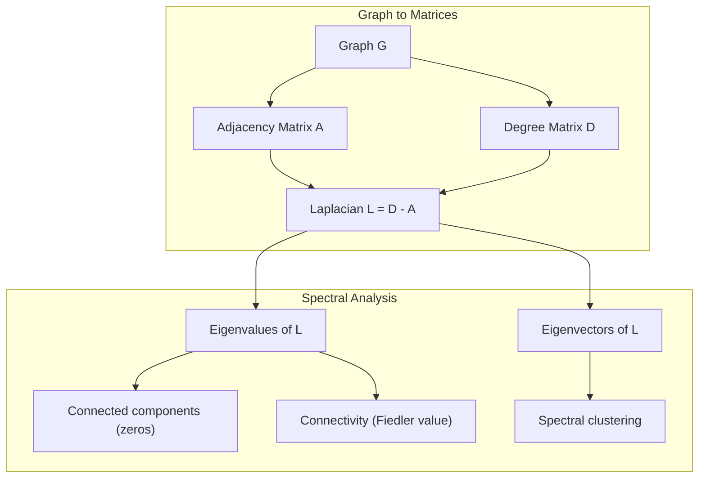
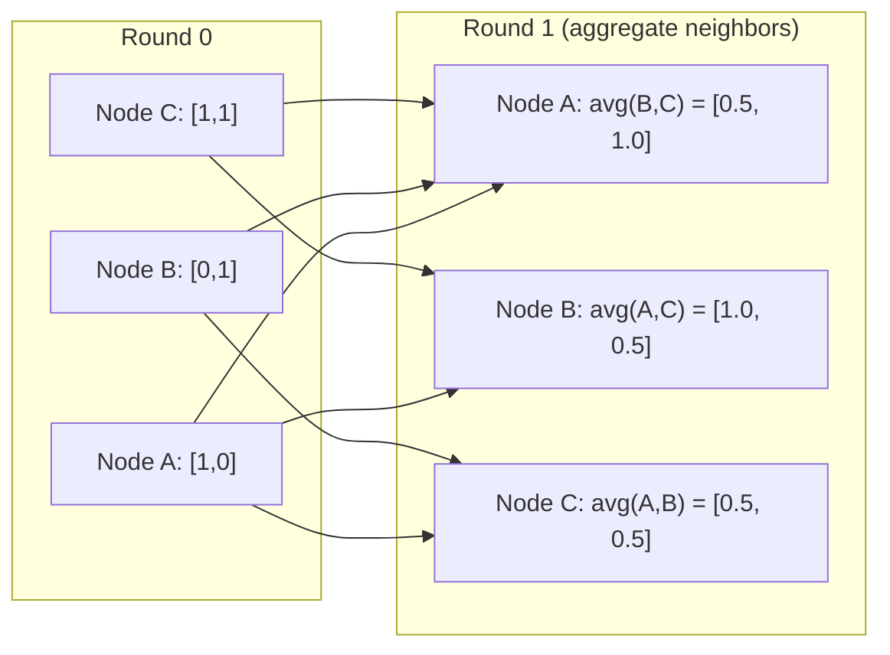

# 面向机器学习的图论

> 图是关系的数据结构。如果你的数据里有连接，你就需要图论。

**类型：** 构建
**语言：** Python
**先修要求：** 第 1 阶段，第 01-03 课（线性代数、矩阵）
**时间：** 约 90 分钟

## 学习目标

- 构建一个 graph class，支持 adjacency matrix/list 表示，并实现 BFS 和 DFS 遍历
- 计算 graph Laplacian，并用它的特征值检测 connected components 和聚类节点
- 将一轮 GNN 风格的 message passing 实现为 normalized adjacency matrix multiplication
- 使用 Fiedler vector 应用 spectral clustering 来划分图

## 问题

社交网络、分子、知识库、引用网络、道路地图，都是图。传统 ML 把数据当作扁平表格。每一行彼此独立。每个 feature 是一列。但当连接结构重要时，表格就不够用了。

想象一个社交网络。你想预测某个用户会买什么产品。这个用户自己的购买历史很重要。但朋友的购买历史可能更重要。连接本身携带信号。

或者想象一个分子。你想预测它是否会与某个蛋白结合。原子很重要，但真正重要的是原子如何彼此成键。结构就是数据。

图神经网络（GNN）是深度学习中增长最快的领域之一。它支撑药物发现、社交推荐、欺诈检测和知识图谱推理。每个 GNN 都建立在同一个基础上：基础图论。

你需要四件事：
1. 一种把图表示成矩阵的方法（这样你才能做矩阵乘法）
2. 用来探索图结构的遍历算法
3. Laplacian：spectral graph theory 中最重要的矩阵
4. Message passing：让 GNN 工作的操作

## 概念

### 图：节点和边

一个图 G = (V, E) 由 vertices（nodes）V 和 edges E 构成。每条边连接两个节点。

**有向与无向。** 在无向图中，边 (u, v) 表示 u 连接到 v，并且 v 也连接到 u。在有向图（digraph）中，边 (u, v) 表示 u 指向 v，但反向不一定存在。

**加权与无权。** 在无权图中，边要么存在，要么不存在。在加权图中，每条边都有一个数值权重，比如距离、成本或强度。

| Graph type | Example |
|-----------|---------|
| Undirected, unweighted | Facebook friendship network |
| Directed, unweighted | Twitter follow network |
| Undirected, weighted | Road map (distances) |
| Directed, weighted | Web page links (PageRank scores) |

### 邻接矩阵

邻接矩阵 A 是核心表示。对于一个有 n 个节点的图：

```
A[i][j] = 1    if there is an edge from node i to node j
A[i][j] = 0    otherwise
```

对于无向图，A 是对称的：A[i][j] = A[j][i]。对于加权图，A[i][j] = 边 (i, j) 的权重。

**例子：一个三角形：**

```
Nodes: 0, 1, 2
Edges: (0,1), (1,2), (0,2)

A = [[0, 1, 1],
     [1, 0, 1],
     [1, 1, 0]]
```

邻接矩阵是每个 GNN 的输入。对 A 的矩阵操作，对应图上的操作。

### 度

节点的 degree 是与它相连的边数。对于有向图，你有 in-degree（进入的边）和 out-degree（出去的边）。

Degree matrix D 是对角矩阵：

```
D[i][i] = degree of node i
D[i][j] = 0    for i != j
```

对三角形例子：D = diag(2, 2, 2)，因为每个节点都连接到另外两个节点。

Degree 告诉你节点的重要性。高 degree = hub node。网络的 degree distribution 会揭示它的结构。社交网络遵循 power law（少数 hub，许多 leaf node）。随机图的 degree 服从 Poisson 分布。

### BFS 和 DFS

这是两个基础图遍历算法。两者你都需要。

**广度优先搜索（BFS）：** 先探索所有邻居，再探索邻居的邻居。使用 queue（FIFO）。

```
BFS from node 0:
  Visit 0
  Queue: [1, 2]        (neighbors of 0)
  Visit 1
  Queue: [2, 3]        (add neighbors of 1)
  Visit 2
  Queue: [3]           (neighbors of 2 already visited)
  Visit 3
  Queue: []            (done)
```

BFS 可以在无权图中找到最短路径。从起点到任意节点的距离，等于该节点第一次被发现时所在的 BFS 层级。这就是为什么 BFS 会用于社交网络中的 hop-count distance。

**深度优先搜索（DFS）：** 在回溯前尽可能深入。使用 stack（LIFO）或递归。

```
DFS from node 0:
  Visit 0
  Stack: [1, 2]        (neighbors of 0)
  Visit 2               (pop from stack)
  Stack: [1, 3]         (add neighbors of 2)
  Visit 3               (pop from stack)
  Stack: [1]
  Visit 1               (pop from stack)
  Stack: []             (done)
```

DFS 适用于：
- 查找 connected components（从未访问节点运行 DFS）
- 检测 cycle（DFS tree 中的 back edge）
- Topological sorting（反向 DFS finish order）

| Algorithm | Data structure | Finds | Use case |
|-----------|---------------|-------|----------|
| BFS | Queue | Shortest paths | Social network distance, knowledge graph traversal |
| DFS | Stack | Components, cycles | Connectivity, topological sort |

### Graph Laplacian

L = D - A。它是 spectral graph theory 中最重要的矩阵。

对于三角形：

```
D = [[2, 0, 0],    A = [[0, 1, 1],    L = [[2, -1, -1],
     [0, 2, 0],         [1, 0, 1],         [-1, 2, -1],
     [0, 0, 2]]         [1, 1, 0]]         [-1, -1,  2]]
```

Laplacian 有一些很特别的性质：

1. **L 是 positive semi-definite。** 所有特征值都 >= 0。

2. **零特征值的数量等于 connected components 的数量。** 连通图恰好有一个零特征值。有 3 个断开的 component 的图有 3 个零特征值。

3. **最小的非零特征值（Fiedler value）衡量连通性。** Fiedler value 大，说明图连接良好。Fiedler value 小，说明图有薄弱点，也就是 bottleneck。

4. **Fiedler value 对应的 eigenvector（Fiedler vector）揭示最佳切分。** 值为正的节点进入一组，值为负的节点进入另一组。这就是 spectral clustering。



### 谱性质

邻接矩阵和 Laplacian 的特征值可以在不做遍历的情况下揭示结构性质。

**Spectral clustering** 的工作方式如下：
1. 计算 Laplacian L
2. 找到 L 的 k 个最小 eigenvector（跳过第一个；对连通图它是全 1 向量）
3. 把这些 eigenvector 用作每个节点的新坐标
4. 在这些坐标上运行 k-means

为什么这有效？L 的 eigenvector 编码了图上“最平滑”的函数。连接紧密的节点会得到相似的 eigenvector 值。被 bottleneck 分开的节点会得到不同的值。Eigenvector 会自然分离 cluster。

**随机游走联系。** Normalized Laplacian 与图上的 random walk 有关。随机游走的 stationary distribution 与节点 degree 成正比。Mixing time（游走收敛有多快）取决于 spectral gap。

### Message Passing

这是图神经网络的核心操作。每个节点从邻居收集 message，聚合它们，并更新自己的状态。

```
h_v^(k+1) = UPDATE(h_v^(k), AGGREGATE({h_u^(k) : u in neighbors(v)}))
```

最简单的形式中，AGGREGATE = mean，UPDATE = linear transform + activation：

```
h_v^(k+1) = sigma(W * mean({h_u^(k) : u in neighbors(v)}))
```

这其实是伪装成图操作的矩阵乘法。如果 H 是所有节点 feature 的矩阵，A 是邻接矩阵：

```
H^(k+1) = sigma(A_norm * H^(k) * W)
```

其中 A_norm 是 normalized adjacency matrix（每一行和为 1）。

一轮 message passing 让每个节点“看见”它的直接邻居。两轮让它看见邻居的邻居。K 轮让每个节点获得 K-hop neighborhood 的信息。



### 概念与 ML 应用

| Concept | ML Application |
|---------|---------------|
| Adjacency matrix | GNN input representation |
| Graph Laplacian | Spectral clustering, community detection |
| BFS/DFS | Knowledge graph traversal, path finding |
| Degree distribution | Node importance, feature engineering |
| Message passing | GNN layers (GCN, GAT, GraphSAGE) |
| Eigenvalues of L | Community detection, graph partitioning |
| Spectral clustering | Unsupervised node grouping |
| PageRank | Node importance, web search |

## 动手构建

### 第 1 步：从零实现 Graph class

```python
class Graph:
    def __init__(self, n_nodes, directed=False):
        self.n = n_nodes
        self.directed = directed
        self.adj = {i: {} for i in range(n_nodes)}

    def add_edge(self, u, v, weight=1.0):
        self.adj[u][v] = weight
        if not self.directed:
            self.adj[v][u] = weight

    def neighbors(self, node):
        return list(self.adj[node].keys())

    def degree(self, node):
        return len(self.adj[node])

    def adjacency_matrix(self):
        import numpy as np
        A = np.zeros((self.n, self.n))
        for u in range(self.n):
            for v, w in self.adj[u].items():
                A[u][v] = w
        return A

    def degree_matrix(self):
        import numpy as np
        D = np.zeros((self.n, self.n))
        for i in range(self.n):
            D[i][i] = self.degree(i)
        return D

    def laplacian(self):
        return self.degree_matrix() - self.adjacency_matrix()
```

邻接表（`self.adj`）可以高效存储邻居。转换为邻接矩阵时使用 numpy，因为所有谱操作都需要它。

### 第 2 步：BFS 和 DFS

```python
from collections import deque

def bfs(graph, start):
    visited = set()
    order = []
    distances = {}
    queue = deque([(start, 0)])
    visited.add(start)
    while queue:
        node, dist = queue.popleft()
        order.append(node)
        distances[node] = dist
        for neighbor in graph.neighbors(node):
            if neighbor not in visited:
                visited.add(neighbor)
                queue.append((neighbor, dist + 1))
    return order, distances


def dfs(graph, start):
    visited = set()
    order = []
    stack = [start]
    while stack:
        node = stack.pop()
        if node in visited:
            continue
        visited.add(node)
        order.append(node)
        for neighbor in reversed(graph.neighbors(node)):
            if neighbor not in visited:
                stack.append(neighbor)
    return order
```

BFS 使用 deque（双端队列），以 O(1) 执行 popleft。DFS 使用 list 作为 stack。二者都会恰好访问每个节点一次，时间复杂度 O(V + E)。

### 第 3 步：Connected components 和 Laplacian eigenvalues

```python
def connected_components(graph):
    visited = set()
    components = []
    for node in range(graph.n):
        if node not in visited:
            order, _ = bfs(graph, node)
            visited.update(order)
            components.append(order)
    return components


def laplacian_eigenvalues(graph):
    import numpy as np
    L = graph.laplacian()
    eigenvalues = np.linalg.eigvalsh(L)
    return eigenvalues
```

`eigvalsh` 用于对称矩阵；无向图的 Laplacian 总是对称的。它按升序返回特征值。数一数零特征值，就能找到 connected components 的数量。

### 第 4 步：Spectral clustering

```python
def spectral_clustering(graph, k=2):
    import numpy as np
    L = graph.laplacian()
    eigenvalues, eigenvectors = np.linalg.eigh(L)
    features = eigenvectors[:, 1:k+1]

    labels = np.zeros(graph.n, dtype=int)
    for i in range(graph.n):
        if features[i, 0] >= 0:
            labels[i] = 0
        else:
            labels[i] = 1
    return labels
```

当 k=2 时，Fiedler vector 的符号会把图分成两个 cluster。当 k>2 时，你会在前 k 个 eigenvector（排除平凡的全 1 eigenvector）上运行 k-means。

### 第 5 步：Message passing

```python
def message_passing(graph, features, weight_matrix):
    import numpy as np
    A = graph.adjacency_matrix()
    row_sums = A.sum(axis=1, keepdims=True)
    row_sums[row_sums == 0] = 1
    A_norm = A / row_sums
    aggregated = A_norm @ features
    output = aggregated @ weight_matrix
    return output
```

这是一轮 GNN message passing。每个节点的新 feature 是其邻居 feature 的加权平均，再经过 weight matrix 变换。堆叠多轮可以把信息传播得更远。

## 使用它

使用 networkx 和 numpy 时，相同操作通常是一行：

```python
import networkx as nx
import numpy as np

G = nx.karate_club_graph()

A = nx.adjacency_matrix(G).toarray()
L = nx.laplacian_matrix(G).toarray()

eigenvalues = np.linalg.eigvalsh(L.astype(float))
print(f"Smallest eigenvalues: {eigenvalues[:5]}")
print(f"Connected components: {nx.number_connected_components(G)}")

communities = nx.community.greedy_modularity_communities(G)
print(f"Communities found: {len(communities)}")

pr = nx.pagerank(G)
top_nodes = sorted(pr.items(), key=lambda x: x[1], reverse=True)[:5]
print(f"Top 5 PageRank nodes: {top_nodes}")
```

networkx 可以通过优化的 C 后端处理各种规模的图。生产中用它。你从零实现的版本用于理解它在做什么。

### numpy 谱分析

```python
import numpy as np

A = np.array([
    [0, 1, 1, 0, 0],
    [1, 0, 1, 0, 0],
    [1, 1, 0, 1, 0],
    [0, 0, 1, 0, 1],
    [0, 0, 0, 1, 0]
])

D = np.diag(A.sum(axis=1))
L = D - A

eigenvalues, eigenvectors = np.linalg.eigh(L)
print(f"Eigenvalues: {np.round(eigenvalues, 4)}")
print(f"Fiedler value: {eigenvalues[1]:.4f}")
print(f"Fiedler vector: {np.round(eigenvectors[:, 1], 4)}")

fiedler = eigenvectors[:, 1]
group_a = np.where(fiedler >= 0)[0]
group_b = np.where(fiedler < 0)[0]
print(f"Cluster A: {group_a}")
print(f"Cluster B: {group_b}")
```

Fiedler vector 承担了主要工作。正值属于一个 cluster，负值属于另一个。不需要迭代优化，只需要一次 eigendecomposition。

## 交付它

本课会产出：
- `outputs/skill-graph-analysis.md` -- 一份用于分析图结构数据的技能参考

## 关联

| Concept | Where it shows up |
|---------|------------------|
| Adjacency matrix | GCN, GAT, GraphSAGE input |
| Laplacian | Spectral clustering, ChebNet filters |
| BFS | Knowledge graph traversal, shortest path queries |
| Message passing | Every GNN layer, neural message passing |
| Spectral gap | Graph connectivity, mixing time of random walks |
| Degree distribution | Power-law networks, node feature engineering |
| Connected components | Preprocessing, handling disconnected graphs |
| PageRank | Node importance ranking, attention initialization |

GNN 值得特别说明。GCN（Kipf & Welling, 2017）中的 graph convolution 操作使用添加 self-loop 的邻接矩阵，A_hat = A + I：

```text
H^(l+1) = sigma(D_hat^(-1/2) * A_hat * D_hat^(-1/2) * H^(l) * W^(l))
```

其中 A_hat = A + I（邻接矩阵加 self-loop），D_hat 是 A_hat 的 degree matrix。Self-loop 确保每个节点在聚合时包含自己的 feature。这正是带对称归一化的 message passing。D_hat^(-1/2) * A_hat * D_hat^(-1/2) 是 normalized adjacency matrix。Laplacian 会出现，是因为这个归一化与 L_sym = I - D^(-1/2) * A * D^(-1/2) 有关。理解 Laplacian 就是在理解 GCN 为什么有效。

## 练习

1. **从零实现 PageRank。** 从 uniform scores 开始。每一步：score(v) = (1-d)/n + d * sum(score(u)/out_degree(u))，对所有指向 v 的 u 求和。使用 d=0.85。运行到收敛（变化 < 1e-6）。在一个小 web graph 上测试。

2. **使用 spectral clustering 寻找 community。** 创建一个有两个明显分离 cluster 的图（例如两个 clique 由一条边连接）。运行 spectral clustering 并验证它找到正确切分。随着你添加更多跨 cluster 的边，会发生什么？

3. **实现 Dijkstra 算法**，用于加权图中的最短路径。在同一个 uniform weights 图上与 BFS 结果比较。

4. **构建一个 2 层 message passing network。** 用不同 weight matrix 应用两次 message passing。展示两轮后，每个节点都拥有来自其 2-hop neighborhood 的信息。

5. **分析真实世界图。** 使用 Karate Club 图（34 个节点，78 条边）。计算 degree distribution、Laplacian eigenvalues 和 spectral clustering。将 spectral clustering 结果与已知 ground truth split 比较。

## 关键术语

| 术语 | 常见说法 | 实际含义 |
|------|----------|----------|
| Graph | "Nodes and edges" | 编码成对关系的数学结构 G=(V,E) |
| Adjacency matrix | "The connection table" | 一个 n x n 矩阵，若节点 i 和 j 连接，则 A[i][j] = 1 |
| Degree | "How connected a node is" | 接触某个节点的边数 |
| Laplacian | "D minus A" | L = D - A，其特征值揭示图结构 |
| Fiedler value | "The algebraic connectivity" | L 的最小非零特征值，衡量图连接得多好 |
| BFS | "Level-by-level search" | 先访问所有邻居再深入的遍历，可找到最短路径 |
| DFS | "Go deep first" | 沿一条路径走到底再回溯的遍历 |
| Message passing | "Nodes talk to neighbors" | 每个节点从邻居聚合信息，是 GNN 的核心 |
| Spectral clustering | "Cluster by eigenvectors" | 使用 Laplacian 的 eigenvector 来划分图 |
| Connected component | "A separate piece" | 最大子图，其中每个节点都能到达其它每个节点 |

## 延伸阅读

- **Kipf & Welling (2017)** -- "Semi-Supervised Classification with Graph Convolutional Networks." 开创现代 GNN 的论文。展示 spectral graph convolution 如何简化为 message passing。
- **Spielman (2012)** -- "Spectral Graph Theory" lecture notes. 关于 Laplacian、spectral gap 和 graph partitioning 的权威入门。
- **Hamilton (2020)** -- "Graph Representation Learning." 从基础到应用覆盖 GNN 的书。
- **Bronstein et al. (2021)** -- "Geometric Deep Learning: Grids, Groups, Graphs, Geodesics, and Gauges." 统一框架论文。
- **Veličković et al. (2018)** -- "Graph Attention Networks." 用 attention mechanism 扩展 message passing。
