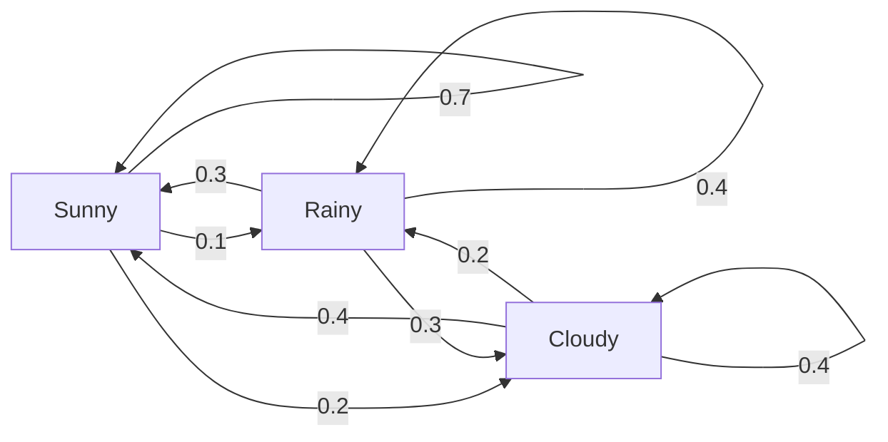
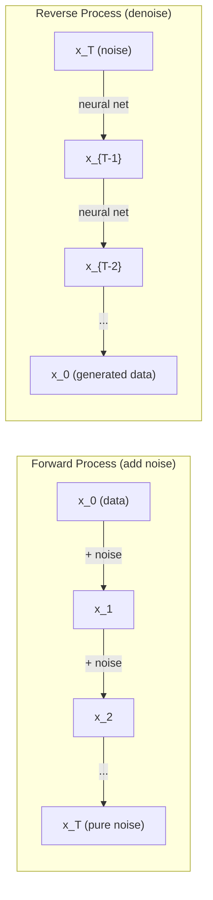

# 随机过程

> 有结构的随机性。随机游走、Markov chain 和 diffusion model 背后的数学。

**类型：** 学习
**语言：** Python
**先修要求：** 第 1 阶段，第 06-07 课（概率、贝叶斯）
**时间：** 约 75 分钟

## 学习目标

- 模拟 1D 和 2D random walk，并验证位移的 sqrt(n) 缩放
- 构建 Markov chain simulator，并通过 eigendecomposition 计算 stationary distribution
- 实现 Metropolis-Hastings MCMC 和 Langevin dynamics，用于从 target distribution 采样
- 将 forward diffusion process 与 Brownian motion 联系起来，并解释 reverse process 如何生成数据

## 问题

许多 AI 系统都包含随时间演化的随机性。不是静态随机性，而是有结构的、序列化的随机性，其中每一步都依赖前面发生的事情。

语言模型一次生成一个 token。每个 token 依赖之前的上下文。模型输出一个概率分布，从中采样，然后继续。这就是随机过程。

Diffusion model 会一步步向图像加入噪声，直到它变成纯噪声。然后它反转这个过程，一步步去噪，直到生成一张新图像。Forward process 是一个 Markov chain。Reverse process 是一个向后运行的、学到的 Markov chain。

强化学习 agent 在环境中采取 action。每个 action 都以某个概率通向一个新 state。Agent 在随机世界中遵循随机 policy。整个系统是一个 Markov decision process。

MCMC sampling 是贝叶斯推断的支柱，它构建一个 Markov chain，其 stationary distribution 就是你想采样的 posterior。

所有这些都建立在四个基础思想上：
1. Random walk：最简单的随机过程
2. Markov chain：带 transition matrix 的结构化随机性
3. Langevin dynamics：带噪声的 gradient descent
4. Metropolis-Hastings：从任意分布采样

## 概念

### Random Walks

从位置 0 开始。每一步抛一枚公平硬币。正面：向右移动（+1）。反面：向左移动（-1）。

n 步之后，你的位置是 n 个随机 +/-1 值的总和。期望位置是 0（walk 是 unbiased）。但距离原点的期望距离会按 sqrt(n) 增长。

这有些反直觉。这个 walk 是公平的，任何方向都没有 drift。但随着时间推移，它会离起点越来越远。n 步后的标准差是 sqrt(n)。

```
Step 0:  Position = 0
Step 1:  Position = +1 or -1
Step 2:  Position = +2, 0, or -2
...
Step 100: Expected distance from origin ~ 10 (sqrt(100))
Step 10000: Expected distance from origin ~ 100 (sqrt(10000))
```

**在 2D 中**，walk 会以相同概率向上、下、左、右移动。距离原点同样遵循 sqrt(n) 缩放。路径会画出类似 fractal 的模式。

**为什么是 sqrt(n)？** 每一步都是等概率的 +1 或 -1。n 步后，位置 S_n = X_1 + X_2 + ... + X_n，其中每个 X_i 都是 +/-1。每步的方差是 1，并且各步独立，所以 Var(S_n) = n。标准差 = sqrt(n)。根据中心极限定理，S_n / sqrt(n) 会收敛到 standard normal distribution。

这种 sqrt(n) 缩放在 ML 中到处出现。SGD noise 按 1/sqrt(batch_size) 缩放。Embedding 维度按 sqrt(d) 缩放。平方根是独立随机相加的标志。

**与 Brownian motion 的联系。** 取一个步长为 1/sqrt(n)、每单位时间走 n 步的 random walk。当 n 趋于无穷时，这个 walk 收敛到 Brownian motion B(t)，也就是连续时间过程，其中 B(t) 服从均值为 0、方差为 t 的 normal distribution。

Brownian motion 是 diffusion 的数学基础。它建模流体中粒子的随机抖动、股票价格波动，以及关键的 diffusion model 中的噪声过程。

**Gambler's ruin。** 一个 random walker 从位置 k 开始，在 0 和 N 处有 absorbing barriers。它先到达 N 而不是 0 的概率是多少？对公平 walk：P(reach N) = k/N。这个结果出奇简单优雅。它连接到 martingale 理论；公平 random walk 是一个 martingale（未来期望值 = 当前值）。

### Markov Chains

Markov chain 是一个系统，它根据固定概率在 state 之间转移。关键性质：下一个 state 只依赖当前 state，而不依赖历史。

```
P(X_{t+1} = j | X_t = i, X_{t-1} = ...) = P(X_{t+1} = j | X_t = i)
```

这就是 Markov property。它意味着你可以用 transition matrix P 描述整个动力学：

```
P[i][j] = probability of going from state i to state j
```

P 的每一行和为 1（你必须转移到某个地方）。

**例子：天气：**

```
States: Sunny (0), Rainy (1), Cloudy (2)

P = [[0.7, 0.1, 0.2],    (if sunny: 70% sunny, 10% rainy, 20% cloudy)
     [0.3, 0.4, 0.3],    (if rainy: 30% sunny, 40% rainy, 30% cloudy)
     [0.4, 0.2, 0.4]]    (if cloudy: 40% sunny, 20% rainy, 40% cloudy)
```

从任意 state 开始。经过许多次转移后，state 分布会收敛到 stationary distribution pi，其中 pi * P = pi。这是 P 的 eigenvalue 为 1 的 left eigenvector。

对天气 chain，stationary distribution 可能是 [0.53, 0.18, 0.29]，也就是长期来看，无论起始 state 是什么，53% 的时间是晴天。



**计算 stationary distribution。** 有两种方法：

1. **Power method**：用 P 反复乘任意初始分布。足够多次后，它会收敛。
2. **Eigenvalue method**：找到 P 的 eigenvalue 为 1 的 left eigenvector。也就是 P^T 的 eigenvalue 为 1 的 eigenvector。

两种方法都要求 chain 满足收敛条件。

**收敛条件。** 如果一个 Markov chain 满足以下条件，它会收敛到唯一的 stationary distribution：
- **Irreducible**：每个 state 都可以从其它每个 state 到达
- **Aperiodic**：chain 不会以固定周期循环

你在 ML 中遇到的大多数 chain 都满足这两个条件。

**Absorbing states。** 如果进入某个 state 后永远不会离开（P[i][i] = 1），这个 state 就是 absorbing。Absorbing Markov chain 可以建模带 terminal state 的过程：结束的游戏、流失的客户、命中 end-of-text token 的 token sequence。

**Mixing time。** chain 需要多少步才会“接近” stationary distribution？形式上，是 total variation distance 到 stationarity 低于某个阈值所需的步数。Fast mixing = 所需步数少。P 的 spectral gap（1 减去第二大特征值）控制 mixing time。Gap 越大，mixing 越快。

### 与语言模型的联系

语言模型中的 token generation 近似是一个 Markov process。给定当前 context，模型输出下一个 token 的分布。Temperature 控制 sharpness：

```
P(token_i) = exp(logit_i / temperature) / sum(exp(logit_j / temperature))
```

- Temperature = 1.0：标准分布
- Temperature < 1.0：更尖锐（更 deterministic）
- Temperature > 1.0：更平坦（更 random）
- Temperature -> 0：argmax（greedy）

Top-k sampling 会截断到概率最高的 k 个 token。Top-p（nucleus）sampling 会截断到 cumulative probability 超过 p 的最小 token 集合。二者都会修改 Markov transition probabilities。

### Brownian Motion

Random walk 的连续时间极限。位置 B(t) 有三个性质：
1. B(0) = 0
2. B(t) - B(s) 服从均值为 0、方差为 t - s 的 normal distribution（t > s）
3. 不重叠区间上的 increments 独立

Brownian motion 连续但处处不可微，它在每个尺度上都抖动。在平面中，它的路径有 fractal dimension 2。

在离散模拟中，你可以这样近似 Brownian motion：

```
B(t + dt) = B(t) + sqrt(dt) * z,    where z ~ N(0, 1)
```

sqrt(dt) 缩放很重要。它来自应用于 random walk 的中心极限定理。

### Langevin Dynamics

Gradient descent 寻找函数的最小值。Langevin dynamics 寻找与 exp(-U(x)/T) 成正比的 probability distribution，其中 U 是 energy function，T 是 temperature。

```
x_{t+1} = x_t - dt * gradient(U(x_t)) + sqrt(2 * T * dt) * z_t
```

两个力作用在粒子上：
1. **Gradient force**（-dt * gradient(U)）：推向低能量区域（类似 gradient descent）
2. **Random force**（sqrt(2*T*dt) * z）：推向随机方向（探索）

当 temperature T = 0 时，这是纯 gradient descent。高 temperature 下，它几乎是 random walk。在合适的 temperature 下，粒子会探索 energy landscape，并在低能区域停留更多时间。

**与 diffusion model 的联系。** Diffusion model 的 forward process 是：

```
x_t = sqrt(alpha_t) * x_{t-1} + sqrt(1 - alpha_t) * noise
```

这是一个 Markov chain，会逐渐把数据与噪声混合。经过足够多步后，x_T 是纯 Gaussian noise。

Reverse process，也就是从噪声回到数据的过程，也是 Markov chain，但它的 transition probabilities 由神经网络学习。网络学习预测每一步加入的噪声，然后把它减掉。



### MCMC：Markov Chain Monte Carlo

有时你需要从一个分布 p(x) 采样，你能计算它（最多差一个常数），但不能直接从中采样。贝叶斯 posterior 是经典例子：你知道 likelihood 乘以 prior，但 normalizing constant 很难处理。

**Metropolis-Hastings** 构建一个 Markov chain，其 stationary distribution 是 p(x)：

1. 从某个位置 x 开始
2. 从 proposal distribution Q(x'|x) 提议一个新位置 x'
3. 计算 acceptance ratio：a = p(x') * Q(x|x') / (p(x) * Q(x'|x))
4. 以概率 min(1, a) 接受 x'。否则停留在 x。
5. 重复。

如果 Q 是对称的（例如 Q(x'|x) = Q(x|x') = N(x, sigma^2)），比例会简化为 a = p(x') / p(x)。你只需要概率之比；normalizing constant 会抵消。

在温和条件下，这条 chain 保证收敛到 p(x)。但如果 proposal 太小（random walk）或太大（高拒绝率），收敛会很慢。调 proposal 是 MCMC 的艺术。

**为什么有效。** Acceptance ratio 确保 detailed balance：位于 x 并移动到 x' 的概率，等于位于 x' 并移动到 x 的概率。Detailed balance 蕴含 p(x) 是 chain 的 stationary distribution。所以经过足够多步后，样本来自 p(x)。

**实践注意事项：**
- **Burn-in**：丢弃前 N 个样本。chain 需要时间从起点到达 stationary distribution。
- **Thinning**：保留每第 k 个样本，以降低 autocorrelation。
- **Multiple chains**：从不同起点运行多条 chain。如果它们收敛到相同分布，你就有收敛证据。
- **Acceptance rate**：对 d 维 Gaussian proposal，最佳 acceptance rate 大约是 23%（Roberts & Rosenthal, 2001）。太高说明 chain 几乎不移动。太低说明它几乎全都拒绝。

### AI 中的随机过程

| Process | AI Application |
|---------|---------------|
| Random walk | Exploration in RL, Node2Vec embeddings |
| Markov chain | Text generation, MCMC sampling |
| Brownian motion | Diffusion models (forward process) |
| Langevin dynamics | Score-based generative models, SGLD |
| Markov decision process | Reinforcement learning |
| Metropolis-Hastings | Bayesian inference, posterior sampling |

## 动手构建

### 第 1 步：Random walk simulator

```python
import numpy as np

def random_walk_1d(n_steps, seed=None):
    rng = np.random.RandomState(seed)
    steps = rng.choice([-1, 1], size=n_steps)
    positions = np.concatenate([[0], np.cumsum(steps)])
    return positions


def random_walk_2d(n_steps, seed=None):
    rng = np.random.RandomState(seed)
    directions = rng.choice(4, size=n_steps)
    dx = np.zeros(n_steps)
    dy = np.zeros(n_steps)
    dx[directions == 0] = 1   # right
    dx[directions == 1] = -1  # left
    dy[directions == 2] = 1   # up
    dy[directions == 3] = -1  # down
    x = np.concatenate([[0], np.cumsum(dx)])
    y = np.concatenate([[0], np.cumsum(dy)])
    return x, y
```

1D walk 存储 cumulative sums。每一步都是 +1 或 -1。n 步之后，位置就是总和。方差随 n 线性增长，所以标准差按 sqrt(n) 增长。

### 第 2 步：Markov chain

```python
class MarkovChain:
    def __init__(self, transition_matrix, state_names=None):
        self.P = np.array(transition_matrix, dtype=float)
        self.n_states = len(self.P)
        self.state_names = state_names or [str(i) for i in range(self.n_states)]

    def step(self, current_state, rng=None):
        if rng is None:
            rng = np.random.RandomState()
        probs = self.P[current_state]
        return rng.choice(self.n_states, p=probs)

    def simulate(self, start_state, n_steps, seed=None):
        rng = np.random.RandomState(seed)
        states = [start_state]
        current = start_state
        for _ in range(n_steps):
            current = self.step(current, rng)
            states.append(current)
        return states

    def stationary_distribution(self):
        eigenvalues, eigenvectors = np.linalg.eig(self.P.T)
        idx = np.argmin(np.abs(eigenvalues - 1.0))
        stationary = np.real(eigenvectors[:, idx])
        stationary = stationary / stationary.sum()
        return np.abs(stationary)
```

Stationary distribution 是 P 的 eigenvalue 为 1 的 left eigenvector。我们通过计算 P^T 的 eigenvectors 来找到它（转置会把 left eigenvector 变成 right eigenvector）。

### 第 3 步：Langevin dynamics

```python
def langevin_dynamics(grad_U, x0, dt, temperature, n_steps, seed=None):
    rng = np.random.RandomState(seed)
    x = np.array(x0, dtype=float)
    trajectory = [x.copy()]
    for _ in range(n_steps):
        noise = rng.randn(*x.shape)
        x = x - dt * grad_U(x) + np.sqrt(2 * temperature * dt) * noise
        trajectory.append(x.copy())
    return np.array(trajectory)
```

Gradient 会把 x 推向低能区域。噪声防止它卡住。达到 equilibrium 时，样本分布与 exp(-U(x)/temperature) 成正比。

### 第 4 步：Metropolis-Hastings

```python
def metropolis_hastings(target_log_prob, proposal_std, x0, n_samples, seed=None):
    rng = np.random.RandomState(seed)
    x = np.array(x0, dtype=float)
    samples = [x.copy()]
    accepted = 0
    for _ in range(n_samples - 1):
        x_proposed = x + rng.randn(*x.shape) * proposal_std
        log_ratio = target_log_prob(x_proposed) - target_log_prob(x)
        if np.log(rng.rand()) < log_ratio:
            x = x_proposed
            accepted += 1
        samples.append(x.copy())
    acceptance_rate = accepted / (n_samples - 1)
    return np.array(samples), acceptance_rate
```

算法会提议一个新点，检查它是否有更高概率（或按比例概率接受），然后重复。为了良好的 mixing，acceptance rate 应该大约在 23-50%。

## 使用它

实践中，你会用成熟库来运行这些算法。但理解机制对 debugging 和 tuning 很重要。

```python
import numpy as np

rng = np.random.RandomState(42)
walk = np.cumsum(rng.choice([-1, 1], size=10000))
print(f"Final position: {walk[-1]}")
print(f"Expected distance: {np.sqrt(10000):.1f}")
print(f"Actual distance: {abs(walk[-1])}")
```

### 用 numpy 处理 transition matrix

```python
import numpy as np

P = np.array([[0.7, 0.1, 0.2],
              [0.3, 0.4, 0.3],
              [0.4, 0.2, 0.4]])

distribution = np.array([1.0, 0.0, 0.0])
for _ in range(100):
    distribution = distribution @ P

print(f"Stationary distribution: {np.round(distribution, 4)}")
```

用 P 反复乘初始分布。足够多次后，无论从哪里开始，它都会收敛到 stationary distribution。这是寻找 dominant left eigenvector 的 power method。

### 与真实框架的连接

- **PyTorch diffusion：** Hugging Face `diffusers` 中的 `DDPMScheduler` 实现 forward 和 reverse Markov chains
- **NumPyro / PyMC：** 使用 MCMC（NUTS sampler，它改进了 Metropolis-Hastings）做贝叶斯推断
- **Gymnasium (RL)：** Environment step function 定义了一个 Markov decision process

### 验证 Markov chain 收敛

```python
import numpy as np

P = np.array([[0.9, 0.1], [0.3, 0.7]])

eigenvalues = np.linalg.eigvals(P)
spectral_gap = 1 - sorted(np.abs(eigenvalues))[-2]
print(f"Eigenvalues: {eigenvalues}")
print(f"Spectral gap: {spectral_gap:.4f}")
print(f"Approximate mixing time: {1/spectral_gap:.1f} steps")
```

Spectral gap 告诉你 chain 多快忘记初始 state。gap 为 0.2 意味着大约 5 步即可 mix。gap 为 0.01 意味着大约 100 步。运行长模拟前一定要检查它；slowly mixing chain 会浪费计算。

## 交付它

本课会产出：
- `outputs/prompt-stochastic-process-advisor.md` -- 一个帮助判断给定问题适合哪种随机过程框架的 prompt

## 关联

| Concept | Where it shows up |
|---------|------------------|
| Random walk | Node2Vec graph embeddings, exploration in RL |
| Markov chain | Token generation in LLMs, MCMC sampling |
| Brownian motion | Forward diffusion process in DDPM, SDE-based models |
| Langevin dynamics | Score-based generative models, stochastic gradient Langevin dynamics (SGLD) |
| Stationary distribution | MCMC convergence target, PageRank |
| Metropolis-Hastings | Bayesian posterior sampling, simulated annealing |
| Temperature | LLM sampling, Boltzmann exploration in RL, simulated annealing |
| Mixing time | Convergence speed of MCMC, spectral gap analysis |
| Absorbing state | End-of-sequence token, terminal states in RL |
| Detailed balance | Correctness guarantee for MCMC samplers |

Diffusion model 值得特别关注。DDPM（Ho et al., 2020）定义了一个 forward Markov chain：

```
q(x_t | x_{t-1}) = N(x_t; sqrt(1-beta_t) * x_{t-1}, beta_t * I)
```

其中 beta_t 是 noise schedule。经过 T 步后，x_T 近似于 N(0, I)。Reverse process 由一个预测噪声的神经网络参数化：

```
p_theta(x_{t-1} | x_t) = N(x_{t-1}; mu_theta(x_t, t), sigma_t^2 * I)
```

生成中的每一步，都是学到的 Markov chain 中的一步。理解 Markov chain，就是理解 diffusion model 如何以及为什么能生成数据。

SGLD（Stochastic Gradient Langevin Dynamics）把 mini-batch gradient descent 与 Langevin noise 结合起来。你不是计算完整 gradient，而是使用随机估计并加入校准过的噪声。随着 learning rate 衰减，SGLD 会从 optimization 过渡到 sampling；你可以几乎免费获得神经网络的近似贝叶斯 posterior samples。这是从神经网络获得不确定性估计的最简单方法之一。

贯穿这些联系的关键洞见是：随机过程不只是理论工具。它们是现代 AI 系统内部的计算机制。当你调整 LLM 的 temperature 时，你在调整一个 Markov chain。当你训练 diffusion model 时，你在学习反转一个类似 Brownian motion 的过程。当你运行贝叶斯推断时，你在构建一条会收敛到 posterior 的 chain。

## 练习

1. **模拟 1000 条、每条 10000 步的 random walk。** 绘制最终位置分布。验证它近似 Gaussian，均值为 0，标准差为 sqrt(10000) = 100。

2. **用 Markov chain 构建文本生成器。** 在一个小 corpus 上训练：对每个 word，统计到下一个 word 的 transition。构建 transition matrix。通过从 chain 采样生成新句子。

3. **用 Metropolis-Hastings 实现 simulated annealing。** 从高 temperature 开始（几乎接受所有东西），逐渐降温（只接受改进）。用它寻找有许多 local minima 的函数最小值。

4. **比较不同 temperature 下的 Langevin dynamics。** 从 double-well potential U(x) = (x^2 - 1)^2 采样。低 temperature 下，样本聚集在一个 well 中。高 temperature 下，它们会扩散到两个 well。找到 chain 在两个 well 之间 mix 的临界 temperature。

5. **实现 forward diffusion process。** 从一个 1D signal（例如正弦波）开始。用 linear noise schedule 在 100 步中逐渐加入噪声。展示信号如何退化成纯噪声。然后实现一个简单 denoiser 来反转这个过程（即使只是朴素地减去估计噪声）。

## 关键术语

| 术语 | 常见说法 | 实际含义 |
|------|----------|----------|
| Random walk | "Coin-flip movement" | 每一步位置都按随机增量变化的过程 |
| Markov property | "Memoryless" | 未来只依赖当前 state，而不依赖历史 |
| Transition matrix | "The probability table" | P[i][j] = 从 state i 移动到 state j 的概率 |
| Stationary distribution | "The long-run average" | 满足 pi*P = pi 的分布，也就是 chain 的 equilibrium |
| Brownian motion | "Random jiggling" | Random walk 的连续时间极限，B(t) ~ N(0, t) |
| Langevin dynamics | "Gradient descent with noise" | 结合确定性 gradient 和随机扰动的 update rule |
| MCMC | "Walking toward the target" | 构造一个 Markov chain，使它的 stationary distribution 是你想要的分布 |
| Metropolis-Hastings | "Propose and accept/reject" | 使用 acceptance ratio 保证收敛的 MCMC 算法 |
| Temperature | "The randomness knob" | 控制 exploration 与 exploitation 取舍的参数 |
| Diffusion process | "Noise in, noise out" | Forward：逐渐加噪。Reverse：逐渐去噪。用于生成数据 |

## 延伸阅读

- **Ho, Jain, Abbeel (2020)** -- "Denoising Diffusion Probabilistic Models." 开启 diffusion model 革命的 DDPM 论文。清晰推导 forward 和 reverse Markov chain。
- **Song & Ermon (2019)** -- "Generative Modeling by Estimating Gradients of the Data Distribution." 使用 Langevin dynamics 采样的 score-based 方法。
- **Roberts & Rosenthal (2004)** -- "General state space Markov chains and MCMC algorithms." 关于 MCMC 何时以及为何有效的理论。
- **Norris (1997)** -- "Markov Chains." 标准教材。覆盖收敛、stationary distribution 和 hitting time。
- **Welling & Teh (2011)** -- "Bayesian Learning via Stochastic Gradient Langevin Dynamics." 将 SGD 与 Langevin dynamics 结合，用于可扩展贝叶斯推断。
