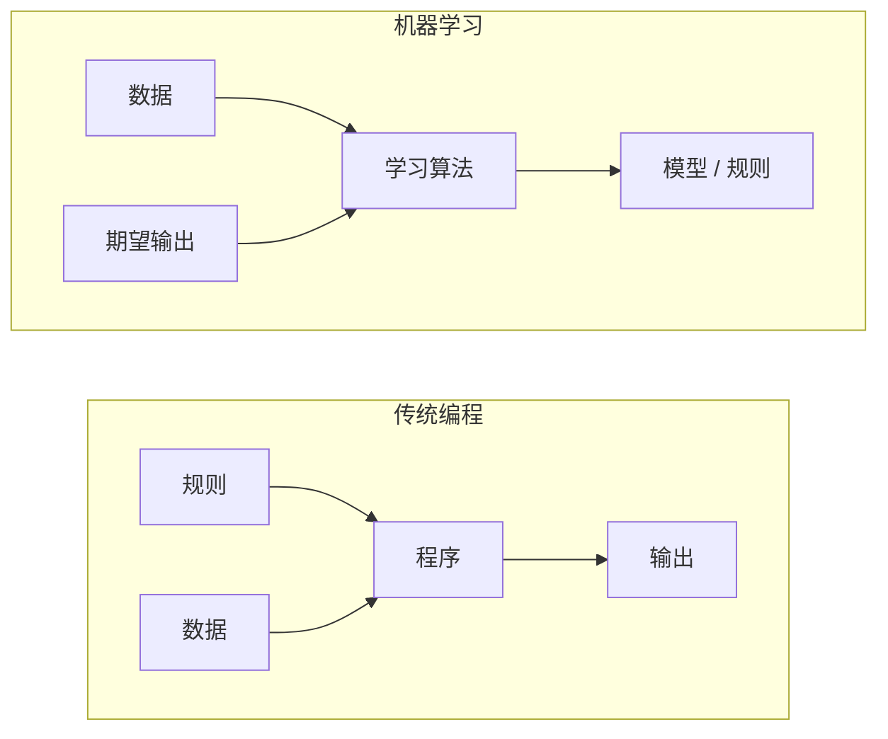
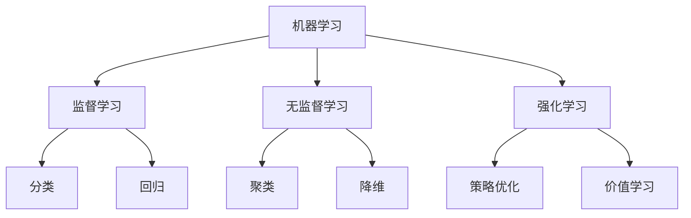
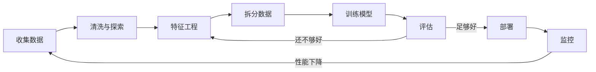
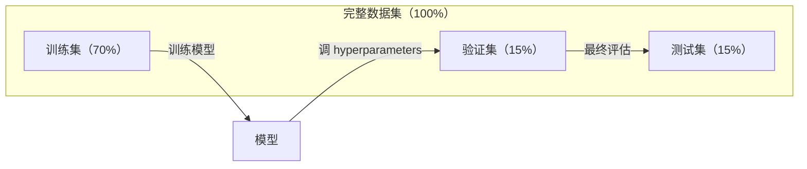
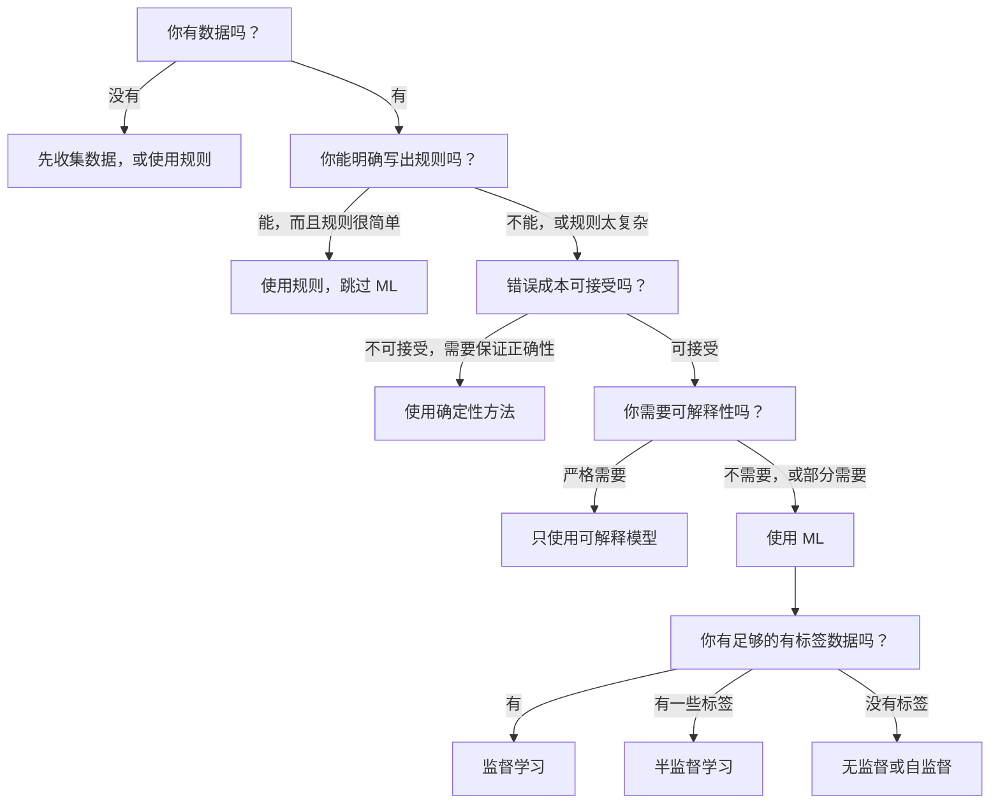

# 什么是机器学习

> 机器学习不是手写规则，而是教计算机从数据中发现模式。

**类型：** 学习
**语言：** Python
**前置要求：** 阶段 1（数学基础）
**时间：** ~45 分钟

## 学习目标

- 解释监督学习、无监督学习和强化学习的区别，并判断给定问题适合哪一类
- 从零实现一个最近质心分类器，并将它与随机 baseline 对比评估
- 区分分类和回归任务，并为每类任务选择合适的 loss function
- 判断给定业务问题是否适合使用 ML，还是更适合用确定性规则解决

## 问题

你想构建一个垃圾邮件过滤器。传统做法是坐下来写几百条规则。“如果邮件包含 `FREE MONEY`，标记为垃圾邮件。如果有超过 3 个感叹号，标记为垃圾邮件。”你花几周时间写规则。然后垃圾邮件发送者换了说法。规则失效。你再写更多规则。这个循环永无止境。

机器学习把这个过程反过来。你不再手写规则，而是给计算机几千封已标注邮件（“垃圾邮件”或“非垃圾邮件”），让它自己找出规则。计算机会发现你想不到的模式。当垃圾邮件发送者改变策略时，你用新数据重新训练，而不是重写代码。

这种从“编写规则”到“从数据学习”的转变，就是机器学习的核心。每个推荐引擎、语音助手、自动驾驶汽车和语言模型都以这种方式工作。

## 概念

### 从数据学习，而不是从规则学习

传统编程和机器学习是从相反方向解决问题。



传统编程：你写规则。程序把规则应用到数据上，产生输出。

机器学习：你提供数据和期望输出。算法发现规则。

训练得到的“模型”本身就是规则，只是被编码成数字（weights、parameters）。它从见过的样本中泛化，对从未见过的数据做预测。

### 机器学习的三种类型



**监督学习**：你有输入-输出配对。模型学习如何把输入映射到输出。
- “这里有 10,000 张标注为猫或狗的照片。学会区分它们。”
- “这里有房屋特征和价格。学会预测价格。”

**无监督学习**：你只有输入，没有标签。模型自己发现结构。
- “这里有 10,000 位客户的购买历史。找出自然分组。”
- “这里有 1,000 维的数据点。降到 2 维，同时保留结构。”

**强化学习**：agent 在环境中采取动作，并获得奖励或惩罚。它学习一种策略（policy），让总奖励最大化。
- “玩这个游戏。赢了 +1，输了 -1。自己找出策略。”
- “控制这个机械臂。拿起物体 +1，每浪费一秒 -0.01。”

实践中你构建的大多数内容会使用监督学习。无监督学习常用于预处理和探索。强化学习支撑游戏 AI、机器人，以及语言模型中的 RLHF。

### 三大类之外

上面的三类很清晰，但真实世界的 ML 往往会模糊边界。

**半监督学习**使用少量有标签数据和大量无标签数据。你可能有 100 张已标注医学图像，以及 100,000 张未标注图像。常见技术包括：

- **标签传播：** 构建一张连接相似数据点的图。标签会通过图从已标注节点传播到未标注邻居。
- **伪标签：** 先用有标签数据训练模型，再用它预测无标签数据的标签，然后用全部数据重新训练。模型会自举出自己的训练集。
- **一致性正则化：** 模型应该对同一个输入和它的轻微扰动版本给出相同预测。即使没有标签，这也能工作。

**自监督学习**从数据本身生成监督信号。完全不需要人工标签。模型会根据数据结构创建自己的预测任务。

- **Masked language modeling（BERT）：** 遮住句子中 15% 的词，训练模型预测缺失词。“标签”来自原始文本。
- **Contrastive learning（SimCLR）：** 取一张图像，生成两个增强版本。训练模型识别它们来自同一张图像，同时区分它们和其他图像的增强版本。
- **Next-token prediction（GPT）：** 给定前面的所有词，预测下一个词。每篇文本文档都会变成一个训练样本。

这些并不是独立于三大类的新类别。它们是结合监督和无监督思想的策略。自监督学习在技术上属于监督学习（模型在预测某个东西），但标签是自动生成的，不是人类标注的。

### 分类 vs 回归

这是两种主要的监督学习任务。

| 方面 | 分类 | 回归 |
|--------|---------------|------------|
| 输出 | 离散类别 | 连续数值 |
| 示例 | “这封邮件是垃圾邮件吗？” | “房价会是多少？” |
| 输出空间 | {cat, dog, bird} | 任意实数 |
| Loss function | Cross-entropy、accuracy | Mean squared error、MAE |
| 决策 | 类别之间的边界 | 拟合数据的曲线 |

分类回答“是哪一类？”回归回答“是多少？”

有些问题可以用两种方式建模。预测股票上涨还是下跌是分类。预测精确价格是回归。

### ML 工作流

不管使用什么算法，每个机器学习项目都会遵循同一条 pipeline。



**收集数据**：收集原始数据。更多数据几乎总是更好，但质量比数量更重要。

**清洗与探索**：处理缺失值、移除重复项、可视化分布、发现异常。这个步骤通常占项目总时间的 60-80%。

**特征工程**：把原始数据转换成模型可以使用的 features。把日期转换成星期几。归一化数值列。编码类别变量。好的 features 比花哨算法更重要。

**拆分数据**：分成训练集、验证集和测试集。模型在训练数据上训练，你在验证数据上调 hyperparameters，并在测试数据上报告最终性能。

**训练模型**：把训练数据喂给算法。算法会调整内部 parameters，让 loss function 最小化。

**评估**：在验证/测试数据上衡量性能。如果性能不可接受，就回头尝试不同的 features、算法或 hyperparameters。

**部署**：把模型放进生产环境，让它对新数据做预测。

**监控**：随时间跟踪性能。数据分布会变化（data drift），模型会退化。当性能下降时，重新训练。

### 训练集、验证集和测试集划分

这是初学者最容易搞错的概念。你必须在训练期间从未见过的数据上评估模型。否则你衡量的是记忆，而不是学习。



| 划分 | 目的 | 使用时机 | 典型大小 |
|-------|---------|-----------|-------------|
| Training | 模型从这些数据学习 | 训练期间 | 60-80% |
| Validation | 调 hyperparameters，比较模型 | 每次训练后 | 10-20% |
| Test | 最终无偏性能估计 | 只在最后一次 | 10-20% |

测试集是神圣的。你只看它一次。如果你一直根据测试集性能调整模型，实际上就是在测试集上训练，你报告的数字就没有意义。

对于小数据集，使用 k-fold cross-validation：把数据分成 k 份，在 k-1 份上训练，在剩下 1 份上验证，轮换这个过程，并对结果取平均。

### 过拟合 vs 欠拟合


**欠拟合**：模型太简单，无法捕捉数据中的模式。比如用直线拟合曲线关系。训练误差高，测试误差也高。

**过拟合**：模型太复杂，连训练数据中的噪声也记住了。比如一条穿过每个训练点的波浪曲线，但在新数据上失败。训练误差低，测试误差高。

**良好拟合**：模型捕捉真实模式，而没有记住噪声。训练误差和测试误差都合理地低。

过拟合的迹象：
- 训练 accuracy 远高于验证 accuracy
- 模型在训练数据上表现很好，但在新数据上表现很差
- 增加更多训练数据能改善性能（模型之前是在记忆，不是在学习）

修复过拟合：
- 获取更多训练数据
- 降低模型复杂度（更少 parameters、更简单架构）
- 正则化（为大 weights 添加惩罚）
- Dropout（训练时随机把 neuron 置零）
- Early stopping（当验证误差开始上升时停止训练）

修复欠拟合：
- 使用更复杂的模型
- 增加更多 features
- 减少正则化
- 训练更久

### Bias-Variance Tradeoff

这是过拟合和欠拟合背后的数学框架。

**Bias**：来自模型错误假设的误差。当真实关系是非线性时，线性模型就有高 bias。高 bias 会导致欠拟合。

**Variance**：来自模型对训练数据中小波动过于敏感的误差。高 variance 模型在不同数据子集上训练时，会给出非常不同的预测。高 variance 会导致过拟合。

| 模型复杂度 | Bias | Variance | 结果 |
|-----------------|------|----------|--------|
| 太低（用线性模型拟合曲线数据） | 高 | 低 | 欠拟合 |
| 刚好 | 中 | 中 | 泛化良好 |
| 太高（用 20 次多项式拟合 10 个点） | 低 | 高 | 过拟合 |

总误差 = Bias^2 + Variance + 不可约噪声

你无法降低不可约噪声（它是数据本身的随机性）。你要找到让 bias^2 + variance 最小的甜点。

### No Free Lunch Theorem

没有一个算法能在每个问题上都表现最好。一个在某类问题上表现好的算法，在另一类问题上可能表现很差。这就是为什么数据科学家会尝试多个算法并比较结果。

实践中，选择取决于：
- 你有多少数据
- 有多少 features
- 关系是线性还是非线性
- 是否需要可解释性
- 你能负担多少计算量

### 什么时候不要使用机器学习

ML 很强大，但并不总是正确工具。在拿起模型之前，先问问自己是否真的需要它。

**不要在以下情况使用 ML：**

- **规则简单且定义明确。** 税务计算、排序算法、单位转换。如果你能用几个 if 语句写出逻辑，模型只会增加复杂度，没有收益。
- **没有数据，或数据很少。** ML 需要从样本中学习。只有 10 个数据点时，你训练不出有意义的东西。先收集数据。
- **错误代价是灾难性的，并且你需要保证正确性。** 医疗剂量计算、核反应堆控制、密码学验证。ML 模型是概率性的。它们有时会错。如果“有时会错”不可接受，就使用确定性方法。
- **查找表或 heuristic 已经解决问题。** 如果一个简单阈值或表覆盖 99% 的情况，加入 ML 只会增加维护成本，不会带来有意义的改进。
- **你无法解释决策，而业务要求可解释性。** 受监管行业（贷款、保险、刑事司法）有时要求每个决策都能完整解释。一些 ML 模型是可解释的（linear regression、小型 decision tree）。大多数不是。
- **问题变化快过你重新训练的速度。** 如果规则每天都变，而重新训练需要一周，模型就总是过期的。

使用这个决策流程图：



## 构建它

`code/ml_intro.py` 中的代码从零实现了一个最近质心分类器，这是最简单的 ML 算法。它展示了核心思想：从数据学习，然后对新数据做预测。

### 第 1 步：从零实现最近质心分类器

最近质心分类器会计算训练数据中每个类别的中心（均值）。预测时，它会把每个新点分配给中心距离最近的类别。

```python
class NearestCentroid:
    def fit(self, X, y):
        self.classes = np.unique(y)
        self.centroids = np.array([
            X[y == c].mean(axis=0) for c in self.classes
        ])

    def predict(self, X):
        distances = np.array([
            np.sqrt(((X - c) ** 2).sum(axis=1))
            for c in self.centroids
        ])
        return self.classes[distances.argmin(axis=0)]
```

这就是完整算法。Fit 计算两个均值。Predict 计算距离。没有 gradient descent，没有迭代，没有 hyperparameters。

### 第 2 步：在合成数据上训练

我们生成一个二维分类数据集，其中两个类别略有重叠。质心分类器会在类别中心之间画出线性决策边界。

```python
rng = np.random.RandomState(42)
X_class0 = rng.randn(100, 2) + np.array([1.0, 1.0])
X_class1 = rng.randn(100, 2) + np.array([-1.0, -1.0])
X = np.vstack([X_class0, X_class1])
y = np.array([0] * 100 + [1] * 100)
```

### 第 3 步：与 baseline 对比

每个 ML 模型都应该和一个简单 baseline 对比。这里的 baseline 随机预测类别。如果你的 ML 模型打不过随机猜测，就说明有问题。

```python
baseline_preds = rng.choice([0, 1], size=len(y_test))
baseline_acc = np.mean(baseline_preds == y_test)
```

在这个干净数据集上，质心分类器应该能达到约 90%+ accuracy。随机 baseline 约为 50%。

### 为什么这很重要

最近质心分类器简单到几乎不可思议。它没有 hyperparameters，没有迭代，没有 gradient descent。但它捕捉了 ML 的基本模式：

1. 从训练数据中**学习**一种表示（质心）
2. 使用这种表示在新数据上**预测**（最近距离）
3. 与 baseline **评估**对比（随机猜测）

从 logistic regression 到 transformers，每个 ML 算法都遵循同样的三步模式。表示会越来越复杂，但工作流不变。

### 第 4 步：质心分类器做不到什么

最近质心分类器假设每个类别形成单个 blob。它画出线性决策边界。它会在以下情况失败：

- 类别有多个 cluster（例如数字“1”可以有几种不同写法）
- 决策边界是非线性的（例如一个类别环绕另一个类别）
- Features 的尺度非常不同（距离会被尺度最大的 feature 主导）

这些局限会引出你接下来学习的所有其他算法。K-nearest neighbors 可以处理多个 clusters。Decision trees 可以处理非线性边界。Feature scaling 可以修复尺度问题。每一课都会建立在上一课的局限之上。

## 使用它

sklearn 提供了 `NearestCentroid` 和合成数据生成器：

```python
from sklearn.neighbors import NearestCentroid
from sklearn.datasets import make_classification
from sklearn.model_selection import train_test_split

X, y = make_classification(
    n_samples=500, n_features=2, n_redundant=0,
    n_clusters_per_class=1, random_state=42
)
X_train, X_test, y_train, y_test = train_test_split(X, y, test_size=0.3)

clf = NearestCentroid()
clf.fit(X_train, y_train)
print(f"Accuracy: {clf.score(X_test, y_test):.3f}")
```

## 交付它

本课会产出 `outputs/prompt-ml-problem-framer.md`，这是一个把模糊业务问题转换成具体 ML 任务的 prompt。给它一段问题描述（“我们想降低流失率”或“预测下个季度需求”），它会识别学习类型、定义预测目标、列出候选 features、选择成功指标、建立 baseline，并标出 data leakage 或 class imbalance 之类的陷阱。在任何 ML 项目开始时使用它，避免构建错误的东西。

## 关键术语

| 术语 | 人们常说 | 实际含义 |
|------|----------------|----------------------|
| Model | “这个 AI” | 一个带有可学习 parameters 的数学函数，把输入映射到输出 |
| Training | “教 AI” | 运行优化算法来调整模型 parameters，使预测匹配已知输出 |
| Feature | “一个输入列” | 数据中可度量的属性，模型用它来做预测 |
| Label | “答案” | 训练样本的已知输出，用来计算误差信号 |
| Hyperparameter | “你调的设置” | 训练前设置的 parameter，用来控制学习过程（learning rate、层数） |
| Loss function | “模型错得有多离谱” | 衡量预测输出和真实输出差距的函数，训练会尝试最小化它 |
| Overfitting | “它记住了测试集” | 模型学到的是训练数据特有的噪声，而不是一般模式，所以在新数据上失败 |
| Underfitting | “它什么都没学到” | 模型太简单，无法捕捉数据中的真实模式 |
| Generalization | “它能处理新数据” | 模型对未训练过的数据做出准确预测的能力 |
| Cross-validation | “在不同数据块上测试” | 反复把数据拆成训练/测试 folds 并平均结果，得到更稳健的性能估计 |
| Regularization | “让 weights 保持小” | 在 loss function 中加入惩罚项，抑制过于复杂的模型 |
| Data drift | “世界变了” | 传入数据的统计分布随时间偏移，导致模型性能下降 |

## 练习

1. 选择任意数据集（例如 Iris、Titanic）。按 70/15/15 拆成 train/validation/test。解释为什么不应该在测试集上调 hyperparameters。
2. 列出三个真实世界问题。对每个问题，判断它是分类、回归还是聚类，以及它是监督还是无监督。
3. 一个模型在训练数据上达到 99% accuracy，但在测试数据上只有 60%。诊断问题，并列出三个你会尝试的修复方法。

## 延伸阅读

- [An Introduction to Statistical Learning](https://www.statlearning.com/) - 免费教材，用实践示例覆盖所有经典 ML 方法
- [Google's Machine Learning Crash Course](https://developers.google.com/machine-learning/crash-course) - 简洁可视化的 ML 概念介绍
- [Scikit-learn User Guide](https://scikit-learn.org/stable/user_guide.html) - 在 Python 中实现 ML 的实用参考
