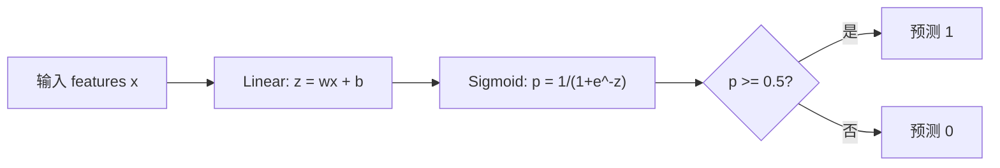
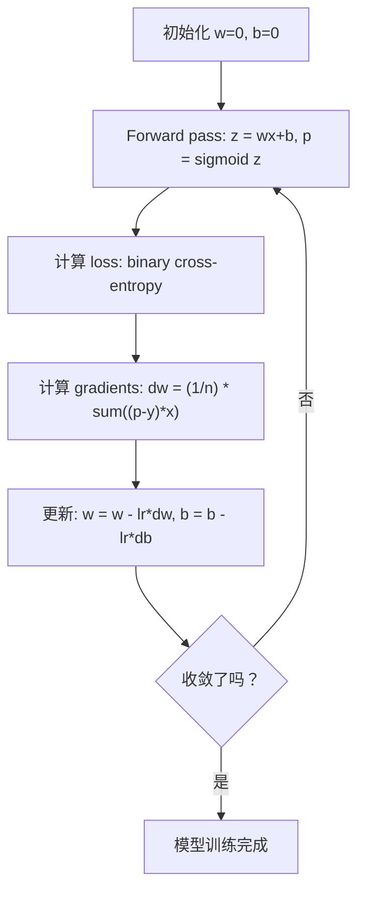

# 逻辑回归

> 逻辑回归把一条直线弯成 S 曲线，用概率回答是/否问题。

**类型：** 构建
**语言：** Python
**前置要求：** 阶段 2 第 1-2 课（什么是 ML、线性回归）
**时间：** ~90 分钟

## 学习目标

- 使用 sigmoid function 和 binary cross-entropy loss，从零实现 logistic regression
- 计算并解释 binary classification 的 precision、recall、F1 score 和 confusion matrix
- 解释为什么 MSE 不适合分类，以及为什么 binary cross-entropy 会产生 convex cost surface
- 构建用于多分类的 softmax regression 模型，并评估 threshold tuning 的权衡

## 问题

你想根据肿瘤大小预测它是恶性还是良性。你尝试使用线性回归。它输出 0.3、1.7 或 -0.5 这样的数字。这些数字是什么意思？1.7 是“非常恶性”吗？-0.5 是“非常良性”吗？线性回归输出的是无界数字。分类需要 0 到 1 之间的有界概率，以及明确决策：是或否。

Logistic regression 解决了这个问题。它取同样的线性组合（wx + b），再通过 sigmoid function，把任意数字压缩到 (0, 1) 范围内。输出就是概率。你设置一个 threshold（通常是 0.5）并做出决策。

这是实践中最常用的算法之一。尽管名字里有 regression，logistic regression 是分类算法，不是回归算法。这个名字来自它使用的 logistic（sigmoid）函数。

## 概念

### 为什么线性回归不适合分类

想象根据学习小时数预测通过/不通过（1/0）。线性回归会穿过数据拟合一条线：

```
hours:  1   2   3   4   5   6   7   8   9   10
actual: 0   0   0   0   1   1   1   1   1   1
```

线性拟合可能会在 1 小时时给出 -0.2，在 10 小时时给出 1.3。这些值不是概率。它们会低于 0 或高于 1。更糟的是，一个离群点（某人学习了 50 小时）会拖动整条线，改变所有人的预测。

分类需要一个满足以下条件的函数：
- 输出 0 到 1 之间的值（概率）
- 形成明显转换（decision boundary）
- 不会被远离边界的 outliers 扭曲

### Sigmoid Function

Sigmoid function 正好做到这一点：

```
sigmoid(z) = 1 / (1 + e^(-z))
```

性质：
- 当 z 是很大的正数时，sigmoid(z) 接近 1
- 当 z 是很大的负数时，sigmoid(z) 接近 0
- 当 z = 0 时，sigmoid(z) = 0.5
- 输出始终在 0 到 1 之间
- 这个函数处处平滑且可微

它的导数形式很方便：sigmoid'(z) = sigmoid(z) * (1 - sigmoid(z))。这让 gradient 计算很高效。

### Logistic Regression = Linear Model + Sigmoid

模型先计算 z = wx + b（和线性回归一样），再应用 sigmoid：



输出 p 被解释为 P(y=1 | x)，也就是输入属于 class 1 的概率。Decision boundary 位于 wx + b = 0 的地方，此时 sigmoid 输出正好是 0.5。

### Binary Cross-Entropy Loss

Logistic regression 不能使用 MSE。带 sigmoid 的 MSE 会产生非凸 cost surface，里面有许多 local minima。应该使用 binary cross-entropy（log loss）：

```
Loss = -(1/n) * sum(y * log(p) + (1-y) * log(1-p))
```

为什么它有效：
- 当 y=1 且 p 接近 1：log(1) = 0，所以 loss 接近 0（正确，低成本）
- 当 y=1 且 p 接近 0：log(0) 接近负无穷，所以 loss 巨大（错误，高成本）
- 当 y=0 且 p 接近 0：log(1) = 0，所以 loss 接近 0（正确，低成本）
- 当 y=0 且 p 接近 1：log(0) 接近负无穷，所以 loss 巨大（错误，高成本）

对于 logistic regression，这个 loss function 是 convex 的，保证只有一个 global minimum。

### Logistic Regression 的 Gradient Descent

Sigmoid 配合 binary cross-entropy 时，gradients 有一个很简洁的形式：

```
dL/dw = (1/n) * sum((p - y) * x)
dL/db = (1/n) * sum(p - y)
```

它们看起来和线性回归 gradients 完全一样。区别是 p = sigmoid(wx + b)，而不是 p = wx + b。Sigmoid 引入非线性，但 gradient 更新规则保持相同。



### Decision Boundary

对于二维输入（两个 features），decision boundary 是满足下式的直线：

```
w1*x1 + w2*x2 + b = 0
```

一侧的点被分类为 1，另一侧被分类为 0。Logistic regression 总是产生线性 decision boundary。如果你需要曲线边界，要么添加 polynomial features，要么使用非线性模型。

### 使用 Softmax 做多分类

Binary logistic regression 处理两个类别。对于 k 个类别，使用 softmax function：

```
softmax(z_i) = e^(z_i) / sum(e^(z_j) for all j)
```

每个类别都有自己的 weight vector。模型为每个类别计算一个 score z_i，然后 softmax 把 scores 转换成总和为 1 的概率。预测类别就是概率最高的类别。

Loss function 变为 categorical cross-entropy：

```
Loss = -(1/n) * sum(sum(y_k * log(p_k)))
```

其中 y_k 对真实类别为 1，对所有其他类别为 0（one-hot encoding）。

### 评估指标

只看 accuracy 不够。对于 95% 为 negative、5% 为 positive 的数据集，一个总是预测 negative 的模型能得到 95% accuracy，但完全没用。

**Confusion Matrix**：

| | Predicted Positive | Predicted Negative |
|---|---|---|
| Actually Positive | True Positive (TP) | False Negative (FN) |
| Actually Negative | False Positive (FP) | True Negative (TN) |

**Precision**：所有预测为 positive 的样本中，有多少实际上是 positive？
```
Precision = TP / (TP + FP)
```

**Recall**（Sensitivity）：所有实际 positive 的样本中，我们抓住了多少？
```
Recall = TP / (TP + FN)
```

**F1 Score**：precision 和 recall 的调和平均。平衡两个指标。
```
F1 = 2 * (Precision * Recall) / (Precision + Recall)
```

什么时候优先考虑：
- **Precision**：false positives 代价高时（垃圾邮件过滤器，你不想拦截合法邮件）
- **Recall**：false negatives 代价高时（癌症筛查，你不想漏掉肿瘤）
- **F1**：你需要一个单一的平衡指标时

## 构建它

### 第 1 步：Sigmoid function 和数据生成

```python
import random
import math

def sigmoid(z):
    z = max(-500, min(500, z))
    return 1.0 / (1.0 + math.exp(-z))


random.seed(42)
N = 200
X = []
y = []

for _ in range(N // 2):
    X.append([random.gauss(2, 1), random.gauss(2, 1)])
    y.append(0)

for _ in range(N // 2):
    X.append([random.gauss(5, 1), random.gauss(5, 1)])
    y.append(1)

combined = list(zip(X, y))
random.shuffle(combined)
X, y = zip(*combined)
X = list(X)
y = list(y)

print(f"Generated {N} samples (2 classes, 2 features)")
print(f"Class 0 center: (2, 2), Class 1 center: (5, 5)")
print(f"First 5 samples:")
for i in range(5):
    print(f"  Features: [{X[i][0]:.2f}, {X[i][1]:.2f}], Label: {y[i]}")
```

### 第 2 步：从零实现 Logistic regression

```python
class LogisticRegression:
    def __init__(self, n_features, learning_rate=0.01):
        self.weights = [0.0] * n_features
        self.bias = 0.0
        self.lr = learning_rate
        self.loss_history = []

    def predict_proba(self, x):
        z = sum(w * xi for w, xi in zip(self.weights, x)) + self.bias
        return sigmoid(z)

    def predict(self, x, threshold=0.5):
        return 1 if self.predict_proba(x) >= threshold else 0

    def compute_loss(self, X, y):
        n = len(y)
        total = 0.0
        for i in range(n):
            p = self.predict_proba(X[i])
            p = max(1e-15, min(1 - 1e-15, p))
            total += y[i] * math.log(p) + (1 - y[i]) * math.log(1 - p)
        return -total / n

    def fit(self, X, y, epochs=1000, print_every=200):
        n = len(y)
        n_features = len(X[0])
        for epoch in range(epochs):
            dw = [0.0] * n_features
            db = 0.0
            for i in range(n):
                p = self.predict_proba(X[i])
                error = p - y[i]
                for j in range(n_features):
                    dw[j] += error * X[i][j]
                db += error
            for j in range(n_features):
                self.weights[j] -= self.lr * (dw[j] / n)
            self.bias -= self.lr * (db / n)
            loss = self.compute_loss(X, y)
            self.loss_history.append(loss)
            if epoch % print_every == 0:
                print(f"  Epoch {epoch:4d} | Loss: {loss:.4f} | w: [{self.weights[0]:.3f}, {self.weights[1]:.3f}] | b: {self.bias:.3f}")
        return self

    def accuracy(self, X, y):
        correct = sum(1 for i in range(len(y)) if self.predict(X[i]) == y[i])
        return correct / len(y)


split = int(0.8 * N)
X_train, X_test = X[:split], X[split:]
y_train, y_test = y[:split], y[split:]

print("\n=== Training Logistic Regression ===")
model = LogisticRegression(n_features=2, learning_rate=0.1)
model.fit(X_train, y_train, epochs=1000, print_every=200)

print(f"\nTrain accuracy: {model.accuracy(X_train, y_train):.4f}")
print(f"Test accuracy:  {model.accuracy(X_test, y_test):.4f}")
print(f"Weights: [{model.weights[0]:.4f}, {model.weights[1]:.4f}]")
print(f"Bias: {model.bias:.4f}")
```

### 第 3 步：从零实现 confusion matrix 和 metrics

```python
class ClassificationMetrics:
    def __init__(self, y_true, y_pred):
        self.tp = sum(1 for t, p in zip(y_true, y_pred) if t == 1 and p == 1)
        self.tn = sum(1 for t, p in zip(y_true, y_pred) if t == 0 and p == 0)
        self.fp = sum(1 for t, p in zip(y_true, y_pred) if t == 0 and p == 1)
        self.fn = sum(1 for t, p in zip(y_true, y_pred) if t == 1 and p == 0)

    def accuracy(self):
        total = self.tp + self.tn + self.fp + self.fn
        return (self.tp + self.tn) / total if total > 0 else 0

    def precision(self):
        denom = self.tp + self.fp
        return self.tp / denom if denom > 0 else 0

    def recall(self):
        denom = self.tp + self.fn
        return self.tp / denom if denom > 0 else 0

    def f1(self):
        p = self.precision()
        r = self.recall()
        return 2 * p * r / (p + r) if (p + r) > 0 else 0

    def print_confusion_matrix(self):
        print(f"\n  Confusion Matrix:")
        print(f"                  Predicted")
        print(f"                  Pos   Neg")
        print(f"  Actual Pos     {self.tp:4d}  {self.fn:4d}")
        print(f"  Actual Neg     {self.fp:4d}  {self.tn:4d}")

    def print_report(self):
        self.print_confusion_matrix()
        print(f"\n  Accuracy:  {self.accuracy():.4f}")
        print(f"  Precision: {self.precision():.4f}")
        print(f"  Recall:    {self.recall():.4f}")
        print(f"  F1 Score:  {self.f1():.4f}")


y_pred_test = [model.predict(x) for x in X_test]
print("\n=== Classification Report (Test Set) ===")
metrics = ClassificationMetrics(y_test, y_pred_test)
metrics.print_report()
```

### 第 4 步：Decision boundary 分析

```python
print("\n=== Decision Boundary ===")
w1, w2 = model.weights
b = model.bias
print(f"Decision boundary: {w1:.4f}*x1 + {w2:.4f}*x2 + {b:.4f} = 0")
if abs(w2) > 1e-10:
    print(f"Solved for x2:     x2 = {-w1/w2:.4f}*x1 + {-b/w2:.4f}")

print("\nSample predictions near the boundary:")
test_points = [
    [3.0, 3.0],
    [3.5, 3.5],
    [4.0, 4.0],
    [2.5, 2.5],
    [5.0, 5.0],
]
for point in test_points:
    prob = model.predict_proba(point)
    pred = model.predict(point)
    print(f"  [{point[0]}, {point[1]}] -> prob={prob:.4f}, class={pred}")
```

### 第 5 步：使用 softmax 做多分类

```python
class SoftmaxRegression:
    def __init__(self, n_features, n_classes, learning_rate=0.01):
        self.n_features = n_features
        self.n_classes = n_classes
        self.lr = learning_rate
        self.weights = [[0.0] * n_features for _ in range(n_classes)]
        self.biases = [0.0] * n_classes

    def softmax(self, scores):
        max_score = max(scores)
        exp_scores = [math.exp(s - max_score) for s in scores]
        total = sum(exp_scores)
        return [e / total for e in exp_scores]

    def predict_proba(self, x):
        scores = [
            sum(self.weights[k][j] * x[j] for j in range(self.n_features)) + self.biases[k]
            for k in range(self.n_classes)
        ]
        return self.softmax(scores)

    def predict(self, x):
        probs = self.predict_proba(x)
        return probs.index(max(probs))

    def fit(self, X, y, epochs=1000, print_every=200):
        n = len(y)
        for epoch in range(epochs):
            grad_w = [[0.0] * self.n_features for _ in range(self.n_classes)]
            grad_b = [0.0] * self.n_classes
            total_loss = 0.0
            for i in range(n):
                probs = self.predict_proba(X[i])
                for k in range(self.n_classes):
                    target = 1.0 if y[i] == k else 0.0
                    error = probs[k] - target
                    for j in range(self.n_features):
                        grad_w[k][j] += error * X[i][j]
                    grad_b[k] += error
                true_prob = max(probs[y[i]], 1e-15)
                total_loss -= math.log(true_prob)
            for k in range(self.n_classes):
                for j in range(self.n_features):
                    self.weights[k][j] -= self.lr * (grad_w[k][j] / n)
                self.biases[k] -= self.lr * (grad_b[k] / n)
            if epoch % print_every == 0:
                print(f"  Epoch {epoch:4d} | Loss: {total_loss / n:.4f}")
        return self

    def accuracy(self, X, y):
        correct = sum(1 for i in range(len(y)) if self.predict(X[i]) == y[i])
        return correct / len(y)


random.seed(42)
X_3class = []
y_3class = []

centers = [(1, 1), (5, 1), (3, 5)]
for label, (cx, cy) in enumerate(centers):
    for _ in range(50):
        X_3class.append([random.gauss(cx, 0.8), random.gauss(cy, 0.8)])
        y_3class.append(label)

combined = list(zip(X_3class, y_3class))
random.shuffle(combined)
X_3class, y_3class = zip(*combined)
X_3class = list(X_3class)
y_3class = list(y_3class)

split_3 = int(0.8 * len(X_3class))
X_train_3 = X_3class[:split_3]
y_train_3 = y_3class[:split_3]
X_test_3 = X_3class[split_3:]
y_test_3 = y_3class[split_3:]

print("\n=== Multi-class Softmax Regression (3 classes) ===")
softmax_model = SoftmaxRegression(n_features=2, n_classes=3, learning_rate=0.1)
softmax_model.fit(X_train_3, y_train_3, epochs=1000, print_every=200)
print(f"\nTrain accuracy: {softmax_model.accuracy(X_train_3, y_train_3):.4f}")
print(f"Test accuracy:  {softmax_model.accuracy(X_test_3, y_test_3):.4f}")

print("\nSample predictions:")
for i in range(5):
    probs = softmax_model.predict_proba(X_test_3[i])
    pred = softmax_model.predict(X_test_3[i])
    print(f"  True: {y_test_3[i]}, Predicted: {pred}, Probs: [{', '.join(f'{p:.3f}' for p in probs)}]")
```

### 第 6 步：Threshold tuning

```python
print("\n=== Threshold Tuning ===")
print("Default threshold: 0.5. Adjusting the threshold trades precision for recall.\n")

thresholds = [0.3, 0.4, 0.5, 0.6, 0.7]
print(f"{'Threshold':>10} {'Accuracy':>10} {'Precision':>10} {'Recall':>10} {'F1':>10}")
print("-" * 52)

for t in thresholds:
    y_pred_t = [1 if model.predict_proba(x) >= t else 0 for x in X_test]
    m = ClassificationMetrics(y_test, y_pred_t)
    print(f"{t:>10.1f} {m.accuracy():>10.4f} {m.precision():>10.4f} {m.recall():>10.4f} {m.f1():>10.4f}")
```

## 使用它

现在用 scikit-learn 做同样的事。

```python
from sklearn.linear_model import LogisticRegression as SklearnLR
from sklearn.metrics import accuracy_score, precision_score, recall_score, f1_score
from sklearn.metrics import confusion_matrix, classification_report
from sklearn.model_selection import train_test_split
from sklearn.preprocessing import StandardScaler
import numpy as np

np.random.seed(42)
X_0 = np.random.randn(100, 2) + [2, 2]
X_1 = np.random.randn(100, 2) + [5, 5]
X_sk = np.vstack([X_0, X_1])
y_sk = np.array([0] * 100 + [1] * 100)

X_tr, X_te, y_tr, y_te = train_test_split(X_sk, y_sk, test_size=0.2, random_state=42)

scaler = StandardScaler()
X_tr_sc = scaler.fit_transform(X_tr)
X_te_sc = scaler.transform(X_te)

lr = SklearnLR()
lr.fit(X_tr_sc, y_tr)
y_pred = lr.predict(X_te_sc)

print("=== Scikit-learn Logistic Regression ===")
print(f"Accuracy:  {accuracy_score(y_te, y_pred):.4f}")
print(f"Precision: {precision_score(y_te, y_pred):.4f}")
print(f"Recall:    {recall_score(y_te, y_pred):.4f}")
print(f"F1:        {f1_score(y_te, y_pred):.4f}")
print(f"\nConfusion Matrix:\n{confusion_matrix(y_te, y_pred)}")
print(f"\nClassification Report:\n{classification_report(y_te, y_pred)}")
```

你的从零实现会产生相同的 decision boundary 和 metrics。Scikit-learn 还提供 solver 选项（liblinear、lbfgs、saga）、自动 regularization、多分类策略（one-vs-rest、multinomial）和数值稳定性优化。

## 交付它

本课会产出：
- `code/logistic_regression.py` - 从零实现的 logistic regression，包含 metrics

## 练习

1. 生成一个不是线性可分的数据集（例如两个同心圆）。训练 logistic regression 并观察失败表现。然后添加 polynomial features（x1^2、x2^2、x1*x2）再训练。展示 accuracy 的提升。
2. 为 3-class softmax 模型实现 multi-class confusion matrix。计算每个类别的 precision 和 recall。哪个类别最难分类？
3. 从零构建 ROC curve。对 0 到 1 之间的 100 个 threshold 值，计算 true positive rate 和 false positive rate。使用梯形法则计算 AUC（area under the curve）。

## 关键术语

| 术语 | 人们常说 | 实际含义 |
|------|----------------|----------------------|
| Logistic regression | “用于分类的回归” | 一个线性模型后接 sigmoid function，输出类别概率 |
| Sigmoid function | “S 曲线” | 函数 1/(1+e^(-z))，把任意实数映射到 (0, 1) 范围 |
| Binary cross-entropy | “Log loss” | Loss function -[y*log(p) + (1-y)*log(1-p)]，会严厉惩罚自信但错误的预测 |
| Decision boundary | “分割线” | 模型输出概率等于 0.5 的 surface，用来分隔预测类别 |
| Softmax | “多分类 sigmoid” | 把 score 向量转换成总和为 1 的概率的函数 |
| Precision | “选中的有多少相关” | TP / (TP + FP)，正类预测中真正为正的比例 |
| Recall | “相关的有多少被选中” | TP / (TP + FN)，实际正类中被模型正确识别的比例 |
| F1 score | “平衡 accuracy” | Precision 和 recall 的调和平均：2*P*R / (P+R) |
| Confusion matrix | “错误拆解表” | 展示每个类别配对的 TP、TN、FP、FN 数量的表 |
| Threshold | “截断点” | 概率高于该值时模型预测 class 1（默认 0.5，可调） |
| One-hot encoding | “类别的二进制列” | 把 class k 表示为一个只有第 k 个位置为 1、其余为 0 的向量 |
| Categorical cross-entropy | “多分类 log loss” | Binary cross-entropy 对 k 个类别的扩展，使用 one-hot encoded labels |
