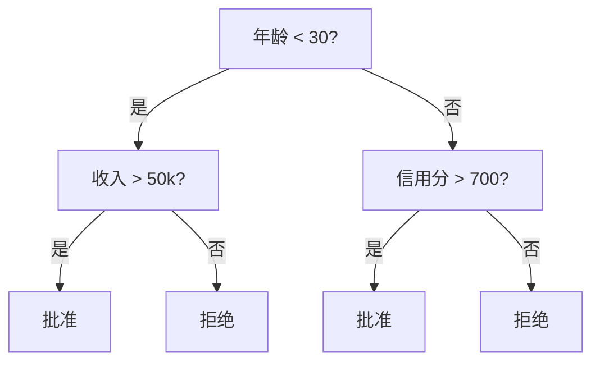
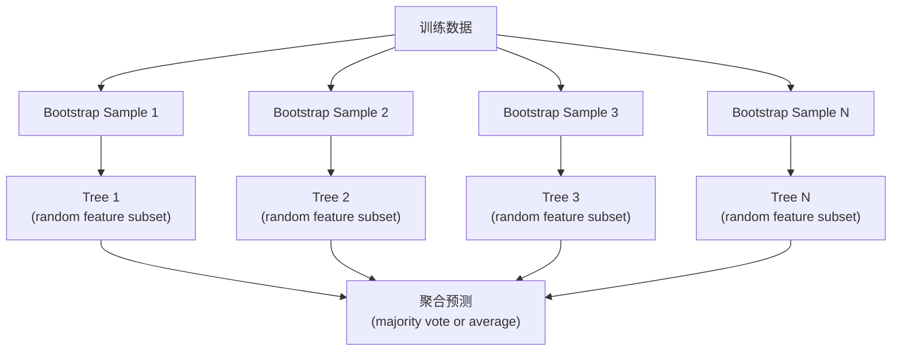

# 决策树和随机森林

> 决策树只是一个流程图。但一片森林可以成为 ML 中最强大的工具之一。

**类型：** 构建
**语言：** Python
**前置要求：** 阶段 1（第 09 课信息论、第 06 课概率）
**时间：** ~90 分钟

## 学习目标

- 实现 Gini impurity、entropy 和 information gain 计算，用来寻找最优 decision tree splits
- 使用 pre-pruning 控制（max depth、min samples）从零构建 decision tree classifier
- 使用 bootstrap sampling 和 feature randomization 构建 random forest，并解释它为什么能降低 variance
- 比较 MDI feature importance 和 permutation importance，并识别 MDI 何时有偏

## 问题

你有 tabular data。行是样本，列是 features，还有一个你想预测的 target column。你可以直接上 neural network。但对 tabular data 来说，tree-based models（decision trees、random forests、gradient boosted trees）长期稳定地优于 deep learning。结构化数据的 Kaggle 比赛由 XGBoost 和 LightGBM 主导，而不是 transformers。

为什么？树能处理混合 feature 类型（numeric 和 categorical），不需要预处理。它们能处理非线性关系，不需要 feature engineering。它们可解释：你可以看着树，清楚知道为什么做出某个预测。而 random forests 会平均多棵树，在中等规模数据集上非常抗过拟合。

本课会使用 recursive splitting 从零构建 decision trees，然后在其上构建 random forest。你会实现 split criteria（Gini impurity、entropy、information gain）背后的数学，并理解为什么 weak learners 的 ensemble 会变成强模型。

## 概念

### 决策树做什么

Decision tree 通过一系列是/否问题，把 feature space 切分成矩形区域。



每个 internal node 会用阈值测试一个 feature。每个 leaf node 做出预测。要分类一个新的数据点，你从 root 开始沿着分支走，直到到达 leaf。

树是自顶向下构建的：在每个节点选择最能分离数据的 feature 和 threshold。“最能”由 split criterion 定义。

### Split criteria：衡量 impurity

在每个节点，我们有一组样本。我们希望拆分它们，使得到的 child nodes 尽可能“纯”，也就是每个 child 主要包含一个类别。

**Gini impurity** 衡量：如果按该节点的类别分布随机给一个样本打标签，它被错误分类的概率。

```
Gini(S) = 1 - sum(p_k^2)

where p_k is the proportion of class k in set S.
```

对于纯节点（全是一个类别），Gini = 0。对于 50/50 的二分类 split，Gini = 0.5。越低越好。

```
Example: 6 cats, 4 dogs

Gini = 1 - (0.6^2 + 0.4^2) = 1 - (0.36 + 0.16) = 0.48
```

**Entropy** 衡量节点中的信息量（混乱度）。阶段 1 第 09 课已经讲过。

```
Entropy(S) = -sum(p_k * log2(p_k))
```

对于纯节点，entropy = 0。对于 50/50 的二分类 split，entropy = 1.0。越低越好。

```
Example: 6 cats, 4 dogs

Entropy = -(0.6 * log2(0.6) + 0.4 * log2(0.4))
        = -(0.6 * -0.737 + 0.4 * -1.322)
        = 0.442 + 0.529
        = 0.971 bits
```

**Information gain** 是 split 之后 impurity（entropy 或 Gini）的降低量。

```
IG(S, feature, threshold) = Impurity(S) - weighted_avg(Impurity(S_left), Impurity(S_right))

where the weights are the proportions of samples in each child.
```

每个节点上的贪心算法：尝试每个 feature 和每个可能 threshold。选择让 information gain 最大的（feature, threshold）组合。

### Splitting 如何工作

对于当前节点上有 n 个 features、m 个 samples 的数据集：

1. 对每个 feature j（j = 1 到 n）：
   - 按 feature j 对样本排序
   - 尝试相邻不同取值之间的每个中点作为 threshold
   - 计算每个 threshold 的 information gain
2. 选择 information gain 最高的 feature 和 threshold
3. 把数据拆成 left（feature <= threshold）和 right（feature > threshold）
4. 对每个 child 递归

这种贪心方法不保证找到全局最优树。寻找最优树是 NP-hard。但贪心 splitting 在实践中效果很好。

### 停止条件

没有停止条件时，树会一直生长，直到每个 leaf 都是纯的（每个 leaf 只有一个样本）。这会完美记住训练数据，但泛化很差。

**Pre-pruning** 会在树完全长大之前停止：
- Maximum depth：当树达到指定深度时停止 split
- Minimum samples per leaf：如果节点样本少于 k 个，就停止
- Minimum information gain：如果最佳 split 对 impurity 的改进小于阈值，就停止
- Maximum leaf nodes：限制 leaves 的总数

**Post-pruning** 先长出完整树，再把它剪回去：
- Cost-complexity pruning（scikit-learn 使用）：加入与 leaves 数量成比例的惩罚。惩罚越大，树越小
- Reduced error pruning：如果移除某个 subtree 不会增加 validation error，就移除它

Pre-pruning 更简单、更快。Post-pruning 通常能得到更好的树，因为它不会过早停止一些可能通向有用后续 split 的路径。

### 用于回归的决策树

对于 regression，leaf prediction 是该 leaf 中 target values 的均值。Split criterion 也会改变：

**Variance reduction** 替代 information gain：

```
VR(S, feature, threshold) = Var(S) - weighted_avg(Var(S_left), Var(S_right))
```

选择让 variance 降低最多的 split。树会把输入空间切成多个区域，并在每个区域预测一个常数（均值）。

### Random forests：ensemble 的力量

单棵 decision tree variance 很高。数据里的小变化可能产生完全不同的树。Random forests 通过平均许多棵树来修复这个问题。



两种随机性让树之间保持多样：

**Bagging（bootstrap aggregating）：** 每棵树都在 bootstrap sample 上训练，也就是从训练数据中有放回随机采样。每个 bootstrap 中大约 63% 的原始样本会出现（剩下的是 out-of-bag samples，可用于 validation）。

**Feature randomization：** 在每次 split 时，只考虑随机子集中的 features。分类默认是 sqrt(n_features)。回归默认是 n_features/3。这会防止所有树都在同一个 dominant feature 上 split。

关键洞见：平均许多去相关的树，可以降低 variance，而不增加 bias。每棵单独的树可能平平无奇。整个 ensemble 会很强。

### Feature importance

Random forests 自然提供 feature importance scores。最常见方法是：

**Mean Decrease in Impurity（MDI）：** 对每个 feature，把所有树中使用该 feature 的所有节点带来的 impurity reduction 相加。越早的 split 产生越大的 impurity reduction，该 feature 就越重要。

```
importance(feature_j) = sum over all nodes where feature_j is used:
    (n_samples_at_node / n_total_samples) * impurity_decrease
```

这很快（训练过程中即可计算），但会偏向 high-cardinality features 以及有很多可能 split 点的 features。

**Permutation importance** 是替代方案：打乱某个 feature 的值，并测量模型 accuracy 下降多少。更可靠，但更慢。

### 树什么时候胜过神经网络

在 tabular data 上，trees 和 forests 通常胜过 neural networks。原因有几个：

| Factor | Trees | Neural networks |
|--------|-------|----------------|
| Mixed types (numeric + categorical) | 原生支持 | 需要 encoding |
| Small datasets (< 10k rows) | 效果好 | 容易过拟合 |
| Feature interactions | 通过 splitting 发现 | 需要 architecture design |
| Interpretability | 完全透明 | 黑盒 |
| Training time | 分钟级 | 小时级 |
| Hyperparameter sensitivity | 低 | 高 |

当数据具有空间或序列结构（图像、文本、音频）时，neural networks 会赢。对于扁平 feature 表，trees 是默认选择。

## 构建它

### 第 1 步：Gini impurity 和 entropy

从零构建两种 split criteria，并验证它们对“好 split”的判断一致。

```python
import math

def gini_impurity(labels):
    n = len(labels)
    if n == 0:
        return 0.0
    counts = {}
    for label in labels:
        counts[label] = counts.get(label, 0) + 1
    return 1.0 - sum((c / n) ** 2 for c in counts.values())

def entropy(labels):
    n = len(labels)
    if n == 0:
        return 0.0
    counts = {}
    for label in labels:
        counts[label] = counts.get(label, 0) + 1
    return -sum(
        (c / n) * math.log2(c / n) for c in counts.values() if c > 0
    )
```

### 第 2 步：寻找最佳 split

尝试每个 feature 和每个 threshold。返回 information gain 最高的那一个。

```python
def information_gain(parent_labels, left_labels, right_labels, criterion="gini"):
    measure = gini_impurity if criterion == "gini" else entropy
    n = len(parent_labels)
    n_left = len(left_labels)
    n_right = len(right_labels)
    if n_left == 0 or n_right == 0:
        return 0.0
    parent_impurity = measure(parent_labels)
    child_impurity = (
        (n_left / n) * measure(left_labels) +
        (n_right / n) * measure(right_labels)
    )
    return parent_impurity - child_impurity
```

### 第 3 步：构建 DecisionTree class

Recursive splitting、prediction 和 feature importance tracking。

```python
class DecisionTree:
    def __init__(self, max_depth=None, min_samples_split=2,
                 min_samples_leaf=1, criterion="gini",
                 max_features=None):
        self.max_depth = max_depth
        self.min_samples_split = min_samples_split
        self.min_samples_leaf = min_samples_leaf
        self.criterion = criterion
        self.max_features = max_features
        self.tree = None
        self.feature_importances_ = None

    def fit(self, X, y):
        self.n_features = len(X[0])
        self.feature_importances_ = [0.0] * self.n_features
        self.n_samples = len(X)
        self.tree = self._build(X, y, depth=0)
        total = sum(self.feature_importances_)
        if total > 0:
            self.feature_importances_ = [
                fi / total for fi in self.feature_importances_
            ]

    def predict(self, X):
        return [self._predict_one(x, self.tree) for x in X]
```

### 第 4 步：构建 RandomForest class

Bootstrap sampling、feature randomization 和 majority voting。

```python
class RandomForest:
    def __init__(self, n_trees=100, max_depth=None,
                 min_samples_split=2, max_features="sqrt",
                 criterion="gini"):
        self.n_trees = n_trees
        self.max_depth = max_depth
        self.min_samples_split = min_samples_split
        self.max_features = max_features
        self.criterion = criterion
        self.trees = []

    def fit(self, X, y):
        n = len(X)
        for _ in range(self.n_trees):
            indices = [random.randint(0, n - 1) for _ in range(n)]
            X_boot = [X[i] for i in indices]
            y_boot = [y[i] for i in indices]
            tree = DecisionTree(
                max_depth=self.max_depth,
                min_samples_split=self.min_samples_split,
                max_features=self.max_features,
                criterion=self.criterion,
            )
            tree.fit(X_boot, y_boot)
            self.trees.append(tree)

    def predict(self, X):
        all_preds = [tree.predict(X) for tree in self.trees]
        predictions = []
        for i in range(len(X)):
            votes = {}
            for preds in all_preds:
                v = preds[i]
                votes[v] = votes.get(v, 0) + 1
            predictions.append(max(votes, key=votes.get))
        return predictions
```

完整实现和所有 helper methods 见 `code/trees.py`。

## 使用它

使用 scikit-learn，训练 random forest 只需要三行：

```python
from sklearn.ensemble import RandomForestClassifier
from sklearn.datasets import load_iris
from sklearn.model_selection import train_test_split

X, y = load_iris(return_X_y=True)
X_train, X_test, y_train, y_test = train_test_split(X, y, random_state=42)

rf = RandomForestClassifier(n_estimators=100, random_state=42)
rf.fit(X_train, y_train)
print(f"Accuracy: {rf.score(X_test, y_test):.4f}")
print(f"Feature importances: {rf.feature_importances_}")
```

实践中，gradient boosted trees（XGBoost、LightGBM、CatBoost）通常比 random forests 更强，因为它们顺序构建树，每棵树都修正前面树的错误。但 random forests 更不容易配置错，几乎不需要 hyperparameter tuning。

## 交付它

本课会产出 `outputs/prompt-tree-interpreter.md`，这是一个为业务相关方解释 decision tree splits 的 prompt。把训练好的树结构（depth、features、split thresholds、accuracy）交给它，它会把模型翻译成自然语言规则，排序 feature importance，标记 overfitting 或 leakage，并推荐下一步。每当你需要向不读代码的人解释 tree-based model 时，都可以使用它。

## 练习

1. 在一个有 3 个类别的二维数据集上训练单棵 decision tree。手动追踪 splits，并画出矩形 decision boundaries。比较 max_depth=2 和 max_depth=10 时的边界。

2. 为 regression trees 实现 variance reduction splitting。生成 200 个点的 y = sin(x) + noise，并拟合你的 regression tree。把树的分段常数预测和真实曲线画在一起。

3. 构建包含 1、5、10、50 和 200 棵树的 random forest。绘制 training accuracy 和 test accuracy 随树数量变化的曲线。观察 test accuracy 会进入平台期，但不会下降（forests 抗过拟合）。

4. 在 5 个不同数据集上比较 Gini impurity 和 entropy 作为 split criteria。测量 accuracy 和 tree depth。大多数情况下，它们产生几乎相同的结果。解释原因。

5. 实现 permutation importance。在一个数据集上把它与 MDI importance 比较，其中一个 feature 是 random noise 但有 high cardinality。MDI 会把这个噪声 feature 排得很高。Permutation importance 不会。

## 关键术语

| 术语 | 人们常说 | 实际含义 |
|------|----------------|----------------------|
| Decision tree | “用于预测的流程图” | 一个通过学习一系列 if/else splits，把 feature space 划分成矩形区域的模型 |
| Gini impurity | “节点有多混” | 节点上随机样本被误分类的概率。0 = 纯，0.5 = 二分类最大 impurity |
| Entropy | “节点里的混乱度” | 节点的信息量。0 = 纯，1.0 = 二分类最大不确定性。来自信息论 |
| Information gain | “一个 split 有多好” | Split 后 impurity 的降低量。用于选择 splits 的贪心准则 |
| Pre-pruning | “提前停止树生长” | 通过设置 max depth、min samples 或 min gain thresholds 提前停止树生长 |
| Post-pruning | “之后修剪树” | 先长出完整树，再移除不能提升 validation performance 的 subtrees |
| Bagging | “在随机子集上训练” | Bootstrap aggregating。每个模型在不同的有放回随机样本上训练 |
| Random forest | “一堆树” | Decision trees 的 ensemble；每棵树都在 bootstrap sample 上训练，且每次 split 使用随机 feature subset |
| Feature importance (MDI) | “哪些 features 重要” | 每个 feature 贡献的总 impurity decrease，在所有 trees 和 nodes 上求和 |
| Permutation importance | “打乱再检查” | 随机打乱某个 feature 的值时 accuracy 的下降量。对 noisy features 比 MDI 更可靠 |
| Variance reduction | “Info gain 的回归版” | Regression tree 中 information gain 的对应概念。选择让 target variance 降低最多的 split |
| Bootstrap sample | “可重复的随机样本” | 从原始数据集中有放回抽取的随机样本。大小相同，但可能包含重复项 |

## 延伸阅读

- [Breiman: Random Forests (2001)](https://link.springer.com/article/10.1023/A:1010933404324) - random forest 原始论文
- [Grinsztajn et al.: Why do tree-based models still outperform deep learning on tabular data? (2022)](https://arxiv.org/abs/2207.08815) - trees 与 neural networks 在 tabular tasks 上的严谨比较
- [scikit-learn Decision Trees documentation](https://scikit-learn.org/stable/modules/tree.html) - 实用指南，包含可视化工具
- [XGBoost: A Scalable Tree Boosting System (Chen & Guestrin, 2016)](https://arxiv.org/abs/1603.02754) - 主导 Kaggle 的 gradient boosting 论文
