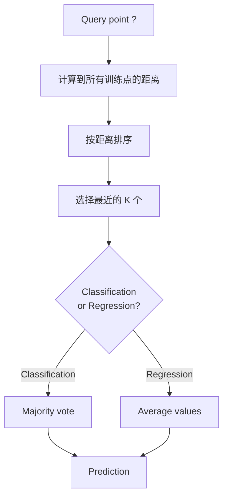
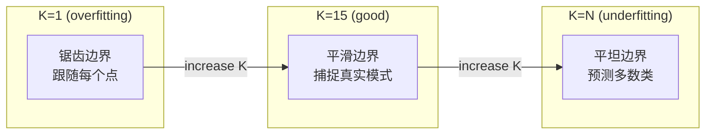
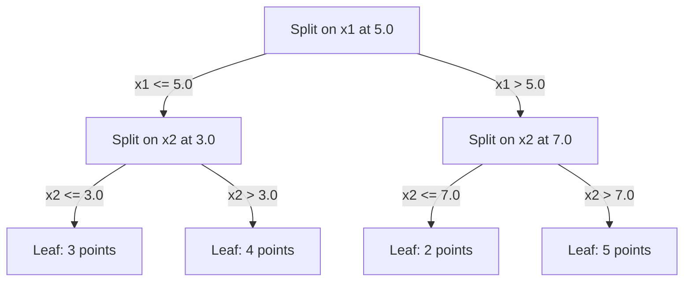

# K-Nearest Neighbors 和距离

> 保存所有数据。预测时看看邻居。最简单却真正有效的算法。

**类型：** 构建
**语言：** Python
**前置要求：** 阶段 1（第 14 课范数与距离）
**时间：** ~90 分钟

## 学习目标

- 使用可配置的 K 和 distance-weighted voting，从零实现 KNN classification 和 regression
- 比较 L1、L2、cosine 和 Minkowski distance metrics，并为给定数据类型选择合适指标
- 解释 curse of dimensionality，并演示为什么 KNN 在高维空间中会退化
- 构建 KD-tree 以高效搜索 nearest neighbors，并分析它什么时候优于 brute-force

## 问题

你有一个数据集。一个新的数据点来了。你需要给它分类或预测它的值。与其从数据中学习 parameters（像 linear regression 或 SVMs 那样），你只要找到距离新点最近的 K 个训练点，让它们投票。

这就是 K-nearest neighbors。它没有训练阶段。没有需要学习的 parameters。没有需要最小化的 loss function。你保存整个训练集，在预测时计算距离。

这听起来简单到不像能用。但 KNN 在很多问题上出奇地有竞争力，尤其是小到中等规模的数据集。深入理解它会揭示一些基本概念：distance metric 的选择（连接到阶段 1 第 14 课）、curse of dimensionality，以及 lazy learning 和 eager learning 的区别。

KNN 也以不同名字出现在现代 AI 各处。Vector databases 会在 embeddings 上做 KNN search。Retrieval-augmented generation（RAG）会找到 K 个最近的文档 chunks。推荐系统会找到相似用户或物品。算法相同，规模和数据结构不同。

## 概念

### KNN 如何工作

给定一个有标签点的数据集和一个新的 query point：

1. 计算 query 到数据集中每个点的距离
2. 按距离排序
3. 取最近的 K 个点
4. 对 classification：K 个 neighbors 做 majority vote
5. 对 regression：对 K 个 neighbors 的值取平均（或加权平均）



这就是完整算法。没有 fitting。没有 gradient descent。没有 epochs。

### 选择 K

K 是唯一的 hyperparameter。它控制 bias-variance trade-off：

| K | 行为 |
|---|----------|
| K = 1 | Decision boundary 跟随每个点。训练误差为零。High variance。过拟合 |
| Small K (3-5) | 对局部结构敏感。能捕捉复杂边界 |
| Large K | 边界更平滑。对噪声更稳健。可能欠拟合 |
| K = N | 对每个点都预测 majority class。Maximum bias |

常见起点是对包含 N 个点的数据集使用 K = sqrt(N)。Binary classification 中使用奇数 K 可以避免平票。



### Distance metrics

Distance function 定义了什么叫“近”。不同 metrics 会产生不同 neighbors、不同预测。

**L2（Euclidean）** 是默认选择。直线距离。

```
d(a, b) = sqrt(sum((a_i - b_i)^2))
```

对 feature scale 敏感。使用 KNN 的 L2 前，一定要 standardize features。

**L1（Manhattan）** 对绝对差求和。比 L2 更抗 outliers，因为它不会平方差值。

```
d(a, b) = sum(|a_i - b_i|)
```

**Cosine distance** 衡量向量之间的夹角，忽略 magnitude。对文本和 embedding data 至关重要。

```
d(a, b) = 1 - (a . b) / (||a|| * ||b||)
```

**Minkowski** 用参数 p 泛化 L1 和 L2。

```
d(a, b) = (sum(|a_i - b_i|^p))^(1/p)

p=1: Manhattan
p=2: Euclidean
p->inf: Chebyshev (max absolute difference)
```

使用哪种 metric 取决于数据：

| Data type | Best metric | Why |
|-----------|------------|-----|
| Numeric features, similar scale | L2 (Euclidean) | 默认，适用于空间数据 |
| Numeric features, outliers | L1 (Manhattan) | 稳健，不放大大差异 |
| Text embeddings | Cosine | Magnitude 是噪声，direction 是含义 |
| High-dimensional sparse | Cosine or L1 | L2 受 curse of dimensionality 影响 |
| Mixed types | Custom distance | 按 feature 类型组合 metrics |

### Weighted KNN

标准 KNN 给所有 K 个 neighbors 相同权重。但距离 0.1 的 neighbor 应该比距离 5.0 的 neighbor 更重要。

**Distance-weighted KNN** 按距离的倒数给每个 neighbor 加权：

```
weight_i = 1 / (distance_i + epsilon)

For classification: weighted vote
For regression:     weighted average = sum(w_i * y_i) / sum(w_i)
```

Epsilon 可以防止 query point 与训练点完全相同时除以零。

Weighted KNN 对 K 的选择不那么敏感，因为 distant neighbors 无论如何贡献都很小。

### Curse of dimensionality

KNN performance 在高维中会退化。这不是模糊担忧，而是数学事实。

**问题 1：距离趋同。** 随着维度增加，最大距离和最小距离的比值趋近 1。所有点都变得离 query 一样“远”。

```
In d dimensions, for random uniform points:

d=2:    max_dist / min_dist = varies widely
d=100:  max_dist / min_dist ~ 1.01
d=1000: max_dist / min_dist ~ 1.001

When all distances are nearly equal, "nearest" is meaningless.
```

**问题 2：体积爆炸。** 为了在固定数据比例内捕捉 K 个 neighbors，你需要把搜索半径扩展到覆盖 feature space 中更大比例的区域。高维中的“neighborhood”会覆盖空间的大部分。

**问题 3：角落占主导。** 在 d 维单位 hypercube 中，大部分体积集中在角落附近，而不是中心。随着 d 增长，内接球包含的体积分数会趋近于零。

实际后果：KNN 在约 20-50 个 features 以内效果较好。再高就需要在应用 KNN 前做 dimensionality reduction（PCA、UMAP、t-SNE），或者使用能利用数据内在低维结构的 tree-based search structures。

### KD-trees：快速 nearest neighbor search

Brute-force KNN 会计算 query 到每个训练点的距离。每次 query 是 O(n * d)。对于大数据集，这太慢。

KD-tree 沿着 feature axes 递归切分空间。每一层都沿一个维度在中位数处 split。



寻找 nearest neighbor 时，先走到包含 query 的 leaf，然后回溯；只有当相邻分区可能包含更近点时，才检查它们。

平均 query time：低维中为 O(log n)。但 KD-trees 在高维（d > 20）会退化到 O(n)，因为回溯时能排除的分支越来越少。

### Ball trees：更适合中等维度

Ball trees 用嵌套 hyperspheres 而不是 axis-aligned boxes 来划分数据。每个节点定义一个 ball（center + radius），包含该 subtree 的所有点。

相对 KD-trees 的优势：
- 在中等维度（最高约 50）效果更好
- 能处理非 axis-aligned structure
- 更紧的 bounding volumes 意味着搜索时能剪掉更多分支

KD-trees 和 ball trees 都是精确算法。对于真正大规模搜索（数百万点、数百维），会改用 approximate nearest neighbor 方法（HNSW、IVF、product quantization）。这些在阶段 1 第 14 课讲过。

### Lazy learning vs eager learning

KNN 是 lazy learner：训练时不做工作，所有工作都发生在预测时。大多数其他算法（linear regression、SVMs、neural networks）是 eager learners：它们在训练时做大量计算来构建紧凑模型，然后预测很快。

| Aspect | Lazy (KNN) | Eager (SVM, neural net) |
|--------|------------|------------------------|
| Training time | O(1)，只存数据 | O(n * epochs) |
| Prediction time | 每次 query O(n * d) | O(d) 或 O(parameters) |
| Memory at prediction | 存储整个训练集 | 只存 model parameters |
| Adapts to new data | 立即添加点 | 重新训练模型 |
| Decision boundary | 隐式，动态计算 | 显式，训练后固定 |

Lazy learning 适合：
- 数据集频繁变化（添加/删除点而不重新训练）
- 只需要为很少的 queries 做预测
- 需要零训练时间
- 数据集足够小，brute-force search 很快

### KNN for regression

KNN regression 不做 majority voting，而是平均 K 个 neighbors 的 target values。

```
prediction = (1/K) * sum(y_i for i in K nearest neighbors)

Or with distance weighting:
prediction = sum(w_i * y_i) / sum(w_i)
where w_i = 1 / distance_i
```

KNN regression 产生分段常数预测（使用 weighting 时是分段平滑）。它无法外推到训练数据范围之外。如果训练 targets 全在 0 到 100 之间，KNN 永远不会预测 200。

## 构建它

### 第 1 步：Distance functions

实现 L1、L2、cosine 和 Minkowski distances。这些直接连接到阶段 1 第 14 课。

```python
import math

def l2_distance(a, b):
    return math.sqrt(sum((ai - bi) ** 2 for ai, bi in zip(a, b)))

def l1_distance(a, b):
    return sum(abs(ai - bi) for ai, bi in zip(a, b))

def cosine_distance(a, b):
    dot_val = sum(ai * bi for ai, bi in zip(a, b))
    norm_a = math.sqrt(sum(ai ** 2 for ai in a))
    norm_b = math.sqrt(sum(bi ** 2 for bi in b))
    if norm_a == 0 or norm_b == 0:
        return 1.0
    return 1.0 - dot_val / (norm_a * norm_b)

def minkowski_distance(a, b, p=2):
    if p == float('inf'):
        return max(abs(ai - bi) for ai, bi in zip(a, b))
    return sum(abs(ai - bi) ** p for ai, bi in zip(a, b)) ** (1 / p)
```

### 第 2 步：KNN classifier 和 regressor

构建完整 KNN，支持可配置 K、distance metric 和可选 distance weighting。

```python
class KNN:
    def __init__(self, k=5, distance_fn=l2_distance, weighted=False,
                 task="classification"):
        self.k = k
        self.distance_fn = distance_fn
        self.weighted = weighted
        self.task = task
        self.X_train = None
        self.y_train = None

    def fit(self, X, y):
        self.X_train = X
        self.y_train = y

    def predict(self, X):
        return [self._predict_one(x) for x in X]
```

### 第 3 步：用于高效搜索的 KD-tree

从零构建 KD-tree，让它在每个维度中位数处递归 split。

```python
class KDTree:
    def __init__(self, X, indices=None, depth=0):
        # Recursively partition the data
        self.axis = depth % len(X[0])
        # Split on median of the current axis
        ...

    def query(self, point, k=1):
        # Traverse to leaf, then backtrack
        ...
```

完整实现、helper methods 和 demos 见 `code/knn.py`。

### 第 4 步：Feature scaling

KNN 需要 feature scaling，因为距离对 feature magnitudes 很敏感。范围 0 到 1000 的 feature 会压倒范围 0 到 1 的 feature。

```python
def standardize(X):
    n = len(X)
    d = len(X[0])
    means = [sum(X[i][j] for i in range(n)) / n for j in range(d)]
    stds = [
        max(1e-10, (sum((X[i][j] - means[j]) ** 2 for i in range(n)) / n) ** 0.5)
        for j in range(d)
    ]
    return [[((X[i][j] - means[j]) / stds[j]) for j in range(d)] for i in range(n)], means, stds
```

## 使用它

使用 scikit-learn：

```python
from sklearn.neighbors import KNeighborsClassifier
from sklearn.preprocessing import StandardScaler
from sklearn.pipeline import Pipeline

clf = Pipeline([
    ("scaler", StandardScaler()),
    ("knn", KNeighborsClassifier(n_neighbors=5, metric="euclidean")),
])
clf.fit(X_train, y_train)
print(f"Accuracy: {clf.score(X_test, y_test):.4f}")
```

当数据集足够大且维度足够低时，scikit-learn 会自动使用 KD-trees 或 ball trees。对于高维数据，它会退回 brute force。你可以用 `algorithm` parameter 控制这个行为。

对于大规模 nearest neighbor search（数百万 vectors），使用 FAISS、Annoy 或 vector database：

```python
import faiss

index = faiss.IndexFlatL2(dimension)
index.add(embeddings)
distances, indices = index.search(query_vectors, k=5)
```

## 练习

1. 在有 3 个类别的二维数据集上实现 KNN classification。分别为 K=1、K=5、K=15 和 K=N 绘制 decision boundary。观察从过拟合到欠拟合的变化。

2. 在 2、5、10、50、100 和 500 维中生成 1000 个随机点。对每个维度，计算最大 pairwise distance 与最小 pairwise distance 的比值。绘制 ratio vs dimensionality，直观看到 curse of dimensionality。

3. 在文本分类问题上（使用 TF-IDF vectors）比较 L1、L2 和 cosine distance。哪个 metric accuracy 最好？为什么 cosine 通常更适合文本？

4. 实现 KD-tree，并在 2D、10D 和 50D 中，针对 1k、10k 和 100k 点的数据集测量 query time vs brute force。KD-tree 在哪个维度开始不再比 brute force 快？

5. 为 y = sin(x) + noise 构建 weighted KNN regressor。把它与 unweighted KNN 在 K=3、10、30 下比较。展示 weighting 会产生更平滑的预测，尤其是在 K 较大时。

## 关键术语

| 术语 | 实际含义 |
|------|----------------------|
| K-nearest neighbors | Non-parametric algorithm，通过寻找离 query 最近的 K 个训练点来预测 |
| Lazy learning | 训练时不计算。所有工作都在预测时发生。KNN 是典型例子 |
| Eager learning | 训练时进行大量计算，构建紧凑模型。多数 ML 算法都是 eager |
| Curse of dimensionality | 高维中距离趋同，neighborhoods 扩大到覆盖空间大部分区域，使 KNN 失效 |
| KD-tree | 沿 feature axes 递归划分空间的 binary tree。低维中 O(log n) query |
| Ball tree | 嵌套 hyperspheres 构成的树。中等维度（最高约 50）中比 KD-trees 更好 |
| Weighted KNN | Neighbors 按距离倒数加权。越近的 neighbors 对预测影响越大 |
| Feature scaling | 把 features 归一化到可比范围。KNN 这类 distance-based methods 必须使用 |
| Majority vote | 通过统计 K 个 neighbors 中哪个 class 最常见来分类 |
| Brute force search | 计算到每个训练点的距离。每次 query O(n*d)。精确但大 n 时很慢 |
| Approximate nearest neighbor | HNSW、LSH、IVF 等算法，以比 exact search 快得多的速度找到近似最近点 |
| Voronoi diagram | 空间划分，其中每个区域包含所有比其他训练点更接近某个训练点的点。K=1 KNN 产生 Voronoi boundaries |

## 延伸阅读

- [Cover & Hart: Nearest Neighbor Pattern Classification (1967)](https://ieeexplore.ieee.org/document/1053964) - KNN 奠基论文，证明其错误率最多为 Bayes optimal 的两倍
- [Friedman, Bentley, Finkel: An Algorithm for Finding Best Matches in Logarithmic Expected Time (1977)](https://dl.acm.org/doi/10.1145/355744.355745) - KD-tree 原始论文
- [Beyer et al.: When Is "Nearest Neighbor" Meaningful? (1999)](https://link.springer.com/chapter/10.1007/3-540-49257-7_15) - nearest neighbor 中 curse of dimensionality 的形式化分析
- [scikit-learn Nearest Neighbors documentation](https://scikit-learn.org/stable/modules/neighbors.html) - 实用指南，包含算法选择
- [FAISS: A Library for Efficient Similarity Search](https://github.com/facebookresearch/faiss) - Meta 的 billion-scale approximate nearest neighbor search 库
