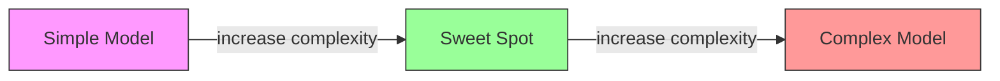
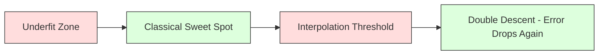
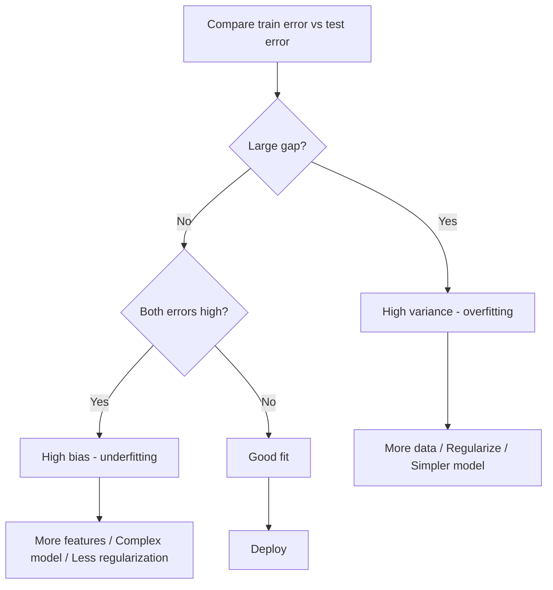
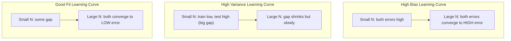
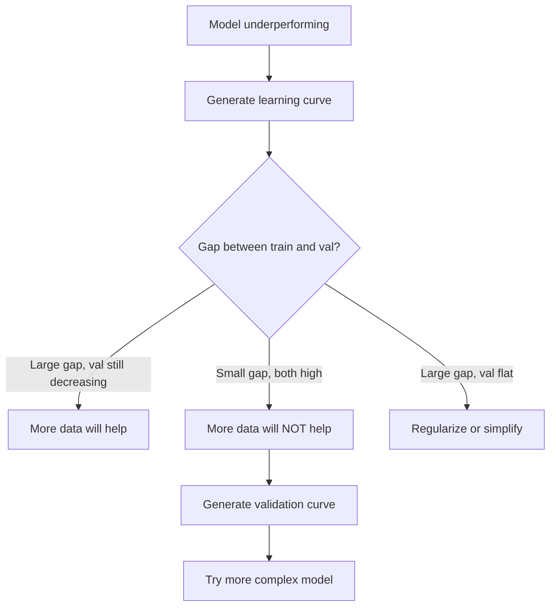

# Bias-Variance Tradeoff

> 每个模型误差都来自三种来源之一：bias、variance 或 noise。你只能控制前两者。

**类型：** 学习
**语言：** Python
**前置要求：** 阶段 2，第 01-09 课（ML 基础、回归、分类、评估）
**时间：** ~75 分钟

## 学习目标

- 推导 expected prediction error 的 bias-variance decomposition，并解释 irreducible noise 的作用
- 使用 training 和 test error patterns 诊断模型是否存在 high bias 或 high variance
- 解释 regularization techniques（L1、L2、dropout、early stopping）如何用 bias 换 variance
- 实现实验，跨不同复杂度模型可视化 bias-variance tradeoff

## 问题

你训练了一个模型。它在 test data 上有一些误差。这个误差从哪里来？

如果模型太简单（在曲线数据上用 linear regression），它会持续错过真实模式。这就是 bias。如果模型太复杂（用 20 次多项式拟合 15 个数据点），它会完美拟合训练数据，但在新数据上给出剧烈变化的预测。这就是 variance。

在固定 model capacity 下，你无法同时最小化两者。压低 bias，variance 就会上升。压低 variance，bias 就会上升。理解这个 tradeoff 是机器学习中最有用的诊断技能。它告诉你该让模型更复杂还是更简单，该获取更多数据还是工程化更好的 features，该增加还是减少 regularization。

## 概念

### Bias：系统性误差

Bias 衡量模型平均预测离真实值有多远。如果你在来自同一分布的许多不同训练集上训练同一个模型，并对预测取平均，bias 就是这个平均值与真相之间的差距。

High bias 表示模型太僵硬，无法捕捉真实模式。用直线拟合抛物线，无论给多少数据都会错过曲线。这就是 underfitting。

```
High bias (underfitting):
  Model always predicts roughly the same wrong thing.
  Training error: HIGH
  Test error: HIGH
  Gap between them: SMALL
```

### Variance：对训练数据的敏感性

Variance 衡量当你在不同数据子集上训练时，预测会变化多少。如果训练集的小变化导致模型大幅变化，variance 就高。

High variance 表示模型拟合的是训练数据中的噪声，而不是底层信号。20 次多项式会穿过每个训练点，但在点之间剧烈震荡。这就是 overfitting。

```
High variance (overfitting):
  Model fits training data perfectly but fails on new data.
  Training error: LOW
  Test error: HIGH
  Gap between them: LARGE
```

### 分解

对于任意点 x，在 squared loss 下，expected prediction error 可以精确分解：

```
Expected Error = Bias^2 + Variance + Irreducible Noise

where:
  Bias^2   = (E[f_hat(x)] - f(x))^2
  Variance = E[(f_hat(x) - E[f_hat(x)])^2]
  Noise    = E[(y - f(x))^2]             (sigma^2)
```

- `f(x)` 是真实函数
- `f_hat(x)` 是你的模型预测
- `E[...]` 是对不同 training sets 的期望
- `y` 是观测标签（真实函数加噪声）

Noise 项是不可约的。任何模型在 noisy data 上都无法低于 sigma^2。你的任务是在 bias^2 和 variance 之间找到正确平衡。

### Model Complexity vs Error



经典 U 形曲线：

| Complexity | Bias | Variance | Total Error |
|-----------|------|----------|-------------|
| Too low | HIGH | LOW | HIGH (underfitting) |
| Just right | MODERATE | MODERATE | LOWEST |
| Too high | LOW | HIGH | HIGH (overfitting) |

### Regularization 作为 Bias-Variance 控制

Regularization 会有意增加 bias 来降低 variance。它约束模型，使它不能追逐噪声。

- **L2（Ridge）：** 把所有 weights 向零收缩。保留所有 features，但降低它们的影响。
- **L1（Lasso）：** 把一些 weights 精确推到零。执行 feature selection。
- **Dropout：** 训练时随机禁用 neurons。迫使模型学习冗余表示。
- **Early stopping：** 在模型完全拟合训练数据前停止训练。

Regularization strength（lambda、dropout rate、epochs 数）直接控制你处在 bias-variance 曲线的哪个位置。更多 regularization 意味着更高 bias、更低 variance。

### Double Descent：现代视角

经典理论说：过了 sweet spot，复杂度增加总是有害。但 2019 年以来的研究发现了意外现象。如果继续把 model capacity 增加到远超过 interpolation threshold（模型有足够 parameters 完美拟合训练数据的点），test error 可能再次下降。



这种 “double descent” 现象解释了为什么高度 overparameterized neural networks（parameters 远多于训练样本）仍然能很好泛化。经典 bias-variance tradeoff 没错，但对现代 regime 来说不完整。

关于 double descent 的关键观察：
- 它会出现在 linear models、decision trees 和 neural networks 中
- 更多数据在 interpolation region 中甚至可能伤害性能（sample-wise double descent）
- 更多 training epochs 也可能导致它（epoch-wise double descent）
- Regularization 会平滑峰值，但不会完全消除它

为什么会这样？在 interpolation threshold，模型刚好有足够 capacity 拟合所有训练点。它被迫进入一个非常具体、穿过每个点的解，数据的微小扰动会导致拟合大幅变化。这就是 variance 峰值。超过 threshold 后，模型有许多能完美拟合数据的解。学习算法（例如带 implicit regularization 的 gradient descent）倾向于从中选择最简单的一个。这种偏向简单解的 implicit bias，是 overparameterized models 能泛化的原因。

| Regime | Parameters vs Samples | Behavior |
|--------|----------------------|----------|
| Underparameterized | p << n | Classical tradeoff applies |
| Interpolation threshold | p ~ n | Variance peaks, test error spikes |
| Overparameterized | p >> n | Implicit regularization kicks in, test error drops |

实际上：如果你使用 neural networks 或大型 tree ensembles，不要停在 interpolation threshold。要么远低于它（使用 explicit regularization），要么远超过它。最糟的位置正是在 threshold 附近。

### 诊断你的模型



| Symptom | Diagnosis | Fix |
|---------|-----------|-----|
| High train error, high test error | Bias | More features, complex model, less regularization |
| Low train error, high test error | Variance | More data, regularization, simpler model, dropout |
| Low train error, low test error | Good fit | Ship it |
| Train error decreasing, test error increasing | Overfitting in progress | Early stopping |

### 实用策略

**当问题是 bias：**
- 添加 polynomial 或 interaction features
- 使用更灵活的模型（tree ensemble 而不是 linear）
- 降低 regularization strength
- 训练更久（如果还没收敛）

**当问题是 variance：**
- 获取更多训练数据
- 使用 bagging（random forests）
- 增加 regularization（更高 lambda、更多 dropout）
- Feature selection（移除 noisy features）
- 使用 cross-validation 尽早发现它

### Ensemble Methods 和 Variance Reduction

Ensemble methods 是对抗 variance 最实用的工具。

**Bagging（Bootstrap Aggregating）** 会在训练数据的不同 bootstrap samples 上训练多个模型，然后平均它们的预测。每个单独模型有 high variance，但平均后 variance 大幅降低。Random forests 就是把 bagging 应用到 decision trees。

数学上它为什么有效：如果你平均 N 个独立预测，每个预测 variance 为 sigma^2，那么平均值的 variance 是 sigma^2 / N。这些模型并不真正独立（它们都看到相似数据），所以下降幅度小于 1/N，但仍然很显著。

**Boosting** 通过顺序构建模型来降低 bias，每个新模型关注当前 ensemble 的错误。Gradient boosting 和 AdaBoost 是主要例子。如果添加太多模型，boosting 可能过拟合，所以需要 early stopping 或 regularization。

| Method | Primary Effect | Bias Change | Variance Change |
|--------|---------------|-------------|-----------------|
| Bagging | Reduces variance | No change | Decreases |
| Boosting | Reduces bias | Decreases | Can increase |
| Stacking | Reduces both | Depends on meta-learner | Depends on base models |
| Dropout | Implicit bagging | Slight increase | Decreases |

**实用规则：** 如果 base model 有 high variance（深树、高阶多项式），使用 bagging。如果 base model 有 high bias（浅 stumps、简单 linear models），使用 boosting。

### Learning Curves

Learning curves 绘制 training 和 validation error 随 training set size 的变化。它们是你拥有的最实用诊断工具。不同于单次 train/test 比较，learning curves 展示模型轨迹，并告诉你更多数据是否有帮助。



如何阅读：

| Scenario | Training Error | Validation Error | Gap | What It Means | What to Do |
|----------|---------------|-----------------|-----|---------------|------------|
| High bias | High | High | Small | 模型无法捕捉模式 | More features, complex model, less regularization |
| High variance | Low | High | Large | 模型记住训练数据 | More data, regularization, simpler model |
| Good fit | Moderate | Moderate | Small | 模型泛化良好 | Ship it |
| High variance, improving | Low | Decreasing with more data | Shrinking | 数据可以修复的 variance 问题 | Collect more data |
| High bias, flat | High | High and flat | Small and flat | 更多数据没有帮助 | Change model architecture |

关键洞见：如果两条曲线都进入平台期，gap 很小但两个 errors 都高，更多数据没用。你需要更好的模型。如果 gap 很大且仍在缩小，更多数据会有帮助。

### 如何生成 Learning Curves

有两种方法：

**方法 1：改变 training set size，固定模型。** 保持模型和 hyperparameters 不变。在越来越大的训练子集上训练。在每个 size 下测量 training error 和 validation error。这是标准 learning curve。

**方法 2：改变 model complexity，固定数据。** 保持数据不变。扫描一个 complexity parameter（polynomial degree、tree depth、layers 数）。在每个 complexity 下测量 training error 和 validation error。这是 validation curve，可以直接展示 bias-variance tradeoff。

两种方法互补。第一种告诉你更多数据是否有帮助。第二种告诉你换模型是否有帮助。在决定下一步之前，两者都跑一遍。



## 构建它

`code/bias_variance.py` 中的代码会运行完整的 bias-variance decomposition 实验。下面是分步方法。

### 第 1 步：从已知函数生成合成数据

我们使用带 Gaussian noise 的 `f(x) = sin(1.5x) + 0.5x`。知道真实函数让我们可以计算精确 bias 和 variance。

```python
def true_function(x):
    return np.sin(1.5 * x) + 0.5 * x

def generate_data(n_samples=30, noise_std=0.5, x_range=(-3, 3), seed=None):
    rng = np.random.RandomState(seed)
    x = rng.uniform(x_range[0], x_range[1], n_samples)
    y = true_function(x) + rng.normal(0, noise_std, n_samples)
    return x, y
```

### 第 2 步：Bootstrap Sampling 和 Polynomial Fitting

对每个 polynomial degree，我们抽取许多 bootstrap training sets，拟合多项式，并在固定 test grid 上记录预测。这会给出每个 test point 上的预测分布。

```python
def fit_polynomial(x_train, y_train, degree, lam=0.0):
    X = np.column_stack([x_train ** d for d in range(degree + 1)])
    if lam > 0:
        penalty = lam * np.eye(X.shape[1])
        penalty[0, 0] = 0
        w = np.linalg.solve(X.T @ X + penalty, X.T @ y_train)
    else:
        w = np.linalg.lstsq(X, y_train, rcond=None)[0]
    return w
```

我们在 200 个不同 bootstrap samples 上拟合。每个 bootstrap sample 都来自同一个底层分布，但包含不同点。

### 第 3 步：计算 Bias^2、Variance Decomposition

有了每个 test point 上的 200 组预测，我们就可以按定义直接计算分解：

```python
mean_pred = predictions.mean(axis=0)
bias_sq = np.mean((mean_pred - y_true) ** 2)
variance = np.mean(predictions.var(axis=0))
total_error = np.mean(np.mean((predictions - y_true) ** 2, axis=1))
```

- `mean_pred` 是从 bootstrap samples 估计出的 E[f_hat(x)]
- `bias_sq` 是平均预测和真相之间 gap 的平方
- `variance` 是 bootstrap samples 间预测 spread 的平均值
- `total_error` 应该近似等于 bias^2 + variance + noise

### 第 4 步：Learning Curves

Learning curves 会扫描 training set size，同时固定 model complexity。它们展示模型是 data-limited 还是 capacity-limited。

```python
def demo_learning_curves():
    sizes = [10, 15, 20, 30, 50, 75, 100, 150, 200, 300]
    degree = 5

    for n in sizes:
        train_errors = []
        test_errors = []
        for seed in range(50):
            x_train, y_train = generate_data(n_samples=n, seed=seed * 100)
            w = fit_polynomial(x_train, y_train, degree)
            train_pred = predict_polynomial(x_train, w)
            train_mse = np.mean((train_pred - y_train) ** 2)
            test_pred = predict_polynomial(x_test, w)
            test_mse = np.mean((test_pred - y_test) ** 2)
            train_errors.append(train_mse)
            test_errors.append(test_mse)
        # Average over runs gives the learning curve point
```

对于 high-variance model（小数据上的 degree 5），你会看到：
- Training error 一开始很低，随着更多数据让记忆变难而上升
- Test error 一开始很高，随着模型获得更多信号而下降
- Gap 随更多数据缩小

对于 high-bias model（degree 1），两个 errors 都会快速收敛到相同的高值，更多数据没有帮助。

### 第 5 步：Regularization Sweep

代码还包含 `demo_regularization_sweep()`，它固定一个高阶多项式（degree 15），并把 Ridge regularization strength 从 0.001 扫描到 100。这从另一个角度展示 bias-variance tradeoff：不是改变 model complexity，而是改变约束强度。

```python
def demo_regularization_sweep():
    alphas = [0.001, 0.005, 0.01, 0.05, 0.1, 0.5, 1.0, 5.0, 10.0, 50.0, 100.0]
    for alpha in alphas:
        results = bias_variance_decomposition([15], lam=alpha)
        r = results[15]
        print(f"alpha={alpha:.3f}  bias={r['bias_sq']:.4f}  var={r['variance']:.4f}")
```

低 alpha 下，degree-15 polynomial 几乎不受约束。Variance 主导，因为模型追逐每个 bootstrap sample 中的噪声。高 alpha 下，惩罚太强，模型实际上接近常数函数。Bias 主导。最优 alpha 位于两个极端之间。

这就是通过改变 polynomial degree 得到的同一条 U 曲线，只是现在用连续旋钮而非离散选择来控制。实践中，regularization 是控制 tradeoff 的首选方式，因为它能细粒度控制，而不用改变 feature set。

## 使用它

sklearn 提供 `learning_curve` 和 `validation_curve`，可以自动化这些诊断，不需要手写 bootstrap loops。

### Validation Curve：扫描 Model Complexity

```python
from sklearn.model_selection import validation_curve
from sklearn.pipeline import make_pipeline
from sklearn.preprocessing import PolynomialFeatures
from sklearn.linear_model import Ridge

degrees = list(range(1, 16))
train_scores_all = []
val_scores_all = []

for d in degrees:
    pipe = make_pipeline(PolynomialFeatures(d), Ridge(alpha=0.01))
    train_scores, val_scores = validation_curve(
        pipe, X, y, param_name="polynomialfeatures__degree",
        param_range=[d], cv=5, scoring="neg_mean_squared_error"
    )
    train_scores_all.append(-train_scores.mean())
    val_scores_all.append(-val_scores.mean())
```

这会直接给出 bias-variance tradeoff 曲线。当 validation score 相对 train score 最差时，variance 主导。当两者都差时，bias 主导。

### Learning Curve：扫描 Training Set Size

```python
from sklearn.model_selection import learning_curve

pipe = make_pipeline(PolynomialFeatures(5), Ridge(alpha=0.01))
train_sizes, train_scores, val_scores = learning_curve(
    pipe, X, y, train_sizes=np.linspace(0.1, 1.0, 10),
    cv=5, scoring="neg_mean_squared_error"
)
train_mse = -train_scores.mean(axis=1)
val_mse = -val_scores.mean(axis=1)
```

把 `train_mse` 和 `val_mse` 对 `train_sizes` 作图。形状会告诉你关于模型的一切。

### Cross-Validation with Regularization Sweep

```python
from sklearn.model_selection import cross_val_score

alphas = [0.001, 0.01, 0.1, 1.0, 10.0, 100.0]
for alpha in alphas:
    pipe = make_pipeline(PolynomialFeatures(10), Ridge(alpha=alpha))
    scores = cross_val_score(pipe, X, y, cv=5, scoring="neg_mean_squared_error")
    print(f"alpha={alpha:>7.3f}  MSE={-scores.mean():.4f} +/- {scores.std():.4f}")
```

这会对固定 model complexity 扫描 regularization strength。你会看到同样的 bias-variance tradeoff：低 alpha 意味着 high variance，高 alpha 意味着 high bias。

### 合在一起：完整诊断工作流

实践中，你按顺序运行这些诊断：

1. 训练模型。计算 train 和 test error。
2. 如果两者都高：你有 bias 问题。跳到第 4 步。
3. 如果 train 低但 test 高：你有 variance 问题。生成 learning curve，看看更多数据是否有帮助。如果没有，就 regularize。
4. 生成 validation curve，扫描主要 complexity parameter。找到 sweet spot。
5. 在 sweet spot 处生成 learning curve。如果 gap 仍然大，你需要更多数据或 regularization。
6. 使用 `cross_val_score` 尝试不同 alpha 的 Ridge/Lasso。选择 cross-validated error 最低的 alpha。

对多数 tabular datasets 来说，这需要 10-15 分钟计算，却能省下几小时猜测。

## 交付它

本课会产出：`outputs/prompt-model-diagnostics.md`

## 练习

1. 使用 `noise_std=0`（无噪声）运行分解。Irreducible error term 会发生什么？最优复杂度会改变吗？

2. 把 training set size 从 30 增加到 300。这会如何影响 variance component？最优 polynomial degree 会移动吗？

3. 向实验中添加 L2 regularization（Ridge regression）。对固定的高阶多项式（degree 15），把 lambda 从 0 扫描到 100。绘制 bias^2 和 variance 随 lambda 变化的曲线。

4. 把 true function 从多项式改成 `sin(x)`。Bias-variance decomposition 会如何改变？仍然有清晰的最优 degree 吗？

5. 实现一个简单 bootstrap aggregating（bagging）wrapper：在 bootstrap samples 上训练 10 个模型，并平均预测。展示这能在几乎不增加 bias 的情况下降低 variance。

## 关键术语

| 术语 | 人们常说 | 实际含义 |
|------|----------------|----------------------|
| Bias | “模型太简单” | 来自错误假设的系统性误差。平均模型预测与真相之间的差距。 |
| Variance | “模型过拟合” | 来自对 training data 敏感性的误差。预测在不同 training sets 间变化多少。 |
| Irreducible error | “数据里的噪声” | 来自真实数据生成过程随机性的误差。任何模型都无法消除。 |
| Underfitting | “学得不够” | 模型有 high bias。即使在训练数据上也错过真实模式。 |
| Overfitting | “记住数据” | 模型有 high variance。它拟合了不能泛化的训练数据噪声。 |
| Regularization | “约束模型” | 添加惩罚项来降低 model complexity，用 bias 换更低 variance。 |
| Double descent | “更多 parameters 也可能有帮助” | 当 model capacity 远超 interpolation threshold 时，test error 会再次下降。 |
| Model complexity | “模型有多灵活” | 模型拟合任意模式的能力。由 architecture、features 或 regularization 控制。 |

## 延伸阅读

- [Hastie, Tibshirani, Friedman: Elements of Statistical Learning, Ch. 7](https://hastie.su.domains/ElemStatLearn/) -- bias-variance decomposition 的权威讲解
- [Belkin et al., Reconciling modern machine learning practice and the bias-variance trade-off (2019)](https://arxiv.org/abs/1812.11118) -- double descent 论文
- [Nakkiran et al., Deep Double Descent (2019)](https://arxiv.org/abs/1912.02292) -- epoch-wise 和 sample-wise double descent
- [Scott Fortmann-Roe: Understanding the Bias-Variance Tradeoff](http://scott.fortmann-roe.com/docs/BiasVariance.html) -- 清晰的可视化解释
