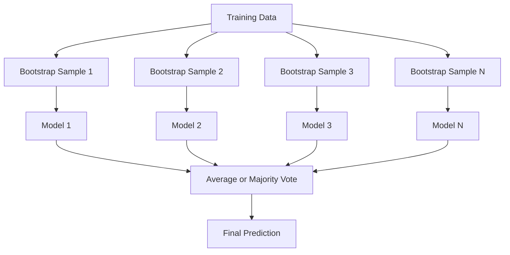
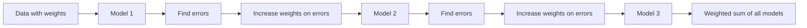
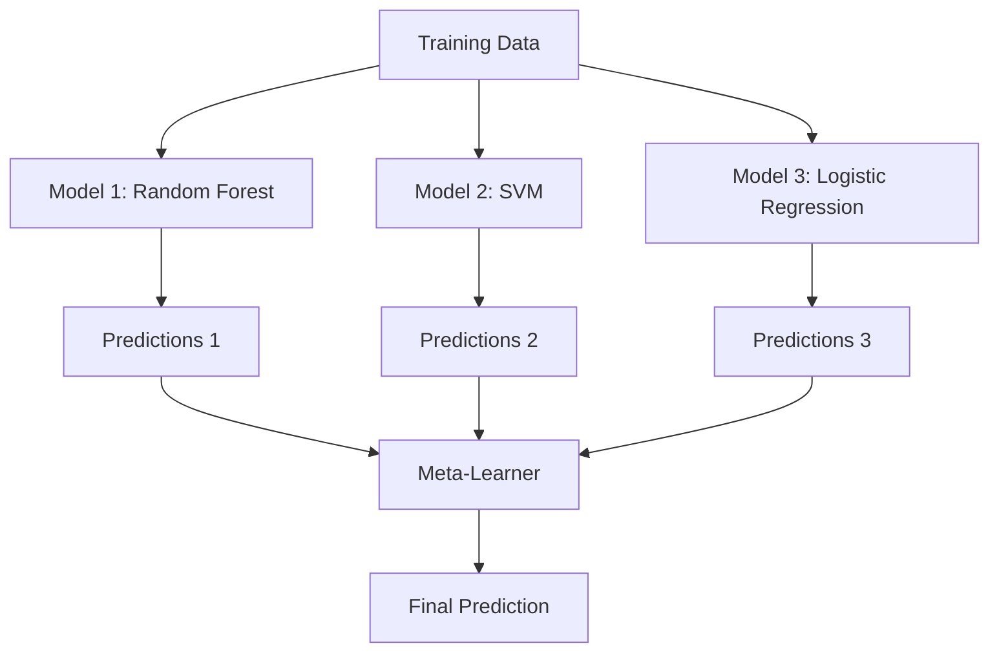

# Ensemble Methods

> 一组 weak learners，只要组合正确，就会变成 strong learner。这不是比喻，而是定理。

**类型：** 构建
**语言：** Python
**前置要求：** 阶段 2，第 10 课（Bias-Variance Tradeoff）
**时间：** ~120 分钟

## 学习目标

- 从零实现 AdaBoost 和 gradient boosting，并解释 boosting 如何顺序降低 bias
- 构建 bagging ensemble，并演示平均去相关模型如何在不增加 bias 的情况下降低 variance
- 从每种方法针对哪个 error component 的角度比较 bagging、boosting 和 stacking
- 评估 ensemble diversity，并解释为什么更多独立 weak learners 的 majority voting accuracy 会提升

## 问题

单棵 decision tree 训练快、容易解释，但会过拟合。单个 linear model 在复杂边界上会欠拟合。你可以花几天设计完美的 model architecture。或者，你可以把一堆不完美模型组合起来，得到一个比任何单个模型都更好的东西。

Ensemble methods 正是这样做的。它们是在 tabular data 上赢得 Kaggle 比赛最可靠的技术，支撑许多生产 ML 系统，并且生动展示了 bias-variance tradeoff。Bagging 降低 variance。Boosting 降低 bias。Stacking 学习在什么输入上信任哪个模型。

## 概念

### 为什么 Ensembles 有效

假设你有 N 个独立 classifiers，每个 accuracy 都是 p > 0.5。Majority vote 的 accuracy 是：

```
P(majority correct) = sum over k > N/2 of C(N,k) * p^k * (1-p)^(N-k)
```

对于 21 个 accuracy 为 60% 的 classifiers，majority vote accuracy 约为 74%。对于 101 个 classifiers，会升到 84%。当模型犯不同错误时，错误会相互抵消。

关键要求是 **diversity**。如果所有模型犯同样错误，组合它们没有任何帮助。Ensembles 有效，是因为它们通过以下方式产生 diverse models：

- 不同 training subsets（bagging）
- 不同 feature subsets（random forests）
- 顺序错误修正（boosting）
- 不同 model families（stacking）

### Bagging（Bootstrap Aggregating）

Bagging 通过在不同 bootstrap sample 上训练每个模型来创造 diversity。



Bootstrap sample 是从原始数据中有放回抽样得到的，大小与原始数据相同。每个 bootstrap 中大约会出现 63.2% 的唯一样本。剩余 36.8%（out-of-bag samples）提供了免费的 validation set。

Bagging 会降低 variance，而几乎不增加 bias。每棵单独的树都会过拟合自己的 bootstrap sample，但每棵树过拟合的方式不同，因此平均会抵消噪声。

**Random Forests** 是带一个额外变化的 bagging：每次 split 时只考虑随机 feature subset。这会迫使 trees 之间更有 diversity。分类时典型候选 feature 数是 `sqrt(n_features)`，回归时是 `n_features / 3`。

### Boosting（顺序错误修正）

Boosting 顺序训练模型。每个新模型都关注之前模型做错的样本。



Boosting 降低 bias。每个新模型都会修正当前 ensemble 的系统性错误。最终预测是所有模型的 weighted sum，表现更好的模型有更高权重。

权衡在于：如果运行太多轮，boosting 可能过拟合，因为它会持续拟合更难的样本，其中一些可能是噪声。

### AdaBoost

AdaBoost（Adaptive Boosting）是第一个实用 boosting 算法。它适用于任意 base learner，通常是 decision stumps（depth-1 trees）。

算法：

```
1. Initialize sample weights: w_i = 1/N for all i

2. For t = 1 to T:
   a. Train weak learner h_t on weighted data
   b. Compute weighted error:
      err_t = sum(w_i * I(h_t(x_i) != y_i)) / sum(w_i)
   c. Compute model weight:
      alpha_t = 0.5 * ln((1 - err_t) / err_t)
   d. Update sample weights:
      w_i = w_i * exp(-alpha_t * y_i * h_t(x_i))
   e. Normalize weights to sum to 1

3. Final prediction: H(x) = sign(sum(alpha_t * h_t(x)))
```

Error 更低的模型得到更高 alpha。被误分类的样本得到更高权重，使下一个模型关注它们。

### Gradient Boosting

Gradient boosting 把 boosting 泛化到任意 loss functions。它不重新加权样本，而是让每个新模型拟合当前 ensemble 的 residuals（loss 的 negative gradient）。

```
1. Initialize: F_0(x) = argmin_c sum(L(y_i, c))

2. For t = 1 to T:
   a. Compute pseudo-residuals:
      r_i = -dL(y_i, F_{t-1}(x_i)) / dF_{t-1}(x_i)
   b. Fit a tree h_t to the residuals r_i
   c. Find optimal step size:
      gamma_t = argmin_gamma sum(L(y_i, F_{t-1}(x_i) + gamma * h_t(x_i)))
   d. Update:
      F_t(x) = F_{t-1}(x) + learning_rate * gamma_t * h_t(x)

3. Final prediction: F_T(x)
```

对于 squared error loss，pseudo-residuals 就是真正 residuals：`r_i = y_i - F_{t-1}(x_i)`。每棵树实际上都在拟合前一个 ensemble 的错误。

Learning rate（shrinkage）控制每棵树贡献多少。更小 learning rate 需要更多 trees，但泛化更好。典型值：0.01 到 0.3。

### XGBoost：为什么它主导 Tabular Data

XGBoost（eXtreme Gradient Boosting）是加入工程优化后的 gradient boosting，使它快速、准确且抗过拟合：

- **Regularized objective：** 对 leaf weights 加 L1 和 L2 penalties，防止单棵树过度自信
- **Second-order approximation：** 使用 loss 的一阶和二阶导数，做出更好的 split decisions
- **Sparsity-aware splits：** 原生处理 missing values，在每个 split 处学习 missing data 的最佳方向
- **Column subsampling：** 像 random forests 一样，在每次 split 采样 features 来增加 diversity
- **Weighted quantile sketch：** 在分布式数据上高效寻找 continuous features 的 split points
- **Cache-aware block structure：** 为 CPU cache lines 优化的内存布局

对 tabular data 来说，XGBoost（以及它的后继 LightGBM）长期优于 neural networks。短期内这不会改变。如果你的数据是行列形式的表，从 gradient boosting 开始。

### Stacking（Meta-Learning）

Stacking 把多个 base models 的预测作为 meta-learner 的 features。



Meta-learner 学习在什么输入上信任哪个 base model。如果 random forest 在某些区域更好，SVM 在另一些区域更好，meta-learner 会学会相应路由。

为避免 data leakage，base model predictions 必须通过 training set 上的 cross-validation 生成。你永远不能在同一数据上训练 base models 并生成 meta-features。

### Voting

最简单的 ensemble。直接组合预测。

- **Hard voting：** 对 class labels 做 majority vote。
- **Soft voting：** 平均 predicted probabilities，选择平均概率最高的 class。通常更好，因为它使用了 confidence information。

## 构建它

### 第 1 步：Decision Stump（Base Learner）

`code/ensembles.py` 中的代码从零实现所有内容。我们从 decision stump 开始：一棵只有单次 split 的树。

```python
class DecisionStump:
    def __init__(self):
        self.feature_idx = None
        self.threshold = None
        self.polarity = 1
        self.alpha = None

    def fit(self, X, y, weights):
        n_samples, n_features = X.shape
        best_error = float("inf")

        for f in range(n_features):
            thresholds = np.unique(X[:, f])
            for thresh in thresholds:
                for polarity in [1, -1]:
                    pred = np.ones(n_samples)
                    pred[polarity * X[:, f] < polarity * thresh] = -1
                    error = np.sum(weights[pred != y])
                    if error < best_error:
                        best_error = error
                        self.feature_idx = f
                        self.threshold = thresh
                        self.polarity = polarity

    def predict(self, X):
        n = X.shape[0]
        pred = np.ones(n)
        idx = self.polarity * X[:, self.feature_idx] < self.polarity * self.threshold
        pred[idx] = -1
        return pred
```

### 第 2 步：从零实现 AdaBoost

```python
class AdaBoostScratch:
    def __init__(self, n_estimators=50):
        self.n_estimators = n_estimators
        self.stumps = []
        self.alphas = []

    def fit(self, X, y):
        n = X.shape[0]
        weights = np.full(n, 1 / n)

        for _ in range(self.n_estimators):
            stump = DecisionStump()
            stump.fit(X, y, weights)
            pred = stump.predict(X)

            err = np.sum(weights[pred != y])
            err = np.clip(err, 1e-10, 1 - 1e-10)

            alpha = 0.5 * np.log((1 - err) / err)
            weights *= np.exp(-alpha * y * pred)
            weights /= weights.sum()

            stump.alpha = alpha
            self.stumps.append(stump)
            self.alphas.append(alpha)

    def predict(self, X):
        total = sum(a * s.predict(X) for a, s in zip(self.alphas, self.stumps))
        return np.sign(total)
```

### 第 3 步：从零实现 Gradient Boosting

```python
class GradientBoostingScratch:
    def __init__(self, n_estimators=100, learning_rate=0.1, max_depth=3):
        self.n_estimators = n_estimators
        self.lr = learning_rate
        self.max_depth = max_depth
        self.trees = []
        self.initial_pred = None

    def fit(self, X, y):
        self.initial_pred = np.mean(y)
        current_pred = np.full(len(y), self.initial_pred)

        for _ in range(self.n_estimators):
            residuals = y - current_pred
            tree = SimpleRegressionTree(max_depth=self.max_depth)
            tree.fit(X, residuals)
            update = tree.predict(X)
            current_pred += self.lr * update
            self.trees.append(tree)

    def predict(self, X):
        pred = np.full(X.shape[0], self.initial_pred)
        for tree in self.trees:
            pred += self.lr * tree.predict(X)
        return pred
```

### 第 4 步：与 sklearn 对比

代码会验证我们的从零实现与 sklearn 的 `AdaBoostClassifier` 和 `GradientBoostingClassifier` 产生相近 accuracy，并把所有方法并排比较。

## 使用它

### 什么时候使用哪种方法

| Method | Reduces | Best for | Watch out for |
|--------|---------|----------|---------------|
| Bagging / Random Forest | Variance | Noisy data, many features | 不能解决 bias |
| AdaBoost | Bias | 干净数据、简单 base learners | 对 outliers 和 noise 敏感 |
| Gradient Boosting | Bias | Tabular data、比赛 | 训练慢，不调参容易过拟合 |
| XGBoost / LightGBM | Both | 生产 tabular ML | Hyperparameters 很多 |
| Stacking | Both | 最后 1-2% accuracy | 复杂，meta-learner 有过拟合风险 |
| Voting | Variance | 快速组合 diverse models | 只有 models diverse 时才有帮助 |

### Tabular Data 的生产栈

对大多数 tabular prediction problems，按这个顺序尝试：

1. 使用默认参数的 **LightGBM 或 XGBoost**
2. 调 n_estimators、learning_rate、max_depth、min_child_weight
3. 如果还需要最后 0.5%，用 3-5 个 diverse models 构建 stacking ensemble
4. 全程使用 cross-validation

Neural networks 在 tabular data 上几乎总是弱于 gradient boosting，尽管研究仍在持续。TabNet、NODE 等架构偶尔能追平，但很少击败调好的 XGBoost。

## 交付它

本课会产出 `outputs/prompt-ensemble-selector.md`，这是一个帮助你为给定数据集选择合适 ensemble method 的 prompt。描述你的数据（大小、feature types、noise level、class balance）和要解决的问题。这个 prompt 会走过一份决策清单，推荐方法，建议初始 hyperparameters，并提醒该方法的常见错误。还会产出 `outputs/skill-ensemble-builder.md`，包含完整选择指南。

## 练习

1. 修改 AdaBoost 实现，跟踪每一轮后的 training accuracy。绘制 accuracy vs. number of estimators。它什么时候收敛？

2. 通过向 regression tree 添加 random feature subsampling，从零实现 random forest。用 `max_features=sqrt(n_features)` 训练 100 棵树并平均预测。比较它相对单棵树的 variance reduction。

3. 在 gradient boosting 实现中加入 early stopping：每轮后跟踪 validation loss，如果连续 10 轮没有改善就停止。它实际需要多少棵树？

4. 构建一个 stacking ensemble，包含三个 base models（logistic regression、decision tree、k-nearest neighbors）和一个 logistic regression meta-learner。使用 5-fold cross-validation 生成 meta-features。与每个 base model 单独表现比较。

5. 在同一数据集上运行默认参数的 XGBoost。把它的 accuracy 与你的从零 gradient boosting 比较。给两者计时。速度差有多大？

## 关键术语

| 术语 | 人们常说 | 实际含义 |
|------|----------------|----------------------|
| Bagging | “在随机子集上训练” | Bootstrap aggregating：在 bootstrap samples 上训练模型，平均预测以降低 variance |
| Boosting | “关注难例” | 顺序训练模型，每个都修正当前 ensemble 的错误，以降低 bias |
| AdaBoost | “重新加权数据” | 通过 sample weight updates 做 boosting；误分类点在下一个 learner 中获得更高权重 |
| Gradient boosting | “拟合 residuals” | 通过让每个新模型拟合 loss function 的 negative gradient 来做 boosting |
| XGBoost | “Kaggle 武器” | 带 regularization、二阶优化和系统级加速技巧的 gradient boosting |
| Stacking | “模型叠模型” | 把 base models 的预测作为 meta-learner 的输入 features |
| Random forest | “许多随机树” | 使用 decision trees 的 bagging，并在每次 split 加入 random feature subsampling 来增加 diversity |
| Ensemble diversity | “犯不同错误” | 模型错误必须不相关，ensemble 才能优于单个模型 |
| Out-of-bag error | “免费 validation” | 不在某次 bootstrap draw 中的样本（约 36.8%）可作为 validation set，无需 holdout |

## 延伸阅读

- [Schapire & Freund: Boosting: Foundations and Algorithms](https://mitpress.mit.edu/9780262526036/) -- AdaBoost 创建者写的书
- [Friedman: Greedy Function Approximation: A Gradient Boosting Machine (2001)](https://statweb.stanford.edu/~jhf/ftp/trebst.pdf) -- gradient boosting 原始论文
- [Chen & Guestrin: XGBoost (2016)](https://arxiv.org/abs/1603.02754) -- XGBoost 论文
- [Wolpert: Stacked Generalization (1992)](https://www.sciencedirect.com/science/article/abs/pii/S0893608005800231) -- stacking 原始论文
- [scikit-learn Ensemble Methods](https://scikit-learn.org/stable/modules/ensemble.html) -- 实用参考
