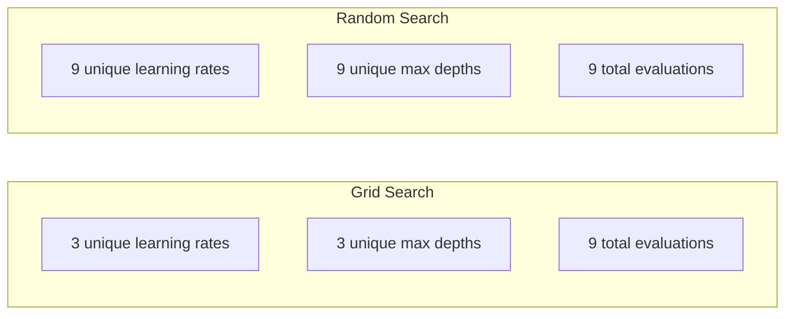
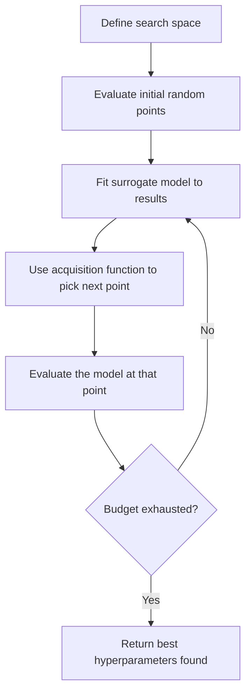
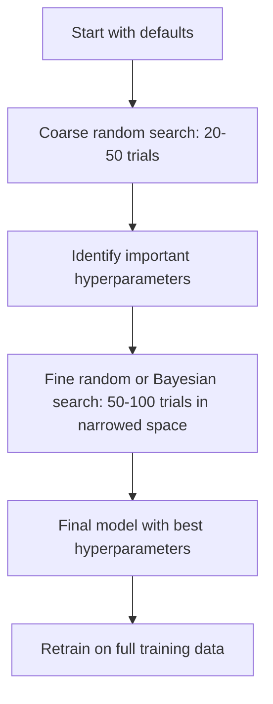
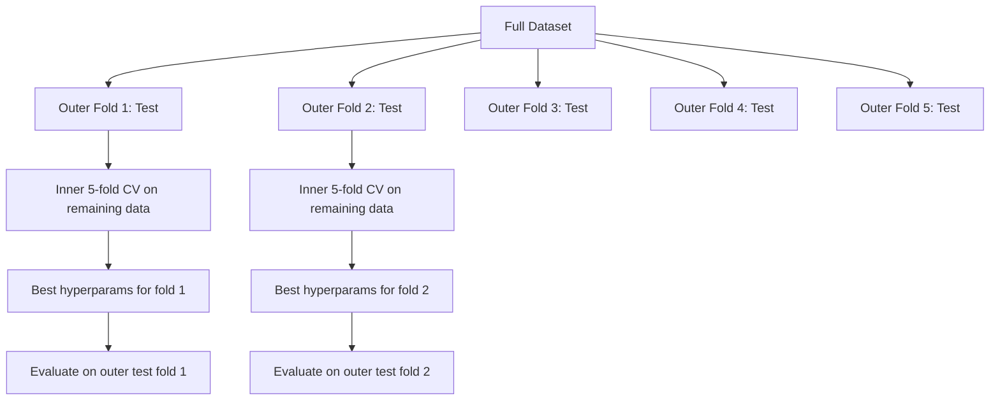

# Hyperparameter Tuning

> Hyperparameters 是训练开始前你要调的旋钮。调得好不好，决定模型是平庸还是优秀。

**类型：** 构建
**语言：** Python
**前置要求：** 阶段 2，第 11 课（Ensemble Methods）
**时间：** ~90 分钟

## 学习目标

- 从零实现 grid search、random search 和 Bayesian optimization，并比较它们的 sample efficiency
- 解释为什么当大多数 hyperparameters 有较低 effective dimensionality 时，random search 会优于 grid search
- 使用 surrogate model 和 acquisition function 构建 Bayesian optimization loop 来引导搜索
- 设计 hyperparameter tuning 策略，通过正确 cross-validation 避免过拟合 validation set

## 问题

你的 gradient boosting 模型有 learning rate、树数量、max depth、min samples per leaf、subsample ratio 和 column sample ratio。这是六个 hyperparameters。如果每个都有 5 个合理值，grid 就有 5^6 = 15,625 种组合。每次训练需要 10 秒。这就是 43 小时计算，才能全试一遍。

Grid search 是显而易见的方法，也是规模变大后最糟的方法。Random search 用更少计算做得更好。Bayesian optimization 通过从过去评估中学习，做得更好。知道该用哪种策略，以及哪些 hyperparameters 真的重要，可以省下好几天 GPU 时间。

## 概念

### Parameters vs Hyperparameters

Parameters 在训练期间学习得到（weights、biases、split thresholds）。Hyperparameters 在训练开始前设置，控制学习如何发生。

| Hyperparameter | What it controls | Typical range |
|---------------|-----------------|---------------|
| Learning rate | 每次更新的步长 | 0.001 to 1.0 |
| Number of trees/epochs | 训练多久 | 10 to 10,000 |
| Max depth | Model complexity | 1 to 30 |
| Regularization (lambda) | 防止过拟合 | 0.0001 to 100 |
| Batch size | Gradient estimation noise | 16 to 512 |
| Dropout rate | 被 drop 的 neurons 比例 | 0.0 to 0.5 |

### Grid Search

Grid search 会评估指定取值的每个组合。它是穷举的、容易理解，但成本随 hyperparameters 数量指数增长。

```
Grid for 2 hyperparameters:

  learning_rate: [0.01, 0.1, 1.0]
  max_depth:     [3, 5, 7]

  Evaluations: 3 x 3 = 9 combinations

  (0.01, 3)  (0.01, 5)  (0.01, 7)
  (0.1,  3)  (0.1,  5)  (0.1,  7)
  (1.0,  3)  (1.0,  5)  (1.0,  7)
```

Grid search 有根本缺陷：如果一个 hyperparameter 重要，另一个不重要，大多数评估都被浪费了。9 次评估只给重要 parameter 试了 3 个唯一值。

### Random Search

Random search 从 distributions 中采样 hyperparameters，而不是使用 grid。用同样 9 次评估预算，你可以为每个 hyperparameter 得到 9 个唯一值。



为什么 random 胜过 grid（Bergstra & Bengio, 2012）：

- 大多数 hyperparameters 的 effective dimensionality 很低。给定问题中，6 个 hyperparameters 里通常只有 1-2 个真正重要。
- Grid search 会把评估浪费在不重要维度上。
- Random search 用同样预算更密集地覆盖重要维度。
- 60 次 random trials 时，如果 search space 中存在最优附近区域，你有 95% 概率找到距离 optimum 5% 以内的点。

### Bayesian Optimization

Random search 忽略结果。它不会学习到高 learning rate 会发散，或者 depth 3 一直优于 depth 10。Bayesian optimization 用过去评估结果决定下一步搜索哪里。



两个关键组件：

**Surrogate model：** 一个评估成本低的模型（通常是 Gaussian process），近似昂贵的 objective function。它在 search space 的任意点上给出预测和不确定性估计。

**Acquisition function：** 通过平衡 exploitation（在已知好点附近搜索）和 exploration（搜索不确定性高的地方），决定下一步评估哪里。常见选择：

- **Expected Improvement（EI）：** 在当前最佳点上，我们期望这个点能带来多少提升？
- **Upper Confidence Bound（UCB）：** 预测值加上不确定性的倍数。UCB 高表示要么有前途，要么尚未探索。
- **Probability of Improvement（PI）：** 这个点击败当前最佳的概率是多少？

Bayesian optimization 通常用比 random search 少 2-5 倍的评估次数找到更好的 hyperparameters。拟合 surrogate model 的开销相对于训练真实模型可以忽略。

### Early Stopping

不是每次训练都需要跑完。如果一个配置 10 个 epochs 后明显很差，就停掉它，继续下一个。这是 hyperparameter search 语境下的 early stopping。

策略：
- **Patience-based：** 如果 validation loss 连续 N 个 epochs 没改善，就停止
- **Median pruning：** 如果 trial 的中间结果比已完成 trials 在同一步的中位数更差，就停止
- **Hyperband：** 给许多配置分配小预算，然后逐步增加最佳配置的预算

Hyperband 特别有效。它从 81 个配置开始，每个只跑 1 个 epoch，保留前三分之一，给它们 3 个 epochs，再保留前三分之一，以此类推。相比把所有 configs 跑完整预算，它能快 10-50 倍找到好配置。

### Learning Rate Schedulers

Learning rate 几乎总是最重要的 hyperparameter。与其保持固定，不如让 schedulers 在训练期间调整它。

| Scheduler | Formula | When to use |
|-----------|---------|-------------|
| Step decay | 每 N 个 epochs 乘以 0.1 | 经典 CNN training |
| Cosine annealing | lr * 0.5 * (1 + cos(pi * t / T)) | 现代默认 |
| Warmup + decay | 先线性增加，再 cosine decay | Transformers |
| One-cycle | 一个周期内先升后降 | 快速收敛 |
| Reduce on plateau | metric 停滞时按 factor 降低 | 安全默认 |

### Hyperparameter Importance

并不是所有 hyperparameters 都同等重要。关于 random forests（Probst et al., 2019）和 gradient boosting 的研究显示了稳定模式：

**高重要性：**
- Learning rate（永远先调）
- Number of estimators / epochs（使用 early stopping，而不是调它）
- Regularization strength

**中等重要性：**
- Max depth / number of layers
- Min samples per leaf / weight decay
- Subsample ratio

**低重要性：**
- Max features（对 random forests）
- 具体 activation function 选择
- Batch size（在合理范围内）

先调重要的，其他保持默认。

### 实用策略



具体工作流：

1. **从库默认值开始。** 它们由有经验的实践者选择，通常已经走完 80% 的路。
2. **Coarse random search。** 范围宽，20-50 trials。用 early stopping 快速杀掉坏 runs。
3. **分析结果。** 哪些 hyperparameters 与性能相关？收窄 search space。
4. **Fine search。** 在收窄空间中做 Bayesian optimization 或 focused random search。50-100 trials。
5. **用找到的最佳 hyperparameters 在全部 training data 上重新训练。**

### Cross-Validation Integration

在单个 validation split 上调 hyperparameters 有风险。最佳 hyperparameters 可能过拟合到某个具体 validation fold。Nested cross-validation 通过两个 loops 解决这个问题：

- **Outer loop**（evaluation）：把数据拆成 train+val 和 test。报告无偏性能。
- **Inner loop**（tuning）：把 train+val 拆成 train 和 val。寻找最佳 hyperparameters。



每个 outer fold 都独立找到自己的最佳 hyperparameters。Outer scores 是 generalization performance 的无偏估计。

使用 sklearn：

```python
from sklearn.model_selection import cross_val_score, GridSearchCV
from sklearn.ensemble import GradientBoostingRegressor

inner_cv = GridSearchCV(
    GradientBoostingRegressor(),
    param_grid={
        "learning_rate": [0.01, 0.05, 0.1],
        "max_depth": [2, 3, 5],
        "n_estimators": [50, 100, 200],
    },
    cv=5,
    scoring="neg_mean_squared_error",
)

outer_scores = cross_val_score(
    inner_cv, X, y, cv=5, scoring="neg_mean_squared_error"
)

print(f"Nested CV MSE: {-outer_scores.mean():.4f} +/- {outer_scores.std():.4f}")
```

这很昂贵（5 outer folds x 5 inner folds x 27 grid points = 675 次 model fits），但它给你可信的性能估计。用于论文报告最终结果，或决策风险较高时。

### 实用技巧

**从 learning rate 开始。** 对 gradient-based methods 来说，它永远是最重要 hyperparameter。错误的 learning rate 会让其他所有设置都无关紧要。先把其他 hyperparameters 固定为默认，扫描 learning rate。

**对 learning rate 和 regularization 使用 log-uniform distributions。** 0.001 到 0.01 的差异和 0.1 到 1.0 的差异一样重要。线性搜索会把预算浪费在大值端。

**用 early stopping 替代调 n_estimators。** 对 boosting 和 neural networks，把 n_estimators 或 epochs 设高，让 early stopping 决定何时停止。这会从 search 中移除一个 hyperparameter。

**预算分配。** 把 60% tuning budget 花在最重要的前 2 个 hyperparameters 上。剩余 40% 花在其他上。前 2 个通常解释了大多数性能变化。

**Scale matters。** 永远不要在 log scale 上搜索 batch size（16、32、64 就很好）。永远在 log scale 上搜索 learning rate。让 search distribution 匹配 hyperparameter 对模型的影响方式。

| Model Type | Top Hyperparameters | Recommended Search | Budget |
|-----------|--------------------|--------------------|--------|
| Random Forest | n_estimators, max_depth, min_samples_leaf | Random search, 50 trials | Low (fast training) |
| Gradient Boosting | learning_rate, n_estimators, max_depth | Bayesian, 100 trials + early stopping | Medium |
| Neural Network | learning_rate, weight_decay, batch_size | Bayesian or random, 100+ trials | High (slow training) |
| SVM | C, gamma (RBF kernel) | Grid on log scale, 25-50 trials | Low (2 params) |
| Lasso/Ridge | alpha | 1D search on log scale, 20 trials | Very low |
| XGBoost | learning_rate, max_depth, subsample, colsample | Bayesian, 100-200 trials + early stopping | Medium |

**不确定时：** 使用 random search，trial 数至少为 hyperparameters 数量的 2 倍（例如 6 个 hyperparameters = 至少 12 次 trials）。你会惊讶于 50 次 random search 多常击败精心设计的 grid search。

## 构建它

### 第 1 步：从零实现 Grid Search

`code/tuning.py` 中的代码从零实现 grid search、random search 和一个简单 Bayesian optimizer。

```python
def grid_search(model_fn, param_grid, X_train, y_train, X_val, y_val):
    keys = list(param_grid.keys())
    values = list(param_grid.values())
    best_score = -float("inf")
    best_params = None
    n_evals = 0

    for combo in itertools.product(*values):
        params = dict(zip(keys, combo))
        model = model_fn(**params)
        model.fit(X_train, y_train)
        score = evaluate(model, X_val, y_val)
        n_evals += 1

        if score > best_score:
            best_score = score
            best_params = params

    return best_params, best_score, n_evals
```

### 第 2 步：从零实现 Random Search

```python
def random_search(model_fn, param_distributions, X_train, y_train,
                  X_val, y_val, n_iter=50, seed=42):
    rng = np.random.RandomState(seed)
    best_score = -float("inf")
    best_params = None

    for _ in range(n_iter):
        params = {k: sample(v, rng) for k, v in param_distributions.items()}
        model = model_fn(**params)
        model.fit(X_train, y_train)
        score = evaluate(model, X_val, y_val)

        if score > best_score:
            best_score = score
            best_params = params

    return best_params, best_score, n_iter
```

### 第 3 步：Bayesian Optimization（简化版）

核心思想：对已观测的（hyperparameter, score）配对拟合 Gaussian process，然后用 acquisition function 决定下一步去哪看。

```python
class SimpleBayesianOptimizer:
    def __init__(self, search_space, n_initial=5):
        self.search_space = search_space
        self.n_initial = n_initial
        self.X_observed = []
        self.y_observed = []

    def _kernel(self, x1, x2, length_scale=1.0):
        dists = np.sum((x1[:, None, :] - x2[None, :, :]) ** 2, axis=2)
        return np.exp(-0.5 * dists / length_scale ** 2)

    def _fit_gp(self, X_new):
        X_obs = np.array(self.X_observed)
        y_obs = np.array(self.y_observed)
        y_mean = y_obs.mean()
        y_centered = y_obs - y_mean

        K = self._kernel(X_obs, X_obs) + 1e-4 * np.eye(len(X_obs))
        K_star = self._kernel(X_new, X_obs)

        L = np.linalg.cholesky(K)
        alpha = np.linalg.solve(L.T, np.linalg.solve(L, y_centered))
        mu = K_star @ alpha + y_mean

        v = np.linalg.solve(L, K_star.T)
        var = 1.0 - np.sum(v ** 2, axis=0)
        var = np.maximum(var, 1e-6)

        return mu, var

    def _expected_improvement(self, mu, var, best_y):
        sigma = np.sqrt(var)
        z = (mu - best_y) / (sigma + 1e-10)
        ei = sigma * (z * norm_cdf(z) + norm_pdf(z))
        return ei

    def suggest(self):
        if len(self.X_observed) < self.n_initial:
            return sample_random(self.search_space)

        candidates = [sample_random(self.search_space) for _ in range(500)]
        X_cand = np.array([to_vector(c) for c in candidates])
        mu, var = self._fit_gp(X_cand)
        ei = self._expected_improvement(mu, var, max(self.y_observed))
        return candidates[np.argmax(ei)]

    def observe(self, params, score):
        self.X_observed.append(to_vector(params))
        self.y_observed.append(score)
```

GP surrogate 在每个 candidate point 上给出两件事：预测分数（mu）和不确定性（var）。Expected Improvement 平衡两者：它偏好模型预测分数高的点，或者不确定性高的点。早期，大多数点不确定性高，所以 optimizer 会探索。后期，它会集中在最有前途的区域。

### 第 4 步：比较所有方法

在同一个 synthetic objective 上运行三种方法并比较。这个比较使用一个简化 wrapper，直接用 objective function 调用每个 optimizer（不训练模型），所以 API 与上面的 model-based implementations 不同：

```python
def synthetic_objective(params):
    lr = params["learning_rate"]
    depth = params["max_depth"]
    return -(np.log10(lr) + 2) ** 2 - (depth - 4) ** 2 + 10

param_grid = {
    "learning_rate": [0.001, 0.01, 0.1, 1.0],
    "max_depth": [2, 3, 4, 5, 6, 7, 8],
}

grid_best = None
grid_score = -float("inf")
grid_history = []
for combo in itertools.product(*param_grid.values()):
    params = dict(zip(param_grid.keys(), combo))
    score = synthetic_objective(params)
    grid_history.append((params, score))
    if score > grid_score:
        grid_score = score
        grid_best = params

param_dist = {
    "learning_rate": ("log_float", 0.001, 1.0),
    "max_depth": ("int", 2, 8),
}

rand_best = None
rand_score = -float("inf")
rand_history = []
rng = np.random.RandomState(42)
for _ in range(28):
    params = {k: sample(v, rng) for k, v in param_dist.items()}
    score = synthetic_objective(params)
    rand_history.append((params, score))
    if score > rand_score:
        rand_score = score
        rand_best = params

optimizer = SimpleBayesianOptimizer(param_dist, n_initial=5)
bayes_history = []
for _ in range(28):
    params = optimizer.suggest()
    score = synthetic_objective(params)
    optimizer.observe(params, score)
    bayes_history.append((params, score))
bayes_score = max(s for _, s in bayes_history)

print(f"{'Method':<20} {'Best Score':>12} {'Evaluations':>12}")
print("-" * 50)
print(f"{'Grid Search':<20} {grid_score:>12.4f} {len(grid_history):>12}")
print(f"{'Random Search':<20} {rand_score:>12.4f} {len(rand_history):>12}")
print(f"{'Bayesian Opt':<20} {bayes_score:>12.4f} {len(bayes_history):>12}")
```

在相同预算下，Bayesian optimization 通常最快找到最佳分数，因为它不会在明显很差的区域浪费评估。Random search 比 grid search 覆盖更广。只有在 hyperparameters 很少且你能负担穷举时，grid search 才会赢。

## 使用它

### 实践中的 Optuna

Optuna 是严肃 hyperparameter tuning 的推荐库。它开箱支持 pruning、distributed search 和 visualization。

```python
import optuna

def objective(trial):
    lr = trial.suggest_float("learning_rate", 1e-4, 1e-1, log=True)
    n_est = trial.suggest_int("n_estimators", 50, 500)
    max_depth = trial.suggest_int("max_depth", 2, 10)

    model = GradientBoostingRegressor(
        learning_rate=lr,
        n_estimators=n_est,
        max_depth=max_depth,
    )
    model.fit(X_train, y_train)
    return mean_squared_error(y_val, model.predict(X_val))

study = optuna.create_study(direction="minimize")
study.optimize(objective, n_trials=100)

print(f"Best params: {study.best_params}")
print(f"Best MSE: {study.best_value:.4f}")
```

Optuna 关键功能：
- `suggest_float(..., log=True)` 用于最适合 log scale 搜索的 parameters（learning rate、regularization）
- `suggest_int` 用于 integer parameters
- `suggest_categorical` 用于离散选择
- 内置 MedianPruner，可以 early stop 坏 trials
- `study.trials_dataframe()` 用于分析

### 带 Pruning 的 Optuna

Pruning 会提前停止没前途的 trials，节省大量计算。模式如下：

```python
import optuna
from sklearn.model_selection import cross_val_score

def objective(trial):
    params = {
        "learning_rate": trial.suggest_float("lr", 1e-4, 0.5, log=True),
        "max_depth": trial.suggest_int("max_depth", 2, 10),
        "n_estimators": trial.suggest_int("n_estimators", 50, 500),
        "subsample": trial.suggest_float("subsample", 0.5, 1.0),
    }

    model = GradientBoostingRegressor(**params)
    scores = cross_val_score(model, X_train, y_train, cv=3,
                             scoring="neg_mean_squared_error")
    mean_score = -scores.mean()

    trial.report(mean_score, step=0)
    if trial.should_prune():
        raise optuna.TrialPruned()

    return mean_score

pruner = optuna.pruners.MedianPruner(n_startup_trials=10, n_warmup_steps=5)
study = optuna.create_study(direction="minimize", pruner=pruner)
study.optimize(objective, n_trials=200)
```

`MedianPruner` 会在某个 trial 的中间值比所有已完成 trials 在同一步的中位数更差时停止它。Pruning 需要调用 `trial.report()` 报告中间 metrics，并调用 `trial.should_prune()` 检查是否应停止。`n_startup_trials=10` 确保至少有 10 个 trials 完整结束后才开始 pruning。这通常节省 40-60% 总计算。

### sklearn 内置 Tuners

快速实验时，sklearn 提供 `GridSearchCV`、`RandomizedSearchCV` 和 `HalvingRandomSearchCV`：

```python
from sklearn.model_selection import RandomizedSearchCV
from scipy.stats import loguniform, randint

param_dist = {
    "learning_rate": loguniform(1e-4, 0.5),
    "max_depth": randint(2, 10),
    "n_estimators": randint(50, 500),
}

search = RandomizedSearchCV(
    GradientBoostingRegressor(),
    param_dist,
    n_iter=100,
    cv=5,
    scoring="neg_mean_squared_error",
    random_state=42,
    n_jobs=-1,
)
search.fit(X_train, y_train)
print(f"Best params: {search.best_params_}")
print(f"Best CV MSE: {-search.best_score_:.4f}")
```

使用 scipy 的 `loguniform` 来搜索 learning rate 和 regularization。使用 `randint` 搜索 integer hyperparameters。`n_jobs=-1` 会在所有 CPU cores 上并行。

### Hyperparameter Tuning 常见错误

**Data leakage through preprocessing。** 如果你在 cross-validation 前对完整数据集 fit scaler，validation fold 的信息会泄漏进训练。永远把 preprocessing 放进 `Pipeline`，让它只在 training fold 上 fit。

**Overfitting to the validation set。** 运行数千次 trials 实际上是在 validation set 上训练。最终性能估计使用 nested cross-validation，或者保留一个 tuning 期间从不触碰的独立 test set。

**Searching too narrow a range。** 如果最佳值在 search space 边界，说明搜索范围不够宽。最优值可能在范围外。始终检查最佳参数是否位于边缘。

**Ignoring interaction effects。** Learning rate 和 number of estimators 在 boosting 中强烈交互。低 learning rate 需要更多 estimators。独立调它们会得到更差结果。

**Not using early stopping for iterative models。** 对 gradient boosting 和 neural networks，把 n_estimators 或 epochs 设高并使用 early stopping。这严格优于把迭代次数当 hyperparameter 来调。

## 练习

1. 用相同总预算（例如 50 次评估）运行 grid search 和 random search。比较找到的最佳分数。用不同 seeds 运行 10 次。Random search 赢了多少次？

2. 从零实现 Hyperband。从 81 个配置开始，每个训练 1 个 epoch。每轮保留前 1/3，并把预算翻三倍。把总计算量（所有 configs 的 epochs 之和）与把 81 个 configs 都跑完整预算比较。

3. 向第 11 课的 gradient boosting 实现添加 learning rate scheduler（cosine annealing）。相比固定 learning rate 有帮助吗？

4. 使用 Optuna 在真实数据集（例如 sklearn 的 breast cancer dataset）上调 RandomForestClassifier。使用 `optuna.visualization.plot_param_importances(study)` 查看哪些 hyperparameters 最重要。它是否匹配本课的重要性排序？

5. 实现一个简单 acquisition function（Expected Improvement），并展示 exploration vs exploitation。绘制 surrogate model 的均值和不确定性，并展示 EI 会选择哪里作为下一次评估点。

## 关键术语

| 术语 | 人们常说 | 实际含义 |
|------|----------------|----------------------|
| Hyperparameter | “你选择的设置” | 训练前设置的值，控制学习过程，不从数据中学习 |
| Grid search | “尝试每个组合” | 在指定 parameter grid 上穷举搜索。成本指数增长。 |
| Random search | “随机采样” | 从 distributions 中采样 hyperparameters。比 grid search 更好覆盖重要维度。 |
| Bayesian optimization | “智能搜索” | 使用 objective 的 surrogate model 决定下一步评估哪里，平衡 exploration 和 exploitation |
| Surrogate model | “便宜近似” | 一个模型（通常 Gaussian process），从已观测评估中近似昂贵的 objective function |
| Acquisition function | “下一步看哪里” | 通过平衡 expected improvement 和 uncertainty 给 candidate points 打分。EI 和 UCB 是常见选择。 |
| Early stopping | “停止浪费时间” | 当 validation performance 停止改善时提前终止训练 |
| Hyperband | “Configs 的锦标赛表” | 自适应资源分配：用小预算启动许多 configs，保留最佳并增加预算 |
| Learning rate scheduler | “训练中改变 lr” | 在训练过程中调整 learning rate 的函数，用于更好收敛 |

## 延伸阅读

- [Bergstra & Bengio: Random Search for Hyper-Parameter Optimization (2012)](https://jmlr.org/papers/v13/bergstra12a.html) -- 证明 random 胜过 grid 的论文
- [Snoek et al., Practical Bayesian Optimization of Machine Learning Algorithms (2012)](https://arxiv.org/abs/1206.2944) -- 面向 ML 的 Bayesian optimization
- [Li et al., Hyperband: A Novel Bandit-Based Approach (2018)](https://jmlr.org/papers/v18/16-558.html) -- Hyperband 论文
- [Optuna: A Next-generation Hyperparameter Optimization Framework](https://arxiv.org/abs/1907.10902) -- Optuna 论文
- [Probst et al., Tunability: Importance of Hyperparameters (2019)](https://jmlr.org/papers/v20/18-444.html) -- 哪些 hyperparameters 重要
