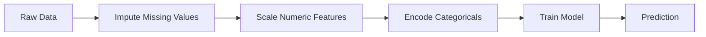
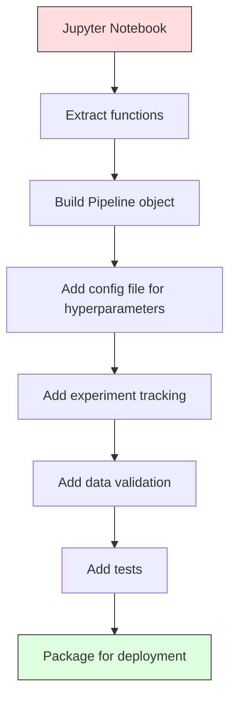

# ML Pipelines

> 模型不是产品。Pipeline 才是。Pipeline 覆盖从原始数据到部署预测的全部过程，每一步都必须可复现。

**类型：** 构建
**语言：** Python
**前置要求：** 阶段 2，第 12 课（Hyperparameter Tuning）
**时间：** ~120 分钟

## 学习目标

- 从零构建 ML pipeline，把 imputation、scaling、encoding 和 model training 串成单个可复现对象
- 识别 data leakage 场景，并解释 pipelines 如何通过只在 training data 上 fit transformers 来防止它
- 构建 ColumnTransformer，对 numeric 和 categorical features 应用不同 preprocessing
- 实现 pipeline serialization，并演示同一个 fitted pipeline 在训练和生产中产生相同结果

## 问题

你有一个 notebook：加载数据、用 median 填补缺失值、scale features、训练模型、打印 accuracy。它能跑。你发布了它。

一个月后，有人重新训练模型，结果不同。Median 是在包含 test data 的完整数据集上计算的（data leakage）。Scaling parameters 没有保存，所以 inference 使用不同统计量。Feature engineering 代码在 training 和 serving 之间复制粘贴，两个副本逐渐偏离。一个 categorical column 在生产中出现了 encoder 从未见过的新值。

这些不是假设。它们是 ML systems 在生产中失败的最常见原因。Pipelines 通过把每个 transformation step 打包成一个有序、可复现对象来解决这些问题。

## 概念

### 什么是 Pipeline

Pipeline 是一串有序 data transformations，后面接一个模型。每一步都以前一步输出为输入。整个 pipeline 在 training data 上 fit 一次。Inference 时，同一个 fitted pipeline 转换新数据并产生预测。



Pipeline 保证：
- Transformations 只在 training data 上 fit（无 leakage）
- Inference 时应用同样 transformations
- 整个对象可以作为一个 artifact 序列化和部署
- Cross-validation 会按 fold 应用 pipeline，防止微妙 leakage

### Data Leakage：沉默杀手

Data leakage 发生在 test set 或未来数据的信息污染训练时。Pipelines 可以防止最常见形式。

**Leaky（错误）：**
```python
X = df.drop("target", axis=1)
y = df["target"]

scaler = StandardScaler()
X_scaled = scaler.fit_transform(X)

X_train, X_test = X_scaled[:800], X_scaled[800:]
y_train, y_test = y[:800], y[800:]
```

Scaler 看到了 test data。Mean 和 standard deviation 包含 test samples。这会夸大 accuracy estimates。

**正确：**
```python
X_train, X_test = X[:800], X[800:]

scaler = StandardScaler()
X_train_scaled = scaler.fit_transform(X_train)
X_test_scaled = scaler.transform(X_test)
```

有了 pipeline，你不需要反复思考这个问题。Pipeline 会自动处理。

### sklearn Pipeline

sklearn 的 `Pipeline` 会串联 transformers 和 estimator。它暴露 `.fit()`、`.predict()` 和 `.score()`，按顺序应用所有步骤。

```python
from sklearn.pipeline import Pipeline
from sklearn.preprocessing import StandardScaler
from sklearn.linear_model import LogisticRegression

pipe = Pipeline([
    ("scaler", StandardScaler()),
    ("model", LogisticRegression()),
])

pipe.fit(X_train, y_train)
predictions = pipe.predict(X_test)
```

调用 `pipe.fit(X_train, y_train)` 时：
1. Scaler 在 X_train 上调用 `fit_transform`
2. Model 在 scaled X_train 上调用 `fit`

调用 `pipe.predict(X_test)` 时：
1. Scaler 在 X_test 上调用 `transform`（不是 fit_transform）
2. Model 在 scaled X_test 上调用 `predict`

Scaler 在 fitting 期间永远看不到 test data。这就是重点。

### ColumnTransformer：不同列使用不同 Pipelines

真实数据集有 numeric 和 categorical columns，需要不同 preprocessing。`ColumnTransformer` 处理这个问题。

```python
from sklearn.compose import ColumnTransformer
from sklearn.preprocessing import StandardScaler, OneHotEncoder
from sklearn.impute import SimpleImputer

numeric_pipe = Pipeline([
    ("impute", SimpleImputer(strategy="median")),
    ("scale", StandardScaler()),
])

categorical_pipe = Pipeline([
    ("impute", SimpleImputer(strategy="most_frequent")),
    ("encode", OneHotEncoder(handle_unknown="ignore")),
])

preprocessor = ColumnTransformer([
    ("num", numeric_pipe, ["age", "income", "score"]),
    ("cat", categorical_pipe, ["city", "gender", "plan"]),
])

full_pipeline = Pipeline([
    ("preprocess", preprocessor),
    ("model", GradientBoostingClassifier()),
])
```

OneHotEncoder 中的 `handle_unknown="ignore"` 对生产至关重要。当出现新 category（模型从未见过的城市）时，它会产生 zero vector，而不是崩溃。

### Experiment Tracking

Pipeline 让训练可复现，但你还需要跟踪实验之间发生了什么：使用了哪些 hyperparameters、哪个 dataset version、metrics 是什么、运行的是什么代码。

**MLflow** 是最常见的开源方案：

```python
import mlflow

with mlflow.start_run():
    mlflow.log_param("max_depth", 5)
    mlflow.log_param("n_estimators", 100)
    mlflow.log_param("learning_rate", 0.1)

    pipe.fit(X_train, y_train)
    accuracy = pipe.score(X_test, y_test)

    mlflow.log_metric("accuracy", accuracy)
    mlflow.sklearn.log_model(pipe, "model")
```

每次 run 都会记录 parameters、metrics、artifacts 和完整模型。你可以比较 runs，复现任何实验，并部署任何 model version。

**Weights & Biases（wandb）** 提供相同功能，并带 hosted dashboard：

```python
import wandb

wandb.init(project="my-pipeline")
wandb.config.update({"max_depth": 5, "n_estimators": 100})

pipe.fit(X_train, y_train)
accuracy = pipe.score(X_test, y_test)

wandb.log({"accuracy": accuracy})
```

### Model Versioning

Experiment tracking 之后，你需要管理 model versions。哪个模型在 production？哪个在 staging？上周是哪一个？

MLflow 的 Model Registry 提供：
- **Version tracking：** 每个保存模型都有版本号
- **Stage transitions：** “Staging”、“Production”、“Archived”
- **Approval workflow：** 模型必须显式提升到 production
- **Rollback：** 立即切回前一个版本

### 使用 DVC 做 Data Versioning

代码用 git 版本控制。数据也应该版本控制，但 git 不能处理大文件。DVC（Data Version Control）解决这个问题。

```
dvc init
dvc add data/training.csv
git add data/training.csv.dvc data/.gitignore
git commit -m "Track training data"
dvc push
```

DVC 把实际数据存到 remote storage（S3、GCS、Azure），并在 git 中保留一个小 `.dvc` 文件记录 hash。当你 checkout 某个 git commit，`dvc checkout` 会恢复当时使用的精确数据。

这意味着每个 git commit 都固定代码和数据。完整可复现。

### 可复现实验

可复现实验需要四件事：

1. **Fixed random seeds：** 为 numpy、random 和框架（torch、sklearn）设置 seeds
2. **Pinned dependencies：** requirements.txt 或 poetry.lock，包含精确版本
3. **Versioned data：** DVC 或类似工具
4. **Config files：** 所有 hyperparameters 在 config 中，不要 hardcode

```python
import numpy as np
import random

def set_seed(seed=42):
    random.seed(seed)
    np.random.seed(seed)
    try:
        import torch
        torch.manual_seed(seed)
        torch.cuda.manual_seed_all(seed)
        torch.backends.cudnn.deterministic = True
    except ImportError:
        pass
```

### 从 Notebook 到 Production Pipeline



典型演进：

1. **Notebook exploration：** 快速实验、可视化、feature ideas
2. **Extract functions：** 把 preprocessing、feature engineering、evaluation 移到 modules
3. **Build Pipeline：** 把 transformations 串进 sklearn Pipeline 或 custom class
4. **Config management：** 把所有 hyperparameters 移到 YAML/JSON config
5. **Experiment tracking：** 添加 MLflow 或 wandb logging
6. **Data validation：** 训练前检查 schema、distributions 和 missing value patterns
7. **Tests：** 为 transformers 写 unit tests，为完整 pipeline 写 integration tests
8. **Deployment：** 序列化 pipeline，包装成 API（FastAPI、Flask），containerize

### 常见 Pipeline 错误

| Mistake | Why it is bad | Fix |
|---------|-------------|-----|
| Fitting on full data before splitting | Data leakage | Use Pipeline with cross_val_score |
| Feature engineering outside pipeline | Train vs serve 的 transforms 不同 | Put all transforms in the Pipeline |
| Not handling unknown categories | 生产中新值导致崩溃 | OneHotEncoder(handle_unknown="ignore") |
| Hardcoded column names | Schema 变化时破坏 | Use column name lists from config |
| No data validation | 坏数据导致静默错误预测 | Add schema checks before prediction |
| Training/serving skew | 生产中模型看到不同 features | One Pipeline object for both |

## 构建它

`code/pipeline.py` 中的代码从零构建完整 ML pipeline：

### 第 1 步：Custom Transformer

```python
class CustomTransformer:
    def __init__(self):
        self.means = None
        self.stds = None

    def fit(self, X):
        self.means = np.mean(X, axis=0)
        self.stds = np.std(X, axis=0)
        self.stds[self.stds == 0] = 1.0
        return self

    def transform(self, X):
        return (X - self.means) / self.stds

    def fit_transform(self, X):
        return self.fit(X).transform(X)
```

### 第 2 步：从零实现 Pipeline

```python
class PipelineFromScratch:
    def __init__(self, steps):
        self.steps = steps

    def fit(self, X, y=None):
        X_current = X.copy()
        for name, step in self.steps[:-1]:
            X_current = step.fit_transform(X_current)
        name, model = self.steps[-1]
        model.fit(X_current, y)
        return self

    def predict(self, X):
        X_current = X.copy()
        for name, step in self.steps[:-1]:
            X_current = step.transform(X_current)
        name, model = self.steps[-1]
        return model.predict(X_current)
```

### 第 3 步：使用 Pipeline 做 Cross-Validation

代码演示了 pipeline 中的 cross-validation 如何防止 data leakage：scaler 会分别在每个 fold 的 training data 上 fit。

### 第 4 步：使用 sklearn 构建完整 Production Pipeline

一个完整 pipeline，包含 `ColumnTransformer`、多条 preprocessing paths 和模型，并使用正确 cross-validation 与 experiment logging 进行训练。

## 交付它

本课会产出：
- `outputs/prompt-ml-pipeline.md` -- 一个用于构建和调试 ML pipelines 的 skill
- `code/pipeline.py` -- 一个从零实现到 sklearn 的完整 pipeline

## 练习

1. 构建一个 pipeline，处理包含 3 个 numeric columns 和 2 个 categorical columns 的数据集。使用 `ColumnTransformer` 对 numerics 应用 median imputation + scaling，对 categoricals 应用 most-frequent imputation + one-hot encoding。使用 5-fold cross-validation 训练。

2. 故意引入 data leakage：在 splitting 前对完整数据集 fit scaler。比较 cross-validation score（leaky）和 pipeline cross-validation score（clean）。差异有多大？

3. 使用 `joblib.dump` 序列化你的 pipeline。在单独脚本中加载它并运行预测。验证 predictions 完全相同。

4. 向 pipeline 添加一个 custom transformer，为两个最重要 numeric columns 创建 polynomial features（degree 2）。它应该放在 pipeline 的什么位置？

5. 为 pipeline 设置 MLflow tracking。用不同 hyperparameters 运行 5 个实验。使用 MLflow UI（`mlflow ui`）比较 runs，并选择最佳模型。

## 关键术语

| 术语 | 人们常说 | 实际含义 |
|------|----------------|----------------------|
| Pipeline | “Transforms + model 的链” | 有序的 fitted transformers 和一个模型，作为整体应用以防止 leakage |
| Data leakage | “Test 信息泄漏进训练” | 使用训练集之外的信息构建模型，抬高性能估计 |
| ColumnTransformer | “每列不同 preprocessing” | 对不同列子集应用不同 pipelines，并组合结果 |
| Experiment tracking | “记录 runs” | 记录每次 training run 的 parameters、metrics、artifacts 和 code versions |
| MLflow | “跟踪和部署模型” | 用于 experiment tracking、model registry 和 deployment 的开源平台 |
| DVC | “数据的 Git” | 大数据文件版本控制系统，把 hashes 存入 git，把数据存在 remote storage |
| Model registry | “模型版本目录” | 跟踪 model versions 及其 stage labels（staging、production、archived）的系统 |
| Training/serving skew | “Notebook 里能跑” | 训练和 inference 的数据处理方式不同，导致静默错误 |
| Reproducibility | “同样代码，同样结果” | 从相同代码、数据和配置得到相同结果的能力 |

## 延伸阅读

- [scikit-learn Pipeline docs](https://scikit-learn.org/stable/modules/compose.html) -- 官方 pipeline 参考
- [MLflow documentation](https://mlflow.org/docs/latest/index.html) -- experiment tracking 和 model registry
- [DVC documentation](https://dvc.org/doc) -- data versioning
- [Sculley et al., Hidden Technical Debt in Machine Learning Systems (2015)](https://papers.nips.cc/paper/2015/hash/86df7dcfd896fcaf2674f757a2463eba-Abstract.html) -- ML systems complexity 的经典论文
- [Google ML Best Practices: Rules of ML](https://developers.google.com/machine-learning/guides/rules-of-ml) -- 实用生产 ML 建议
