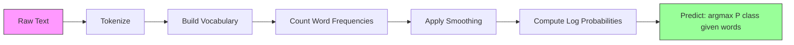

# Naive Bayes

> “Naive” 假设是错的，但它仍然有效。这正是它的美。

**类型：** 构建
**语言：** Python
**前置要求：** 阶段 2，第 01-07 课（classification、Bayes' theorem）
**时间：** ~75 分钟

## 学习目标

- 使用 Laplace smoothing 从零实现 Multinomial Naive Bayes，用于 text classification
- 解释为什么 naive independence assumption 在数学上是错的，却能在实践中产生正确 class rankings
- 比较 Multinomial、Bernoulli 和 Gaussian Naive Bayes 变体，并为给定 feature type 选择正确方法
- 在 high-dimensional sparse data 上评估 Naive Bayes 与 logistic regression，并解释其中的 bias-variance tradeoff

## 问题

你需要分类文本。把邮件分成 spam 或 not-spam。把客户评论分成 positive 或 negative。把 support tickets 分成类别。你有数千个 features（每个词一个），但 training data 有限。

大多数 classifiers 会卡住。Logistic regression 需要足够样本来可靠估计数千个 weights。Decision trees 一次按一个词 split，会疯狂过拟合。10,000 维中的 KNN 没有意义，因为每个点都离每个其他点一样远。

Naive Bayes 可以处理它。它做了一个数学上错误的假设（在给定 class 后，每个 feature 与其他所有 features 独立），却仍然在 text classification 上胜过“更聪明”的模型，尤其是小训练集。它只需单次遍历数据就能训练。它能扩展到数百万 features。它产生概率估计（尽管由于 independence assumption，通常校准很差）。

理解为什么错误假设也能带来好预测，会教你一个机器学习基本事实：最好的模型不是最正确的模型，而是对你的数据有最佳 bias-variance tradeoff 的模型。

## 概念

### Bayes' Theorem（快速回顾）

Bayes' theorem 翻转条件概率：

```
P(class | features) = P(features | class) * P(class) / P(features)
```

我们想要 `P(class | features)`，也就是给定文档中的词后，该文档属于某个 class 的概率。可以从以下项计算：
- `P(features | class)`：在该 class 的文档中看到这些词的 likelihood
- `P(class)`：class 的 prior probability（一般来说 spam 有多常见？）
- `P(features)`：evidence，对所有 classes 相同，所以比较时可以忽略

`P(class | features)` 最高的 class 获胜。

### Naive Independence Assumption

精确计算 `P(features | class)` 需要估计所有 features 的 joint probability。对于 10,000 个词的 vocabulary，你需要估计 2^10,000 种可能组合上的分布。不可能。

Naive assumption：在给定 class 后，每个 feature 都条件独立。

```
P(w1, w2, ..., wn | class) = P(w1 | class) * P(w2 | class) * ... * P(wn | class)
```

你不再估计一个不可能的 joint distribution，而是估计 n 个简单的 per-feature distributions。每个只需要一个 count。

这个假设显然错误。任何文档中，“machine”和“learning”都不是独立的。但 classifier 不需要正确的概率估计。它需要正确的排序，也就是哪个 class 的概率最高。Independence assumption 会引入系统性错误，但这些错误会类似地影响所有 classes，因此 ranking 仍然正确。

### 为什么它仍然有效

三个原因：

1. **Ranking over calibration。** 分类只需要最高排名 class 正确。即使 P(spam) = 0.99999 而真实概率是 0.7，只要 classifier 选中 spam 就正确。我们不需要正确概率，需要正确赢家。

2. **High bias, low variance。** Independence assumption 是强 prior。它强烈约束模型，防止过拟合。在 limited training data 下，一个略微错误但稳定的模型胜过一个理论正确但极不稳定的模型。这就是 bias-variance tradeoff。

3. **Feature redundancy cancels out。** 相关 features 提供冗余证据。Classifier 会重复计算这个证据，但它也会为正确 class 重复计算。如果 “machine” 和 “learning” 总是一起出现，两者都为 “tech” class 提供证据。NB 会计两次，但它是为正确 class 计两次。

第四个实践原因：Naive Bayes 极快。训练只是单次遍历数据统计频率。预测是一次 matrix multiplication。你可以几秒内在一百万文档上训练。这个速度意味着你能更快迭代、尝试更多 feature sets，并运行更多实验。

### 数学逐步展开

来看一个具体例子。假设有两个 classes：spam 和 not-spam。Vocabulary 有三个词：`free`、`money`、`meeting`。

Training data：
- Spam emails 中 `free` 出现 80 次，`money` 60 次，`meeting` 10 次（总共 150 个词）
- Not-spam emails 中 `free` 出现 5 次，`money` 10 次，`meeting` 100 次（总共 115 个词）
- 40% 邮件是 spam，60% 是 not-spam

使用 Laplace smoothing（alpha=1）：

```
P(free | spam)    = (80 + 1) / (150 + 3) = 81/153 = 0.529
P(money | spam)   = (60 + 1) / (150 + 3) = 61/153 = 0.399
P(meeting | spam) = (10 + 1) / (150 + 3) = 11/153 = 0.072

P(free | not-spam)    = (5 + 1) / (115 + 3) = 6/118 = 0.051
P(money | not-spam)   = (10 + 1) / (115 + 3) = 11/118 = 0.093
P(meeting | not-spam) = (100 + 1) / (115 + 3) = 101/118 = 0.856
```

新邮件包含：`free`（2 次）、`money`（1 次）、`meeting`（0 次）。

```
log P(spam | email) = log(0.4) + 2*log(0.529) + 1*log(0.399) + 0*log(0.072)
                    = -0.916 + 2*(-0.637) + (-0.919) + 0
                    = -3.109

log P(not-spam | email) = log(0.6) + 2*log(0.051) + 1*log(0.093) + 0*log(0.856)
                        = -0.511 + 2*(-2.976) + (-2.375) + 0
                        = -8.838
```

Spam 大幅胜出。`free` 出现两次是 spam 的强证据。注意，`meeting` 没有出现，对两个 log sums 的贡献都是零（0 * log(P)）。在 Multinomial NB 中，缺失词没有影响。Bernoulli NB 才会显式建模词的缺失。

### 三种变体

Naive Bayes 有三种口味。每种都以不同方式建模 `P(feature | class)`。

#### Multinomial Naive Bayes

把每个 feature 建模为 count。最适合 features 是词频或 TF-IDF 值的文本数据。

```
P(word_i | class) = (count of word_i in class + alpha) / (total words in class + alpha * vocab_size)
```

`alpha` 是 Laplace smoothing（下文解释）。这是 text classification 的主力变体。

#### Gaussian Naive Bayes

把每个 feature 建模为 normal distribution。最适合 continuous features。

```
P(x_i | class) = (1 / sqrt(2 * pi * var)) * exp(-(x_i - mean)^2 / (2 * var))
```

每个 class 对每个 feature 都有自己的 mean 和 variance。当 features 在每个 class 内确实近似钟形曲线时，这效果很好。

#### Bernoulli Naive Bayes

把每个 feature 建模为 binary（present 或 absent）。最适合短文本或 binary feature vectors。

```
P(word_i | class) = (docs in class containing word_i + alpha) / (total docs in class + 2 * alpha)
```

与 Multinomial 不同，Bernoulli 会显式惩罚某个词的缺失。如果 `free` 通常出现在 spam 中，但这封邮件没有它，Bernoulli 会把这算作反对 spam 的证据。

### 什么时候使用哪种变体

| Variant | Feature Type | Best For | Example |
|---------|-------------|----------|---------|
| Multinomial | Counts or frequencies | Text classification, bag-of-words | Email spam, topic classification |
| Gaussian | Continuous values | Tabular data with normal-ish features | Iris classification, sensor data |
| Bernoulli | Binary (0/1) | Short text, binary feature vectors | SMS spam, presence/absence features |

### Laplace Smoothing

如果某个词出现在 test data 中，但从未在某个 class 的 training data 中出现，会怎样？

没有 smoothing：`P(word | class) = 0/N = 0`。乘积中一个零会让整个 `P(class | features) = 0`，不管其他证据多强。一个未见词就摧毁整个预测。

Laplace smoothing 给每个 feature count 加一个小计数 `alpha`（通常是 1）：

```
P(word_i | class) = (count(word_i, class) + alpha) / (total_words_in_class + alpha * vocab_size)
```

当 alpha=1，每个词至少有很小概率。测试邮件中出现 `discombobulate` 不再会杀死 spam 概率。Smoothing 有 Bayesian 解释：它等价于在词分布上放一个 uniform Dirichlet prior。

更高 alpha 意味着更强 smoothing（更均匀的分布）。更低 alpha 表示模型更信任数据。Alpha 是你要调的 hyperparameter。

Alpha 的影响：

| Alpha | Effect | When to use |
|-------|--------|-------------|
| 0.001 | 几乎不 smoothing，信任数据 | 非常大的训练集，不预计有 unseen features |
| 0.1 | 轻度 smoothing | 大训练集 |
| 1.0 | 标准 Laplace smoothing | 默认起点 |
| 10.0 | 强 smoothing，拉平分布 | 很小训练集，预计有很多 unseen features |

### Log-Space Computation

把几百个概率（每个都小于 1）相乘会导致 floating-point underflow。乘积会在浮点数里变成零，即使真实值是一个非常小的正数。

解决方法：在 log space 工作。不再乘概率，而是加它们的对数：

```
log P(class | x1, x2, ..., xn) = log P(class) + sum_i log P(xi | class)
```

这把预测变成 dot product：

```
log_scores = X @ log_feature_probs.T + log_class_priors
prediction = argmax(log_scores)
```

Matrix multiplication。这就是为什么 Naive Bayes 预测这么快：它与单层 linear model 是同一个操作。

### Naive Bayes vs Logistic Regression

两者都是用于文本的 linear classifiers。区别在于它们建模什么。

| Aspect | Naive Bayes | Logistic Regression |
|--------|------------|-------------------|
| Type | Generative (models P(X\|Y)) | Discriminative (models P(Y\|X)) |
| Training | Count frequencies | Optimize loss function |
| Small data | 更好（强 prior 有帮助） | 更差（样本不足以估计 weights） |
| Large data | 更差（错误假设开始伤害） | 更好（边界更灵活） |
| Features | 假设独立 | 处理 correlations |
| Speed | 单次遍历，非常快 | 迭代优化 |
| Calibration | 概率差 | 概率更好 |

经验法则：从 Naive Bayes 开始。如果你有足够数据且 NB 进入平台期，切换到 logistic regression。

### Classification Pipeline



实践中，我们在 log space 工作以避免 floating-point underflow。与其乘很多小概率，不如加它们的对数：

```
log P(class | features) = log P(class) + sum_i log P(feature_i | class)
```

## 构建它

`code/naive_bayes.py` 中的代码从零实现 MultinomialNB 和 GaussianNB。

### MultinomialNB

从零实现：

1. **fit(X, y)**：对每个 class，统计每个 feature 的频率。加入 Laplace smoothing。计算 log probabilities。存储 class priors（class frequencies 的 log）。

2. **predict_log_proba(X)**：对每个 sample、每个 class，计算 log P(class) + sum of log P(feature_i | class)。这是 matrix multiplication：X @ log_probs.T + log_priors。

3. **predict(X)**：返回 log probability 最高的 class。

```python
class MultinomialNB:
    def __init__(self, alpha=1.0):
        self.alpha = alpha

    def fit(self, X, y):
        classes = np.unique(y)
        n_classes = len(classes)
        n_features = X.shape[1]

        self.classes_ = classes
        self.class_log_prior_ = np.zeros(n_classes)
        self.feature_log_prob_ = np.zeros((n_classes, n_features))

        for i, c in enumerate(classes):
            X_c = X[y == c]
            self.class_log_prior_[i] = np.log(X_c.shape[0] / X.shape[0])
            counts = X_c.sum(axis=0) + self.alpha
            self.feature_log_prob_[i] = np.log(counts / counts.sum())

        return self
```

关键洞见：fit 之后，prediction 只是 matrix multiplication 加一个 bias。这就是 Naive Bayes 如此快的原因。

### GaussianNB

对于 continuous features，我们估计每个 class、每个 feature 的 mean 和 variance：

```python
class GaussianNB:
    def __init__(self):
        pass

    def fit(self, X, y):
        classes = np.unique(y)
        self.classes_ = classes
        self.means_ = np.zeros((len(classes), X.shape[1]))
        self.vars_ = np.zeros((len(classes), X.shape[1]))
        self.priors_ = np.zeros(len(classes))

        for i, c in enumerate(classes):
            X_c = X[y == c]
            self.means_[i] = X_c.mean(axis=0)
            self.vars_[i] = X_c.var(axis=0) + 1e-9
            self.priors_[i] = X_c.shape[0] / X.shape[0]

        return self
```

Prediction 使用每个 feature 的 Gaussian PDF，并在 features 上相乘（在 log space 中相加）。

### Demo：Text Classification

代码生成 synthetic bag-of-words data，模拟两个 classes（tech articles vs sports articles）。每个 class 有不同 word frequency distribution。MultinomialNB 使用 word counts 分类。

合成数据这样工作：我们创建 200 个“words”（feature columns）。Words 0-39 在 tech articles 中频率高、在 sports 中低。Words 80-119 在 sports 中频率高、在 tech 中低。Words 40-79 在两者中都是中等频率。这创造了一个现实场景：有些词是强 class indicators，有些是噪声。

### Demo：Continuous Features

代码生成类似 Iris 的数据（3 classes、4 features、Gaussian clusters）。GaussianNB 使用 per-class mean 和 variance 分类。每个 class 有不同 center（mean vector）和不同 spread（variance），模拟现实中不同类别的测量值系统性差异。

代码还演示：
- **Smoothing comparison：** 用不同 alpha 值训练 MultinomialNB，展示 smoothing strength 对 accuracy 的影响。
- **Training size experiment：** NB accuracy 如何随着 training data 从 20 增加到 1600 samples 而提升。NB 用很少 samples 就能达到不错 accuracy，这是它的主要优势。
- **Confusion matrix：** Per-class precision、recall 和 F1 score，展示 NB 在哪里犯错。

### Prediction Speed

Naive Bayes 预测是 matrix multiplication。对于 n 个 samples、d 个 features、k 个 classes：
- MultinomialNB：一次 matrix multiply (n x d) @ (d x k) = O(n * d * k)
- GaussianNB：n * k 次 Gaussian PDF evaluations，每次跨 d 个 features = O(n * d * k)

两者对每个维度都是线性的。相比 KNN（需要计算到所有训练点的距离）或 RBF kernel SVM（需要对所有 support vectors 做 kernel evaluation），NB 在预测时快几个数量级。

## 使用它

使用 sklearn，两种变体都是一行：

```python
from sklearn.naive_bayes import GaussianNB, MultinomialNB

gnb = GaussianNB()
gnb.fit(X_train, y_train)
print(f"GaussianNB accuracy: {gnb.score(X_test, y_test):.3f}")

mnb = MultinomialNB(alpha=1.0)
mnb.fit(X_train_counts, y_train)
print(f"MultinomialNB accuracy: {mnb.score(X_test_counts, y_test):.3f}")
```

用 sklearn 做 text classification：

```python
from sklearn.feature_extraction.text import CountVectorizer
from sklearn.naive_bayes import MultinomialNB
from sklearn.pipeline import Pipeline

text_clf = Pipeline([
    ("vectorizer", CountVectorizer()),
    ("classifier", MultinomialNB(alpha=1.0)),
])

text_clf.fit(train_texts, train_labels)
accuracy = text_clf.score(test_texts, test_labels)
```

`naive_bayes.py` 中的代码会把从零实现和 sklearn 在同一数据上比较，以验证正确性。

### TF-IDF with Naive Bayes

原始 word counts 会让每个词的每次出现有相同权重。但 `the` 和 `is` 这样的常见词出现在每个 class 中，它们不携带信息。TF-IDF（Term Frequency - Inverse Document Frequency）会降低常见词权重，并提高稀有、有区分度词的权重。

```python
from sklearn.feature_extraction.text import TfidfVectorizer
from sklearn.naive_bayes import MultinomialNB
from sklearn.pipeline import Pipeline

text_clf = Pipeline([
    ("tfidf", TfidfVectorizer()),
    ("classifier", MultinomialNB(alpha=0.1)),
])
```

TF-IDF values 是非负的，所以可以用于 MultinomialNB。TF-IDF + MultinomialNB 是 text classification 最强 baselines 之一。对于少于 10,000 training samples 的数据集，它经常击败更复杂模型。

### 短文本使用 BernoulliNB

对于短文本（tweets、SMS、chat messages），BernoulliNB 可能胜过 MultinomialNB。短文本 word counts 很低，所以 MultinomialNB 依赖的频率信息噪声很大。BernoulliNB 只关心出现或不出现，在短文本中更可靠。

```python
from sklearn.naive_bayes import BernoulliNB
from sklearn.feature_extraction.text import CountVectorizer

text_clf = Pipeline([
    ("vectorizer", CountVectorizer(binary=True)),
    ("classifier", BernoulliNB(alpha=1.0)),
])
```

CountVectorizer 的 `binary=True` 会把所有 counts 转成 0/1。没有它，BernoulliNB 仍能运行，但它看到的是它本来不是为之设计的 counts。

### Calibrating NB Probabilities

NB probabilities 校准很差。当 NB 说 P(spam) = 0.95，真实概率可能是 0.7。如果你需要可靠 probability estimates（例如设置 threshold 或与其他模型组合），使用 sklearn 的 CalibratedClassifierCV：

```python
from sklearn.calibration import CalibratedClassifierCV

calibrated_nb = CalibratedClassifierCV(MultinomialNB(), cv=5, method="sigmoid")
calibrated_nb.fit(X_train, y_train)
proba = calibrated_nb.predict_proba(X_test)
```

它会通过 cross-validation 在 NB raw scores 上拟合一个 logistic regression。得到的概率更接近真实 class frequencies。

### 常见坑

1. **Negative feature values。** MultinomialNB 要求 features 非负。如果有负值（例如某些设置下的 TF-IDF 或 standardized features），改用 GaussianNB，或把 features 平移为正。

2. **Zero variance features。** GaussianNB 会除以 variance。如果某个 class 的某个 feature variance 为零（所有值相同），概率计算会坏掉。代码会给所有 variances 添加小 smoothing term（1e-9）来防止这种情况。

3. **Class imbalance。** 如果 99% 邮件是 not-spam，prior P(not-spam) = 0.99 太强，会压过 likelihood evidence。可以手动设置 class priors，或使用 sklearn 的 class_prior parameter。

4. **Feature scaling。** MultinomialNB 不需要 scaling（它在 counts 上工作）。GaussianNB 也不需要 scaling（它估计 per-feature statistics）。这是相对于 logistic regression 和 SVM 的优势，后者对 feature scales 敏感。

## 交付它

本课会产出：
- `outputs/skill-naive-bayes-chooser.md` -- 选择正确 NB 变体的决策 skill
- `code/naive_bayes.py` -- 从零实现 MultinomialNB 和 GaussianNB，并与 sklearn 比较

### Naive Bayes 何时失败

当 independence assumption 导致错误 ranking（不仅是错误概率）时，NB 会失败。这发生在：

1. **强 feature interactions。** 如果 class 取决于两个 features 的组合，而不是任何单个 feature（类似 XOR patterns），NB 会完全错过。每个 feature 单独都不提供证据，NB 无法非线性组合它们。

2. **Highly correlated features with opposing evidence。** 如果 feature A 表示 “spam”，feature B 表示 “not-spam”，但 A 和 B 完全相关（现实中总是一致），NB 会看到并不存在的冲突证据。

3. **非常大的训练集。** 数据足够多时，logistic regression 这类 discriminative models 会学到真实 decision boundary 并胜过 NB。小数据时有帮助的 independence assumption，此时会拖累模型。

实践中，这些失败模式在 text classification 中很少见。文本 features 数量多、单个 feature 弱，independence assumption 的错误往往会抵消。对于少量强相关 features 的 tabular data，优先考虑 logistic regression 或 tree-based models。

## 练习

1. **Smoothing experiment。** 在 text data 上用 alpha 值 0.01、0.1、1.0、10.0 和 100.0 训练 MultinomialNB。绘制 accuracy vs alpha。性能在哪里达到峰值？为什么非常高的 alpha 会伤害性能？

2. **Feature independence test。** 取一个真实 text dataset。选择两个明显相关的词（`machine` 和 `learning`）。计算 P(word1 | class) * P(word2 | class)，并与 P(word1 AND word2 | class) 比较。Independence assumption 错得多厉害？它影响 classification accuracy 吗？

3. **Bernoulli implementation。** 用 BernoulliNB class 扩展代码。把 bag-of-words 转成 binary（present/absent），并在 text data 上与 MultinomialNB 比较 accuracy。Bernoulli 什么时候赢？

4. **NB vs Logistic Regression。** 在 text data 上训练两者。从 100 个 training samples 开始，增加到 10,000。绘制两者 accuracy vs training set size。Logistic Regression 在什么时候超过 Naive Bayes？

5. **Spam filter。** 构建完整 spam classifier：tokenize raw email text、build vocabulary、create bag-of-words features、train MultinomialNB，并用 precision 和 recall 评估（不只是 accuracy，为什么？）。

## 关键术语

| 术语 | 人们常说 | 实际含义 |
|------|----------------|----------------------|
| Naive Bayes | “简单概率分类器” | 一个用 Bayes' theorem 且假设 features 在给定 class 后条件独立的 classifier |
| Conditional independence | “Features 互不影响” | P(A, B \| C) = P(A \| C) * P(B \| C) -- 一旦知道 C，知道 B 不会给 A 带来新信息 |
| Laplace smoothing | “Add-one smoothing” | 给每个 feature 加一个小 count，防止 zero probabilities 主导预测 |
| Prior | “看到数据前的信念” | P(class) -- 观察任何 features 前，每个 class 的概率 |
| Likelihood | “数据有多匹配” | P(features \| class) -- 已知 class 时观察到这些 features 的概率 |
| Posterior | “看到数据后的信念” | P(class \| features) -- 观察 features 后 class 的更新概率 |
| Generative model | “建模数据如何生成” | 学习 P(X \| Y) 和 P(Y)，再用 Bayes' theorem 得到 P(Y \| X) 的模型 |
| Discriminative model | “建模 decision boundary” | 不建模 X 如何生成，直接学习 P(Y \| X) 的模型 |
| Log probability | “避免 underflow” | 使用 log P 而不是 P，防止许多小数相乘在 floating point 中变成零 |

## 延伸阅读

- [scikit-learn Naive Bayes docs](https://scikit-learn.org/stable/modules/naive_bayes.html) -- 三种变体及数学细节
- [McCallum and Nigam, A Comparison of Event Models for Naive Bayes Text Classification (1998)](https://www.cs.cmu.edu/~knigam/papers/multinomial-aaaiws98.pdf) -- Multinomial vs Bernoulli 文本分类经典比较
- [Rennie et al., Tackling the Poor Assumptions of Naive Bayes Text Classifiers (2003)](https://people.csail.mit.edu/jrennie/papers/icml03-nb.pdf) -- 对文本 NB 的改进
- [Ng and Jordan, On Discriminative vs. Generative Classifiers (2001)](https://ai.stanford.edu/~ang/papers/nips01-discriminativegenerative.pdf) -- 证明 NB 在更少数据下比 LR 更快收敛
