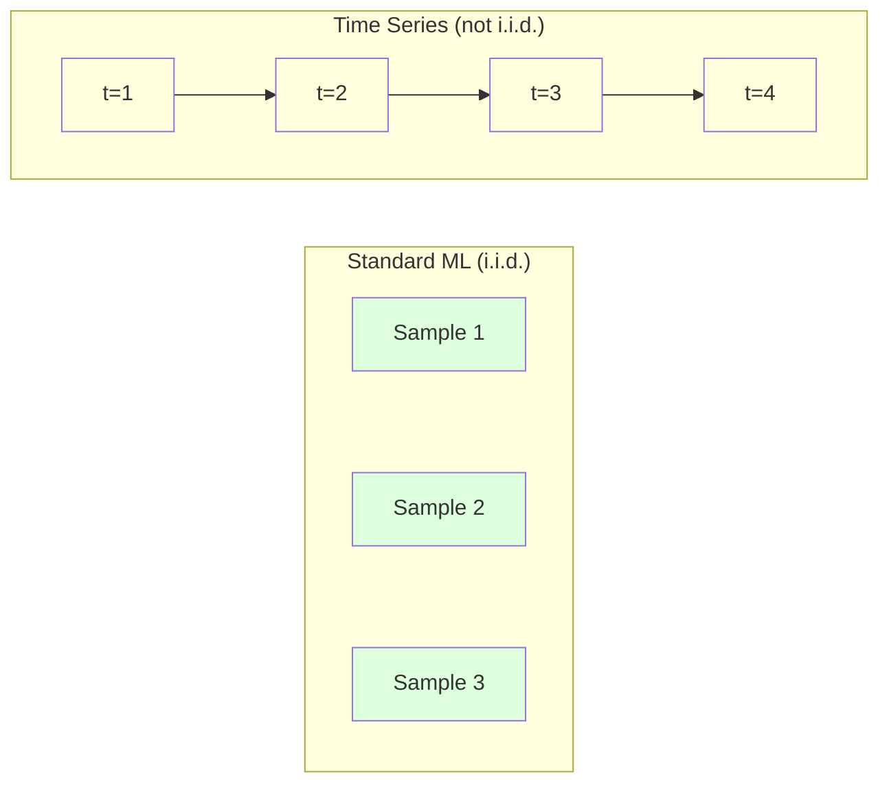
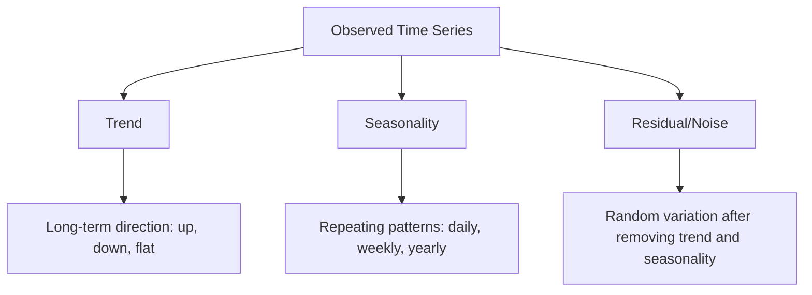
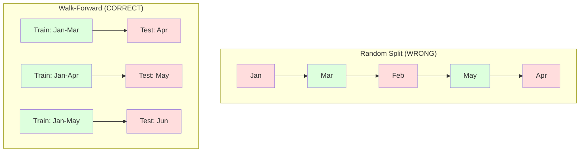

# Time Series Fundamentals

> 过去表现确实能预测未来结果，前提是你先检查 stationarity。

**类型：** 构建
**语言：** Python
**前置要求：** 阶段 2，第 01-09 课
**时间：** ~90 分钟

## 学习目标

- 把 time series 分解为 trend、seasonality 和 residual components，并测试 stationarity
- 实现 lag features 和 rolling statistics，把 time series 转成 supervised learning problem
- 构建 walk-forward validation framework，防止 future data 泄漏进训练
- 解释为什么 random train/test splits 对 time series 无效，并演示它与正确 temporal splits 的性能差距

## 问题

你有按时间排序的数据。每日销售额、每小时温度、每分钟 CPU 使用率、每周股票价格。你想预测下一个值、下一周、下一个季度。

你拿起标准 ML 工具箱：random train/test split、cross-validation、feature matrix 输入、prediction 输出。每一步都是错的。

Time series 破坏了标准 ML 依赖的假设。Samples 不是独立的，今天的温度取决于昨天的温度。Random splits 会把未来信息泄漏到过去。Backtest 中看起来很好的 features 在生产中失败，因为它们依赖会随时间漂移的模式。

一个用 random cross-validation 得到 95% accuracy 的模型，可能在正确 time-based evaluation 下只有 55%。这不是技术细节，而是纸面上有效的模型和生产中有效的模型之间的区别。

本课覆盖基础：时间数据有什么不同，如何诚实评估模型，以及如何把 time series 转成标准 ML 模型能消费的 features。

## 概念

### Time Series 有什么不同

标准 ML 假设 i.i.d.，也就是 independent and identically distributed。每个 sample 都从相同分布独立抽取。Time series 同时违反这两点：

- **Not independent。** 今天的股票价格取决于昨天。本周销售额与上周相关。
- **Not identically distributed。** 分布随时间漂移。12 月销售额看起来不同于 3 月。

这些违反并不小。它们会改变你如何构建 features、如何评估模型，以及哪些算法有效。



在标准 ML 中，samples 可以互换。打乱它们不会改变什么。在 time series 中，顺序就是一切。打乱会摧毁信号。

### Time Series 的 Components

每条 time series 都是这些成分的组合：



- **Trend**：长期方向。收入每年增长 10%。全球温度上升。
- **Seasonality**：固定间隔的重复模式。零售销售在 12 月激增。空调使用在 7 月达到峰值。
- **Residual**：移除 trend 和 seasonality 后剩下的部分。如果 residual 看起来像 white noise，说明分解捕捉了信号。

### Stationarity

如果 time series 的统计属性（mean、variance、autocorrelation）不随时间变化，它就是 stationary。多数 forecasting methods 假设 stationarity。

**为什么重要：** Non-stationary series 的 mean 会漂移。在 1 月数据上训练的模型学到的 mean，与 2 月会看到的 mean 不同。它会系统性错误。

**如何检查：** 在窗口上计算 rolling mean 和 rolling standard deviation。如果它们漂移，series 就 non-stationary。

**如何修复：** Differencing。不要建模原始值，而是建模相邻值之间的变化：

```
diff[t] = value[t] - value[t-1]
```

如果一次 differencing 不能让 series stationary，再应用一次（second-order differencing）。多数真实 series 最多需要两轮。

**示例：**

Original series: [100, 102, 106, 112, 120]
First difference:  [2, 4, 6, 8] (still trending upward)
Second difference:  [2, 2, 2] (constant -- stationary)

原始 series 有 quadratic trend。First differencing 把它变成 linear trend。Second differencing 让它变平。实践中，很少需要超过两轮。

**Formal test：** Augmented Dickey-Fuller（ADF）test 是 stationarity 的标准统计检验。Null hypothesis 是“series is non-stationary”。p-value 低于 0.05 表示可以拒绝 null 并认为 stationary。本课不从零实现 ADF（需要渐近分布表），但代码中的 rolling statistics 方法提供了实用可视检查。

### Autocorrelation

Autocorrelation 衡量 time t 的值与 time t-k（过去 k 步）的值有多相关。Autocorrelation function（ACF）会为每个 lag k 绘制这种 correlation。

**ACF 告诉你：**
- Series 记得多远。若 ACF 在 lag 5 后降到零，5 步之前的值无关。
- 是否存在 seasonality。若 ACF 在 lag 12（月度数据）有尖峰，就有年度 seasonality。
- 要创建多少 lag features。使用到 ACF 变得可忽略的 lag。

**PACF（Partial Autocorrelation Function）** 移除间接 correlations。如果今天与 3 天前相关只是因为两者都与昨天相关，那么 PACF 在 lag 3 为零，而 ACF 在 lag 3 不为零。

### Lag Features：把 Time Series 转成 Supervised Learning

标准 ML 模型需要 feature matrix X 和 target y。Time series 给你一列值。桥梁是 lag features。

取 series [10, 12, 14, 13, 15]，创建 lag-1 和 lag-2 features：

| lag_2 | lag_1 | target |
|-------|-------|--------|
| 10    | 12    | 14     |
| 12    | 14    | 13     |
| 14    | 13    | 15     |

现在你有一个标准 regression problem。任何 ML model（linear regression、random forest、gradient boosting）都可以从 lags 预测 target。

可以工程化的额外 features：
- **Rolling statistics：** 最近 k 个值的 mean、std、min、max
- **Calendar features：** day of week、month、is_holiday、is_weekend
- **Differenced values：** 与前一步的变化
- **Expanding statistics：** cumulative mean、cumulative sum
- **Ratio features：** current value / rolling mean（离近期平均多远）
- **Interaction features：** lag_1 * day_of_week（weekday effects on momentum）

**多少 lags？** 使用 autocorrelation function。如果 ACF 到 lag 10 都显著，至少使用 10 个 lags。如果有 weekly seasonality，包含 lag 7（也可能包含 14）。更多 lags 给模型更多历史，但也增加要拟合的 features，提高过拟合风险。

**Target alignment trap。** 创建 lag features 时，target 必须是 time t 的值，所有 features 必须使用 time t-1 或更早的值。如果你不小心把 time t 的值作为 feature，就有了完美预测器，也有了完全没用的模型。这是 time series feature engineering 中最常见 bug。

### Walk-Forward Validation

这是本课最重要概念。标准 k-fold cross-validation 会随机把 samples 分配给 train 和 test。对 time series，这会泄漏未来信息。



Walk-forward validation：
1. 在截至 time t 的数据上训练
2. 预测 time t+1（或多步 t+1 到 t+k）
3. 向前滑动窗口
4. 重复

每个 test fold 只包含所有 training data 之后的数据。没有未来泄漏。这给出模型部署后表现的诚实估计。

**Expanding window** 使用所有历史数据训练（window 增长）。**Sliding window** 使用固定大小训练窗口（window 滑动）。如果你认为旧数据仍然相关，使用 expanding。如果世界变化且旧数据有害，使用 sliding。

### ARIMA 直觉

ARIMA 是经典 time series 模型。它有三个组件：

- **AR（Autoregressive）：** 从过去值预测。AR(p) 使用最近 p 个值。
- **I（Integrated）：** 通过 differencing 达到 stationarity。I(d) 应用 d 轮 differencing。
- **MA（Moving Average）：** 从过去 forecast errors 预测。MA(q) 使用最近 q 个 errors。

ARIMA(p, d, q) 组合三者。你基于 ACF/PACF 分析或自动搜索（auto-ARIMA）选择 p、d、q。

我们不会从零实现 ARIMA，因为它需要超出本课范围的 numerical optimization。关键是理解每个组件做什么，这样你能解释 ARIMA 结果，并知道何时使用它。

### 什么时候使用什么

| Approach | Best For | Handles Seasonality | Handles External Features |
|----------|---------|-------------------|------------------------|
| Lag features + ML | Tabular with many external features | With calendar features | Yes |
| ARIMA | Single univariate series, short-term | SARIMA variant | No (ARIMAX for limited) |
| Exponential smoothing | Simple trend + seasonality | Yes (Holt-Winters) | No |
| Prophet | Business forecasting, holidays | Yes (Fourier terms) | Limited |
| Neural networks (LSTM, Transformer) | Long sequences, many series | Learned | Yes |

对大多数实际问题，lag features + gradient boosting 是最强起点。它自然处理 external features，不要求 stationarity，也容易 debug。

### Forecasting Horizons 和策略

Single-step forecasting 预测一步之后。Multi-step forecasting 预测多步。有三种策略：

**Recursive（iterated）：** 预测一步，把预测作为下一步输入。简单但 errors 会累积，因为每次预测都使用上一次预测，错误会复合。

**Direct：** 为每个 horizon 训练一个单独模型。Model-1 预测 t+1，Model-5 预测 t+5。没有 error accumulation，但每个模型的训练样本更少，而且不共享信息。

**Multi-output：** 训练一个同时输出所有 horizons 的模型。跨 horizons 共享信息，但要求模型支持 multiple outputs（或 custom loss function）。

对大多数实际问题，短 horizons（1-5 步）从 recursive 开始，长 horizons 从 direct 开始。

### Time Series 常见错误

| Mistake | Why it happens | How to fix |
|---------|---------------|-----------|
| Random train/test split | 标准 ML 习惯 | Use walk-forward or temporal split |
| Using future features | 不小心包含 time t 的 feature | Audit every feature for temporal alignment |
| Overfitting to seasonality | 模型记住 calendar patterns | Hold out a full seasonal cycle in the test set |
| Ignoring scale changes | Revenue 翻倍但模式不变 | Model percentage change instead of absolute |
| Too many lag features | “更多历史更好” | Use ACF to determine relevant lags |
| Not differencing | “模型会自己搞定” | Tree models handle trends; linear models need stationarity |

## 构建它

`code/time_series.py` 中的代码从零实现核心 building blocks。

### Lag Feature Creator

```python
def make_lag_features(series, n_lags):
    n = len(series)
    X = np.full((n, n_lags), np.nan)
    for lag in range(1, n_lags + 1):
        X[lag:, lag - 1] = series[:-lag]
    valid = ~np.isnan(X).any(axis=1)
    return X[valid], series[valid]
```

这会把一维 series 转成 feature matrix：每行把最近 `n_lags` 个值作为 features，把当前值作为 target。

### Walk-Forward Cross-Validation

```python
def walk_forward_split(n_samples, n_splits=5, min_train=50):
    assert min_train < n_samples, "min_train must be less than n_samples"
    step = max(1, (n_samples - min_train) // n_splits)
    for i in range(n_splits):
        train_end = min_train + i * step
        test_end = min(train_end + step, n_samples)
        if train_end >= n_samples:
            break
        yield slice(0, train_end), slice(train_end, test_end)
```

每个 split 都确保 training data 严格早于 test data。Training window 会随每个 fold 扩大。

### Simple Autoregressive Model

纯 AR model 只是 lag features 上的 linear regression：

```python
class SimpleAR:
    def __init__(self, n_lags=5):
        self.n_lags = n_lags
        self.weights = None
        self.bias = None

    def fit(self, series):
        X, y = make_lag_features(series, self.n_lags)
        # Solve via normal equations
        X_b = np.column_stack([np.ones(len(X)), X])
        theta = np.linalg.lstsq(X_b, y, rcond=None)[0]
        self.bias = theta[0]
        self.weights = theta[1:]
        return self
```

这在概念上与第 02 课的 linear regression 完全相同，只是应用在同一个变量的 time-lagged versions 上。

### Stationarity Check

代码会计算 rolling statistics，从视觉和数值上评估 stationarity：

```python
def check_stationarity(series, window=50):
    rolling_mean = np.array([
        series[max(0, i - window):i].mean()
        for i in range(1, len(series) + 1)
    ])
    rolling_std = np.array([
        series[max(0, i - window):i].std()
        for i in range(1, len(series) + 1)
    ])
    return rolling_mean, rolling_std
```

如果 rolling mean 漂移或 rolling std 变化，series 就 non-stationary。应用 differencing 后再检查。

代码还会通过比较 series 的前半段和后半段来检查 stationarity。如果 means 相差超过半个 standard deviation，或 variance ratio 超过 2x，series 会被标记为 non-stationary。

### Autocorrelation

```python
def autocorrelation(series, max_lag=20):
    n = len(series)
    mean = series.mean()
    var = series.var()
    acf = np.zeros(max_lag + 1)
    for k in range(max_lag + 1):
        cov = np.mean((series[:n-k] - mean) * (series[k:] - mean))
        acf[k] = cov / var if var > 0 else 0
    return acf
```

## 使用它

使用 sklearn，你可以直接把 lag features 交给任何 regressor：

```python
from sklearn.linear_model import Ridge
from sklearn.ensemble import GradientBoostingRegressor

X, y = make_lag_features(series, n_lags=10)

for train_idx, test_idx in walk_forward_split(len(X)):
    model = Ridge(alpha=1.0)
    model.fit(X[train_idx], y[train_idx])
    predictions = model.predict(X[test_idx])
```

对于 ARIMA，使用 statsmodels：

```python
from statsmodels.tsa.arima.model import ARIMA

model = ARIMA(train_series, order=(5, 1, 2))
fitted = model.fit()
forecast = fitted.forecast(steps=30)
```

`time_series.py` 中的代码演示两种方法，并用 walk-forward validation 比较它们。

### sklearn TimeSeriesSplit

sklearn 提供 `TimeSeriesSplit`，实现 walk-forward validation：

```python
from sklearn.model_selection import TimeSeriesSplit

tscv = TimeSeriesSplit(n_splits=5)
for train_index, test_index in tscv.split(X):
    X_train, X_test = X[train_index], X[test_index]
    y_train, y_test = y[train_index], y[test_index]
    model.fit(X_train, y_train)
    score = model.score(X_test, y_test)
```

这等价于我们的从零 `walk_forward_split`，但集成进 sklearn 的 cross-validation framework。你可以把它与 `cross_val_score` 一起使用：

```python
from sklearn.model_selection import cross_val_score

scores = cross_val_score(model, X, y, cv=TimeSeriesSplit(n_splits=5))
print(f"Mean score: {scores.mean():.4f} +/- {scores.std():.4f}")
```

### Evaluation Metrics

Time series forecasting 使用 regression metrics，但要放在 time-aware context 中：

- **MAE（Mean Absolute Error）：** |y_true - y_pred| 的平均值。用原始单位解释很容易。“平均来说，预测误差为 3.2 度。”
- **RMSE（Root Mean Squared Error）：** Mean squared error 的平方根。相比 MAE 更惩罚大错误。当大错误比许多小错误更糟时使用。
- **MAPE（Mean Absolute Percentage Error）：** |error / true_value| * 100 的平均值。Scale-independent，适合比较不同 series。但 true values 为零时未定义。
- **Naive baseline comparison：** 永远与简单 baselines 对比。Seasonal naive baseline 会预测一个周期前的值（昨天、上周）。如果模型打不过 naive，就有问题。

### Rolling Features

代码演示了向 lag features 添加 rolling statistics（7 天和 14 天窗口的 mean、std、min、max）。这些提供了仅靠 lag features 捕捉不到的近期趋势和波动信息。

例如，如果 rolling mean 上升，说明 upward trend。如果 rolling std 上升，说明 volatility 增长。这些是 tree-based models 能学到，而 linear models 学不到的模式。

## 交付它

本课会产出：
- `outputs/prompt-time-series-advisor.md` -- 用于 framing time series problems 的 prompt
- `code/time_series.py` -- lag features、walk-forward validation、AR model、stationarity checks

### 必须击败的 Baselines

构建任何模型前，先建立 baselines：

1. **Last value（persistence）。** 预测明天和今天一样。对很多 series 来说，这出奇地难打败。
2. **Seasonal naive。** 预测今天和上周同一天（或去年同一天）一样。如果模型打不过它，就没有学到超越 seasonality 的有用模式。
3. **Moving average。** 预测最近 k 个值的平均。平滑噪声，但无法捕捉突然变化。

如果你的 fancy ML model 输给 seasonal naive baseline，就有 bug。最常见原因：features 中有未来泄漏、evaluation method 错误，或者 series 本身确实随机不可预测。

### 实用技巧

1. **从画图开始。** 任何建模前，先画 raw series。寻找 trends、seasonality、outliers、structural breaks（行为突然改变）。30 秒视觉检查通常比 1 小时自动分析更有用。

2. **先 difference，再建模。** 如果 series 有明显 trend，创建 lag features 前先 difference。Tree-based models 可以处理 trends，但 linear models 不能，而且 differencing 通常不会伤害。

3. **至少 hold out 一个完整 seasonal cycle。** 如果有 weekly seasonality，test set 至少要包含完整一周。如果是 monthly，至少完整一个月。否则无法评估模型是否捕捉了 seasonal pattern。

4. **生产中监控。** Time series models 会随世界变化而退化。滚动跟踪 prediction errors。当 errors 开始上升，就用近期数据重新训练。

5. **小心 regime changes。** 在疫情前数据上训练的模型无法预测疫情后行为。把已知 regime changes 的 indicators 作为 features，或使用会遗忘旧数据的 sliding window。

6. **对 skewed series 做 log-transform。** Revenue、prices 和 counts 常常右偏。取 log 能稳定 variance，并把乘法模式变成加法模式，让 linear models 能处理。先在 log space 预测，再 exponentiate 回原始单位。

## 练习

1. **Stationarity experiment。** 生成带 linear trend 的 series。用 rolling statistics 检查 stationarity。应用 first differencing。再次检查。Quadratic trend 需要几轮 differencing？

2. **Lag selection。** 在 seasonal series（period=7）上计算 ACF。哪些 lags 有最高 autocorrelation？只使用这些 lags（不是连续 lags）创建 lag features。相比使用 lags 1 到 7，accuracy 是否提升？

3. **Walk-forward vs random split。** 在 lag features 上训练 Ridge regression。用 random 80/20 split 和 walk-forward validation 评估。Random split 会高估多少性能？

4. **Feature engineering。** 向 lag features 添加 rolling mean（window=7）、rolling std（window=7）和 day-of-week features。使用 walk-forward validation 比较有无这些额外 features 的 accuracy。

5. **Multi-step forecasting。** 修改 AR model 来预测 5 步之后，而不是 1 步。比较两种策略：（a）预测一步，把预测作为下一步输入（recursive），以及（b）为每个 horizon 训练单独模型（direct）。哪个更准确？

## 关键术语

| 术语 | 人们常说 | 实际含义 |
|------|----------------|----------------------|
| Stationarity | “统计量不随时间变化” | Mean、variance 和 autocorrelation structure 随时间保持不变的 series |
| Differencing | “相邻值相减” | 计算 y[t] - y[t-1]，用于移除 trends 并达成 stationarity |
| Autocorrelation (ACF) | “Series 与自身的相关性” | Time series 与其 lagged copy 之间的 correlation，作为 lag 的函数 |
| Partial autocorrelation (PACF) | “只看直接相关” | 移除所有较短 lags 影响后，lag k 处的 autocorrelation |
| Lag features | “把过去值作为输入” | 使用 y[t-1]、y[t-2]、...、y[t-k] 作为 features 来预测 y[t] |
| Walk-forward validation | “尊重时间的 cross-validation” | Evaluation 中 training data 在时间上总是早于 test data |
| ARIMA | “经典 time series 模型” | AutoRegressive Integrated Moving Average：结合 past values（AR）、differencing（I）和 past errors（MA） |
| Seasonality | “重复 calendar patterns” | 与 calendar periods（日、周、年）绑定的规则、可预测周期 |
| Trend | “长期方向” | Series level 随时间持续上升或下降 |
| Expanding window | “使用全部历史” | Walk-forward validation 中 training set 随每个 fold 增长 |
| Sliding window | “固定大小历史” | Walk-forward validation 中 training set 是向前滑动的固定长度窗口 |

## 延伸阅读

- [Hyndman and Athanasopoulos, Forecasting: Principles and Practice (3rd ed.)](https://otexts.com/fpp3/) -- 最好的免费 time series forecasting 教材
- [scikit-learn Time Series Split](https://scikit-learn.org/stable/modules/generated/sklearn.model_selection.TimeSeriesSplit.html) -- sklearn 的 walk-forward splitter
- [statsmodels ARIMA docs](https://www.statsmodels.org/stable/generated/statsmodels.tsa.arima.model.ARIMA.html) -- 带 diagnostics 的 ARIMA 实现
- [Makridakis et al., The M5 Competition (2022)](https://www.sciencedirect.com/science/article/pii/S0169207021001874) -- 大规模 forecasting competition，比较 ML methods 与 statistical methods
