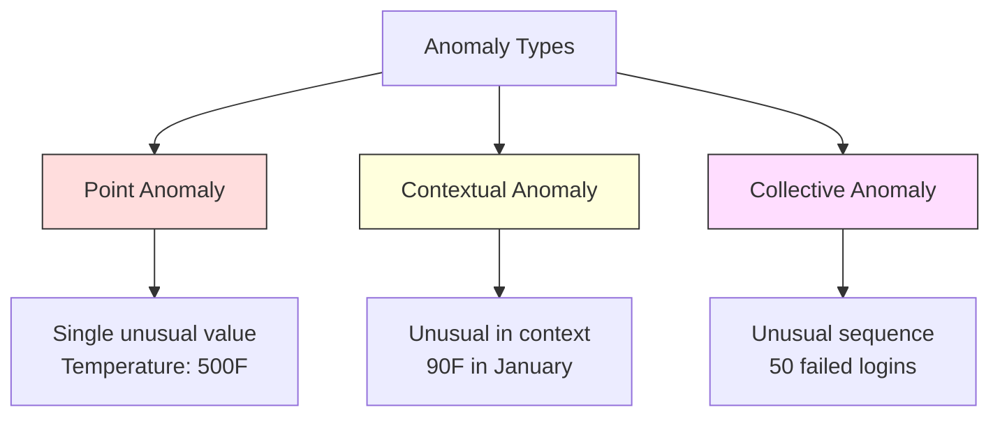
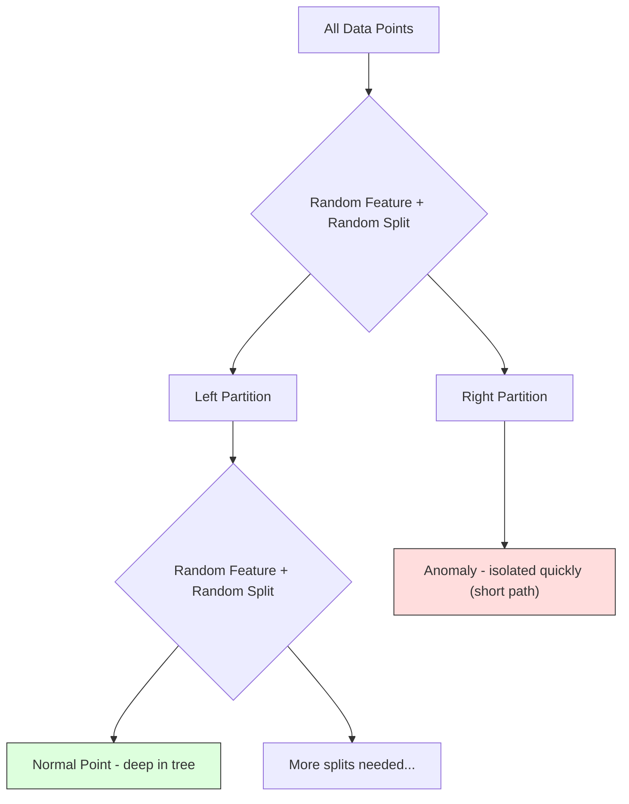
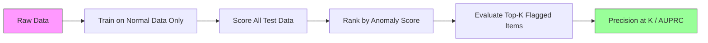

# 异常检测

> 正常很容易定义。异常就是任何不符合正常的东西。

**类型：** 构建
**语言：** Python
**前置要求：** 阶段 2，第 01-09 课
**时间：** ~75 分钟

## 学习目标

- 从零实现 Z-score、IQR 和 Isolation Forest anomaly detection methods
- 区分 point、contextual 和 collective anomalies，并为每种选择合适 detection method
- 解释为什么 anomaly detection 被表述为建模正常数据，而不是分类异常
- 比较 unsupervised anomaly detection 与 supervised classification，并评估 novel anomaly coverage 和 precision 之间的权衡

## 问题

一张信用卡下午 2 点在纽约使用，2:05 又在东京使用。工厂传感器读数 150 度，而正常范围是 80-120。服务器每秒发送 50,000 个请求，而日均是 200。

这些都是 anomalies。发现它们很重要。欺诈造成数十亿美元损失。设备故障造成停机。网络入侵造成数据泄露。

挑战在于：你很少有 anomalies 的 labeled examples。欺诈只占交易的 0.1%。设备故障一年只发生几次。你无法训练标准 classifier，因为 “anomaly” class 中几乎没有东西可学。即使你有一些标签，你见过的 anomalies 也不是之后会遇到的全部类型。明天的欺诈方案不同于今天。

Anomaly detection 会反转问题。不要学习什么是异常，而是学习什么是正常。任何偏离正常的东西都可疑。这无需标签，能适应新类型 anomalies，并扩展到海量数据集。

## 概念

### Anomalies 的类型

并不是所有 anomalies 都一样：

- **Point anomalies。** 单个数据点无论上下文如何都很异常。500 度的温度读数。一个通常消费 50 美元的账户发生 50,000 美元交易。
- **Contextual anomalies。** 数据点在给定上下文中异常。90 度在夏天正常，在冬天异常。同样的值，不同上下文。
- **Collective anomalies。** 一组数据点整体异常，即使每个单独点可能正常。五次登录失败正常。连续五十次是暴力破解攻击。

多数方法检测 point anomalies。Contextual anomalies 需要时间或位置 features。Collective anomalies 需要 sequence-aware methods。



### Unsupervised Framing

在标准 classification 中，你有两个 classes 的标签。在 anomaly detection 中，通常有三种情况之一：

1. **Fully unsupervised。** 完全没有标签。你在全部数据上 fit detector，并希望 anomalies 足够少，不会污染“normal”模型。
2. **Semi-supervised。** 你有一个只包含 normal data 的干净数据集。你在这个干净集合上 fit，并对其他所有数据打分。可行时这是最强设置。
3. **Weakly supervised。** 你有少量 labeled anomalies。用它们做 evaluation，而不是 training。先 unsupervised 训练，再在 labeled subset 上测 precision/recall。

关键洞见：anomaly detection 与 classification 根本不同。你建模的是 normal data 的分布，而不是两个 classes 之间的 decision boundary。

### Supervised vs Unsupervised：权衡

如果你有 labeled anomalies，应该用它们训练（supervised classification），还是只用于评估（unsupervised detection）？

**Supervised（当作 classification）：**
- 能抓住你以前见过的确切 anomaly types
- 对已知 anomaly types precision 更高
- 完全漏掉 novel anomaly types
- 新 anomaly types 出现时需要重新训练
- 需要足够 anomaly examples（通常太少）

**Unsupervised（建模 normal，标记 deviations）：**
- 抓住任何偏离 normal 的东西，包括新类型
- 不需要 labeled anomalies
- False positive rate 更高（并非所有 unusual 都是坏事）
- 对 distribution shift 更稳健

实践中，最好的系统会结合两者：unsupervised detection 提供广覆盖，supervised models 处理已知高优先级 anomaly types，人类审核模糊案例。

### Z-Score Method

最简单方法。计算每个 feature 的 mean 和 standard deviation。标记任何离 mean 超过 k 个 standard deviations 的点。

```text
z_score = (x - mean) / std
anomaly if |z_score| > threshold
```

默认 threshold 是 3.0（对于 Gaussian distribution，99.7% normal data 落在 3 个 standard deviations 内）。

**优点：** 简单、快速、可解释（“这个值距离正常有 4.5 个 standard deviations”）。

**缺点：** 假设数据正态分布。对 training data 中的 outliers 敏感（outliers 会移动 mean 并膨胀 std，让它们更难被发现）。在 multimodal distributions 上失败。

**何时有效：** 数据大致钟形的单 feature monitoring。服务器响应时间、制造公差、基线稳定的传感器读数。

**何时失败：** 多 cluster 数据（两个办公室有不同基线温度）、skewed data（交易金额中 1000 美元很少但不异常）、training set 中包含 outliers 的数据。

### IQR Method

比 Z-score 更稳健。使用 interquartile range，而不是 mean 和 standard deviation。

```
Q1 = 25th percentile
Q3 = 75th percentile
IQR = Q3 - Q1
lower_bound = Q1 - factor * IQR
upper_bound = Q3 + factor * IQR
anomaly if x < lower_bound or x > upper_bound
```

默认 factor 是 1.5。

**优点：** 对 outliers 稳健（percentiles 不受极端值影响）。适用于 skewed distributions。无正态性假设。

**缺点：** 只是一元方法（独立应用到每个 feature）。无法检测只有联合考虑 features 才异常的点（某个点在每个单独 feature 上都正常，但在 joint space 中异常）。

**实践提示：** IQR 的 1.5 factor 对应 box plot 中的 whiskers。Whiskers 外的点是潜在 outliers。使用 3.0 而不是 1.5 会让 detector 更保守（更少 flags、更少 false positives）。正确 factor 取决于你对 false alarms 的容忍度。

### Isolation Forest

关键洞见：anomalies 少且不同。在随机划分数据时，anomalies 更容易被隔离，需要更少 random splits 就能从其余数据中分离。



**如何工作：**
1. 构建许多 random trees（isolation forest）
2. 在每个 node，随机选择一个 feature，并在该 feature 的 min 和 max 之间随机选择 split value
3. 持续 split，直到每个点都被隔离（进入自己的 leaf）
4. Anomalies 在所有 trees 上的 average path length 更短

**为什么有效：** Normal points 位于 dense regions。需要许多 random splits 才能把一个点从邻居中隔离。Anomalies 位于 sparse regions。一两次 random splits 就足以隔离它们。

Anomaly score 基于所有 trees 的 average path length，并用 random binary search tree 的 expected path length 归一化：

```
score(x) = 2^(-average_path_length(x) / c(n))
```

其中 `c(n)` 是 n 个 samples 的 expected path length。Score 接近 1 表示 anomaly。Score 接近 0.5 表示 normal。Score 接近 0 表示非常 normal（位于 dense clusters 深处）。

**优点：** 无分布假设。适用于高维。扩展性好（每棵树使用 subsample，因此对样本数次线性）。处理 mixed feature types。

**缺点：** 对 dense regions 中的 anomalies 表现差（masking effect）。当许多 features irrelevant 时，random splitting 效率较低。

**关键 hyperparameters：**
- `n_estimators`：树数量。100 通常足够。更多树给出更稳定 scores，但计算更慢。
- `max_samples`：每棵树使用的样本数。原论文默认 256。较小值让单棵树不那么准确，但增加 diversity。Subsampling 是 Isolation Forest 快速的原因：每棵树只看一小部分数据。
- `contamination`：预期 anomaly 比例。只用于设置 threshold。不影响 scores 本身。

### Local Outlier Factor（LOF）

LOF 比较某个点周围的 local density 和它 neighbors 周围的 density。一个位于 sparse region、周围却是 dense regions 的点是异常。

**如何工作：**
1. 对每个点，找到 k nearest neighbors
2. 计算 local reachability density（neighborhood 有多密）
3. 比较每个点的 density 和它 neighbors 的 densities
4. 如果某个点的 density 远低于 neighbors，就认为它是 outlier

**LOF score：**
- LOF 接近 1.0 表示与 neighbors density 相似（normal）
- LOF 大于 1.0 表示 density 低于 neighbors（潜在 anomaly）
- LOF 远大于 1.0（例如 2.0+）表示显著更低 density（很可能 anomaly）

“Local” 很关键。考虑一个有两个 clusters 的数据集：一个 1000 点 dense cluster，一个 50 点 sparse cluster。Sparse cluster 边缘的点并不全局异常，它有 50 个 neighbors。但如果它的直接 neighbors 比它更密，它就是局部异常。LOF 捕捉了 global methods 漏掉的 nuance。

**优点：** 检测 local anomalies（在 neighborhood 中异常的点，即使它们不全局异常）。适用于不同密度的 clusters。

**缺点：** 大数据集上慢（naive implementation 是 O(n^2)）。对 k 选择敏感。高维中表现不好（curse of dimensionality 影响距离计算）。

### 比较

| Method | Assumptions | Speed | Handles High Dims | Detects Local Anomalies |
|--------|------------|-------|-------------------|------------------------|
| Z-score | Normal distribution | Very fast | Yes (per feature) | No |
| IQR | None (per feature) | Very fast | Yes (per feature) | No |
| Isolation Forest | None | Fast | Yes | Partially |
| LOF | Distance is meaningful | Slow | Poorly | Yes |

### Evaluation Challenges

评估 anomaly detectors 比评估 classifiers 更难：

- **Extreme class imbalance。** Anomalies 占 0.1% 时，全预测 “normal” 会有 99.9% accuracy。Accuracy 没用。
- **AUROC 会误导。** 极端不平衡下，即使模型在实用 thresholds 漏掉大多数 anomalies，AUROC 也可能看起来不错。
- **更好的 metrics：** Precision@k（top k flagged items 中有多少是真 anomalies）、AUPRC（precision-recall curve 面积），以及固定 false positive rate 下的 recall。



### Anomaly Detection Pipeline

实践中，anomaly detection 遵循这个 workflow：

1. **Collect baseline data。** 理想情况下，是你知道没有（或很少）anomalies 的一段时期。
2. **Feature engineering。** Raw features 加 derived features（rolling statistics、time features、ratios）。
3. **Train the detector。** 在 baseline data 上 fit。模型学习 “normal” 长什么样。
4. **Score new data。** 每个新 observation 得到 anomaly score。
5. **Threshold selection。** 选择 score cutoff。这是 business decision：更高 threshold 意味着更少 false alarms，但更多 missed anomalies。
6. **Alert and investigate。** Flagged points 进入 human review 或 automated response。
7. **Feedback collection。** 记录 flagged items 是 true anomalies 还是 false alarms。用这些数据随时间评估 detector 并调 threshold。

Pipeline 永远不会“完成”。Data distributions 会漂移，new anomaly types 会出现，thresholds 也需要调整。把 anomaly detection 当成活系统，而不是一次性模型。

## 构建它

`code/anomaly_detection.py` 中的代码从零实现 Z-score、IQR 和 Isolation Forest。

### Z-Score Detector

```python
def zscore_detect(X, threshold=3.0):
    mean = X.mean(axis=0)
    std = X.std(axis=0)
    std[std == 0] = 1.0
    z = np.abs((X - mean) / std)
    return z.max(axis=1) > threshold
```

简单且 vectorized。如果任何 feature 超过 threshold，就 flag 这个点。

### IQR Detector

```python
def iqr_detect(X, factor=1.5):
    q1 = np.percentile(X, 25, axis=0)
    q3 = np.percentile(X, 75, axis=0)
    iqr = q3 - q1
    iqr[iqr == 0] = 1.0
    lower = q1 - factor * iqr
    upper = q3 + factor * iqr
    outside = (X < lower) | (X > upper)
    return outside.any(axis=1)
```

### 从零实现 Isolation Forest

从零实现会构建 isolation trees，随机划分 feature space：

```python
class IsolationTree:
    def __init__(self, max_depth):
        self.max_depth = max_depth

    def fit(self, X, depth=0):
        n, p = X.shape
        if depth >= self.max_depth or n <= 1:
            self.is_leaf = True
            self.size = n
            return self
        self.is_leaf = False
        self.feature = np.random.randint(p)
        x_min = X[:, self.feature].min()
        x_max = X[:, self.feature].max()
        if x_min == x_max:
            self.is_leaf = True
            self.size = n
            return self
        self.threshold = np.random.uniform(x_min, x_max)
        left_mask = X[:, self.feature] < self.threshold
        self.left = IsolationTree(self.max_depth).fit(X[left_mask], depth + 1)
        self.right = IsolationTree(self.max_depth).fit(X[~left_mask], depth + 1)
        return self
```

隔离一个点所需的 path length 决定 anomaly score。路径越短，越异常。

`IsolationForest` class 会包装多棵 trees：

```python
class IsolationForest:
    def __init__(self, n_estimators=100, max_samples=256, seed=42):
        self.n_estimators = n_estimators
        self.max_samples = max_samples

    def fit(self, X):
        sample_size = min(self.max_samples, X.shape[0])
        max_depth = int(np.ceil(np.log2(sample_size)))
        for _ in range(self.n_estimators):
            idx = rng.choice(X.shape[0], size=sample_size, replace=False)
            tree = IsolationTree(max_depth=max_depth)
            tree.fit(X[idx])
            self.trees.append(tree)

    def anomaly_score(self, X):
        avg_path = average path length across all trees
        scores = 2.0 ** (-avg_path / c(max_samples))
        return scores
```

归一化因子 `c(n)` 是包含 n 个元素的 binary search tree 中 unsuccessful search 的 expected path length。它等于 `2 * H(n-1) - 2*(n-1)/n`，其中 `H` 是 harmonic number。这个归一化让不同大小数据集上的 scores 可比较。

### Demo Scenarios

代码生成多个测试场景：

1. **Single cluster with outliers。** 一个二维 Gaussian cluster，并在中心外注入 anomalies。所有方法在这里都应有效。
2. **Multimodal data。** 三个大小和密度不同的 clusters。Clusters 之间的点是异常。Z-score 会吃力，因为 per-feature ranges 很宽。
3. **High-dimensional data。** 50 个 features，但 anomalies 只在其中 5 个上不同。测试方法能否在 feature 子集中找到 anomalies。

每个 demo 都用 precision、recall、F1 和 Precision@k 比较所有方法。

## 使用它

使用 sklearn（库实现，不是从零版本）：

```python
from sklearn.ensemble import IsolationForest
from sklearn.neighbors import LocalOutlierFactor

iso = IsolationForest(n_estimators=100, contamination=0.05, random_state=42)
iso.fit(X_train)
predictions = iso.predict(X_test)

lof = LocalOutlierFactor(n_neighbors=20, contamination=0.05, novelty=True)
lof.fit(X_train)
predictions = lof.predict(X_test)
```

注意 `contamination` 会设置 expected fraction of anomalies。正确设置它很重要，太低会漏掉 anomalies，太高会制造 false alarms。

`anomaly_detection.py` 中的代码会在相同数据上比较从零实现和 sklearn。

### sklearn Contamination Parameter

sklearn 中的 `contamination` parameter 决定如何把连续 anomaly scores 转成 binary predictions 的 threshold。它不会改变底层 scores。

```python
iso_5 = IsolationForest(contamination=0.05)
iso_10 = IsolationForest(contamination=0.10)
```

两者产生相同 anomaly scores。但 `iso_5` flag top 5%，而 `iso_10` flag top 10%。如果你不知道真实 anomaly rate（通常不知道），把 contamination 设为 “auto”，直接使用 raw scores。根据 false positives 和 false negatives 的成本权衡设置自己的 threshold。

### One-Class SVM

另一个值得了解的 unsupervised anomaly detector。One-Class SVM 会在高维 feature space 中（使用 kernel trick）围绕 normal data 拟合一个 boundary。

```python
from sklearn.svm import OneClassSVM

oc_svm = OneClassSVM(kernel="rbf", gamma="auto", nu=0.05)
oc_svm.fit(X_train)
predictions = oc_svm.predict(X_test)
```

`nu` parameter 近似 anomaly 比例。One-Class SVM 在小到中等数据集上效果好，但不能扩展到很大数据（kernel matrix 二次增长）。

### Autoencoder Approach（预览）

Autoencoders 是学习压缩并重构数据的 neural networks。在 normal data 上训练。测试时，anomalies 有高 reconstruction error，因为网络只学会重构 normal patterns。

这会在阶段 3（Deep Learning）中讲，但原则相同：建模 normal，标记 deviations。

### Ensemble Anomaly Detection

就像 ensemble methods 改善 classification（第 11 课）一样，组合多个 anomaly detectors 会改善检测。最简单方法：

1. 运行多个 detectors（Z-score、IQR、Isolation Forest、LOF）
2. 把每个 detector 的 scores 归一化到 [0, 1]
3. 平均归一化 scores
4. 标记平均 score 超过 threshold 的点

这会减少 false positives，因为不同方法有不同 failure modes。一个被四种方法都 flag 的点几乎肯定异常。只被一种方法 flag 的点可能是该方法的 quirks。

更复杂的 ensembles 会按每个 detector 的估计可靠性加权（如果有带已知 anomalies 的 validation set）。

### 生产考虑

1. **Threshold drift。** 随着 data distribution 漂移，固定 threshold 会过时。监控 anomaly scores 的分布，并定期调整。
2. **Alert fatigue。** False alarms 太多时，操作员会停止关注。先用高 threshold（更少、更可靠 alerts），随着信任建立再降低。
3. **Ensemble approach。** 生产中组合多个 detectors。只有多个方法同意异常时才 flag。这样会显著降低 false positives。
4. **Feature engineering。** Raw features 很少足够。添加 rolling statistics、ratios、time-since-last-event 和领域特定 features。好的 feature set 比 detector 选择更重要。
5. **Feedback loop。** 当操作员调查 flagged items 并确认或驳回它们时，把结果反馈进系统。随着时间积累 labeled data，用来评估和改进 detector。

## 交付它

本课会产出：
- `outputs/skill-anomaly-detector.md` -- 选择正确 detector 的决策 skill
- `code/anomaly_detection.py` -- 从零实现 Z-score、IQR 和 Isolation Forest，并与 sklearn 比较

### 选择 Threshold

Anomaly score 是连续的。你需要 threshold 来做 binary decisions。这是 business decision，不是纯技术决策。

考虑两个场景：
- **Fraud detection。** 漏掉欺诈很昂贵（拒付、客户信任）。False alarms 会让人工分析师花 5 分钟调查。把 threshold 设低以抓住更多欺诈，接受更多 false alarms。
- **Equipment maintenance。** False alarm 意味着一次不必要停机，成本 50,000 美元。漏掉故障意味着 500,000 美元维修。设置 threshold 来平衡这些成本。

两种情况下，最优 threshold 都取决于 false positives 和 false negatives 的成本比。绘制不同 thresholds 下的 precision 和 recall，叠加 cost function，并选择最小成本点。

### 扩展到生产

对于生产中的 real-time anomaly detection：

1. **Batch training, online scoring。** 定期（每日、每周）在近期 normal data 上训练模型。每个新 observation 到达时打分。
2. **Feature computation must match。** 如果训练时使用 30 天 rolling statistics，那么为新 observation 计算 features 时也需要 30 天历史。缓存所需历史。
3. **Score distribution monitoring。** 随时间跟踪 anomaly scores 分布。如果 median score 上移，说明数据正在变化或模型过期。
4. **Explainability。** Flag anomaly 时说明原因。Z-score：“Feature X 比 normal 高 4.2 个 standard deviations。”Isolation Forest：“这个点平均 3.1 次 split 被隔离（normal points 需要 8.5 次）。”

## 练习

1. **Threshold tuning。** 用 thresholds 从 1.0 到 5.0、步长 0.5 运行 Z-score detector。绘制每个 threshold 下的 precision 和 recall。你的数据 sweet spot 在哪里？

2. **Multivariate anomalies。** 创建二维数据，每个 feature 单独看都正常，但组合异常（例如远离主 cluster diagonal 的点）。展示 per-feature Z-score 会漏掉它们，而 Isolation Forest 会抓住。

3. **LOF from scratch。** 使用 k-nearest neighbors 实现 Local Outlier Factor。与 sklearn 的 LocalOutlierFactor 在同一数据上比较。使用 k=10 和 k=50，k 的选择如何影响结果？

4. **Streaming anomaly detection。** 修改 Z-score detector，使其在 streaming 设置下工作：随着新点到达更新 running mean 和 variance（Welford's online algorithm）。与同一数据上的 batch Z-score 比较。

5. **Real-world evaluation。** 取一个带已知 anomalies 的数据集（例如 Kaggle 的 credit card fraud）。使用 precision@100、precision@500 和 AUPRC 评估四种方法。哪种效果最好？为什么？

## 关键术语

| 术语 | 人们常说 | 实际含义 |
|------|----------------|----------------------|
| Anomaly | “Outlier，异常点” | 显著偏离 normal data 预期模式的数据点 |
| Point anomaly | “单个奇怪值” | 无论上下文如何都异常的单个 observation |
| Contextual anomaly | “正常值，错误上下文” | 在给定 context（时间、位置等）下异常，但在另一个 context 可能正常的 observation |
| Isolation Forest | “用 random splits 找 outliers” | 随机树 ensemble；相比 normal points，anomalies 用更少 splits 就被隔离 |
| Local Outlier Factor | “把 density 和 neighbors 比较” | 标记 local density 明显低于 neighbors' density 的点 |
| Z-score | “离 mean 几个 standard deviations” | (x - mean) / std，用 standard deviation 为单位衡量点离中心多远 |
| IQR | “Interquartile range” | Q3 - Q1，衡量中间 50% 数据的 spread，用于稳健 outlier detection |
| Contamination | “预期 anomaly 比例” | 告诉 detector 应该把多大比例数据 flag 为 anomalous 的 hyperparameter |
| Precision@k | “Top k flags 中多少是真的” | 只在 k 个最可疑点上计算 precision，适合 imbalanced anomaly detection |
| AUPRC | “Precision-recall curve 下面积” | 汇总所有 thresholds 下 precision-recall 表现的 metric，比 AUROC 更适合 imbalanced data |

## 延伸阅读

- [Liu et al., Isolation Forest (2008)](https://cs.nju.edu.cn/zhouzh/zhouzh.files/publication/icdm08b.pdf) -- Isolation Forest 原始论文
- [Breunig et al., LOF: Identifying Density-Based Local Outliers (2000)](https://dl.acm.org/doi/10.1145/342009.335388) -- LOF 原始论文
- [scikit-learn Outlier Detection docs](https://scikit-learn.org/stable/modules/outlier_detection.html) -- sklearn 所有 anomaly detectors 总览
- [Chandola et al., Anomaly Detection: A Survey (2009)](https://dl.acm.org/doi/10.1145/1541880.1541882) -- anomaly detection methods 综合综述
- [Goldstein and Uchida, A Comparative Evaluation of Unsupervised Anomaly Detection Algorithms (2016)](https://journals.plos.org/plosone/article?id=10.1371/journal.pone.0152173) -- 10 种方法在真实数据集上的经验比较
