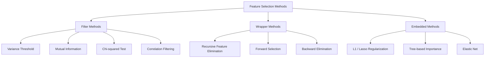
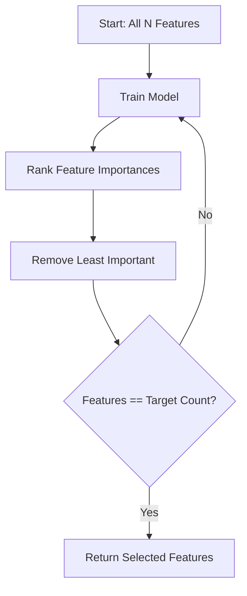
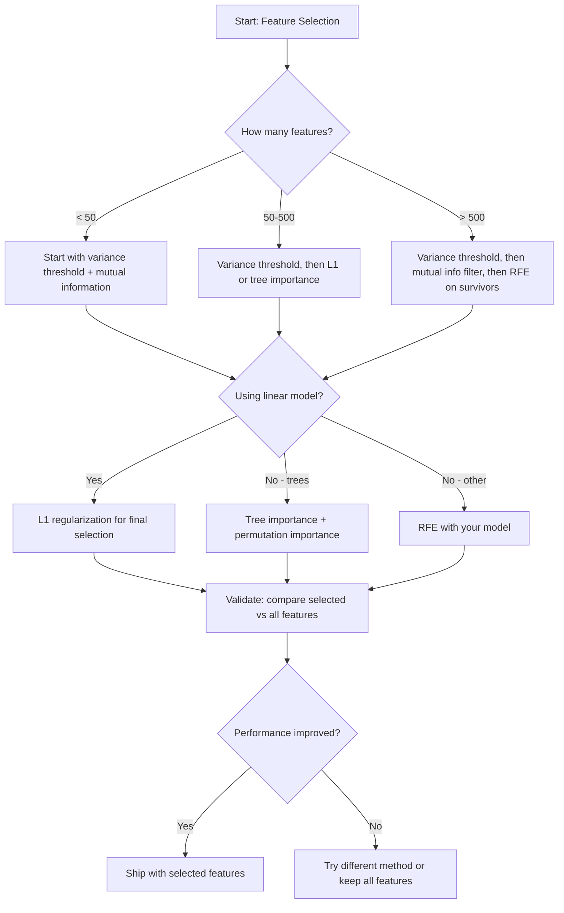

# Feature Selection

> 更多 features 并不更好。正确的 features 才更好。

**类型：** 构建
**语言：** Python
**前置要求：** 阶段 2，第 01-09、08 课（feature engineering）
**时间：** ~75 分钟

## 学习目标

- 从零实现 filter methods（variance threshold、mutual information、chi-squared）和 wrapper methods（RFE、forward selection）
- 解释为什么 mutual information 能捕捉 correlation 会漏掉的非线性 feature-target relationships
- 比较 L1 regularization（embedded selection）和 RFE（wrapper selection），并评估它们的计算权衡
- 构建组合多种方法的 feature selection pipeline，并在 held-out data 上演示 improved generalization

## 问题

你有 500 个 features。模型训练慢、总是过拟合，而且没人能解释它学到了什么。你希望加入更多 features 来改善性能。结果更差。

这就是 curse of dimensionality。随着 features 数量增加，feature space 的体积爆炸。数据点变得稀疏。点与点之间的距离趋同。模型需要指数级更多数据才能找到真实模式。Noise features 淹没 signal features。过拟合变成默认结果。

Feature selection 是解药。去掉噪声，移除冗余，保留真正携带 target 信息的 features。结果是：训练更快、泛化更好，而且模型可以解释。

目标不是使用所有可用信息，而是使用正确的信息。

## 概念

### Feature Selection 的三类方法

每种 feature selection method 都属于三类之一：



**Filter methods** 使用统计度量独立给每个 feature 打分。它们不使用模型。速度快，但会漏掉 feature interactions。

**Wrapper methods** 训练模型来评估 feature subsets。它们用 model performance 作为分数。结果更好，但代价高，因为要多次重新训练模型。

**Embedded methods** 在模型训练过程中选择 features。L1 regularization 把 weights 推到零。Decision trees 会在最有用 features 上 split。Selection 发生在 fitting 期间，而不是单独步骤。

### Variance Threshold

最简单的 filter。如果某个 feature 在 samples 间几乎不变化，它几乎不携带信息。

考虑一个 1000 个 samples 中有 999 个都是 0.0 的 feature。它的 variance 接近零。没有模型能用它区分 classes。移除它。

```
variance(x) = mean((x - mean(x))^2)
```

设置一个 threshold（例如 0.01）。丢弃所有 variance 低于它的 features。它完全不看 target variable，就能移除 constant 或 near-constant features。

何时使用：作为其他方法之前的 preprocessing step。它以近乎零成本抓住明显没用的 features。

局限：一个 feature 可以有 high variance，但仍然是纯噪声。Variance threshold 必要但不充分。

### Mutual Information

Mutual information 衡量知道 feature X 的值后，target Y 的不确定性降低多少。

```
I(X; Y) = sum_x sum_y p(x, y) * log(p(x, y) / (p(x) * p(y)))
```

如果 X 和 Y 独立，p(x, y) = p(x) * p(y)，log 项为零，因此 I(X; Y) = 0。X 告诉你关于 Y 的信息越多，mutual information 越高。

相比 correlation 的关键优势：mutual information 能捕捉非线性关系。一个 feature 可能与 target zero correlation，但有 high mutual information，因为关系是二次或周期性的。

对于 continuous features，先离散成 bins（histogram-based estimation）。Bins 数会影响估计，太少会丢信息，太多会增加噪声。常见选择：sqrt(n) bins 或 Sturges' rule（1 + log2(n)）。


### Recursive Feature Elimination（RFE）

RFE 是 wrapper method。它使用模型自己的 feature importance 来迭代剪枝：

1. 用所有 features 训练模型
2. 按 importance 排序 features（线性模型用 coefficients，树用 impurity reduction）
3. 移除最不重要 feature(s)
4. 重复，直到剩下目标数量的 features



RFE 会考虑 feature interactions，因为模型会一起看到所有剩余 features。移除一个 feature 会改变其他 features 的 importance。这让它比 filter methods 更彻底。

代价：你要训练模型 N - target 次。有 500 个 features、目标 10 个时，就是 490 次 training runs。对昂贵模型来说很慢。可以通过每轮移除多个 features（例如底部 10%）加速。

### L1（Lasso）Regularization

L1 regularization 会把 weights 的绝对值加到 loss function：

```
loss = prediction_error + alpha * sum(|w_i|)
```

Alpha parameter 控制 features 被剪掉的激进程度。Alpha 越高，更多 weights 精确变成零。

为什么正好是零？L1 penalty 在 weight space 中创建菱形约束区域。Optimal solution 倾向于落在菱形角上，那里的一个或多个 weights 为零。L2 regularization（ridge）创建圆形约束，weights 会变小但很少正好为零。

这是 embedded feature selection：模型在训练时学习忽略哪些 features。Weight 为零的 features 实际上被移除了。

优点：单次训练，处理 correlated features（选择一个，把其他置零），内置于大多数 linear model implementations。

局限：只适用于 linear models。无法捕捉 nonlinear feature importance。

### Tree-Based Feature Importance

Decision trees 及其 ensembles（random forests、gradient boosting）天然排序 features。每次 split 都会降低 impurity（classification 用 Gini 或 entropy，regression 用 variance）。带来更大 impurity reductions 的 features 更重要。

对于有 T 棵树的 random forest：

```
importance(feature_j) = (1/T) * sum over all trees of
    sum over all nodes splitting on feature_j of
        (n_samples * impurity_decrease)
```

这为每个 feature 给出 normalized importance score。它自动处理 nonlinear relationships 和 feature interactions。

注意：tree-based importance 偏向具有许多 unique values 的 features（high cardinality）。随机 ID column 会看起来重要，因为它可以完美 split 每个 sample。用 permutation importance 做 sanity check。

### Permutation Importance

Model-agnostic 方法：

1. 训练模型，并在 validation data 上记录 baseline performance
2. 对每个 feature：随机打乱其值，测量 performance 下降多少
3. 下降越大，feature 越重要

如果打乱某个 feature 不影响 performance，模型不依赖它。如果 performance 崩溃，该 feature 很关键。

Permutation importance 避免 tree-based importance 的 cardinality bias。但它慢：每个 feature 都要做一次完整 evaluation，并且为了稳定通常要重复多次。

### Comparison Table

| Method | Type | Speed | Nonlinear | Feature Interactions |
|--------|------|-------|-----------|---------------------|
| Variance threshold | Filter | Very fast | No | No |
| Mutual information | Filter | Fast | Yes | No |
| Correlation filter | Filter | Fast | No | No |
| RFE | Wrapper | Slow | Depends on model | Yes |
| L1 / Lasso | Embedded | Fast | No (linear) | No |
| Tree importance | Embedded | Medium | Yes | Yes |
| Permutation importance | Model-agnostic | Slow | Yes | Yes |

### Decision Flowchart



## 构建它

### 第 1 步：生成 feature structure 已知的合成数据

```python
import numpy as np


def make_feature_selection_data(n_samples=500, seed=42):
    rng = np.random.RandomState(seed)

    x1 = rng.randn(n_samples)
    x2 = rng.randn(n_samples)
    x3 = rng.randn(n_samples)
    x4 = x1 + 0.1 * rng.randn(n_samples)
    x5 = x2 + 0.1 * rng.randn(n_samples)

    informative = np.column_stack([x1, x2, x3, x4, x5])

    correlated = np.column_stack([
        x1 * 0.9 + 0.1 * rng.randn(n_samples),
        x2 * 0.8 + 0.2 * rng.randn(n_samples),
        x3 * 0.7 + 0.3 * rng.randn(n_samples),
        x1 * 0.5 + x2 * 0.5 + 0.1 * rng.randn(n_samples),
        x2 * 0.6 + x3 * 0.4 + 0.1 * rng.randn(n_samples),
    ])

    noise = rng.randn(n_samples, 10) * 0.5

    X = np.hstack([informative, correlated, noise])
    y = (2 * x1 - 1.5 * x2 + x3 + 0.5 * rng.randn(n_samples) > 0).astype(int)

    feature_names = (
        [f"info_{i}" for i in range(5)]
        + [f"corr_{i}" for i in range(5)]
        + [f"noise_{i}" for i in range(10)]
    )

    return X, y, feature_names
```

我们知道 ground truth：features 0-4 是 informative（其中 3 和 4 是 0 和 1 的 correlated copies），features 5-9 与 informative features 相关，features 10-19 是纯噪声。好的 selection method 应该把 0-4 排在最高，把 10-19 排在最低。

### 第 2 步：Variance threshold

```python
def variance_threshold(X, threshold=0.01):
    variances = np.var(X, axis=0)
    mask = variances > threshold
    return mask, variances
```

### 第 3 步：Mutual information（discrete）

```python
def discretize(x, n_bins=10):
    min_val, max_val = x.min(), x.max()
    if max_val == min_val:
        return np.zeros_like(x, dtype=int)
    bin_edges = np.linspace(min_val, max_val, n_bins + 1)
    binned = np.digitize(x, bin_edges[1:-1])
    return binned


def mutual_information(X, y, n_bins=10):
    n_samples, n_features = X.shape
    mi_scores = np.zeros(n_features)

    y_vals, y_counts = np.unique(y, return_counts=True)
    p_y = y_counts / n_samples

    for f in range(n_features):
        x_binned = discretize(X[:, f], n_bins)
        x_vals, x_counts = np.unique(x_binned, return_counts=True)
        p_x = dict(zip(x_vals, x_counts / n_samples))

        mi = 0.0
        for xv in x_vals:
            for yi, yv in enumerate(y_vals):
                joint_mask = (x_binned == xv) & (y == yv)
                p_xy = np.sum(joint_mask) / n_samples
                if p_xy > 0:
                    mi += p_xy * np.log(p_xy / (p_x[xv] * p_y[yi]))
        mi_scores[f] = mi

    return mi_scores
```

### 第 4 步：Recursive Feature Elimination

```python
def simple_logistic_importance(X, y, lr=0.1, epochs=100):
    n_samples, n_features = X.shape
    w = np.zeros(n_features)
    b = 0.0

    for _ in range(epochs):
        z = X @ w + b
        pred = 1.0 / (1.0 + np.exp(-np.clip(z, -500, 500)))
        error = pred - y
        w -= lr * (X.T @ error) / n_samples
        b -= lr * np.mean(error)

    return w, b


def rfe(X, y, n_features_to_select=5, lr=0.1, epochs=100):
    n_total = X.shape[1]
    remaining = list(range(n_total))
    rankings = np.ones(n_total, dtype=int)
    rank = n_total

    while len(remaining) > n_features_to_select:
        X_subset = X[:, remaining]
        w, _ = simple_logistic_importance(X_subset, y, lr, epochs)
        importances = np.abs(w)

        least_idx = np.argmin(importances)
        original_idx = remaining[least_idx]
        rankings[original_idx] = rank
        rank -= 1
        remaining.pop(least_idx)

    for idx in remaining:
        rankings[idx] = 1

    selected_mask = rankings == 1
    return selected_mask, rankings
```

### 第 5 步：L1 feature selection

```python
def soft_threshold(w, alpha):
    return np.sign(w) * np.maximum(np.abs(w) - alpha, 0)


def l1_feature_selection(X, y, alpha=0.1, lr=0.01, epochs=500):
    n_samples, n_features = X.shape
    w = np.zeros(n_features)
    b = 0.0

    for _ in range(epochs):
        z = X @ w + b
        pred = 1.0 / (1.0 + np.exp(-np.clip(z, -500, 500)))
        error = pred - y

        gradient_w = (X.T @ error) / n_samples
        gradient_b = np.mean(error)

        w -= lr * gradient_w
        w = soft_threshold(w, lr * alpha)
        b -= lr * gradient_b

    selected_mask = np.abs(w) > 1e-6
    return selected_mask, w
```

### 第 6 步：Tree-based importance（simple decision tree）

```python
def gini_impurity(y):
    if len(y) == 0:
        return 0.0
    classes, counts = np.unique(y, return_counts=True)
    probs = counts / len(y)
    return 1.0 - np.sum(probs ** 2)


def best_split(X, y, feature_idx):
    values = np.unique(X[:, feature_idx])
    if len(values) <= 1:
        return None, -1.0

    best_threshold = None
    best_gain = -1.0
    parent_gini = gini_impurity(y)
    n = len(y)

    for i in range(len(values) - 1):
        threshold = (values[i] + values[i + 1]) / 2.0
        left_mask = X[:, feature_idx] <= threshold
        right_mask = ~left_mask

        n_left = np.sum(left_mask)
        n_right = np.sum(right_mask)

        if n_left == 0 or n_right == 0:
            continue

        gain = parent_gini - (n_left / n) * gini_impurity(y[left_mask]) - (n_right / n) * gini_impurity(y[right_mask])

        if gain > best_gain:
            best_gain = gain
            best_threshold = threshold

    return best_threshold, best_gain


def tree_importance(X, y, n_trees=50, max_depth=5, seed=42):
    rng = np.random.RandomState(seed)
    n_samples, n_features = X.shape
    importances = np.zeros(n_features)

    for _ in range(n_trees):
        sample_idx = rng.choice(n_samples, size=n_samples, replace=True)
        feature_subset = rng.choice(n_features, size=max(1, int(np.sqrt(n_features))), replace=False)

        X_boot = X[sample_idx]
        y_boot = y[sample_idx]

        tree_imp = _build_tree_importance(X_boot, y_boot, feature_subset, max_depth)
        importances += tree_imp

    total = importances.sum()
    if total > 0:
        importances /= total

    return importances


def _build_tree_importance(X, y, feature_subset, max_depth, depth=0):
    n_features = X.shape[1]
    importances = np.zeros(n_features)

    if depth >= max_depth or len(np.unique(y)) <= 1 or len(y) < 4:
        return importances

    best_feature = None
    best_threshold = None
    best_gain = -1.0

    for f in feature_subset:
        threshold, gain = best_split(X, y, f)
        if gain > best_gain:
            best_gain = gain
            best_feature = f
            best_threshold = threshold

    if best_feature is None or best_gain <= 0:
        return importances

    importances[best_feature] += best_gain * len(y)

    left_mask = X[:, best_feature] <= best_threshold
    right_mask = ~left_mask

    importances += _build_tree_importance(X[left_mask], y[left_mask], feature_subset, max_depth, depth + 1)
    importances += _build_tree_importance(X[right_mask], y[right_mask], feature_subset, max_depth, depth + 1)

    return importances
```

### 第 7 步：运行所有方法并比较

代码文件会在同一个 synthetic dataset 上运行全部五种方法，并打印 comparison table，展示每种方法选择了哪些 features。

## 使用它

使用 scikit-learn，feature selection 可以内置到 pipeline：

```python
from sklearn.feature_selection import (
    VarianceThreshold,
    mutual_info_classif,
    RFE,
    SelectFromModel,
)
from sklearn.linear_model import Lasso, LogisticRegression
from sklearn.ensemble import RandomForestClassifier

vt = VarianceThreshold(threshold=0.01)
X_filtered = vt.fit_transform(X)

mi_scores = mutual_info_classif(X, y)
top_k = np.argsort(mi_scores)[-10:]

rfe_selector = RFE(LogisticRegression(), n_features_to_select=10)
rfe_selector.fit(X, y)
X_rfe = rfe_selector.transform(X)

lasso_selector = SelectFromModel(Lasso(alpha=0.01))
lasso_selector.fit(X, y)
X_lasso = lasso_selector.transform(X)

rf = RandomForestClassifier(n_estimators=100)
rf.fit(X, y)
importances = rf.feature_importances_
```

从零实现展示了每个方法内部发生什么。Variance threshold 只是计算 `var(X, axis=0)` 并应用 mask。Mutual information 是在 contingency table 中统计 joint 和 marginal frequencies。RFE 是一个 train、rank、prune 的循环。L1 是带 soft-thresholding step 的 gradient descent。Tree importance 会跨 splits 累积 impurity reductions。没有魔法，只是统计和循环。

sklearn 版本增加了稳健性（例如 mutual_info_classif 使用 k-NN density estimation，而不是 binning）、速度（C 实现）和 pipeline integration。

## 交付它

本课会产出：
- `outputs/skill-feature-selector.md` -- 选择正确 feature selection method 的快速参考决策树

## 练习

1. **Forward selection**：实现 RFE 的反向方法。从零个 features 开始。每一步添加最能改善 model performance 的 feature。当继续添加 features 不再有帮助时停止。把 selected features 与 RFE 结果比较。哪个更快？哪个结果更好？

2. **Stability selection**：运行 L1 feature selection 50 次，每次在随机 80% 数据子集上，并使用略微不同 alpha 值。统计每个 feature 被选中的频率。被选中超过 80% 的 features 是 “stable”。把 stable features 与单次 L1 selection 比较。哪个更可靠？

3. **Multicollinearity detection**：计算所有 features 的 correlation matrix。实现一个函数，给定 correlation threshold（例如 0.9），从每个高度相关 feature pair 中移除一个 feature（保留与 target mutual information 更高的那个）。在 synthetic dataset 上测试，验证它移除了冗余 correlated features。

4. **Feature selection pipeline**：把 variance threshold、mutual information filter 和 RFE 串成一个 pipeline。先移除 near-zero-variance features，再保留 mutual information top 50%，然后在 survivors 上运行 RFE。把这个 pipeline 与直接在所有 features 上运行 RFE 比较。Pipeline 更快吗？Accuracy 是否相当？

5. **Permutation importance from scratch**：实现 permutation importance。对每个 feature，把它的值打乱 10 次，测量 F1 score 的平均下降。与 tree-based importance 的排序比较。找出它们不同意的情况并解释原因（提示：correlated features）。

## 关键术语

| 术语 | 人们常说 | 实际含义 |
|------|----------------|----------------------|
| Filter method | “独立给 features 打分” | 不训练模型、用统计度量排序 features 的 feature selection 方法，每个 feature 单独评估 |
| Wrapper method | “用模型选 features” | 通过训练模型并用其性能作为 selection criterion 来评估 feature subsets 的方法 |
| Embedded method | “模型训练时选择 features” | Feature selection 作为 model fitting 的一部分发生，例如 L1 regularization 把 weights 推到零 |
| Mutual information | “一个变量告诉你另一个变量多少” | 知道 X 后对 Y 不确定性的降低量，可以捕捉线性和非线性依赖 |
| Recursive Feature Elimination | “Train、rank、prune、repeat” | 迭代 wrapper method：训练模型、移除最不重要 feature(s)，重复直到达到目标数量 |
| L1 / Lasso regularization | “杀掉 features 的 penalty” | 把 weights 绝对值之和加入 loss function，使不重要 feature weights 精确变为零 |
| Variance threshold | “移除 constant features” | 丢弃跨 samples variance 低于指定 threshold 的 features，过滤不携带信息的 features |
| Feature importance | “哪些 features 最重要” | 表示每个 feature 对模型预测贡献多少的分数，可由 split gains（trees）或 coefficient magnitudes（linear）计算 |
| Permutation importance | “打乱并测损害” | 通过随机打乱每个 feature 的值并测量 model performance 下降来评估 feature importance |
| Curse of dimensionality | “Features 太多，数据不够” | 添加 features 会让 feature space 体积指数增长，使数据稀疏、距离失去意义的现象 |

## 延伸阅读

- [An Introduction to Variable and Feature Selection (Guyon & Elisseeff, 2003)](https://jmlr.org/papers/v3/guyon03a.html) -- feature selection methods 的奠基综述，仍被广泛引用
- [scikit-learn Feature Selection Guide](https://scikit-learn.org/stable/modules/feature_selection.html) -- filter、wrapper 和 embedded methods 的实用参考，含代码示例
- [Stability Selection (Meinshausen & Buhlmann, 2010)](https://arxiv.org/abs/0809.2932) -- 结合 subsampling 和 feature selection，得到稳健、可复现结果
- [Beware Default Random Forest Importances (Strobl et al., 2007)](https://bmcbioinformatics.biomedcentral.com/articles/10.1186/1471-2105-8-25) -- 展示 tree-based importance 的 cardinality bias，并提出 conditional importance 作为替代
