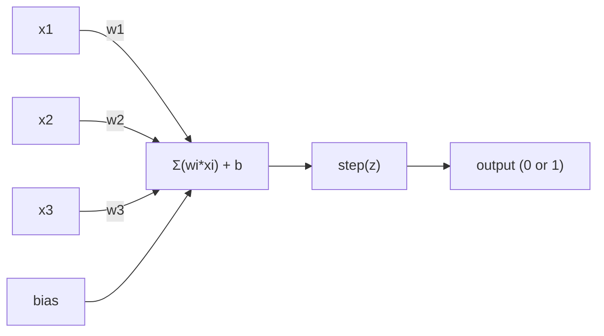
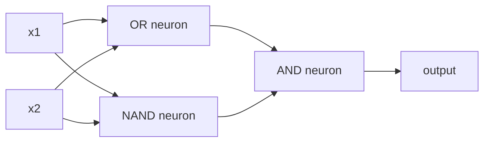

# 感知机

> 感知机是神经网络的原子。把它拆开，你会看到 weights、bias 和一个决策。

**类型：** 构建
**语言：** Python
**前置要求：** 阶段 1（线性代数直觉）
**时间：** ~60 分钟

## 学习目标

- 在 Python 中从零实现 perceptron，包括 weight update rule 和 step activation function
- 解释为什么单个 perceptron 只能解决 linearly separable problems，并演示 XOR failure case
- 通过组合 OR、NAND 和 AND gates 构造 multi-layer perceptron 来解决 XOR
- 用 sigmoid activation 和 backpropagation 训练 two-layer network，让它自动学习 XOR

## 问题

你知道 vectors 和 dot products。你知道 matrix 会把输入变换成输出。但机器如何*学习*应该使用哪个变换？

感知机回答了这个问题。它是最简单的学习机器：取一些输入，乘以 weights，加上 bias，然后做一个 binary decision。接着调整。就这么多。每个曾经构建的 neural network，都是把这个思想一层层堆起来。

理解 perceptron 就是理解“学习”在代码里究竟是什么意思：调整数字，直到输出匹配现实。

## 概念

### 一个 Neuron，一个 Decision

Perceptron 接收 n 个输入，每个乘以一个 weight，求和，加上 bias，再把结果传入 activation function。



Step function 很直接：如果 weighted sum 加 bias >= 0，输出 1。否则输出 0。

```
step(z) = 1  if z >= 0
           0  if z < 0
```

这是一个 linear classifier。Weights 和 bias 定义一条线（或高维中的 hyperplane），把 input space 分成两个区域。

### Decision Boundary

对于两个输入，perceptron 会在二维空间中画一条线：

```
  x2
  ┤
  │  Class 1        /
  │    (0)          /
  │                /
  │               / w1·x1 + w2·x2 + b = 0
  │              /
  │             /     Class 2
  │            /        (1)
  ┼───────────/──────────── x1
```

线的一侧输出 0。另一侧输出 1。训练会移动这条线，直到它正确分隔 classes。

### 学习规则

Perceptron learning rule 很简单：

```
For each training example (x, y_true):
    y_pred = predict(x)
    error = y_true - y_pred

    For each weight:
        w_i = w_i + learning_rate * error * x_i
    bias = bias + learning_rate * error
```

如果预测正确，error = 0，什么都不变。如果它预测 0 但应该是 1，weights 增加。如果它预测 1 但应该是 0，weights 减小。Learning rate 控制每次调整多大。

### XOR 问题

它在这里失败。看这些 logic gates：

```
AND gate:           OR gate:            XOR gate:
x1  x2  out         x1  x2  out         x1  x2  out
0   0   0           0   0   0           0   0   0
0   1   0           0   1   1           0   1   1
1   0   0           1   0   1           1   0   1
1   1   1           1   1   1           1   1   0
```

AND 和 OR 是 linearly separable：你可以画一条线把 0 和 1 分开。XOR 不行。没有一条线能把 [0,1] 和 [1,0] 与 [0,0] 和 [1,1] 分开。

```
AND (separable):        XOR (not separable):

  x2                      x2
  1 ┤  0     1            1 ┤  1     0
    │     /                 │
  0 ┤  0 / 0              0 ┤  0     1
    ┼──/──────── x1         ┼──────────── x1
       line works!          no single line works!
```

这是根本限制。单个 perceptron 只能解决 linearly separable problems。Minsky 和 Papert 在 1969 年证明了这一点，它几乎让神经网络研究停滞了十年。

修复方法：把 perceptrons 堆成 layers。Multi-layer perceptron 可以通过把两个线性决策组合成一个非线性决策来解决 XOR。

## 构建它

### 第 1 步：Perceptron class

```python
class Perceptron:
    def __init__(self, n_inputs, learning_rate=0.1):
        self.weights = [0.0] * n_inputs
        self.bias = 0.0
        self.lr = learning_rate

    def predict(self, inputs):
        total = sum(w * x for w, x in zip(self.weights, inputs))
        total += self.bias
        return 1 if total >= 0 else 0

    def train(self, training_data, epochs=100):
        for epoch in range(epochs):
            errors = 0
            for inputs, target in training_data:
                prediction = self.predict(inputs)
                error = target - prediction
                if error != 0:
                    errors += 1
                    for i in range(len(self.weights)):
                        self.weights[i] += self.lr * error * inputs[i]
                    self.bias += self.lr * error
            if errors == 0:
                print(f"Converged at epoch {epoch + 1}")
                return
        print(f"Did not converge after {epochs} epochs")
```

### 第 2 步：在 logic gates 上训练

```python
and_data = [
    ([0, 0], 0),
    ([0, 1], 0),
    ([1, 0], 0),
    ([1, 1], 1),
]

or_data = [
    ([0, 0], 0),
    ([0, 1], 1),
    ([1, 0], 1),
    ([1, 1], 1),
]

not_data = [
    ([0], 1),
    ([1], 0),
]

print("=== AND Gate ===")
p_and = Perceptron(2)
p_and.train(and_data)
for inputs, _ in and_data:
    print(f"  {inputs} -> {p_and.predict(inputs)}")

print("\n=== OR Gate ===")
p_or = Perceptron(2)
p_or.train(or_data)
for inputs, _ in or_data:
    print(f"  {inputs} -> {p_or.predict(inputs)}")

print("\n=== NOT Gate ===")
p_not = Perceptron(1)
p_not.train(not_data)
for inputs, _ in not_data:
    print(f"  {inputs} -> {p_not.predict(inputs)}")
```

### 第 3 步：观察 XOR 失败

```python
xor_data = [
    ([0, 0], 0),
    ([0, 1], 1),
    ([1, 0], 1),
    ([1, 1], 0),
]

print("\n=== XOR Gate (single perceptron) ===")
p_xor = Perceptron(2)
p_xor.train(xor_data, epochs=1000)
for inputs, expected in xor_data:
    result = p_xor.predict(inputs)
    status = "OK" if result == expected else "WRONG"
    print(f"  {inputs} -> {result} (expected {expected}) {status}")
```

它永远不会收敛。这是单个 perceptron 无法学习 XOR 的硬证明。

### 第 4 步：用两层解决 XOR

技巧：XOR = (x1 OR x2) AND NOT (x1 AND x2)。组合三个 perceptrons：



```python
def xor_network(x1, x2):
    or_neuron = Perceptron(2)
    or_neuron.weights = [1.0, 1.0]
    or_neuron.bias = -0.5

    nand_neuron = Perceptron(2)
    nand_neuron.weights = [-1.0, -1.0]
    nand_neuron.bias = 1.5

    and_neuron = Perceptron(2)
    and_neuron.weights = [1.0, 1.0]
    and_neuron.bias = -1.5

    hidden1 = or_neuron.predict([x1, x2])
    hidden2 = nand_neuron.predict([x1, x2])
    output = and_neuron.predict([hidden1, hidden2])
    return output


print("\n=== XOR Gate (multi-layer network) ===")
for inputs, expected in xor_data:
    result = xor_network(inputs[0], inputs[1])
    print(f"  {inputs} -> {result} (expected {expected})")
```

四种情况都正确。把 perceptrons 堆成 layers，就能创建单个 perceptron 产生不了的 decision boundaries。

### 第 5 步：训练 Two-Layer Network

第 4 步是手工写 weights。它对 XOR 可行，但真实问题中你不会提前知道正确 weights。修复方法：用 sigmoid 替换 step function，并通过 backpropagation 自动学习 weights。

```python
class TwoLayerNetwork:
    def __init__(self, learning_rate=0.5):
        import random
        random.seed(0)
        self.w_hidden = [[random.uniform(-1, 1), random.uniform(-1, 1)] for _ in range(2)]
        self.b_hidden = [random.uniform(-1, 1), random.uniform(-1, 1)]
        self.w_output = [random.uniform(-1, 1), random.uniform(-1, 1)]
        self.b_output = random.uniform(-1, 1)
        self.lr = learning_rate

    def sigmoid(self, x):
        import math
        x = max(-500, min(500, x))
        return 1.0 / (1.0 + math.exp(-x))

    def forward(self, inputs):
        self.inputs = inputs
        self.hidden_outputs = []
        for i in range(2):
            z = sum(w * x for w, x in zip(self.w_hidden[i], inputs)) + self.b_hidden[i]
            self.hidden_outputs.append(self.sigmoid(z))
        z_out = sum(w * h for w, h in zip(self.w_output, self.hidden_outputs)) + self.b_output
        self.output = self.sigmoid(z_out)
        return self.output

    def train(self, training_data, epochs=10000):
        for epoch in range(epochs):
            total_error = 0
            for inputs, target in training_data:
                output = self.forward(inputs)
                error = target - output
                total_error += error ** 2

                d_output = error * output * (1 - output)

                saved_w_output = self.w_output[:]
                hidden_deltas = []
                for i in range(2):
                    h = self.hidden_outputs[i]
                    hd = d_output * saved_w_output[i] * h * (1 - h)
                    hidden_deltas.append(hd)

                for i in range(2):
                    self.w_output[i] += self.lr * d_output * self.hidden_outputs[i]
                self.b_output += self.lr * d_output

                for i in range(2):
                    for j in range(len(inputs)):
                        self.w_hidden[i][j] += self.lr * hidden_deltas[i] * inputs[j]
                    self.b_hidden[i] += self.lr * hidden_deltas[i]
```

```python
net = TwoLayerNetwork(learning_rate=2.0)
net.train(xor_data, epochs=10000)
for inputs, expected in xor_data:
    result = net.forward(inputs)
    predicted = 1 if result >= 0.5 else 0
    print(f"  {inputs} -> {result:.4f} (rounded: {predicted}, expected {expected})")
```

它与第 4 步有两个关键区别。第一，sigmoid 替换 step function，它是平滑的，因此 gradients 存在。第二，`train` method 会把 error 从 output 反向传播到 hidden layer，并按每个 weight 对 error 的贡献比例调整它。这就是 20 行里的 backpropagation。

这是通向第 03 课的桥梁。`d_output` 和 `hidden_deltas` 背后的数学，就是 chain rule 应用于 network graph。我们会在那里正式推导。

## 使用它

你刚从零构建的东西，用一个 import 就能得到：

```python
from sklearn.linear_model import Perceptron as SkPerceptron
import numpy as np

X = np.array([[0,0],[0,1],[1,0],[1,1]])
y = np.array([0, 0, 0, 1])

clf = SkPerceptron(max_iter=100, tol=1e-3)
clf.fit(X, y)
print([clf.predict([x])[0] for x in X])
```

五行。你的 30 行 `Perceptron` class 做同样的事。Sklearn 版本增加 convergence checks、多种 loss functions 和 sparse input 支持，但核心 loop 相同：weighted sum、step function、error 上的 weight update。

真正差距出现在 scale 上。Production networks 中会改变什么：

- Step function 变成 sigmoid、ReLU 或其他 smooth activations
- Weights 通过 backpropagation 自动学习（第 03 课）
- Layers 更深：3、10、100+ layers
- 同样原则成立：每一层都从上一层 outputs 创建新 features

单个 perceptron 只能画直线。堆叠它们，你可以画任意形状。

## 交付它

本课会产出：
- `outputs/skill-perceptron.md` - 一个覆盖何时需要 single-layer vs multi-layer architectures 的 skill

## 练习

1. 在 NAND gate（universal gate，任何 logic circuit 都能由 NAND 构建）上训练 perceptron。验证它的 weights 和 bias 形成有效 decision boundary。
2. 修改 Perceptron class，跟踪每个 epoch 的 decision boundary（w1*x1 + w2*x2 + b = 0）。打印它在 AND gate 训练期间如何移动。
3. 构建一个 3-input perceptron：只有当 3 个输入中至少 2 个为 1 时输出 1（majority vote function）。它 linearly separable 吗？为什么？

## 关键术语

| 术语 | 人们常说 | 实际含义 |
|------|----------------|----------------------|
| Perceptron | “假神经元” | 一个 linear classifier：inputs 和 weights 的 dot product，加 bias，再经过 step function |
| Weight | “输入有多重要” | 一个 multiplier，缩放每个 input 对 decision 的贡献 |
| Bias | “阈值” | 一个常数，用来移动 decision boundary，让 perceptron 即使所有 inputs 为零也能 fire |
| Activation function | “压缩值的东西” | Weighted sum 后应用的函数；perceptron 用 step function，现代 networks 用 sigmoid/ReLU |
| Linearly separable | “能在中间画一条线” | 可以用单个 hyperplane 完美分离 classes 的数据集 |
| XOR problem | “Perceptrons 做不到的事” | 证明 single-layer networks 无法学习 non-linearly-separable functions 的问题 |
| Decision boundary | “Classifier 切换的位置” | Hyperplane w*x + b = 0，把 input space 分成两个 classes |
| Multi-layer perceptron | “真正的 neural network” | 堆叠成 layers 的 perceptrons，每一层 output 进入下一层 input |

## 延伸阅读

- Frank Rosenblatt, "The Perceptron: A Probabilistic Model for Information Storage and Organization in the Brain" (1958) -- 开启这一切的原始论文
- Minsky & Papert, "Perceptrons" (1969) -- 证明 single-layer networks 无法解决 XOR，并让 perceptron 研究停滞十年的书
- Michael Nielsen, "Neural Networks and Deep Learning", Chapter 1 (http://neuralnetworksanddeeplearning.com/) -- 免费在线资源，对 perceptrons 如何组成 networks 有最好的可视化解释
