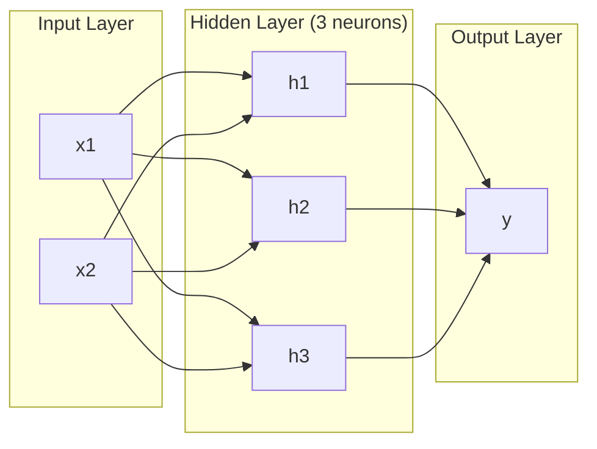
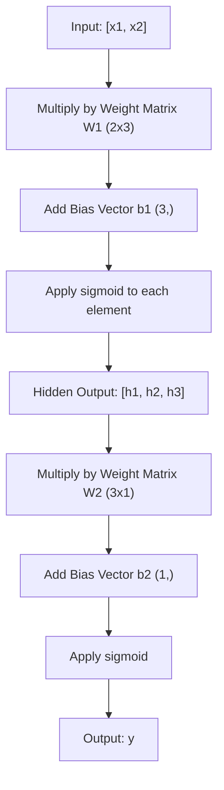
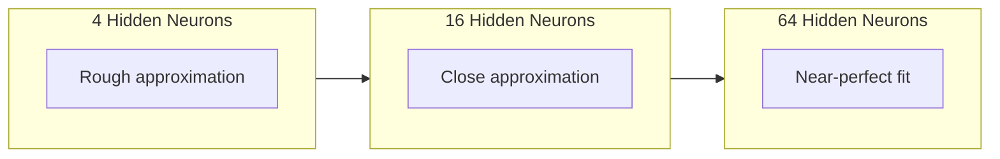

# 多层网络与前向传播

> 一个神经元只能画一条线。把它们堆叠起来，你就能画出任意形状。

**类型：** 构建
**语言：** Python
**先修：** Phase 01（Math Foundations），Lesson 03.01（The Perceptron）
**时间：** 约 90 分钟

## 学习目标

- 从零构建带有 Layer 和 Network 类的多层网络，并完成完整的 forward pass
- 跟踪网络每一层的矩阵维度，并识别 shape mismatch
- 解释堆叠非线性 activation 如何让网络学习弯曲的决策边界
- 使用 2-2-1 架构和手工调好的 sigmoid 权重解决 XOR 问题

## 问题

单个神经元就是一台画直线的机器。仅此而已。它只能在数据中画一条直线。AI 中的真实问题——图像识别、语言理解、下围棋——都需要曲线。把神经元堆叠成层，就是获得曲线的方式。

1969 年，Minsky 和 Papert 证明了这个限制是致命的：单层网络无法学习 XOR。不是“学起来困难”，而是数学上不可能。XOR 真值表把 [0,1] 和 [1,0] 放在一侧，把 [0,0] 和 [1,1] 放在另一侧。没有一条直线能把它们分开。

这让神经网络研究的资金沉寂了十多年。事后看，修复方法很明显：不要只用一层。把神经元堆成多层。让第一层把输入空间切出新的特征，再让第二层组合这些特征，做出单条直线无法完成的决策。

这个堆叠结构就是多层网络。它是今天所有生产级 deep learning 模型的基础。forward pass——数据从输入经过 hidden layers 流向输出——是你必须先构建出来的第一件事，否则后面什么都跑不起来。

## 概念

### 层：输入、隐藏、输出

多层网络有三类层：

**Input layer**——严格说不算一层。它保存原始数据。两个特征意味着两个输入节点。这里不发生计算。

**Hidden layers**——真正工作的地方。每个神经元接收上一层的所有输出，应用 weights 和 bias，然后把结果传入 activation function。“Hidden” 是因为这些值不会直接出现在训练数据中。

**Output layer**——最终答案。二分类通常是一个带 sigmoid 的神经元。多分类则通常是每个类别一个神经元。



这是一个 2-3-1 网络。两个输入，三个隐藏神经元，一个输出。每条连接都有一个 weight。每个神经元（输入除外）都有一个 bias。

每一层都会产生一个数字向量，称为 hidden state。对文本来说，hidden state 会提高维度——例如把一个词编码成 768 个数字来捕捉语义。对图像来说，它们会降低维度——把数百万像素压缩成可管理的表示。hidden state 就是学习发生的地方。

### 神经元与 Activation

每个神经元做三件事：

1. 将每个输入乘以对应的 weight
2. 把所有乘积求和并加上 bias
3. 把这个和传入 activation function

暂时使用 sigmoid 作为 activation：

```
sigmoid(z) = 1 / (1 + e^(-z))
```

Sigmoid 会把任意数字压缩到 (0, 1) 范围内。很大的正输入会推向 1，很大的负输入会推向 0，0 会映射到 0.5。这个平滑曲线使学习成为可能——不同于 perceptron 的硬阶跃，sigmoid 在任何地方都有 gradient。

### Forward Pass：数据如何流动

forward pass 会把输入数据逐层推过网络，直到到达输出。forward pass 期间不发生学习。它只是纯计算：乘、加、激活，然后重复。



在每一层，三个操作按顺序发生：

```
z = W * input + b       (linear transformation)
a = sigmoid(z)           (activation)
```

一层的输出会成为下一层的输入。这就是整个 forward pass。

### 矩阵维度

跟踪维度是 deep learning 中最重要的调试技能。下面是 2-3-1 网络：

| 步骤 | 操作 | 维度 | 结果 Shape |
|------|------|------|------------|
| Input | x | -- | (2,) |
| Hidden linear | W1 * x + b1 | W1: (3, 2), b1: (3,) | (3,) |
| Hidden activation | sigmoid(z1) | -- | (3,) |
| Output linear | W2 * h + b2 | W2: (1, 3), b2: (1,) | (1,) |
| Output activation | sigmoid(z2) | -- | (1,) |

规则是：第 k 层的 weight matrix W 的 shape 是 (neurons_in_layer_k, neurons_in_layer_k_minus_1)。行对应当前层，列对应上一层。如果 shape 对不上，就是 bug。

### 通用近似定理

1989 年，George Cybenko 证明了一件了不起的事：只要有一个 hidden layer，并且神经元数量足够多，神经网络就能以任意期望精度近似任何连续函数。

这并不意味着一个 hidden layer 总是最好。它意味着这种架构在理论上具备表达能力。实践中，更深的网络（更多层、每层更少神经元）可以用远少于浅而宽网络的总参数学习同样的函数。这就是 deep learning 有效的原因。

直觉是：hidden layer 中的每个神经元学习一个“凸起”或特征。足够多的凸起放在正确位置，就可以近似任意平滑曲线。神经元越多，凸起越多，近似越好。



### 可组合性

神经网络是可组合的。你可以堆叠、串联、并行运行它们。Whisper 模型使用一个 encoder network 处理音频，再用一个独立的 decoder network 生成文本。现代 LLM 大多是 decoder-only。BERT 是 encoder-only。T5 是 encoder-decoder。架构选择决定了模型能做什么。

## 构建

纯 Python。不使用 numpy。每个矩阵操作都从零编写。

### Step 1: Sigmoid Activation

```python
import math

def sigmoid(x):
    x = max(-500.0, min(500.0, x))
    return 1.0 / (1.0 + math.exp(-x))
```

把输入 clamp 到 [-500, 500] 可以防止 overflow。`math.exp(500)` 很大，但仍然有限。`math.exp(1000)` 会是无穷大。

### Step 2: Layer Class

deep learning 中最重要的操作是矩阵乘法。每一层、每个 attention head、每一次 forward pass——归根到底都是 matmul。linear layer 接收一个输入向量，把它乘以 weight matrix，并加上 bias vector：y = Wx + b。这个单一方程占据了神经网络中 90% 的计算。

一层保存一个 weight matrix 和一个 bias vector。它的 forward 方法接收输入向量，并返回激活后的输出。

```python
class Layer:
    def __init__(self, n_inputs, n_neurons, weights=None, biases=None):
        if weights is not None:
            self.weights = weights
        else:
            import random
            self.weights = [
                [random.uniform(-1, 1) for _ in range(n_inputs)]
                for _ in range(n_neurons)
            ]
        if biases is not None:
            self.biases = biases
        else:
            self.biases = [0.0] * n_neurons

    def forward(self, inputs):
        self.last_input = inputs
        self.last_output = []
        for neuron_idx in range(len(self.weights)):
            z = sum(
                w * x for w, x in zip(self.weights[neuron_idx], inputs)
            )
            z += self.biases[neuron_idx]
            self.last_output.append(sigmoid(z))
        return self.last_output
```

weight matrix 的 shape 是 (n_neurons, n_inputs)。每一行是一个神经元对所有输入的 weights。forward 方法遍历神经元，计算 weighted sum 加 bias，应用 sigmoid，并收集结果。

### Step 3: Network Class

网络就是一组层。forward pass 把它们串起来：第 k 层的输出流入第 k+1 层。

```python
class Network:
    def __init__(self, layers):
        self.layers = layers

    def forward(self, inputs):
        current = inputs
        for layer in self.layers:
            current = layer.forward(current)
        return current
```

这就是整个 forward pass。四行逻辑。数据进去，流过每一层，再从另一端出来。

### Step 4: XOR with Hand-Tuned Weights

在 Lesson 01 中，我们通过组合 OR、NAND 和 AND perceptrons 解决了 XOR。现在用我们的 Layer 和 Network 类做同样的事。2-2-1 架构：两个输入、两个隐藏神经元、一个输出。

```python
hidden = Layer(
    n_inputs=2,
    n_neurons=2,
    weights=[[20.0, 20.0], [-20.0, -20.0]],
    biases=[-10.0, 30.0],
)

output = Layer(
    n_inputs=2,
    n_neurons=1,
    weights=[[20.0, 20.0]],
    biases=[-30.0],
)

xor_net = Network([hidden, output])

xor_data = [
    ([0, 0], 0),
    ([0, 1], 1),
    ([1, 0], 1),
    ([1, 1], 0),
]

for inputs, expected in xor_data:
    result = xor_net.forward(inputs)
    predicted = 1 if result[0] >= 0.5 else 0
    print(f"  {inputs} -> {result[0]:.6f} (rounded: {predicted}, expected: {expected})")
```

较大的 weights（20、-20）会让 sigmoid 像 step function 一样工作。第一个 hidden neuron 近似 OR。第二个近似 NAND。output neuron 把它们组合成 AND，也就是 XOR。

### Step 5: Circle Classification

更难的问题：把 2D 点分类为在以原点为中心、半径 0.5 的圆内或圆外。这需要弯曲的 decision boundary——单个 perceptron 不可能做到。

```python
import random
import math

random.seed(42)

data = []
for _ in range(200):
    x = random.uniform(-1, 1)
    y = random.uniform(-1, 1)
    label = 1 if (x * x + y * y) < 0.25 else 0
    data.append(([x, y], label))

circle_net = Network([
    Layer(n_inputs=2, n_neurons=8),
    Layer(n_inputs=8, n_neurons=1),
])
```

使用随机权重时，网络分类效果不会好。但 forward pass 仍然能运行。这就是重点——forward pass 只是计算。学习正确权重是 backpropagation 的工作，会在 Lesson 03 出现。

```python
correct = 0
for inputs, expected in data:
    result = circle_net.forward(inputs)
    predicted = 1 if result[0] >= 0.5 else 0
    if predicted == expected:
        correct += 1

print(f"Accuracy with random weights: {correct}/{len(data)} ({100*correct/len(data):.1f}%)")
```

随机权重会给出很差的准确率——经常比猜多数类还差。训练之后（Lesson 03），同一个带 8 个 hidden neurons 的架构会画出一条弯曲边界，把圆内和圆外分开。

## 使用

PyTorch 用四行就能完成上面的所有事情：

```python
import torch
import torch.nn as nn

model = nn.Sequential(
    nn.Linear(2, 8),
    nn.Sigmoid(),
    nn.Linear(8, 1),
    nn.Sigmoid(),
)

x = torch.tensor([[0.0, 0.0], [0.0, 1.0], [1.0, 0.0], [1.0, 1.0]])
output = model(x)
print(output)
```

`nn.Linear(2, 8)` 就是你的 Layer 类：shape 为 (8, 2) 的 weight matrix，以及 shape 为 (8,) 的 bias vector。`nn.Sigmoid()` 是逐元素应用的 sigmoid 函数。`nn.Sequential` 是你的 Network 类：按顺序把层串起来。

差别在速度和规模。PyTorch 可以在 GPU 上运行，处理包含数百万样本的 batch，并自动为 backpropagation 计算 gradients。但 forward pass 的逻辑与你刚刚从零构建的版本完全一样。

## 交付

本课会产出一个用于设计网络架构的可复用 prompt：

- `outputs/prompt-network-architect.md`

当你需要针对某个问题决定层数、每层神经元数量，以及使用哪些 activation functions 时，可以使用它。

## 练习

1. 构建一个 2-4-2-1 网络（两个 hidden layers），并在随机权重下对 XOR 数据运行 forward pass。打印中间 hidden layer 输出，观察表示如何在每一层发生变化。

2. 把 circle classifier 的 hidden layer 大小从 8 改为 2，再改为 32。每次都用随机权重运行 forward pass。hidden neurons 的数量会改变输出范围或分布吗？为什么？

3. 在 Network 类上实现 `count_parameters` 方法，返回可训练 weights 和 biases 的总数。用 784-256-128-10 网络（经典 MNIST 架构）测试它。它有多少参数？

4. 为 3-4-4-2 网络构建 forward pass。输入 RGB 颜色值（归一化到 0-1），观察两个输出。这是一个简单二分类颜色分类器的架构。

5. 用“leaky step”函数替换 sigmoid：如果 z < 0，返回 0.01 * z，否则返回 1.0。用 Step 4 中相同的手工调权重在 XOR 上运行 forward pass。它还能工作吗？为什么平滑的 sigmoid 比硬 cutoff 更受偏好？

## 关键术语

| 术语 | 人们常说 | 实际含义 |
|------|----------|----------|
| Forward pass | “运行模型” | 把输入推过每一层——乘以 weights、加 bias、激活——以产生输出 |
| Hidden layer | “中间部分” | 输入和输出之间的任何层，其值不会在数据中直接观测到 |
| Multi-layer network | “深度神经网络” | 按顺序堆叠的神经元层，每一层的输出会进入下一层输入 |
| Activation function | “非线性” | 在线性变换之后应用的函数，用来把曲线引入 decision boundary |
| Sigmoid | “S 形曲线” | sigma(z) = 1/(1+e^(-z))，把任意实数压缩到 (0,1)，平滑且处处可微 |
| Weight matrix | “参数” | shape 为 (current_layer_neurons, previous_layer_neurons) 的矩阵 W，包含可学习的连接强度 |
| Bias vector | “偏移量” | 矩阵乘法之后加上的向量，让神经元即使在所有输入为零时也能激活 |
| Universal approximation | “神经网络能学会任何东西” | 一个有足够多神经元的 hidden layer 可以近似任何连续函数——但“足够多”可能意味着数十亿 |
| Linear transformation | “矩阵乘法步骤” | z = W * x + b，activation 之前的计算，把输入映射到新空间 |
| Decision boundary | “分类器切换的位置” | 输入空间中网络输出跨过分类阈值的曲面 |

## 延伸阅读

- Michael Nielsen, "Neural Networks and Deep Learning", Chapter 1-2 (http://neuralnetworksanddeeplearning.com/)——关于 forward pass 和网络结构最清晰的免费解释，包含交互式可视化
- Cybenko, "Approximation by Superpositions of a Sigmoidal Function" (1989)——通用近似定理的原始论文，意外地易读
- 3Blue1Brown, "But what is a neural network?" (https://www.youtube.com/watch?v=aircAruvnKk)——20 分钟的可视化讲解，带你建立关于 layers、weights 和 forward pass 的正确心智模型
- Goodfellow, Bengio, Courville, "Deep Learning", Chapter 6 (https://www.deeplearningbook.org/)——多层网络的标准参考资料，免费在线阅读
