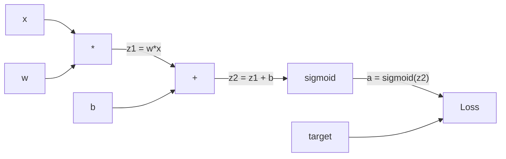
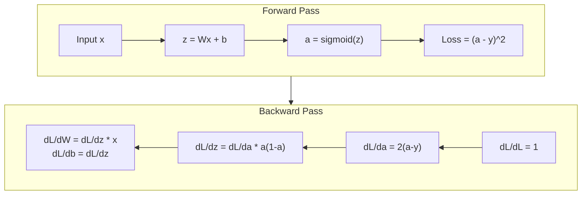
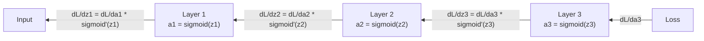

# 从零实现 Backpropagation

> Backpropagation 是让学习成为可能的算法。没有它，神经网络只是昂贵的随机数生成器。

**类型：** 构建
**语言：** Python
**先修：** Lesson 03.02（Multi-Layer Networks）
**时间：** 约 120 分钟

## 学习目标

- 实现一个基于 Value 的 autograd engine，它能构建 computational graph，并通过 topological sort 计算 gradients
- 用 chain rule 推导 addition、multiplication 和 sigmoid 的 backward pass
- 只用你从零实现的 backpropagation engine，在 XOR 和 circle classification 上训练多层网络
- 识别深层 sigmoid 网络中的 vanishing gradient problem，并解释为什么 gradients 会指数级缩小

## 问题

你的网络有一个 hidden layer，包含 768 个输入和 3072 个输出。这是 2,359,296 个 weights。它做出了错误预测。哪些 weights 导致了错误？逐个测试每个 weight 意味着要跑 230 万次 forward pass。Backpropagation 可以在一次 backward pass 中计算全部 230 万个 gradients。这不是优化问题，而是“可训练”和“不可能训练”之间的区别。

朴素做法是：拿一个 weight，把它轻微推一下，再跑一次 forward pass，测量 loss 是上升还是下降。这会给出这个 weight 的 gradient。然后对网络中的每个 weight 重复。再乘以成千上万的训练步和数百万个数据点。你需要地质尺度的时间才能训练出有用的东西。

Backpropagation 解决了这个问题。一次 forward pass，一次 backward pass，所有 gradients 都算出来。诀窍是把微积分中的 chain rule 系统地应用到 computational graph 上。这是让 deep learning 变得可行的算法。没有它，我们今天仍会困在玩具问题上。

## 概念

### Chain Rule 应用到网络

你在 Phase 01 Lesson 05 见过 chain rule。快速回顾：如果 y = f(g(x))，那么 dy/dx = f'(g(x)) * g'(x)。沿着链条把导数相乘。

在神经网络中，“链条”就是从输入到 loss 的一串操作。每一层应用 weights、加 biases、通过 activation。loss function 把最终输出和 target 做比较。Backpropagation 沿着这条链反向追踪，计算每个操作对误差的贡献。

### Computational Graphs

每次 forward pass 都会构建一张图。每个节点是一个操作（multiply、add、sigmoid）。每条边向前传递 value，向后传递 gradient。



forward pass：values 从左向右流动。x 和 w 产生 z1 = w*x。加上 b 得到 z2。Sigmoid 给出 activation a。用 loss function 把 a 与 target y 比较。

backward pass：gradients 从右向左流动。从 dL/da 开始（loss 如何随 activation 变化）。乘以 da/dz2（sigmoid derivative）。得到 dL/dz2。再拆成 dL/db（因为 z2 = z1 + b，所以等于 dL/dz2）和 dL/dz1。然后 dL/dw = dL/dz1 * x，dL/dx = dL/dz1 * w。

graph 中的每个节点在 backward pass 里只有一个职责：接收上游传来的 gradient，乘以自己的 local derivative，再把结果向下传。

### Forward 与 Backward



forward pass 会保存每个中间值：z、a、每一层的输入。backward pass 需要这些保存下来的值来计算 gradients。这就是 backprop 核心的内存-计算权衡：用内存（保存 activations）换速度（一次 pass，而不是数百万次）。

### Gradient 如何穿过网络

对一个 3 层网络来说，gradients 会穿过每一层相乘：



在每一层，gradient 都会乘以 sigmoid derivative。sigmoid derivative 是 a * (1 - a)，最大值只有 0.25（当 a = 0.5）。三层深时，gradient 最多已经乘上 0.25^3 = 0.0156。十层深时：0.25^10 = 0.000001。

### Vanishing Gradients

这就是 vanishing gradient problem。Sigmoid 把输出压缩到 0 和 1 之间。它的 derivative 永远小于 0.25。堆叠足够多 sigmoid layers，gradients 就会缩到几乎没有。早期层几乎学不到东西，因为它们收到的是接近 0 的 gradients。

```
sigmoid(z):     Output range [0, 1]
sigmoid'(z):    Max value 0.25 (at z = 0)

After 5 layers:   gradient * 0.25^5 = 0.001x original
After 10 layers:  gradient * 0.25^10 = 0.000001x original
```

这就是深层 sigmoid 网络几乎无法训练的原因。修复方式——ReLU 及其变体——是 Lesson 04 的主题。现在要理解的是：backprop 本身工作得很好。问题在于它穿过的东西。

### 推导 2 层网络的 Gradients

下面是一个具体网络的数学：输入 x，带 sigmoid 的 hidden layer，带 sigmoid 的 output layer，以及 MSE loss。

Forward pass：
```
z1 = W1 * x + b1
a1 = sigmoid(z1)
z2 = W2 * a1 + b2
a2 = sigmoid(z2)
L = (a2 - y)^2
```

Backward pass（逐步应用 chain rule）：
```
dL/da2 = 2(a2 - y)
da2/dz2 = a2 * (1 - a2)
dL/dz2 = dL/da2 * da2/dz2 = 2(a2 - y) * a2 * (1 - a2)

dL/dW2 = dL/dz2 * a1
dL/db2 = dL/dz2

dL/da1 = dL/dz2 * W2
da1/dz1 = a1 * (1 - a1)
dL/dz1 = dL/da1 * da1/dz1

dL/dW1 = dL/dz1 * x
dL/db1 = dL/dz1
```

每个 gradient 都是从 loss 往回追踪的 local derivatives 的乘积。Backpropagation 就是这些。

## 构建

### Step 1: The Value Node

计算中的每个数字都会变成一个 Value。它保存自己的 data、gradient，以及它是如何被创建出来的（这样它才知道如何反向计算 gradients）。

```python
class Value:
    def __init__(self, data, children=(), op=''):
        self.data = data
        self.grad = 0.0
        self._backward = lambda: None
        self._children = set(children)
        self._op = op

    def __repr__(self):
        return f"Value(data={self.data:.4f}, grad={self.grad:.4f})"
```

暂时没有 gradient（0.0）。暂时没有 backward function（no-op）。`_children` 记录哪些 Values 生成了当前 Value，这样之后就能对 graph 做 topological sort。

### Step 2: Operations with Backward Functions

每个 operation 都会创建一个新的 Value，并定义 gradients 如何通过它反向流动。

```python
def __add__(self, other):
    other = other if isinstance(other, Value) else Value(other)
    out = Value(self.data + other.data, (self, other), '+')

    def _backward():
        self.grad += out.grad
        other.grad += out.grad

    out._backward = _backward
    return out

def __mul__(self, other):
    other = other if isinstance(other, Value) else Value(other)
    out = Value(self.data * other.data, (self, other), '*')

    def _backward():
        self.grad += other.data * out.grad
        other.grad += self.data * out.grad

    out._backward = _backward
    return out
```

对 addition：d(a+b)/da = 1，d(a+b)/db = 1。因此两个输入都直接获得输出的 gradient。

对 multiplication：d(a*b)/da = b，d(a*b)/db = a。每个输入获得另一个输入的值乘以输出 gradient。

`+=` 非常关键。一个 Value 可能被多个 operations 使用。它的 gradient 是所有路径传来的 gradients 之和。

### Step 3: Sigmoid and Loss

```python
import math

def sigmoid(self):
    x = self.data
    x = max(-500, min(500, x))
    s = 1.0 / (1.0 + math.exp(-x))
    out = Value(s, (self,), 'sigmoid')

    def _backward():
        self.grad += (s * (1 - s)) * out.grad

    out._backward = _backward
    return out
```

Sigmoid derivative：sigmoid(x) * (1 - sigmoid(x))。我们已经在 forward pass 中计算了 sigmoid(x) = s。直接复用它，不需要额外工作。

```python
def mse_loss(predicted, target):
    diff = predicted + Value(-target)
    return diff * diff
```

单输出的 MSE：(predicted - target)^2。这里把 subtraction 表达成加上一个取负的 Value。

### Step 4: Backward Pass

Topological sort 确保我们按正确顺序处理节点——一个节点的 gradient 完全累积之后，才通过它向前传播。

```python
def backward(self):
    topo = []
    visited = set()

    def build_topo(v):
        if v not in visited:
            visited.add(v)
            for child in v._children:
                build_topo(child)
            topo.append(v)

    build_topo(self)
    self.grad = 1.0
    for v in reversed(topo):
        v._backward()
```

从 loss 开始（gradient = 1.0，因为 dL/dL = 1）。反向遍历排序后的 graph。每个节点的 `_backward` 都会把 gradients 推给它的 children。

### Step 5: Layer and Network

```python
import random

class Neuron:
    def __init__(self, n_inputs):
        scale = (2.0 / n_inputs) ** 0.5
        self.weights = [Value(random.uniform(-scale, scale)) for _ in range(n_inputs)]
        self.bias = Value(0.0)

    def __call__(self, x):
        act = sum((wi * xi for wi, xi in zip(self.weights, x)), self.bias)
        return act.sigmoid()

    def parameters(self):
        return self.weights + [self.bias]


class Layer:
    def __init__(self, n_inputs, n_outputs):
        self.neurons = [Neuron(n_inputs) for _ in range(n_outputs)]

    def __call__(self, x):
        out = [n(x) for n in self.neurons]
        return out[0] if len(out) == 1 else out

    def parameters(self):
        params = []
        for n in self.neurons:
            params.extend(n.parameters())
        return params


class Network:
    def __init__(self, sizes):
        self.layers = []
        for i in range(len(sizes) - 1):
            self.layers.append(Layer(sizes[i], sizes[i + 1]))

    def __call__(self, x):
        for layer in self.layers:
            x = layer(x)
            if not isinstance(x, list):
                x = [x]
        return x[0] if len(x) == 1 else x

    def parameters(self):
        params = []
        for layer in self.layers:
            params.extend(layer.parameters())
        return params

    def zero_grad(self):
        for p in self.parameters():
            p.grad = 0.0
```

Neuron 接收 inputs，计算 weighted sum + bias，并应用 sigmoid。weight initialization 按 sqrt(2/n_inputs) 缩放，防止更深网络中的 sigmoid saturation。Layer 是 Neurons 的列表。Network 是 Layers 的列表。`parameters()` 方法会收集所有可学习的 Values，这样我们就能更新它们。

### Step 6: Train on XOR

```python
random.seed(42)
net = Network([2, 4, 1])

xor_data = [
    ([0.0, 0.0], 0.0),
    ([0.0, 1.0], 1.0),
    ([1.0, 0.0], 1.0),
    ([1.0, 1.0], 0.0),
]

learning_rate = 1.0

for epoch in range(1000):
    total_loss = Value(0.0)
    for inputs, target in xor_data:
        x = [Value(i) for i in inputs]
        pred = net(x)
        loss = mse_loss(pred, target)
        total_loss = total_loss + loss

    net.zero_grad()
    total_loss.backward()

    for p in net.parameters():
        p.data -= learning_rate * p.grad

    if epoch % 100 == 0:
        print(f"Epoch {epoch:4d} | Loss: {total_loss.data:.6f}")

print("\nXOR Results:")
for inputs, target in xor_data:
    x = [Value(i) for i in inputs]
    pred = net(x)
    print(f"  {inputs} -> {pred.data:.4f} (expected {target})")
```

观察 loss 下降。从随机预测到正确的 XOR 输出，整个过程完全由 backpropagation 计算 gradients 并把 weights 往正确方向推动。

### Step 7: Circle Classification

在 Lesson 02 中，你为 circle classification 手工调了 weights。现在让网络自己学。

```python
random.seed(7)

def generate_circle_data(n=100):
    data = []
    for _ in range(n):
        x1 = random.uniform(-1.5, 1.5)
        x2 = random.uniform(-1.5, 1.5)
        label = 1.0 if x1 * x1 + x2 * x2 < 1.0 else 0.0
        data.append(([x1, x2], label))
    return data

circle_data = generate_circle_data(80)

circle_net = Network([2, 8, 1])
learning_rate = 0.5

for epoch in range(2000):
    random.shuffle(circle_data)
    total_loss_val = 0.0
    for inputs, target in circle_data:
        x = [Value(i) for i in inputs]
        pred = circle_net(x)
        loss = mse_loss(pred, target)
        circle_net.zero_grad()
        loss.backward()
        for p in circle_net.parameters():
            p.data -= learning_rate * p.grad
        total_loss_val += loss.data

    if epoch % 200 == 0:
        correct = 0
        for inputs, target in circle_data:
            x = [Value(i) for i in inputs]
            pred = circle_net(x)
            predicted_class = 1.0 if pred.data > 0.5 else 0.0
            if predicted_class == target:
                correct += 1
        accuracy = correct / len(circle_data) * 100
        print(f"Epoch {epoch:4d} | Loss: {total_loss_val:.4f} | Accuracy: {accuracy:.1f}%")
```

这里使用 online SGD——每个样本后就更新 weights，而不是累积整个 batch。这会更快打破对称性，并避免在完整 loss landscape 上陷入 sigmoid saturation。每个 epoch shuffle 数据，可以防止网络记住顺序。

不需要手工调参。网络会自己发现圆形 decision boundary。这就是 backpropagation 的力量：你定义 architecture、loss function 和 data。算法负责找出 weights。

## 使用

PyTorch 用几行就能完成上面所有事情。核心思想完全一样——autograd 在 forward pass 期间构建 computational graph，再反向追踪它以计算 gradients。

```python
import torch
import torch.nn as nn

model = nn.Sequential(
    nn.Linear(2, 4),
    nn.Sigmoid(),
    nn.Linear(4, 1),
    nn.Sigmoid(),
)
optimizer = torch.optim.SGD(model.parameters(), lr=1.0)
criterion = nn.MSELoss()

X = torch.tensor([[0,0],[0,1],[1,0],[1,1]], dtype=torch.float32)
y = torch.tensor([[0],[1],[1],[0]], dtype=torch.float32)

for epoch in range(1000):
    pred = model(X)
    loss = criterion(pred, y)
    optimizer.zero_grad()
    loss.backward()
    optimizer.step()

print("PyTorch XOR Results:")
with torch.no_grad():
    for i in range(4):
        pred = model(X[i])
        print(f"  {X[i].tolist()} -> {pred.item():.4f} (expected {y[i].item()})")
```

`loss.backward()` 就是你的 `total_loss.backward()`。`optimizer.step()` 就是你手写的 `p.data -= lr * p.grad`。`optimizer.zero_grad()` 就是你的 `net.zero_grad()`。同一个算法，只是工业级实现。PyTorch 处理 GPU acceleration、mixed precision、gradient checkpointing，以及数百种 layer types。但 backward pass 仍然是同一个 chain rule，应用在同一类 computational graph 上。

训练会运行 forward pass，然后运行 backward pass，然后更新 weights。推理只运行 forward pass。没有 gradients，没有更新。这个区别很重要，因为生产环境中发生的是 inference。当你调用 Claude 或 GPT 这样的 API 时，你在运行 inference——你的 prompt 向前流过网络，token 从另一端出来。weights 不会变化。理解 backprop 很重要，因为它塑造了那个网络中的每一个 weight。

## 交付

本课会产出：
- `outputs/prompt-gradient-debugger.md`——一个用于诊断任意神经网络中 gradient 问题（vanishing、exploding、NaN）的可复用 prompt

## 练习

1. 给 Value 类添加 `__sub__` 方法（a - b = a + (-1 * b)）。然后实现 `__neg__` 方法。用一个简单表达式（例如 (a - b)^2）和手算结果比较，验证 gradients 正确。

2. 给 Value 添加 `relu` 方法（输出 max(0, x)，derivative 在 x > 0 时为 1，否则为 0）。用 relu 替换 hidden layers 中的 sigmoid，再训练 XOR。比较收敛速度。你应该会看到更快的训练——这是 Lesson 04 的预告。

3. 在 Value 上实现适用于整数幂的 `__pow__` 方法。用它把 `mse_loss` 替换成真正的 `(predicted - target) ** 2` 表达式。验证 gradients 与原实现一致。

4. 给训练循环添加 gradient clipping：调用 `backward()` 之后，把所有 gradients 裁剪到 [-1, 1]。训练一个更深的网络（4 层以上 sigmoid），比较使用和不使用 clipping 的 loss curves。这是你对抗 exploding gradients 的第一道防线。

5. 构建一个可视化：在 XOR 训练完成后，打印网络中每个参数的 gradient。找出哪一层的 gradients 最小。这会展示你在 Concept 部分读到的 vanishing gradient problem。

## 关键术语

| 术语 | 人们常说 | 实际含义 |
|------|----------|----------|
| Backpropagation | “网络在学习” | 一个通过在 computational graph 中反向应用 chain rule，为每个 weight 计算 dL/dw 的算法 |
| Computational graph | “网络结构” | 一张有向无环图，节点是 operations，边携带 values（向前）和 gradients（向后） |
| Chain rule | “把导数相乘” | 如果 y = f(g(x))，那么 dy/dx = f'(g(x)) * g'(x)——backpropagation 的数学基础 |
| Gradient | “最陡上升方向” | loss 对某个参数的偏导数——告诉你如何改变该参数以降低 loss |
| Vanishing gradient | “深层网络学不动” | gradients 在穿过带 sigmoid 这类饱和 activation 的层时指数级缩小 |
| Forward pass | “运行网络” | 通过顺序应用每一层的操作，从 inputs 计算 output，并保存中间值 |
| Backward pass | “计算 gradients” | 反向遍历 computational graph，使用 chain rule 在每个节点累积 gradients |
| Learning rate | “它学得多快” | 更新 weights 时控制步长的标量：w_new = w_old - lr * gradient |
| Topological sort | “正确顺序” | 一种 graph 节点顺序，每个节点都出现在它依赖的所有节点之后——保证 gradients 在传播前已完全累积 |
| Autograd | “自动微分” | 在 forward computation 期间构建 computational graphs，并自动计算 gradients 的系统——也就是 PyTorch 的 engine |

## 延伸阅读

- Rumelhart, Hinton & Williams, "Learning representations by back-propagating errors" (1986)——让 backpropagation 成为主流、打开多层网络训练之门的论文
- 3Blue1Brown, "Neural Networks" series (https://www.youtube.com/playlist?list=PLZHQObOWTQDNU6R1_67000Dx_ZCJB-3pi)——关于 backpropagation 和 gradients 如何穿过网络的最佳可视化解释
