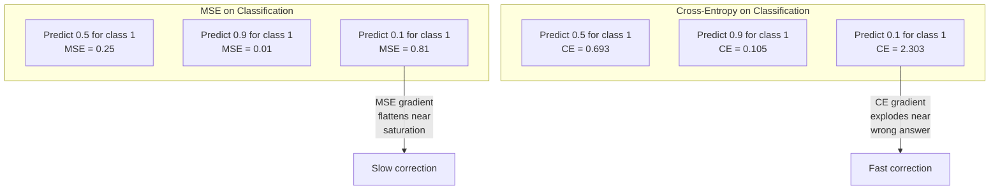
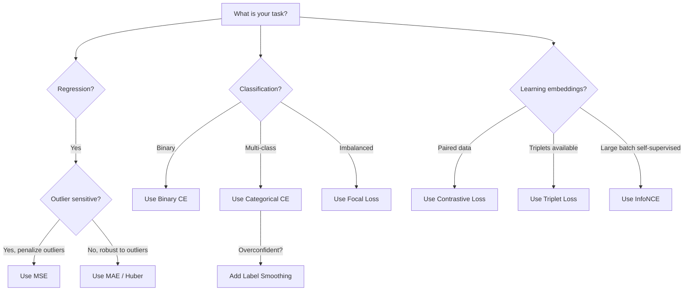
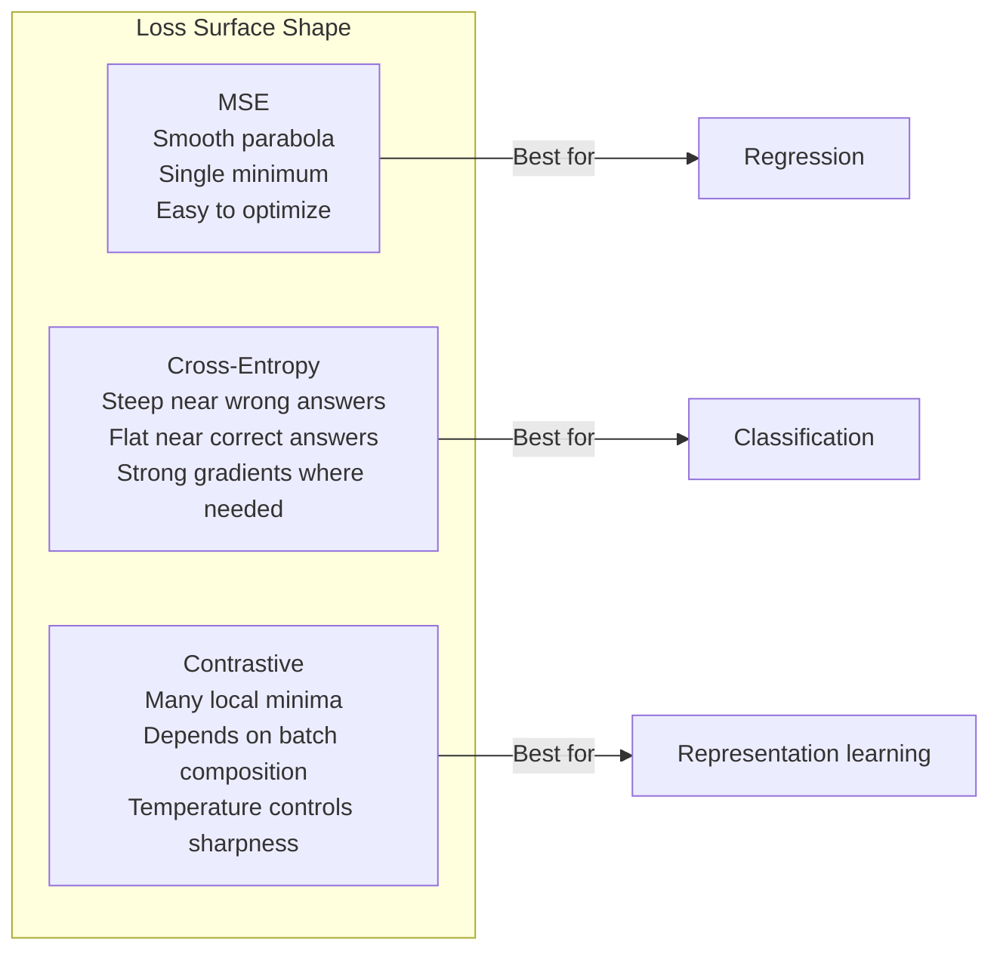

# Loss Functions

> 你的网络做出一个预测。真实答案不同。它到底错得多离谱？这个数字就是 loss。选错 loss function，模型就会优化完全错误的目标。

**类型：** 构建
**语言：** Python
**先修：** Lesson 03.04（Activation Functions）
**时间：** 约 75 分钟

## 学习目标

- 从零实现 MSE、binary cross-entropy、categorical cross-entropy 和 contrastive loss（InfoNCE），以及它们的 gradients
- 通过演示“所有样本都预测 0.5”的 failure mode，解释为什么 MSE 不适合 classification
- 将 label smoothing 应用于 cross-entropy，并描述它如何防止过度自信的预测
- 为 regression、binary classification、multi-class classification 和 embedding learning 任务选择正确的 loss function

## 问题

一个在分类问题上最小化 MSE 的模型，会自信地对所有东西预测 0.5。它确实在最小化 loss。它也完全没用。

loss function 是模型真正优化的唯一东西。不是 accuracy。不是 F1 score。也不是你汇报给经理的任何 metric。optimizer 会取 loss function 的 gradient，并调整 weights 让这个数字变小。如果 loss function 没有捕捉你真正关心的东西，模型会找到数学上最便宜的方式满足它，而这种方式几乎从来不是你想要的。

一个具体例子：你有一个二分类任务。两个类别，50/50 划分。你使用 MSE 作为 loss。模型对每个输入都预测 0.5。平均 MSE 是 0.25，这是在什么都没学到的情况下可能达到的最小值。模型没有任何区分能力，但它从技术上最小化了你的 loss function。换成 cross-entropy，同一个模型会被迫把预测推向 0 或 1，因为 -log(0.5) = 0.693 是很差的 loss，而 -log(0.99) = 0.01 会奖励自信且正确的预测。loss function 的选择，就是能学习的模型和钻 metric 空子的模型之间的区别。

更糟的是，在 self-supervised learning 中，你甚至没有 labels。Contrastive loss 完全定义了学习信号：什么算相似、什么算不同、模型应该把它们推开多远。contrastive loss 写错，embeddings 就会坍缩成一个点——每个输入都映射到同一个向量。技术上 loss 为零。实际完全无用。

## 概念

### Mean Squared Error（MSE）

回归任务的默认选择。计算 prediction 与 target 的平方差，并在所有样本上取平均。

```
MSE = (1/n) * sum((y_pred - y_true)^2)
```

为什么平方很重要：它会二次惩罚大错误。误差 2 的代价是误差 1 的 4 倍。误差 10 的代价是 100 倍。这让 MSE 对 outliers 很敏感——一个极端错误的预测会主导 loss。

真实数字：如果你的模型预测房价，大多数房子错 $10,000，但某栋豪宅错了 $200,000，MSE 会非常用力地修正那一栋豪宅，可能反而损害其他 99 套房子的表现。

MSE 对 prediction 的 gradient 是：

```
dMSE/dy_pred = (2/n) * (y_pred - y_true)
```

它与误差呈线性关系。错误越大，gradient 越大。对 regression 来说这是特性（大错误需要大修正），对 classification 来说却是 bug（你想指数级惩罚自信但错误的答案，而不是线性惩罚）。

### Cross-Entropy Loss

classification 的 loss function。它源自信息论——衡量 predicted probability distribution 与 true distribution 之间的差异。

**Binary Cross-Entropy（BCE）：**

```
BCE = -(y * log(p) + (1 - y) * log(1 - p))
```

其中 y 是真实 label（0 或 1），p 是预测概率。

为什么 -log(p) 有效：当真实 label 是 1 且你预测 p = 0.99 时，loss 是 -log(0.99) = 0.01。当你预测 p = 0.01 时，loss 是 -log(0.01) = 4.6。这个 460 倍差异就是 cross-entropy 有效的原因。它会严厉惩罚自信但错误的预测，同时几乎不惩罚自信且正确的预测。

gradient 也讲着同一个故事：

```
dBCE/dp = -(y/p) + (1-y)/(1-p)
```

当 y = 1 且 p 接近 0 时，gradient 是 -1/p，趋向负无穷。模型会得到巨大的信号去修复错误。当 p 接近 1 时，gradient 很小。已经正确了，没什么要修。

**Categorical Cross-Entropy：**

用于带 one-hot encoded targets 的 multi-class classification。

```
CCE = -sum(y_i * log(p_i))
```

只有真实类别会贡献 loss（因为其他所有 y_i 都是 0）。如果有 10 个类别，正确类别概率为 0.1（随机猜），loss 是 -log(0.1) = 2.3。如果正确类别概率为 0.9，loss 是 -log(0.9) = 0.105。模型会学习把 probability mass 集中到正确答案上。

### 为什么 MSE 不适合 Classification



当 predictions 接近 0 或 1 时，MSE gradients 会变平（因为 sigmoid saturation）。Cross-entropy gradients 会补偿这一点——-log 会抵消 sigmoid 的平坦区域，在最需要强信号的地方给出强 gradients。

### Label Smoothing

标准 one-hot labels 会说：“这 100% 是 class 3，0% 是其他所有类别。”这是一个很强的声明。Label smoothing 会软化它：

```
smooth_label = (1 - alpha) * one_hot + alpha / num_classes
```

当 alpha = 0.1 且有 10 个类别时，target 不再是 [0, 0, 1, 0, ...]，而是 [0.01, 0.01, 0.91, 0.01, ...]。模型目标从 1.0 变成 0.91。

为什么有效：一个试图通过 softmax 输出精确 1.0 的模型，需要把 logits 推向无穷大。这会导致过度自信、损害泛化，并让模型面对 distribution shift 时更脆弱。Label smoothing 会把 target 截到 0.9（当 alpha=0.1），让 logits 保持在合理范围。GPT 和大多数现代模型都会使用 label smoothing 或等价方法。

### Contrastive Loss

没有 labels。没有 classes。只有输入对和一个问题：它们相似还是不同？

**SimCLR 风格的 contrastive loss（NT-Xent / InfoNCE）：**

拿一张图像。创建它的两个增强视图（crop、rotate、color jitter）。它们是“positive pair”——它们应该有相似的 embeddings。batch 中的其他每张图像都形成“negative pair”——它们应该有不同的 embeddings。

```
L = -log(exp(sim(z_i, z_j) / tau) / sum(exp(sim(z_i, z_k) / tau)))
```

其中 sim() 是 cosine similarity，z_i 和 z_j 是 positive pair，sum 覆盖所有 negatives，tau（temperature）控制分布有多尖锐。更低的 temperature = 更难的 negatives = 更激进的分离。

真实数字：batch size 256 意味着每个 positive pair 有 255 个 negatives。temperature tau = 0.07（SimCLR 默认值）。这个 loss 看起来像 similarities 上的 softmax——它希望 positive pair 的 similarity 在所有 256 个选项中最高。

**Triplet Loss：**

接收三个输入：anchor、positive（同类）、negative（不同类）。

```
L = max(0, d(anchor, positive) - d(anchor, negative) + margin)
```

margin（通常 0.2-1.0）强制 positive 和 negative distances 之间有最小间隔。如果 negative 已经足够远，loss 为 0——没有 gradient，也没有更新。这让训练更高效，但需要小心做 triplet mining（选择靠近 anchor 的 hard negatives）。

### Focal Loss

用于 imbalanced datasets。标准 cross-entropy 会同等对待所有正确分类的样本。Focal loss 会降低 easy examples 的权重：

```
FL = -alpha * (1 - p_t)^gamma * log(p_t)
```

其中 p_t 是真实类别的预测概率，gamma 控制 focusing。当 gamma = 0 时，这就是标准 cross-entropy。当 gamma = 2（默认）时：

- Easy example（p_t = 0.9）：weight = (0.1)^2 = 0.01。几乎被忽略。
- Hard example（p_t = 0.1）：weight = (0.9)^2 = 0.81。完整 gradient signal。

Focal loss 是 Lin 等人为 object detection 引入的；在目标检测中，99% 的候选区域都是 background（easy negatives）。没有 focal loss，模型会淹没在容易的 background examples 里，永远学不会检测物体。有了它，模型会把容量集中在真正重要的 hard、ambiguous cases 上。

### Loss Function 决策树



### Loss Landscape



## 构建

### Step 1: MSE and Its Gradient

```python
def mse(predictions, targets):
    n = len(predictions)
    total = 0.0
    for p, t in zip(predictions, targets):
        total += (p - t) ** 2
    return total / n

def mse_gradient(predictions, targets):
    n = len(predictions)
    grads = []
    for p, t in zip(predictions, targets):
        grads.append(2.0 * (p - t) / n)
    return grads
```

### Step 2: Binary Cross-Entropy

log(0) 问题是真实存在的。如果模型对正样本预测精确的 0，log(0) = negative infinity。Clipping 可以防止这一点。

```python
import math

def binary_cross_entropy(predictions, targets, eps=1e-15):
    n = len(predictions)
    total = 0.0
    for p, t in zip(predictions, targets):
        p_clipped = max(eps, min(1 - eps, p))
        total += -(t * math.log(p_clipped) + (1 - t) * math.log(1 - p_clipped))
    return total / n

def bce_gradient(predictions, targets, eps=1e-15):
    grads = []
    for p, t in zip(predictions, targets):
        p_clipped = max(eps, min(1 - eps, p))
        grads.append(-(t / p_clipped) + (1 - t) / (1 - p_clipped))
    return grads
```

### Step 3: Categorical Cross-Entropy with Softmax

Softmax 把原始 logits 转换成 probabilities。然后我们针对 one-hot targets 计算 cross-entropy。

```python
def softmax(logits):
    max_val = max(logits)
    exps = [math.exp(x - max_val) for x in logits]
    total = sum(exps)
    return [e / total for e in exps]

def categorical_cross_entropy(logits, target_index, eps=1e-15):
    probs = softmax(logits)
    p = max(eps, probs[target_index])
    return -math.log(p)

def cce_gradient(logits, target_index):
    probs = softmax(logits)
    grads = list(probs)
    grads[target_index] -= 1.0
    return grads
```

softmax + cross-entropy 的 gradient 有一个漂亮的简化：真实类别上就是（预测概率 - 1），其他所有类别上就是（预测概率）。这个优雅的简化不是巧合——这就是 softmax 和 cross-entropy 被配对使用的原因。

### Step 4: Label Smoothing

```python
def label_smoothed_cce(logits, target_index, num_classes, alpha=0.1, eps=1e-15):
    probs = softmax(logits)
    loss = 0.0
    for i in range(num_classes):
        if i == target_index:
            smooth_target = 1.0 - alpha + alpha / num_classes
        else:
            smooth_target = alpha / num_classes
        p = max(eps, probs[i])
        loss += -smooth_target * math.log(p)
    return loss
```

### Step 5: Contrastive Loss (Simplified InfoNCE)

```python
def cosine_similarity(a, b):
    dot = sum(x * y for x, y in zip(a, b))
    norm_a = math.sqrt(sum(x * x for x in a))
    norm_b = math.sqrt(sum(x * x for x in b))
    if norm_a < 1e-10 or norm_b < 1e-10:
        return 0.0
    return dot / (norm_a * norm_b)

def contrastive_loss(anchor, positive, negatives, temperature=0.07):
    sim_pos = cosine_similarity(anchor, positive) / temperature
    sim_negs = [cosine_similarity(anchor, neg) / temperature for neg in negatives]

    max_sim = max(sim_pos, max(sim_negs)) if sim_negs else sim_pos
    exp_pos = math.exp(sim_pos - max_sim)
    exp_negs = [math.exp(s - max_sim) for s in sim_negs]
    total_exp = exp_pos + sum(exp_negs)

    return -math.log(max(1e-15, exp_pos / total_exp))
```

### Step 6: MSE vs Cross-Entropy on Classification

用两种 loss functions 训练 Lesson 04 中同一个网络（circle dataset）。观察 cross-entropy 更快收敛。

```python
import random

def sigmoid(x):
    x = max(-500, min(500, x))
    return 1.0 / (1.0 + math.exp(-x))

def make_circle_data(n=200, seed=42):
    random.seed(seed)
    data = []
    for _ in range(n):
        x = random.uniform(-2, 2)
        y = random.uniform(-2, 2)
        label = 1.0 if x * x + y * y < 1.5 else 0.0
        data.append(([x, y], label))
    return data


class LossComparisonNetwork:
    def __init__(self, loss_type="bce", hidden_size=8, lr=0.1):
        random.seed(0)
        self.loss_type = loss_type
        self.lr = lr
        self.hidden_size = hidden_size

        self.w1 = [[random.gauss(0, 0.5) for _ in range(2)] for _ in range(hidden_size)]
        self.b1 = [0.0] * hidden_size
        self.w2 = [random.gauss(0, 0.5) for _ in range(hidden_size)]
        self.b2 = 0.0

    def forward(self, x):
        self.x = x
        self.z1 = []
        self.h = []
        for i in range(self.hidden_size):
            z = self.w1[i][0] * x[0] + self.w1[i][1] * x[1] + self.b1[i]
            self.z1.append(z)
            self.h.append(max(0.0, z))

        self.z2 = sum(self.w2[i] * self.h[i] for i in range(self.hidden_size)) + self.b2
        self.out = sigmoid(self.z2)
        return self.out

    def backward(self, target):
        if self.loss_type == "mse":
            d_loss = 2.0 * (self.out - target)
        else:
            eps = 1e-15
            p = max(eps, min(1 - eps, self.out))
            d_loss = -(target / p) + (1 - target) / (1 - p)

        d_sigmoid = self.out * (1 - self.out)
        d_out = d_loss * d_sigmoid

        for i in range(self.hidden_size):
            d_relu = 1.0 if self.z1[i] > 0 else 0.0
            d_h = d_out * self.w2[i] * d_relu
            self.w2[i] -= self.lr * d_out * self.h[i]
            for j in range(2):
                self.w1[i][j] -= self.lr * d_h * self.x[j]
            self.b1[i] -= self.lr * d_h
        self.b2 -= self.lr * d_out

    def compute_loss(self, pred, target):
        if self.loss_type == "mse":
            return (pred - target) ** 2
        else:
            eps = 1e-15
            p = max(eps, min(1 - eps, pred))
            return -(target * math.log(p) + (1 - target) * math.log(1 - p))

    def train(self, data, epochs=200):
        losses = []
        for epoch in range(epochs):
            total_loss = 0.0
            correct = 0
            for x, y in data:
                pred = self.forward(x)
                self.backward(y)
                total_loss += self.compute_loss(pred, y)
                if (pred >= 0.5) == (y >= 0.5):
                    correct += 1
            avg_loss = total_loss / len(data)
            accuracy = correct / len(data) * 100
            losses.append((avg_loss, accuracy))
            if epoch % 50 == 0 or epoch == epochs - 1:
                print(f"    Epoch {epoch:3d}: loss={avg_loss:.4f}, accuracy={accuracy:.1f}%")
        return losses
```

## 使用

PyTorch 提供了所有标准 loss functions，并内置数值稳定性处理：

```python
import torch
import torch.nn as nn
import torch.nn.functional as F

predictions = torch.tensor([0.9, 0.1, 0.7], requires_grad=True)
targets = torch.tensor([1.0, 0.0, 1.0])

mse_loss = F.mse_loss(predictions, targets)
bce_loss = F.binary_cross_entropy(predictions, targets)

logits = torch.randn(4, 10)
labels = torch.tensor([3, 7, 1, 9])
ce_loss = F.cross_entropy(logits, labels)
ce_smooth = F.cross_entropy(logits, labels, label_smoothing=0.1)
```

使用 `F.cross_entropy`（而不是 `F.nll_loss` 加手写 softmax）。它把 log-softmax 和 negative log-likelihood 合成一个数值稳定的操作。先单独应用 softmax 再取 log 不够稳定——你会在大指数的相减中丢失精度。

对于 contrastive learning，大多数团队会使用自定义实现，或 `lightly`、`pytorch-metric-learning` 这类库。核心循环永远相同：计算 pairwise similarities，在 positives 和 negatives 上创建 softmax，然后 backpropagate。

## 交付

本课会产出：
- `outputs/prompt-loss-function-selector.md`——一个用于选择正确 loss function 的可复用 prompt
- `outputs/prompt-loss-debugger.md`——当你的 loss curve 看起来不对时使用的诊断 prompt

## 练习

1. 实现 Huber loss（smooth L1 loss），小误差时是 MSE，大误差时是 MAE。训练一个回归网络预测 y = sin(x)，并在 5% 训练 targets 加入随机噪声（outliers）时比较 MSE 与 Huber 的最终 test error。

2. 给 binary classification 训练循环添加 focal loss。创建一个 imbalanced dataset（90% class 0，10% class 1）。比较标准 BCE 和 focal loss（gamma=2）在 200 epochs 后对 minority class 的 recall。

3. 实现带 semi-hard negative mining 的 triplet loss。为 5 个类别生成 2D embedding data。对每个 anchor，找到仍然比 positive 更远、但最难的 negative（semi-hard）。比较它与 random triplet selection 的收敛情况。

4. 运行 MSE vs cross-entropy 对比，但在训练期间跟踪每一层的 gradient magnitudes。绘制每个 epoch 的平均 gradient norm。验证 cross-entropy 会在模型最不确定的早期阶段产生更大的 gradients。

5. 实现 KL divergence loss，并验证当 true distribution 是 one-hot 时，最小化 KL(true || predicted) 与 cross-entropy 给出相同的 gradients。然后尝试 soft targets（例如 knowledge distillation），其中“true” distribution 来自 teacher model 的 softmax output。

## 关键术语

| 术语 | 人们常说 | 实际含义 |
|------|----------|----------|
| Loss function | “模型错得多离谱” | 一个可微函数，把 predictions 和 targets 映射成 optimizer 要最小化的标量 |
| MSE | “平均平方误差” | predictions 与 targets 差值平方的均值；会二次惩罚大误差 |
| Cross-entropy | “分类 loss” | 使用 -log(p) 衡量 predicted probability distribution 与 true distribution 的差异 |
| Binary cross-entropy | “BCE” | 二分类的 cross-entropy：-(y*log(p) + (1-y)*log(1-p)) |
| Label smoothing | “软化 targets” | 用 soft values（例如 0.1/0.9）替换硬 0/1 targets，以防止过度自信并提升泛化 |
| Contrastive loss | “拉近相似，推远不同” | 一种通过让相似 pairs 在 embedding space 中更近、不相似 pairs 更远来学习表示的 loss |
| InfoNCE | “CLIP/SimCLR loss” | 对 similarity scores 做 normalized temperature-scaled cross-entropy；把 contrastive learning 当作分类 |
| Focal loss | “imbalanced data 的修复” | 用 (1-p_t)^gamma 对 cross-entropy 加权，降低 easy examples 权重，聚焦 hard ones |
| Triplet loss | “Anchor-positive-negative” | 在 embedding space 中把 anchor 拉近 positive，并让它比 negative 至少近一个 margin |
| Temperature | “尖锐度旋钮” | logits/similarities 上的标量除数，控制最终分布有多尖锐；越低越尖锐 |

## 延伸阅读

- Lin et al., "Focal Loss for Dense Object Detection" (2017)——为处理 object detection 中极端类别不平衡（RetinaNet）而提出 focal loss
- Chen et al., "A Simple Framework for Contrastive Learning of Visual Representations" (SimCLR, 2020)——用 NT-Xent loss 定义现代 contrastive learning pipeline
- Szegedy et al., "Rethinking the Inception Architecture" (2016)——把 label smoothing 作为 regularization technique 引入，如今是多数大模型的标准做法
- Hinton et al., "Distilling the Knowledge in a Neural Network" (2015)——使用 soft targets 和 KL divergence 做 knowledge distillation，是模型压缩的基础工作
