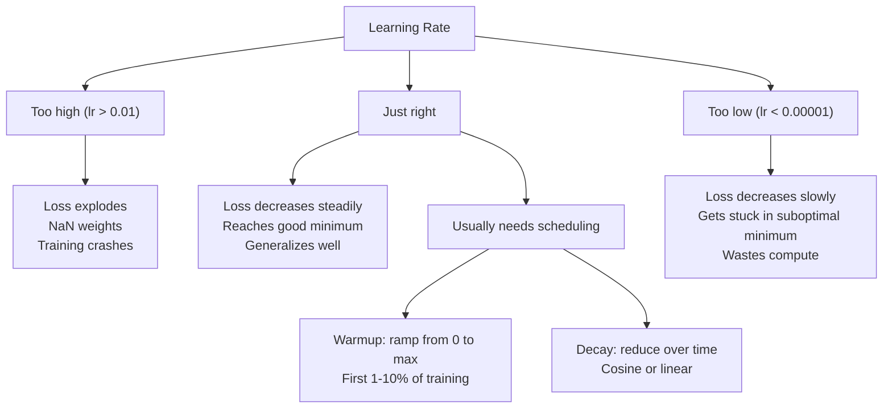
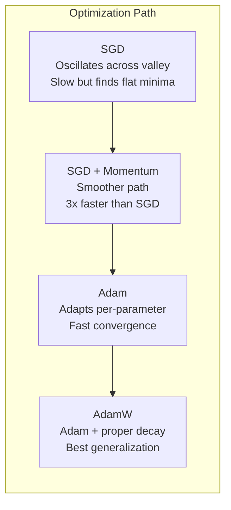
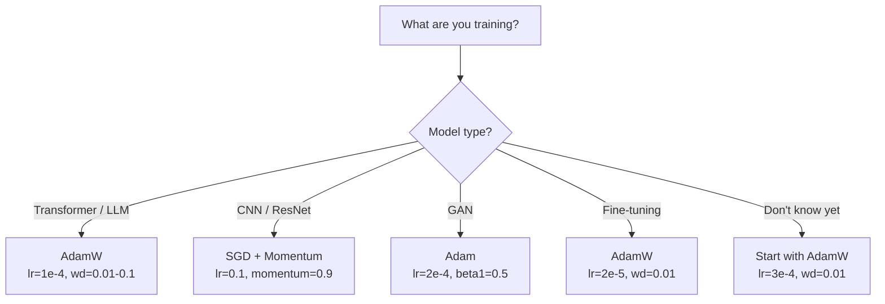

# Optimizers

> Gradient descent 告诉你该往哪个方向走。它没告诉你走多远、走多快。SGD 是指南针。Adam 是带实时路况的 GPS。

**类型：** 构建
**语言：** Python
**先修：** Lesson 03.05（Loss Functions）
**时间：** 约 75 分钟

## 学习目标

- 用 Python 从零实现 SGD、带 momentum 的 SGD、Adam 和 AdamW optimizers
- 解释 Adam 的 bias correction 如何补偿训练早期从零初始化的 moment estimates
- 在同一任务上演示为什么 AdamW 比带 L2 regularization 的 Adam 泛化更好
- 为 transformers、CNNs、GANs 和 fine-tuning 选择合适的 optimizer 与默认 hyperparameters

## 问题

你已经算出了 gradients。你知道 weight #4,721 应该减少 0.003，loss 才会降低。但 0.003 的单位是什么？要按什么缩放？第 1 步和第 1,000 步应该移动同样的量吗？

原始 gradient descent 会在每一步对每个参数应用同一个 learning rate：w = w - lr * gradient。这会制造三个问题，让神经网络训练在实践中很痛苦。

第一，震荡。loss landscape 很少像光滑的碗。它更像一个又长又窄的山谷。gradient 指向横穿山谷的方向（陡峭方向），而不是沿着山谷前进的方向（平缓方向）。Gradient descent 会在窄维度上来回弹跳，同时在有用方向上进展很小。你见过这种现象：loss 下降很快，然后平台化，不是因为模型收敛了，而是因为它在震荡。

第二，对所有参数使用同一个 learning rate 是错的。有些 weights 需要大更新（它们还处在早期 underfitting 阶段）。另一些需要很小的更新（它们接近最优值）。适合前者的 learning rate 会毁掉后者，反过来也一样。

第三，saddle points。在高维空间中，loss landscape 有大量平坦区域，gradient 接近 0。原始 SGD 会以 gradient 的速度爬过这些区域，而这个速度几乎是 0。模型看起来卡住了。它不是卡住了——它在一个平坦区域，另一侧仍有可用的下降方向。但 SGD 没有机制推它穿过去。

Adam 解决了这三个问题。它为每个参数维护两个 running averages：mean gradient（momentum，处理震荡）和 mean squared gradient（adaptive rate，处理不同尺度）。再加上前几步的 bias correction，它给你一个默认 hyperparameters 就能解决 80% 问题的 optimizer。本课会从零构建它，这样你会准确理解它在另外 20% 情况中何时、为何失败。

## 概念

### Stochastic Gradient Descent（SGD）

最简单的 optimizer。在 mini-batch 上计算 gradient，并朝相反方向走一步。

```
w = w - lr * gradient
```

“stochastic” 意味着你使用随机子集（mini-batch）估计 gradient，而不是使用完整数据集。这种噪声其实有用——它帮助逃离尖锐的 local minima。但噪声也会导致震荡。

Learning rate 是唯一旋钮。太高：loss 发散。太低：训练永远跑不完。最优值取决于 architecture、data、batch size，以及训练当前阶段。对现代网络上的原始 SGD，典型值在 0.01 到 0.1 之间。但即便在一次训练中，理想 learning rate 也会变化。

### Momentum

“球滚下山”的类比用烂了，但很准确。你不再只按当前 gradient 走，而是维护一个会累积过去 gradients 的 velocity。

```
m_t = beta * m_{t-1} + gradient
w = w - lr * m_t
```

Beta（通常 0.9）控制保留多少历史。当 beta = 0.9 时，momentum 大致是最近 10 个 gradients 的平均（1 / (1 - 0.9) = 10）。

为什么它能修复震荡：指向同一方向的 gradients 会累积。方向翻转的 gradients 会相互抵消。在那个狭窄山谷中，“横向”分量每一步都变号，因此被抑制。“沿谷”分量保持一致，因此被放大。结果是在有用方向上平滑加速。

真实数字：在条件很差的 loss landscape 上，单独 SGD 可能需要 10,000 步。带 momentum 的 SGD（beta=0.9）在同一问题上通常需要 3,000-5,000 步。这个提速不是边际改进。

### RMSProp

第一个真正有效的 per-parameter adaptive learning rate 方法。Hinton 在 Coursera 讲座中提出（从未正式发表）。

```
s_t = beta * s_{t-1} + (1 - beta) * gradient^2
w = w - lr * gradient / (sqrt(s_t) + epsilon)
```

s_t 跟踪 squared gradients 的 running average。持续拥有大 gradients 的参数会被一个大数除（更小的有效 learning rate）。小 gradients 的参数会被一个小数除（更大的有效 learning rate）。

这解决了“所有参数一个 learning rate”的问题。某个 weight 已经一直得到大更新，可能接近目标——让它慢下来。某个 weight 一直得到很小更新，可能训练不足——让它快一点。

Epsilon（通常 1e-8）防止参数尚未更新时除以 0。

### Adam：Momentum + RMSProp

Adam 结合了这两个想法。它为每个参数维护两个 exponential moving averages：

```
m_t = beta1 * m_{t-1} + (1 - beta1) * gradient        (first moment: mean)
v_t = beta2 * v_{t-1} + (1 - beta2) * gradient^2       (second moment: variance)
```

**Bias correction** 是多数解释会跳过的关键细节。在第 1 步，m_1 = (1 - beta1) * gradient。当 beta1 = 0.9 时，这是 0.1 * gradient——小了十倍。moving average 还没热身。Bias correction 会补偿：

```
m_hat = m_t / (1 - beta1^t)
v_hat = v_t / (1 - beta2^t)
```

第 1 步 beta1 = 0.9 时：m_hat = m_1 / (1 - 0.9) = m_1 / 0.1 = 实际 gradient。第 100 步时：(1 - 0.9^100) 约等于 1.0，因此 correction 消失。Bias correction 对前约 10 步很重要，50 步后基本无关。

更新为：

```
w = w - lr * m_hat / (sqrt(v_hat) + epsilon)
```

Adam 默认值：lr = 0.001，beta1 = 0.9，beta2 = 0.999，epsilon = 1e-8。这些默认值适用于 80% 的问题。失效时先改 lr。然后改 beta2。几乎不要改 beta1 或 epsilon。

### AdamW：正确的 Weight Decay

L2 regularization 会向 loss 添加 lambda * w^2。在原始 SGD 中，这等价于 weight decay（每一步从 weight 中减去 lambda * w）。在 Adam 中，这个等价关系会断裂。

Loshchilov 和 Hutter 的洞见是：当你把 L2 加进 loss 后再让 Adam 处理 gradient，adaptive learning rate 也会缩放 regularization term。gradient variance 大的参数会得到更少 regularization。variance 小的参数会得到更多。这不是你想要的——你想要的是不依赖 gradient statistics 的统一 regularization。

AdamW 通过在 Adam update 之后直接对 weights 应用 weight decay 来修复：

```
w = w - lr * m_hat / (sqrt(v_hat) + epsilon) - lr * lambda * w
```

weight decay term（lr * lambda * w）不会被 Adam 的 adaptive factor 缩放。每个参数都会得到相同的比例收缩。

这看起来像小细节。不是。AdamW 在几乎所有任务上都比 Adam + L2 regularization 收敛到更好的解。它是 PyTorch 中训练 transformers、diffusion models 和多数现代架构的默认 optimizer。BERT、GPT、LLaMA、Stable Diffusion——全都用 AdamW 训练。

### Learning Rate：最重要的 Hyperparameter



如果只调一个 hyperparameter，就调 learning rate。learning rate 变化 10 倍，比你做出的任何架构决策都更重要。常见默认值：

- SGD：lr = 0.01 到 0.1
- Adam/AdamW：lr = 1e-4 到 3e-4
- Fine-tuning pretrained models：lr = 1e-5 到 5e-5
- Learning rate warmup：在前 1-10% steps 上线性爬升

### Optimizer 对比



### 每种 Optimizer 什么时候胜出



## 构建

### Step 1: Vanilla SGD

```python
class SGD:
    def __init__(self, lr=0.01):
        self.lr = lr

    def step(self, params, grads):
        for i in range(len(params)):
            params[i] -= self.lr * grads[i]
```

### Step 2: SGD with Momentum

```python
class SGDMomentum:
    def __init__(self, lr=0.01, beta=0.9):
        self.lr = lr
        self.beta = beta
        self.velocities = None

    def step(self, params, grads):
        if self.velocities is None:
            self.velocities = [0.0] * len(params)
        for i in range(len(params)):
            self.velocities[i] = self.beta * self.velocities[i] + grads[i]
            params[i] -= self.lr * self.velocities[i]
```

### Step 3: Adam

```python
import math

class Adam:
    def __init__(self, lr=0.001, beta1=0.9, beta2=0.999, epsilon=1e-8):
        self.lr = lr
        self.beta1 = beta1
        self.beta2 = beta2
        self.epsilon = epsilon
        self.m = None
        self.v = None
        self.t = 0

    def step(self, params, grads):
        if self.m is None:
            self.m = [0.0] * len(params)
            self.v = [0.0] * len(params)

        self.t += 1

        for i in range(len(params)):
            self.m[i] = self.beta1 * self.m[i] + (1 - self.beta1) * grads[i]
            self.v[i] = self.beta2 * self.v[i] + (1 - self.beta2) * grads[i] ** 2

            m_hat = self.m[i] / (1 - self.beta1 ** self.t)
            v_hat = self.v[i] / (1 - self.beta2 ** self.t)

            params[i] -= self.lr * m_hat / (math.sqrt(v_hat) + self.epsilon)
```

### Step 4: AdamW

```python
class AdamW:
    def __init__(self, lr=0.001, beta1=0.9, beta2=0.999, epsilon=1e-8, weight_decay=0.01):
        self.lr = lr
        self.beta1 = beta1
        self.beta2 = beta2
        self.epsilon = epsilon
        self.weight_decay = weight_decay
        self.m = None
        self.v = None
        self.t = 0

    def step(self, params, grads):
        if self.m is None:
            self.m = [0.0] * len(params)
            self.v = [0.0] * len(params)

        self.t += 1

        for i in range(len(params)):
            self.m[i] = self.beta1 * self.m[i] + (1 - self.beta1) * grads[i]
            self.v[i] = self.beta2 * self.v[i] + (1 - self.beta2) * grads[i] ** 2

            m_hat = self.m[i] / (1 - self.beta1 ** self.t)
            v_hat = self.v[i] / (1 - self.beta2 ** self.t)

            params[i] -= self.lr * m_hat / (math.sqrt(v_hat) + self.epsilon)
            params[i] -= self.lr * self.weight_decay * params[i]
```

### Step 5: Training Comparison

在 Lesson 05 的 circle dataset 上，用四种 optimizers 训练同一个两层网络。比较收敛情况。

```python
import random

def sigmoid(x):
    x = max(-500, min(500, x))
    return 1.0 / (1.0 + math.exp(-x))

def make_circle_data(n=200, seed=42):
    random.seed(seed)
    data = []
    for _ in range(n):
        x = random.uniform(-2, 2)
        y = random.uniform(-2, 2)
        label = 1.0 if x * x + y * y < 1.5 else 0.0
        data.append(([x, y], label))
    return data


class OptimizerTestNetwork:
    def __init__(self, optimizer, hidden_size=8):
        random.seed(0)
        self.hidden_size = hidden_size
        self.optimizer = optimizer

        self.w1 = [[random.gauss(0, 0.5) for _ in range(2)] for _ in range(hidden_size)]
        self.b1 = [0.0] * hidden_size
        self.w2 = [random.gauss(0, 0.5) for _ in range(hidden_size)]
        self.b2 = 0.0

    def get_params(self):
        params = []
        for row in self.w1:
            params.extend(row)
        params.extend(self.b1)
        params.extend(self.w2)
        params.append(self.b2)
        return params

    def set_params(self, params):
        idx = 0
        for i in range(self.hidden_size):
            for j in range(2):
                self.w1[i][j] = params[idx]
                idx += 1
        for i in range(self.hidden_size):
            self.b1[i] = params[idx]
            idx += 1
        for i in range(self.hidden_size):
            self.w2[i] = params[idx]
            idx += 1
        self.b2 = params[idx]

    def forward(self, x):
        self.x = x
        self.z1 = []
        self.h = []
        for i in range(self.hidden_size):
            z = self.w1[i][0] * x[0] + self.w1[i][1] * x[1] + self.b1[i]
            self.z1.append(z)
            self.h.append(max(0.0, z))

        self.z2 = sum(self.w2[i] * self.h[i] for i in range(self.hidden_size)) + self.b2
        self.out = sigmoid(self.z2)
        return self.out

    def compute_grads(self, target):
        eps = 1e-15
        p = max(eps, min(1 - eps, self.out))
        d_loss = -(target / p) + (1 - target) / (1 - p)
        d_sigmoid = self.out * (1 - self.out)
        d_out = d_loss * d_sigmoid

        grads = [0.0] * (self.hidden_size * 2 + self.hidden_size + self.hidden_size + 1)
        idx = 0
        for i in range(self.hidden_size):
            d_relu = 1.0 if self.z1[i] > 0 else 0.0
            d_h = d_out * self.w2[i] * d_relu
            grads[idx] = d_h * self.x[0]
            grads[idx + 1] = d_h * self.x[1]
            idx += 2

        for i in range(self.hidden_size):
            d_relu = 1.0 if self.z1[i] > 0 else 0.0
            grads[idx] = d_out * self.w2[i] * d_relu
            idx += 1

        for i in range(self.hidden_size):
            grads[idx] = d_out * self.h[i]
            idx += 1

        grads[idx] = d_out
        return grads

    def train(self, data, epochs=300):
        losses = []
        for epoch in range(epochs):
            total_loss = 0.0
            correct = 0
            for x, y in data:
                pred = self.forward(x)
                grads = self.compute_grads(y)
                params = self.get_params()
                self.optimizer.step(params, grads)
                self.set_params(params)

                eps = 1e-15
                p = max(eps, min(1 - eps, pred))
                total_loss += -(y * math.log(p) + (1 - y) * math.log(1 - p))
                if (pred >= 0.5) == (y >= 0.5):
                    correct += 1
            avg_loss = total_loss / len(data)
            accuracy = correct / len(data) * 100
            losses.append((avg_loss, accuracy))
            if epoch % 75 == 0 or epoch == epochs - 1:
                print(f"    Epoch {epoch:3d}: loss={avg_loss:.4f}, accuracy={accuracy:.1f}%")
        return losses
```

## 使用

PyTorch optimizers 可以处理 parameter groups、gradient clipping 和 learning rate scheduling：

```python
import torch
import torch.optim as optim

model = torch.nn.Sequential(
    torch.nn.Linear(784, 256),
    torch.nn.ReLU(),
    torch.nn.Linear(256, 10),
)

optimizer = optim.AdamW(model.parameters(), lr=3e-4, weight_decay=0.01)

scheduler = optim.lr_scheduler.CosineAnnealingLR(optimizer, T_max=100)

for epoch in range(100):
    optimizer.zero_grad()
    output = model(torch.randn(32, 784))
    loss = torch.nn.functional.cross_entropy(output, torch.randint(0, 10, (32,)))
    loss.backward()
    torch.nn.utils.clip_grad_norm_(model.parameters(), max_norm=1.0)
    optimizer.step()
    scheduler.step()
```

模式永远是：zero_grad、forward、loss、backward、（clip）、step、（schedule）。记住这个顺序。弄错它（例如在 optimizer.step() 之前调用 scheduler.step()）是许多隐蔽 bug 的常见来源。

对于 CNN，很多实践者仍偏好 SGD + momentum（lr=0.1、momentum=0.9、weight_decay=1e-4），配合 step 或 cosine schedule。SGD 会找到更平坦的 minima，而这通常泛化更好。对于 transformers 和 LLM，AdamW + warmup + cosine decay 是通用默认选择。没有测量依据，不要和共识硬碰。

## 交付

本课会产出：
- `outputs/prompt-optimizer-selector.md`——用于为任意架构选择正确 optimizer 和 learning rate 的决策 prompt

## 练习

1. 实现 Nesterov momentum：在“lookahead”位置（w - lr * beta * v）而不是当前位置计算 gradient。比较它和标准 momentum 在 circle dataset 上的收敛。

2. 实现 learning rate warmup schedule：前 10% training steps 从 0 线性爬升到 max_lr，然后 cosine decay 到 0。用 Adam + warmup 与不带 warmup 的 Adam 训练。测量达到 90% accuracy 需要多少 epochs。

3. 在 Adam 训练期间跟踪每个参数的 effective learning rate。effective rate 是 lr * m_hat / (sqrt(v_hat) + eps)。绘制 10、50、200 steps 后 effective rates 的分布。所有参数都以同样速度更新吗？

4. 实现 gradient clipping（按 global norm clip）。把最大 gradient norm 设为 1.0。使用较高 learning rate（Adam 的 lr=0.01）分别在有无 clipping 下训练。用 10 个 random seeds 统计有多少次运行发散（loss 变成 NaN）。

5. 在一个带大 weights 的网络上比较 Adam 与 AdamW。把所有 weights 初始化到 [-5, 5] 中的随机值（远大于正常情况）。使用 weight_decay=0.1 训练 200 epochs。绘制两种 optimizer 的 weight L2 norm 随训练变化。AdamW 应该展示更快的 weight shrinkage。

## 关键术语

| 术语 | 人们常说 | 实际含义 |
|------|----------|----------|
| Learning rate | “步长” | gradient update 上的标量乘子；训练中影响最大的单个 hyperparameter |
| SGD | “基础 gradient descent” | Stochastic gradient descent：用 mini-batch 计算 gradient，并减去 lr * gradient 来更新 weights |
| Momentum | “滚下山的球” | 过去 gradients 的 exponential moving average；抑制震荡，并加速一致方向 |
| RMSProp | “Adaptive learning rate” | 用每个参数近期 gradients 的 running RMS 除以该参数的 gradient；平衡 learning rates |
| Adam | “默认 optimizer” | 结合 momentum（first moment）和 RMSProp（second moment），并为初始 steps 做 bias correction |
| AdamW | “正确版 Adam” | 带 decoupled weight decay 的 Adam；直接对 weights 应用 regularization，而不是通过 gradient |
| Bias correction | “running averages 的 warmup” | 通过除以 (1 - beta^t)，补偿 Adam moment estimates 从零初始化造成的偏差 |
| Weight decay | “缩小 weights” | 每一步减去 weight value 的一部分；一种惩罚大 weights 的 regularizer |
| Learning rate schedule | “随时间改变 lr” | 训练期间调整 learning rate 的函数；warmup + cosine decay 是现代默认方式 |
| Gradient clipping | “限制 gradient norm” | 当 gradient vector 的 norm 超过阈值时把它缩小；防止 exploding gradient updates |

## 延伸阅读

- Kingma & Ba, "Adam: A Method for Stochastic Optimization" (2014)——Adam 原始论文，包含收敛分析和 bias correction 推导
- Loshchilov & Hutter, "Decoupled Weight Decay Regularization" (2017)——证明 L2 regularization 与 weight decay 在 Adam 中并不等价，并提出 AdamW
- Smith, "Cyclical Learning Rates for Training Neural Networks" (2017)——提出 LR range test 和 cyclical schedules，减少调固定 learning rate 的需求
- Ruder, "An Overview of Gradient Descent Optimization Algorithms" (2016)——关于 optimizer 变体的最佳单篇综述，比较和直觉都很清晰
