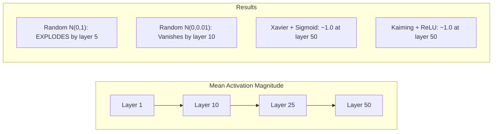
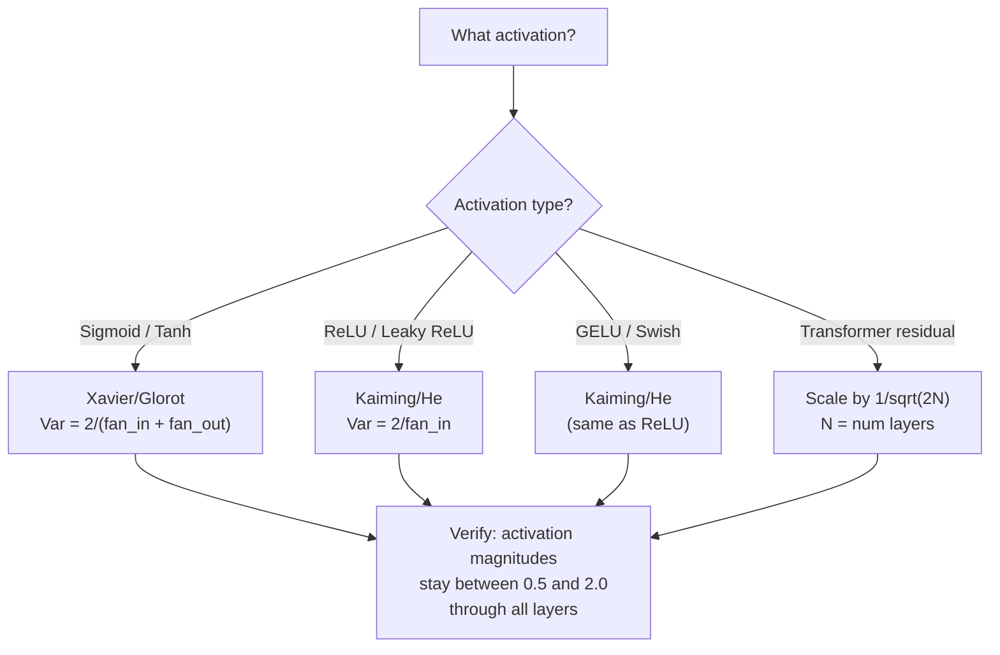

# Weight Initialization 与训练稳定性

> 初始化错了，训练根本不会开始。初始化对了，50 层也能像 3 层一样顺滑训练。

**类型：** 构建
**语言：** Python
**先修：** Lesson 03.04（Activation Functions），Lesson 03.07（Regularization）
**时间：** 约 90 分钟

## 学习目标

- 实现 zero、random、Xavier/Glorot 和 Kaiming/He initialization strategies，并测量它们对 50 层 activation magnitudes 的影响
- 推导为什么 Xavier init 使用 Var(w) = 2/(fan_in + fan_out)，Kaiming 使用 Var(w) = 2/fan_in
- 演示 zero initialization 的 symmetry problem，并解释为什么仅有 random scale 还不够
- 将正确的 initialization strategy 匹配到 activation function：sigmoid/tanh 用 Xavier，ReLU/GELU 用 Kaiming

## 问题

把所有 weights 初始化为 0。什么都学不到。每个神经元计算同一个函数，接收同一个 gradient，并以相同方式更新。10,000 epochs 之后，你的 512-neuron hidden layer 仍然只是同一个神经元的 512 个副本。你付出了 512 个参数，却只得到了 1 个。

把它们初始化得太大。Activations 会在网络中爆炸。到第 10 层，值到达 1e15。到第 20 层，它们 overflow 成 infinity。Gradients 会沿反方向走同样的轨迹。

从标准正态分布随机初始化。3 层时可行。50 层时，signal 会坍缩为零，或根据随机 scale 是略小还是略大而爆炸到 infinity。“能工作”和“坏掉”之间的边界薄如刀刃。

Weight initialization 是 deep learning 中最被低估的决定。Architecture 会有论文。Optimizers 会有博客。Initialization 只得到脚注。但如果它错了，其他一切都不重要——你的网络在训练开始前就已经死了。

## 概念

### Symmetry Problem

一层中的每个神经元结构相同：输入乘以 weights、加 bias、应用 activation。如果所有 weights 从同一个值开始（0 是极端情况），每个神经元都会计算同一个输出。backpropagation 期间，每个神经元收到同一个 gradient。update step 期间，每个神经元变化同样的量。

你被卡住了。网络有数百个参数，但它们同步移动。这叫 symmetry，而 random initialization 是打破它的蛮力方式。每个神经元从 weight space 中不同位置开始，因此会学习不同特征。

但“random”还不够。随机性的 *scale* 决定网络是否能训练。

### Variance 如何穿过层传播

考虑一个有 fan_in 个输入的单层：

```
z = w1*x1 + w2*x2 + ... + w_n*x_n
```

如果每个 weight wi 来自 variance 为 Var(w) 的分布，每个 input xi 的 variance 为 Var(x)，则输出 variance 是：

```
Var(z) = fan_in * Var(w) * Var(x)
```

如果 Var(w) = 1 且 fan_in = 512，输出 variance 是输入 variance 的 512 倍。10 层之后：512^10 = 1.2e27。你的 signal 已经爆炸。

如果 Var(w) = 0.001，输出 variance 每层会乘以 0.001 * 512 = 0.512。10 层之后：0.512^10 = 0.00013。你的 signal 已经消失。

目标是：选择 Var(w)，让 Var(z) = Var(x)。signal magnitude 在层间保持恒定。

### Xavier/Glorot Initialization

Glorot 和 Bengio（2010）为 sigmoid 和 tanh activations 推导了解法。为了让 forward 和 backward pass 中的 variance 都保持恒定：

```
Var(w) = 2 / (fan_in + fan_out)
```

实践中，weights 从以下分布抽样：

```
w ~ Uniform(-limit, limit)  where limit = sqrt(6 / (fan_in + fan_out))
```

或：

```
w ~ Normal(0, sqrt(2 / (fan_in + fan_out)))
```

它有效是因为 sigmoid 和 tanh 在 0 附近近似线性，而正确初始化后的 activations 正好待在那里。variance 可以稳定穿过几十层。

### Kaiming/He Initialization

ReLU 会杀死一半输出（所有负数变成 0）。有效 fan_in 被减半，因为平均来说一半 inputs 被置零。Xavier init 没有考虑这一点——它低估了所需 variance。

He 等人（2015）调整了公式：

```
Var(w) = 2 / fan_in
```

Weights 从以下分布抽样：

```
w ~ Normal(0, sqrt(2 / fan_in))
```

这个 2 的因子补偿了 ReLU 把一半 activations 置零的影响。没有它，signal 每层会缩小约 0.5x。50 层后：0.5^50 = 8.8e-16。Kaiming init 防止这种情况。

### Transformer Initialization

GPT-2 引入了不同模式。Residual connections 会把每个 sub-layer 的输出加到输入上：

```
x = x + sublayer(x)
```

每次相加都会增加 variance。有 N 个 residual layers 时，variance 会按 N 成比例增长。GPT-2 会按 1/sqrt(2N) 缩放 residual layers 的 weights，其中 N 是层数。这能保持累积 signal magnitude 稳定。

Llama 3（405B 参数、126 层）使用类似方案。没有这种缩放，residual stream 会在穿过 126 层 attention 和 feedforward blocks 时无界增长。

```mermaid
flowchart TD
    subgraph "Zero Init"
        Z1["Layer 1<br/>All weights = 0"] --> Z2["Layer 2<br/>All neurons identical"]
        Z2 --> Z3["Layer 3<br/>Still identical"]
        Z3 --> ZR["Result: 1 effective neuron<br/>regardless of width"]
    end

    subgraph "Xavier Init"
        X1["Layer 1<br/>Var = 2/(fan_in+fan_out)"] --> X2["Layer 2<br/>Signal stable"]
        X2 --> X3["Layer 50<br/>Signal stable"]
        X3 --> XR["Result: Trains with<br/>sigmoid/tanh"]
    end

    subgraph "Kaiming Init"
        K1["Layer 1<br/>Var = 2/fan_in"] --> K2["Layer 2<br/>Signal stable"]
        K2 --> K3["Layer 50<br/>Signal stable"]
        K3 --> KR["Result: Trains with<br/>ReLU/GELU"]
    end
```



### 50 层中的 Activation Magnitude



### 选择正确的 Init



## 构建

### Step 1: Initialization Strategies

四种初始化 weight matrix 的方式。每种都返回一个 list of lists（2D matrix），fan_in 列，fan_out 行。

```python
import math
import random


def zero_init(fan_in, fan_out):
    return [[0.0 for _ in range(fan_in)] for _ in range(fan_out)]


def random_init(fan_in, fan_out, scale=1.0):
    return [[random.gauss(0, scale) for _ in range(fan_in)] for _ in range(fan_out)]


def xavier_init(fan_in, fan_out):
    std = math.sqrt(2.0 / (fan_in + fan_out))
    return [[random.gauss(0, std) for _ in range(fan_in)] for _ in range(fan_out)]


def kaiming_init(fan_in, fan_out):
    std = math.sqrt(2.0 / fan_in)
    return [[random.gauss(0, std) for _ in range(fan_in)] for _ in range(fan_out)]
```

### Step 2: Activation Functions

我们需要 sigmoid、tanh 和 ReLU，用来测试每种 init strategy 与其目标 activation 的组合。

```python
def sigmoid(x):
    x = max(-500, min(500, x))
    return 1.0 / (1.0 + math.exp(-x))


def tanh_act(x):
    return math.tanh(x)


def relu(x):
    return max(0.0, x)
```

### Step 3: Forward Pass Through 50 Layers

让随机数据穿过一个深层网络，并测量每一层的 mean activation magnitude。

```python
def forward_deep(init_fn, activation_fn, n_layers=50, width=64, n_samples=100):
    random.seed(42)
    layer_magnitudes = []

    inputs = [[random.gauss(0, 1) for _ in range(width)] for _ in range(n_samples)]

    for layer_idx in range(n_layers):
        weights = init_fn(width, width)
        biases = [0.0] * width

        new_inputs = []
        for sample in inputs:
            output = []
            for neuron_idx in range(width):
                z = sum(weights[neuron_idx][j] * sample[j] for j in range(width)) + biases[neuron_idx]
                output.append(activation_fn(z))
            new_inputs.append(output)
        inputs = new_inputs

        magnitudes = []
        for sample in inputs:
            magnitudes.append(sum(abs(v) for v in sample) / width)
        mean_mag = sum(magnitudes) / len(magnitudes)
        layer_magnitudes.append(mean_mag)

    return layer_magnitudes
```

### Step 4: The Experiment

运行所有组合：zero init、random N(0,1)、random N(0,0.01)、Xavier with sigmoid、Xavier with tanh、Kaiming with ReLU。打印关键层的 magnitude。

```python
def run_experiment():
    configs = [
        ("Zero init + Sigmoid", lambda fi, fo: zero_init(fi, fo), sigmoid),
        ("Random N(0,1) + ReLU", lambda fi, fo: random_init(fi, fo, 1.0), relu),
        ("Random N(0,0.01) + ReLU", lambda fi, fo: random_init(fi, fo, 0.01), relu),
        ("Xavier + Sigmoid", xavier_init, sigmoid),
        ("Xavier + Tanh", xavier_init, tanh_act),
        ("Kaiming + ReLU", kaiming_init, relu),
    ]

    print(f"{'Strategy':<30} {'L1':>10} {'L5':>10} {'L10':>10} {'L25':>10} {'L50':>10}")
    print("-" * 80)

    for name, init_fn, act_fn in configs:
        mags = forward_deep(init_fn, act_fn)
        row = f"{name:<30}"
        for idx in [0, 4, 9, 24, 49]:
            val = mags[idx]
            if val > 1e6:
                row += f" {'EXPLODED':>10}"
            elif val < 1e-6:
                row += f" {'VANISHED':>10}"
            else:
                row += f" {val:>10.4f}"
        print(row)
```

### Step 5: Symmetry Demonstration

展示 zero init 会产生完全相同的神经元。

```python
def symmetry_demo():
    random.seed(42)
    weights = zero_init(2, 4)
    biases = [0.0] * 4

    inputs = [0.5, -0.3]
    outputs = []
    for neuron_idx in range(4):
        z = sum(weights[neuron_idx][j] * inputs[j] for j in range(2)) + biases[neuron_idx]
        outputs.append(sigmoid(z))

    print("\nSymmetry Demo (4 neurons, zero init):")
    for i, out in enumerate(outputs):
        print(f"  Neuron {i}: output = {out:.6f}")
    all_same = all(abs(outputs[i] - outputs[0]) < 1e-10 for i in range(len(outputs)))
    print(f"  All identical: {all_same}")
    print(f"  Effective parameters: 1 (not {len(weights) * len(weights[0])})")
```

### Step 6: Layer-by-Layer Magnitude Report

打印 50 层 activation magnitudes 的可视化柱状图。

```python
def magnitude_report(name, magnitudes):
    print(f"\n{name}:")
    for i, mag in enumerate(magnitudes):
        if i % 5 == 0 or i == len(magnitudes) - 1:
            if mag > 1e6:
                bar = "X" * 50 + " EXPLODED"
            elif mag < 1e-6:
                bar = "." + " VANISHED"
            else:
                bar_len = min(50, max(1, int(mag * 10)))
                bar = "#" * bar_len
            print(f"  Layer {i+1:3d}: {bar} ({mag:.6f})")
```

## 使用

PyTorch 提供内置函数：

```python
import torch
import torch.nn as nn

layer = nn.Linear(512, 256)

nn.init.xavier_uniform_(layer.weight)
nn.init.xavier_normal_(layer.weight)

nn.init.kaiming_uniform_(layer.weight, nonlinearity='relu')
nn.init.kaiming_normal_(layer.weight, nonlinearity='relu')

nn.init.zeros_(layer.bias)
```

当你调用 `nn.Linear(512, 256)` 时，PyTorch 默认使用 Kaiming uniform initialization。这就是多数简单网络“开箱即用”的原因——PyTorch 已经做了正确选择。但当你构建自定义架构或深度超过 20 层时，你需要理解正在发生什么，并可能覆盖默认值。

对于 transformers，HuggingFace models 通常在它们的 `_init_weights` 方法中处理 initialization。GPT-2 的实现会按 1/sqrt(N) 缩放 residual projections。如果你从零构建 transformer，需要自己加入这一点。

## 交付

本课会产出：
- `outputs/prompt-init-strategy.md`——一个诊断 weight initialization 问题并推荐正确策略的 prompt

## 练习

1. 添加 LeCun initialization（Var = 1/fan_in，为 SELU activation 设计）。用 LeCun init + tanh 运行 50 层实验，并与 Xavier + tanh 比较。

2. 实现 GPT-2 residual scaling：在把每层输出加到 residual stream 之前，乘以 1/sqrt(2*N)。在有/无 scaling 下运行 50 层，测量 residual magnitude 增长速度。

3. 创建一个“init health check”函数，接收网络层维度和 activation type，然后推荐正确 initialization，并在当前 init 会造成问题时发出警告。

4. 用 fan_in = 16 和 fan_in = 1024 运行实验。Xavier 和 Kaiming 会适应 fan_in，但 random init 不会。展示随着层更大，“能工作”和“会坏掉”的差距如何扩大。

5. 实现 orthogonal initialization（生成随机矩阵，计算它的 SVD，使用正交矩阵 U）。在 50 层 ReLU 网络中与 Kaiming 比较。

## 关键术语

| 术语 | 人们常说 | 实际含义 |
|------|----------|----------|
| Weight initialization | “随机设置起始 weights” | 选择初始 weight values 的策略，它决定网络是否能开始训练 |
| Symmetry breaking | “让神经元不同” | 使用随机初始化确保神经元学习不同特征，而不是计算相同函数 |
| Fan-in | “神经元的输入数量” | incoming connections 的数量，决定 input variance 如何在 weighted sum 中累积 |
| Fan-out | “神经元的输出数量” | outgoing connections 的数量，与 backpropagation 中保持 gradient variance 有关 |
| Xavier/Glorot init | “sigmoid 初始化” | Var(w) = 2/(fan_in + fan_out)，设计用来在 sigmoid 和 tanh activations 中保持 variance |
| Kaiming/He init | “ReLU 初始化” | Var(w) = 2/fan_in，考虑了 ReLU 会把一半 activations 置零 |
| Variance propagation | “Signals 如何穿过层增长或缩小” | 根据 weight scale 分析 activation variance 如何逐层变化 |
| Residual scaling | “GPT-2 的 init 技巧” | 将 residual connection weights 按 1/sqrt(2N) 缩放，防止 variance 穿过 N 层 transformer 增长 |
| Dead network | “什么都训练不了” | 因糟糕 initialization 导致所有 gradients 为 0 或所有 activations 饱和的网络 |
| Exploding activations | “值走向无穷大” | weight variance 过高导致 activation magnitudes 穿过层指数级增长 |

## 延伸阅读

- Glorot & Bengio, "Understanding the difficulty of training deep feedforward neural networks" (2010)——Xavier initialization 原始论文，包含 variance analysis
- He et al., "Delving Deep into Rectifiers" (2015)——为 ReLU 网络提出 Kaiming initialization
- Radford et al., "Language Models are Unsupervised Multitask Learners" (2019)——GPT-2 论文，包含 residual scaling initialization
- Mishkin & Matas, "All You Need is a Good Init" (2016)——layer-sequential unit-variance initialization，是解析公式之外的经验替代方案
