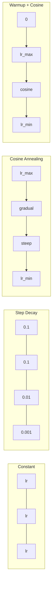
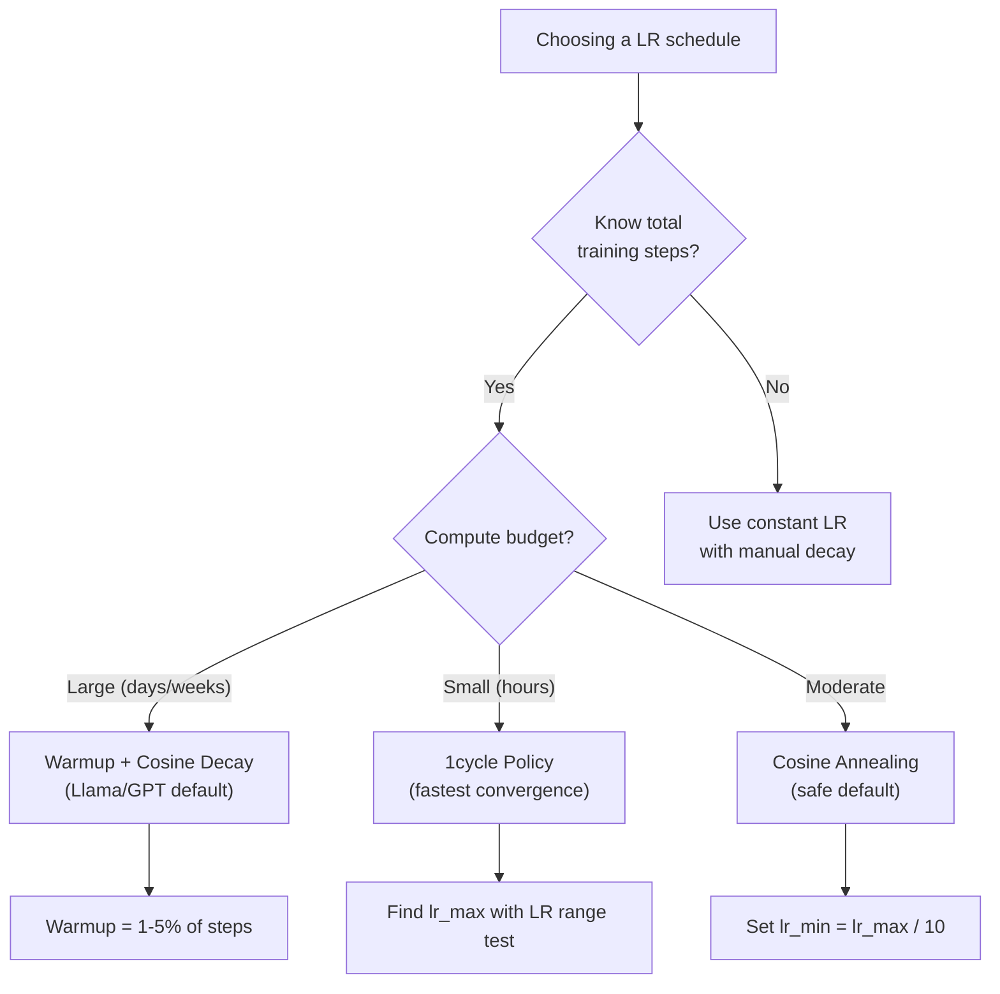
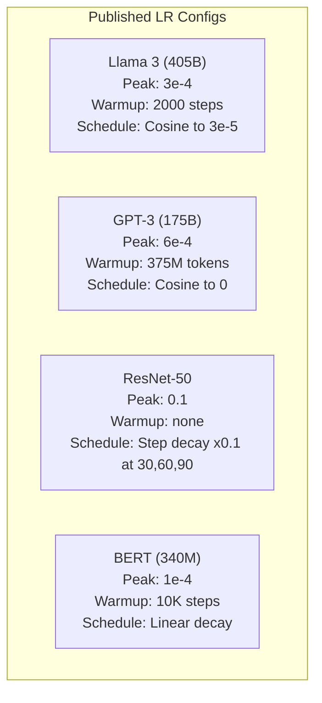

# Learning Rate Schedules 与 Warmup

> learning rate 是最重要的单个 hyperparameter。不是架构。不是数据集大小。不是 activation function。是 learning rate。如果你什么都不调，就调它。

**类型：** 构建
**语言：** Python
**先修：** Lesson 03.06（Optimizers），Lesson 03.08（Weight Initialization）
**时间：** 约 90 分钟

## 学习目标

- 从零实现 constant、step decay、cosine annealing、warmup + cosine 和 1cycle learning rate schedules
- 演示 learning rate 选择的三种 failure modes：divergence（太高）、stalling（太低）和 oscillation（没有 decay）
- 解释为什么 Adam-based optimizers 需要 warmup，以及它如何稳定早期训练
- 在同一任务上比较五种 schedules 的收敛速度，并为给定训练预算选择合适方案

## 问题

把 learning rate 设为 0.1。训练发散——loss 在 3 步内跳到 infinity。设为 0.0001。训练爬行——100 epochs 后，模型几乎还停在随机状态。设为 0.01。训练前 50 epochs 有效，然后 loss 围绕一个永远到不了的 minimum 震荡，因为步子太大。

最优 learning rate 不是常数。它会在训练期间变化。早期你想用大步快速覆盖空间。后期你想用小步落入尖锐 minimum。一个 90% 准确率模型和一个 95% 准确率模型之间，差异经常只是 schedule。

过去三年发布的每个主要模型都使用 learning rate schedule。Llama 3 使用 peak lr=3e-4、2000 warmup steps，并 cosine decay 到 3e-5。GPT-3 使用 lr=6e-4，并在 3.75 亿 tokens 上 warmup。这些不是任意选择，而是成本数百万美元的大规模 hyperparameter sweeps 的结果。

你需要理解 schedules，因为默认值不一定适合你的问题。当你 fine-tune pretrained model 时，正确 schedule 不同于从零训练。当你增加 batch size 时，warmup period 也需要变化。当训练在第 10,000 步坏掉时，你需要知道它是不是 schedule 问题。

## 概念

### Constant Learning Rate

最简单的方法。选一个数字，每一步都用它。

```
lr(t) = lr_0
```

很少是最优。它要么在训练末期太高（围绕 minimum 震荡），要么在训练初期太低（小步浪费计算）。小模型和 debugging 还行。对任何训练超过一小时的东西都很糟糕。

### Step Decay

ResNet 时代的老派方法。在固定 epochs 把 learning rate 乘以一个因子（通常 10x 下降）。

```
lr(t) = lr_0 * gamma^(floor(epoch / step_size))
```

其中 gamma = 0.1 且 step_size = 30 意味着：每 30 epochs，lr 降低 10 倍。ResNet-50 就这么用——lr=0.1，在 epochs 30、60、90 处各下降 10 倍。

问题是：最佳 decay 点依赖 dataset 和 architecture。换一个问题，你就需要重新调何时下降。转折也很突兀——rate 突然变化时 loss 可能 spike。

### Cosine Annealing

从最大学习率平滑衰减到最小学习率，遵循 cosine 曲线：

```
lr(t) = lr_min + 0.5 * (lr_max - lr_min) * (1 + cos(pi * t / T))
```

其中 t 是当前 step，T 是总 steps。

t=0 时，cosine 项为 1，所以 lr = lr_max。t=T 时，cosine 项为 -1，所以 lr = lr_min。衰减开始很温和，中间加速，接近末尾又变温和。

这是多数现代训练运行的默认选择。除了 lr_max 和 lr_min，没有额外 hyperparameters 要调。cosine 形状符合经验观察：大部分学习发生在训练中段——你希望关键时期有合理步长。

### Warmup：为什么从小开始

Adam 和其他 adaptive optimizers 会维护 gradient mean 与 variance 的 running estimates。在 step 0，这些 estimates 初始化为 0。最初几个 gradient updates 基于垃圾统计量。如果这段时间 learning rate 很大，模型会迈出巨大且方向很差的步子。

Warmup 修复这一点。从很小的 learning rate 开始（通常 lr_max / warmup_steps，甚至是 0），在前 N steps 线性爬升到 lr_max。到达完整 learning rate 时，Adam 的统计量已经稳定。

```
lr(t) = lr_max * (t / warmup_steps)     for t < warmup_steps
```

典型 warmup：总 training steps 的 1-5%。Llama 3 训练约 1.8 万亿 tokens，并 warmup 了 2000 steps。GPT-3 在 3.75 亿 tokens 上 warmup。

### Linear Warmup + Cosine Decay

现代默认组合。先线性爬升，再 cosine decay：

```
if t < warmup_steps:
    lr(t) = lr_max * (t / warmup_steps)
else:
    progress = (t - warmup_steps) / (total_steps - warmup_steps)
    lr(t) = lr_min + 0.5 * (lr_max - lr_min) * (1 + cos(pi * progress))
```

Llama、GPT、PaLM 和大多数现代 transformers 都这么用。warmup 防止早期不稳定。cosine decay 让模型落入好的 minimum。

### 1cycle Policy

Leslie Smith 的发现（2018）：训练前半段把 learning rate 从低值升到高值，后半段再降下来。反直觉——为什么要在训练中途 *增加* learning rate？

理论是：高 learning rate 会通过给 optimization trajectory 添加噪声来起到 regularization 作用。模型在 ramp-up 阶段探索更多 loss landscape，找到更好的 basin。ramp-down 阶段再在找到的最佳 basin 中细化。

```
Phase 1 (0 to T/2):    lr ramps from lr_max/25 to lr_max
Phase 2 (T/2 to T):    lr ramps from lr_max to lr_max/10000
```

在固定 compute budget 下，1cycle 经常比 cosine annealing 训练更快。代价是：你必须提前知道总 steps。

### Schedule Shapes



### 决策流程图



### 已发表模型中的真实数字



## 构建

### Step 1: Schedule Functions

每个函数接收当前 step，并返回该 step 的 learning rate。

```python
import math


def constant_schedule(step, lr=0.01, **kwargs):
    return lr


def step_decay_schedule(step, lr=0.1, step_size=100, gamma=0.1, **kwargs):
    return lr * (gamma ** (step // step_size))


def cosine_schedule(step, lr=0.01, total_steps=1000, lr_min=1e-5, **kwargs):
    if step >= total_steps:
        return lr_min
    return lr_min + 0.5 * (lr - lr_min) * (1 + math.cos(math.pi * step / total_steps))


def warmup_cosine_schedule(step, lr=0.01, total_steps=1000, warmup_steps=100, lr_min=1e-5, **kwargs):
    if total_steps <= warmup_steps:
        return lr * (step / max(warmup_steps, 1))
    if step < warmup_steps:
        return lr * step / warmup_steps
    progress = (step - warmup_steps) / (total_steps - warmup_steps)
    return lr_min + 0.5 * (lr - lr_min) * (1 + math.cos(math.pi * progress))


def one_cycle_schedule(step, lr=0.01, total_steps=1000, **kwargs):
    mid = max(total_steps // 2, 1)
    if step < mid:
        return (lr / 25) + (lr - lr / 25) * step / mid
    else:
        progress = (step - mid) / max(total_steps - mid, 1)
        return lr * (1 - progress) + (lr / 10000) * progress
```

### Step 2: Visualize All Schedules

打印基于文本的图，展示每种 schedule 如何随训练演化。

```python
def visualize_schedule(name, schedule_fn, total_steps=500, **kwargs):
    steps = list(range(0, total_steps, total_steps // 20))
    if total_steps - 1 not in steps:
        steps.append(total_steps - 1)

    lrs = [schedule_fn(s, total_steps=total_steps, **kwargs) for s in steps]
    max_lr = max(lrs) if max(lrs) > 0 else 1.0

    print(f"\n{name}:")
    for s, lr_val in zip(steps, lrs):
        bar_len = int(lr_val / max_lr * 40)
        bar = "#" * bar_len
        print(f"  Step {s:4d}: lr={lr_val:.6f} {bar}")
```

### Step 3: Training Network

circle dataset 上的简单两层网络，和前几课相同，但这次我们改变 schedule。

```python
import random


def sigmoid(x):
    x = max(-500, min(500, x))
    return 1.0 / (1.0 + math.exp(-x))


def relu(x):
    return max(0.0, x)


def relu_deriv(x):
    return 1.0 if x > 0 else 0.0


def make_circle_data(n=200, seed=42):
    random.seed(seed)
    data = []
    for _ in range(n):
        x = random.uniform(-2, 2)
        y = random.uniform(-2, 2)
        label = 1.0 if x * x + y * y < 1.5 else 0.0
        data.append(([x, y], label))
    return data


def train_with_schedule(schedule_fn, schedule_name, data, epochs=300, base_lr=0.05, **kwargs):
    random.seed(0)
    hidden_size = 8
    total_steps = epochs * len(data)

    std = math.sqrt(2.0 / 2)
    w1 = [[random.gauss(0, std) for _ in range(2)] for _ in range(hidden_size)]
    b1 = [0.0] * hidden_size
    w2 = [random.gauss(0, std) for _ in range(hidden_size)]
    b2 = 0.0

    step = 0
    epoch_losses = []

    for epoch in range(epochs):
        total_loss = 0
        correct = 0

        for x, target in data:
            lr = schedule_fn(step, lr=base_lr, total_steps=total_steps, **kwargs)

            z1 = []
            h = []
            for i in range(hidden_size):
                z = w1[i][0] * x[0] + w1[i][1] * x[1] + b1[i]
                z1.append(z)
                h.append(relu(z))

            z2 = sum(w2[i] * h[i] for i in range(hidden_size)) + b2
            out = sigmoid(z2)

            error = out - target
            d_out = error * out * (1 - out)

            for i in range(hidden_size):
                d_h = d_out * w2[i] * relu_deriv(z1[i])
                w2[i] -= lr * d_out * h[i]
                for j in range(2):
                    w1[i][j] -= lr * d_h * x[j]
                b1[i] -= lr * d_h
            b2 -= lr * d_out

            total_loss += (out - target) ** 2
            if (out >= 0.5) == (target >= 0.5):
                correct += 1
            step += 1

        avg_loss = total_loss / len(data)
        accuracy = correct / len(data) * 100
        epoch_losses.append(avg_loss)

    return epoch_losses
```

### Step 4: Compare All Schedules

用每种 schedule 训练同一个网络，并比较最终 loss 和收敛行为。

```python
def compare_schedules(data):
    configs = [
        ("Constant", constant_schedule, {}),
        ("Step Decay", step_decay_schedule, {"step_size": 15000, "gamma": 0.1}),
        ("Cosine", cosine_schedule, {"lr_min": 1e-5}),
        ("Warmup+Cosine", warmup_cosine_schedule, {"warmup_steps": 3000, "lr_min": 1e-5}),
        ("1cycle", one_cycle_schedule, {}),
    ]

    print(f"\n{'Schedule':<20} {'Start Loss':>12} {'Mid Loss':>12} {'End Loss':>12} {'Best Loss':>12}")
    print("-" * 70)

    for name, schedule_fn, extra_kwargs in configs:
        losses = train_with_schedule(schedule_fn, name, data, epochs=300, base_lr=0.05, **extra_kwargs)
        mid_idx = len(losses) // 2
        best = min(losses)
        print(f"{name:<20} {losses[0]:>12.6f} {losses[mid_idx]:>12.6f} {losses[-1]:>12.6f} {best:>12.6f}")
```

### Step 5: LR Too High vs Too Low

演示三种 failure modes：太高（divergence）、太低（crawling）和刚好。

```python
def lr_sensitivity(data):
    learning_rates = [1.0, 0.1, 0.01, 0.001, 0.0001]

    print("\nLR Sensitivity (constant schedule, 100 epochs):")
    print(f"  {'LR':>10} {'Start Loss':>12} {'End Loss':>12} {'Status':>15}")
    print("  " + "-" * 52)

    for lr in learning_rates:
        losses = train_with_schedule(constant_schedule, f"lr={lr}", data, epochs=100, base_lr=lr)
        start = losses[0]
        end = losses[-1]

        if end > start or math.isnan(end) or end > 1.0:
            status = "DIVERGED"
        elif end > start * 0.9:
            status = "BARELY MOVED"
        elif end < 0.15:
            status = "CONVERGED"
        else:
            status = "LEARNING"

        end_str = f"{end:.6f}" if not math.isnan(end) else "NaN"
        print(f"  {lr:>10.4f} {start:>12.6f} {end_str:>12} {status:>15}")
```

## 使用

PyTorch 在 `torch.optim.lr_scheduler` 中提供 schedulers：

```python
import torch
import torch.optim as optim
from torch.optim.lr_scheduler import CosineAnnealingLR, OneCycleLR, StepLR

model = nn.Sequential(nn.Linear(10, 64), nn.ReLU(), nn.Linear(64, 1))
optimizer = optim.Adam(model.parameters(), lr=3e-4)

scheduler = CosineAnnealingLR(optimizer, T_max=1000, eta_min=1e-5)

for step in range(1000):
    loss = train_step(model, optimizer)
    scheduler.step()
```

对于 warmup + cosine，可以使用 lambda scheduler，或 HuggingFace 的 `get_cosine_schedule_with_warmup`：

```python
from transformers import get_cosine_schedule_with_warmup

scheduler = get_cosine_schedule_with_warmup(
    optimizer,
    num_warmup_steps=2000,
    num_training_steps=100000,
)
```

HuggingFace 函数是多数 Llama 和 GPT fine-tuning scripts 使用的东西。拿不准时，用 warmup + cosine，warmup = total steps 的 3-5%。它几乎适用于所有情况。

## 交付

本课会产出：
- `outputs/prompt-lr-schedule-advisor.md`——一个根据训练设置推荐正确 learning rate schedule 和 hyperparameters 的 prompt

## 练习

1. 实现 exponential decay：lr(t) = lr_0 * gamma^t，其中 gamma = 0.999。在 circle dataset 上与 cosine annealing 比较。

2. 实现 learning rate range test（Leslie Smith）：训练几百步，同时把 LR 从 1e-7 指数增加到 1。绘制 loss vs LR。最佳 max LR 位于 loss 开始上升之前。

3. 使用 warmup + cosine 训练，但改变 warmup length：总 steps 的 0%、1%、5%、10%、20%。找到训练最稳定的甜蜜点。

4. 实现带 warm restarts 的 cosine annealing（SGDR）：每 T steps 把 learning rate 重置为 lr_max，然后重新衰减。在更长训练中与标准 cosine 比较。

5. 构建一个“schedule surgeon”，监控 training loss，并在 loss 稳定时自动从 warmup 切到 cosine；如果 loss plateau 太久，则降低 lr。

## 关键术语

| 术语 | 人们常说 | 实际含义 |
|------|----------|----------|
| Learning rate | “模型学得多快” | 乘在 gradient 上、决定 parameter update 大小的标量 |
| Schedule | “随时间改变 LR” | 把 training step 映射到 learning rate 的函数，用来优化收敛 |
| Warmup | “从小 LR 开始” | 在前 N steps 中把 LR 从接近 0 线性爬升到目标值，以稳定 optimizer statistics |
| Cosine annealing | “平滑 LR 衰减” | 训练期间按 cosine 曲线把 LR 从 lr_max 降到 lr_min |
| Step decay | “在里程碑处降低 LR” | 在固定 epoch 间隔把 LR 乘以一个因子（通常 0.1） |
| 1cycle policy | “先上后下” | Leslie Smith 的方法，在单个 cycle 中先升 LR 再降 LR，以更快收敛 |
| LR range test | “找到最佳 learning rate” | 短暂训练并不断增加 LR，找出 loss 开始发散的位置 |
| Cosine with warm restarts | “重置并重复” | 周期性把 LR 重置到 lr_max 并再次衰减（SGDR） |
| Eta min | “LR 的地板” | schedule 衰减到的最低 learning rate |
| Peak learning rate | “最大 LR” | 训练中达到的最高 LR，通常位于 warmup 之后 |

## 延伸阅读

- Loshchilov & Hutter, "SGDR: Stochastic Gradient Descent with Warm Restarts" (2017)——引入 cosine annealing 和 warm restarts
- Smith, "Super-Convergence: Very Fast Training of Neural Networks Using Large Learning Rates" (2018)——1cycle policy 论文
- Touvron et al., "Llama 2: Open Foundation and Fine-Tuned Chat Models" (2023)——记录了规模化训练中使用的 warmup + cosine schedule
- Goyal et al., "Accurate, Large Minibatch SGD: Training ImageNet in 1 Hour" (2017)——large batch training 的 linear scaling rule 和 warmup
