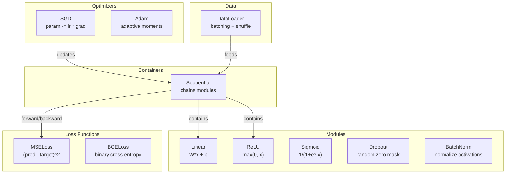
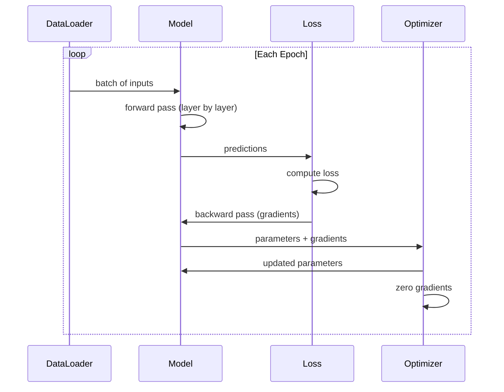
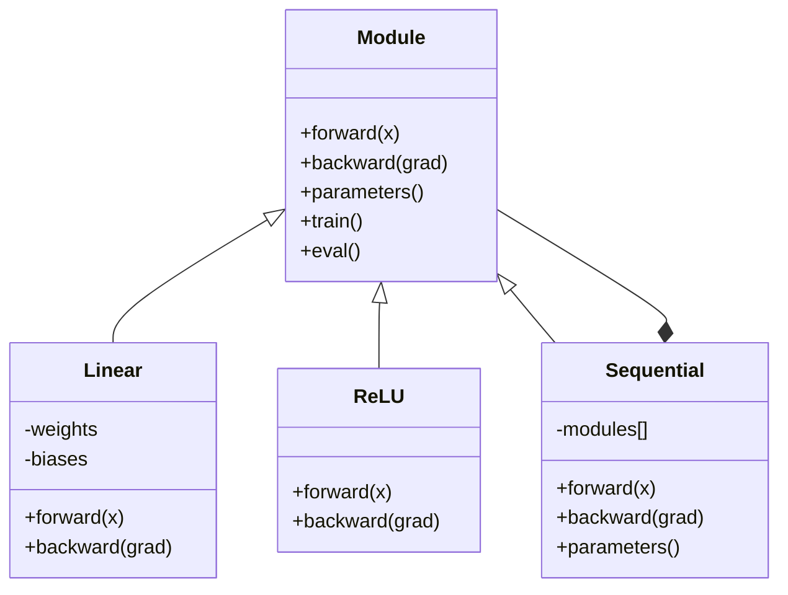

# 构建你自己的 Mini Framework

> 你已经构建了 neurons、layers、networks、backprop、activations、loss functions、optimizers、regularization、initialization 和 LR schedules。它们都是独立零件。现在把它们接成一个 framework。不是 PyTorch。不是 TensorFlow。是你的。

**类型：** 构建
**语言：** Python
**先修：** Phase 03 全部内容（Lessons 01-09）
**时间：** 约 120 分钟

## 学习目标

- 构建一个完整 deep learning framework（约 500 行），包含 Module、Linear、ReLU、Sigmoid、Dropout、BatchNorm、Sequential、loss functions、optimizers 和 DataLoader
- 解释 Module abstraction（forward、backward、parameters），以及为什么需要 train/eval mode toggling
- 把所有组件接入一个可工作的 training loop，在 circle classification 上训练一个 4 层网络
- 将你 framework 的每个组件映射到 PyTorch 等价物（nn.Module、nn.Sequential、optim.Adam、DataLoader）

## 问题

你已经有十课构建块，散落在不同文件里。一个 `Value` class 在这里，一个 training loop 在那里，weight initialization 在另一个文件里，learning rate schedules 又在另一个地方。为了训练一个网络，你要从五节课复制粘贴，然后手工接线。

这正是 frameworks 要解决的问题。PyTorch 给你 `nn.Module`、`nn.Sequential`、`optim.Adam`、`DataLoader`，以及把它们连在一起的 training loop pattern。TensorFlow 给你 `keras.Layer`、`keras.Sequential`、`keras.optimizers.Adam`。它们不是魔法。它们是组织模式，让你不必每次都重新发明管道，就能定义、训练和评估网络。

你将用约 500 行 Python 构建同样的东西。没有 numpy。没有外部依赖。这个 framework 可以定义任意 feedforward network，用 SGD 或 Adam 训练，批处理数据，应用 dropout 和 batch normalization，使用任意 activation，并调度 learning rate。

完成之后，你会准确理解在 PyTorch 中写 `model = nn.Sequential(...)` 时发生了什么。你会理解为什么存在 `model.train()` 和 `model.eval()`。你会理解为什么 `optimizer.zero_grad()` 是一个独立调用。你会理解全部，因为你亲手构建了全部。

## 概念

### Module Abstraction

PyTorch 中每一层都继承自 `nn.Module`。Module 有三个职责：

1. **forward()**——给定 inputs 计算 output
2. **parameters()**——返回所有可训练 weights
3. **backward()**——计算 gradients（PyTorch 中由 autograd 处理，我们这里显式实现）

Linear layer 是 Module。ReLU activation 是 Module。dropout layer 是 Module。batch normalization layer 也是 Module。它们拥有同一个接口。

### Sequential Container

`nn.Sequential` 会串联 Modules。Forward pass：数据经过 Module 1，再经过 Module 2，再经过 Module 3。Backward pass：反向穿过这条链。container 本身也是 Module——它也有 forward()、parameters() 和 backward()。这是 composite pattern：一串 Modules 本身也是一个 Module。

### Training vs Evaluation Mode

Dropout 在训练期间随机把神经元置零，但在评估期间让所有东西通过。Batch normalization 在训练期间使用 batch statistics，但在评估期间使用 running averages。`train()` 和 `eval()` 方法用于切换这种行为。每个 Module 都有一个 `training` flag。

### Optimizer

optimizer 使用 gradients 更新参数。SGD：`param -= lr * grad`。Adam：维护 momentum 和 variance estimates，然后更新。optimizer 不知道网络架构——它只看到一个扁平的 parameters 和 gradients 列表。

### DataLoader

Batching 有两个原因。第一，大问题中你无法把整个数据集放进内存。第二，mini-batch gradient descent 提供噪声，帮助逃离 local minima。DataLoader 会把数据拆成 batches，并可选地在 epochs 之间 shuffle。

### Framework Architecture



### Training Loop



### Module Hierarchy



## 构建

### Step 1: Module Base Class

每一层都要实现的抽象接口。

```python
class Module:
    def __init__(self):
        self.training = True

    def forward(self, x):
        raise NotImplementedError

    def backward(self, grad):
        raise NotImplementedError

    def parameters(self):
        return []

    def train(self):
        self.training = True

    def eval(self):
        self.training = False
```

### Step 2: Linear Layer

最基础的构建块。保存 weights 和 biases，forward 计算 Wx + b，backward 计算 weight/input gradients。

```python
import math
import random


class Linear(Module):
    def __init__(self, fan_in, fan_out):
        super().__init__()
        std = math.sqrt(2.0 / fan_in)
        self.weights = [[random.gauss(0, std) for _ in range(fan_in)] for _ in range(fan_out)]
        self.biases = [0.0] * fan_out
        self.weight_grads = [[0.0] * fan_in for _ in range(fan_out)]
        self.bias_grads = [0.0] * fan_out
        self.fan_in = fan_in
        self.fan_out = fan_out
        self.input = None

    def forward(self, x):
        self.input = x
        output = []
        for i in range(self.fan_out):
            val = self.biases[i]
            for j in range(self.fan_in):
                val += self.weights[i][j] * x[j]
            output.append(val)
        return output

    def backward(self, grad):
        input_grad = [0.0] * self.fan_in
        for i in range(self.fan_out):
            self.bias_grads[i] += grad[i]
            for j in range(self.fan_in):
                self.weight_grads[i][j] += grad[i] * self.input[j]
                input_grad[j] += grad[i] * self.weights[i][j]
        return input_grad

    def parameters(self):
        params = []
        for i in range(self.fan_out):
            for j in range(self.fan_in):
                params.append((self.weights, i, j, self.weight_grads))
            params.append((self.biases, i, None, self.bias_grads))
        return params
```

### Step 3: Activation Modules

把 ReLU、Sigmoid 和 Tanh 作为 Modules。每个都会缓存 backward pass 需要的内容。

```python
class ReLU(Module):
    def __init__(self):
        super().__init__()
        self.mask = None

    def forward(self, x):
        self.mask = [1.0 if v > 0 else 0.0 for v in x]
        return [max(0.0, v) for v in x]

    def backward(self, grad):
        return [g * m for g, m in zip(grad, self.mask)]


class Sigmoid(Module):
    def __init__(self):
        super().__init__()
        self.output = None

    def forward(self, x):
        self.output = []
        for v in x:
            v = max(-500, min(500, v))
            self.output.append(1.0 / (1.0 + math.exp(-v)))
        return self.output

    def backward(self, grad):
        return [g * o * (1 - o) for g, o in zip(grad, self.output)]


class Tanh(Module):
    def __init__(self):
        super().__init__()
        self.output = None

    def forward(self, x):
        self.output = [math.tanh(v) for v in x]
        return self.output

    def backward(self, grad):
        return [g * (1 - o * o) for g, o in zip(grad, self.output)]
```

### Step 4: Dropout Module

训练期间随机把元素置零。剩余元素按 1/(1-p) 缩放，让期望值保持不变。eval 期间不做任何事。

```python
class Dropout(Module):
    def __init__(self, p=0.5):
        super().__init__()
        self.p = p
        self.mask = None

    def forward(self, x):
        if not self.training:
            return x
        self.mask = [0.0 if random.random() < self.p else 1.0 / (1 - self.p) for _ in x]
        return [v * m for v, m in zip(x, self.mask)]

    def backward(self, grad):
        if self.mask is None:
            return grad
        return [g * m for g, m in zip(grad, self.mask)]
```

### Step 5: BatchNorm Module

在 batch 中按 feature 把 activations 归一化为 zero mean 和 unit variance。为 eval mode 维护 running statistics。

```python
class BatchNorm(Module):
    def __init__(self, size, momentum=0.1, eps=1e-5):
        super().__init__()
        self.size = size
        self.gamma = [1.0] * size
        self.beta = [0.0] * size
        self.gamma_grads = [0.0] * size
        self.beta_grads = [0.0] * size
        self.running_mean = [0.0] * size
        self.running_var = [1.0] * size
        self.momentum = momentum
        self.eps = eps
        self.x_norm = None
        self.std_inv = None
        self.batch_input = None

    def forward_batch(self, batch):
        batch_size = len(batch)
        output_batch = []

        if self.training:
            mean = [0.0] * self.size
            for sample in batch:
                for j in range(self.size):
                    mean[j] += sample[j]
            mean = [m / batch_size for m in mean]

            var = [0.0] * self.size
            for sample in batch:
                for j in range(self.size):
                    var[j] += (sample[j] - mean[j]) ** 2
            var = [v / batch_size for v in var]

            self.std_inv = [1.0 / math.sqrt(v + self.eps) for v in var]

            self.x_norm = []
            self.batch_input = batch
            for sample in batch:
                normed = [(sample[j] - mean[j]) * self.std_inv[j] for j in range(self.size)]
                self.x_norm.append(normed)
                output = [self.gamma[j] * normed[j] + self.beta[j] for j in range(self.size)]
                output_batch.append(output)

            for j in range(self.size):
                self.running_mean[j] = (1 - self.momentum) * self.running_mean[j] + self.momentum * mean[j]
                self.running_var[j] = (1 - self.momentum) * self.running_var[j] + self.momentum * var[j]
        else:
            std_inv = [1.0 / math.sqrt(v + self.eps) for v in self.running_var]
            for sample in batch:
                normed = [(sample[j] - self.running_mean[j]) * std_inv[j] for j in range(self.size)]
                output = [self.gamma[j] * normed[j] + self.beta[j] for j in range(self.size)]
                output_batch.append(output)

        return output_batch

    def forward(self, x):
        result = self.forward_batch([x])
        return result[0]

    def backward(self, grad):
        if self.x_norm is None:
            return grad
        for j in range(self.size):
            self.gamma_grads[j] += self.x_norm[0][j] * grad[j]
            self.beta_grads[j] += grad[j]
        return [grad[j] * self.gamma[j] * self.std_inv[j] for j in range(self.size)]

    def parameters(self):
        params = []
        for j in range(self.size):
            params.append((self.gamma, j, None, self.gamma_grads))
            params.append((self.beta, j, None, self.beta_grads))
        return params
```

### Step 6: Sequential Container

串联 modules。Forward 从左到右，backward 从右到左。

```python
class Sequential(Module):
    def __init__(self, *modules):
        super().__init__()
        self.modules = list(modules)

    def forward(self, x):
        for module in self.modules:
            x = module.forward(x)
        return x

    def backward(self, grad):
        for module in reversed(self.modules):
            grad = module.backward(grad)
        return grad

    def parameters(self):
        params = []
        for module in self.modules:
            params.extend(module.parameters())
        return params

    def train(self):
        self.training = True
        for module in self.modules:
            module.train()

    def eval(self):
        self.training = False
        for module in self.modules:
            module.eval()
```

### Step 7: Loss Functions

MSE 和 Binary Cross-Entropy。每个都返回 loss value，并提供返回 gradient 的 backward()。

```python
class MSELoss:
    def __call__(self, predicted, target):
        self.predicted = predicted
        self.target = target
        n = len(predicted)
        self.loss = sum((p - t) ** 2 for p, t in zip(predicted, target)) / n
        return self.loss

    def backward(self):
        n = len(self.predicted)
        return [2 * (p - t) / n for p, t in zip(self.predicted, self.target)]


class BCELoss:
    def __call__(self, predicted, target):
        self.predicted = predicted
        self.target = target
        eps = 1e-7
        n = len(predicted)
        self.loss = 0
        for p, t in zip(predicted, target):
            p = max(eps, min(1 - eps, p))
            self.loss += -(t * math.log(p) + (1 - t) * math.log(1 - p))
        self.loss /= n
        return self.loss

    def backward(self):
        eps = 1e-7
        n = len(self.predicted)
        grads = []
        for p, t in zip(self.predicted, self.target):
            p = max(eps, min(1 - eps, p))
            grads.append((-t / p + (1 - t) / (1 - p)) / n)
        return grads
```

### Step 8: SGD and Adam Optimizers

二者都接收 parameter list，并使用 gradients 更新 weights。

```python
class SGD:
    def __init__(self, parameters, lr=0.01):
        self.params = parameters
        self.lr = lr

    def step(self):
        for container, i, j, grad_container in self.params:
            if j is not None:
                container[i][j] -= self.lr * grad_container[i][j]
            else:
                container[i] -= self.lr * grad_container[i]

    def zero_grad(self):
        for container, i, j, grad_container in self.params:
            if j is not None:
                grad_container[i][j] = 0.0
            else:
                grad_container[i] = 0.0


class Adam:
    def __init__(self, parameters, lr=0.001, beta1=0.9, beta2=0.999, eps=1e-8):
        self.params = parameters
        self.lr = lr
        self.beta1 = beta1
        self.beta2 = beta2
        self.eps = eps
        self.t = 0
        self.m = [0.0] * len(parameters)
        self.v = [0.0] * len(parameters)

    def step(self):
        self.t += 1
        for idx, (container, i, j, grad_container) in enumerate(self.params):
            if j is not None:
                g = grad_container[i][j]
            else:
                g = grad_container[i]

            self.m[idx] = self.beta1 * self.m[idx] + (1 - self.beta1) * g
            self.v[idx] = self.beta2 * self.v[idx] + (1 - self.beta2) * g * g

            m_hat = self.m[idx] / (1 - self.beta1 ** self.t)
            v_hat = self.v[idx] / (1 - self.beta2 ** self.t)

            update = self.lr * m_hat / (math.sqrt(v_hat) + self.eps)

            if j is not None:
                container[i][j] -= update
            else:
                container[i] -= update

    def zero_grad(self):
        for container, i, j, grad_container in self.params:
            if j is not None:
                grad_container[i][j] = 0.0
            else:
                grad_container[i] = 0.0
```

### Step 9: DataLoader

把数据拆成 batches，并可选地在每个 epoch shuffle。

```python
class DataLoader:
    def __init__(self, data, batch_size=32, shuffle=True):
        self.data = data
        self.batch_size = batch_size
        self.shuffle = shuffle

    def __iter__(self):
        indices = list(range(len(self.data)))
        if self.shuffle:
            random.shuffle(indices)
        for start in range(0, len(indices), self.batch_size):
            batch_indices = indices[start:start + self.batch_size]
            batch = [self.data[i] for i in batch_indices]
            inputs = [item[0] for item in batch]
            targets = [item[1] for item in batch]
            yield inputs, targets

    def __len__(self):
        return (len(self.data) + self.batch_size - 1) // self.batch_size
```

### Step 10: Train a 4-Layer Network on Circle Classification

把所有东西接起来。定义 model，选择 loss，选择 optimizer，运行 training loop。

```python
def make_circle_data(n=500, seed=42):
    random.seed(seed)
    data = []
    for _ in range(n):
        x = random.uniform(-2, 2)
        y = random.uniform(-2, 2)
        label = 1.0 if x * x + y * y < 1.5 else 0.0
        data.append(([x, y], [label]))
    return data


def train():
    random.seed(42)

    model = Sequential(
        Linear(2, 16),
        ReLU(),
        Linear(16, 16),
        ReLU(),
        Linear(16, 8),
        ReLU(),
        Linear(8, 1),
        Sigmoid(),
    )

    criterion = BCELoss()
    optimizer = Adam(model.parameters(), lr=0.01)

    data = make_circle_data(500)
    split = int(len(data) * 0.8)
    train_data = data[:split]
    test_data = data[split:]

    loader = DataLoader(train_data, batch_size=16, shuffle=True)

    model.train()

    for epoch in range(100):
        total_loss = 0
        total_correct = 0
        total_samples = 0

        for batch_inputs, batch_targets in loader:
            batch_loss = 0
            for x, t in zip(batch_inputs, batch_targets):
                pred = model.forward(x)
                loss = criterion(pred, t)
                batch_loss += loss

                optimizer.zero_grad()
                grad = criterion.backward()
                model.backward(grad)
                optimizer.step()

                predicted_class = 1.0 if pred[0] >= 0.5 else 0.0
                if predicted_class == t[0]:
                    total_correct += 1
                total_samples += 1

            total_loss += batch_loss

        avg_loss = total_loss / total_samples
        accuracy = total_correct / total_samples * 100

        if epoch % 10 == 0 or epoch == 99:
            print(f"Epoch {epoch:3d} | Loss: {avg_loss:.6f} | Train Accuracy: {accuracy:.1f}%")

    model.eval()
    correct = 0
    for x, t in test_data:
        pred = model.forward(x)
        predicted_class = 1.0 if pred[0] >= 0.5 else 0.0
        if predicted_class == t[0]:
            correct += 1
    test_accuracy = correct / len(test_data) * 100
    print(f"\nTest Accuracy: {test_accuracy:.1f}% ({correct}/{len(test_data)})")

    return model, test_accuracy
```

## 使用

下面是你刚刚构建内容的 PyTorch 等价版本：

```python
import torch
import torch.nn as nn
from torch.utils.data import DataLoader, TensorDataset

model = nn.Sequential(
    nn.Linear(2, 16),
    nn.ReLU(),
    nn.Linear(16, 16),
    nn.ReLU(),
    nn.Linear(16, 8),
    nn.ReLU(),
    nn.Linear(8, 1),
    nn.Sigmoid(),
)

criterion = nn.BCELoss()
optimizer = torch.optim.Adam(model.parameters(), lr=0.01)

for epoch in range(100):
    model.train()
    for inputs, targets in dataloader:
        optimizer.zero_grad()
        predictions = model(inputs)
        loss = criterion(predictions, targets)
        loss.backward()
        optimizer.step()

    model.eval()
    with torch.no_grad():
        test_predictions = model(test_inputs)
```

结构完全相同。`Sequential`、`Linear`、`ReLU`、`Sigmoid`、`BCELoss`、`Adam`、`zero_grad`、`backward`、`step`、`train`、`eval`。每个概念都是一一对应。区别是 PyTorch 自动处理 autograd（无需在每个 module 中实现 backward()）、可以在 GPU 上运行，并经过多年优化。但骨架是一样的。

现在，当你看到 PyTorch 代码时，你知道每一行到底发生了什么。这种理解就是全部意义所在。

## 交付

本课会产出：
- `outputs/prompt-framework-architect.md`——一个用 framework abstractions 设计 neural network architectures 的 prompt

## 练习

1. 添加一个用于 multi-class classification 的 `SoftmaxCrossEntropyLoss` class。对 predictions 做 softmax，计算 cross-entropy loss，并处理合并后的 backward pass。用 3-class spiral dataset 测试它。

2. 在 optimizer 中实现 learning rate scheduling：添加 `set_lr()` 方法，并接入 Lesson 09 的 cosine schedule。用 warmup + cosine 训练 circle classifier，并与 constant LR 比较。

3. 给 Sequential 添加 `save()` 和 `load()` 方法，把所有 weights 序列化到 JSON 文件并加载回来。验证加载后的模型产生和原模型相同的 predictions。

4. 在 Adam optimizer 中实现 weight decay（L2 regularization）。添加 `weight_decay` 参数，让 weights 每一步向 0 收缩。比较 decay=0 和 decay=0.01 的训练。

5. 用真正的 mini-batch gradient accumulation 替换 per-sample training loop：累积 batch 中所有样本的 gradients，然后除以 batch size，并做一次 optimizer step。测量这是否改变收敛速度。

## 关键术语

| 术语 | 人们常说 | 实际含义 |
|------|----------|----------|
| Module | “一层” | framework 中的基础抽象——任何拥有 forward()、backward() 和 parameters() 的东西 |
| Sequential | “按顺序堆叠 layers” | 一个串联 modules 的 container，forward 时顺序应用，backward 时反向应用 |
| Forward pass | “运行网络” | 按顺序让 input 穿过每个 module 来计算 output |
| Backward pass | “计算 gradients” | 反向把 loss gradient 传过每个 module，以计算 parameter gradients |
| Parameters | “可训练 weights” | 网络中 optimizer 可以更新的所有值——weights 和 biases |
| Optimizer | “更新 weights 的东西” | 使用 gradients 更新 parameters 的算法，实现 SGD、Adam 或其他规则 |
| DataLoader | “喂数据的东西” | 一个把 dataset 拆成 batches，并可选地在 epochs 之间 shuffle 的 iterator |
| Training mode | “model.train()” | 启用 dropout、batch normalization batch stats 等随机训练行为的 flag |
| Evaluation mode | “model.eval()” | 禁用 dropout，并为 batch normalization 使用 running statistics 的 flag |
| Zero grad | “清空 gradients” | 在计算下一批 gradients 之前，把所有 parameter gradients 重置为 0 |

## 延伸阅读

- Paszke et al., "PyTorch: An Imperative Style, High-Performance Deep Learning Library" (2019)——描述 PyTorch 设计决策的论文
- Chollet, "Deep Learning with Python, Second Edition" (2021)——第 3 章用相同的 module/layer abstraction 讲解 Keras internals
- Johnson, "Tiny-DNN" (https://github.com/tiny-dnn/tiny-dnn)——一个 header-only C++ deep learning framework，适合理解 framework internals
