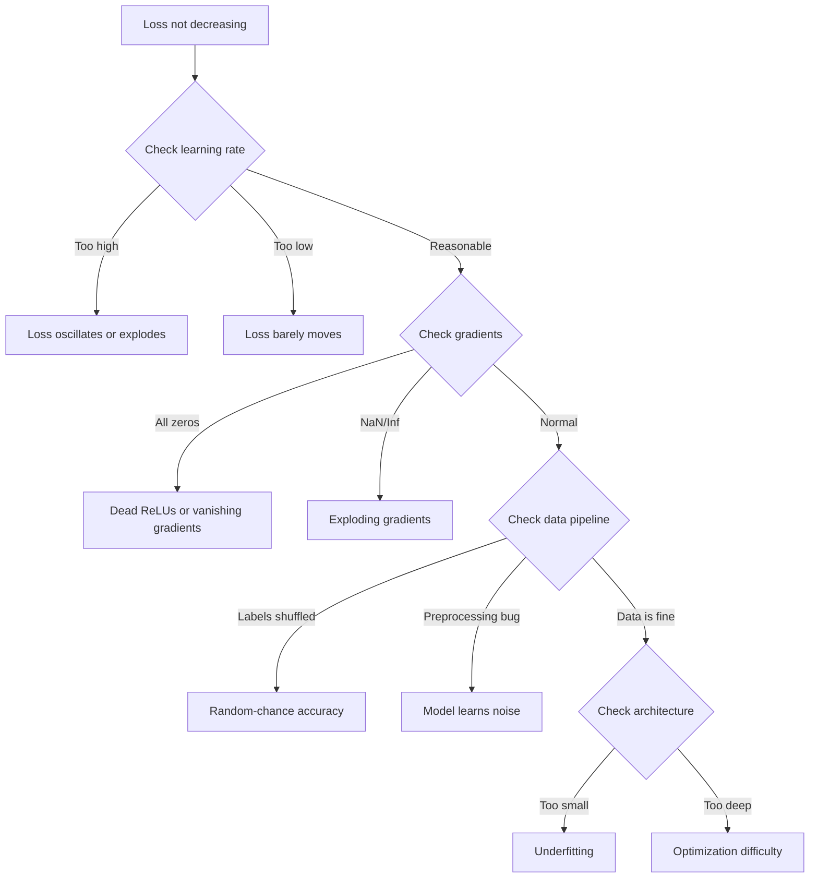
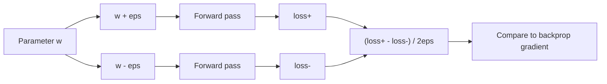
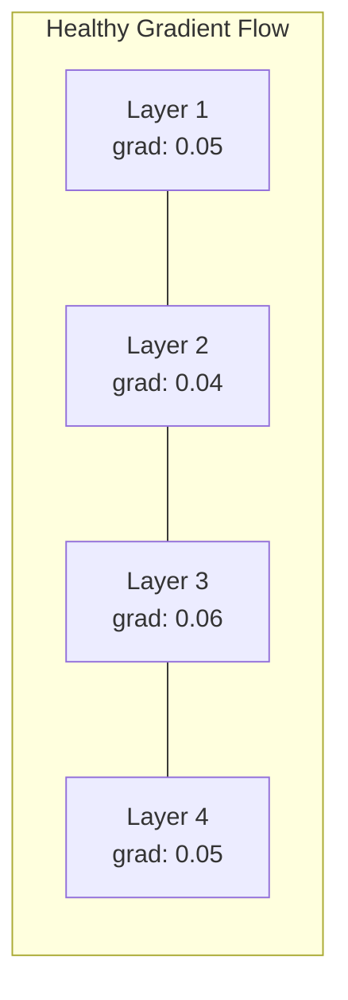
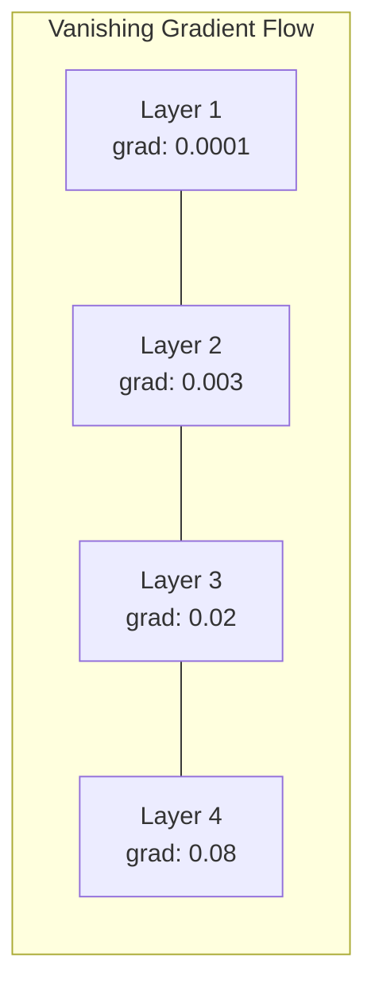
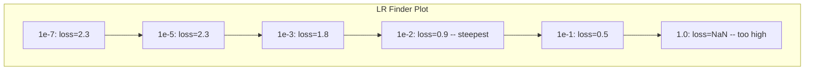

# 调试 Neural Networks

> 你的网络编译了。它运行了。它产生了一个数字。这个数字是错的，而且什么都没崩。欢迎来到最难的调试类型——没有错误信息的那一种。

**类型：** 练习
**语言：** Python, PyTorch
**先修：** Phase 03 Lessons 01-10（尤其是 backpropagation、loss functions、optimizers）
**时间：** 约 90 分钟

## 学习目标

- 使用系统化调试策略诊断常见 neural network failures（NaN loss、flat loss curve、overfitting、oscillation）
- 应用“overfit one batch”技术，验证 model architecture 和 training loop 正确
- 检查 gradient magnitudes、activation distributions 和 weight norms，以识别 vanishing/exploding gradient problems
- 构建覆盖 data pipeline、model architecture、loss function、optimizer 和 learning rate 问题的 debugging checklist

## 问题

传统软件坏了会崩。null pointer 会抛 exception。type mismatch 会在编译时报错。off-by-one error 会产生明显错误的输出。

神经网络不给你这种奢侈。

坏掉的神经网络会运行到结束，打印一个 loss value，并输出 predictions。loss 可能下降。predictions 可能看起来合理。但模型在悄悄地错——学习 shortcuts、记住噪声，或收敛到无用的 local minimum。Google 研究人员估计，60-70% 的 ML debugging 时间花在“silent” bugs 上：它们不产生错误，却降低 model quality。

可工作的模型和坏掉的模型之间，经常只差一行放错的位置：漏掉的 `zero_grad()`、转置的维度、差了 10 倍的 learning rate。经典文章 "Recipe for Training Neural Networks"（2019）开篇就说：“最常见的 neural net mistakes 是不会崩溃的 bugs。”

本课教你找到这些 bugs。

## 概念

### Debugging Mindset

忘掉 print-and-pray debugging。神经网络调试需要系统方法，因为反馈循环很慢（每次训练几分钟到几小时），症状也模糊（bad loss 可能意味着 20 种不同问题）。

黄金规则：**从简单开始，一次只增加一块复杂度，并独立验证每一块。**



### 症状 1：Loss 不下降

这是最常见的抱怨。training loop 在跑，epochs 在推进，但 loss 保持平坦或剧烈震荡。

**Learning rate 错了。** 太高：loss 震荡或跳到 NaN。太低：loss 降得太慢，看起来像没动。Adam 从 1e-3 开始。SGD 从 1e-1 或 1e-2 开始。在断定其他地方有问题之前，总是尝试跨度为 10x 的 3 个 learning rates（例如 1e-2、1e-3、1e-4）。

**Dead ReLUs。** 如果 ReLU 神经元接收很大的负输入，它输出 0，gradient 也是 0。它再也不会激活。如果死掉的神经元足够多，网络就学不动。检查方法：打印每个 ReLU layer 后 activation 正好为 0 的比例。如果 >50% dead，切换到 LeakyReLU 或降低 learning rate。

**Vanishing gradients。** 在使用 sigmoid 或 tanh activations 的深层网络中，gradients 在反向传播时会指数级缩小。到达第一层时，它们约等于 0。前几层停止学习。修复：使用 ReLU/GELU、添加 residual connections，或使用 batch normalization。

**Exploding gradients。** 相反的问题——gradients 指数级增长。常见于 RNNs 和很深的网络。loss 跳到 NaN。修复：gradient clipping（`torch.nn.utils.clip_grad_norm_`）、降低 learning rate，或添加 normalization。

### 症状 2：Loss 下降但模型很差

loss 在下降。training accuracy 到 99%。但 test accuracy 是 55%。或者模型在真实数据上输出胡言乱语。

**Overfitting。** 模型记住训练数据，而不是学习模式。training 和 validation loss 之间的 gap 随时间扩大。修复：更多数据、dropout、weight decay、early stopping、data augmentation。

**Data leakage。** test data 泄漏进 training。accuracy 高得可疑。常见原因：split 前 shuffle、用全数据集统计量做 preprocessing、splits 之间有重复样本。修复：先 split，再 preprocess，检查 duplicates。

**Label errors。** 大多数真实数据集中有 5-10% labels 是错的（Northcutt et al., 2021——"Pervasive Label Errors in Test Sets"）。模型会学习噪声。修复：使用 confident learning 找出并修正 mislabeled examples，或使用 loss truncation 忽略 high-loss samples。

### 症状 3：Loss 中出现 NaN 或 Inf

loss value 变成 `nan` 或 `inf`。训练已经死了。

**Learning rate 太高。** Gradient updates overshoot 太远，导致 weights 爆炸。修复：降低 10 倍。

**log(0) 或 log(negative)。** Cross-entropy loss 会计算 `log(p)`。如果模型输出精确 0 或负概率，log 会爆。修复：把 predictions clamp 到 `[eps, 1-eps]`，其中 `eps=1e-7`。

**Division by zero。** Batch normalization 会除以 standard deviation。常量 batch 的 std=0。修复：分母中加入 epsilon（PyTorch 默认会做，但自定义实现可能没有）。

**Numerical overflow。** 很大的 activations 传入 `exp()` 会产生 Inf。Softmax 特别容易。修复：指数化前先减去最大值（log-sum-exp trick）。

### 技术 1：Gradient Checking

把 analytical gradients（来自 backprop）与 numerical gradients（来自 finite differences）比较。如果不一致，你的 backward pass 有 bug。

参数 `w` 的 numerical gradient：

```
grad_numerical = (loss(w + eps) - loss(w - eps)) / (2 * eps)
```

一致性指标（relative difference）：

```
rel_diff = |grad_analytical - grad_numerical| / max(|grad_analytical|, |grad_numerical|, 1e-8)
```

如果 `rel_diff < 1e-5`：正确。如果 `rel_diff > 1e-3`：几乎肯定有 bug。



### 技术 2：Activation Statistics

训练期间监控每层之后 activations 的 mean 和 standard deviation。健康网络会保持 activations 的 mean 接近 0、std 接近 1（normalization 后），或至少保持有界。

| 健康指标 | Mean | Std | 诊断 |
|----------|------|-----|------|
| Healthy | ~0 | ~1 | 网络正常学习 |
| Saturated | >>0 或 <<0 | ~0 | Activations 卡在极端值 |
| Dead | 0 | 0 | 神经元死亡（全 0） |
| Exploding | >>10 | >>10 | Activations 无界增长 |

### 技术 3：Gradient Flow Visualization

绘制每一层的平均 gradient magnitude。在健康网络中，各层 gradient magnitudes 应该大致相近。如果早期层 gradients 比后期层小 1000 倍，你就有 vanishing gradients。





### 技术 4：Overfit-One-Batch Test

deep learning 中最重要的单个调试技术。

取一个小 batch（8-32 个样本）。在它上面训练 100+ iterations。loss 应该接近 0，training accuracy 应该达到 100%。如果不能，说明你的 model 或 training loop 有基础 bug——不要继续完整训练。

这个测试能抓出：
- 损坏的 loss functions
- 损坏的 backward passes
- 架构太小，无法表示数据
- Optimizer 没有连接到 model parameters
- Data 和 labels 错位

它只需 30 秒，却能节省数小时 full training runs 的调试时间。

### 技术 5：Learning Rate Finder

Leslie Smith（2017）提出：在一个 epoch 中把 learning rate 从很小（1e-7）扫到很大（10），并记录 loss。绘制 loss vs learning rate。最佳 learning rate 大约比 loss 开始最快下降的位置小 10 倍。



这个例子中的最佳 LR：约 1e-3（最陡点前一个数量级）。

### 常见 PyTorch Bugs

这些是 PyTorch 社区集体浪费最多时间的 bugs：

| Bug | 症状 | 修复 |
|-----|------|------|
| 忘记 `optimizer.zero_grad()` | Gradients 跨 batches 累积，loss 震荡 | 在 `loss.backward()` 前添加 `optimizer.zero_grad()` |
| 测试时忘记 `model.eval()` | Dropout 和 batch norm 行为不同，test accuracy 每次变化 | 添加 `model.eval()` 和 `torch.no_grad()` |
| Tensor shapes 错误 | Silent broadcasting 产生错误结果且不报错 | 调试时在每个 operation 后打印 shapes |
| CPU/GPU mismatch | `RuntimeError: expected CUDA tensor` | 对 model 和 data 都使用 `.to(device)` |
| 没有 detach tensors | Computation graph 永久增长，OOM | 使用 `.detach()` 或 `with torch.no_grad()` |
| In-place operations 破坏 autograd | `RuntimeError: modified by in-place operation` | 用 `x = x + 1` 替换 `x += 1` |
| Data 未归一化 | Loss 卡在随机水平 | 把 inputs 归一化为 mean=0, std=1 |
| Labels dtype 错误 | Cross-entropy 期待 `Long`，得到 `Float` | 转换 labels：`labels.long()` |

### Master Debugging Table

| 症状 | 可能原因 | 第一件要尝试的事 |
|------|----------|------------------|
| Loss 卡在 -log(1/num_classes) | Model 预测 uniform distribution | 检查 data pipeline，验证 labels 匹配 inputs |
| Loss 几步后 NaN | Learning rate 太高 | LR 降低 10 倍 |
| Loss 立刻 NaN | log(0) 或 division by zero | 给 log/division operations 添加 epsilon |
| Loss 剧烈震荡 | LR 太高或 batch size 太小 | 降低 LR，增大 batch size |
| Loss 下降后 plateau | LR 对 fine-tuning 阶段太高 | 添加 LR schedule（cosine 或 step decay） |
| Training acc 高，test acc 低 | Overfitting | 添加 dropout、weight decay、更多数据 |
| Training acc = test acc = chance | Model 完全没学到东西 | 运行 overfit-one-batch test |
| Training acc = test acc 但都低 | Underfitting | 更大 model、更多 layers、更多 features |
| Gradients 全 0 | Dead ReLUs 或 detached computation graph | 切换到 LeakyReLU，检查 `.requires_grad` |
| 训练中 out of memory | Batch 太大或 graph 未释放 | 降低 batch size，eval 用 `torch.no_grad()` |

## 构建

一个监控 activations、gradients 和 loss curves 的 diagnostic toolkit。你会故意破坏网络，并用 toolkit 诊断每个问题。

### Step 1: The NetworkDebugger Class

挂到 PyTorch model 上，记录每层 activation 和 gradient statistics。

```python
import torch
import torch.nn as nn
import math


class NetworkDebugger:
    def __init__(self, model):
        self.model = model
        self.activation_stats = {}
        self.gradient_stats = {}
        self.loss_history = []
        self.lr_losses = []
        self.hooks = []
        self._register_hooks()

    def _register_hooks(self):
        for name, module in self.model.named_modules():
            if isinstance(module, (nn.Linear, nn.Conv2d, nn.ReLU, nn.LeakyReLU)):
                hook = module.register_forward_hook(self._make_activation_hook(name))
                self.hooks.append(hook)
                hook = module.register_full_backward_hook(self._make_gradient_hook(name))
                self.hooks.append(hook)

    def _make_activation_hook(self, name):
        def hook(module, input, output):
            with torch.no_grad():
                out = output.detach().float()
                self.activation_stats[name] = {
                    "mean": out.mean().item(),
                    "std": out.std().item(),
                    "fraction_zero": (out == 0).float().mean().item(),
                    "min": out.min().item(),
                    "max": out.max().item(),
                }
        return hook

    def _make_gradient_hook(self, name):
        def hook(module, grad_input, grad_output):
            if grad_output[0] is not None:
                with torch.no_grad():
                    grad = grad_output[0].detach().float()
                    self.gradient_stats[name] = {
                        "mean": grad.mean().item(),
                        "std": grad.std().item(),
                        "abs_mean": grad.abs().mean().item(),
                        "max": grad.abs().max().item(),
                    }
        return hook

    def record_loss(self, loss_value):
        self.loss_history.append(loss_value)

    def check_loss_health(self):
        if len(self.loss_history) < 2:
            return "NOT_ENOUGH_DATA"
        recent = self.loss_history[-10:]
        if any(math.isnan(v) or math.isinf(v) for v in recent):
            return "NAN_OR_INF"
        if len(self.loss_history) >= 20:
            first_half = sum(self.loss_history[:10]) / 10
            second_half = sum(self.loss_history[-10:]) / 10
            if second_half >= first_half * 0.99:
                return "NOT_DECREASING"
        if len(recent) >= 5:
            diffs = [recent[i+1] - recent[i] for i in range(len(recent)-1)]
            if max(diffs) - min(diffs) > 2 * abs(sum(diffs) / len(diffs)):
                return "OSCILLATING"
        return "HEALTHY"

    def check_activations(self):
        issues = []
        for name, stats in self.activation_stats.items():
            if stats["fraction_zero"] > 0.5:
                issues.append(f"DEAD_NEURONS: {name} has {stats['fraction_zero']:.0%} zero activations")
            if abs(stats["mean"]) > 10:
                issues.append(f"EXPLODING_ACTIVATIONS: {name} mean={stats['mean']:.2f}")
            if stats["std"] < 1e-6:
                issues.append(f"COLLAPSED_ACTIVATIONS: {name} std={stats['std']:.2e}")
        return issues if issues else ["HEALTHY"]

    def check_gradients(self):
        issues = []
        grad_magnitudes = []
        for name, stats in self.gradient_stats.items():
            grad_magnitudes.append((name, stats["abs_mean"]))
            if stats["abs_mean"] < 1e-7:
                issues.append(f"VANISHING_GRADIENT: {name} abs_mean={stats['abs_mean']:.2e}")
            if stats["abs_mean"] > 100:
                issues.append(f"EXPLODING_GRADIENT: {name} abs_mean={stats['abs_mean']:.2e}")
        if len(grad_magnitudes) >= 2:
            first_mag = grad_magnitudes[0][1]
            last_mag = grad_magnitudes[-1][1]
            if last_mag > 0 and first_mag / last_mag > 100:
                issues.append(f"GRADIENT_RATIO: first/last = {first_mag/last_mag:.0f}x (vanishing)")
        return issues if issues else ["HEALTHY"]

    def print_report(self):
        print("\n=== NETWORK DEBUGGER REPORT ===")
        print(f"\nLoss health: {self.check_loss_health()}")
        if self.loss_history:
            print(f"  Last 5 losses: {[f'{v:.4f}' for v in self.loss_history[-5:]]}")
        print("\nActivation diagnostics:")
        for item in self.check_activations():
            print(f"  {item}")
        print("\nGradient diagnostics:")
        for item in self.check_gradients():
            print(f"  {item}")
        print("\nPer-layer activation stats:")
        for name, stats in self.activation_stats.items():
            print(f"  {name}: mean={stats['mean']:.4f} std={stats['std']:.4f} zero={stats['fraction_zero']:.1%}")
        print("\nPer-layer gradient stats:")
        for name, stats in self.gradient_stats.items():
            print(f"  {name}: abs_mean={stats['abs_mean']:.2e} max={stats['max']:.2e}")

    def remove_hooks(self):
        for hook in self.hooks:
            hook.remove()
        self.hooks.clear()
```

### Step 2: The Overfit-One-Batch Test

```python
def overfit_one_batch(model, x_batch, y_batch, criterion, lr=0.01, steps=200):
    optimizer = torch.optim.Adam(model.parameters(), lr=lr)
    model.train()
    print("\n=== OVERFIT ONE BATCH TEST ===")
    print(f"Batch size: {x_batch.shape[0]}, Steps: {steps}")

    for step in range(steps):
        optimizer.zero_grad()
        output = model(x_batch)
        loss = criterion(output, y_batch)
        loss.backward()
        optimizer.step()

        if step % 50 == 0 or step == steps - 1:
            with torch.no_grad():
                preds = (output > 0).float() if output.shape[-1] == 1 else output.argmax(dim=1)
                targets = y_batch if y_batch.dim() == 1 else y_batch.squeeze()
                acc = (preds.squeeze() == targets).float().mean().item()
            print(f"  Step {step:3d} | Loss: {loss.item():.6f} | Accuracy: {acc:.1%}")

    final_loss = loss.item()
    if final_loss > 0.1:
        print(f"\n  FAIL: Loss did not converge ({final_loss:.4f}). Model or training loop is broken.")
        return False
    print(f"\n  PASS: Loss converged to {final_loss:.6f}")
    return True
```

### Step 3: Learning Rate Finder

```python
def find_learning_rate(model, x_data, y_data, criterion, start_lr=1e-7, end_lr=10, steps=100):
    import copy
    original_state = copy.deepcopy(model.state_dict())
    optimizer = torch.optim.SGD(model.parameters(), lr=start_lr)
    lr_mult = (end_lr / start_lr) ** (1 / steps)

    model.train()
    results = []
    best_loss = float("inf")
    current_lr = start_lr

    print("\n=== LEARNING RATE FINDER ===")

    for step in range(steps):
        optimizer.zero_grad()
        output = model(x_data)
        loss = criterion(output, y_data)

        if math.isnan(loss.item()) or loss.item() > best_loss * 10:
            break

        best_loss = min(best_loss, loss.item())
        results.append((current_lr, loss.item()))

        loss.backward()
        optimizer.step()

        current_lr *= lr_mult
        for param_group in optimizer.param_groups:
            param_group["lr"] = current_lr

    model.load_state_dict(original_state)

    if len(results) < 10:
        print("  Could not complete LR sweep -- loss diverged too quickly")
        return results

    min_loss_idx = min(range(len(results)), key=lambda i: results[i][1])
    suggested_lr = results[max(0, min_loss_idx - 10)][0]

    print(f"  Swept {len(results)} steps from {start_lr:.0e} to {results[-1][0]:.0e}")
    print(f"  Minimum loss {results[min_loss_idx][1]:.4f} at lr={results[min_loss_idx][0]:.2e}")
    print(f"  Suggested learning rate: {suggested_lr:.2e}")

    return results
```

### Step 4: Gradient Checker

```python
def _flat_to_multi_index(flat_idx, shape):
    multi_idx = []
    remaining = flat_idx
    for dim in reversed(shape):
        multi_idx.insert(0, remaining % dim)
        remaining //= dim
    return tuple(multi_idx)


def gradient_check(model, x, y, criterion, eps=1e-4):
    model.train()
    x_double = x.double()
    y_double = y.double()
    model_double = model.double()

    print("\n=== GRADIENT CHECK ===")
    overall_max_diff = 0
    checked = 0

    for name, param in model_double.named_parameters():
        if not param.requires_grad:
            continue

        layer_max_diff = 0

        model_double.zero_grad()
        output = model_double(x_double)
        loss = criterion(output, y_double)
        loss.backward()
        analytical_grad = param.grad.clone()

        num_checks = min(5, param.numel())
        for i in range(num_checks):
            idx = _flat_to_multi_index(i, param.shape)
            original = param.data[idx].item()

            param.data[idx] = original + eps
            with torch.no_grad():
                loss_plus = criterion(model_double(x_double), y_double).item()

            param.data[idx] = original - eps
            with torch.no_grad():
                loss_minus = criterion(model_double(x_double), y_double).item()

            param.data[idx] = original

            numerical = (loss_plus - loss_minus) / (2 * eps)
            analytical = analytical_grad[idx].item()

            denom = max(abs(numerical), abs(analytical), 1e-8)
            rel_diff = abs(numerical - analytical) / denom

            layer_max_diff = max(layer_max_diff, rel_diff)
            checked += 1

        overall_max_diff = max(overall_max_diff, layer_max_diff)
        status = "OK" if layer_max_diff < 1e-5 else "MISMATCH"
        print(f"  {name}: max_rel_diff={layer_max_diff:.2e} [{status}]")

    model.float()

    print(f"\n  Checked {checked} parameters")
    if overall_max_diff < 1e-5:
        print("  PASS: Gradients match (rel_diff < 1e-5)")
    elif overall_max_diff < 1e-3:
        print("  WARN: Small differences (1e-5 < rel_diff < 1e-3)")
    else:
        print("  FAIL: Gradient mismatch detected (rel_diff > 1e-3)")
    return overall_max_diff
```

### Step 5: Deliberately Broken Networks

现在把 toolkit 应用到坏掉的网络上，并诊断每个问题。

```python
def demo_broken_networks():
    torch.manual_seed(42)
    x = torch.randn(64, 10)
    y = (x[:, 0] > 0).long()

    print("\n" + "=" * 60)
    print("BUG 1: Learning rate too high (lr=10)")
    print("=" * 60)
    model1 = nn.Sequential(nn.Linear(10, 32), nn.ReLU(), nn.Linear(32, 2))
    debugger1 = NetworkDebugger(model1)
    optimizer1 = torch.optim.SGD(model1.parameters(), lr=10.0)
    criterion = nn.CrossEntropyLoss()
    for step in range(20):
        optimizer1.zero_grad()
        out = model1(x)
        loss = criterion(out, y)
        debugger1.record_loss(loss.item())
        loss.backward()
        optimizer1.step()
    debugger1.print_report()
    debugger1.remove_hooks()

    print("\n" + "=" * 60)
    print("BUG 2: Dead ReLUs from bad initialization")
    print("=" * 60)
    model2 = nn.Sequential(nn.Linear(10, 32), nn.ReLU(), nn.Linear(32, 32), nn.ReLU(), nn.Linear(32, 2))
    with torch.no_grad():
        for m in model2.modules():
            if isinstance(m, nn.Linear):
                m.weight.fill_(-1.0)
                m.bias.fill_(-5.0)
    debugger2 = NetworkDebugger(model2)
    optimizer2 = torch.optim.Adam(model2.parameters(), lr=1e-3)
    for step in range(50):
        optimizer2.zero_grad()
        out = model2(x)
        loss = criterion(out, y)
        debugger2.record_loss(loss.item())
        loss.backward()
        optimizer2.step()
    debugger2.print_report()
    debugger2.remove_hooks()

    print("\n" + "=" * 60)
    print("BUG 3: Missing zero_grad (gradients accumulate)")
    print("=" * 60)
    model3 = nn.Sequential(nn.Linear(10, 32), nn.ReLU(), nn.Linear(32, 2))
    debugger3 = NetworkDebugger(model3)
    optimizer3 = torch.optim.SGD(model3.parameters(), lr=0.01)
    for step in range(50):
        out = model3(x)
        loss = criterion(out, y)
        debugger3.record_loss(loss.item())
        loss.backward()
        optimizer3.step()
    debugger3.print_report()
    debugger3.remove_hooks()

    print("\n" + "=" * 60)
    print("HEALTHY NETWORK: Correct setup for comparison")
    print("=" * 60)
    model_good = nn.Sequential(nn.Linear(10, 32), nn.ReLU(), nn.Linear(32, 2))
    debugger_good = NetworkDebugger(model_good)
    optimizer_good = torch.optim.Adam(model_good.parameters(), lr=1e-3)
    for step in range(50):
        optimizer_good.zero_grad()
        out = model_good(x)
        loss = criterion(out, y)
        debugger_good.record_loss(loss.item())
        loss.backward()
        optimizer_good.step()
    debugger_good.print_report()
    debugger_good.remove_hooks()

    print("\n" + "=" * 60)
    print("OVERFIT-ONE-BATCH TEST (healthy model)")
    print("=" * 60)
    model_test = nn.Sequential(nn.Linear(10, 32), nn.ReLU(), nn.Linear(32, 2))
    overfit_one_batch(model_test, x[:8], y[:8], criterion)

    print("\n" + "=" * 60)
    print("LEARNING RATE FINDER")
    print("=" * 60)
    model_lr = nn.Sequential(nn.Linear(10, 32), nn.ReLU(), nn.Linear(32, 2))
    find_learning_rate(model_lr, x, y, criterion)

    print("\n" + "=" * 60)
    print("GRADIENT CHECK")
    print("=" * 60)
    model_grad = nn.Sequential(nn.Linear(10, 8), nn.ReLU(), nn.Linear(8, 2))
    gradient_check(model_grad, x[:4], y[:4], criterion)
```

## 使用

### PyTorch Built-in Tools

```python
import torch
import torch.nn as nn

model = nn.Sequential(
    nn.Linear(768, 256),
    nn.ReLU(),
    nn.Linear(256, 10),
)

with torch.autograd.detect_anomaly():
    output = model(input_tensor)
    loss = criterion(output, target)
    loss.backward()

for name, param in model.named_parameters():
    if param.grad is not None:
        print(f"{name}: grad_mean={param.grad.abs().mean():.2e}")
```

### Weights & Biases Integration

```python
import wandb

wandb.init(project="debug-training")

for epoch in range(100):
    loss = train_one_epoch()
    wandb.log({
        "loss": loss,
        "lr": optimizer.param_groups[0]["lr"],
        "grad_norm": torch.nn.utils.clip_grad_norm_(model.parameters(), float("inf")),
    })

    for name, param in model.named_parameters():
        if param.grad is not None:
            wandb.log({f"grad/{name}": wandb.Histogram(param.grad.cpu().numpy())})
```

### TensorBoard

```python
from torch.utils.tensorboard import SummaryWriter

writer = SummaryWriter("runs/debug_experiment")

for epoch in range(100):
    loss = train_one_epoch()
    writer.add_scalar("Loss/train", loss, epoch)

    for name, param in model.named_parameters():
        writer.add_histogram(f"weights/{name}", param, epoch)
        if param.grad is not None:
            writer.add_histogram(f"gradients/{name}", param.grad, epoch)
```

### Debug Checklist（完整训练之前）

1. 运行 overfit-one-batch test。如果失败，停止。
2. 打印 model summary——验证 parameter count 合理。
3. 用随机数据跑一次 forward pass——检查 output shape。
4. 训练 5 epochs——验证 loss 下降。
5. 检查 activation statistics——没有 dead layers，没有 explosions。
6. 检查 gradient flow——没有 vanishing，没有 exploding。
7. 验证 data pipeline——打印 5 个带 labels 的随机样本。

## 交付

本课会产出：
- `outputs/prompt-nn-debugger.md`——用于诊断 neural network training failures 的 prompt
- `outputs/skill-debug-checklist.md`——用于调试 training issues 的 decision-tree checklist

调试部署的关键模式：
- 给生产 training scripts 添加 monitoring hooks
- 每 N steps 把 activation 和 gradient statistics 记录到 W&B 或 TensorBoard
- 为 NaN loss、dead neurons（>80% zero）或 gradient explosion 实现自动 alerts
- 每次修改 architectures 或 data pipelines 时，始终运行 overfit-one-batch test

## 练习

1. **添加 exploding gradient detector。** 修改 `NetworkDebugger`，检测 gradients 超过阈值的情况，并自动建议 gradient clipping value。在一个没有 normalization 的 20 层网络上测试。

2. **构建 dead neuron resurrector。** 写一个函数，识别 dead ReLU neurons（永远输出 0），并用 Kaiming initialization 重新初始化它们的 incoming weights。展示这可以恢复一个 >70% 神经元死亡的网络。

3. **实现带绘图的 learning rate finder。** 扩展 `find_learning_rate`，把结果保存成 CSV，并写一个独立脚本读取 CSV，用 matplotlib 显示 LR vs loss curve。为 CIFAR-10 上的 ResNet-18 识别最佳 LR。

4. **创建 data pipeline validator。** 写一个函数检查：train/test splits 中的重复样本、label distribution imbalance（>10:1 ratio）、input normalization（mean 接近 0、std 接近 1），以及 data 中的 NaN/Inf values。在故意污染的数据集上运行它。

5. **调试真实 failure。** 拿 Lesson 10 的 mini-framework，引入一个隐蔽 bug（例如在 backward 中转置 weight matrix），并用 gradient checking 精确定位哪个参数的 gradients 不正确。记录 debugging process。

## 关键术语

| 术语 | 人们常说 | 实际含义 |
|------|----------|----------|
| Silent bug | “它能跑，但结果差” | 不产生错误却降低 model quality 的 bug——ML 中最主要的 failure mode |
| Dead ReLU | “神经元死了” | 输入总是为负的 ReLU 神经元，因此输出 0，并永久接收 0 gradient |
| Vanishing gradients | “早期层停止学习” | gradients 穿过层时指数级缩小，使早期层 weights 实际冻结 |
| Exploding gradients | “Loss 变成 NaN” | gradients 穿过层时指数级增长，造成过大的 weight updates 并 overflow |
| Gradient checking | “验证 backprop 是否正确” | 比较 backprop 得到的 analytical gradients 与 finite differences 得到的 numerical gradients |
| Overfit-one-batch | “最重要的调试测试” | 在单个小 batch 上训练，验证 model 是否能学会——如果不能，说明有基础问题 |
| LR finder | “扫描寻找正确 learning rate” | 在一个 epoch 中指数增大 learning rate，并选择 loss 发散前的 rate |
| Data leakage | “Test data 泄漏进 training” | test set 信息污染 training，产生虚高 accuracy |
| Activation statistics | “监控 layer health” | 跟踪每层 output 的 mean、std 和 zero-fraction，以检测 dead、saturated 或 exploding neurons |
| Gradient clipping | “限制 gradient magnitude” | 当 gradients 的 norm 超过阈值时缩小它们，防止 exploding gradient updates |

## 延伸阅读

- Smith, "Cyclical Learning Rates for Training Neural Networks" (2017)——介绍 learning rate range test（LR finder）的论文
- Northcutt et al., "Pervasive Label Errors in Test Sets Destabilize Machine Learning Benchmarks" (2021)——展示 ImageNet、CIFAR-10 等主要 benchmarks 中有 3-6% labels 是错的
- Zhang et al., "Understanding Deep Learning Requires Rethinking Generalization" (2017)——展示 neural networks 可以记住随机 labels 的论文，这也是 overfit-one-batch test 有效的原因
- PyTorch documentation on `torch.autograd.detect_anomaly` and `torch.autograd.set_detect_anomaly` for built-in NaN/Inf detection
