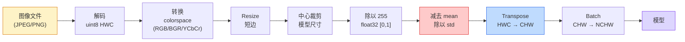
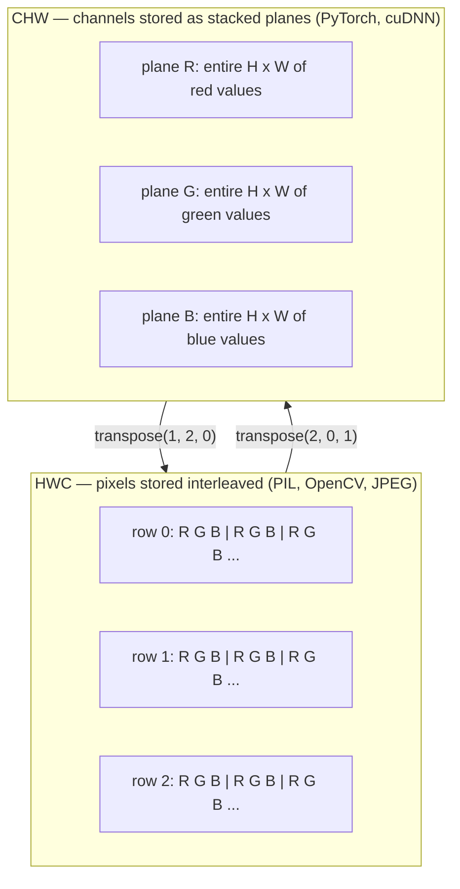

# 图像基础：像素、通道与色彩空间

> 图像是由光样本组成的张量。你将来用到的每一个视觉模型，都从这个事实开始。

**类型：** 构建
**语言：** Python
**前置要求：** 阶段 1 第 12 课（张量操作），阶段 3 第 11 课（PyTorch 入门）
**时间：** ~45 分钟

## 学习目标

- 解释连续场景如何被离散化为像素，以及为什么采样和量化决策会决定所有下游模型的上限
- 将图像作为 NumPy 数组读取、切片和检查，并在 HWC 与 CHW 布局之间熟练切换
- 在 RGB、灰度、HSV 和 YCbCr 之间转换，并说明每种色彩空间存在的原因
- 按照 torchvision 的预期，准确执行像素级预处理（normalize、standardize、resize、channel-first）

## 问题

你会阅读的每篇论文、下载的每个预训练权重、调用的每个视觉 API，都会假设输入采用某种特定编码。把 `uint8` 图像传给需要 `float32` 的模型，它仍然会运行，但会悄悄产出垃圾结果。把 BGR 喂给在 RGB 上训练的网络，准确率可能直接掉十个百分点。把 channels-last 输入交给期望 channels-first 的模型，第一层 conv 会把高度当成 feature channel。这些都不会报错，只会毁掉指标，然后你花一周追一个其实藏在文件加载方式里的 bug。

一旦你知道 convolution 在什么东西上滑动，它本身并不复杂。难点在于，“一张图像”对相机、JPEG 解码器、PIL、OpenCV、torchvision 和 CUDA kernel 来说含义并不相同。每个栈都有自己的轴顺序、字节范围和通道约定。不能把这些区别记清楚的视觉工程师，会交付坏掉的 pipeline。

本课会把地基铺好，让本阶段后面的内容可以建立在它之上。到最后，你会知道像素是什么，为什么每个像素有三个数字而不是一个，“用 ImageNet stats normalize”到底做了什么，以及如何在本阶段后续每节课都会默认使用的两三种布局之间移动。

## 概念

### 完整预处理流程一览

每个生产级视觉系统都是同一串可逆变换。只要一步错了，模型看到的输入就和训练时不同。



红色和蓝色的两个框，是 80% 静默失败发生的地方：漏掉 standardization，以及布局错误。

### 像素是样本，不是小方块

相机传感器会统计落在一格格微小探测器上的光子。每个探测器在很短时间内积分光线，并输出一个与命中光子数量成比例的电压。传感器随后把这个电压离散化为整数。一个探测器就变成一个像素。

```
连续场景                        传感器网格                     数字图像
（无限细节）                    (H x W 探测器)                 (H x W 整数)

    ~~~~~                        +--+--+--+--+--+                 210 198 180 155 120
   ~   ~   ~                     |  |  |  |  |  |                 205 195 178 152 118
  ~ light ~      ---->           +--+--+--+--+--+     ---->       200 190 175 150 115
   ~~~~~                         |  |  |  |  |  |                 195 185 170 148 112
                                 +--+--+--+--+--+                 188 180 165 145 108
```

这一步会发生两个选择，并且它们会固定后续一切的上限：

- **空间采样** 决定场景中每一度视角对应多少探测器。太少，边缘会变锯齿（aliasing）。太多，存储和计算会爆炸。
- **强度量化** 决定电压被分桶得多细。8 bit 给出 256 个级别，是显示领域的标准。10、12、16 bit 能给出更平滑的梯度，对医学影像、HDR 和 raw sensor pipeline 很重要。

像素不是带面积的彩色方块。它是一次单点测量。当你 resize 或旋转图像时，你是在对这个测量网格重新采样。

### 为什么有三个通道

一个探测器会统计整个可见光谱上的光子，这就是灰度。为了得到颜色，传感器会用红、绿、蓝滤光片组成的马赛克覆盖网格。经过 demosaicing 之后，每个空间位置都有三个整数：附近红色滤光探测器、绿色滤光探测器和蓝色滤光探测器的响应。这三个整数就是一个像素的 RGB 三元组。

```
内存里的一个像素：

    (R, G, B) = (210, 140, 30)   <- reddish-orange

一张 H x W RGB 图像：

    shape (H, W, 3)     存储方式为 H 行，每行 W 个像素，每个像素 3 个值
                        uint8 时每个值都在 [0, 255] 内
```

三并不神奇。深度相机会添加 Z 通道。卫星会添加红外和紫外波段。医学扫描通常有一个通道（X-ray、CT）或很多通道（hyperspectral）。通道数是最后一个轴；conv 层会学习跨通道混合。

### 两种布局约定：HWC 和 CHW

同一个张量，两种顺序。每个库都会选一种。

```
HWC (height, width, channels)           CHW (channels, height, width)

   W ->                                    H ->
  +-----+-----+-----+                     +-----+-----+
H |R G B|R G B|R G B|                   C |R R R R R R|
| +-----+-----+-----+                   | +-----+-----+
v |R G B|R G B|R G B|                   v |G G G G G G|
  +-----+-----+-----+                     +-----+-----+
                                          |B B B B B B|
                                          +-----+-----+

   PIL、OpenCV、matplotlib、             PyTorch、多数 deep learning
   几乎所有磁盘上的图像文件              框架、cuDNN kernels
```

CHW 存在的原因是 convolution kernel 会在 H 和 W 上滑动。把通道轴放在前面，意味着每个 kernel 都能看到每个通道上一整块连续的 2D 平面，从而更容易向量化。磁盘格式使用 HWC，是因为它匹配传感器输出 scanline 的方式。

你会敲上千遍的单行转换：

```
img_chw = img_hwc.transpose(2, 0, 1)      # NumPy
img_chw = img_hwc.permute(2, 0, 1)        # PyTorch tensor
```

内存布局的可视化：



### 字节范围与 dtype

有三种约定最常见：

| 约定 | dtype | 范围 | 你会在哪里看到 |
|------------|-------|-------|------------------|
| Raw | `uint8` | [0, 255] | 磁盘文件、PIL、OpenCV 输出 |
| Normalized | `float32` | [0.0, 1.0] | `img.astype('float32') / 255` 之后 |
| Standardized | `float32` | 大约 [-2, +2] | 减去 mean 并除以 std 之后 |

卷积网络是在 standardized 输入上训练的。ImageNet stats `mean=[0.485, 0.456, 0.406]`、`std=[0.229, 0.224, 0.225]` 是在完整 ImageNet 训练集上，对 [0, 1] normalized 像素的三个通道计算出的算术均值和标准差。把 raw `uint8` 喂给期望 standardized float 的模型，是应用视觉中最常见的静默失败。

### 色彩空间以及它们存在的原因

RGB 是采集格式，但它并不总是对模型最有用的表示。

```
 RGB               HSV                       YCbCr / YUV

 R red             H hue (angle 0-360)       Y luminance (brightness)
 G green           S saturation (0-1)        Cb chroma blue-yellow
 B blue            V value/brightness (0-1)  Cr chroma red-green

 线性对应          把颜色和亮度分开。        把亮度和颜色分开。
 传感器输出        对 color thresholding、   JPEG 和多数视频 codec 会更强地
                   UI sliders、简单滤镜     压缩 chroma 通道，因为人眼对
                   很有用                  chroma 细节没有对 Y 那么敏感。
```

对多数现代 CNN，你会喂 RGB。在这些场景里你会遇到其他空间：

- **HSV**：传统 CV 代码、基于颜色的 segmentation、white-balancing。
- **YCbCr**：读取 JPEG 内部、视频 pipeline、只在 Y 通道上工作的 super-resolution 模型。
- **Grayscale**：OCR、文档模型，以及任何颜色是干扰变量而不是信号的场景。

从 RGB 转灰度是加权和，不是平均值，因为人眼对绿色比对红色或蓝色更敏感：

```
Y = 0.299 R + 0.587 G + 0.114 B       (ITU-R BT.601, the classic weights)
```

### 宽高比、resize 与 interpolation

每个模型都有固定输入尺寸（多数 ImageNet 分类器是 224x224，现代 detector 常见 384x384 或 512x512）。你的图片很少刚好匹配。真正重要的 resize 选择有三种：

- **Resize 短边，然后 center crop**：标准 ImageNet 配方。保留宽高比，丢弃边缘的一条像素带。
- **Resize 并 pad**：保留宽高比和每个像素，添加黑边。检测和 OCR 的标准做法。
- **直接 resize 到目标尺寸**：拉伸图像。便宜，会扭曲几何形状，但对许多分类任务没问题。

当新网格和旧网格不对齐时，interpolation 方法决定中间像素如何计算：

```
Nearest neighbour     fastest, blocky, only choice for masks/labels
Bilinear              fast, smooth, default for most image resizing
Bicubic               slower, sharper on upscaling
Lanczos               slowest, best quality, used for final display
```

经验法则：训练用 bilinear，你要给人看的资产用 bicubic 或 lanczos，任何包含整数 class ID 的东西都用 nearest。

## 构建它

### 第 1 步：加载图像并检查 shape

使用 Pillow 加载任意 JPEG 或 PNG，转换为 NumPy，并打印你得到的东西。为了有一个离线可运行的确定性例子，我们合成一张图。

```python
import numpy as np
from PIL import Image

def synthetic_rgb(h=128, w=192, seed=0):
    rng = np.random.default_rng(seed)
    yy, xx = np.meshgrid(np.linspace(0, 1, h), np.linspace(0, 1, w), indexing="ij")
    r = (np.sin(xx * 6) * 0.5 + 0.5) * 255
    g = yy * 255
    b = (1 - yy) * xx * 255
    rgb = np.stack([r, g, b], axis=-1) + rng.normal(0, 6, (h, w, 3))
    return np.clip(rgb, 0, 255).astype(np.uint8)

arr = synthetic_rgb()
# Or load from disk:
# arr = np.asarray(Image.open("your_image.jpg").convert("RGB"))

print(f"type:   {type(arr).__name__}")
print(f"dtype:  {arr.dtype}")
print(f"shape:  {arr.shape}     # (H, W, C)")
print(f"min:    {arr.min()}")
print(f"max:    {arr.max()}")
print(f"pixel at (0, 0): {arr[0, 0]}")
```

期望输出：`shape: (H, W, 3)`、`dtype: uint8`、范围 `[0, 255]`。不管这些字节来自相机、JPEG 解码器还是合成生成器，这都是规范的磁盘表示。

### 第 2 步：拆分通道并重新排列布局

分别取出 R、G、B，然后从 HWC 转成 PyTorch 使用的 CHW。

```python
R = arr[:, :, 0]
G = arr[:, :, 1]
B = arr[:, :, 2]
print(f"R shape: {R.shape}, mean: {R.mean():.1f}")
print(f"G shape: {G.shape}, mean: {G.mean():.1f}")
print(f"B shape: {B.shape}, mean: {B.mean():.1f}")

arr_chw = arr.transpose(2, 0, 1)
print(f"\nHWC shape: {arr.shape}")
print(f"CHW shape: {arr_chw.shape}")
```

三个灰度平面，每个通道一个。CHW 只是重新排列轴；当内存布局允许时，严格来说甚至不需要复制数据。

### 第 3 步：灰度和 HSV 转换

先做加权和灰度，再手写 RGB 到 HSV。

```python
def rgb_to_grayscale(rgb):
    weights = np.array([0.299, 0.587, 0.114], dtype=np.float32)
    return (rgb.astype(np.float32) @ weights).astype(np.uint8)

def rgb_to_hsv(rgb):
    rgb_f = rgb.astype(np.float32) / 255.0
    r, g, b = rgb_f[..., 0], rgb_f[..., 1], rgb_f[..., 2]
    cmax = np.max(rgb_f, axis=-1)
    cmin = np.min(rgb_f, axis=-1)
    delta = cmax - cmin

    h = np.zeros_like(cmax)
    mask = delta > 0
    rmax = mask & (cmax == r)
    gmax = mask & (cmax == g)
    bmax = mask & (cmax == b)
    h[rmax] = ((g[rmax] - b[rmax]) / delta[rmax]) % 6
    h[gmax] = ((b[gmax] - r[gmax]) / delta[gmax]) + 2
    h[bmax] = ((r[bmax] - g[bmax]) / delta[bmax]) + 4
    h = h * 60.0

    s = np.where(cmax > 0, delta / cmax, 0)
    v = cmax
    return np.stack([h, s, v], axis=-1)

gray = rgb_to_grayscale(arr)
hsv = rgb_to_hsv(arr)
print(f"gray shape: {gray.shape}, range: [{gray.min()}, {gray.max()}]")
print(f"hsv   shape: {hsv.shape}")
print(f"hue range: [{hsv[..., 0].min():.1f}, {hsv[..., 0].max():.1f}] degrees")
print(f"sat range: [{hsv[..., 1].min():.2f}, {hsv[..., 1].max():.2f}]")
print(f"val range: [{hsv[..., 2].min():.2f}, {hsv[..., 2].max():.2f}]")
```

Hue 的结果以角度表示，saturation 和 value 在 [0, 1] 内。这和 OpenCV 的 `hsv_full` 约定一致。

### 第 4 步：Normalize、standardize，并把它反过来

从原始字节变成预训练 ImageNet 模型期望的精确张量，然后再还原。

```python
mean = np.array([0.485, 0.456, 0.406], dtype=np.float32)
std = np.array([0.229, 0.224, 0.225], dtype=np.float32)

def preprocess_imagenet(rgb_uint8):
    x = rgb_uint8.astype(np.float32) / 255.0
    x = (x - mean) / std
    x = x.transpose(2, 0, 1)
    return x

def deprocess_imagenet(chw_float32):
    x = chw_float32.transpose(1, 2, 0)
    x = x * std + mean
    x = np.clip(x * 255.0, 0, 255).astype(np.uint8)
    return x

x = preprocess_imagenet(arr)
print(f"preprocessed shape: {x.shape}     # (C, H, W)")
print(f"preprocessed dtype: {x.dtype}")
print(f"preprocessed mean per channel:  {x.mean(axis=(1, 2)).round(3)}")
print(f"preprocessed std  per channel:  {x.std(axis=(1, 2)).round(3)}")

roundtrip = deprocess_imagenet(x)
max_diff = np.abs(roundtrip.astype(int) - arr.astype(int)).max()
print(f"roundtrip max pixel diff: {max_diff}    # should be 0 or 1")
```

每通道均值应该接近 0，std 应该接近 1。这个 preprocess/deprocess 对，正是每个 torchvision `transforms.Normalize` 调用在底层做的事情。

### 第 5 步：用三种 interpolation 方法 resize

在放大图像上比较 nearest、bilinear 和 bicubic，这样差异更明显。

```python
target = (arr.shape[0] * 3, arr.shape[1] * 3)

nearest = np.asarray(Image.fromarray(arr).resize(target[::-1], Image.NEAREST))
bilinear = np.asarray(Image.fromarray(arr).resize(target[::-1], Image.BILINEAR))
bicubic = np.asarray(Image.fromarray(arr).resize(target[::-1], Image.BICUBIC))

def local_roughness(x):
    gy = np.diff(x.astype(float), axis=0)
    gx = np.diff(x.astype(float), axis=1)
    return float(np.abs(gy).mean() + np.abs(gx).mean())

for name, out in [("nearest", nearest), ("bilinear", bilinear), ("bicubic", bicubic)]:
    print(f"{name:>8}  shape={out.shape}  roughness={local_roughness(out):6.2f}")
```

Nearest 的 roughness 分数最高，因为它保留硬边。Bilinear 最平滑。Bicubic 介于两者之间，在不产生阶梯状伪影的情况下保留感知锐度。

## 使用它

`torchvision.transforms` 会把上面的所有步骤打包成一个可组合 pipeline。下面的代码精确复现 `preprocess_imagenet` 所做的事情，并额外加入 resize 和 crop。

```python
import torch
from torchvision import transforms
from PIL import Image

img = Image.fromarray(synthetic_rgb(256, 256))

pipeline = transforms.Compose([
    transforms.Resize(256),
    transforms.CenterCrop(224),
    transforms.ToTensor(),
    transforms.Normalize(mean=[0.485, 0.456, 0.406], std=[0.229, 0.224, 0.225]),
])

x = pipeline(img)
print(f"tensor type:  {type(x).__name__}")
print(f"tensor dtype: {x.dtype}")
print(f"tensor shape: {tuple(x.shape)}      # (C, H, W)")
print(f"per-channel mean: {x.mean(dim=(1, 2)).tolist()}")
print(f"per-channel std:  {x.std(dim=(1, 2)).tolist()}")

batch = x.unsqueeze(0)
print(f"\nbatched shape: {tuple(batch.shape)}   # (N, C, H, W) — ready for a model")
```

四个步骤，顺序必须如此：`Resize(256)` 把短边缩放到 256；`CenterCrop(224)` 从中间取一个 224x224 patch；`ToTensor()` 除以 255 并把 HWC 换成 CHW；`Normalize` 减去 ImageNet mean 并除以 std。调换这个顺序，会悄悄改变模型实际接收到的内容。

## 交付它

本课会产出：

- `outputs/prompt-vision-preprocessing-audit.md`：一个 prompt，可以把任何 model card 或 dataset card 转换成一份 checklist，列出团队必须遵守的精确预处理不变量。
- `outputs/skill-image-tensor-inspector.md`：一个 skill，给定任何图像形状的 tensor 或 array，它会报告 dtype、layout、range，以及它看起来是 raw、normalized 还是 standardized。

## 练习

1. **（简单）** 用 OpenCV（`cv2.imread`）和 Pillow 加载一个 JPEG。打印两者的 shape 和 `(0, 0)` 处的像素。解释通道顺序差异，然后写一行转换，让 OpenCV 数组与 Pillow 数组完全一致。
2. **（中等）** 编写 `standardize(img, mean, std)` 及其逆函数，让它们在任意 uint8 图像上通过 `roundtrip_max_diff <= 1` 测试。你的函数必须能用同一个调用处理 HWC 的单张图像和 NCHW 的 batch。
3. **（困难）** 取一个 3 通道 ImageNet-standardized tensor，让它通过一个 1x1 conv，学习把 RGB 加权混合成一个灰度通道。把权重初始化为 `[0.299, 0.587, 0.114]`，冻结它们，并验证输出在浮点误差范围内匹配你手写的 `rgb_to_grayscale`。还有哪些经典色彩空间变换可以写成 1x1 convolution？

## 关键术语

| 术语 | 人们常说 | 它实际意味着 |
|------|----------------|----------------------|
| Pixel | “一个彩色方块” | 网格上某个位置的一次光强样本；彩色是三个数字，灰度是一个数字 |
| Channel | “那个颜色” | 堆叠成图像张量的一组平行空间网格之一；在 HWC 中是最后一个轴，在 CHW 中是第一个轴 |
| HWC / CHW | “shape” | 图像张量的轴顺序；磁盘和 PIL 使用 HWC，PyTorch 和 cuDNN 使用 CHW |
| Normalize | “缩放图像” | 除以 255，让像素落在 [0, 1] 内；必要但不充分 |
| Standardize | “零中心化” | 每通道减去 mean 并除以 std，让输入分布匹配模型训练时看到的分布 |
| Grayscale conversion | “对通道求平均” | 使用 0.299/0.587/0.114 系数的加权和，匹配人类亮度感知 |
| Interpolation | “resize 如何选像素” | 当新网格与旧网格不对齐时决定输出值的规则；labels 用 nearest，训练用 bilinear，显示用 bicubic |
| Aspect ratio | “宽度除以高度” | 区分“resize 并 pad”和“resize 并 stretch”的比例 |

## 延伸阅读

- [Charles Poynton — A Guided Tour of Color Space](https://poynton.ca/PDFs/Guided_tour.pdf)：关于为什么有这么多色彩空间、每种何时重要的最清晰技术讲解
- [PyTorch Vision Transforms Docs](https://pytorch.org/vision/stable/transforms.html)：你在生产中实际会组合使用的完整 transforms pipeline
- [How JPEG Works (Colt McAnlis)](https://www.youtube.com/watch?v=F1kYBnY6mwg)：对 chroma subsampling、DCT，以及 JPEG 为什么编码 YCbCr 而不是 RGB 的清晰可视化导览
- [ImageNet Preprocessing Conventions (torchvision models)](https://pytorch.org/vision/stable/models.html)：`mean=[0.485, 0.456, 0.406]` 的权威来源，也解释了为什么 model zoo 中的每个模型都期望这种输入
