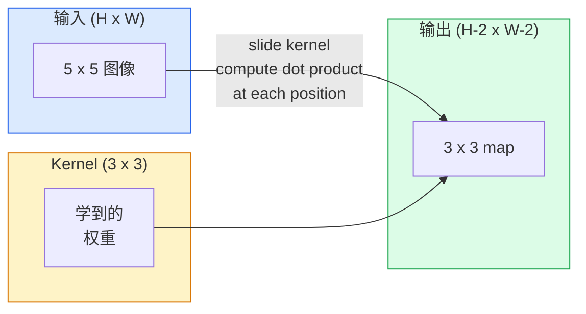
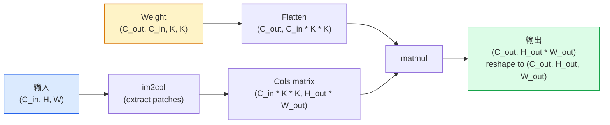

# 从零实现 Convolution

> Convolution 是一个很小的 dense layer，你把它滑过图像，并在每个位置共享同一组权重。

**类型：** 构建
**语言：** Python
**前置要求：** 阶段 3（深度学习核心），阶段 4 第 01 课（图像基础）
**时间：** ~75 分钟

## 学习目标

- 只用 NumPy 从零实现 2D convolution，包括嵌套循环版本和向量化的 `im2col` 版本
- 对任意输入尺寸、kernel size、padding 和 stride 组合计算输出空间尺寸，并解释 `(H - K + 2P) / S + 1` 公式
- 手工设计 kernel（edge、blur、sharpen、Sobel），并解释为什么每个 kernel 会产生对应的 activation 模式
- 把 convolutions 堆叠成 feature extractor，并把堆叠深度和 receptive field 的大小联系起来

## 问题

如果对一张 224x224 RGB 图像使用全连接层，每个神经元需要 224 * 224 * 3 = 150,528 个输入权重。一个只有 1,000 个单元的隐藏层就已经有 1.5 亿参数，而这还没学到任何有用东西。更糟的是，这一层完全不知道左上角的狗和右下角的狗是同一种模式。它把每个像素位置都当成独立变量，而这对图像来说正好是错的：把一只猫平移三个像素，不应该迫使网络重新学习“猫”这个概念。

图像模型需要两个性质：**translation equivariance**（输入平移时输出也随之平移）和 **parameter sharing**（同一个特征检测器在所有位置运行）。Dense layer 两者都没有。Convolution 免费给你这两个性质。

Convolution 并不是为了深度学习才发明的。它同样驱动着 JPEG 压缩、Photoshop 里的 Gaussian blur、工业视觉中的 edge detection，以及所有已经发布的音频滤波器。CNN 从 2012 到 2020 主导 ImageNet 的原因，是 convolution 对“相邻值相关，并且同一种模式可以出现在任何地方”的数据给出了正确先验。

## 概念

### 一个 kernel，滑动起来

2D convolution 取一个叫 kernel（或 filter）的小权重矩阵，在输入上滑动，并在每个位置计算逐元素乘积之和。这个和就成为一个输出像素。



一个 5x5 输入上的具体 3x3 例子（无 padding，stride 1）：

```
Input X (5 x 5):                Kernel W (3 x 3):

  1  2  0  1  2                   1  0 -1
  0  1  3  1  0                   2  0 -2
  2  1  0  2  1                   1  0 -1
  1  0  2  1  3
  2  1  1  0  1

Kernel 会滑过每个合法的 3 x 3 窗口。输出 Y 是 3 x 3：

 Y[0,0] = sum( W * X[0:3, 0:3] )
 Y[0,1] = sum( W * X[0:3, 1:4] )
 Y[0,2] = sum( W * X[0:3, 2:5] )
 Y[1,0] = sum( W * X[1:4, 0:3] )
 ... and so on
```

这个公式，也就是 **shared weights、locality、sliding window**，就是完整思想。其他全是记账。

### 输出尺寸公式

给定输入空间尺寸 `H`、kernel size `K`、padding `P`、stride `S`：

```
H_out = floor( (H - K + 2P) / S ) + 1
```

记住它。每设计一个架构，你都要算很多次。

| 场景 | H | K | P | S | H_out |
|----------|---|---|---|---|-------|
| Valid conv，无 padding | 32 | 3 | 0 | 1 | 30 |
| Same conv（保持尺寸） | 32 | 3 | 1 | 1 | 32 |
| 下采样 2 倍 | 32 | 3 | 1 | 2 | 16 |
| Pool 2x2 | 32 | 2 | 0 | 2 | 16 |
| 大 receptive field | 32 | 7 | 3 | 2 | 16 |

“Same padding” 意味着在 `S == 1` 时选择 P 让 H_out == H。对奇数 K，这就是 P = (K - 1) / 2。这也是 3x3 kernel 占主导的原因：它是仍然拥有中心点的最小奇数 kernel。

### Padding

没有 padding，每次 convolution 都会缩小 feature map。堆 20 层之后，224x224 图像会变成 184x184，这会浪费边界上的计算，并让需要 shape 匹配的 residual connection 变复杂。

```
Zero padding (P = 1) on a 5 x 5 input:

  0  0  0  0  0  0  0
  0  1  2  0  1  2  0
  0  0  1  3  1  0  0
  0  2  1  0  2  1  0       现在 kernel 可以以像素
  0  1  0  2  1  3  0       (0, 0) 为中心，并且仍然有三行
  0  2  1  1  0  1  0       三列的值可用于相乘。
  0  0  0  0  0  0  0
```

实践中会遇到的模式：`zero`（最常见）、`reflect`（镜像边缘，在生成模型中避免硬边界）、`replicate`（复制边缘）、`circular`（环绕，用于环面问题）。

### Stride

Stride 是滑动的步长。`stride=1` 是默认值。`stride=2` 会把空间维度减半，是 CNN 内部不使用单独 pooling layer 也能 downsample 的经典方式。每个现代架构（ResNet、ConvNeXt、MobileNet）都会在某处用 strided conv 替代 max-pool。

```
Stride 1 on a 5 x 5 input, 3 x 3 kernel:

  starts: (0,0) (0,1) (0,2)        -> output row 0
          (1,0) (1,1) (1,2)        -> output row 1
          (2,0) (2,1) (2,2)        -> output row 2

  Output: 3 x 3

Stride 2 on the same input:

  starts: (0,0) (0,2)              -> output row 0
          (2,0) (2,2)              -> output row 1

  Output: 2 x 2
```

### 多个输入通道

真实图像有三个通道。RGB 输入上的 3x3 convolution 实际上是一个 3x3x3 的体：每个输入通道一片 3x3。在每个空间位置，你会跨三片全部相乘求和，再加上 bias。

```
Input:   (C_in,  H,  W)        3 x 5 x 5
Kernel:  (C_in,  K,  K)        3 x 3 x 3 (one kernel)
Output:  (1,     H', W')       2D map

For a layer that produces C_out output channels, you stack C_out kernels:

Weight:  (C_out, C_in, K, K)   e.g. 64 x 3 x 3 x 3
Output:  (C_out, H', W')       64 x 3 x 3

Parameter count: C_out * C_in * K * K + C_out   (the + C_out is biases)
```

最后一行是规划模型时你会反复计算的东西。一个作用在 3 通道输入上的 64 通道 3x3 conv 有 `64 * 3 * 3 * 3 + 64 = 1,792` 个参数。很便宜。

### im2col 技巧

嵌套循环易读但很慢。GPU 想要大的矩阵乘法。技巧是：把输入中每个 receptive-field 窗口展开成一个大矩阵的一列，把 kernel 展开成一行，于是整个 convolution 就变成一次 matmul。



每个生产级 conv 实现都是这个思想加上 cache tiling 技巧的某种变体（direct conv、Winograd、大 kernel 的 FFT conv）。理解 im2col，你就理解了核心。

### Receptive field

单个 3x3 conv 会看 9 个输入像素。堆两个 3x3 conv，第二层中的一个神经元会看 5x5 的输入像素。三个 3x3 conv 得到 7x7。一般来说：

```
RF after L stacked K x K convs (stride 1) = 1 + L * (K - 1)

With strides:   RF grows multiplicatively with stride along each layer.
```

“一路 3x3” 有效（VGG、ResNet、ConvNeXt）的全部原因，是两个 3x3 conv 看见的输入区域与一个 5x5 conv 相同，但参数更少，并且中间多了一次 non-linearity。

## 构建它

### 第 1 步：Pad 一个数组

从最小原语开始：写一个函数，在 H x W 数组周围补零。

```python
import numpy as np

def pad2d(x, p):
    if p == 0:
        return x
    h, w = x.shape[-2:]
    out = np.zeros(x.shape[:-2] + (h + 2 * p, w + 2 * p), dtype=x.dtype)
    out[..., p:p + h, p:p + w] = x
    return out

x = np.arange(9).reshape(3, 3)
print(x)
print()
print(pad2d(x, 1))
```

尾部轴技巧 `x.shape[:-2]` 意味着同一个函数无需修改，就可以作用在 `(H, W)`、`(C, H, W)` 或 `(N, C, H, W)` 上。

### 第 2 步：用嵌套循环实现 2D convolution

参考实现：慢，但毫不含糊。原则上，这就是 `torch.nn.functional.conv2d` 做的事情。

```python
def conv2d_naive(x, w, b=None, stride=1, padding=0):
    c_in, h, w_in = x.shape
    c_out, c_in_w, kh, kw = w.shape
    assert c_in == c_in_w

    x_pad = pad2d(x, padding)
    h_out = (h + 2 * padding - kh) // stride + 1
    w_out = (w_in + 2 * padding - kw) // stride + 1

    out = np.zeros((c_out, h_out, w_out), dtype=np.float32)
    for oc in range(c_out):
        for i in range(h_out):
            for j in range(w_out):
                hs = i * stride
                ws = j * stride
                patch = x_pad[:, hs:hs + kh, ws:ws + kw]
                out[oc, i, j] = np.sum(patch * w[oc])
        if b is not None:
            out[oc] += b[oc]
    return out
```

四层嵌套循环（输出通道、行、列，再加上对 C_in、kh、kw 的隐式求和）。这是你用来检查所有更快实现的 ground truth。

### 第 3 步：用手工设计的 kernel 验证

构建一个垂直 Sobel kernel，把它应用到合成的阶跃图像上，然后观察垂直边缘亮起来。

```python
def synthetic_step_image():
    img = np.zeros((1, 16, 16), dtype=np.float32)
    img[:, :, 8:] = 1.0
    return img

sobel_x = np.array([
    [[-1, 0, 1],
     [-2, 0, 2],
     [-1, 0, 1]]
], dtype=np.float32)[None]

x = synthetic_step_image()
y = conv2d_naive(x, sobel_x, padding=1)
print(y[0].round(1))
```

预期第 7 列（从左到右亮度增加）出现较大的正值，其他地方为零。这个 print 就是你确认数学正确的 sanity check。

### 第 4 步：im2col

把输入中每个 kernel 大小的窗口转换成矩阵的一列。对 `C_in=3, K=3`，每列是 27 个数字。

```python
def im2col(x, kh, kw, stride=1, padding=0):
    c_in, h, w = x.shape
    x_pad = pad2d(x, padding)
    h_out = (h + 2 * padding - kh) // stride + 1
    w_out = (w + 2 * padding - kw) // stride + 1

    cols = np.zeros((c_in * kh * kw, h_out * w_out), dtype=x.dtype)
    col = 0
    for i in range(h_out):
        for j in range(w_out):
            hs = i * stride
            ws = j * stride
            patch = x_pad[:, hs:hs + kh, ws:ws + kw]
            cols[:, col] = patch.reshape(-1)
            col += 1
    return cols, h_out, w_out
```

它仍然是 Python 循环，但现在重活会变成一次向量化 matmul。

### 第 5 步：通过 im2col + matmul 实现快速 conv

用一次矩阵乘法替换四重循环。

```python
def conv2d_im2col(x, w, b=None, stride=1, padding=0):
    c_out, c_in, kh, kw = w.shape
    cols, h_out, w_out = im2col(x, kh, kw, stride, padding)
    w_flat = w.reshape(c_out, -1)
    out = w_flat @ cols
    if b is not None:
        out += b[:, None]
    return out.reshape(c_out, h_out, w_out)
```

正确性检查：运行两个实现并比较。

```python
rng = np.random.default_rng(0)
x = rng.normal(0, 1, (3, 16, 16)).astype(np.float32)
w = rng.normal(0, 1, (8, 3, 3, 3)).astype(np.float32)
b = rng.normal(0, 1, (8,)).astype(np.float32)

y_naive = conv2d_naive(x, w, b, padding=1)
y_im2col = conv2d_im2col(x, w, b, padding=1)

print(f"max abs diff: {np.max(np.abs(y_naive - y_im2col)):.2e}")
```

`max abs diff` 应该在 `1e-5` 左右。这是浮点累加顺序的差异，不是 bug。

### 第 6 步：一组手工设计的 kernel

五个 filter，展示单个 conv layer 在任何训练之前就能表达什么。

```python
KERNELS = {
    "identity": np.array([[0, 0, 0], [0, 1, 0], [0, 0, 0]], dtype=np.float32),
    "blur_3x3": np.ones((3, 3), dtype=np.float32) / 9.0,
    "sharpen": np.array([[0, -1, 0], [-1, 5, -1], [0, -1, 0]], dtype=np.float32),
    "sobel_x": np.array([[-1, 0, 1], [-2, 0, 2], [-1, 0, 1]], dtype=np.float32),
    "sobel_y": np.array([[-1, -2, -1], [0, 0, 0], [1, 2, 1]], dtype=np.float32),
}

def apply_kernel(img2d, kernel):
    x = img2d[None].astype(np.float32)
    w = kernel[None, None]
    return conv2d_im2col(x, w, padding=1)[0]
```

应用到任何灰度图像上，blur 会柔化，sharpen 会让边缘更清晰，Sobel-x 会点亮垂直边缘，Sobel-y 会点亮水平边缘。这些正是 AlexNet 和 VGG 的第一层训练后学到的模式，因为无论后续任务是什么，一个好的图像模型都需要 edge 和 blob detector。

## 使用它

PyTorch 的 `nn.Conv2d` 用 autograd、CUDA kernel 和 cuDNN 优化封装了同一个操作。Shape 语义完全相同。

```python
import torch
import torch.nn as nn

conv = nn.Conv2d(in_channels=3, out_channels=64, kernel_size=3, stride=1, padding=1)
print(conv)
print(f"weight shape: {tuple(conv.weight.shape)}   # (C_out, C_in, K, K)")
print(f"bias shape:   {tuple(conv.bias.shape)}")
print(f"param count:  {sum(p.numel() for p in conv.parameters())}")

x = torch.randn(8, 3, 224, 224)
y = conv(x)
print(f"\ninput  shape: {tuple(x.shape)}")
print(f"output shape: {tuple(y.shape)}")
```

把 `padding=1` 换成 `padding=0`，输出会降到 222x222。把 `stride=1` 换成 `stride=2`，它会降到 112x112。就是上面你记住的同一个公式。

## 交付它

本课会产出：

- `outputs/prompt-cnn-architect.md`：一个 prompt，给定输入尺寸、参数预算和目标 receptive field，它会设计一组 `Conv2d` 层，并在每一步使用正确的 K/S/P。
- `outputs/skill-conv-shape-calculator.md`：一个 skill，可以逐层遍历网络 spec，并返回每个 block 的输出 shape、receptive field 和参数量。

## 练习

1. **（简单）** 给定一个 128x128 灰度输入，以及 `[Conv3x3(s=1,p=1), Conv3x3(s=2,p=1), Conv3x3(s=1,p=1), Conv3x3(s=2,p=1)]` 这一组层，手算每层的输出空间尺寸和 receptive field。用一个由 dummy conv 组成的 PyTorch `nn.Sequential` 验证。
2. **（中等）** 扩展 `conv2d_naive` 和 `conv2d_im2col`，让它们接受 `groups` 参数。展示 `groups=C_in=C_out` 会复现 depthwise convolution，并且它的参数量是 `C * K * K`，而不是 `C * C * K * K`。
3. **（困难）** 手写 `conv2d_im2col` 的 backward pass：给定输出梯度，计算 `x` 和 `w` 的梯度。在相同输入和权重上对照 `torch.autograd.grad` 验证。技巧是：im2col 的梯度是 `col2im`，并且它必须累加重叠窗口。

## 关键术语

| 术语 | 人们常说 | 它实际意味着 |
|------|----------------|----------------------|
| Convolution | “滑动一个 filter” | 在每个空间位置使用共享权重应用的可学习点积；数学上是 cross-correlation，但所有人都叫它 convolution |
| Kernel / filter | “特征检测器” | 一个形状为 (C_in, K, K) 的小权重张量，它与输入窗口做点积后产生一个输出像素 |
| Stride | “跳多远” | 相邻 kernel 放置位置之间的步长；stride 2 会让每个空间维度减半 |
| Padding | “边缘上的零” | 添加在输入周围的额外值，让 kernel 可以以边界像素为中心；`same` padding 会保持输出尺寸等于输入尺寸 |
| Receptive field | “神经元能看见多少” | 某个输出 activation 所依赖的原始输入 patch，会随深度和 stride 增长 |
| im2col | “GEMM trick” | 把每个 receptive window 重排成列，让 convolution 变成一次大矩阵乘法，这是每个快速 conv kernel 的核心 |
| Depthwise conv | “每个通道一个 kernel” | `groups == C_in` 的 conv，每个输出通道只从匹配的输入通道计算；MobileNet 和 ConvNeXt 的骨干 |
| Translation equivariance | “输入平移，输出平移” | 输入平移 k 个像素时，输出也平移 k 个像素；共享权重天然带来这个性质 |

## 延伸阅读

- [A guide to convolution arithmetic for deep learning (Dumoulin & Visin, 2016)](https://arxiv.org/abs/1603.07285)：padding/stride/dilation 的权威图解，几乎每门课程都在悄悄借用
- [CS231n: Convolutional Neural Networks for Visual Recognition](https://cs231n.github.io/convolutional-networks/)：经典课程笔记，包含原始的 im2col 解释
- [The Annotated ConvNet (fast.ai)](https://nbviewer.org/github/fastai/fastbook/blob/master/13_convolutions.ipynb)：从手写 convolution 到训练数字分类器的 notebook
- [Receptive Field Arithmetic for CNNs (Dang Ha The Hien)](https://distill.pub/2019/computing-receptive-fields/)：论文级的 receptive field 计算交互式讲解
