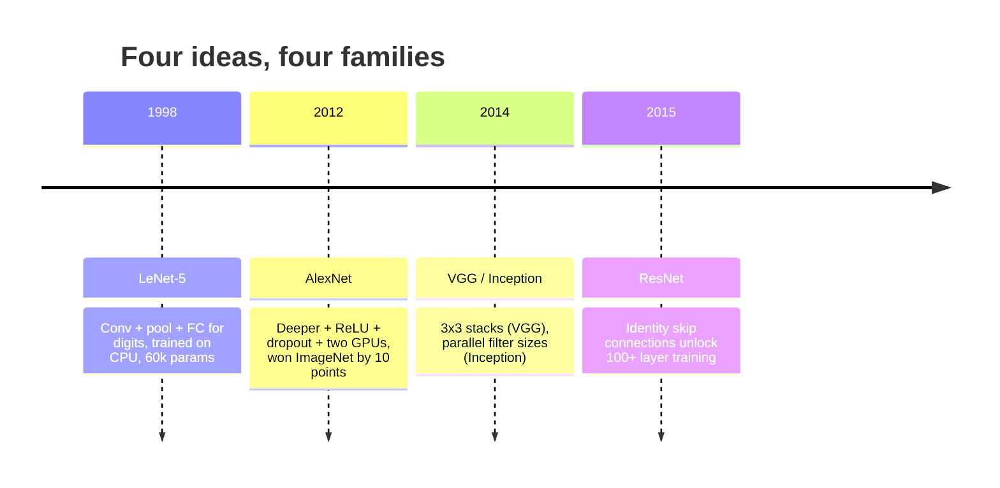
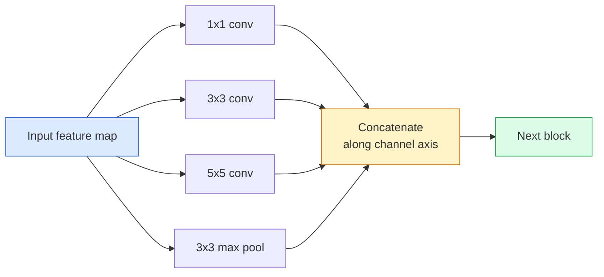
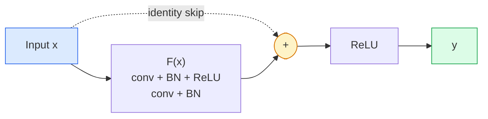

# CNN：从 LeNet 到 ResNet

> 过去三十年里每个重要 CNN，都是同一个 conv–nonlinearity–downsample 配方再外挂一个新想法。按顺序学这些想法。

**类型：** 学习 + 构建
**语言：** Python
**前置要求：** 阶段 3 第 11 课（PyTorch），阶段 4 第 01 课（图像基础），阶段 4 第 02 课（从零实现 Convolution）
**时间：** ~75 分钟

## 学习目标

- 追踪 LeNet-5 -> AlexNet -> VGG -> Inception -> ResNet 的架构谱系，并说出每个家族贡献的一个新想法
- 用 PyTorch 实现 LeNet-5、一个 VGG 风格 block，以及一个 ResNet BasicBlock，每个都控制在 40 行内
- 解释为什么 residual connection 能把 1,000 层网络从不可训练变成 state-of-the-art
- 阅读现代 backbone（ResNet-18、ResNet-50），并在看源码之前预测它的输出 shape、receptive field 和参数量

## 问题

2011 年，最好的 ImageNet 分类器 top-5 accuracy 约为 74%。2012 年 AlexNet 达到 85%。2015 年 ResNet 达到 96%。没有新数据，没有新一代 GPU。提升来自架构想法。一个能工作的视觉工程师必须知道哪个想法来自哪篇论文，因为你在 2026 年交付的每个生产 backbone，都是这些相同部件的重组；而且这些想法一直在迁移：grouped conv 从 CNN 进入 transformer，residual connection 从 ResNet 进入所有 LLM，batch normalisation 活在 diffusion model 里。

按顺序研究这些网络，也能让你免疫一个常见错误：明明 LeNet 大小的网络就能解决问题，却直接拿最大的可用模型。MNIST 不需要 ResNet。理解每个家族的 scaling curve，能告诉你应该坐在曲线的哪一段。

## 概念

### 改变视觉的四个想法



古典视觉中没有别的东西比这四次跃迁更重要。

### LeNet-5（1998）

Yann LeCun 的数字识别器。60,000 个参数。两个 conv-pool block，两个全连接层，tanh activation。它定义了每个 CNN 继承的模板：

```
input (1, 32, 32)
  conv 5x5 -> (6, 28, 28)
  avg pool 2x2 -> (6, 14, 14)
  conv 5x5 -> (16, 10, 10)
  avg pool 2x2 -> (16, 5, 5)
  flatten -> 400
  dense -> 120
  dense -> 84
  dense -> 10
```

现代世界称为 CNN 的一切，也就是交替的 convolution 和 downsampling，最后接一个小 classifier head，本质上都是层数更多、通道更大、activation 更好的 LeNet。

### AlexNet（2012）

三个变化一起击穿了 ImageNet：

1. **ReLU** 替代 tanh。梯度不再消失。训练速度提高六倍。
2. **Dropout** 放进全连接 head。Regularisation 成为一层，而不是一个技巧。
3. **深度和宽度**。五个 conv layer，三个 dense layer，6000 万参数，在两块 GPU 上训练，模型被拆到两块卡上。

论文的 Figure 2 仍然显示 GPU split 成两条并行流。这个并行只是硬件绕行，不是架构洞见。但上面三个想法仍然存在于你使用的每个模型中。

### VGG（2014）

VGG 问的是：如果只用 3x3 convolution，然后不断加深，会发生什么？

```
stack:   conv 3x3 -> conv 3x3 -> pool 2x2
repeat:  16 or 19 conv layers
```

两个 3x3 conv 看到的输入区域与一个 5x5 conv 相同，但参数更少（2*9*C^2 = 18C^2，而不是 25*C^2），中间还多一个 ReLU。VGG 把这个观察做成了完整架构。这种简单性，也就是一种 block 反复堆叠，让它成为后来所有东西的参照点。

代价：1.38 亿参数，训练慢，推理贵。

### Inception（2014，同一年）

Google 对“我该用什么 kernel size？”的回答是：全都用，并行使用。



每个 branch 会专门化：1x1 做通道混合，3x3 做局部纹理，5x5 做更大的模式，pooling 做 shift-invariant features；concat 让下一层选择有用的 branch。Inception v1 在每个 branch 内部使用 1x1 convolution 作为 bottleneck，以保持参数量合理。

### Degradation problem

到 2015 年，VGG-19 能工作，而 VGG-32 不能。深度本该有帮助，但超过约 20 层后，训练 loss 和测试 loss 都变差了。这不是 overfitting，而是优化器找不到有用权重，因为梯度会穿过每一层乘法式地缩小。

```
Plain deep network:
  y = f_L( f_{L-1}( ... f_1(x) ... ) )

Gradient wrt early layer:
  dL/dW_1 = dL/dy * df_L/df_{L-1} * ... * df_2/df_1 * df_1/dW_1

Each multiplicative term has magnitude roughly (weight magnitude) * (activation gain).
Stack 100 of them with gains < 1 and the gradient is effectively zero.
```

VGG 能在 19 层工作，是因为 batch norm（同时发表）让 activation 保持良好尺度。但即使 batch norm 也救不了 30 层以上的深度。

### ResNet（2015）

He、Zhang、Ren、Sun 提出了一个改变一切的改动：

```
standard block:   y = F(x)
residual block:   y = F(x) + x
```

`+ x` 意味着这一层总是可以通过把 `F(x)` 推到零来选择什么都不做。一个 1,000 层 ResNet 现在最多和 1 层网络一样差，因为每个额外 block 都有一个简单逃生通道。有了这个保证，优化器愿意让每个 block 变得“稍微有用一点”，而稍微有用，堆 100 次，就是 state-of-the-art。



两种 block 变体会到处出现：

- **BasicBlock**（ResNet-18、ResNet-34）：两个 3x3 conv，skip 跨过两者。
- **Bottleneck**（ResNet-50、-101、-152）：1x1 降维，3x3 中间层，1x1 升维，skip 跨过这三者。通道数高时更便宜。

当 skip 必须跨过 downsample（stride=2）时，identity path 会被替换为一个 1x1 stride=2 conv，用来匹配 shape。

### 为什么 residual 对视觉之外也重要

这个想法其实不只是关于图像分类。它把深度网络从“交叉手指祈祷梯度能活下来”变成了可靠、可扩展的工程工具。你下个阶段会读到的每个 transformer，在每个 block 中都有完全相同的 skip connection。没有 ResNet，就没有 GPT。

## 构建它

### 第 1 步：LeNet-5

一个最小而忠实的 LeNet。Tanh activation，average pooling。唯一现代化妥协，是我们下游使用 `nn.CrossEntropyLoss`，而不是原始的 Gaussian connections。

```python
import torch
import torch.nn as nn
import torch.nn.functional as F

class LeNet5(nn.Module):
    def __init__(self, num_classes=10):
        super().__init__()
        self.conv1 = nn.Conv2d(1, 6, kernel_size=5)
        self.conv2 = nn.Conv2d(6, 16, kernel_size=5)
        self.pool = nn.AvgPool2d(2)
        self.fc1 = nn.Linear(16 * 5 * 5, 120)
        self.fc2 = nn.Linear(120, 84)
        self.fc3 = nn.Linear(84, num_classes)

    def forward(self, x):
        x = self.pool(torch.tanh(self.conv1(x)))
        x = self.pool(torch.tanh(self.conv2(x)))
        x = torch.flatten(x, 1)
        x = torch.tanh(self.fc1(x))
        x = torch.tanh(self.fc2(x))
        return self.fc3(x)

net = LeNet5()
x = torch.randn(1, 1, 32, 32)
print(f"output: {net(x).shape}")
print(f"params: {sum(p.numel() for p in net.parameters()):,}")
```

期望输出：`output: torch.Size([1, 10])`、`params: 61,706`。这就是开启现代视觉的完整数字分类器。

### 第 2 步：一个 VGG block

一个可复用 block：两个 3x3 conv、ReLU、batch norm、max pool。

```python
class VGGBlock(nn.Module):
    def __init__(self, in_c, out_c):
        super().__init__()
        self.conv1 = nn.Conv2d(in_c, out_c, kernel_size=3, padding=1)
        self.bn1 = nn.BatchNorm2d(out_c)
        self.conv2 = nn.Conv2d(out_c, out_c, kernel_size=3, padding=1)
        self.bn2 = nn.BatchNorm2d(out_c)
        self.pool = nn.MaxPool2d(2)

    def forward(self, x):
        x = F.relu(self.bn1(self.conv1(x)))
        x = F.relu(self.bn2(self.conv2(x)))
        return self.pool(x)

class MiniVGG(nn.Module):
    def __init__(self, num_classes=10):
        super().__init__()
        self.stack = nn.Sequential(
            VGGBlock(3, 32),
            VGGBlock(32, 64),
            VGGBlock(64, 128),
        )
        self.head = nn.Sequential(
            nn.AdaptiveAvgPool2d(1),
            nn.Flatten(),
            nn.Linear(128, num_classes),
        )

    def forward(self, x):
        return self.head(self.stack(x))

net = MiniVGG()
x = torch.randn(1, 3, 32, 32)
print(f"output: {net(x).shape}")
print(f"params: {sum(p.numel() for p in net.parameters()):,}")
```

三个 VGG block 作用在 CIFAR 尺寸输入上，一个 adaptive pool，一个 linear layer。约 29 万参数。对 CIFAR-10 已经足够。

### 第 3 步：一个 ResNet BasicBlock

ResNet-18 和 ResNet-34 的核心构建块。

```python
class BasicBlock(nn.Module):
    def __init__(self, in_c, out_c, stride=1):
        super().__init__()
        self.conv1 = nn.Conv2d(in_c, out_c, kernel_size=3, stride=stride, padding=1, bias=False)
        self.bn1 = nn.BatchNorm2d(out_c)
        self.conv2 = nn.Conv2d(out_c, out_c, kernel_size=3, stride=1, padding=1, bias=False)
        self.bn2 = nn.BatchNorm2d(out_c)
        if stride != 1 or in_c != out_c:
            self.shortcut = nn.Sequential(
                nn.Conv2d(in_c, out_c, kernel_size=1, stride=stride, bias=False),
                nn.BatchNorm2d(out_c),
            )
        else:
            self.shortcut = nn.Identity()

    def forward(self, x):
        out = F.relu(self.bn1(self.conv1(x)))
        out = self.bn2(self.conv2(out))
        out = out + self.shortcut(x)
        return F.relu(out)
```

conv layer 上的 `bias=False` 是 batch-norm 约定，因为 BN 的 beta 参数已经处理了 bias，再带一个 conv bias 是浪费。只有 stride 或通道数变化时，`shortcut` 才需要真正的 conv；否则它就是 no-op identity。

### 第 4 步：一个 tiny ResNet

堆叠四组 BasicBlock，得到一个适用于 CIFAR 尺寸输入的可工作 ResNet。

```python
class TinyResNet(nn.Module):
    def __init__(self, num_classes=10):
        super().__init__()
        self.stem = nn.Sequential(
            nn.Conv2d(3, 32, kernel_size=3, stride=1, padding=1, bias=False),
            nn.BatchNorm2d(32),
            nn.ReLU(inplace=True),
        )
        self.layer1 = self._make_group(32, 32, num_blocks=2, stride=1)
        self.layer2 = self._make_group(32, 64, num_blocks=2, stride=2)
        self.layer3 = self._make_group(64, 128, num_blocks=2, stride=2)
        self.layer4 = self._make_group(128, 256, num_blocks=2, stride=2)
        self.head = nn.Sequential(
            nn.AdaptiveAvgPool2d(1),
            nn.Flatten(),
            nn.Linear(256, num_classes),
        )

    def _make_group(self, in_c, out_c, num_blocks, stride):
        blocks = [BasicBlock(in_c, out_c, stride=stride)]
        for _ in range(num_blocks - 1):
            blocks.append(BasicBlock(out_c, out_c, stride=1))
        return nn.Sequential(*blocks)

    def forward(self, x):
        x = self.stem(x)
        x = self.layer1(x)
        x = self.layer2(x)
        x = self.layer3(x)
        x = self.layer4(x)
        return self.head(x)

net = TinyResNet()
x = torch.randn(1, 3, 32, 32)
print(f"output: {net(x).shape}")
print(f"params: {sum(p.numel() for p in net.parameters()):,}")
```

四组，每组两个 block。第 2、3、4 组开头用 stride 2。每次 downsample 时通道数翻倍。大约 280 万参数。这就是可以干净扩展到 ResNet-152 的标准配方。

### 第 5 步：比较参数到特征效率

让同一个输入通过三个网络，并比较参数量。

```python
def summary(name, net, x):
    y = net(x)
    params = sum(p.numel() for p in net.parameters())
    print(f"{name:12s}  input {tuple(x.shape)} -> output {tuple(y.shape)}  params {params:>10,}")

x = torch.randn(1, 3, 32, 32)
summary("LeNet5",     LeNet5(),       torch.randn(1, 1, 32, 32))
summary("MiniVGG",    MiniVGG(),      x)
summary("TinyResNet", TinyResNet(),   x)
```

三个模型，三个时代，参数量相差三个数量级。对 CIFAR-10 accuracy，训练几个 epoch 后大致需要：LeNet 60%，MiniVGG 89%，TinyResNet 93%。

## 使用它

`torchvision.models` 提供了上述所有家族的预训练版本。各家族的调用签名完全一致，这正是 backbone 抽象的意义。

```python
from torchvision.models import resnet18, ResNet18_Weights, vgg16, VGG16_Weights

r18 = resnet18(weights=ResNet18_Weights.IMAGENET1K_V1)
r18.eval()

print(f"ResNet-18 params: {sum(p.numel() for p in r18.parameters()):,}")
print(r18.layer1[0])
print()

v16 = vgg16(weights=VGG16_Weights.IMAGENET1K_V1)
v16.eval()
print(f"VGG-16   params: {sum(p.numel() for p in v16.parameters()):,}")
```

ResNet-18 有 1170 万参数。VGG-16 有 1.38 亿。ImageNet top-1 accuracy 相近（69.8% vs 71.6%）。Residual connection 给你带来 12 倍的参数效率胜利。这就是 ResNet 变体从 2016 年直到 ViT 在 2021 年到来前一直主导的原因，也仍然是 compute 受限的真实部署中它们占主导的原因。

对 transfer learning，配方始终一样：加载预训练权重，冻结 backbone，替换 classifier head。

```python
for p in r18.parameters():
    p.requires_grad = False
r18.fc = nn.Linear(r18.fc.in_features, 10)
```

三行。你现在拥有了一个 10 类 CIFAR 分类器，并继承了 ImageNet 付费训练出来的 representation。

## 交付它

本课会产出：

- `outputs/prompt-backbone-selector.md`：一个 prompt，会根据任务、数据集大小和计算预算，选择合适的 CNN 家族（LeNet/VGG/ResNet/MobileNet/ConvNeXt）。
- `outputs/skill-residual-block-reviewer.md`：一个 skill，会读取 PyTorch module 并标记 skip-connection 错误（stride 改变时缺少 shortcut、shortcut activation 顺序错误、BN 相对 addition 的位置错误）。

## 练习

1. **（简单）** 逐层手算 `TinyResNet` 的参数量。与 `sum(p.numel() for p in net.parameters())` 对比。参数预算主要花在哪里：conv、BN，还是 classifier head？
2. **（中等）** 实现 Bottleneck block（1x1 -> 3x3 -> 1x1，带 skip），并用它构建一个 CIFAR 版 ResNet-50 风格网络。把参数量和 `TinyResNet` 比较。
3. **（困难）** 从 `BasicBlock` 中移除 skip connection，在 CIFAR-10 上分别训练一个 34-block “plain” 网络和一个 34-block ResNet，各 10 个 epoch。画出二者的 training loss vs epoch。复现 He 等人 Figure 1 的结果：plain deep network 收敛到比它浅层孪生模型更高的 loss。

## 关键术语

| 术语 | 人们常说 | 它实际意味着 |
|------|----------------|----------------------|
| Backbone | “模型” | 生成 feature map 并送入 task head 的 convolutional block 堆栈 |
| Residual connection | “Skip connection” | `y = F(x) + x`；让优化器可以通过把 F 设为零来学习 identity，从而让任意深度可训练 |
| BasicBlock | “两个 3x3 conv 加一个 skip” | ResNet-18/34 构建块：conv-BN-ReLU-conv-BN-add-ReLU |
| Bottleneck | “1x1 降维，3x3，1x1 升维” | ResNet-50/101/152 block；通道数高时便宜，因为 3x3 在较窄宽度上运行 |
| Degradation problem | “更深反而更差” | 超过约 20 个 plain conv layer 后，训练误差和测试误差都会增加；由 residual connection 解决，而不是靠更多数据 |
| Stem | “第一层” | 把 3 通道输入转换为基础 feature 宽度的初始 conv；ImageNet 通常是 7x7 stride 2，CIFAR 通常是 3x3 stride 1 |
| Head | “分类器” | 最终 backbone block 之后的层：adaptive pool、flatten、linear(s) |
| Transfer learning | “预训练权重” | 加载在 ImageNet 上训练的 backbone，并只在你的任务上 fine-tune head |

## 延伸阅读

- [Deep Residual Learning for Image Recognition (He et al., 2015)](https://arxiv.org/abs/1512.03385)：ResNet 论文；每张图都值得研究
- [Very Deep Convolutional Networks (Simonyan & Zisserman, 2014)](https://arxiv.org/abs/1409.1556)：VGG 论文；仍然是“为什么用 3x3”的最佳参考
- [ImageNet Classification with Deep CNNs (Krizhevsky et al., 2012)](https://papers.nips.cc/paper_files/paper/2012/hash/c399862d3b9d6b76c8436e924a68c45b-Abstract.html)：AlexNet；终结手工特征时代的论文
- [Going Deeper with Convolutions (Szegedy et al., 2014)](https://arxiv.org/abs/1409.4842)：Inception v1；parallel-filter 想法今天仍然出现在 vision transformer 中
