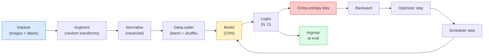

# 图像分类

> 分类器是一个从像素到类别概率分布的函数。其他一切都是管道工程。

**类型：** 构建
**语言：** Python
**前置要求：** 阶段 2 第 09 课（模型评估），阶段 3 第 10 课（迷你框架），阶段 4 第 03 课（CNN）
**时间：** ~75 分钟

## 学习目标

- 在 CIFAR-10 上构建端到端图像分类 pipeline：dataset、augmentation、model、training loop、evaluation
- 解释每个组件（dataloader、loss、optimizer、scheduler、augmentation）的作用，并预测其中任意一个损坏时会如何体现在 loss curve 上
- 从零实现 mixup、cutout 和 label smoothing，并说明何时值得加入它们
- 阅读 confusion matrix 和 per-class precision/recall 表，诊断 aggregate accuracy 之外的数据集和模型失败

## 问题

每个能上线的视觉任务，在某个层面上都会归约为图像分类。Detection 会分类区域。Segmentation 会分类像素。Retrieval 会按到 class centroid 的相似度排序。把分类做对，也就是 dataset loop、augmentation policy、loss、evaluation 做对，是会迁移到本阶段所有其他任务的能力。

大多数分类 bug 不在模型里。它们活在 pipeline 里：坏掉的 normalisation、没有 shuffle 的训练集、会扭曲标签的 augmentation、被训练数据污染的 validation split、在第 30 个 epoch 后悄悄发散的 learning rate。一个正确设置下能在 CIFAR-10 上达到 93% 的 CNN，在坏掉的设置里常常只有 70-75%，而 loss curve 全程看起来都还挺合理。

本课会手工连完整个 pipeline，让每个部分都可以被检查。你不会使用任何可能隐藏 bug 的 `torchvision.datasets` 内容。

## 概念

### 分类 pipeline



这个循环中的每条线都可能藏 bug。Cross-entropy 接收 raw logits，而不是 softmax outputs，所以任何在 loss 前做的 `model(x).softmax()` 都会悄悄计算错误梯度。Augmentation 只作用于输入，不作用于标签；mixup 除外，它会同时混合两者。`optimizer.zero_grad()` 必须每一步执行一次；跳过它会累积梯度，看起来像 learning rate 极不稳定。这些 bug 都不会报错，但会把学习曲线压平。

### Cross-entropy、logits 与 softmax

分类器为每张图像产生 `C` 个数字，称为 logits。应用 softmax 会把它们转换成概率分布：

```
softmax(z)_i = exp(z_i) / sum_j exp(z_j)
```

Cross-entropy 衡量正确类别的负对数概率：

```
CE(z, y) = -log( softmax(z)_y )
        = -z_y + log( sum_j exp(z_j) )
```

右侧形式是数值稳定的（log-sum-exp）。PyTorch 的 `nn.CrossEntropyLoss` 会把 softmax + NLL 融合进一个 op，并且直接接收 raw logits。你自己先应用 softmax 几乎总是 bug，因为你算的是 log(softmax(softmax(z)))，一个没有意义的量。

### 为什么 augmentation 有效

CNN 对 translation 有 inductive bias（来自权重共享），但对 crop、flip、colour jitter 或 occlusion 没有内置不变性。教它这些不变性的唯一办法，就是展示能够覆盖它们的像素。训练期间的每个随机变换都是在说：“这两张图像有同一个标签；请学习忽略差异的特征。”

```
Original crop:  "dog facing left"
Flip:           "dog facing right"       <- same label, different pixels
Rotate(+15):    "dog, slight tilt"
Colour jitter:  "dog in warmer light"
RandomErasing:  "dog with patch missing"
```

规则：augmentation 必须保留标签。对数字使用 cutout 和 rotation，可能把 “6” 翻成 “9”；在这种数据集上，你要使用更小的旋转范围，并选择尊重数字特定不变性的 augmentation。

### Mixup 和 cutmix

普通 augmentation 会变换像素，但保持 one-hot 标签。**Mixup** 和 **cutmix** 会打破这一点，同时插值输入和标签。

```
Mixup:
  lambda ~ Beta(a, a)
  x = lambda * x_i + (1 - lambda) * x_j
  y = lambda * y_i + (1 - lambda) * y_j

Cutmix:
  paste a random rectangle of x_j into x_i
  y = area-weighted mix of y_i and y_j
```

为什么有帮助：模型不再记忆尖锐的 one-hot target，而是学习在类别之间插值。Training loss 上升，test accuracy 上升。这是任何分类器最便宜的 robustness 升级。

### Label smoothing

Mixup 的近亲。不要训练 `[0, 0, 1, 0, 0]`，而是用 `[eps/C, eps/C, 1-eps, eps/C, eps/C]` 这样的目标训练，其中 `eps` 是 0.1 这样的小值。它会阻止模型产生任意尖锐的 logits，并几乎零成本地改善 calibration。自 PyTorch 1.10 起，它内置在 `nn.CrossEntropyLoss(label_smoothing=0.1)` 中。

### Accuracy 之外的评估

Aggregate accuracy 会隐藏不平衡。一个 90-10 的二分类器，如果总是预测多数类，也能拿到 90%。真正告诉你发生了什么的工具是：

- **Per-class accuracy**：每个类别一个数字；会立刻暴露表现差的类别。
- **Confusion matrix**：C x C 网格，其中第 i 行第 j 列 = 真实类别 i 被预测为类别 j 的数量；对角线是正确预测，非对角线才是模型真实生活的地方。
- **Top-1 / Top-5**：正确类别是否在前 1 或前 5 个预测中；Top-5 对 ImageNet 很重要，因为 “Norwich terrier” vs “Norfolk terrier” 这类类别确实模糊。
- **Calibration (ECE)**：置信度 0.8 的预测是否有 80% 的时间是正确的？现代网络系统性过度自信；可以用 temperature scaling 或 label smoothing 修正。

## 构建它

### 第 1 步：确定性的合成数据集

CIFAR-10 存在磁盘上。为了让本课可复现且快速，我们构建一个看起来像 CIFAR 的合成数据集：32x32 RGB 图像，带有模型必须学习的类别特定结构。完全相同的 pipeline 可以不改动地用于真实 CIFAR-10。

```python
import numpy as np
import torch
from torch.utils.data import Dataset


def synthetic_cifar(num_per_class=1000, num_classes=10, seed=0):
    rng = np.random.default_rng(seed)
    X = []
    Y = []
    for c in range(num_classes):
        centre = rng.uniform(0, 1, (3,))
        freq = 2 + c
        for _ in range(num_per_class):
            yy, xx = np.meshgrid(np.linspace(0, 1, 32), np.linspace(0, 1, 32), indexing="ij")
            r = np.sin(xx * freq) * 0.5 + centre[0]
            g = np.cos(yy * freq) * 0.5 + centre[1]
            b = (xx + yy) * 0.5 * centre[2]
            img = np.stack([r, g, b], axis=-1)
            img += rng.normal(0, 0.08, img.shape)
            img = np.clip(img, 0, 1)
            X.append(img.astype(np.float32))
            Y.append(c)
    X = np.stack(X)
    Y = np.array(Y)
    idx = rng.permutation(len(X))
    return X[idx], Y[idx]


class ArrayDataset(Dataset):
    def __init__(self, X, Y, transform=None):
        self.X = X
        self.Y = Y
        self.transform = transform

    def __len__(self):
        return len(self.X)

    def __getitem__(self, i):
        img = self.X[i]
        if self.transform is not None:
            img = self.transform(img)
        img = torch.from_numpy(img).permute(2, 0, 1)
        return img, int(self.Y[i])
```

每个类别都有自己的调色板和频率模式，再加上 Gaussian noise，迫使模型学习信号而不是记忆像素。十个类别，每类一千张图像，打乱顺序。

### 第 2 步：Normalisation 和 augmentation

每个视觉 pipeline 都有的两个 transform。

```python
def standardize(mean, std):
    mean = np.array(mean, dtype=np.float32)
    std = np.array(std, dtype=np.float32)
    def _fn(img):
        return (img - mean) / std
    return _fn


def random_hflip(p=0.5):
    def _fn(img):
        if np.random.random() < p:
            return img[:, ::-1, :].copy()
        return img
    return _fn


def random_crop(pad=4):
    def _fn(img):
        h, w = img.shape[:2]
        padded = np.pad(img, ((pad, pad), (pad, pad), (0, 0)), mode="reflect")
        y = np.random.randint(0, 2 * pad)
        x = np.random.randint(0, 2 * pad)
        return padded[y:y + h, x:x + w, :]
    return _fn


def compose(*fns):
    def _fn(img):
        for fn in fns:
            img = fn(img)
        return img
    return _fn
```

Crop 前用 reflect-pad，而不是 zero-pad，因为黑边是模型会学着忽略的一种不太有用的信号。

### 第 3 步：Mixup

在 training step 内部混合两张图像和两个标签。它作为 batch transform 实现，所以它靠近 forward pass，而不是藏在 dataset 里。

```python
def mixup_batch(x, y, num_classes, alpha=0.2):
    if alpha <= 0:
        return x, torch.nn.functional.one_hot(y, num_classes).float()
    lam = float(np.random.beta(alpha, alpha))
    idx = torch.randperm(x.size(0), device=x.device)
    x_mixed = lam * x + (1 - lam) * x[idx]
    y_onehot = torch.nn.functional.one_hot(y, num_classes).float()
    y_mixed = lam * y_onehot + (1 - lam) * y_onehot[idx]
    return x_mixed, y_mixed


def soft_cross_entropy(logits, soft_targets):
    log_probs = torch.log_softmax(logits, dim=-1)
    return -(soft_targets * log_probs).sum(dim=-1).mean()
```

`soft_cross_entropy` 是针对 soft-label distribution 的 cross-entropy。当 target 恰好是 one-hot 时，它会退化成通常的形式。

### 第 4 步：训练循环

完整配方：遍历数据一次，每个 batch 做一次梯度，scheduler 每个 epoch step 一次。

```python
import torch
import torch.nn as nn
from torch.utils.data import DataLoader
from torch.optim import SGD
from torch.optim.lr_scheduler import CosineAnnealingLR

def train_one_epoch(model, loader, optimizer, device, num_classes, use_mixup=True):
    model.train()
    total, correct, loss_sum = 0, 0, 0.0
    for x, y in loader:
        x, y = x.to(device), y.to(device)
        if use_mixup:
            x_m, y_soft = mixup_batch(x, y, num_classes)
            logits = model(x_m)
            loss = soft_cross_entropy(logits, y_soft)
        else:
            logits = model(x)
            loss = nn.functional.cross_entropy(logits, y, label_smoothing=0.1)
        optimizer.zero_grad()
        loss.backward()
        optimizer.step()
        loss_sum += loss.item() * x.size(0)
        total += x.size(0)
        # Training accuracy vs the un-mixed labels `y` is only an approximation
        # when mixup is on (the model saw soft targets, not y). Treat it as a
        # rough progress signal; rely on val accuracy for real performance.
        with torch.no_grad():
            pred = logits.argmax(dim=-1)
            correct += (pred == y).sum().item()
    return loss_sum / total, correct / total


@torch.no_grad()
def evaluate(model, loader, device, num_classes):
    model.eval()
    total, correct = 0, 0
    loss_sum = 0.0
    cm = torch.zeros(num_classes, num_classes, dtype=torch.long)
    for x, y in loader:
        x, y = x.to(device), y.to(device)
        logits = model(x)
        loss = nn.functional.cross_entropy(logits, y)
        pred = logits.argmax(dim=-1)
        for t, p in zip(y.cpu(), pred.cpu()):
            cm[t, p] += 1
        loss_sum += loss.item() * x.size(0)
        total += x.size(0)
        correct += (pred == y).sum().item()
    return loss_sum / total, correct / total, cm
```

每次写训练循环都要检查五个不变量：

1. 训练前 `model.train()`，评估前 `model.eval()`：切换 dropout 和 batchnorm 行为。
2. `.zero_grad()` 在 `.backward()` 之前。
3. 累积指标时使用 `.item()`，这样不会有东西把 computation graph 留住。
4. 评估期间使用 `@torch.no_grad()`：节省内存和时间，避免细微事故。
5. 对 raw logits 做 argmax，而不是 softmax：结果相同，少一个 op。

### 第 5 步：组装起来

使用上一课的 `TinyResNet`，训练几个 epoch，然后评估。

```python
from main import synthetic_cifar, ArrayDataset
from main import standardize, random_hflip, random_crop, compose
from main import mixup_batch, soft_cross_entropy
from main import train_one_epoch, evaluate
# TinyResNet comes from the previous lesson (03-cnns-lenet-to-resnet).
# Adjust the import path to wherever you stored the previous lesson's code.
from cnns_lenet_to_resnet import TinyResNet  # example placeholder

X, Y = synthetic_cifar(num_per_class=500)
split = int(0.9 * len(X))
X_train, Y_train = X[:split], Y[:split]
X_val, Y_val = X[split:], Y[split:]

mean = [0.5, 0.5, 0.5]
std = [0.25, 0.25, 0.25]
train_tf = compose(random_hflip(), random_crop(pad=4), standardize(mean, std))
eval_tf = standardize(mean, std)

train_ds = ArrayDataset(X_train, Y_train, transform=train_tf)
val_ds = ArrayDataset(X_val, Y_val, transform=eval_tf)

train_loader = DataLoader(train_ds, batch_size=128, shuffle=True, num_workers=0)
val_loader = DataLoader(val_ds, batch_size=256, shuffle=False, num_workers=0)

device = "cuda" if torch.cuda.is_available() else "cpu"
model = TinyResNet(num_classes=10).to(device)
optimizer = SGD(model.parameters(), lr=0.1, momentum=0.9, weight_decay=5e-4, nesterov=True)
scheduler = CosineAnnealingLR(optimizer, T_max=10)

for epoch in range(10):
    tr_loss, tr_acc = train_one_epoch(model, train_loader, optimizer, device, 10, use_mixup=True)
    va_loss, va_acc, _ = evaluate(model, val_loader, device, 10)
    scheduler.step()
    print(f"epoch {epoch:2d}  lr {scheduler.get_last_lr()[0]:.4f}  "
          f"train {tr_loss:.3f}/{tr_acc:.3f}  val {va_loss:.3f}/{va_acc:.3f}")
```

在合成数据集上，它会在五个 epoch 内达到接近完美的 validation accuracy，这就是重点：pipeline 正确，模型能学到可学习的东西。把数据集换成真实 CIFAR-10，同一个循环无需修改就能训练到约 90%。

### 第 6 步：读取 confusion matrix

单看 accuracy 永远不会告诉你模型在哪里失败。Confusion matrix 会。

```python
def print_confusion(cm, labels=None):
    c = cm.shape[0]
    labels = labels or [str(i) for i in range(c)]
    print(f"{'':>6}" + "".join(f"{l:>5}" for l in labels))
    for i in range(c):
        row = cm[i].tolist()
        print(f"{labels[i]:>6}" + "".join(f"{v:>5}" for v in row))
    print()
    tp = cm.diag().float()
    fp = cm.sum(dim=0).float() - tp
    fn = cm.sum(dim=1).float() - tp
    prec = tp / (tp + fp).clamp_min(1)
    rec = tp / (tp + fn).clamp_min(1)
    f1 = 2 * prec * rec / (prec + rec).clamp_min(1e-9)
    for i in range(c):
        print(f"{labels[i]:>6}  prec {prec[i]:.3f}  rec {rec[i]:.3f}  f1 {f1[i]:.3f}")

_, _, cm = evaluate(model, val_loader, device, 10)
print_confusion(cm)
```

行是真实类别，列是预测类别。如果类别 3 和 5 之间出现一簇非对角计数，说明模型混淆这两类，也给了你定向收集数据或做类别特定 augmentation 的起点。

## 使用它

`torchvision` 会把上面的所有内容封装为惯用组件。对真实 CIFAR-10，完整 pipeline 是四行再加一个训练循环。

```python
from torchvision.datasets import CIFAR10
from torchvision.transforms import Compose, RandomCrop, RandomHorizontalFlip, ToTensor, Normalize

mean = (0.4914, 0.4822, 0.4465)
std = (0.2470, 0.2435, 0.2616)
train_tf = Compose([
    RandomCrop(32, padding=4, padding_mode="reflect"),
    RandomHorizontalFlip(),
    ToTensor(),
    Normalize(mean, std),
])
eval_tf = Compose([ToTensor(), Normalize(mean, std)])

train_ds = CIFAR10(root="./data", train=True,  download=True, transform=train_tf)
val_ds   = CIFAR10(root="./data", train=False, download=True, transform=eval_tf)
```

注意两点：mean/std 是**数据集特定**的，是在 CIFAR-10 训练集上计算的，不是 ImageNet；reflect pad 是社区默认 crop policy。在这里复制粘贴 ImageNet stats 会泄漏约 1% accuracy，直到有人 profile 模型之前都没人发现。

## 交付它

本课会产出：

- `outputs/prompt-classifier-pipeline-auditor.md`：一个 prompt，会审计训练脚本是否满足上面的五个不变量，并暴露第一个违规点。
- `outputs/skill-classification-diagnostics.md`：一个 skill，给定 confusion matrix 和 class name 列表，会总结 per-class failure，并提出最有影响力的单个修复。

## 练习

1. **（简单）** 在合成数据集上分别用和不用 mixup 训练同一个模型五个 epoch。画出两者的 train loss 和 val loss。解释为什么使用 mixup 时 train loss 更高，但 val accuracy 相似或更好。
2. **（中等）** 实现 Cutout：在每张训练图像中把一个随机 8x8 方块置零，并与无 augmentation、hflip+crop、hflip+crop+cutout、hflip+crop+mixup 做 ablation。报告每个设置的 val accuracy。
3. **（困难）** 构建一个 CIFAR-100 pipeline（100 个类别，输入尺寸相同），并复现 ResNet-34 训练结果，使其与公开 accuracy 相差不超过 1%。加分项：扫描三个 learning rate 和两个 weight decay，记录到本地 CSV，生成最终的 confusion-matrix-top-confusions 表。

## 关键术语

| 术语 | 人们常说 | 它实际意味着 |
|------|----------------|----------------------|
| Logits | “Raw outputs” | 每张图像的 C 个 pre-softmax 数字；cross-entropy 期望这些值，而不是 softmax 后的值 |
| Cross-entropy | “Loss” | 正确类别的负对数概率；在一个稳定 op 中结合 log-softmax 和 NLL |
| DataLoader | “Batcher” | 用 shuffling、batching 和（可选）multi-worker loading 包装 dataset；一半训练 bug 都会怪到它头上 |
| Augmentation | “Random transforms” | 训练时任何保留标签的像素级 transform；教会 CNN 它原生没有的不变性 |
| Mixup / Cutmix | “混合两张图” | 同时混合输入和标签，让分类器学习平滑插值，而不是硬边界 |
| Label smoothing | “更软的 targets” | 用 (1-eps, eps/(C-1), ...) 替换 one-hot；改善 calibration 并略微提升 accuracy |
| Top-k accuracy | “Top-5” | 正确类别位于概率最高的 k 个预测中；用于类别确实模糊的数据集 |
| Confusion matrix | “错误所在之处” | C x C 表，其中条目 (i, j) 统计真实类别 i 被预测为 j 的图像数量；对角线正确，非对角线告诉你该修什么 |

## 延伸阅读

- [CS231n: Training Neural Networks](https://cs231n.github.io/neural-networks-3/)：仍然是单页讲清训练 pipeline 的最佳导览
- [Bag of Tricks for Image Classification (He et al., 2019)](https://arxiv.org/abs/1812.01187)：所有小技巧加起来，能给 ImageNet 上的 ResNet accuracy 增加 3-4%
- [mixup: Beyond Empirical Risk Minimization (Zhang et al., 2017)](https://arxiv.org/abs/1710.09412)：原始 mixup 论文；三页理论加上有说服力的实验
- [Why temperature scaling matters (Guo et al., 2017)](https://arxiv.org/abs/1706.04599)：证明现代网络校准错误，并用一个标量参数修复它的论文
