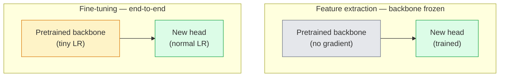

# Transfer Learning 与 Fine-Tuning

> 别人花了一百万 GPU 小时教会一个网络边缘、纹理和物体部件长什么样。训练自己的模型之前，你应该先借用这些特征。

**类型：** 构建
**语言：** Python
**前置要求：** 阶段 4 第 03 课（CNN），阶段 4 第 04 课（图像分类）
**时间：** ~75 分钟

## 学习目标

- 区分 feature extraction 和 fine-tuning，并根据数据集大小、domain distance 和计算预算选择正确方案
- 加载预训练 backbone，替换 classifier head，并在 20 行以内只训练 head 得到可工作的 baseline
- 用 discriminative learning rate 逐步解冻层，让早期通用特征比后期任务特定特征获得更小更新
- 诊断三类常见失败：解冻 block 上 LR 过高导致 feature drift、小数据集上 BN statistics collapse，以及 catastrophic forgetting

## 问题

在 ImageNet 上训练一个 ResNet-50 大约需要 2,000 GPU 小时。很少有团队能为他们上线的每个任务支付这个预算。几乎每个团队实际交付的，都是一个预训练 backbone，加上一个在几百或几千张任务特定图像上训练的新 head。

这不是捷径。任何 ImageNet-trained CNN 的第一个 conv block 都会学习边缘和类似 Gabor 的 filter。接下来的几个 block 学习纹理和简单 motif。中间 block 学习物体部件。最后 block 学习开始像 1,000 个 ImageNet 类别的组合。这个层级中的前 90% 几乎可以不变地迁移到医学影像、工业检测、卫星数据和其他每个视觉任务，因为自然界的边缘和纹理词汇有限。最后 10% 才是你真正要训练的部分。

做好 transfer 有三个 bug 在等你：用过高 learning rate 摧毁预训练特征，冻结太多导致模型信息不足，以及让 BatchNorm 的 running statistics 漂向一个很小的数据集，而网络其他部分从未从这个数据集学习过。本课会有意带你走过它们。

## 概念

### Feature extraction vs fine-tuning

两种 regime，取决于你多信任预训练特征，以及你有多少数据。



经验法则：

| 数据集大小 | Domain distance | 配方 |
|--------------|-----------------|--------|
| < 1k images | 接近 ImageNet | 冻结 backbone，只训练 head |
| 1k-10k | 接近 | 冻结前 2-3 个 stage，fine-tune 其余部分 |
| 10k-100k | 任意 | 用 discriminative LR 端到端 fine-tune |
| 100k+ | 远 | Fine-tune 全部；如果 domain 足够远，考虑从零训练 |

“接近 ImageNet” 大致意味着自然 RGB 照片，内容像物体。医学 CT、俯视卫星图像和显微镜图像都是远 domain：特征仍然有帮助，但你需要让更多层适应。

### 为什么 freezing 居然有效

CNN 学到的 ImageNet 特征并不只专门对应那 1,000 个类别。它们专门对应自然图像的统计规律：特定方向的边缘、纹理、对比模式、形状原语。这些统计规律在人类能命名的几乎所有视觉 domain 中都很稳定。这就是为什么一个在 ImageNet 上训练的模型，只换一个新的 linear head、backbone 不 fine-tune，就能在 CIFAR-10 上达到 80%+ accuracy。Head 学的是：对这个任务，应该如何加权那些已经学过的特征。

### Discriminative learning rates

当你解冻时，早期层应该比后期层训练得更慢。早期层编码你想保留的通用特征；后期层编码你需要大幅移动的任务特定结构。

```
Typical recipe:

  stage 0 (stem + first group): lr = base_lr / 100    (mostly fixed)
  stage 1:                       lr = base_lr / 10
  stage 2:                       lr = base_lr / 3
  stage 3 (last backbone group): lr = base_lr
  head:                          lr = base_lr  (or slightly higher)
```

在 PyTorch 中，这只是传给 optimizer 的 parameter groups 列表。一个模型，五个 learning rate，零额外代码。

### BatchNorm 问题

BN 层持有在 ImageNet 上计算出的 `running_mean` 和 `running_var` buffer。如果你的任务有不同的像素分布，比如不同光照、不同传感器、不同色彩空间，这些 buffer 就错了。按偏好顺序有三个选项：

1. **以 train mode fine-tune BN。** 让 BN 跟随其他部分一起更新 running statistics。任务数据集为中等大小（>= 5k examples）时的默认选择。
2. **把 BN 冻结在 eval mode。** 保留 ImageNet statistics，只训练权重。当数据集小到 BN moving average 会很噪时，这是正确做法。
3. **用 GroupNorm 替换 BN。** 完全移除 moving-average 问题。Detection 和 segmentation backbone 常用它，因为每块 GPU 的 batch size 很小。

弄错这一点会悄悄让 accuracy 掉 5-15%。

### Head 设计

Classifier head 是 1-3 个 linear layer 加可选 dropout。每个 torchvision backbone 都带一个你要替换的默认 head：

```
backbone.fc = nn.Linear(backbone.fc.in_features, num_classes)          # ResNet
backbone.classifier[1] = nn.Linear(..., num_classes)                    # EfficientNet, MobileNet
backbone.heads.head = nn.Linear(..., num_classes)                       # torchvision ViT
```

对小数据集，单个 linear layer 通常足够。当任务分布离 backbone 训练分布更远时，添加隐藏层（Linear -> ReLU -> Dropout -> Linear）会有帮助。

### Layer-wise LR decay

这是现代 fine-tuning（BEiT、DINOv2、ViT-B fine-tune）使用的更平滑版 discriminative LR。不是把层分成 stage，而是让每一层的 LR 都比它上面一层稍小：

```
lr_layer_k = base_lr * decay^(L - k)
```

当 decay = 0.75 且 L = 12 个 transformer block 时，第一个 block 的训练 LR 是 head LR 的 `0.75^11 ≈ 0.04x`。这对 transformer fine-tune 比对 CNN 更重要；CNN 通常用 stage-grouped LR 就够了。

### 要评估什么

Transfer-learning run 需要两个你不会在 scratch run 中跟踪的数字：

- **Pretrained-only accuracy**：backbone 冻结时 head 的 accuracy。这是你的下限。
- **Fine-tuned accuracy**：同一个模型端到端训练后的 accuracy。这是你的上限。

如果 fine-tuned 低于 pretrained-only，你有 learning-rate 或 BN bug。永远打印两者。

## 构建它

### 第 1 步：加载预训练 backbone 并检查它

```python
import torch
import torch.nn as nn
from torchvision.models import resnet18, ResNet18_Weights

backbone = resnet18(weights=ResNet18_Weights.IMAGENET1K_V1)
print(backbone)
print()
print("classifier head:", backbone.fc)
print("feature dim:", backbone.fc.in_features)
```

`ResNet18` 有四个 stage（`layer1..layer4`），外加一个 stem 和一个 `fc` head。每个 torchvision classification backbone 都有类似结构。

### 第 2 步：Feature extraction：冻结所有内容，替换 head

```python
def make_feature_extractor(num_classes=10):
    model = resnet18(weights=ResNet18_Weights.IMAGENET1K_V1)
    for p in model.parameters():
        p.requires_grad = False
    model.fc = nn.Linear(model.fc.in_features, num_classes)
    return model

model = make_feature_extractor(num_classes=10)
trainable = sum(p.numel() for p in model.parameters() if p.requires_grad)
frozen = sum(p.numel() for p in model.parameters() if not p.requires_grad)
print(f"trainable: {trainable:>10,}")
print(f"frozen:    {frozen:>10,}")
```

只有 `model.fc` 可训练。Backbone 是一个冻结的 feature extractor。

### 第 3 步：Discriminative fine-tuning

一个构建 parameter groups 的工具函数，每个 stage 使用特定 learning rate。

```python
def discriminative_param_groups(model, base_lr=1e-3, decay=0.3):
    stages = [
        ["conv1", "bn1"],
        ["layer1"],
        ["layer2"],
        ["layer3"],
        ["layer4"],
        ["fc"],
    ]
    groups = []
    for i, names in enumerate(stages):
        lr = base_lr * (decay ** (len(stages) - 1 - i))
        params = [p for n, p in model.named_parameters()
                  if any(n.startswith(k) for k in names)]
        if params:
            groups.append({"params": params, "lr": lr, "name": "_".join(names)})
    return groups

model = resnet18(weights=ResNet18_Weights.IMAGENET1K_V1)
model.fc = nn.Linear(model.fc.in_features, 10)
for p in model.parameters():
    p.requires_grad = True

groups = discriminative_param_groups(model)
for g in groups:
    print(f"{g['name']:>10s}  lr={g['lr']:.2e}  params={sum(p.numel() for p in g['params']):>8,}")
```

`decay=0.3` 意味着每个 stage 的训练速率是下一个 stage 的 30%。`fc` 得到 `base_lr`，`layer4` 得到 `0.3 * base_lr`，`conv1` 得到 `0.3^5 * base_lr ≈ 0.00243 * base_lr`。听起来极端；经验上有效。

### 第 4 步：BatchNorm 处理

冻结 BN running statistics 但不冻结其权重的 helper。

```python
def freeze_bn_stats(model):
    for m in model.modules():
        if isinstance(m, (nn.BatchNorm1d, nn.BatchNorm2d, nn.BatchNorm3d)):
            m.eval()
            for p in m.parameters():
                p.requires_grad = False
    return model
```

在每个 epoch 开头设置 `model.train()` 后调用它。`model.train()` 会把所有东西切到 training mode；这个函数只对 BN layer 把它反转回来。

### 第 5 步：最小端到端 fine-tuning loop

```python
from torch.optim import SGD
from torch.utils.data import DataLoader
from torch.optim.lr_scheduler import CosineAnnealingLR
import torch.nn.functional as F

def fine_tune(model, train_loader, val_loader, device, epochs=5, base_lr=1e-3, freeze_bn=False):
    model = model.to(device)
    groups = discriminative_param_groups(model, base_lr=base_lr)
    optimizer = SGD(groups, momentum=0.9, weight_decay=1e-4, nesterov=True)
    scheduler = CosineAnnealingLR(optimizer, T_max=epochs)

    for epoch in range(epochs):
        model.train()
        if freeze_bn:
            freeze_bn_stats(model)
        tr_loss, tr_correct, tr_total = 0.0, 0, 0
        for x, y in train_loader:
            x, y = x.to(device), y.to(device)
            logits = model(x)
            loss = F.cross_entropy(logits, y, label_smoothing=0.1)
            optimizer.zero_grad()
            loss.backward()
            optimizer.step()
            tr_loss += loss.item() * x.size(0)
            tr_total += x.size(0)
            tr_correct += (logits.argmax(-1) == y).sum().item()
        scheduler.step()

        model.eval()
        va_total, va_correct = 0, 0
        with torch.no_grad():
            for x, y in val_loader:
                x, y = x.to(device), y.to(device)
                pred = model(x).argmax(-1)
                va_total += x.size(0)
                va_correct += (pred == y).sum().item()
        print(f"epoch {epoch}  train {tr_loss/tr_total:.3f}/{tr_correct/tr_total:.3f}  "
              f"val {va_correct/va_total:.3f}")
    return model
```

用上面的配方在 CIFAR-10 上训练五个 epoch，会让 `ResNet18-IMAGENET1K_V1` 从约 70% zero-shot linear-probe accuracy 提升到约 93% fine-tuned accuracy。只训练 head、不碰 backbone 时，会在约 86% 处 plateau。

### 第 6 步：Progressive unfreezing

一个从末端向开头每个 epoch 解冻一个 stage 的 schedule。它会缓解 feature drift，代价是多一些 epoch。

```python
def progressive_unfreeze_schedule(model):
    stages = ["layer4", "layer3", "layer2", "layer1"]
    yielded = set()

    def start():
        for p in model.parameters():
            p.requires_grad = False
        for p in model.fc.parameters():
            p.requires_grad = True

    def unfreeze(epoch):
        if epoch < len(stages):
            name = stages[epoch]
            yielded.add(name)
            for n, p in model.named_parameters():
                if n.startswith(name):
                    p.requires_grad = True
            return name
        return None

    return start, unfreeze
```

第一个 epoch 前调用一次 `start()`。每个 epoch 开头调用 `unfreeze(epoch)`。只要可训练参数集合发生变化，就重建 optimizer，否则冻结参数仍然持有 cached moments，会让它困惑。

## 使用它

对大多数真实任务，`torchvision.models` + 三行代码就够了。上面的重型机制，是在你遇到库默认值无法修复的问题时才重要。

```python
from torchvision.models import resnet50, ResNet50_Weights

model = resnet50(weights=ResNet50_Weights.IMAGENET1K_V2)
model.fc = nn.Linear(model.fc.in_features, num_classes)
optimizer = torch.optim.AdamW(model.parameters(), lr=1e-4, weight_decay=1e-4)
```

另外两个 production-grade 默认选项：

- `timm` 提供约 800 个预训练 vision backbone，并有一致 API（`timm.create_model("resnet50", pretrained=True, num_classes=10)`）。只要 fine-tune 超出 torchvision zoo，它就是标准选择。
- 对 transformer，`transformers.AutoModelForImageClassification.from_pretrained(name, num_labels=N)` 会给你 ViT / BEiT / DeiT，并且加载语义与文本模型相同。

## 交付它

本课会产出：

- `outputs/prompt-fine-tune-planner.md`：一个 prompt，会根据数据集大小、domain distance 和计算预算，在 feature-extraction、progressive fine-tuning、end-to-end fine-tuning 之间选择。
- `outputs/skill-freeze-inspector.md`：一个 skill，给定 PyTorch model，会报告哪些参数可训练、哪些 BatchNorm layer 处于 eval mode，以及 optimizer 是否真的接收了可训练参数。

## 练习

1. **（简单）** 在同一个 synthetic-CIFAR 数据集上，把 `ResNet18` 作为 linear probe（backbone 冻结）训练，再做一次完整 fine-tune。并排报告两者 accuracy。解释哪个 gap 表示特征迁移良好，哪个 gap 表示迁移不好。
2. **（中等）** 故意引入一个 bug：把 backbone stage 上的 `base_lr` 设成 `1e-1`，而不是 head。展示 training loss 爆炸，然后用 `discriminative_param_groups` helper 恢复。记录每个 stage 开始发散的 LR。
3. **（困难）** 取一个医学影像数据集（例如 CheXpert-small、PatchCamelyon 或 HAM10000），比较三种 regime：（a）ImageNet-pretrained 冻结 backbone + linear head；（b）ImageNet-pretrained 端到端 fine-tune；（c）从零训练。报告每种方案的 accuracy 和计算成本。数据集多大时，scratch training 开始有竞争力？

## 关键术语

| 术语 | 人们常说 | 它实际意味着 |
|------|----------------|----------------------|
| Feature extraction | “冻结并训练 head” | Backbone 参数冻结，只有新的 classifier head 接收梯度 |
| Fine-tuning | “端到端重训” | 所有参数可训练，通常使用比 scratch training 小很多的 LR |
| Discriminative LR | “早期层更小 LR” | Optimizer parameter groups，其中早期 stage 的 LR 是后期 stage LR 的一小部分 |
| Layer-wise LR decay | “平滑 LR 梯度” | 每层 LR 乘以 decay^(L - k)；常见于 transformer fine-tune |
| Catastrophic forgetting | “模型丢掉了 ImageNet” | 过高 LR 在新任务信号学会之前覆盖了预训练特征 |
| BN statistics drift | “Running mean 错了” | BatchNorm running_mean/var 是在与当前任务不同的分布上计算的，会悄悄伤害 accuracy |
| Linear probe | “冻结 backbone + linear head” | 评估预训练特征，也就是冻结 representation 之上最佳 linear classifier 的 accuracy |
| Catastrophic collapse | “所有东西都预测成一个类” | 当 fine-tuning LR 高到在 head 梯度稳定之前摧毁特征时发生 |

## 延伸阅读

- [How transferable are features in deep neural networks? (Yosinski et al., 2014)](https://arxiv.org/abs/1411.1792)：量化特征跨层可迁移性的论文
- [Universal Language Model Fine-tuning (ULMFiT, Howard & Ruder, 2018)](https://arxiv.org/abs/1801.06146)：原始 discriminative LR / progressive unfreezing 配方；这些想法可以直接迁移到视觉
- [timm documentation](https://huggingface.co/docs/timm)：现代 vision backbone 的参考，以及它们训练时使用的精确 fine-tune 默认值
- [A Simple Framework for Linear-Probe Evaluation (Kornblith et al., 2019)](https://arxiv.org/abs/1805.08974)：为什么 linear-probe accuracy 重要，以及如何正确报告它
