# 目标检测：从零实现 YOLO

> Detection 是 classification 加 regression，在 feature map 的每个位置运行，然后用 non-maximum suppression 清理结果。

**类型：** 构建
**语言：** Python
**前置要求：** 阶段 4 第 03 课（CNN），阶段 4 第 04 课（图像分类），阶段 4 第 05 课（Transfer Learning）
**时间：** ~75 分钟

## 学习目标

- 解释把 detection 变成 dense prediction 问题的 grid-and-anchor 设计，并说明输出张量中每个数字的含义
- 计算 box 之间的 Intersection-over-Union，并从零实现 non-maximum suppression
- 在预训练 backbone 之上构建一个最小 YOLO-style head，包括 classification、objectness 和 box-regression losses
- 阅读 detection metric 行（precision@0.5、recall、mAP@0.5、mAP@0.5:0.95），并选择下一步该调哪个旋钮

## 问题

Classification 说：“这张图是一只狗。” Detection 说：“像素 (112, 40, 280, 210) 处有一只狗，(400, 180, 560, 310) 处有一只猫，画面里没有别的东西。” 这个结构变化，也就是预测可变数量的带标签 box，而不是每张图一个标签，是每个自动驾驶系统、每个监控产品、每个文档 layout parser、每条工厂视觉线都依赖的东西。

Detection 也是视觉中所有工程权衡同时出现的地方。你希望 box 准确（regression head），希望每个 box 的类别正确（classification head），希望模型知道什么时候没有东西可检测（objectness score），还希望每个真实物体恰好有一个预测（non-maximum suppression）。少掉任意一个，pipeline 要么漏掉物体，要么报告幻觉 box，要么用略微不同的位置对同一个物体预测十五次。

YOLO（You Only Look Once，Redmon 等，2016）用 conv net 的单次 forward pass 做完这一切，从而让它实时运行。相同的结构决策仍然是现代 detector 的骨架（YOLOv8、YOLOv9、YOLO-NAS、RT-DETR）。学会核心，每个变体都只是相同部件的重新排列。

## 概念

### Detection 作为 dense prediction

分类器每张图输出 C 个数字。YOLO-style detector 每张图输出 `(S x S x (5 + C))` 个数字，其中 S 是空间 grid size。

```mermaid
flowchart LR
    IMG["Input 416x416 RGB"] --> BB["Backbone<br/>(ResNet, DarkNet, ...)"]
    BB --> FM["Feature map<br/>(C_feat, 13, 13)"]
    FM --> HEAD["Detection head<br/>(1x1 convs)"]
    HEAD --> OUT["Output tensor<br/>(13, 13, B * (5 + C))"]
    OUT --> DEC["Decode<br/>(grid + sigmoid + exp)"]
    DEC --> NMS["Non-max suppression"]
    NMS --> RESULT["Final boxes"]

    style IMG fill:#dbeafe,stroke:#2563eb
    style HEAD fill:#fef3c7,stroke:#d97706
    style NMS fill:#fecaca,stroke:#dc2626
    style RESULT fill:#dcfce7,stroke:#16a34a
```



`S * S` 个 grid cell 中每个都会预测 `B` 个 box。对每个 box：

- 4 个数字描述几何：`tx, ty, tw, th`。
- 1 个数字是 objectness score：“这个 cell 中心处是否有物体？”
- C 个数字是类别概率。

每个 cell 总计：`B * (5 + C)`。对 VOC，若 `S=13, B=2, C=20`，每个 cell 就是 50 个数字。

### 为什么用 grid 和 anchor

朴素 regression 会为每个物体预测绝对坐标 `(x, y, w, h)`。这对 conv network 很难，因为平移图像不应该让所有预测都以同样方式平移，每个物体都应该有空间锚点。Grid 通过把每个 ground-truth box 分配给其中心所在的 grid cell 来解决这个问题；只有那个 cell 负责这个物体。

Anchor 解决第二个问题。3x3 conv 很难从 16 像素 receptive field 的 feature cell 中回归出一个 500 像素宽的 box。取而代之的是，我们为每个 cell 预定义 `B` 个先验 box 形状（anchors），并预测每个 anchor 的小 delta。模型学习选择正确 anchor 并微调它，而不是从零回归。

```
Anchor box priors (example for 416x416 input):

  small:   (30,  60)
  medium:  (75,  170)
  large:   (200, 380)

At each grid cell, every anchor emits (tx, ty, tw, th, obj, c_1, ..., c_C).
```

现代 detector 常用 FPN，在不同分辨率上使用不同 anchor set：浅层高分辨率 map 上用小 anchor，深层低分辨率 map 上用大 anchor。同一个想法，更多尺度。

### 解码预测

原始 `tx, ty, tw, th` 不是 box 坐标；它们是 regression target，必须先变换才能画出来：

```
centre x  = (sigmoid(tx) + cell_x) * stride
centre y  = (sigmoid(ty) + cell_y) * stride
width     = anchor_w * exp(tw)
height    = anchor_h * exp(th)
```

`sigmoid` 把中心偏移限制在 cell 内。`exp` 让宽度可以相对 anchor 自由缩放，而不会翻成负数。`stride` 把 grid 坐标缩放回像素。这个 decode step 从 YOLO v2 起就在每个 YOLO 版本里相同。

### IoU

Detection 中两个 box 之间的通用相似度指标：

```
IoU(A, B) = area(A intersect B) / area(A union B)
```

IoU = 1 表示完全相同；IoU = 0 表示无重叠。Prediction 和 ground-truth box 之间的 IoU 决定一个预测是否算 true positive（通常 IoU >= 0.5）。两个 prediction 之间的 IoU 是 NMS 用来去重的东西。

### Non-maximum suppression

在相邻 anchor 上训练的 conv network，经常会为同一个物体预测重叠 box。NMS 会保留最高置信度预测，并删除与它 IoU 高于阈值的其他预测。

```
NMS(boxes, scores, iou_threshold):
    sort boxes by score descending
    keep = []
    while boxes not empty:
        pick the top-scoring box, add to keep
        remove every box with IoU > iou_threshold to the picked box
    return keep
```

典型阈值：目标检测用 0.45。近期 detector 会用 `soft-NMS`、`DIoU-NMS`，或直接学习 suppression（RT-DETR），但结构目的相同。

### Loss

YOLO loss 是三个 loss 加权相加：

```
L = lambda_coord * L_box(pred, target, where obj=1)
  + lambda_obj   * L_obj(pred, 1,     where obj=1)
  + lambda_noobj * L_obj(pred, 0,     where obj=0)
  + lambda_cls   * L_cls(pred, target, where obj=1)
```

只有包含物体的 cell 会贡献 box-regression 和 classification loss。没有物体的 cell 只贡献 objectness loss（教模型保持沉默）。`lambda_noobj` 通常很小（~0.5），因为绝大多数 cell 都是空的，否则它们会主导总 loss。

现代变体会把 MSE box loss 换成 CIoU / DIoU（直接优化 IoU），用 focal loss 处理类别不平衡，并用 quality focal loss 平衡 objectness。三组件结构没有变化。

### Detection metrics

Accuracy 不能迁移到 detection。下面四个数字可以：

- **Precision@IoU=0.5**：在被计为 positive 的预测中，有多少真的正确。
- **Recall@IoU=0.5**：在真实物体中，我们找到了多少。
- **AP@0.5**：IoU threshold 为 0.5 时 precision-recall 曲线下面积；每个类别一个数字。
- **mAP@0.5:0.95**：在 IoU threshold 0.5、0.55、...、0.95 上平均 AP。COCO 指标；最严格也最有信息量。

四个都报告。一个 detector 如果 mAP@0.5 强但 mAP@0.5:0.95 弱，说明定位大致对但不够紧；用更好的 box-regression loss 修。高 precision 低 recall 的 detector 太保守；降低 confidence threshold 或增加 objectness weight。

## 构建它

### 第 1 步：IoU

整课的工作马。作用在两个 `(x1, y1, x2, y2)` 格式的 box 数组上。

```python
import numpy as np

def box_iou(boxes_a, boxes_b):
    ax1, ay1, ax2, ay2 = boxes_a[:, 0], boxes_a[:, 1], boxes_a[:, 2], boxes_a[:, 3]
    bx1, by1, bx2, by2 = boxes_b[:, 0], boxes_b[:, 1], boxes_b[:, 2], boxes_b[:, 3]

    inter_x1 = np.maximum(ax1[:, None], bx1[None, :])
    inter_y1 = np.maximum(ay1[:, None], by1[None, :])
    inter_x2 = np.minimum(ax2[:, None], bx2[None, :])
    inter_y2 = np.minimum(ay2[:, None], by2[None, :])

    inter_w = np.clip(inter_x2 - inter_x1, 0, None)
    inter_h = np.clip(inter_y2 - inter_y1, 0, None)
    inter = inter_w * inter_h

    area_a = (ax2 - ax1) * (ay2 - ay1)
    area_b = (bx2 - bx1) * (by2 - by1)
    union = area_a[:, None] + area_b[None, :] - inter
    return inter / np.clip(union, 1e-8, None)
```

返回一个 `(N_a, N_b)` 的 pairwise IoU 矩阵。与单个 ground-truth box 比较时，让其中一个数组 shape 为 `(1, 4)`。

### 第 2 步：Non-max suppression

```python
def nms(boxes, scores, iou_threshold=0.45):
    order = np.argsort(-scores)
    keep = []
    while len(order) > 0:
        i = order[0]
        keep.append(i)
        if len(order) == 1:
            break
        rest = order[1:]
        ious = box_iou(boxes[[i]], boxes[rest])[0]
        order = rest[ious <= iou_threshold]
    return np.array(keep, dtype=np.int64)
```

确定性，排序带来 `O(N log N)`，并且在相同输入上匹配 `torchvision.ops.nms` 的行为。

### 第 3 步：Box encoding 和 decoding

在像素坐标和网络实际回归的 `(tx, ty, tw, th)` target 之间转换。

```python
def encode(box_xyxy, cell_x, cell_y, stride, anchor_wh):
    x1, y1, x2, y2 = box_xyxy
    cx = 0.5 * (x1 + x2)
    cy = 0.5 * (y1 + y2)
    w = x2 - x1
    h = y2 - y1
    tx = cx / stride - cell_x
    ty = cy / stride - cell_y
    tw = np.log(w / anchor_wh[0] + 1e-8)
    th = np.log(h / anchor_wh[1] + 1e-8)
    return np.array([tx, ty, tw, th])


def decode(tx_ty_tw_th, cell_x, cell_y, stride, anchor_wh):
    tx, ty, tw, th = tx_ty_tw_th
    cx = (sigmoid(tx) + cell_x) * stride
    cy = (sigmoid(ty) + cell_y) * stride
    w = anchor_wh[0] * np.exp(tw)
    h = anchor_wh[1] * np.exp(th)
    return np.array([cx - w / 2, cy - h / 2, cx + w / 2, cy + h / 2])


def sigmoid(x):
    return 1.0 / (1.0 + np.exp(-x))
```

测试：encode 一个 box 再 decode，应该得到非常接近原始 box 的结果（当 `tx` 不在 post-sigmoid 范围内时，sigmoid inverse 不完全可逆，会有轻微差异）。

### 第 4 步：最小 YOLO head

Feature map 上的一个 1x1 conv，reshape 为 `(B, S, S, num_anchors, 5 + C)`。

```python
import torch
import torch.nn as nn

class YOLOHead(nn.Module):
    def __init__(self, in_c, num_anchors, num_classes):
        super().__init__()
        self.num_anchors = num_anchors
        self.num_classes = num_classes
        self.conv = nn.Conv2d(in_c, num_anchors * (5 + num_classes), kernel_size=1)

    def forward(self, x):
        n, _, h, w = x.shape
        y = self.conv(x)
        y = y.view(n, self.num_anchors, 5 + self.num_classes, h, w)
        y = y.permute(0, 3, 4, 1, 2).contiguous()
        return y
```

输出 shape：`(N, H, W, num_anchors, 5 + C)`。最后一维保存 `[tx, ty, tw, th, obj, cls_0, ..., cls_{C-1}]`。

### 第 5 步：Ground-truth assignment

对每个 ground-truth box，决定哪个 `(cell, anchor)` 负责。

```python
def assign_targets(boxes_xyxy, classes, anchors, stride, grid_size, num_classes):
    num_anchors = len(anchors)
    target = np.zeros((grid_size, grid_size, num_anchors, 5 + num_classes), dtype=np.float32)
    has_obj = np.zeros((grid_size, grid_size, num_anchors), dtype=bool)

    for box, cls in zip(boxes_xyxy, classes):
        x1, y1, x2, y2 = box
        cx, cy = 0.5 * (x1 + x2), 0.5 * (y1 + y2)
        gx, gy = int(cx / stride), int(cy / stride)
        bw, bh = x2 - x1, y2 - y1

        ious = np.array([
            (min(bw, aw) * min(bh, ah)) / (bw * bh + aw * ah - min(bw, aw) * min(bh, ah))
            for aw, ah in anchors
        ])
        best = int(np.argmax(ious))
        aw, ah = anchors[best]

        target[gy, gx, best, 0] = cx / stride - gx
        target[gy, gx, best, 1] = cy / stride - gy
        target[gy, gx, best, 2] = np.log(bw / aw + 1e-8)
        target[gy, gx, best, 3] = np.log(bh / ah + 1e-8)
        target[gy, gx, best, 4] = 1.0
        target[gy, gx, best, 5 + cls] = 1.0
        has_obj[gy, gx, best] = True
    return target, has_obj
```

Anchor selection 是“与 ground truth 的 shape IoU 最好”，这是一个便宜 proxy，匹配 YOLOv2/v3 assignment。v5 及后续版本使用更复杂的策略（task-aligned matching、dynamic k），是在细化同一个想法。

### 第 6 步：三个 loss

```python
def yolo_loss(pred, target, has_obj, lambda_coord=5.0, lambda_obj=1.0, lambda_noobj=0.5, lambda_cls=1.0):
    has_obj_t = torch.from_numpy(has_obj).bool()
    target_t = torch.from_numpy(target).float()

    # box-regression loss: only on cells with objects
    box_pred = pred[..., :4][has_obj_t]
    box_true = target_t[..., :4][has_obj_t]
    loss_box = torch.nn.functional.mse_loss(box_pred, box_true, reduction="sum")

    # objectness loss
    obj_pred = pred[..., 4]
    obj_true = target_t[..., 4]
    loss_obj_pos = torch.nn.functional.binary_cross_entropy_with_logits(
        obj_pred[has_obj_t], obj_true[has_obj_t], reduction="sum")
    loss_obj_neg = torch.nn.functional.binary_cross_entropy_with_logits(
        obj_pred[~has_obj_t], obj_true[~has_obj_t], reduction="sum")

    # classification loss on cells with objects
    cls_pred = pred[..., 5:][has_obj_t]
    cls_true = target_t[..., 5:][has_obj_t]
    loss_cls = torch.nn.functional.binary_cross_entropy_with_logits(
        cls_pred, cls_true, reduction="sum")

    total = (lambda_coord * loss_box
             + lambda_obj * loss_obj_pos
             + lambda_noobj * loss_obj_neg
             + lambda_cls * loss_cls)
    return total, {"box": loss_box.item(), "obj_pos": loss_obj_pos.item(),
                   "obj_neg": loss_obj_neg.item(), "cls": loss_cls.item()}
```

五个超参数，每个 YOLO 教程要么硬编码，要么 sweep。比例很重要：`lambda_coord=5, lambda_noobj=0.5` 复刻了原始 YOLOv1 论文，至今仍是合理默认值。

### 第 7 步：Inference pipeline

解码 raw head output，应用 sigmoid/exp，按 objectness 设阈值，然后 NMS。

```python
def postprocess(pred_tensor, anchors, stride, img_size, conf_threshold=0.25, iou_threshold=0.45):
    pred = pred_tensor.detach().cpu().numpy()
    grid_h, grid_w = pred.shape[1], pred.shape[2]
    num_anchors = len(anchors)

    boxes, scores, classes = [], [], []
    for gy in range(grid_h):
        for gx in range(grid_w):
            for a in range(num_anchors):
                tx, ty, tw, th, obj, *cls = pred[0, gy, gx, a]
                score = sigmoid(obj) * sigmoid(np.array(cls)).max()
                if score < conf_threshold:
                    continue
                cls_idx = int(np.argmax(cls))
                cx = (sigmoid(tx) + gx) * stride
                cy = (sigmoid(ty) + gy) * stride
                w = anchors[a][0] * np.exp(tw)
                h = anchors[a][1] * np.exp(th)
                boxes.append([cx - w / 2, cy - h / 2, cx + w / 2, cy + h / 2])
                scores.append(float(score))
                classes.append(cls_idx)

    if not boxes:
        return np.zeros((0, 4)), np.zeros((0,)), np.zeros((0,), dtype=int)
    boxes = np.array(boxes)
    scores = np.array(scores)
    classes = np.array(classes)
    keep = nms(boxes, scores, iou_threshold)
    return boxes[keep], scores[keep], classes[keep]
```

这就是完整 eval path：head -> decode -> threshold -> NMS。

## 使用它

`torchvision.models.detection` 提供了具有相同概念结构的生产 detector。加载预训练模型只需要三行。

```python
import torch
from torchvision.models.detection import fasterrcnn_resnet50_fpn_v2

model = fasterrcnn_resnet50_fpn_v2(weights="DEFAULT")
model.eval()
with torch.no_grad():
    predictions = model([torch.randn(3, 400, 600)])
print(predictions[0].keys())
print(f"boxes:  {predictions[0]['boxes'].shape}")
print(f"scores: {predictions[0]['scores'].shape}")
print(f"labels: {predictions[0]['labels'].shape}")
```

对实时 inference pipeline，`ultralytics`（YOLOv8/v9）是标准：`from ultralytics import YOLO; model = YOLO('yolov8n.pt'); model(img)`。模型内部处理 decoding 和 NMS，并返回与你上面构建的相同 `boxes / scores / labels` 三元组。

## 交付它

本课会产出：

- `outputs/prompt-detection-metric-reader.md`：一个 prompt，把 `precision, recall, AP, mAP@0.5:0.95` 行转换成一行诊断，以及最有用的下一个实验。
- `outputs/skill-anchor-designer.md`：一个 skill，给定 ground-truth box 数据集，会在 `(w, h)` 上运行 k-means，并返回每个 FPN level 的 anchor set，以及选择 anchor 数量所需的 coverage statistics。

## 练习

1. **（简单）** 实现 `box_iou`，并在 1,000 对随机 box 上与 `torchvision.ops.box_iou` 对比。验证最大绝对差低于 `1e-6`。
2. **（中等）** 把 `yolo_loss` 改成使用 `CIoU` box loss，而不是 MSE。在 100 张图的合成数据集上展示，在相同 epoch 数下，CIoU 收敛到比 MSE 更好的最终 mAP@0.5:0.95。
3. **（困难）** 实现 multi-scale inference：以三种分辨率把同一张图送入模型，合并 box predictions，并在最后运行一次 NMS。在 held-out set 上测量相对 single-scale inference 的 mAP 提升。

## 关键术语

| 术语 | 人们常说 | 它实际意味着 |
|------|----------------|----------------------|
| Anchor | “Box prior” | 每个 grid cell 上预定义的 box 形状，网络从它预测 delta，而不是预测绝对坐标 |
| IoU | “Overlap” | 两个 box 的 intersection-over-union；detection 中的通用相似度度量 |
| NMS | “Deduplicate” | 贪心算法，保留最高分预测，并移除重叠超过阈值的预测 |
| Objectness | “这里有没有东西” | 每个 anchor、每个 cell 的标量，预测该 cell 中心是否有物体 |
| Grid stride | “Downsample factor” | 每个 grid cell 对应的像素数；416-px 输入配 13-grid head 时 stride 为 32 |
| mAP | “Mean average precision” | precision-recall 曲线下面积的平均值，在类别上取平均，并且对 COCO 还会在 IoU 阈值上取平均 |
| AP@0.5 | “PASCAL VOC AP” | IoU threshold 为 0.5 的 average precision；更宽松版本的指标 |
| mAP@0.5:0.95 | “COCO AP” | 对 0.5..0.95、步长 0.05 的 IoU threshold 取平均；更严格版本，也是当前社区标准 |

## 延伸阅读

- [YOLOv1: You Only Look Once (Redmon et al., 2016)](https://arxiv.org/abs/1506.02640)：奠基论文；之后每个 YOLO 都是对这个结构的细化
- [YOLOv3 (Redmon & Farhadi, 2018)](https://arxiv.org/abs/1804.02767)：引入 multi-scale FPN-style head 的论文；图示至今最清楚
- [Ultralytics YOLOv8 docs](https://docs.ultralytics.com)：当前生产参考；覆盖数据集格式、augmentation、训练配方
- [The Illustrated Guide to Object Detection (Jonathan Hui)](https://jonathan-hui.medium.com/object-detection-series-24d03a12f904)：完整 detector zoo 的最佳通俗导览；对理解 DETR、RetinaNet、FCOS 和 YOLO 的关系极有价值
