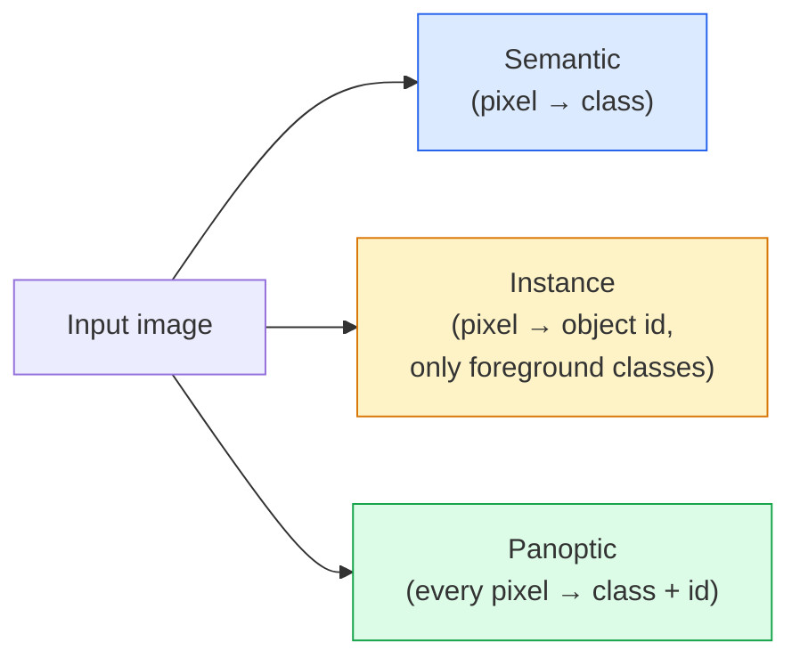
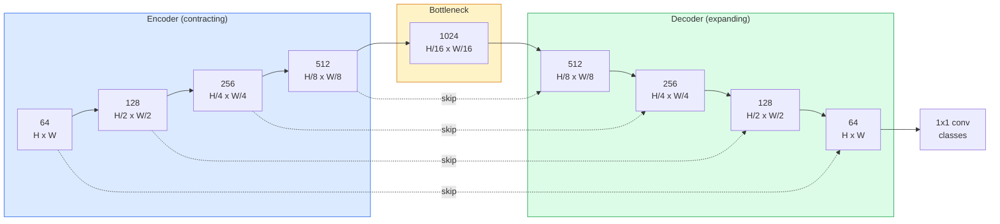

# 语义分割：U-Net

> Segmentation 是每个像素上的 classification。U-Net 通过把 downsampling encoder 与 upsampling decoder 配对，并在两者之间接 skip connections，让它可行。

**类型：** 构建
**语言：** Python
**前置要求：** 阶段 4 第 03 课（CNN），阶段 4 第 04 课（图像分类）
**时间：** ~75 分钟

## 学习目标

- 区分 semantic、instance 和 panoptic segmentation，并为给定问题选择正确任务
- 用 PyTorch 从零构建 U-Net，包括 encoder blocks、bottleneck、带 transposed convolution 的 decoder 和 skip connections
- 实现 pixel-wise cross-entropy、Dice loss，以及医学和工业 segmentation 当前默认的 combined loss
- 读取每个类别的 IoU 和 Dice 指标，并诊断低分来自 small-object recall、boundary accuracy 还是 class imbalance

## 问题

Classification 每张图输出一个标签。Detection 每张图输出几个 box。Segmentation 每个像素输出一个标签。对大小为 `H x W` 的输入，输出是一个 shape 为 `H x W`（semantic）或 `H x W x N_instances`（instance）的张量。这是每张图数百万个预测，而不是一个。

Segmentation 的结构解释了为什么它驱动着几乎所有 dense-prediction 视觉产品：医学影像（肿瘤 mask）、自动驾驶（道路、车道、障碍物）、卫星（建筑 footprint、作物边界）、文档解析（layout zones）、机器人（可抓取区域）。这些任务都不能靠给物体画一个 box 解决；它们需要精确轮廓。

架构问题很容易说清楚，但不容易解决：你需要网络同时看到图像的全局上下文（这是什么场景）和局部像素细节（到底哪个像素是 road，哪个是 pavement）。标准 CNN 会压缩空间维度来获得上下文，这会丢掉细节。U-Net 是同时获得两者的设计。

## 概念

### Semantic vs instance vs panoptic



- **Semantic** 说“这个像素是 road，那个像素是 car”。相邻的两辆车会合并成一个 blob。
- **Instance** 说“这个像素是 car #3，那个像素是 car #5”。忽略背景 stuff（“stuff” = sky、road、grass）。
- **Panoptic** 统一两者：每个像素都有 class label，每个 instance 都有唯一 id，stuff 和 things 都被分割。

本课覆盖 semantic。下一课（Mask R-CNN）覆盖 instance。

### U-Net 形状



Encoder 会把空间分辨率减半四次，同时把通道数翻倍。Decoder 反过来：把空间分辨率翻倍四次，同时把通道数减半。Skip connections 会在每个分辨率上把匹配的 encoder features 与 decoder features concat。最终 1x1 conv 在完整分辨率上把 `64 -> num_classes`。

为什么 skip connections 是必要的：当 decoder 试图输出像素级预测时，它只看过很小的 feature map。如果没有 skips，它无法准确定位边缘，因为这些信息已经在 encoder 中被压缩掉。Skip connections 把 encoder 下采样途中计算出的高分辨率 feature map 交给它。

### Transposed vs bilinear upsample

Decoder 必须扩展空间维度。有两个选择：

- **Transposed convolution**（`nn.ConvTranspose2d`）：可学习 upsample。历史上的 U-Net 默认。若 stride 和 kernel size 不能整除，可能产生 checkerboard artifacts。
- **Bilinear upsample + 3x3 conv**：平滑 upsample 后接一个 conv。伪影更少，参数更少，现在是现代默认。

两者都能在野外见到。对第一个 U-Net，bilinear 更稳。

### 像素网格上的 cross-entropy

对 C 类 semantic segmentation，模型输出是 `(N, C, H, W)`。Target 是 `(N, H, W)`，其中包含整数 class ID。Cross-entropy 与分类情形相同，只是应用到每个空间位置：

```
Loss = mean over (n, h, w) of -log( softmax(logits[n, :, h, w])[target[n, h, w]] )
```

PyTorch 中的 `F.cross_entropy` 原生处理这个 shape。不需要 reshape。

### Dice loss 以及为什么需要它

Cross-entropy 平等对待每个像素。当某个类别支配画面时，这是错的（医学影像：99% 背景，1% 肿瘤）。网络可以通过处处预测背景拿到 99% accuracy，但仍然毫无用处。

Dice loss 通过直接优化预测 mask 和真实 mask 之间的 overlap 来解决这个问题：

```
Dice(p, y) = 2 * sum(p * y) / (sum(p) + sum(y) + epsilon)
Dice_loss = 1 - Dice
```

其中 `p` 是某个类别的 sigmoid/softmax probability map，`y` 是二值 ground-truth mask。只有 overlap 完美时 loss 才为零。因为它基于比例，class imbalance 不再相关。

实践中，使用 **combined loss**：

```
L = L_cross_entropy + lambda * L_dice       (lambda ~ 1)
```

Cross-entropy 在训练早期提供稳定梯度；Dice 会在训练后段专注于真正匹配 mask 形状。这个组合是医学影像默认方案，也很难在任何类别不平衡数据集上被击败。

### 评估指标

- **Pixel accuracy**：预测正确的像素百分比。便宜。对不平衡数据坏掉的原因和 classification 中的 accuracy 相同。
- **IoU per class**：每个类别 mask 的 intersection over union；跨类别平均 = mIoU。
- **Dice（像素上的 F1）**：类似 IoU；`Dice = 2 * IoU / (1 + IoU)`。医学影像社区偏爱 Dice，自动驾驶社区偏爱 IoU；它们单调相关。
- **Boundary F1**：衡量预测边界与 ground-truth 边界有多近，即使小位移也会被惩罚。对半导体检测这类高精度任务很重要。

报告每类 IoU，不要只报告 mIoU。Mean IoU 会隐藏一个 15% 的类别，如果其他九个类别都在 85%。

### 输入分辨率权衡

U-Net 的 encoder 会把分辨率减半四次，所以输入必须能被 16 整除。医学图像常常是 512x512 或 1024x1024。自动驾驶 crop 常是 2048x1024。U-Net 的内存成本随 `H * W * C_max` 缩放，在 1024x1024 且 bottleneck 通道数为 1024 时，forward pass 已经会使用数 GB VRAM。

两个标准 workaround：
1. 切 tile：处理带重叠的 256x256 tile，然后 stitch。
2. 用 dilated convolution 替换 bottleneck，保持更高空间分辨率，同时扩大 receptive field（DeepLab 家族）。

对第一个模型，256x256 输入和 64-channel-base U-Net 可以在 8 GB VRAM 上舒服训练。

## 构建它

### 第 1 步：Encoder block

两个 3x3 conv，配 batch norm 和 ReLU。第一个 conv 改变通道数；第二个保持通道数。

```python
import torch
import torch.nn as nn
import torch.nn.functional as F

class DoubleConv(nn.Module):
    def __init__(self, in_c, out_c):
        super().__init__()
        self.net = nn.Sequential(
            nn.Conv2d(in_c, out_c, kernel_size=3, padding=1, bias=False),
            nn.BatchNorm2d(out_c),
            nn.ReLU(inplace=True),
            nn.Conv2d(out_c, out_c, kernel_size=3, padding=1, bias=False),
            nn.BatchNorm2d(out_c),
            nn.ReLU(inplace=True),
        )

    def forward(self, x):
        return self.net(x)
```

这个 block 会在全网复用。`bias=False` 是因为 BN 的 beta 已经处理 bias。

### 第 2 步：Down 和 up blocks

```python
class Down(nn.Module):
    def __init__(self, in_c, out_c):
        super().__init__()
        self.net = nn.Sequential(
            nn.MaxPool2d(2),
            DoubleConv(in_c, out_c),
        )

    def forward(self, x):
        return self.net(x)


class Up(nn.Module):
    def __init__(self, in_c, out_c):
        super().__init__()
        self.up = nn.Upsample(scale_factor=2, mode="bilinear", align_corners=False)
        self.conv = DoubleConv(in_c, out_c)

    def forward(self, x, skip):
        x = self.up(x)
        if x.shape[-2:] != skip.shape[-2:]:
            x = F.interpolate(x, size=skip.shape[-2:], mode="bilinear", align_corners=False)
        x = torch.cat([skip, x], dim=1)
        return self.conv(x)
```

只检查空间 shape（`shape[-2:]`），可以处理维度不能被 16 整除的输入；安全的 `F.interpolate` 会在 concat 前对齐 tensor。比较完整 shape 还会在通道数差异上触发，而通道数差异应该是响亮的错误，不该被静默 interpolate。

### 第 3 步：U-Net

```python
class UNet(nn.Module):
    def __init__(self, in_channels=3, num_classes=2, base=64):
        super().__init__()
        self.inc = DoubleConv(in_channels, base)
        self.d1 = Down(base, base * 2)
        self.d2 = Down(base * 2, base * 4)
        self.d3 = Down(base * 4, base * 8)
        self.d4 = Down(base * 8, base * 16)
        self.u1 = Up(base * 16 + base * 8, base * 8)
        self.u2 = Up(base * 8 + base * 4, base * 4)
        self.u3 = Up(base * 4 + base * 2, base * 2)
        self.u4 = Up(base * 2 + base, base)
        self.outc = nn.Conv2d(base, num_classes, kernel_size=1)

    def forward(self, x):
        x1 = self.inc(x)
        x2 = self.d1(x1)
        x3 = self.d2(x2)
        x4 = self.d3(x3)
        x5 = self.d4(x4)
        x = self.u1(x5, x4)
        x = self.u2(x, x3)
        x = self.u3(x, x2)
        x = self.u4(x, x1)
        return self.outc(x)

net = UNet(in_channels=3, num_classes=2, base=32)
x = torch.randn(1, 3, 256, 256)
print(f"output: {net(x).shape}")
print(f"params: {sum(p.numel() for p in net.parameters()):,}")
```

输出 shape `(1, 2, 256, 256)`，也就是与输入相同的空间尺寸，`num_classes` 个通道。`base=32` 时约 770 万参数。

### 第 4 步：Losses

```python
def dice_loss(logits, targets, num_classes, eps=1e-6):
    probs = F.softmax(logits, dim=1)
    targets_one_hot = F.one_hot(targets, num_classes).permute(0, 3, 1, 2).float()
    dims = (0, 2, 3)
    intersection = (probs * targets_one_hot).sum(dim=dims)
    denom = probs.sum(dim=dims) + targets_one_hot.sum(dim=dims)
    dice = (2 * intersection + eps) / (denom + eps)
    return 1 - dice.mean()


def combined_loss(logits, targets, num_classes, lam=1.0):
    ce = F.cross_entropy(logits, targets)
    dc = dice_loss(logits, targets, num_classes)
    return ce + lam * dc, {"ce": ce.item(), "dice": dc.item()}
```

Dice 逐类别计算后取平均（macro Dice）。`eps` 会避免 batch 中缺失类别时除以零。

### 第 5 步：IoU metric

```python
@torch.no_grad()
def iou_per_class(logits, targets, num_classes):
    preds = logits.argmax(dim=1)
    ious = torch.zeros(num_classes)
    for c in range(num_classes):
        pred_c = (preds == c)
        true_c = (targets == c)
        inter = (pred_c & true_c).sum().float()
        union = (pred_c | true_c).sum().float()
        ious[c] = (inter / union) if union > 0 else torch.tensor(float("nan"))
    return ious
```

返回长度为 C 的向量。`nan` 标记 batch 中不存在的类别；计算 mIoU 时不要把这些类别平均进去。

### 第 6 步：用于端到端验证的合成数据集

在彩色背景上生成形状，让网络必须学习形状，而不是像素颜色。

```python
import numpy as np
from torch.utils.data import Dataset, DataLoader

def synthetic_segmentation(num_samples=200, size=64, seed=0):
    rng = np.random.default_rng(seed)
    images = np.zeros((num_samples, size, size, 3), dtype=np.float32)
    masks = np.zeros((num_samples, size, size), dtype=np.int64)
    for i in range(num_samples):
        bg = rng.uniform(0, 1, (3,))
        images[i] = bg
        masks[i] = 0
        num_shapes = rng.integers(1, 4)
        for _ in range(num_shapes):
            cls = int(rng.integers(1, 3))
            color = rng.uniform(0, 1, (3,))
            cx, cy = rng.integers(10, size - 10, size=2)
            r = int(rng.integers(4, 12))
            yy, xx = np.meshgrid(np.arange(size), np.arange(size), indexing="ij")
            if cls == 1:
                mask = (xx - cx) ** 2 + (yy - cy) ** 2 < r ** 2
            else:
                mask = (np.abs(xx - cx) < r) & (np.abs(yy - cy) < r)
            images[i][mask] = color
            masks[i][mask] = cls
        images[i] += rng.normal(0, 0.02, images[i].shape)
        images[i] = np.clip(images[i], 0, 1)
    return images, masks


class SegDataset(Dataset):
    def __init__(self, images, masks):
        self.images = images
        self.masks = masks

    def __len__(self):
        return len(self.images)

    def __getitem__(self, i):
        img = torch.from_numpy(self.images[i]).permute(2, 0, 1).float()
        mask = torch.from_numpy(self.masks[i]).long()
        return img, mask
```

三个类别：background (0)、circles (1)、squares (2)。网络必须学习区分形状。

### 第 7 步：训练循环

```python
def train_one_epoch(model, loader, optimizer, device, num_classes):
    model.train()
    loss_sum, total = 0.0, 0
    iou_sum = torch.zeros(num_classes)
    for x, y in loader:
        x, y = x.to(device), y.to(device)
        logits = model(x)
        loss, _ = combined_loss(logits, y, num_classes)
        optimizer.zero_grad()
        loss.backward()
        optimizer.step()
        loss_sum += loss.item() * x.size(0)
        total += x.size(0)
        iou_sum += iou_per_class(logits, y, num_classes).nan_to_num(0)
    return loss_sum / total, iou_sum / len(loader)
```

在合成数据集上运行 10-30 个 epoch，观察 shape classes 的 mIoU 爬过 0.9。注意 `nan_to_num(0)` 会把 batch 中缺失的类别当作零；要得到准确的 per-class IoU，应在评估时按 presence 做 mask，并跨 batch 使用 `torch.nanmean`，而不是在这里平均。

## 使用它

生产中，`segmentation_models_pytorch`（“smp”）会把每个标准 segmentation 架构和任意 torchvision 或 timm backbone 封装起来。三行：

```python
import segmentation_models_pytorch as smp

model = smp.Unet(
    encoder_name="resnet34",
    encoder_weights="imagenet",
    in_channels=3,
    classes=3,
)
```

真实工作中还值得知道：
- **DeepLabV3+** 用 dilated conv 替换基于 max-pool 的 downsampling，让 bottleneck 保持分辨率；在卫星和驾驶数据上边界更快。
- **SegFormer** 把 conv encoder 换成 hierarchical transformer；是许多 benchmark 上的当前 SOTA。
- **Mask2Former** / **OneFormer** 用一个架构统一 semantic、instance 和 panoptic segmentation。

三者都可以在 `smp` 或 `transformers` 中以相同 data loader 作为 drop-in replacement。

## 交付它

本课会产出：

- `outputs/prompt-segmentation-task-picker.md`：一个 prompt，会在 semantic、instance 和 panoptic segmentation 之间选择，并为给定任务命名架构。
- `outputs/skill-segmentation-mask-inspector.md`：一个 skill，会报告 class distribution、predicted-mask statistics，以及哪些类别 under-predicted 或 boundary-blurred。

## 练习

1. **（简单）** 为 binary segmentation 任务（foreground vs background）实现 `bce_dice_loss`。在合成二分类数据集上验证，当 foreground 只占 5% 像素时，combined loss 比单独 BCE 收敛更快。
2. **（中等）** 用 `nn.ConvTranspose2d` up-block 替换 `nn.Upsample + conv` up-block。在合成数据集上训练两者并比较 mIoU。观察 transposed-conv 版本在哪里出现 checkerboard artifacts。
3. **（困难）** 取一个真实 segmentation 数据集（Oxford-IIIT Pets、Cityscapes mini split 或医学子集），把 U-Net 训练到距离 `smp.Unet` 参考结果 2 个 IoU 点以内。报告 per-class IoU，并识别哪些类别从把 Dice 加到 loss 中获益最大。

## 关键术语

| 术语 | 人们常说 | 它实际意味着 |
|------|----------------|----------------------|
| Semantic segmentation | “标记每个像素” | 对每个像素分类到 C 个类别；同类别的 instances 会合并 |
| Instance segmentation | “标记每个物体” | 分离同类别的不同实例；只处理前景 |
| Panoptic segmentation | “Semantic + instance” | 每个像素有 class；每个 thing instance 也有唯一 id |
| Skip connection | “U-Net bridge” | 把 encoder features concat 到匹配分辨率的 decoder features 中；保留高频细节 |
| Transposed conv | “Deconvolution” | 可学习 upsampling；可能产生 checkerboard artifacts |
| Dice loss | “Overlap loss” | 1 - 2|A ∩ B| / (|A| + |B|)；直接优化 mask overlap，并且对 class imbalance 稳健 |
| mIoU | “Mean intersection over union” | 跨类别平均 IoU；segmentation 的社区标准指标 |
| Boundary F1 | “Boundary accuracy” | 只在边界像素上计算的 F1 score；对精度关键任务很重要 |

## 延伸阅读

- [U-Net: Convolutional Networks for Biomedical Image Segmentation (Ronneberger et al., 2015)](https://arxiv.org/abs/1505.04597)：原始论文；所有人复制的图在第 2 页
- [Fully Convolutional Networks (Long et al., 2015)](https://arxiv.org/abs/1411.4038)：第一篇把 segmentation 做成端到端 conv 问题的论文
- [segmentation_models_pytorch](https://github.com/qubvel/segmentation_models.pytorch)：生产 segmentation 参考；每个标准架构加每个标准 loss
- [Lessons learned from training SOTA segmentation (kaggle.com competitions)](https://www.kaggle.com/code/iafoss/carvana-unet-pytorch)：关于为什么 TTA、pseudo-labeling 和 class weights 在真实数据上重要的 walkthrough
