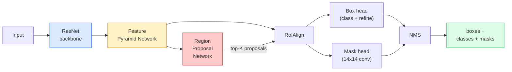

# 实例分割：Mask R-CNN

> 给 Faster R-CNN detector 加一个很小的 mask branch，你就得到了 instance segmentation。困难部分是 RoIAlign，而且它比看起来更难。

**类型：** 构建 + 学习
**语言：** Python
**前置要求：** 阶段 4 第 06 课（YOLO），阶段 4 第 07 课（U-Net）
**时间：** ~75 分钟

## 学习目标

- 端到端追踪 Mask R-CNN 架构：backbone、FPN、RPN、RoIAlign、box head、mask head
- 从零实现 RoIAlign，并解释为什么 RoIPool 不再被使用
- 使用 torchvision `maskrcnn_resnet50_fpn_v2` 预训练模型获得生产质量 instance masks，并正确读取其输出格式
- 通过替换 box 和 mask heads 并保持 backbone 冻结，在小型自定义数据集上 fine-tune Mask R-CNN

## 问题

Semantic segmentation 给你每个类别一个 mask。Instance segmentation 给你每个物体一个 mask，即使两个物体属于同一类别。计数个体、跨帧跟踪、测量物体（墙中每块砖的 bounding box、显微图像中每个细胞）都要求 instance segmentation。

Mask R-CNN（He 等，2017）通过把 instance segmentation 重构成 detection-plus-a-mask 解决了这个问题。这个设计太干净了，以至于接下来五年里几乎每篇 instance segmentation 论文都是 Mask R-CNN 变体，而 torchvision 实现至今仍是中小数据集的生产默认。

困难的工程问题是采样：如何从一个角点不对齐像素边界的 proposal box 中裁出固定大小的 feature region？弄错这一点会处处损失十分之几的 mAP。RoIAlign 就是答案。

## 概念

### 架构



需要理解五个部件：

1. **Backbone**：在 ImageNet 上训练的 ResNet-50 或 ResNet-101。产生 stride 为 4、8、16、32 的 feature map 层级。
2. **FPN（Feature Pyramid Network）**：top-down + lateral connections，让每个 level 都有 C 个语义丰富的 feature 通道。Detection 查询与物体尺寸匹配的 FPN level。
3. **RPN（Region Proposal Network）**：一个小 conv head，在每个 anchor 位置预测“这里有没有物体？”以及“如何 refine box？”。每张图产生约 1000 个 proposals。
4. **RoIAlign**：从任意 FPN level 上的任意 box 采样固定大小（例如 7x7）的 feature patch。Bilinear sampling，无 quantisation。
5. **Heads**：两层 box head，用来 refine box 并选择 class；加一个小 conv head，为每个 proposal 输出一个 `28x28` binary mask。

### 为什么用 RoIAlign，而不是 RoIPool

原始 Fast R-CNN 使用 RoIPool：把 proposal box 分成网格，在每个 cell 中取最大 feature，并把所有坐标四舍五入到整数。这种舍入会让 feature map 和输入像素坐标之间最多错位一个完整 feature-map 像素；在 224x224 图像上不大，但当 feature map stride 为 32 时是灾难。

```
RoIPool:
  box (34.7, 51.3, 98.2, 142.9)
  round -> (34, 51, 98, 142)
  split grid -> round each cell boundary
  misalignment accumulates at every step

RoIAlign:
  box (34.7, 51.3, 98.2, 142.9)
  sample at exact float coordinates using bilinear interpolation
  no rounding anywhere
```

RoIAlign 在 COCO 上免费提升 3-4 点 mask AP。每个关心定位的 detector 现在都会用它，YOLOv7 seg、RT-DETR、Mask2Former 都一样。

### 用一段话理解 RPN

在 feature map 的每个位置，放 K 个不同大小和形状的 anchor box。为每个 anchor 预测 objectness score，以及一个把 anchor 变成更贴合 box 的 regression offset。按分数保留前约 1,000 个 box，以 IoU 0.7 做 NMS，并把保留下来的 proposal 交给 heads。RPN 用自己的 mini-loss 训练，结构与第 6 课的 YOLO loss 相同，只是只有两个类别（object / no object）。

### Mask head

对每个 proposal（经过 RoIAlign 后），mask head 是一个小 FCN：四个 3x3 conv，一个 2x deconv，最终一个 1x1 conv，在 `28x28` 分辨率上产生 `num_classes` 个输出通道。只保留与预测类别对应的通道；其他通道被忽略。这会把 mask prediction 与 classification 解耦。

把 28x28 mask upsample 到 proposal 的原始像素大小，就得到最终 binary mask。

### Losses

Mask R-CNN 有四类 loss 相加：

```
L = L_rpn_cls + L_rpn_box + L_box_cls + L_box_reg + L_mask
```

- `L_rpn_cls`、`L_rpn_box`：RPN proposals 的 objectness + box regression。
- `L_box_cls`：head classifier 上的 (C+1) 类 cross-entropy（包括 background）。
- `L_box_reg`：head box refinement 上的 smooth L1。
- `L_mask`：28x28 mask output 上的 per-pixel binary cross-entropy。

每个 loss 都有自己的默认权重；torchvision 实现会通过构造参数暴露它们。

### 输出格式

`torchvision.models.detection.maskrcnn_resnet50_fpn_v2` 返回一个 list of dicts，每张图一个 dict：

```
{
    "boxes":  (N, 4) in (x1, y1, x2, y2) pixel coordinates,
    "labels": (N,) class IDs, 0 = background so indices are 1-based,
    "scores": (N,) confidence scores,
    "masks":  (N, 1, H, W) float masks in [0, 1] — threshold at 0.5 for binary,
}
```

Mask 已经是完整图像分辨率。28x28 head output 已在内部 upsample。

## 构建它

### 第 1 步：从零实现 RoIAlign

Mask R-CNN 中这个组件，用代码比用文字更容易理解。

```python
import torch
import torch.nn.functional as F

def roi_align_single(feature, box, output_size=7, spatial_scale=1 / 16.0):
    """
    feature: (C, H, W) single-image feature map
    box: (x1, y1, x2, y2) in original image pixel coordinates
    output_size: side of the output grid (7 for box head, 14 for mask head)
    spatial_scale: reciprocal of the feature map stride
    """
    C, H, W = feature.shape
    x1, y1, x2, y2 = [c * spatial_scale - 0.5 for c in box]
    bin_w = (x2 - x1) / output_size
    bin_h = (y2 - y1) / output_size

    grid_y = torch.linspace(y1 + bin_h / 2, y2 - bin_h / 2, output_size)
    grid_x = torch.linspace(x1 + bin_w / 2, x2 - bin_w / 2, output_size)
    yy, xx = torch.meshgrid(grid_y, grid_x, indexing="ij")

    gx = 2 * (xx + 0.5) / W - 1
    gy = 2 * (yy + 0.5) / H - 1
    grid = torch.stack([gx, gy], dim=-1).unsqueeze(0)
    sampled = F.grid_sample(feature.unsqueeze(0), grid, mode="bilinear",
                            align_corners=False)
    return sampled.squeeze(0)
```

每个数字都位于 bilinear-sampled 位置。没有 rounding，没有 quantisation，没有丢掉梯度。

### 第 2 步：与 torchvision 的 RoIAlign 对比

```python
from torchvision.ops import roi_align

feature = torch.randn(1, 16, 50, 50)
boxes = torch.tensor([[0, 10, 20, 100, 90]], dtype=torch.float32)  # (batch_idx, x1, y1, x2, y2)

ours = roi_align_single(feature[0], boxes[0, 1:].tolist(), output_size=7, spatial_scale=1/4)
theirs = roi_align(feature, boxes, output_size=(7, 7), spatial_scale=1/4, sampling_ratio=1, aligned=True)[0]

print(f"shape ours:   {tuple(ours.shape)}")
print(f"shape theirs: {tuple(theirs.shape)}")
print(f"max|diff|:    {(ours - theirs).abs().max().item():.3e}")
```

在 `sampling_ratio=1` 且 `aligned=True` 时，两者会在 `1e-5` 以内匹配。

### 第 3 步：加载预训练 Mask R-CNN

```python
import torch
from torchvision.models.detection import maskrcnn_resnet50_fpn_v2, MaskRCNN_ResNet50_FPN_V2_Weights

model = maskrcnn_resnet50_fpn_v2(weights=MaskRCNN_ResNet50_FPN_V2_Weights.DEFAULT)
model.eval()
print(f"params: {sum(p.numel() for p in model.parameters()):,}")
print(f"classes (including background): {len(model.roi_heads.box_predictor.cls_score.out_features * [0])}")
```

4600 万参数，91 个类别（COCO）。第一个类别（id 0）是 background；模型实际检测的一切都从 id 1 开始。

### 第 4 步：运行 inference

```python
with torch.no_grad():
    x = torch.randn(3, 400, 600)
    predictions = model([x])
p = predictions[0]
print(f"boxes:  {tuple(p['boxes'].shape)}")
print(f"labels: {tuple(p['labels'].shape)}")
print(f"scores: {tuple(p['scores'].shape)}")
print(f"masks:  {tuple(p['masks'].shape)}")
```

Mask tensor 的 shape 是 `(N, 1, H, W)`。阈值设为 0.5，就能得到每个物体的 binary mask：

```python
binary_masks = (p['masks'] > 0.5).squeeze(1)  # (N, H, W) boolean
```

### 第 5 步：把 heads 换成自定义类别数

常见 fine-tuning 配方：复用 backbone、FPN 和 RPN；替换两个 classifier heads。

```python
from torchvision.models.detection.faster_rcnn import FastRCNNPredictor
from torchvision.models.detection.mask_rcnn import MaskRCNNPredictor

def build_custom_maskrcnn(num_classes):
    model = maskrcnn_resnet50_fpn_v2(weights=MaskRCNN_ResNet50_FPN_V2_Weights.DEFAULT)
    in_features = model.roi_heads.box_predictor.cls_score.in_features
    model.roi_heads.box_predictor = FastRCNNPredictor(in_features, num_classes)
    in_features_mask = model.roi_heads.mask_predictor.conv5_mask.in_channels
    hidden_layer = 256
    model.roi_heads.mask_predictor = MaskRCNNPredictor(in_features_mask, hidden_layer, num_classes)
    return model

custom = build_custom_maskrcnn(num_classes=5)
print(f"custom cls_score.out_features: {custom.roi_heads.box_predictor.cls_score.out_features}")
```

`num_classes` 必须包含 background class，所以一个有 4 个物体类别的数据集要使用 `num_classes=5`。

### 第 6 步：冻结不需要训练的部分

在小数据集上，冻结 backbone 和 FPN。只有 RPN objectness + regression 以及两个 heads 学习。

```python
def freeze_backbone_and_fpn(model):
    # torchvision Mask R-CNN packs the FPN inside `model.backbone` (as
    # `model.backbone.fpn`), so iterating `model.backbone.parameters()` covers
    # both the ResNet feature layers and the FPN lateral/output convs.
    for p in model.backbone.parameters():
        p.requires_grad = False
    return model

custom = freeze_backbone_and_fpn(custom)
trainable = sum(p.numel() for p in custom.parameters() if p.requires_grad)
print(f"trainable after freeze: {trainable:,}")
```

在 500 张图的数据集上，这就是收敛和过拟合之间的区别。

## 使用它

torchvision 中 Mask R-CNN 的完整训练循环是 40 行，并且不同任务之间没有实质变化，换数据集就能跑。

```python
def train_step(model, images, targets, optimizer):
    model.train()
    loss_dict = model(images, targets)
    losses = sum(loss for loss in loss_dict.values())
    optimizer.zero_grad()
    losses.backward()
    optimizer.step()
    return {k: v.item() for k, v in loss_dict.items()}
```

`targets` list 必须包含每张图一个 dict，里面有 `boxes`、`labels` 和 `masks`（作为 `(num_instances, H, W)` binary tensors）。模型在训练时返回四个 loss 的 dict，在 eval 时返回 prediction list，行为由 `model.training` 决定。

`pycocotools` evaluator 会同时为 boxes 和 masks 产生 mAP@IoU=0.5:0.95；你需要两个数字，才能知道 bottleneck 在 box head 还是 mask head。

## 交付它

本课会产出：

- `outputs/prompt-instance-vs-semantic-router.md`：一个 prompt，会问三个问题并选择 instance vs semantic vs panoptic，以及精确的起始模型。
- `outputs/skill-mask-rcnn-head-swapper.md`：一个 skill，给定新的 `num_classes`，会为任意 torchvision detection model 生成替换 heads 的 10 行代码。

## 练习

1. **（简单）** 在 100 个随机 box 上验证你的 RoIAlign 与 `torchvision.ops.roi_align`。报告最大绝对差。同时运行 RoIPool（2017 年前行为），展示它在靠近边界的 box 上会偏离约 1-2 个 feature-map 像素。
2. **（中等）** 在一个 50 张图的自定义数据集上 fine-tune `maskrcnn_resnet50_fpn_v2`（任意两个类别：气球、鱼、坑洞、logo）。冻结 backbone，训练 20 个 epoch，报告 mask AP@0.5。
3. **（困难）** 把 Mask R-CNN 的 mask head 替换成预测 56x56，而不是 28x28 的版本。测量前后 mAP@IoU=0.75。解释提升（或没有提升）为什么符合预期的 boundary-precision / memory 权衡。

## 关键术语

| 术语 | 人们常说 | 它实际意味着 |
|------|----------------|----------------------|
| Mask R-CNN | “Detection plus masks” | Faster R-CNN + 一个小 FCN head，为每个 proposal、每个 class 预测 28x28 mask |
| FPN | “Feature pyramid” | Top-down + lateral connections，让每个 stride level 都有 C 个语义丰富的 feature 通道 |
| RPN | “Region proposer” | 一个小 conv head，每张图产生约 1000 个 object/no-object proposals |
| RoIAlign | “No-rounding crop” | 从任意 float-coordinate box 中 bilinear 采样固定大小的 feature grid |
| RoIPool | “Pre-2017 crop” | 与 RoIAlign 目的相同，但会四舍五入 box 坐标；已过时 |
| Mask AP | “Instance mAP” | 使用 mask IoU 而不是 box IoU 计算的 average precision；COCO instance segmentation 指标 |
| Binary mask head | “Per-class mask” | 为每个 proposal 预测每个 class 的一个 binary mask；只保留预测类别的通道 |
| Background class | “Class 0” | 统包的“无物体”类别；真实类别索引从 1 开始 |

## 延伸阅读

- [Mask R-CNN (He et al., 2017)](https://arxiv.org/abs/1703.06870)：原论文；关于 RoIAlign 的第 3 节是关键阅读
- [FPN: Feature Pyramid Networks (Lin et al., 2017)](https://arxiv.org/abs/1612.03144)：FPN 论文；每个现代 detector 都用它
- [torchvision Mask R-CNN tutorial](https://pytorch.org/tutorials/intermediate/torchvision_tutorial.html)：fine-tuning loop 的参考
- [Detectron2 model zoo](https://github.com/facebookresearch/detectron2/blob/main/MODEL_ZOO.md)：生产实现，包含几乎每个 detection 和 segmentation 变体的训练权重
