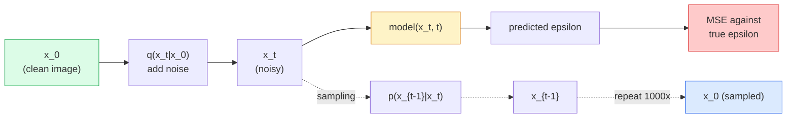

# 图像生成：Diffusion Models

> Diffusion model 学的是去噪。训练它从带噪图像中移除一点点噪声，再把这个过程反向重复一千次，你就有了图像生成器。

**类型：** 构建
**语言：** Python
**前置要求：** 阶段 4 第 07 课（U-Net），阶段 1 第 06 课（概率），阶段 3 第 06 课（优化器）
**时间：** ~75 分钟

## 学习目标

- 推导 forward noising process `x_0 -> x_1 -> ... -> x_T`，并解释为什么 closed-form `q(x_t | x_0)` 对任意 t 成立
- 实现 DDPM-style training objective，回归每一步加入的噪声，并实现一个从纯噪声走回图像的 sampler
- 构建一个 time-conditioned U-Net（小到可以在 CPU 上训练），为任意 timestep 预测噪声
- 解释 DDPM 和 DDIM sampling 的区别，以及何时使用各自（第 23 课会深入 flow matching 和 rectified flow）

## 问题

GAN 一次性生成：噪声进，图像出，一次 forward pass。它们快，但难训练。Diffusion model 迭代生成：从纯噪声开始，小步去噪，图像逐渐显现。它们慢，但容易训练。过去五年，后一个性质占了上风：任何小团队都能训练 diffusion model 并得到合理样本；GAN 训练是一门要用多年失败 run 学会的手艺。

除了训练稳定性，diffusion 的迭代结构也解锁了现代图像生成能做的一切：text conditioning、inpainting、image editing、super-resolution、controllable style。Sampling loop 的每一步都是注入新约束的位置。这个 hook 正是 Stable Diffusion、Imagen、DALL-E 3、Midjourney 以及你会用到的每个可控图像模型都基于 diffusion 的原因。

本课构建最小 DDPM：forward noising、backward denoising、training loop。下一课（Stable Diffusion）会把它接入带 VAE、text encoder 和 classifier-free guidance 的生产系统。

## 概念

### Forward process

取一张图像 `x_0`。加入一点 Gaussian noise 得到 `x_1`。再加入一点得到 `x_2`。持续 T 步，直到 `x_T` 几乎与纯 Gaussian noise 无法区分。

```
q(x_t | x_{t-1}) = N(x_t; sqrt(1 - beta_t) * x_{t-1},  beta_t * I)
```

`beta_t` 是一个小方差 schedule，通常在 T=1000 步里从 0.0001 线性增长到 0.02。每一步都会略微缩小信号，并注入新噪声。

### Closed-form jump

一步步加噪是 Markov chain，但数学上可以折叠：你可以一步直接从 `x_0` 采样 `x_t`。

```
Define alpha_t = 1 - beta_t
Define alpha_bar_t = prod_{s=1..t} alpha_s

Then:
  q(x_t | x_0) = N(x_t; sqrt(alpha_bar_t) * x_0,  (1 - alpha_bar_t) * I)

Equivalently:
  x_t = sqrt(alpha_bar_t) * x_0 + sqrt(1 - alpha_bar_t) * epsilon
  where epsilon ~ N(0, I)
```

这个单一方程是 diffusion 实用的全部原因。训练期间，你随机选一个 `t`，直接从 `x_0` 采样 `x_t`，并在一步内训练，不需要模拟完整 Markov chain。

### Reverse process

Forward process 是固定的。Reverse process `p(x_{t-1} | x_t)` 才是神经网络学习的内容。Diffusion model 不直接预测 `x_{t-1}`；它们预测第 t 步加入的噪声 `epsilon`，再由数学推导出 `x_{t-1}`。



### 训练 loss

每个训练 step：

1. 采样一张真实图像 `x_0`。
2. 从 [1, T] 中均匀采样 timestep `t`。
3. 采样噪声 `epsilon ~ N(0, I)`。
4. 计算 `x_t = sqrt(alpha_bar_t) * x_0 + sqrt(1 - alpha_bar_t) * epsilon`。
5. 用网络预测 `epsilon_theta(x_t, t)`。
6. 最小化 `|| epsilon - epsilon_theta(x_t, t) ||^2`。

就是这样。神经网络学会在任意 timestep 预测噪声。Loss 是 MSE。没有 adversarial game，没有 collapse，没有 oscillation。

### Sampler（DDPM）

生成时：从 `x_T ~ N(0, I)` 开始，一步步往回走。

```
for t = T, T-1, ..., 1:
    eps = model(x_t, t)
    x_{t-1} = (1 / sqrt(alpha_t)) * (x_t - (beta_t / sqrt(1 - alpha_bar_t)) * eps) + sqrt(beta_t) * z
    where z ~ N(0, I) if t > 1, else 0
return x_0
```

关键在于，虽然一般情况下 reverse conditional 没有 closed form，但对这个特定 Gaussian forward process 来说它有。那些难看的系数来自 Bayes rule。

### 为什么是 1000 步

Forward noise schedule 的选择，是为了让每一步添加的噪声足够少，使 reverse step 近似 Gaussian。步数太少，reverse step 离 Gaussian 太远，网络难以建模。步数太多，sampling 变贵但收益递减。T=1000 加 linear schedule 是 DDPM 默认值。

### DDIM：快 20 倍的 sampling

训练相同，sampling 改变。DDIM（Song 等，2020）定义了一个 deterministic reverse process，可以在不重新训练的情况下跳过 timestep。用 DDIM 采样 50 步，可以得到接近 1000 步 DDPM 的质量。每个生产系统都用 DDIM 或更快的变体（DPM-Solver、Euler ancestral）。

### Time conditioning

网络 `epsilon_theta(x_t, t)` 需要知道自己正在去噪哪个 timestep。现代 diffusion model 通过 sinusoidal time embeddings 注入 `t`（与 transformer 中的 positional encoding 同一思想），并在每个 U-Net level 加到 feature map 上。

```
t_embedding = sinusoidal(t)
feature_map += MLP(t_embedding)
```

没有 time conditioning，网络必须从图像本身猜噪声级别，这可以工作，但 sample-efficient 得多差。

## 构建它

### 第 1 步：Noise schedule

```python
import torch

def linear_beta_schedule(T=1000, beta_start=1e-4, beta_end=2e-2):
    return torch.linspace(beta_start, beta_end, T)


def precompute_schedule(betas):
    alphas = 1.0 - betas
    alphas_cumprod = torch.cumprod(alphas, dim=0)
    return {
        "betas": betas,
        "alphas": alphas,
        "alphas_cumprod": alphas_cumprod,
        "sqrt_alphas_cumprod": torch.sqrt(alphas_cumprod),
        "sqrt_one_minus_alphas_cumprod": torch.sqrt(1.0 - alphas_cumprod),
        "sqrt_recip_alphas": torch.sqrt(1.0 / alphas),
    }

schedule = precompute_schedule(linear_beta_schedule(T=1000))
```

预计算一次，在训练和 sampling 期间按索引 gather。

### 第 2 步：Forward diffusion（q_sample）

```python
def q_sample(x0, t, noise, schedule):
    sqrt_a = schedule["sqrt_alphas_cumprod"][t].view(-1, 1, 1, 1)
    sqrt_one_minus_a = schedule["sqrt_one_minus_alphas_cumprod"][t].view(-1, 1, 1, 1)
    return sqrt_a * x0 + sqrt_one_minus_a * noise
```

一行 closed form。`t` 是一个 timestep batch，每张图一个。

### 第 3 步：一个 tiny time-conditioned U-Net

```python
import torch.nn as nn
import torch.nn.functional as F
import math

def timestep_embedding(t, dim=64):
    half = dim // 2
    freqs = torch.exp(-math.log(10000) * torch.arange(half, device=t.device) / half)
    args = t[:, None].float() * freqs[None]
    emb = torch.cat([args.sin(), args.cos()], dim=-1)
    return emb


class TinyUNet(nn.Module):
    def __init__(self, img_channels=3, base=32, t_dim=64):
        super().__init__()
        self.t_mlp = nn.Sequential(
            nn.Linear(t_dim, base * 4),
            nn.SiLU(),
            nn.Linear(base * 4, base * 4),
        )
        self.t_dim = t_dim
        self.enc1 = nn.Conv2d(img_channels, base, 3, padding=1)
        self.enc2 = nn.Conv2d(base, base * 2, 4, stride=2, padding=1)
        self.mid = nn.Conv2d(base * 2, base * 2, 3, padding=1)
        self.dec1 = nn.ConvTranspose2d(base * 2, base, 4, stride=2, padding=1)
        self.dec2 = nn.Conv2d(base * 2, img_channels, 3, padding=1)
        self.time_proj = nn.Linear(base * 4, base * 2)

    def forward(self, x, t):
        t_emb = timestep_embedding(t, self.t_dim)
        t_emb = self.t_mlp(t_emb)
        t_proj = self.time_proj(t_emb)[:, :, None, None]

        h1 = F.silu(self.enc1(x))
        h2 = F.silu(self.enc2(h1)) + t_proj
        h3 = F.silu(self.mid(h2))
        d1 = F.silu(self.dec1(h3))
        d2 = torch.cat([d1, h1], dim=1)
        return self.dec2(d2)
```

两层 U-Net，在 bottleneck 注入 time conditioning。真实图像需要扩大深度和宽度。

### 第 4 步：Training loop

```python
def train_step(model, x0, schedule, optimizer, device, T=1000):
    model.train()
    x0 = x0.to(device)
    bs = x0.size(0)
    t = torch.randint(0, T, (bs,), device=device)
    noise = torch.randn_like(x0)
    x_t = q_sample(x0, t, noise, schedule)
    pred = model(x_t, t)
    loss = F.mse_loss(pred, noise)
    optimizer.zero_grad()
    loss.backward()
    optimizer.step()
    return loss.item()
```

这就是完整训练循环。没有 GAN game，没有专用 loss，只有一次 MSE 调用。

### 第 5 步：Sampler（DDPM）

```python
@torch.no_grad()
def sample(model, schedule, shape, T=1000, device="cpu"):
    model.eval()
    x = torch.randn(shape, device=device)
    betas = schedule["betas"].to(device)
    sqrt_one_minus_a = schedule["sqrt_one_minus_alphas_cumprod"].to(device)
    sqrt_recip_alphas = schedule["sqrt_recip_alphas"].to(device)

    for t in reversed(range(T)):
        t_batch = torch.full((shape[0],), t, dtype=torch.long, device=device)
        eps = model(x, t_batch)
        coef = betas[t] / sqrt_one_minus_a[t]
        mean = sqrt_recip_alphas[t] * (x - coef * eps)
        if t > 0:
            x = mean + torch.sqrt(betas[t]) * torch.randn_like(x)
        else:
            x = mean
    return x
```

生成一批样本需要 1000 次 forward pass。真实代码中你会把它换成 50 步 DDIM sampler。

### 第 6 步：DDIM sampler（确定性，约快 20 倍）

```python
@torch.no_grad()
def sample_ddim(model, schedule, shape, steps=50, T=1000, device="cpu", eta=0.0):
    model.eval()
    x = torch.randn(shape, device=device)
    alphas_cumprod = schedule["alphas_cumprod"].to(device)

    ts = torch.linspace(T - 1, 0, steps + 1).long()
    for i in range(steps):
        t = ts[i]
        t_prev = ts[i + 1]
        t_batch = torch.full((shape[0],), t, dtype=torch.long, device=device)
        eps = model(x, t_batch)
        a_t = alphas_cumprod[t]
        a_prev = alphas_cumprod[t_prev] if t_prev >= 0 else torch.tensor(1.0, device=device)
        x0_pred = (x - torch.sqrt(1 - a_t) * eps) / torch.sqrt(a_t)
        sigma = eta * torch.sqrt((1 - a_prev) / (1 - a_t) * (1 - a_t / a_prev))
        dir_xt = torch.sqrt(1 - a_prev - sigma ** 2) * eps
        noise = sigma * torch.randn_like(x) if eta > 0 else 0
        x = torch.sqrt(a_prev) * x0_pred + dir_xt + noise
    return x
```

`eta=0` 是完全确定性的（相同 noise input 总是产生相同 output）。`eta=1` 恢复 DDPM。

## 使用它

生产工作请使用 `diffusers`：

```python
from diffusers import DDPMScheduler, UNet2DModel

unet = UNet2DModel(sample_size=32, in_channels=3, out_channels=3, layers_per_block=2)
scheduler = DDPMScheduler(num_train_timesteps=1000)
```

这个库提供现成 scheduler（DDPM、DDIM、DPM-Solver、Euler、Heun）、可配置 U-Net、text-to-image 和 image-to-image pipeline，以及 LoRA fine-tuning helpers。

研究中，`k-diffusion`（Katherine Crowson）有最忠实的参考实现和最好的 sampling 变体。

## 交付它

本课会产出：

- `outputs/prompt-diffusion-sampler-picker.md`：一个 prompt，会根据质量目标、latency budget 和 conditioning type 选择 DDPM / DDIM / DPM-Solver / Euler。
- `outputs/skill-noise-schedule-designer.md`：一个 skill，给定 T 和目标 corruption level，会生成 linear、cosine 或 sigmoid beta schedule，并附上 signal-to-noise ratio 随时间变化的诊断图。

## 练习

1. **（简单）** 可视化 forward process：取一张图并画出 `t in [0, 100, 250, 500, 750, 1000]` 时的 `x_t`。验证 `x_1000` 看起来像纯 Gaussian noise。
2. **（中等）** 在 synthetic-circles 数据集上训练 TinyUNet 20 个 epoch，并采样 16 个圆。比较 DDPM（1000 步）和 DDIM（50 步）sampling：它们是否能从同一个 noise seed 产生相似图像？
3. **（困难）** 实现 cosine noise schedule（Nichol & Dhariwal，2021）：`alpha_bar_t = cos^2((t/T + s) / (1 + s) * pi / 2)`。用 linear 和 cosine schedule 训练同一个模型，并展示 cosine 在低步数下给出更好样本。

## 关键术语

| 术语 | 人们常说 | 它实际意味着 |
|------|----------------|----------------------|
| Forward process | “随时间加噪” | 固定 Markov chain，在 T 步中把图像腐蚀成 Gaussian noise |
| Reverse process | “一步步去噪” | 学到的分布，从噪声走回图像 |
| Epsilon prediction | “预测噪声” | 训练目标：`epsilon_theta(x_t, t)` 预测第 t 步加入的噪声 |
| Beta schedule | “噪声量” | 定义每步进入多少噪声的 T 个小方差序列 |
| alpha_bar_t | “累计保留因子” | 从 1 到 t 的 (1 - beta_s) 乘积；t 越大，剩余信号越少 |
| DDPM sampler | “Ancestral, stochastic” | 从条件 Gaussian 中采样每个 x_{t-1}；1000 步 |
| DDIM sampler | “Deterministic, fast” | 把 sampling 重写为 deterministic ODE；20-100 步能得到相似质量 |
| Time conditioning | “告诉模型是哪一个 t” | 把 t 的 sinusoidal embedding 注入 U-Net，让它知道噪声级别 |

## 延伸阅读

- [Denoising Diffusion Probabilistic Models (Ho et al., 2020)](https://arxiv.org/abs/2006.11239)：让 diffusion 实用并在 FID 上击败 GAN 的论文
- [Improved DDPM (Nichol & Dhariwal, 2021)](https://arxiv.org/abs/2102.09672)：cosine schedule 和 v-parameterisation
- [DDIM (Song, Meng, Ermon, 2020)](https://arxiv.org/abs/2010.02502)：让实时 inference 成为可能的 deterministic sampler
- [Elucidating the Design Space of Diffusion (Karras et al., 2022)](https://arxiv.org/abs/2206.00364)：对所有 diffusion 设计选择的统一视角；当前最佳参考
