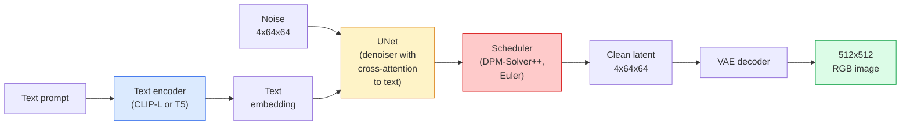

# Stable Diffusion：架构与 Fine-Tuning

> Stable Diffusion 是运行在预训练 VAE latent space 中的 DDPM，通过 cross-attention 接收文本条件，用快速 deterministic ODE solver 采样，并由 classifier-free guidance 引导。

**类型：** 学习 + 使用
**语言：** Python
**前置要求：** 阶段 4 第 10 课（Diffusion），阶段 7 第 02 课（Self-Attention）
**时间：** ~75 分钟

## 学习目标

- 追踪 Stable Diffusion pipeline 的五个部件：VAE、text encoder、U-Net、scheduler、safety checker，并说明每个实际做什么
- 解释 latent diffusion，以及为什么在 4x64x64 latent space（而不是 3x512x512 图像）中训练，可以在不损失质量的情况下把计算减少 48 倍
- 使用 `diffusers` 生成图像、运行 image-to-image、inpainting 和 ControlNet-guided generation
- 在小型自定义数据集上用 LoRA fine-tune Stable Diffusion，并在 inference 时加载 LoRA adapter

## 问题

直接在 512x512 RGB 图像上训练 DDPM 很贵。每个训练 step 都要反向传播穿过一个看见 3x512x512 = 786,432 个输入值的 U-Net，而 sampling 需要穿过同一个 U-Net 做 50+ 次 forward pass。在 Stable Diffusion 1.5（2022 发布）的质量水平上，pixel-space diffusion 大约需要 256 GPU-months 的训练，并且在消费级 GPU 上每张图要 10-30 秒。

让 open-weight text-to-image 变得实用的技巧是 **latent diffusion**（Rombach 等，CVPR 2022）。训练一个 VAE，把 3x512x512 图像映射到 4x64x64 latent tensor 并能映射回来，然后在这个 latent space 中做 diffusion。计算量下降 `(3*512*512)/(4*64*64) = 48x`。在同一块 GPU 上，sampling 从几十秒降到两秒以内。

几乎每个现代图像生成模型：SDXL、SD3、FLUX、HunyuanDiT、Wan-Video，都是 latent diffusion model，只是在 autoencoder、denoiser（U-Net 或 DiT）和 text conditioning 上做变化。学会 Stable Diffusion，你就学会了模板。

## 概念

### Pipeline



- **VAE**：冻结的 autoencoder。Encoder 把图像转成 latents（用于 img2img 和训练）。Decoder 把 latents 转回图像。
- **Text encoder**：CLIP text encoder（SD 1.x/2.x）、CLIP-L + CLIP-G（SDXL），或 T5-XXL（SD3/FLUX）。产生 token embeddings 序列。
- **U-Net**：denoiser。带有 cross-attention layers，在每个分辨率 level 从 latents attend 到 text embedding。
- **Scheduler**：sampling 算法（DDIM、Euler、DPM-Solver++）。选择 sigmas，把预测噪声融合回 latent。
- **Safety checker**：可选的 NSFW / illegal-content 输出图像过滤器。

### Classifier-free guidance（CFG）

普通文本条件会为每个 prompt `c` 学习 `epsilon_theta(x_t, t, c)`。CFG 训练同一个网络，但有 10% 的时间丢掉 `c`（替换为空 embedding），从而得到一个既能预测 conditional noise 又能预测 unconditional noise 的单一模型。Inference 时：

```
eps = eps_uncond + w * (eps_cond - eps_uncond)
```

`w` 是 guidance scale。`w=0` 是 unconditional，`w=1` 是普通 conditional，`w>1` 会把输出推向“更受 prompt 条件约束”，代价是多样性降低。SD 默认 `w=7.5`。

CFG 是 text-to-image 达到生产质量的原因。没有它，prompt 只会弱弱影响输出；有了它，prompt 会主导输出。

### Latent space geometry

VAE 的 4 通道 latent 不只是压缩图像。它是一个 manifold，其中算术运算大致对应语义编辑（prompt engineering + interpolation 都活在这里），并且 diffusion U-Net 的全部建模预算都花在这里。解码一个随机 4x64x64 latent 不会产生随机风格图像，而会产生垃圾，因为只有 latent 的某个特定 submanifold 才能解码成有效图像。

两个后果：

1. **Img2img** = 把图像 encode 成 latent，加入部分噪声，运行 denoiser，再 decode。因为 encoding 近似可逆，图像结构会保留；内容根据 prompt 变化。
2. **Inpainting** = 与 img2img 相同，但 denoiser 只更新 masked regions；unmasked regions 保持 encoded latent。

### U-Net 架构

SD U-Net 是第 10 课 TinyUNet 的大版本，并加了三样东西：

- **Transformer blocks**：位于每个空间分辨率，包含 self-attention + 到 text embedding 的 cross-attention。
- **Time embedding**：对 sinusoidal encoding 经过 MLP。
- **Skip connections**：连接 encoder 和 decoder 的匹配分辨率。

SD 1.5 总参数量约 860M。SDXL 约 2.6B。FLUX 约 12B。参数量跃迁主要发生在 attention layers。

### LoRA fine-tuning

Stable Diffusion 的完整 fine-tuning 需要 20+ GB VRAM，并更新 860M 参数。LoRA（Low-Rank Adaptation）保持 base model 冻结，并在 attention layers 中注入小的 rank-decomposition 矩阵。SD 的 LoRA adapter 通常是 10-50 MB，可以在单张消费级 GPU 上训练 10-60 分钟，并在 inference 时作为 drop-in modification 加载。

```
Original: W_q : (d_in, d_out)   frozen
LoRA:     W_q + alpha * (A @ B)   where A : (d_in, r), B : (r, d_out)

r is typically 4-32.
```

LoRA 是几乎所有社区 fine-tune 的分发方式。CivitAI 和 Hugging Face 托管着数百万个 LoRA。

### 你会看到的 scheduler

- **DDIM**：确定性，约 50 步，简单。
- **Euler ancestral**：随机性，30-50 步，样本略有创造性。
- **DPM-Solver++ 2M Karras**：确定性，20-30 步，生产默认。
- **LCM / TCD / Turbo**：consistency models 和 distilled variants；1-4 步，代价是一些质量损失。

在 `diffusers` 中替换 scheduler 是一行改动，有时不需要任何重新训练就能修复样本问题。

## 构建它

本课端到端使用 `diffusers`，而不是从零重建 Stable Diffusion。你需要重建的部件（VAE、text encoder、U-Net、scheduler）各自都是独立课程；这里的目标是熟悉生产 API。

### 第 1 步：Text-to-image

```python
import torch
from diffusers import StableDiffusionPipeline

pipe = StableDiffusionPipeline.from_pretrained(
    "runwayml/stable-diffusion-v1-5",
    torch_dtype=torch.float16,
).to("cuda")

image = pipe(
    prompt="a dog riding a skateboard in tokyo, studio ghibli style",
    guidance_scale=7.5,
    num_inference_steps=25,
    generator=torch.Generator("cuda").manual_seed(42),
).images[0]
image.save("dog.png")
```

`float16` 会把 VRAM 减半，且没有可见质量损失。默认 DPM-Solver++ 下的 `num_inference_steps=25`，能匹配 DDIM 下的 `num_inference_steps=50`。

### 第 2 步：替换 scheduler

```python
from diffusers import DPMSolverMultistepScheduler, EulerAncestralDiscreteScheduler

pipe.scheduler = DPMSolverMultistepScheduler.from_config(pipe.scheduler.config)
pipe.scheduler = EulerAncestralDiscreteScheduler.from_config(pipe.scheduler.config)
```

Scheduler state 与 U-Net weights 解耦。你可以用 DDPM 训练，并用任意 scheduler 采样。

### 第 3 步：Image-to-image

```python
from diffusers import StableDiffusionImg2ImgPipeline
from PIL import Image

img2img = StableDiffusionImg2ImgPipeline.from_pretrained(
    "runwayml/stable-diffusion-v1-5",
    torch_dtype=torch.float16,
).to("cuda")

init_image = Image.open("dog.png").convert("RGB").resize((512, 512))
out = img2img(
    prompt="a dog riding a skateboard, oil painting",
    image=init_image,
    strength=0.6,
    guidance_scale=7.5,
).images[0]
```

`strength` 是 denoising 前要加多少噪声（0.0 = 不变，1.0 = 完全重新生成）。0.5-0.7 是 style transfer 的标准范围。

### 第 4 步：Inpainting

```python
from diffusers import StableDiffusionInpaintPipeline

inpaint = StableDiffusionInpaintPipeline.from_pretrained(
    "runwayml/stable-diffusion-inpainting",
    torch_dtype=torch.float16,
).to("cuda")

image = Image.open("dog.png").convert("RGB").resize((512, 512))
mask = Image.open("dog_mask.png").convert("L").resize((512, 512))

out = inpaint(
    prompt="a cat",
    image=image,
    mask_image=mask,
    guidance_scale=7.5,
).images[0]
```

Mask 中的白色像素是要重新生成的区域。黑色像素会被保留。

### 第 5 步：LoRA loading

```python
pipe.load_lora_weights("sayakpaul/sd-lora-ghibli")
pipe.fuse_lora(lora_scale=0.8)

image = pipe(prompt="a village square in ghibli style").images[0]
```

`lora_scale` 控制强度；0.0 = 无效果，1.0 = 完整效果。`fuse_lora` 会为了速度把 adapter 就地 bake 到权重中，但会阻止替换。加载另一个 adapter 前调用 `pipe.unfuse_lora()`。

### 第 6 步：LoRA training（草图）

真实 LoRA training 活在 `peft` 或 `diffusers.training` 中。大纲如下：

```python
# Pseudocode
for step, batch in enumerate(dataloader):
    images, prompts = batch
    latents = vae.encode(images).latent_dist.sample() * 0.18215

    t = torch.randint(0, num_train_timesteps, (batch_size,))
    noise = torch.randn_like(latents)
    noisy_latents = scheduler.add_noise(latents, noise, t)

    text_emb = text_encoder(tokenizer(prompts))

    pred_noise = unet(noisy_latents, t, text_emb)  # LoRA weights injected here

    loss = F.mse_loss(pred_noise, noise)
    loss.backward()
    optimizer.step()
```

只有 LoRA 矩阵接收梯度；base U-Net、VAE 和 text encoder 都被冻结。Batch size 为 1 且使用 gradient checkpointing 时，它可以装进 8 GB VRAM。

## 使用它

生产中，你实际要做的决策是：

- **Model family**：SD 1.5 用于开源社区 fine-tunes，SDXL 用于更高 fidelity，SD3 / FLUX 用于 state of the art 和严格 licensing requirements。
- **Scheduler**：20-30 步使用 DPM-Solver++ 2M Karras，latency 低于 1s 时使用 LCM-LoRA。
- **Precision**：4080/4090 上用 `float16`，A100 及更新硬件上用 `bfloat16`，VRAM 紧张时用 `int8`（通过 `bitsandbytes` 或 `compel`）。
- **Conditioning**：纯文本能工作；需要更强控制时，在 base pipeline 上加 ControlNet（canny、depth、pose）。

批量生成时，`AUTO1111` / `ComfyUI` 是社区工具；生产 API 中，使用 `diffusers` + `accelerate`，或带 TensorRT 编译的 `optimum-nvidia`。

## 交付它

本课会产出：

- `outputs/prompt-sd-pipeline-planner.md`：一个 prompt，给定 latency budget、fidelity target 和 licensing constraint，选择 SD 1.5 / SDXL / SD3 / FLUX，以及 scheduler 和 precision。
- `outputs/skill-lora-training-setup.md`：一个 skill，会为自定义数据集写完整 LoRA training config，包括 captions、rank、batch size 和 learning rate。

## 练习

1. **（简单）** 用 `[1, 3, 5, 7.5, 10, 15]` 中的 `guidance_scale` 生成同一个 prompt。描述图像如何变化。哪个 guidance 值开始出现 artifacts？
2. **（中等）** 取任意真实照片，用 `strength` 为 `[0.2, 0.4, 0.6, 0.8, 1.0]` 的 `StableDiffusionImg2ImgPipeline` 处理。哪个 strength 能保留构图同时改变风格？为什么 1.0 会完全忽略输入？
3. **（困难）** 在一个主体的 10-20 张图片上训练 LoRA（宠物、logo、角色），并生成包含该主体的新场景。报告 LoRA rank 和 training steps，说明哪个组合在不 overfit 输入图像的情况下得到最佳 identity preservation。

## 关键术语

| 术语 | 人们常说 | 它实际意味着 |
|------|----------------|----------------------|
| Latent diffusion | “Diffuse in latents” | 在 VAE latent space（4x64x64）而不是 pixel space（3x512x512）中运行整个 DDPM；节省 48x 计算 |
| VAE scale factor | “0.18215” | 把 VAE raw latent 重新缩放到大约 unit variance 的常数；硬编码在每个 SD pipeline 中 |
| Classifier-free guidance | “CFG” | 混合 conditional 和 unconditional noise prediction；最有影响力的单个 inference knob |
| Scheduler | “Sampler” | 把 noise + model predictions 转换成 denoised latent trajectory 的算法 |
| LoRA | “Low-rank adapter” | 小的 rank-decomposition 矩阵，可以在不触碰 base weights 的情况下 fine-tune attention layers |
| Cross-attention | “Text-image attention” | 从 latent tokens 到 text tokens 的 attention；在每个 U-Net level 注入 prompt 信息 |
| ControlNet | “Structure conditioning” | 一个单独训练的 adapter，用额外输入（canny、depth、pose、segmentation）引导 SD |
| DPM-Solver++ | “默认 scheduler” | 二阶 deterministic ODE solver；2026 年在低步数（20-30）下质量最好 |

## 延伸阅读

- [High-Resolution Image Synthesis with Latent Diffusion (Rombach et al., 2022)](https://arxiv.org/abs/2112.10752)：Stable Diffusion 论文；包含证明设计合理性的每个 ablation
- [Classifier-Free Diffusion Guidance (Ho & Salimans, 2022)](https://arxiv.org/abs/2207.12598)：CFG 论文
- [LoRA: Low-Rank Adaptation of Large Language Models (Hu et al., 2021)](https://arxiv.org/abs/2106.09685)：LoRA 最早用于 NLP；迁移到 SD 几乎不需要改动
- [diffusers documentation](https://huggingface.co/docs/diffusers)：每个 SD / SDXL / SD3 / FLUX pipeline 的参考
