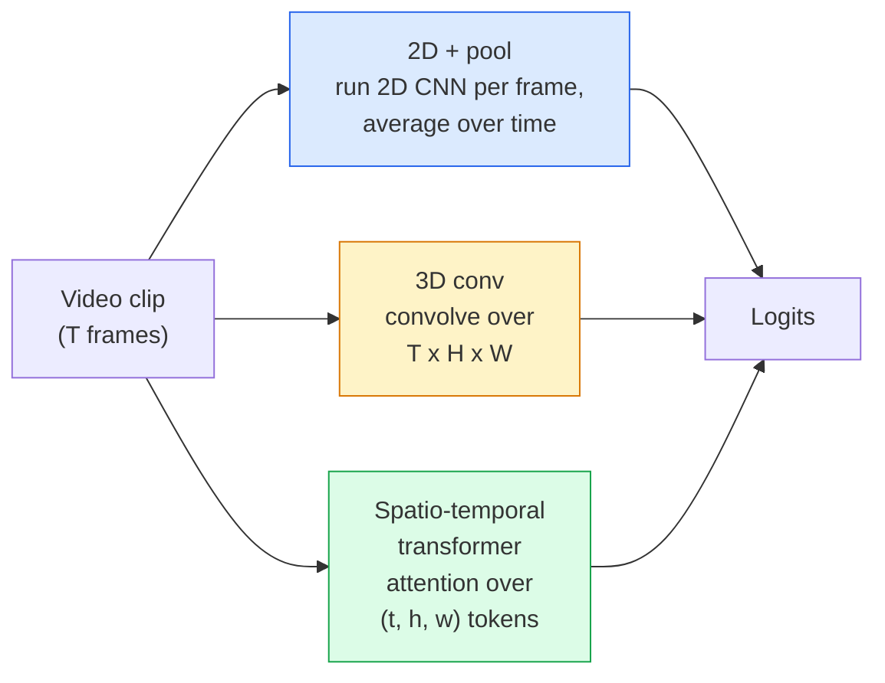

# 视频理解：Temporal Modeling

> 视频是一串图像，加上连接它们的物理规律。每个视频模型要么把时间当作额外轴（3D conv），要么把它当作要 attention 的序列（transformer），要么把它当作先提特征再 pooling 的对象（2D+pool）。

**类型：** 学习 + 构建
**语言：** Python
**前置要求：** 阶段 4 第 03 课（CNN），阶段 4 第 04 课（图像分类）
**时间：** ~45 分钟

## 学习目标

- 区分三种主要视频建模方式（2D+pool、3D conv、spatio-temporal transformer），并预测它们的成本和准确率权衡
- 在 PyTorch 中实现 frame sampling、temporal pooling 和 2D+pool baseline classifier
- 解释为什么 I3D 的 “inflated” 3D kernel 能很好地从 ImageNet weights 迁移，以及 factorised (2+1)D conv 有什么不同
- 阅读标准 action-recognition 数据集和指标：Kinetics-400/600、UCF101、Something-Something V2；clip 和 video level 的 top-1 accuracy

## 问题

30 fps 的 30 秒视频是 900 张图像。朴素地说，视频分类就是运行 900 次图像分类，再做某种聚合。当动作几乎在每一帧中都可见时（体育、烹饪、健身视频），这能工作；当动作本身由运动定义时，它会失败得很惨：“把某物从左推到右”在每一张静态帧里都只是两个静止物体。

每个视频架构的核心问题是：什么时候建模 temporal structure，以及如何建模？答案会驱动其他一切：计算成本、预训练策略、是否能复用 ImageNet weights、模型训练在哪些数据集上。

本课故意比静态图像课程短。核心图像机制已经就位，视频理解主要是 temporal story：sampling、modeling 和 aggregation。

## 概念

### 三个架构家族



### 2D + pool

取一个 2D CNN（ResNet、EfficientNet、ViT）。在每个采样帧上独立运行。对 per-frame embeddings 取 average（或 max-pool、attention-pool）。把 pooled vector 送入分类器。

优点：
- ImageNet pretraining 直接迁移。
- 最容易实现。
- 便宜：T 帧 * 单图 inference 成本。

缺点：
- 无法建模运动。Action = 外观的 aggregate。
- Temporal pooling 对顺序不敏感；“开门”和“关门”看起来一样。

使用场景：外观占主导的任务、小视频数据集上的 transfer learning、初始 baselines。

### 3D convolutions

把 2D (H, W) kernel 替换为 3D (T, H, W) kernel。网络同时在空间和时间上 convolution。早期家族：C3D、I3D、SlowFast。

I3D 技巧：取一个预训练 2D ImageNet 模型，把每个 2D kernel 沿新的时间轴复制，从而 “inflate” 它。一个 3x3 2D conv 变成 3x3x3 3D conv。这让 3D 模型得到强大的预训练权重，而不是从零训练。

优点：
- 直接建模运动。
- I3D inflation 免费提供 transfer learning。

缺点：
- 比 2D 对应模型多 T/8 FLOPs（对 temporal kernel 3 堆叠三次的情况）。
- Temporal kernel 很小；long-range motion 需要 pyramid 或 dual-stream 方法。

使用场景：运动是信号的 action recognition（Something-Something V2、Kinetics 中 motion-heavy 类别）。

### Spatio-temporal transformers

把视频 tokenise 成 space-time patches 的网格，并在所有 patch 上做 attention。TimeSformer、ViViT、Video Swin、VideoMAE。

重要的 attention pattern：
- **Joint**：在 (t, h, w) 上做一次大 attention。关于 `T*H*W` 二次复杂度；贵。
- **Divided**：每个 block 两次 attention：一次 over time，一次 over space。近似线性缩放。
- **Factorised**：time attention 和 space attention 在 block 间交替。

优点：
- 在每个主要 benchmark 上都是 SOTA accuracy。
- 可以通过 patch inflation 从 image transformer（ViT）迁移。
- 通过 sparse attention 支持 long-context video。

缺点：
- 计算饥渴。
- 需要谨慎选择 attention pattern，否则 runtime 膨胀。

使用场景：大数据集、高保真视频理解、多模态 video+text 任务。

### Frame sampling

10 秒 30 fps 的 clip 是 300 帧；把全部 300 帧送给任何模型都很浪费。标准策略：

- **Uniform sampling**：在 clip 中均匀选 T 帧。2D+pool 的默认值。
- **Dense sampling**：随机连续 T-frame window。3D conv 常用，因为运动需要相邻帧。
- **Multi-clip**：从同一个视频采样多个 T-frame window，分别分类，并在测试时平均预测。

T 通常是 8、16、32 或 64。更高 T = 更多 temporal signal，也有更多计算。

### 评估

两个 level：
- **Clip-level accuracy**：模型看一个 T-frame clip，报告 top-k。
- **Video-level accuracy**：跨每个视频的多个 clip-level predictions 取平均；更高也更稳定。

永远报告两者。一个 78% clip / 82% video 的模型很依赖 test-time averaging；一个 80% / 81% 的模型则 per-clip 更稳健。

### 你会遇到的数据集

- **Kinetics-400 / 600 / 700**：通用 action dataset。40 万 clips；YouTube URLs（许多现在已失效）。
- **Something-Something V2**：由运动定义的动作（“moving X from left to right”）。无法用 2D+pool 解决。
- **UCF-101**、**HMDB-51**：更老、更小，但仍被报告。
- **AVA**：空间和时间上的 action *localisation*；比分类更难。

## 构建它

### 第 1 步：Frame sampler

作用在 frame list（或 video tensor）上的 uniform 和 dense samplers。

```python
import numpy as np

def sample_uniform(num_frames_total, T):
    if num_frames_total <= T:
        return list(range(num_frames_total)) + [num_frames_total - 1] * (T - num_frames_total)
    step = num_frames_total / T
    return [int(i * step) for i in range(T)]


def sample_dense(num_frames_total, T, rng=None):
    rng = rng or np.random.default_rng()
    if num_frames_total <= T:
        return list(range(num_frames_total)) + [num_frames_total - 1] * (T - num_frames_total)
    start = int(rng.integers(0, num_frames_total - T + 1))
    return list(range(start, start + T))
```

两者都返回 `T` 个索引，用来 slice video tensor。

### 第 2 步：2D+pool baseline

在每一帧上运行 2D ResNet-18，average-pool features，再分类。

```python
import torch
import torch.nn as nn
from torchvision.models import resnet18, ResNet18_Weights

class FramePool(nn.Module):
    def __init__(self, num_classes=400, pretrained=True):
        super().__init__()
        weights = ResNet18_Weights.IMAGENET1K_V1 if pretrained else None
        backbone = resnet18(weights=weights)
        self.features = nn.Sequential(*(list(backbone.children())[:-1]))  # global avg pool kept
        self.head = nn.Linear(512, num_classes)

    def forward(self, x):
        # x: (N, T, 3, H, W)
        N, T = x.shape[:2]
        x = x.view(N * T, *x.shape[2:])
        feats = self.features(x).view(N, T, -1)
        pooled = feats.mean(dim=1)
        return self.head(pooled)

model = FramePool(num_classes=10)
x = torch.randn(2, 8, 3, 224, 224)
print(f"output: {model(x).shape}")
print(f"params: {sum(p.numel() for p in model.parameters()):,}")
```

1100 万参数，ImageNet pretrained，逐帧运行、平均、分类。在 appearance-heavy 任务上，这个 baseline 常常只比真正的 3D 模型低 5-10 个点，有时甚至更好，因为它复用了更强的 ImageNet backbone。

### 第 3 步：I3D-style inflated 3D conv

把一个 2D conv 沿新时间轴重复权重，转成 3D conv。

```python
def inflate_2d_to_3d(conv2d, time_kernel=3):
    out_c, in_c, kh, kw = conv2d.weight.shape
    weight_3d = conv2d.weight.data.unsqueeze(2)  # (out, in, 1, kh, kw)
    weight_3d = weight_3d.repeat(1, 1, time_kernel, 1, 1) / time_kernel
    conv3d = nn.Conv3d(in_c, out_c, kernel_size=(time_kernel, kh, kw),
                        padding=(time_kernel // 2, conv2d.padding[0], conv2d.padding[1]),
                        stride=(1, conv2d.stride[0], conv2d.stride[1]),
                        bias=False)
    conv3d.weight.data = weight_3d
    return conv3d

conv2d = nn.Conv2d(3, 64, kernel_size=3, padding=1, bias=False)
conv3d = inflate_2d_to_3d(conv2d, time_kernel=3)
print(f"2D weight shape:  {tuple(conv2d.weight.shape)}")
print(f"3D weight shape:  {tuple(conv3d.weight.shape)}")
x = torch.randn(1, 3, 8, 56, 56)
print(f"3D output shape:  {tuple(conv3d(x).shape)}")
```

除以 `time_kernel` 会让 activation magnitude 大致保持不变，这对不破坏第一次 forward pass 的 batch-norm statistics 很重要。

### 第 4 步：Factorised (2+1)D conv

把 3D conv 拆成 2D（spatial）conv 和 1D（temporal）conv。相同 receptive field，更少参数，在一些 benchmark 上 accuracy 更好。

```python
class Conv2Plus1D(nn.Module):
    def __init__(self, in_c, out_c, kernel_size=3):
        super().__init__()
        mid_c = (in_c * out_c * kernel_size * kernel_size * kernel_size) \
                // (in_c * kernel_size * kernel_size + out_c * kernel_size)
        self.spatial = nn.Conv3d(in_c, mid_c, kernel_size=(1, kernel_size, kernel_size),
                                 padding=(0, kernel_size // 2, kernel_size // 2), bias=False)
        self.bn = nn.BatchNorm3d(mid_c)
        self.act = nn.ReLU(inplace=True)
        self.temporal = nn.Conv3d(mid_c, out_c, kernel_size=(kernel_size, 1, 1),
                                  padding=(kernel_size // 2, 0, 0), bias=False)

    def forward(self, x):
        return self.temporal(self.act(self.bn(self.spatial(x))))

c = Conv2Plus1D(3, 64)
x = torch.randn(1, 3, 8, 56, 56)
print(f"(2+1)D output: {tuple(c(x).shape)}")
```

完整 R(2+1)D 网络就是把 ResNet-18 中每个 3x3 conv 替换成 `Conv2Plus1D`。

## 使用它

两个库覆盖生产视频工作：

- `torchvision.models.video`：R(2+1)D、MViT、Swin3D，带预训练 Kinetics weights。API 与图像模型相同。
- `pytorchvideo`（Meta）：model zoo、Kinetics / SSv2 / AVA data loaders、标准 transforms。

对 Vision-Language video models（video captioning、video QA），使用 `transformers`（`VideoMAE`、`VideoLLaMA`、`InternVideo`）。

## 交付它

本课会产出：

- `outputs/prompt-video-architecture-picker.md`：一个 prompt，会根据 appearance-vs-motion、dataset size 和 compute budget 选择 2D+pool / I3D / (2+1)D / transformer。
- `outputs/skill-frame-sampler-auditor.md`：一个 skill，会检查 video pipeline 的 sampler，并标记常见 bug：off-by-one index、`num_frames < T` 时采样不均匀、缺少保持宽高比的 crop 等。

## 练习

1. **（简单）** 近似计算 T=8 的 FramePool 与 T=8 的 I3D-style 3D ResNet 的 FLOPs。解释为什么 2D+pool 便宜 3-5 倍。
2. **（中等）** 生成一个合成视频数据集：随机小球向随机方向移动，按运动方向标注（“left-to-right”、“right-to-left”、“diagonal-up”）。在它上面训练 FramePool。展示它接近随机准确率，证明单靠 appearance 不足以完成运动任务。
3. **（困难）** 通过把 ResNet-18 中每个 Conv2d 替换为 `Conv2Plus1D`，构建 R(2+1)D-18。从 ImageNet-pretrained ResNet-18 inflate 第一个 conv 的权重。在练习 2 的运动数据集上训练，并击败 FramePool。

## 关键术语

| 术语 | 人们常说 | 它实际意味着 |
|------|----------------|----------------------|
| 2D + pool | “Per-frame classifier” | 在每个采样帧上运行 2D CNN，跨时间 average-pool features，再分类 |
| 3D convolution | “Spatio-temporal kernel” | 在 (T, H, W) 上 convolution 的 kernel；可以原生建模运动 |
| Inflation | “把 2D weights 升到 3D” | 通过沿新时间轴重复 2D conv weights 来初始化 3D conv weights，再除以 kernel_T 以保持 activation scale |
| (2+1)D | “Factorised conv” | 把 3D 拆成 2D spatial + 1D temporal；更少参数，中间多一个 non-linearity |
| Divided attention | “先 time 后 space” | 每层有两个 attentions 的 transformer block：一个 over 同一帧的 tokens，一个 over 同一位置的 tokens |
| Clip | “T-frame window” | 采样出的 T 帧子序列；视频模型消费的单位 |
| Clip vs video accuracy | “两个 eval 设置” | Clip = 每个视频一个 sample，video = 跨多个 sampled clips 取平均 |
| Kinetics | “视频的 ImageNet” | 400-700 个 action classes，30 万+ YouTube clips，标准视频预训练语料 |

## 延伸阅读

- [I3D: Quo Vadis, Action Recognition (Carreira & Zisserman, 2017)](https://arxiv.org/abs/1705.07750)：引入 inflation 和 Kinetics dataset
- [R(2+1)D: A Closer Look at Spatiotemporal Convolutions (Tran et al., 2018)](https://arxiv.org/abs/1711.11248)：factorised conv，至今仍是强 baseline
- [TimeSformer: Is Space-Time Attention All You Need? (Bertasius et al., 2021)](https://arxiv.org/abs/2102.05095)：第一个强视频 transformer
- [VideoMAE (Tong et al., 2022)](https://arxiv.org/abs/2203.12602)：用于视频的 masked autoencoder pretraining；当前主导预训练配方
