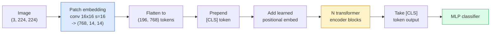

# Vision Transformers（ViT）

> 把图像切成 patches，把每个 patch 当作一个词，运行标准 transformer。别回头。

**类型：** 构建
**语言：** Python
**前置要求：** 阶段 7 第 02 课（Self-Attention），阶段 4 第 04 课（图像分类）
**时间：** ~45 分钟

## 学习目标

- 从零实现 patch embedding、learned positional embedding、class token 和 transformer encoder blocks，构建最小 ViT
- 解释为什么 ViT 一度被认为需要海量预训练数据，直到 DeiT 和 MAE 证明并非如此
- 在架构先验上比较 ViT、Swin 和 ConvNeXt（无先验、local window attention、conv backbone）
- 使用 `timm` 在小数据集上 fine-tune 预训练 ViT，并采用标准 linear-probe / fine-tune 配方

## 问题

十年来，convolution 几乎等同于 computer vision。CNN 有很强的 inductive biases：locality、translation equivariance，没人觉得你能替换它们。然后 Dosovitskiy 等人（2020）展示了，一个完全没有 convolutional machinery 的普通 transformer，只要应用到 flatten 后的 image patches 上，就能在规模足够大时匹配或击败最好的 CNN。

限制条件是“规模足够大”。ViT 在 ImageNet-1k 上输给 ResNet。ViT 在 ImageNet-21k 或 JFT-300M 上预训练，再在 ImageNet-1k 上 fine-tune，才击败它。结论是 transformers 缺少有用先验，但能从足够多数据中学到。后续工作（DeiT、MAE、DINO）表明，只要训练配方正确：强 augmentation、self-supervised pretraining、distillation，ViT 在小数据上也能训练得很好。

到 2026 年，纯 CNN 在 edge devices 上仍有竞争力（ConvNeXt 最强），但 transformers 主导了其他一切：segmentation（Mask2Former、SegFormer）、detection（DETR、RT-DETR）、multimodal（CLIP、SigLIP）、video（VideoMAE、VJEPA）。ViT block structure 是必须知道的结构。

## 概念

### Pipeline



七个步骤。Patches -> tokens -> attention -> classifier。每个变体（DeiT、Swin、ConvNeXt、MAE pretraining）都只是改变这七步中的一两步，其余保持不变。

### Patch embedding

第一个 conv 是秘密。Kernel size 16，stride 16，所以 224x224 图像变成 14x14 的 16x16 patches 网格，每个 patch 被投影成 768 维 embedding。这个单个 conv 同时完成 patchify 和 linear projection。

```
Input:  (3, 224, 224)
Conv (3 -> 768, k=16, s=16, no padding):
Output: (768, 14, 14)
Flatten spatial: (196, 768)
```

196 个 patches = 196 个 tokens。每个 token 的 feature dimension 是 768（ViT-B）、1024（ViT-L）或 1280（ViT-H）。

### Class token

一个单独的 learned vector 被 prepend 到序列前：

```
tokens = [CLS; patch_1; patch_2; ...; patch_196]   shape (197, 768)
```

经过 N 个 transformer blocks 后，`[CLS]` output 是全局图像 representation。Classification head 只读取这一个向量。

### Positional embedding

Transformer 没有内置空间位置概念。给每个 token 加一个 learned vector：

```
tokens = tokens + learned_pos_embedding   (also shape (197, 768))
```

Embedding 是模型参数；gradient-based training 会让它适应 2D 图像结构。Sinusoidal 2D 替代方案存在，但实践中很少使用。

### Transformer encoder block

标准结构。Multi-head self-attention、MLP、residual connections、pre-LayerNorm。

```
x = x + MSA(LN(x))
x = x + MLP(LN(x))

MLP is two-layer with GELU: Linear(d -> 4d) -> GELU -> Linear(4d -> d)
```

ViT-B/16 堆叠 12 个这样的 block，每个有 12 个 attention heads，总计 8600 万参数。

### 为什么用 pre-LN

早期 transformer 使用 post-LN（`x = LN(x + sublayer(x))`），没有 warmup 时很难训练超过 6-8 层。Pre-LN（`x = x + sublayer(LN(x))`）能稳定训练更深网络且不需要 warmup。每个 ViT 和每个现代 LLM 都使用 pre-LN。

### Patch size 权衡

- 16x16 patches -> 196 tokens，标准。
- 32x32 patches -> 49 tokens，更快但分辨率更低。
- 8x8 patches -> 784 tokens，更细但 O(n^2) attention cost 会迅速变糟。

更大的 patches = 更少 tokens = 更快但空间细节更少。SwinV2 在 hierarchical windows 中使用 4x4 patches。

### DeiT 的 ImageNet-1k 训练 ViT 配方

原始 ViT 需要 JFT-300M 才能击败 CNN。DeiT（Touvron 等，2020）只用 ImageNet-1k，通过四个变化把 ViT-B 训练到 81.8% top-1：

1. Heavy augmentation：RandAugment、Mixup、CutMix、Random Erasing。
2. Stochastic depth（训练中随机 drop 整个 blocks）。
3. Repeated augmentation（同一张图在每个 batch 中采样 3 次）。
4. 从 CNN teacher distillation（可选，进一步提高 accuracy）。

每个现代 ViT 训练配方都源自 DeiT。

### Swin vs ConvNeXt

- **Swin**（Liu 等，2021）：window-based attention。每个 block 在局部 window 内 attention；交替 block 会 shift window，以跨 window 混合信息。它在保持 attention operator 的同时带回 CNN-like locality prior。
- **ConvNeXt**（Liu 等，2022）：重新设计的 CNN，匹配 Swin 的架构选择（depthwise convs、LayerNorm、GELU、inverted bottleneck）。它表明差距不是 “attention vs convolution”，而是 “modern training recipe + architecture”。

2026 年，ConvNeXt-V2 和 Swin-V2 都是 production-grade；正确选择取决于你的 inference stack（ConvNeXt 对 edge 编译更友好）和预训练语料。

### MAE pretraining

Masked Autoencoder（He 等，2022）：随机 mask 75% 的 patches，训练 encoder 只处理可见的 25%，训练一个小 decoder 从 encoder output 重建 masked patches。预训练后丢弃 decoder 并 fine-tune encoder。

MAE 让 ViT 可以只在 ImageNet-1k 上训练，达到 SOTA，也是当前默认 self-supervised 配方。

## 构建它

### 第 1 步：Patch embedding

```python
import torch
import torch.nn as nn

class PatchEmbedding(nn.Module):
    def __init__(self, in_channels=3, patch_size=16, dim=192, image_size=64):
        super().__init__()
        assert image_size % patch_size == 0
        self.proj = nn.Conv2d(in_channels, dim, kernel_size=patch_size, stride=patch_size)
        num_patches = (image_size // patch_size) ** 2
        self.num_patches = num_patches

    def forward(self, x):
        x = self.proj(x)
        return x.flatten(2).transpose(1, 2)
```

一个 conv，一个 flatten，一个 transpose。这就是完整的 image-to-tokens 步骤。

### 第 2 步：Transformer block

Pre-LN、multi-head self-attention、带 GELU 的 MLP、residual connections。

```python
class Block(nn.Module):
    def __init__(self, dim, num_heads, mlp_ratio=4, dropout=0.0):
        super().__init__()
        self.ln1 = nn.LayerNorm(dim)
        self.attn = nn.MultiheadAttention(dim, num_heads, dropout=dropout, batch_first=True)
        self.ln2 = nn.LayerNorm(dim)
        self.mlp = nn.Sequential(
            nn.Linear(dim, dim * mlp_ratio),
            nn.GELU(),
            nn.Dropout(dropout),
            nn.Linear(dim * mlp_ratio, dim),
            nn.Dropout(dropout),
        )

    def forward(self, x):
        a, _ = self.attn(self.ln1(x), self.ln1(x), self.ln1(x), need_weights=False)
        x = x + a
        x = x + self.mlp(self.ln2(x))
        return x
```

`nn.MultiheadAttention` 处理 head 拆分、scaled dot-product 和 output projection。`batch_first=True` 让 shape 成为 `(N, seq, dim)`。

### 第 3 步：ViT

```python
class ViT(nn.Module):
    def __init__(self, image_size=64, patch_size=16, in_channels=3,
                 num_classes=10, dim=192, depth=6, num_heads=3, mlp_ratio=4):
        super().__init__()
        self.patch = PatchEmbedding(in_channels, patch_size, dim, image_size)
        num_patches = self.patch.num_patches
        self.cls_token = nn.Parameter(torch.zeros(1, 1, dim))
        self.pos_embed = nn.Parameter(torch.zeros(1, num_patches + 1, dim))
        self.blocks = nn.ModuleList([
            Block(dim, num_heads, mlp_ratio) for _ in range(depth)
        ])
        self.ln = nn.LayerNorm(dim)
        self.head = nn.Linear(dim, num_classes)
        nn.init.trunc_normal_(self.pos_embed, std=0.02)
        nn.init.trunc_normal_(self.cls_token, std=0.02)

    def forward(self, x):
        x = self.patch(x)
        cls = self.cls_token.expand(x.size(0), -1, -1)
        x = torch.cat([cls, x], dim=1)
        x = x + self.pos_embed
        for blk in self.blocks:
            x = blk(x)
        x = self.ln(x[:, 0])
        return self.head(x)

vit = ViT(image_size=64, patch_size=16, num_classes=10, dim=192, depth=6, num_heads=3)
x = torch.randn(2, 3, 64, 64)
print(f"output: {vit(x).shape}")
print(f"params: {sum(p.numel() for p in vit.parameters()):,}")
```

约 280 万参数，一个能在 CPU 上处理的 tiny ViT。真实 ViT-B 是 8600 万参数；用同一个 class definition 设置 `dim=768, depth=12, num_heads=12` 即可。

### 第 4 步：Sanity check：单图 inference

```python
logits = vit(torch.randn(1, 3, 64, 64))
print(f"logits: {logits}")
print(f"probs:  {logits.softmax(-1)}")
```

应该无错误运行。概率和为 1。

## 使用它

`timm` 提供每个 ViT 变体和 ImageNet 预训练权重。一行：

```python
import timm

model = timm.create_model("vit_base_patch16_224", pretrained=True, num_classes=10)
```

`timm` 是 2026 年 vision transformer 的生产默认。它在同一个 API 下支持 ViT、DeiT、Swin、Swin-V2、ConvNeXt、ConvNeXt-V2、MaxViT、MViT、EfficientFormer 和其他几十种模型。

对多模态工作（image + text），`transformers` 提供 CLIP、SigLIP、BLIP-2、LLaVA。这些模型里的 image encoder 都是 ViT 变体。

## 交付它

本课会产出：

- `outputs/prompt-vit-vs-cnn-picker.md`：一个 prompt，会根据 dataset size、compute 和 inference stack，在 ViT、ConvNeXt 或 Swin 之间选择。
- `outputs/skill-vit-patch-and-pos-embed-inspector.md`：一个 skill，会验证 ViT 的 patch embedding 和 positional embedding shapes 是否匹配模型期望的 sequence length，捕获最常见的 porting bugs。

## 练习

1. **（简单）** 打印上面 tiny ViT forward pass 中每个中间 tensor 的 shape。确认：输入 `(N, 3, 64, 64)` -> patches `(N, 16, 192)` -> 带 CLS `(N, 17, 192)` -> classifier input `(N, 192)` -> output `(N, num_classes)`。
2. **（中等）** 在第 4 课的 synthetic-CIFAR 数据集上 fine-tune 预训练 `timm` ViT-S/16。与同一数据上的 ResNet-18 fine-tuning 对比。报告训练时间和最终 accuracy。
3. **（困难）** 为 tiny ViT 实现 MAE pretraining：mask 75% patches，训练 encoder + 小 decoder 来重建 masked patches。评估 pretraining 前后的 synthetic data linear-probe accuracy。

## 关键术语

| 术语 | 人们常说 | 它实际意味着 |
|------|----------------|----------------------|
| Patch embedding | “第一层 conv” | kernel size = stride = patch size 的 conv；把图像变成 token embeddings 网格 |
| Class token | “[CLS]” | prepend 到 token sequence 前的 learned vector；它的最终输出是全局图像 representation |
| Positional embedding | “Learned pos” | 加到每个 token 上的 learned vector，让 transformer 知道每个 patch 来自哪里 |
| Pre-LN | “LayerNorm before sublayer” | 稳定的 transformer 变体：`x + sublayer(LN(x))`，而不是 `LN(x + sublayer(x))` |
| Multi-head attention | “Parallel attention” | 标准 transformer attention 被拆成 num_heads 个独立子空间，之后 concat |
| ViT-B/16 | “Base, patch 16” | 规范尺寸：dim=768、depth=12、heads=12、patch_size=16、image=224；约 86M 参数 |
| DeiT | “Data-efficient ViT” | 只用 ImageNet-1k 和强 augmentation 训练的 ViT；证明大预训练数据集并非严格必要 |
| MAE | “Masked autoencoder” | Self-supervised pretraining：mask 75% patches 并重建；主导性的 ViT 预训练配方 |

## 延伸阅读

- [An Image is Worth 16x16 Words (Dosovitskiy et al., 2020)](https://arxiv.org/abs/2010.11929)：ViT 论文
- [DeiT: Data-efficient Image Transformers (Touvron et al., 2020)](https://arxiv.org/abs/2012.12877)：如何只在 ImageNet-1k 上训练 ViT
- [Masked Autoencoders are Scalable Vision Learners (He et al., 2022)](https://arxiv.org/abs/2111.06377)：MAE pretraining
- [timm documentation](https://huggingface.co/docs/timm)：你会在生产中使用的每个 vision transformer 的参考
