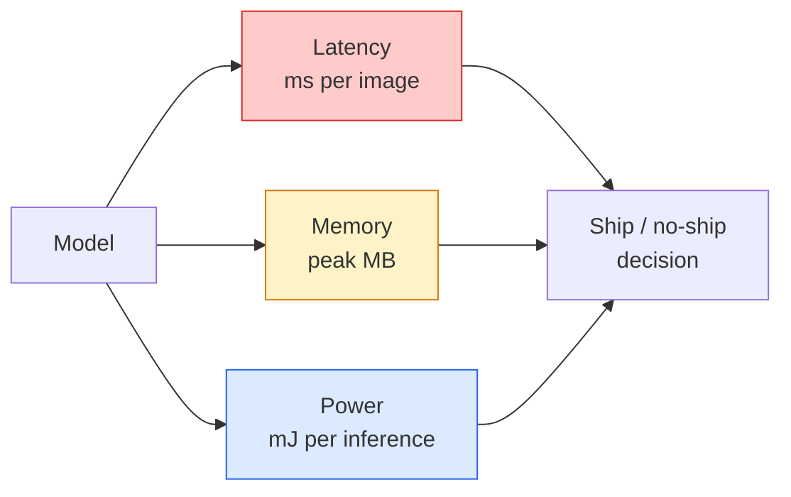

# 实时视觉：边缘部署

> 边缘推理的核心，是让一个 90% 准确率的模型在只有 2 GB RAM 的设备上以 30 fps 运行。每一个百分点的准确率，都要和延迟的毫秒数交换。

**类型：** 学习 + 构建
**语言：** Python
**前置要求：** 阶段 4 第 04 课（图像分类），阶段 10 第 11 课（量化）
**时间：** ~75 分钟

## 学习目标

- 为任意 PyTorch 模型测量推理延迟、峰值内存和吞吐量，并读懂 FLOPs / 参数量 / 延迟之间的取舍
- 使用 PyTorch 的训练后量化把视觉模型量化到 INT8，并验证准确率损失 < 1%
- 导出到 ONNX，并用 ONNX Runtime 或 TensorRT 编译；说出三种最常见的导出失败及其修复方式
- 解释在某个边缘约束下，什么时候选择 MobileNetV3、EfficientNet-Lite、ConvNeXt-Tiny 或 MobileViT

## 问题

训练时的视觉模型是一个浮点怪兽。1 亿参数、每次前向 10 GFLOPs、2 GB 显存。手机、车载信息娱乐单元、工业相机或无人机都装不下这些。交付一个视觉系统，意味着把同样的预测塞进小 100 倍的预算里。

大多数工作由三个旋钮完成：模型选择（用同样 recipe 的更小架构）、量化（用 INT8 代替 FP32）、推理运行时（ONNX Runtime、TensorRT、Core ML、TFLite）。把它们调对，就是工作站上的 demo 和能在 30 美元相机模块上交付的产品之间的区别。

本课先建立测量纪律（无法测量就无法优化），然后走过这三个旋钮。目标不是学会每一种边缘运行时，而是知道有哪些杠杆，并知道如何验证每个杠杆确实做了你以为它会做的事。

## 概念

### 三种预算



- **延迟**：p50、p95、p99。只平均 p50 会隐藏实时系统真正关心的尾部行为。
- **峰值内存**：设备曾经看到的最大值，而不是稳态平均值。它很重要，因为嵌入式目标上的 OOM 是致命的。
- **功耗 / 能耗**：电池供电设备上每次推理消耗的毫焦耳。通常用 CPU/GPU 利用率 * 时间来近似。

边缘部署决策靠的是一张（模型、延迟、内存、准确率）表。每个单元格都必须在目标设备上测量，而不是在工作站上测量。

### 测量纪律

每一次边缘 profile 都应该遵守三条规则：

1. 测量前先用 5-10 次 dummy forward **预热**模型。冷缓存和 JIT 编译会产生不具代表性的第一批数字。
2. 在计时代码块前后用 `torch.cuda.synchronize()` **同步** GPU 工作负载。否则你测到的是 kernel dispatch，而不是 kernel execution。
3. 把输入尺寸**固定**为生产分辨率。224x224 上的延迟不是 512x512 上的延迟。

### 用 FLOPs 做代理指标

FLOPs（每次推理的浮点运算数）是便宜、与设备无关的延迟代理指标。它适合比较架构，但作为绝对 wall-clock 会误导人。一个 FLOPs 多 10% 的模型，实践中可能快 2 倍，因为它使用了硬件友好的算子（depthwise conv 编译得很好，大型 7x7 conv 未必）。

规则：用 FLOPs 做架构搜索，用设备上的延迟做部署决策。

### 一段话理解量化

用 INT8 替换 FP32 权重和激活。模型大小下降 4 倍，内存带宽下降 4 倍；在有 INT8 kernel 的硬件上（现代移动 SoC、带 Tensor Cores 的 NVIDIA GPU）计算量下降 2-4 倍。视觉任务上，训练后静态量化的准确率损失通常是 0.1-1 个百分点。

类型：

- **动态量化**：把权重量化为 INT8，激活仍用 FP 计算。简单，提速较小。
- **静态量化（训练后）**：量化权重，并在小校准集上校准激活范围。比动态量化快得多。
- **量化感知训练（QAT）**：训练时模拟量化，让模型学会绕开它。准确率最好，但需要标注数据。

对视觉来说，训练后静态量化用 5% 的努力给出 95% 的收益。只有当 PTQ 的准确率损失不可接受时才使用 QAT。

### 剪枝与蒸馏

- **剪枝**：移除不重要的权重（基于 magnitude）或通道（结构化）。对过参数化模型效果好；对已经很紧凑的架构帮助较小。
- **蒸馏**：训练一个小 student 去模仿大 teacher 的 logits。通常能恢复大部分因为缩小模型而损失的准确率。生产边缘模型的标准做法。

### 推理运行时

- **PyTorch eager**：慢，不适合部署。只用于开发。
- **TorchScript**：旧方案。已被 `torch.compile` 和 ONNX export 取代。
- **ONNX Runtime**：中立运行时。CPU、CUDA、CoreML、TensorRT、OpenVINO 都有 ONNX provider。从这里开始。
- **TensorRT**：NVIDIA 的编译器。在 NVIDIA GPU（工作站和 Jetson）上延迟最好。可与 ONNX Runtime 集成，也可独立使用。
- **Core ML**：Apple 的 iOS/macOS 运行时。需要 `.mlmodel` 或 `.mlpackage`。
- **TFLite**：Google 的 Android/ARM 运行时。需要 `.tflite`。
- **OpenVINO**：Intel 的 CPU/VPU 运行时。需要 `.xml` + `.bin`。

实践中：PyTorch -> ONNX -> 按目标选择运行时。ONNX 是通用语言。

### 边缘架构选择器

| 预算 | 模型 | 原因 |
|--------|-------|-----|
| < 3M params | MobileNetV3-Small | 到处都能编译，好的 baseline |
| 3-10M | EfficientNet-Lite-B0 | TFLite 上每参数准确率最好 |
| 10-20M | ConvNeXt-Tiny | 每参数准确率最好，对 CPU 友好 |
| 20-30M | MobileViT-S or EfficientViT | 具有 ImageNet 准确率的 Transformer |
| 30-80M | Swin-V2-Tiny | 如果栈支持 window attention |

除非有明确理由不这么做，否则全部量化到 INT8。

## 构建它

### 第 1 步：正确测量延迟

```python
import time
import torch

def measure_latency(model, input_shape, device="cpu", warmup=10, iters=50):
    model = model.to(device).eval()
    x = torch.randn(input_shape, device=device)
    with torch.no_grad():
        for _ in range(warmup):
            model(x)
        if device == "cuda":
            torch.cuda.synchronize()
        times = []
        for _ in range(iters):
            if device == "cuda":
                torch.cuda.synchronize()
            t0 = time.perf_counter()
            model(x)
            if device == "cuda":
                torch.cuda.synchronize()
            times.append((time.perf_counter() - t0) * 1000)
    times.sort()
    return {
        "p50_ms": times[len(times) // 2],
        "p95_ms": times[int(len(times) * 0.95)],
        "p99_ms": times[int(len(times) * 0.99)],
        "mean_ms": sum(times) / len(times),
    }
```

预热、同步、使用 `time.perf_counter()`。报告百分位数，而不只是均值。

### 第 2 步：参数量与 FLOP 计数

```python
def parameter_count(model):
    return sum(p.numel() for p in model.parameters())

def flops_estimate(model, input_shape):
    """
    Rough FLOP count for a conv/linear-only model. For production use `fvcore` or `ptflops`.
    """
    total = 0
    def conv_hook(m, inp, out):
        nonlocal total
        c_out, c_in, kh, kw = m.weight.shape
        h, w = out.shape[-2:]
        total += 2 * c_in * c_out * kh * kw * h * w
    def linear_hook(m, inp, out):
        nonlocal total
        total += 2 * m.in_features * m.out_features
    hooks = []
    for m in model.modules():
        if isinstance(m, torch.nn.Conv2d):
            hooks.append(m.register_forward_hook(conv_hook))
        elif isinstance(m, torch.nn.Linear):
            hooks.append(m.register_forward_hook(linear_hook))
    model.eval()
    with torch.no_grad():
        model(torch.randn(input_shape))
    for h in hooks:
        h.remove()
    return total
```

真实项目中使用 `fvcore.nn.FlopCountAnalysis` 或 `ptflops`；它们会正确处理每种模块类型。

### 第 3 步：训练后静态量化

```python
def quantise_ptq(model, calibration_loader, backend="x86"):
    import torch.ao.quantization as tq
    model = model.eval().cpu()
    model.qconfig = tq.get_default_qconfig(backend)
    tq.prepare(model, inplace=True)
    with torch.no_grad():
        for x, _ in calibration_loader:
            model(x)
    tq.convert(model, inplace=True)
    return model
```

三步：配置、prepare（插入 observers）、用真实数据校准、convert（融合 + 量化）。这要求模型已被融合（`Conv -> BN -> ReLU` -> `ConvBnReLU`），`torch.ao.quantization.fuse_modules` 可以处理。

### 第 4 步：导出到 ONNX

```python
def export_onnx(model, sample_input, path="model.onnx"):
    model = model.eval()
    torch.onnx.export(
        model,
        sample_input,
        path,
        input_names=["input"],
        output_names=["output"],
        dynamic_axes={"input": {0: "batch"}, "output": {0: "batch"}},
        opset_version=17,
    )
    return path
```

`opset_version=17` 是 2026 年安全的默认值。`dynamic_axes` 让你可以用任意 batch size 运行 ONNX 模型。

### 第 5 步：基准测试并比较不同 regime

```python
import torch.nn as nn
from torchvision.models import mobilenet_v3_small

def compare_regimes():
    model = mobilenet_v3_small(weights=None, num_classes=10)
    params = parameter_count(model)
    flops = flops_estimate(model, (1, 3, 224, 224))
    lat_fp32 = measure_latency(model, (1, 3, 224, 224), device="cpu")
    print(f"FP32 MobileNetV3-Small: {params:,} params  {flops/1e9:.2f} GFLOPs  "
          f"p50={lat_fp32['p50_ms']:.2f}ms  p95={lat_fp32['p95_ms']:.2f}ms")
```

对 `resnet50`、`efficientnet_v2_s` 和 `convnext_tiny` 运行同一个函数，你就有了部署决策所需的比较表。

## 使用它

生产栈通常收敛到三条路径之一：

- **Web / serverless**：PyTorch -> ONNX -> ONNX Runtime（CPU 或 CUDA provider）。最简单，对多数场景足够好。
- **NVIDIA edge（Jetson、GPU server）**：PyTorch -> ONNX -> TensorRT。延迟最好，工程投入最大。
- **Mobile**：PyTorch -> ONNX -> Core ML（iOS）或 TFLite（Android）。导出前量化。

测量方面，`torch-tb-profiler`、`nvprof` / `nsys`，以及 macOS 上的 Instruments 可以给出逐层 breakdown。`benchmark_app`（OpenVINO）和 `trtexec`（TensorRT）会给出独立 CLI 数字。

## 交付它

本课产出：

- `outputs/prompt-edge-deployment-planner.md`：一个 prompt，会根据目标设备和延迟 SLA 选择 backbone、量化策略和运行时。
- `outputs/skill-latency-profiler.md`：一个 skill，会写出完整的延迟基准测试脚本，包含预热、同步、百分位数和内存追踪。

## 练习

1. **（简单）** 在 CPU 上测量 `resnet18`、`mobilenet_v3_small`、`efficientnet_v2_s` 和 `convnext_tiny` 在 224x224 下的 p50 延迟。报告表格，并指出哪种架构的 accuracy-per-ms 最好。
2. **（中等）** 对 `mobilenet_v3_small` 应用训练后静态量化。在 CIFAR-10 或类似数据集的 held-out 子集上报告 FP32 vs INT8 延迟和准确率损失。
3. **（困难）** 将 `convnext_tiny` 导出到 ONNX，用 `CPUExecutionProvider` 通过 `onnxruntime` 运行，并与 PyTorch eager baseline 比较延迟。找出 ONNX Runtime 第一个更快的层，并解释原因。

## 关键术语

| 术语 | 人们常说 | 实际含义 |
|------|----------------|----------------------|
| Latency | “有多快” | 从输入到输出的时间；p50/p95/p99 百分位数，不是均值 |
| FLOPs | “模型大小” | 每次前向的浮点运算；计算成本的粗略代理指标 |
| INT8 quantisation | “8-bit” | 用 8 位整数替换 FP32 权重/激活；约小 4 倍、快 2-4 倍 |
| PTQ | “训练后量化” | 不重新训练就量化已训练模型；简单，通常够用 |
| QAT | “量化感知训练” | 训练时模拟量化；准确率最好，需要标注数据 |
| ONNX | “中立格式” | 所有主流推理运行时都支持的模型交换格式 |
| TensorRT | “NVIDIA 编译器” | 把 ONNX 编译成面向 NVIDIA GPU 的优化 engine |
| Distillation | “Teacher -> student” | 训练小模型模仿大模型的 logits；恢复大部分损失的准确率 |

## 延伸阅读

- [EfficientNet (Tan & Le, 2019)](https://arxiv.org/abs/1905.11946) — 高效架构的 compound scaling
- [MobileNetV3 (Howard et al., 2019)](https://arxiv.org/abs/1905.02244) — 移动优先架构，使用 h-swish 和 squeeze-excite
- [A Practical Guide to TensorRT Optimization (NVIDIA)](https://developer.nvidia.com/blog/accelerating-model-inference-with-tensorrt-tips-and-best-practices-for-pytorch-users/) — 如何真正拿到论文里的吞吐数字
- [ONNX Runtime docs](https://onnxruntime.ai/docs/) — 量化、图优化、provider 选择
