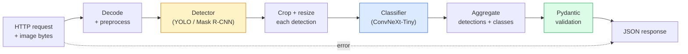

# 构建完整视觉流水线：Capstone

> 生产级视觉系统是一串由数据契约缝合起来的模型和规则。本阶段的组件已经齐了；capstone 会把它们端到端接起来。

**类型：** 构建
**语言：** Python
**前置要求：** 阶段 4 第 01-15 课
**时间：** ~120 分钟

## 学习目标

- 设计一个生产级视觉流水线：检测物体、分类物体，并输出结构化 JSON，同时处理每一条失败路径
- 把 detector（Mask R-CNN 或 YOLO）、classifier（ConvNeXt-Tiny）和数据契约（Pydantic）接入同一个服务
- 对端到端流水线做基准测试，并找出第一个瓶颈（通常先是 preprocessing，然后是 detector）
- 交付一个最小 FastAPI 服务：接受图片上传，运行流水线，并返回带分类的检测结果

## 问题

单个视觉模型有用；视觉产品是一串模型。零售货架审计是 detector 加产品 classifier 加价格 OCR 流水线。自动驾驶是 2D detector 加 3D detector 加 segmenter 加 tracker 加 planner。医疗预筛是 segmenter 加区域 classifier 加临床 UI。

把这些链条接起来，是 ML prototype 和产品之间的分界线。模型之间的每一个接口都是 bug 的新藏身处。每一次坐标变换、每一次归一化、每一次 mask resize，都可能静默失败。流水线的强度取决于它最薄弱的接口。

这个 capstone 会搭出最小可用流水线：detection + classification + structured output + serving layer。阶段 4 的其他内容都能插进这个骨架：把 Mask R-CNN 换成 YOLOv8，加一个 OCR head，加一条 segmentation 分支，加一个 tracker。架构稳定；组件可插拔。

## 概念

### 流水线



七个阶段。两个模型阶段很贵；另外五个阶段是 bug 常住的地方。

### 用 Pydantic 做数据契约

每个模型边界都变成一个 typed object。这样可以把静默失败变成响亮失败。

```
Detection(
    box: tuple[float, float, float, float],   # (x1, y1, x2, y2), absolute pixels
    score: float,                              # [0, 1]
    class_id: int,                             # from detector's label map
    mask: Optional[list[list[int]]],           # RLE-encoded if present
)

PipelineResult(
    image_id: str,
    detections: list[Detection],
    classifications: list[Classification],
    inference_ms: float,
)
```

当 detector 返回的是 `(cx, cy, w, h)` 而不是 `(x1, y1, x2, y2)` 时，Pydantic 的 validation 会在边界处失败，你会立刻发现问题，而不是去调试下游一个静默返回空区域的 crop。

### 延迟花在哪里

几乎每条视觉流水线都满足三个事实：

1. **Preprocessing 往往是最大的单个模块。** 解码 JPEG、转换色彩空间、resize，这些都是 CPU-bound，而且很容易被忘记。
2. **Detector 主导 GPU 时间。** 70-90% 的 GPU 时间在 detection forward pass 上。
3. **Postprocessing（NMS、RLE encode/decode）在 GPU 上便宜，在 CPU 上昂贵。** 一定要用真实目标做 profile。

知道分布，优化才会变成一张有优先级的清单。

### 失败模式

- **空检测**：返回空列表，不要崩溃。记录日志。
- **越界 boxes**：crop 前 clamp 到图像大小。
- **过小 crops**：跳过小于 classifier 最小输入尺寸的 boxes。
- **损坏上传**：返回带具体错误码的 400，而不是 500。
- **模型加载失败**：在服务启动时失败，而不是在第一个请求时失败。

生产流水线要逐个处理这些情况，而不是写一个隐藏故障的泛型 `try/except`。每类失败都有命名 code 和 response。

### Batching

生产服务会服务多个客户端。跨请求 batching detections 和 classifications 可以成倍提高吞吐量。取舍是：等待 batch 填满会增加额外延迟。典型设置：最多收集请求 20ms，拼成 batch，处理，再分发 response。`torchserve` 和 `triton` 原生支持；负载可预测的小服务也可以自己写 micro-batcher。

## 构建它

### 第 1 步：数据契约

```python
from pydantic import BaseModel, Field
from typing import List, Optional, Tuple

class Detection(BaseModel):
    box: Tuple[float, float, float, float]
    score: float = Field(ge=0, le=1)
    class_id: int = Field(ge=0)
    mask_rle: Optional[str] = None


class Classification(BaseModel):
    detection_index: int
    class_id: int
    class_name: str
    score: float = Field(ge=0, le=1)


class PipelineResult(BaseModel):
    image_id: str
    detections: List[Detection]
    classifications: List[Classification]
    inference_ms: float
```

五秒钟的代码，会在任何严肃流水线里省下一小时调试。

### 第 2 步：一个最小 Pipeline 类

```python
import time
import numpy as np
import torch
from PIL import Image

class VisionPipeline:
    def __init__(self, detector, classifier, class_names,
                 device="cpu", min_crop=32):
        self.detector = detector.to(device).eval()
        self.classifier = classifier.to(device).eval()
        self.class_names = class_names
        self.device = device
        self.min_crop = min_crop

    def preprocess(self, image):
        """
        image: PIL.Image or np.ndarray (H, W, 3) uint8
        returns: CHW float tensor on device
        """
        if isinstance(image, Image.Image):
            image = np.asarray(image.convert("RGB"))
        tensor = torch.from_numpy(image).permute(2, 0, 1).float() / 255.0
        return tensor.to(self.device)

    @torch.no_grad()
    def detect(self, image_tensor):
        return self.detector([image_tensor])[0]

    @torch.no_grad()
    def classify(self, crops):
        if len(crops) == 0:
            return []
        batch = torch.stack(crops).to(self.device)
        logits = self.classifier(batch)
        probs = logits.softmax(-1)
        scores, cls = probs.max(-1)
        return list(zip(cls.tolist(), scores.tolist()))

    def run(self, image, image_id="anonymous"):
        t0 = time.perf_counter()
        tensor = self.preprocess(image)
        det = self.detect(tensor)

        crops = []
        detections = []
        valid_indices = []
        for i, (box, score, cls) in enumerate(zip(det["boxes"], det["scores"], det["labels"])):
            x1, y1, x2, y2 = [max(0, int(b)) for b in box.tolist()]
            x2 = min(x2, tensor.shape[-1])
            y2 = min(y2, tensor.shape[-2])
            detections.append(Detection(
                box=(x1, y1, x2, y2),
                score=float(score),
                class_id=int(cls),
            ))
            if (x2 - x1) < self.min_crop or (y2 - y1) < self.min_crop:
                continue
            crop = tensor[:, y1:y2, x1:x2]
            crop = torch.nn.functional.interpolate(
                crop.unsqueeze(0),
                size=(224, 224),
                mode="bilinear",
                align_corners=False,
            )[0]
            crops.append(crop)
            valid_indices.append(i)

        class_preds = self.classify(crops)

        classifications = []
        for valid_idx, (cls_id, cls_score) in zip(valid_indices, class_preds):
            classifications.append(Classification(
                detection_index=valid_idx,
                class_id=int(cls_id),
                class_name=self.class_names[cls_id],
                score=float(cls_score),
            ))

        return PipelineResult(
            image_id=image_id,
            detections=detections,
            classifications=classifications,
            inference_ms=(time.perf_counter() - t0) * 1000,
        )
```

每个接口都有类型。每条失败路径都有明确处理决策。

### 第 3 步：接入 detector 和 classifier

```python
from torchvision.models.detection import maskrcnn_resnet50_fpn_v2
from torchvision.models import convnext_tiny

# Use ImageNet-pretrained weights for a realistic pipeline without training
detector = maskrcnn_resnet50_fpn_v2(weights="DEFAULT")
classifier = convnext_tiny(weights="DEFAULT")
class_names = [f"imagenet_class_{i}" for i in range(1000)]

pipe = VisionPipeline(detector, classifier, class_names)

# Smoke test with a synthetic image
test_image = (np.random.rand(400, 600, 3) * 255).astype(np.uint8)
result = pipe.run(test_image, image_id="demo")
print(result.model_dump_json(indent=2)[:500])
```

### 第 4 步：FastAPI 服务

```python
from fastapi import FastAPI, UploadFile, HTTPException
from io import BytesIO

app = FastAPI()
pipe = None  # initialised on startup

@app.on_event("startup")
def load():
    global pipe
    detector = maskrcnn_resnet50_fpn_v2(weights="DEFAULT").eval()
    classifier = convnext_tiny(weights="DEFAULT").eval()
    pipe = VisionPipeline(detector, classifier, class_names=[f"c{i}" for i in range(1000)])

@app.post("/detect")
async def detect_endpoint(file: UploadFile):
    if file.content_type not in {"image/jpeg", "image/png", "image/webp"}:
        raise HTTPException(status_code=400, detail="unsupported image type")
    data = await file.read()
    try:
        img = Image.open(BytesIO(data)).convert("RGB")
    except Exception:
        raise HTTPException(status_code=400, detail="cannot decode image")
    result = pipe.run(img, image_id=file.filename or "upload")
    return result.model_dump()
```

用 `uvicorn main:app --host 0.0.0.0 --port 8000` 运行。用 `curl -F 'file=@dog.jpg' http://localhost:8000/detect` 测试。

### 第 5 步：对流水线做 benchmark

```python
import time

def benchmark(pipe, num_runs=20, image_size=(400, 600)):
    img = (np.random.rand(*image_size, 3) * 255).astype(np.uint8)
    pipe.run(img)  # warm up

    stages = {"preprocess": [], "detect": [], "classify": [], "total": []}
    for _ in range(num_runs):
        t0 = time.perf_counter()
        tensor = pipe.preprocess(img)
        t1 = time.perf_counter()
        det = pipe.detect(tensor)
        t2 = time.perf_counter()
        crops = []
        for box in det["boxes"]:
            x1, y1, x2, y2 = [max(0, int(b)) for b in box.tolist()]
            x2 = min(x2, tensor.shape[-1])
            y2 = min(y2, tensor.shape[-2])
            if (x2 - x1) >= pipe.min_crop and (y2 - y1) >= pipe.min_crop:
                crop = tensor[:, y1:y2, x1:x2]
                crop = torch.nn.functional.interpolate(
                    crop.unsqueeze(0), size=(224, 224), mode="bilinear", align_corners=False
                )[0]
                crops.append(crop)
        pipe.classify(crops)
        t3 = time.perf_counter()
        stages["preprocess"].append((t1 - t0) * 1000)
        stages["detect"].append((t2 - t1) * 1000)
        stages["classify"].append((t3 - t2) * 1000)
        stages["total"].append((t3 - t0) * 1000)

    for stage, times in stages.items():
        times.sort()
        print(f"{stage:12s}  p50={times[len(times)//2]:7.1f} ms  p95={times[int(len(times)*0.95)]:7.1f} ms")
```

CPU 上的典型输出：preprocess ~3 ms，detect 300-500 ms，classify 20-40 ms，total 350-550 ms。GPU 上 detect 是 20-40 ms，这时 preprocess + classify 在相对比例上开始变得更重要。

## 使用它

生产模板通常收敛到同一种结构，并额外加入：

- **模型版本管理**：始终在 response 中记录模型名和 weights hash。
- **单请求 trace ID**：记录每个请求每个阶段的 timing，方便把慢 response 和具体阶段关联起来。
- **Fallback path**：如果 classifier 超时，返回不带 classifications 的 detections，而不是让整个请求失败。
- **安全过滤器**：NSFW / PII filters 在 classification 之后、response 离开服务之前运行。
- **Batch endpoint**：一个 `/detect_batch`，接受一组图片 URL，用于批处理。

生产 serving 方面，`torchserve`、`Triton Inference Server` 和 `BentoML` 开箱支持 batching、versioning、metrics 和 health checks。直接运行 `FastAPI` 对 prototype 和小规模产品来说没问题。

## 交付它

本课产出：

- `outputs/prompt-vision-service-shape-reviewer.md`：一个 prompt，会检查视觉服务代码中的 contract/response shape 违规，并指出第一个破坏性 bug。
- `outputs/skill-pipeline-budget-planner.md`：一个 skill，会在给定目标延迟和吞吐量后，为每个流水线阶段分配时间预算，并标出哪个阶段会最先超预算。

## 练习

1. **（简单）** 在任意开放数据集的 10 张图片上运行流水线。报告每个阶段的平均耗时，以及每张图 detection 数量的分布。
2. **（中等）** 给 `Detection` 添加一个 mask 输出字段，并把它编码为 RLE。验证即使是 10 个 object 的图片，JSON 仍小于 1MB。
3. **（困难）** 在 classifier 前面加一个 micro-batcher：最多收集 crops 10 ms，在一次 GPU call 里全部分类，再按请求返回结果。测量每秒 5 个并发请求时的吞吐增益和新增延迟。

## 关键术语

| 术语 | 人们常说 | 实际含义 |
|------|----------------|----------------------|
| Pipeline | “系统” | preprocessing、inference 和 postprocessing 步骤的有序链，每对阶段之间都有 typed interface |
| Data contract | “schema” | 每个阶段输入输出都要遵守的 Pydantic / dataclass 定义；在边界捕获集成 bug |
| Preprocessing | “模型之前” | 解码、色彩转换、resize、normalize；通常是最大的 CPU 时间消耗 |
| Postprocessing | “模型之后” | NMS、mask resize、threshold、RLE encode；GPU 上便宜，CPU 上昂贵 |
| Microbatcher | “收集再 forward” | 等待固定窗口以收集多个请求，然后运行一次 batched forward pass 的聚合器 |
| Trace ID | “request id” | 每个请求的标识符，在每个阶段记录，便于端到端追踪慢请求 |
| Failure code | “命名错误” | 每类失败都有具体错误码，而不是泛型 500；支持客户端 retry logic |
| Health check | “readiness probe” | 报告服务是否能响应的轻量 endpoint；loadbalancer 依赖它 |

## 延伸阅读

- [Full Stack Deep Learning — Deploying Models](https://fullstackdeeplearning.com/course/2022/lecture-5-deployment/) — 生产 ML 部署的经典概览
- [BentoML docs](https://docs.bentoml.com) — 支持 batching、versioning 和 metrics 的 serving framework
- [torchserve docs](https://pytorch.org/serve/) — PyTorch 官方 serving library
- [NVIDIA Triton Inference Server](https://developer.nvidia.com/triton-inference-server) — 支持 batching 和多模型的高吞吐 serving
