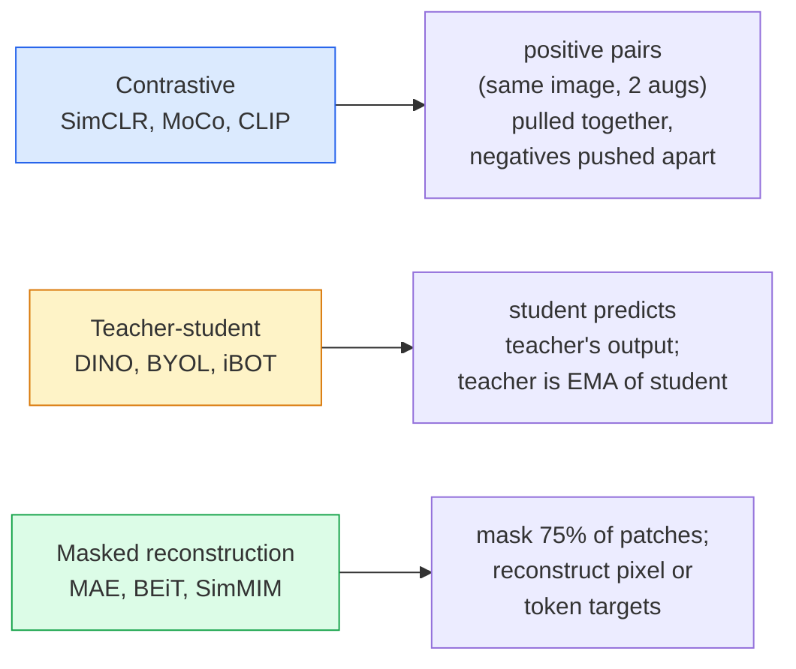

# 自监督视觉：SimCLR、DINO、MAE

> 标注是监督视觉的瓶颈。自监督预训练会移除它：从 1 亿张未标注图片中学习视觉特征，再用 1 万张标注图片微调。

**类型：** 学习 + 构建
**语言：** Python
**前置要求：** 阶段 4 第 04 课（图像分类），阶段 4 第 14 课（ViT）
**时间：** ~75 分钟

## 学习目标

- 追踪三大自监督家族：contrastive（SimCLR）、teacher-student（DINO）、masked reconstruction（MAE），并说明每种方法在优化什么
- 从零实现 InfoNCE loss，并解释为什么 batch size 512 可行而 batch size 32 会失败
- 解释为什么 MAE 的 75% masking ratio 不是随便选的，以及它和 BERT 文本中的 15% 有何不同
- 使用 DINOv2 或 MAE ImageNet checkpoint 做 linear probing 和 zero-shot retrieval

## 问题

监督式 ImageNet 有 130 万张标注图片，据估算标注成本约 1000 万美元。医疗和工业数据集更小，而且标注更贵。每个视觉团队都会问：能不能先在廉价的未标注数据上预训练，比如 YouTube 帧、web crawl、webcam footage、卫星扫图，然后再用少量标注集微调？

答案是自监督学习。一个在 LAION 或 JFT 上训练的现代自监督 ViT，在微调后能达到或超过监督式 ImageNet 准确率。它迁移到下游任务（detection、segmentation、depth）时也比监督预训练更好。DINOv2（Meta，2023）和 MAE（Meta，2022）是当前生产中可迁移视觉特征的默认选择。

概念上的转变是：pretext task，也就是模型训练时要做的事情，不必等于下游任务。重要的是它是否迫使模型学到有用特征。预测灰度图的颜色、旋转图片并让模型分类旋转角度、mask patches 并重建它们，这些都有效。真正能扩展起来的三类方法是 contrastive learning、teacher-student distillation 和 masked reconstruction。

## 概念

### 三个家族



### Contrastive learning（SimCLR）

取一张图片，应用两次随机增强，得到两个 view。两者都经过同一个 encoder 加 projection head。最小化一个 loss：让“这两个 embedding 应该接近”，并让“这个 embedding 应该远离 batch 中所有其他图片的 embeddings”。

```
Loss for positive pair (z_i, z_j) among 2N views per batch:

   L_ij = -log( exp(sim(z_i, z_j) / tau) / sum_k in batch \ {i} exp(sim(z_i, z_k) / tau) )

sim = cosine similarity
tau = temperature (0.1 standard)
```

这就是 InfoNCE loss。它要求每个 positive 有很多 negatives，所以 batch size 很重要：SimCLR 需要 512-8192。MoCo 引入了历史 batch 的 momentum queue，把 negative 数量和 batch size 解耦。

### Teacher-student（DINO）

两个架构相同的网络：student 和 teacher。teacher 是 student 权重的 exponential moving average（EMA）。两者都看同一张图片的增强 view。student 的输出被训练成匹配 teacher，没有显式 negatives。

```
loss = CE( student_output(view_1),  teacher_output(view_2) )
     + CE( student_output(view_2),  teacher_output(view_1) )

teacher_weights = m * teacher_weights + (1 - m) * student_weights   (m ≈ 0.996)
```

为什么它不会 collapse 成“预测一个常量”：teacher 的输出会被 centered（减去每个维度的均值）并 sharpened（除以小 temperature）。Centering 防止某一个维度主导；sharpening 防止输出 collapse 成 uniform。

DINO 正是 DINOv2 扩展到 1.42 亿张精心筛选图片的基础。得到的特征是 zero-shot visual retrieval 和 dense prediction 的当前 SOTA。

### Masked reconstruction（MAE）

Mask ViT 输入中 75% 的 patches。只把可见的 25% 送入 encoder。一个小 decoder 接收 encoder 输出和 masked 位置上的 mask tokens，并被训练去重建 masked patches 的像素。

```
Encoder:  visible 25% of patches -> features
Decoder:  features + mask tokens at masked positions -> reconstructed pixels
Loss:     MSE between reconstructed and original pixels on masked patches only
```

让 MAE 有效的关键设计：

- **75% mask ratio**：很高。它迫使 encoder 学习语义特征；只重建 25% 会近乎平凡（相邻像素相关性太强，CNN 可以轻松搞定）。
- **非对称 encoder/decoder**：大的 ViT encoder 只看可见 patches；小 decoder（8-layer、512-dim）负责重建。比 naive BEiT 预训练快 3 倍。
- **像素空间重建目标**：比 BEiT 的 tokenized target 更简单，在 ViT 上效果更好。

预训练完成后，丢掉 decoder。encoder 就是 feature extractor。

### 为什么是 75%，不是 15%

BERT mask 15% 的 tokens。MAE mask 75%。差别在信息密度。

- 自然语言每个 token 的熵很高。预测 15% 的 token 仍然很难，因为每个 masked 位置都有很多合理补全。
- 图像 patch 的熵低；一个未 mask 的邻域通常几乎精确决定 masked patch 的像素。要让预测真正需要语义理解，就必须激进地 mask。

75% 足够高，简单空间外推无法解决任务；encoder 必须表示图像内容。

### Linear-probe evaluation

自监督预训练之后，标准评估是 **linear probe**：冻结 encoder，在上面训练一个单线性 classifier，使用 ImageNet labels。报告 top-1 accuracy。

- SimCLR ResNet-50：~71%（2020）
- DINO ViT-S/16：~77%（2021）
- MAE ViT-L/16：~76%（2022）
- DINOv2 ViT-g/14：~86%（2023）

Linear probe 是纯粹的特征质量度量；fine-tuning 通常会再增加 2-5 个点，但也混入了 head retraining 的影响。

## 构建它

### 第 1 步：Two-view augmentation pipeline

```python
import torch
import torchvision.transforms as T

two_view_train = lambda: T.Compose([
    T.RandomResizedCrop(96, scale=(0.2, 1.0)),
    T.RandomHorizontalFlip(),
    T.ColorJitter(0.4, 0.4, 0.4, 0.1),
    T.RandomGrayscale(p=0.2),
    T.ToTensor(),
])


class TwoViewDataset(torch.utils.data.Dataset):
    def __init__(self, base):
        self.base = base
        self.aug = two_view_train()

    def __len__(self):
        return len(self.base)

    def __getitem__(self, i):
        img, _ = self.base[i]
        v1 = self.aug(img)
        v2 = self.aug(img)
        return v1, v2
```

每次 `__getitem__` 返回同一张图片的两个增强 views；不需要 labels。

### 第 2 步：InfoNCE loss

```python
import torch.nn.functional as F

def info_nce(z1, z2, tau=0.1):
    """
    z1, z2: (N, D) L2-normalised embeddings of paired views
    """
    N, D = z1.shape
    z = torch.cat([z1, z2], dim=0)  # (2N, D)
    sim = z @ z.T / tau              # (2N, 2N)

    mask = torch.eye(2 * N, dtype=torch.bool, device=z.device)
    sim = sim.masked_fill(mask, float("-inf"))

    targets = torch.cat([torch.arange(N, 2 * N), torch.arange(0, N)]).to(z.device)
    return F.cross_entropy(sim, targets)
```

调用前先对 embeddings 做 L2-normalise。`tau=0.1` 是 SimCLR 默认值；更低会让 loss 更尖锐，并要求更多 negatives。

### 第 3 步：InfoNCE sanity check

```python
z1 = F.normalize(torch.randn(16, 32), dim=-1)
z2 = z1.clone()
loss_same = info_nce(z1, z2, tau=0.1).item()
z2_random = F.normalize(torch.randn(16, 32), dim=-1)
loss_random = info_nce(z1, z2_random, tau=0.1).item()
print(f"InfoNCE with identical pairs:  {loss_same:.3f}")
print(f"InfoNCE with random pairs:     {loss_random:.3f}")
```

相同 pairs 应该得到低 loss（在大 batch 和低 temperature 下接近 0）。随机 pairs 应该接近 log(2N-1) = ~log(31) = ~3.4（16-pair batch）。

### 第 4 步：MAE-style masking

```python
def random_mask_indices(num_patches, mask_ratio=0.75, seed=0):
    g = torch.Generator().manual_seed(seed)
    n_keep = int(num_patches * (1 - mask_ratio))
    perm = torch.randperm(num_patches, generator=g)
    visible = perm[:n_keep]
    masked = perm[n_keep:]
    return visible.sort().values, masked.sort().values


num_patches = 196
visible, masked = random_mask_indices(num_patches, mask_ratio=0.75)
print(f"visible: {len(visible)} / {num_patches}")
print(f"masked:  {len(masked)} / {num_patches}")
```

简单、快速，并且对给定 seed 是确定性的。真实 MAE 实现会 batch 化这个过程，并保留每个 sample 的 mask。

## 使用它

DINOv2 是 2026 年的生产标准：

```python
import torch
from transformers import AutoImageProcessor, AutoModel

processor = AutoImageProcessor.from_pretrained("facebook/dinov2-base")
model = AutoModel.from_pretrained("facebook/dinov2-base")
model.eval()

# Per-image embeddings for zero-shot retrieval
with torch.no_grad():
    inputs = processor(images=[pil_image], return_tensors="pt")
    outputs = model(**inputs)
    embedding = outputs.last_hidden_state[:, 0]  # CLS token
```

得到的 768-dim embedding 是现代 image retrieval、dense correspondence 和 zero-shot transfer pipelines 的 backbone。在下游任务上 fine-tuning 通常只需要一个 linear head。

对 image-text embeddings 来说，SigLIP 或 OpenCLIP 是等价选择；对 MAE-style fine-tuning 来说，`timm` repo 提供所有 MAE checkpoint。

## 交付它

本课产出：

- `outputs/prompt-ssl-pretraining-picker.md`：一个 prompt，会根据数据集大小、算力和下游任务选择 SimCLR / MAE / DINOv2。
- `outputs/skill-linear-probe-runner.md`：一个 skill，会为任意 frozen encoder + labelled dataset 写出 linear-probe evaluation。

## 练习

1. **（简单）** 验证当 embeddings 对齐良好时，降低 temperature 会让 InfoNCE loss 下降；当 embeddings 随机时，降低 temperature 会让 loss 上升。画一张 `tau in [0.05, 0.1, 0.2, 0.5]` vs loss 的图。
2. **（中等）** 实现一个 DINO-style centre buffer。展示如果没有 centring，student 会在几个 epoch 内 collapse 成常量向量。
3. **（困难）** 使用第 10 课的 TinyUNet 作为 backbone，在 CIFAR-100 上训练 MAE。报告 10、50 和 200 epochs 的 linear-probe accuracy。展示在同一个 1,000-image 子集上，MAE-pretrained linear probe 优于 from-scratch supervised linear probe。

## 关键术语

| 术语 | 人们常说 | 实际含义 |
|------|----------------|----------------------|
| Self-supervised | “无标签” | 从未标注数据产生有用 representation 的 pretext task |
| Pretext task | “假的任务” | SSL 期间使用的目标（重建 patches、匹配 views）；预训练后丢弃 |
| Linear probe | “Frozen encoder + linear head” | 标准 SSL 评估：只在 frozen features 上训练一个 linear classifier |
| InfoNCE | “Contrastive loss” | 对 cosine similarities 做 softmax；positive pair 是目标类别，其余都是 negatives |
| EMA teacher | “Moving-average teacher” | 权重是 student 指数移动平均的 teacher；BYOL、MoCo、DINO 使用 |
| Mask ratio | “隐藏的 patch 百分比” | MAE 中被 mask 的 patch 比例；视觉用 75%，文本用 15% |
| Representation collapse | “常量输出” | SSL 失败模式，encoder 对所有输入输出同一个常量向量；由 centring、sharpening 或 negatives 防止 |
| DINOv2 | “生产 SSL backbone” | Meta 2023 年的自监督 ViT；2026 年最强的通用图像特征 |

## 延伸阅读

- [SimCLR (Chen et al., 2020)](https://arxiv.org/abs/2002.05709) — contrastive learning 参考
- [DINO (Caron et al., 2021)](https://arxiv.org/abs/2104.14294) — 使用 momentum、centring、sharpening 的 teacher-student
- [MAE (He et al., 2022)](https://arxiv.org/abs/2111.06377) — 面向 ViT 的 masked autoencoder pretraining
- [DINOv2 (Oquab et al., 2023)](https://arxiv.org/abs/2304.07193) — 将自监督 ViT 扩展到生产级特征
